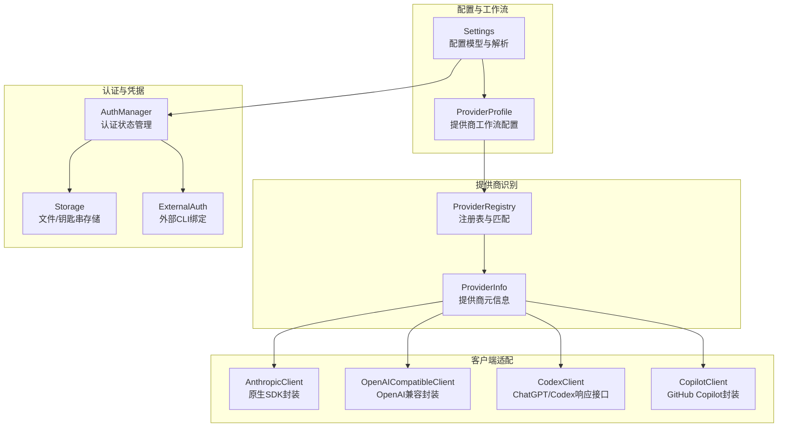
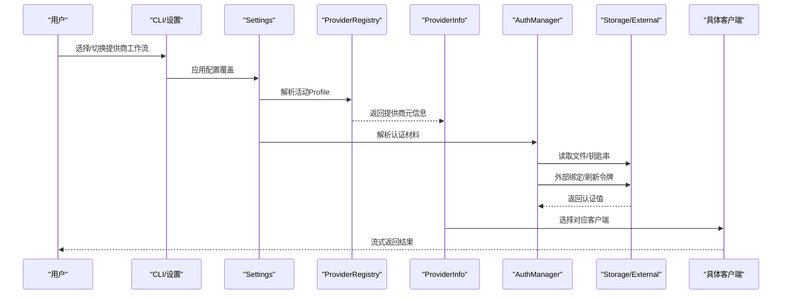
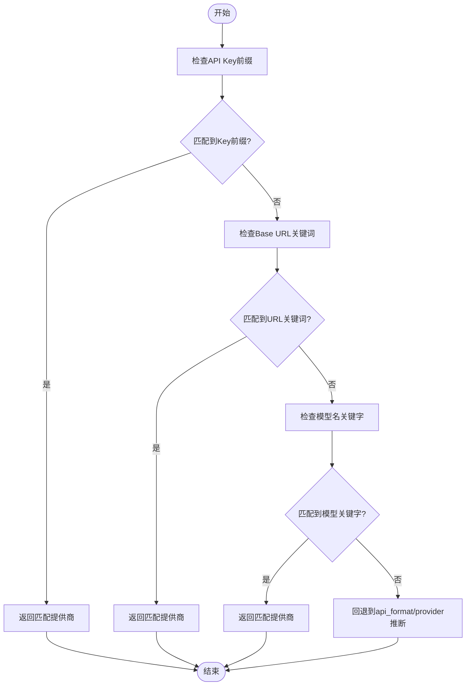
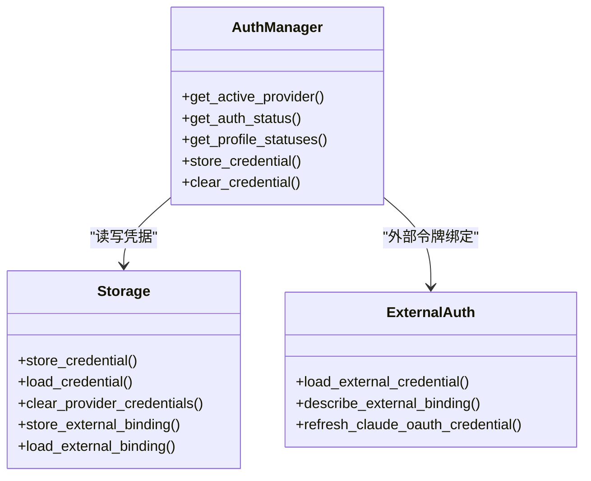
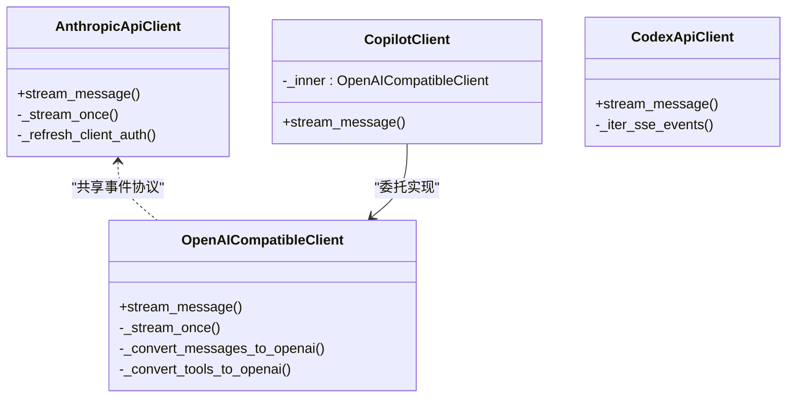
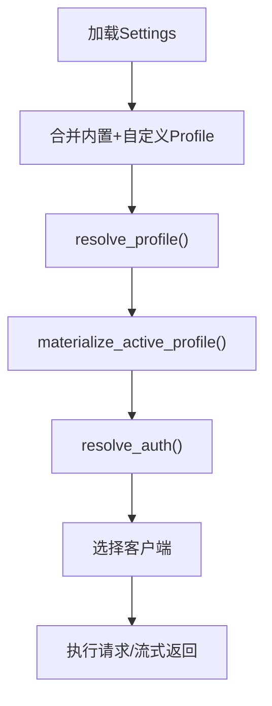
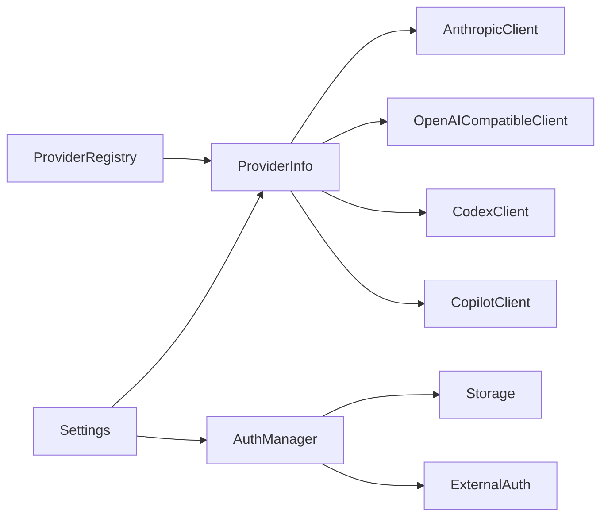

# AI 提供商集成

<cite>
**本文档引用的文件**
- [provider.py](file://src/openharness/api/provider.py)
- [registry.py](file://src/openharness/api/registry.py)
- [client.py](file://src/openharness/api/client.py)
- [openai_client.py](file://src/openharness/api/openai_client.py)
- [codex_client.py](file://src/openharness/api/codex_client.py)
- [copilot_client.py](file://src/openharness/api/copilot_client.py)
- [copilot_auth.py](file://src/openharness/api/copilot_auth.py)
- [manager.py](file://src/openharness/auth/manager.py)
- [storage.py](file://src/openharness/auth/storage.py)
- [external.py](file://src/openharness/auth/external.py)
- [settings.py](file://src/openharness/config/settings.py)
- [cli.py](file://src/openharness/cli.py)
</cite>

## 目录
1. [简介](#简介)
2. [项目结构](#项目结构)
3. [核心组件](#核心组件)
4. [架构总览](#架构总览)
5. [详细组件分析](#详细组件分析)
6. [依赖关系分析](#依赖关系分析)
7. [性能考虑](#性能考虑)
8. [故障排除指南](#故障排除指南)
9. [结论](#结论)
10. [附录](#附录)

## 简介
本文件系统化梳理 OpenHarness 对多 AI 提供商的支持与集成方式，覆盖 Anthropic、OpenAI 兼容生态（含 Moonshot/Kimi）、GitHub Copilot、OpenAI Codex、以及 Claude 订阅等。内容包括：提供商识别与自动检测、认证与凭据管理、多提供商工作流、配置文件与凭据存储、自定义提供商接入指南、故障排除与性能优化建议。

## 项目结构
OpenHarness 将“提供商注册表”“客户端适配层”“认证与凭据管理”“配置与工作流”分层组织，形成可扩展的统一调用入口。

**图表来源**
- [settings.py:534-626](file://src/openharness/config/settings.py#L534-L626)
- [registry.py:408-437](file://src/openharness/api/registry.py#L408-L437)
- [provider.py:42-94](file://src/openharness/api/provider.py#L42-L94)
- [manager.py:71-115](file://src/openharness/auth/manager.py#L71-L115)
- [storage.py:122-164](file://src/openharness/auth/storage.py#L122-L164)
- [external.py:116-141](file://src/openharness/auth/external.py#L116-L141)
- [client.py:118-151](file://src/openharness/api/client.py#L118-L151)
- [openai_client.py:260-277](file://src/openharness/api/openai_client.py#L260-L277)
- [codex_client.py:221-227](file://src/openharness/api/codex_client.py#L221-L227)
- [copilot_client.py:48-110](file://src/openharness/api/copilot_client.py#L48-L110)

**章节来源**
- [settings.py:534-626](file://src/openharness/config/settings.py#L534-L626)
- [registry.py:408-437](file://src/openharness/api/registry.py#L408-L437)
- [provider.py:42-94](file://src/openharness/api/provider.py#L42-L94)
- [manager.py:71-115](file://src/openharness/auth/manager.py#L71-L115)
- [storage.py:122-164](file://src/openharness/auth/storage.py#L122-L164)
- [external.py:116-141](file://src/openharness/auth/external.py#L116-L141)
- [client.py:118-151](file://src/openharness/api/client.py#L118-L151)
- [openai_client.py:260-277](file://src/openharness/api/openai_client.py#L260-L277)
- [codex_client.py:221-227](file://src/openharness/api/codex_client.py#L221-L227)
- [copilot_client.py:48-110](file://src/openharness/api/copilot_client.py#L48-L110)

## 核心组件
- 提供商注册与识别：通过 ProviderRegistry 统一登记各提供商的关键特征（名称、关键词、默认URL、检测信号），支持按 API Key 前缀、Base URL 关键词、模型名关键字进行自动匹配。
- 认证与凭据：支持环境变量、内置文件存储、系统钥匙串；对订阅型（Codex/Claude）支持外部 CLI 管理的令牌绑定与刷新。
- 客户端适配：为 Anthropic 原生 SDK、OpenAI 兼容接口、GitHub Copilot、ChatGPT/Codex 响应接口分别封装，统一事件流协议以供上层查询引擎使用。
- 配置与工作流：ProviderProfile 将“提供商类型 + 认证来源 + 默认模型 + Base URL”打包为可切换的工作流，Settings 负责解析优先级与材料化。

**章节来源**
- [registry.py:17-48](file://src/openharness/api/registry.py#L17-L48)
- [provider.py:42-94](file://src/openharness/api/provider.py#L42-L94)
- [manager.py:71-115](file://src/openharness/auth/manager.py#L71-L115)
- [storage.py:122-164](file://src/openharness/auth/storage.py#L122-L164)
- [external.py:116-141](file://src/openharness/auth/external.py#L116-L141)
- [client.py:118-151](file://src/openharness/api/client.py#L118-L151)
- [openai_client.py:260-277](file://src/openharness/api/openai_client.py#L260-L277)
- [codex_client.py:221-227](file://src/openharness/api/codex_client.py#L221-L227)
- [copilot_client.py:48-110](file://src/openharness/api/copilot_client.py#L48-L110)
- [settings.py:116-140](file://src/openharness/config/settings.py#L116-L140)

## 架构总览
OpenHarness 的“提供商集成”由以下关键路径构成：
- 配置解析：Settings 合并 CLI/环境/配置文件/默认值，生成活动 Profile。
- 提供商推断：ProviderRegistry + ProviderInfo 自动识别当前后端类型与认证方式。
- 凭据解析：AuthManager + Storage/External 解析 API Key 或外部订阅令牌。
- 客户端选择：根据 ProviderInfo 选择 Anthropic/OpenAI/Copilot/Codex 客户端，统一事件流接口。
- 工作流切换：通过 provider profile 快速在不同提供商间切换，保持一致的调用体验。

**图表来源**
- [settings.py:596-626](file://src/openharness/config/settings.py#L596-L626)
- [registry.py:408-437](file://src/openharness/api/registry.py#L408-L437)
- [provider.py:42-94](file://src/openharness/api/provider.py#L42-L94)
- [manager.py:186-289](file://src/openharness/auth/manager.py#L186-L289)
- [storage.py:122-164](file://src/openharness/auth/storage.py#L122-L164)
- [external.py:116-141](file://src/openharness/auth/external.py#L116-L141)
- [client.py:118-151](file://src/openharness/api/client.py#L118-L151)

## 详细组件分析

### 提供商注册与识别
- 注册表结构：ProviderSpec 描述提供商身份、路由、检测信号与分类标志，顺序决定匹配优先级。
- 匹配策略：先按 API Key 前缀（如 OpenRouter 的 sk-or-），再按 Base URL 关键词（如 openrouter、moonshot），最后按模型名关键字（如 qwen、gemini）。
- 推断逻辑：ProviderInfo 在未显式指定时，基于注册表与 api_format/provider/model/base_url 综合判断，给出名称、认证方式与语音能力提示。

**图表来源**
- [registry.py:408-437](file://src/openharness/api/registry.py#L408-L437)
- [provider.py:42-94](file://src/openharness/api/provider.py#L42-L94)

**章节来源**
- [registry.py:17-48](file://src/openharness/api/registry.py#L17-L48)
- [registry.py:408-437](file://src/openharness/api/registry.py#L408-L437)
- [provider.py:42-94](file://src/openharness/api/provider.py#L42-L94)

### 认证与凭据管理
- 支持的认证来源：
  - API Key：环境变量或文件存储（支持系统钥匙串后备）。
  - 外部订阅：Codex/Claude 订阅令牌，来自外部 CLI 管理的 JSON/钥匙串。
  - OAuth：GitHub Copilot 使用设备码流程，持久化 OAuth Token。
- 存储机制：
  - 文件存储：~/.openharness/credentials.json，权限 600；支持加锁写入。
  - 钥匙串：可用时优先使用，不可用则回退文件存储。
  - 外部绑定：记录外部 CLI 管理的令牌位置与来源，便于刷新与状态描述。
- 状态查询：AuthManager 提供“已配置/来源/状态/详情/活跃”等聚合视图，便于 UI 与 CLI 展示。

**图表来源**
- [manager.py:71-115](file://src/openharness/auth/manager.py#L71-L115)
- [storage.py:122-164](file://src/openharness/auth/storage.py#L122-L164)
- [external.py:116-141](file://src/openharness/auth/external.py#L116-L141)

**章节来源**
- [manager.py:116-184](file://src/openharness/auth/manager.py#L116-L184)
- [manager.py:186-289](file://src/openharness/auth/manager.py#L186-L289)
- [storage.py:122-164](file://src/openharness/auth/storage.py#L122-L164)
- [storage.py:198-227](file://src/openharness/auth/storage.py#L198-L227)
- [external.py:116-141](file://src/openharness/auth/external.py#L116-L141)
- [external.py:295-342](file://src/openharness/auth/external.py#L295-L342)
- [external.py:413-475](file://src/openharness/auth/external.py#L413-L475)

### 客户端适配层
- Anthropic 原生客户端：封装 AsyncAnthropic，支持重试、流式事件、OAuth Beta 头与会话标识，自动处理认证错误与速率限制。
- OpenAI 兼容客户端：统一消息格式转换、工具函数调用映射、推理内容剥离、令牌上限字段兼容（max_tokens/max_completion_tokens）。
- GitHub Copilot 客户端：直接复用 OpenAI 兼容封装，注入 Copilot 特定头与默认模型，支持企业版与公共版 API 基址。
- ChatGPT/Codex 客户端：基于 SSE 的响应流，解析输出文本/函数调用/完成状态，支持理由内容（reasoning）处理与错误格式化。

**图表来源**
- [client.py:118-151](file://src/openharness/api/client.py#L118-L151)
- [openai_client.py:260-277](file://src/openharness/api/openai_client.py#L260-L277)
- [copilot_client.py:48-110](file://src/openharness/api/copilot_client.py#L48-L110)
- [codex_client.py:221-227](file://src/openharness/api/codex_client.py#L221-L227)

**章节来源**
- [client.py:118-151](file://src/openharness/api/client.py#L118-L151)
- [openai_client.py:260-277](file://src/openharness/api/openai_client.py#L260-L277)
- [copilot_client.py:48-110](file://src/openharness/api/copilot_client.py#L48-L110)
- [codex_client.py:221-227](file://src/openharness/api/codex_client.py#L221-L227)

### 多提供商工作流程与配置文件管理
- 工作流（ProviderProfile）：将“提供商类型 + API 格式 + 认证来源 + 默认模型 + Base URL + 模型白名单/上下文窗口”打包，支持内置与自定义。
- 切换机制：通过 active_profile 快速在不同提供商间切换，Materialize/同步逻辑确保旧字段与新配置层一致。
- 配置优先级：CLI > 环境变量 > 配置文件 > 默认值；Settings.resolve_profile 与 resolve_auth 统一解析。
- 多模型与多提供商：通过 allowed_models、context_window_tokens、auto_compact_threshold_tokens 控制不同提供商的适配行为。

**图表来源**
- [settings.py:581-626](file://src/openharness/config/settings.py#L581-L626)
- [settings.py:691-800](file://src/openharness/config/settings.py#L691-L800)

**章节来源**
- [settings.py:116-140](file://src/openharness/config/settings.py#L116-L140)
- [settings.py:581-626](file://src/openharness/config/settings.py#L581-L626)
- [settings.py:691-800](file://src/openharness/config/settings.py#L691-L800)

### 自定义提供商添加指南
- 步骤
  1) 在注册表中新增 ProviderSpec，填写 name/keywords/env_key/display_name/backend_type/default_base_url/detect_by_key_prefix/detect_by_base_keyword/is_gateway/is_local/is_oauth。
  2) 若为 OpenAI 兼容，可直接复用 OpenAICompatibleClient；若为原生 SDK（如 Anthropic），封装对应客户端。
  3) 在 Settings 的 ProviderProfile 中添加工作流，设置 auth_source、default_model、base_url、credential_slot 等。
  4) 如需外部订阅令牌，使用 ExternalAuthBinding 记录来源，并在 AuthManager 中暴露状态查询。
- 兼容性要求
  - 事件流接口一致性：所有客户端实现 SupportsStreamingMessages 协议，返回 ApiStreamEvent（文本增量/完整消息/重试事件）。
  - 错误映射：将上游异常映射为统一的 OpenHarnessApiError 子类（认证失败/速率限制/请求失败）。
  - 模型命名与工具调用：遵循 OpenAI 兼容的消息/工具格式转换规则，必要时处理推理内容（reasoning_content）。
- 配置示例（路径参考）
  - 新增注册项：[registry.py:55-368](file://src/openharness/api/registry.py#L55-L368)
  - 客户端封装：[openai_client.py:260-277](file://src/openharness/api/openai_client.py#L260-L277)
  - 认证状态：[manager.py:186-289](file://src/openharness/auth/manager.py#L186-L289)

**章节来源**
- [registry.py:55-368](file://src/openharness/api/registry.py#L55-L368)
- [openai_client.py:260-277](file://src/openharness/api/openai_client.py#L260-L277)
- [manager.py:186-289](file://src/openharness/auth/manager.py#L186-L289)

## 依赖关系分析
- 组件耦合
  - ProviderRegistry 与 ProviderInfo 低耦合，仅通过字符串标识交互。
  - 客户端层与 ProviderInfo 解耦，通过统一事件协议对接。
  - 认证层与存储/外部模块解耦，通过 AuthManager 聚合。
- 外部依赖
  - Anthropic SDK（异步）、OpenAI SDK（异步）、HTTPX（SSE）。
  - 系统钥匙串（可选）。
- 可能的循环依赖
  - 无直接循环；认证状态查询与客户端解析通过 Settings 间接耦合。

**图表来源**
- [registry.py:408-437](file://src/openharness/api/registry.py#L408-L437)
- [provider.py:42-94](file://src/openharness/api/provider.py#L42-L94)
- [client.py:118-151](file://src/openharness/api/client.py#L118-L151)
- [openai_client.py:260-277](file://src/openharness/api/openai_client.py#L260-L277)
- [codex_client.py:221-227](file://src/openharness/api/codex_client.py#L221-L227)
- [copilot_client.py:48-110](file://src/openharness/api/copilot_client.py#L48-L110)
- [settings.py:596-626](file://src/openharness/config/settings.py#L596-L626)
- [manager.py:186-289](file://src/openharness/auth/manager.py#L186-L289)
- [storage.py:122-164](file://src/openharness/auth/storage.py#L122-L164)
- [external.py:116-141](file://src/openharness/auth/external.py#L116-L141)

**章节来源**
- [registry.py:408-437](file://src/openharness/api/registry.py#L408-L437)
- [provider.py:42-94](file://src/openharness/api/provider.py#L42-L94)
- [client.py:118-151](file://src/openharness/api/client.py#L118-L151)
- [openai_client.py:260-277](file://src/openharness/api/openai_client.py#L260-L277)
- [codex_client.py:221-227](file://src/openharness/api/codex_client.py#L221-L227)
- [copilot_client.py:48-110](file://src/openharness/api/copilot_client.py#L48-L110)
- [settings.py:596-626](file://src/openharness/config/settings.py#L596-L626)
- [manager.py:186-289](file://src/openharness/auth/manager.py#L186-L289)
- [storage.py:122-164](file://src/openharness/auth/storage.py#L122-L164)
- [external.py:116-141](file://src/openharness/auth/external.py#L116-L141)

## 性能考虑
- 重试与退避：客户端内置指数退避与抖动，结合 Retry-After 头优化瞬时故障恢复。
- 流式传输：统一事件流减少内存占用，提升交互响应速度。
- 上下文与令牌限制：通过 context_window_tokens/auto_compact_threshold_tokens 控制对话压缩阈值，避免超限。
- 多提供商切换：Profile 缓存与懒加载（AuthManager 延迟导入）降低启动开销。
- 建议
  - 合理设置 max_tokens 与模型参数，避免不必要的长上下文。
  - 使用系统钥匙串减少磁盘读写，提高认证效率。
  - 对第三方网关适当增加超时与重试次数，平衡稳定性与延迟。

[本节为通用指导，无需特定文件引用]

## 故障排除指南
- 认证缺失
  - 症状：auth_status 显示 missing，运行时报错。
  - 排查：确认环境变量、配置文件、外部绑定是否正确；使用 AuthManager.get_auth_status 获取详细状态。
  - 参考：[provider.py:97-126](file://src/openharness/api/provider.py#L97-L126)、[manager.py:186-289](file://src/openharness/auth/manager.py#L186-L289)
- 第三方 Anthropic 端点
  - 症状：Claude 订阅认证拒绝第三方 Base URL。
  - 处理：改用 API Key 方式的 Anthropic 兼容 Profile。
  - 参考：[settings.py:751-755](file://src/openharness/config/settings.py#L751-L755)
- Copilot 企业版
  - 症状：无法连接企业 Copilot API。
  - 处理：确认 copilot_auth.json 中 enterprise_url，或在 CopilotClient 初始化时传入。
  - 参考：[copilot_auth.py:48-57](file://src/openharness/api/copilot_auth.py#L48-L57)、[copilot_client.py:67-86](file://src/openharness/api/copilot_client.py#L67-L86)
- Codex/JWT 令牌
  - 症状：Codex 访问令牌无效或缺少账户信息。
  - 处理：校验 JWT 结构与 claims，确保 chatgpt_account_id 存在。
  - 参考：[codex_client.py:30-46](file://src/openharness/api/codex_client.py#L30-L46)
- 速率限制与网络错误
  - 症状：429/超时/网络错误频繁。
  - 处理：启用重试、调整并发、检查上游配额与网络策略。
  - 参考：[client.py:87-95](file://src/openharness/api/client.py#L87-L95)、[openai_client.py:432-439](file://src/openharness/api/openai_client.py#L432-L439)

**章节来源**
- [provider.py:97-126](file://src/openharness/api/provider.py#L97-L126)
- [manager.py:186-289](file://src/openharness/auth/manager.py#L186-L289)
- [settings.py:751-755](file://src/openharness/config/settings.py#L751-L755)
- [copilot_auth.py:48-57](file://src/openharness/api/copilot_auth.py#L48-L57)
- [copilot_client.py:67-86](file://src/openharness/api/copilot_client.py#L67-L86)
- [codex_client.py:30-46](file://src/openharness/api/codex_client.py#L30-L46)
- [client.py:87-95](file://src/openharness/api/client.py#L87-L95)
- [openai_client.py:432-439](file://src/openharness/api/openai_client.py#L432-L439)

## 结论
OpenHarness 通过“注册表 + 适配器 + 认证管理 + 配置工作流”的分层设计，实现了对多提供商的统一接入与无缝切换。其标准化事件流、完善的错误映射与灵活的凭据存储策略，既保证了易用性，也为扩展新的提供商提供了清晰的路径。

[本节为总结，无需特定文件引用]

## 附录

### 常用提供商与认证方式概览
- Anthropic（原生 SDK）
  - 认证：API Key 或 Claude 订阅令牌（外部 CLI 管理）
  - 适用场景：原生 Claude 功能、工具调用、流式事件
- OpenAI 兼容（含 Moonshot/Kimi、DashScope、Gemini、Minimax 等）
  - 认证：API Key（环境变量或文件存储）
  - 适用场景：多厂商统一调用、模型命名兼容
- GitHub Copilot
  - 认证：OAuth 设备码（持久化 Token）
  - 适用场景：VS Code/IDE 集成、企业版 Copilot
- OpenAI Codex（ChatGPT 订阅）
  - 认证：Codex 订阅令牌（外部 CLI 管理）
  - 适用场景：订阅用户访问 ChatGPT 响应接口

**章节来源**
- [registry.py:142-225](file://src/openharness/api/registry.py#L142-L225)
- [provider.py:13-29](file://src/openharness/api/provider.py#L13-L29)
- [copilot_auth.py:1-241](file://src/openharness/api/copilot_auth.py#L1-L241)
- [codex_client.py:1-408](file://src/openharness/api/codex_client.py#L1-L408)