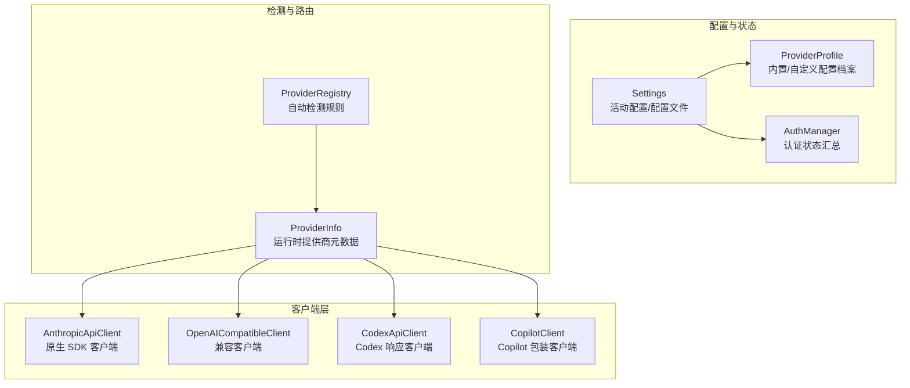
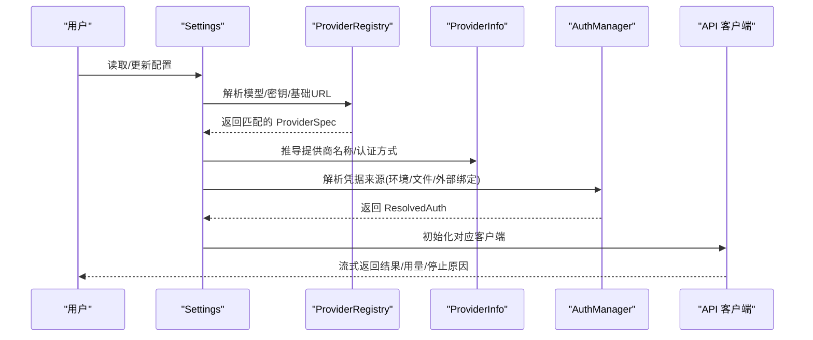
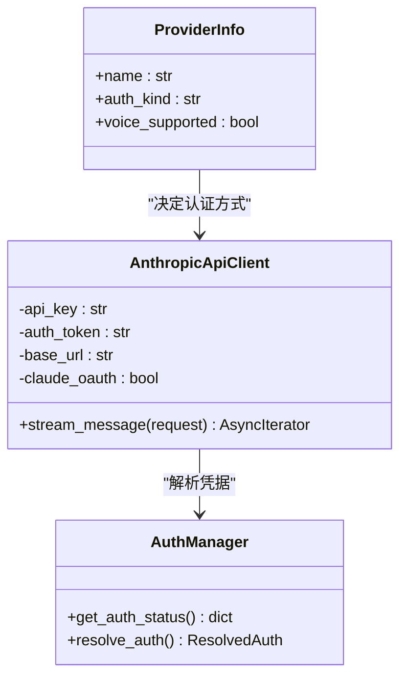
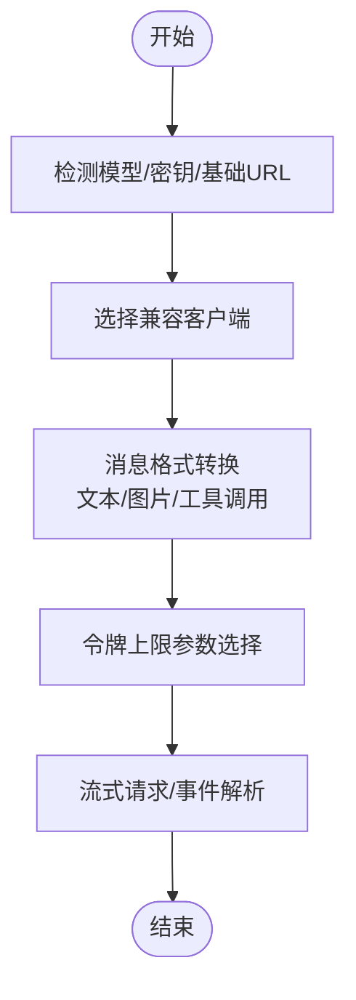
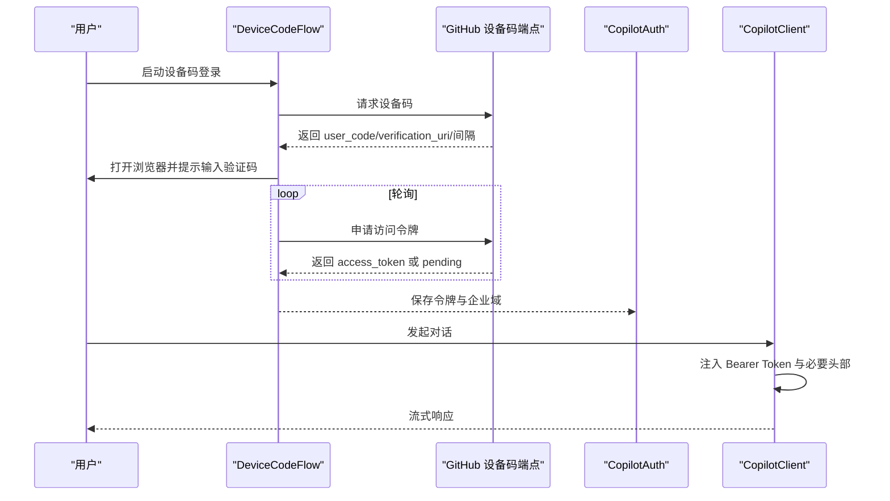
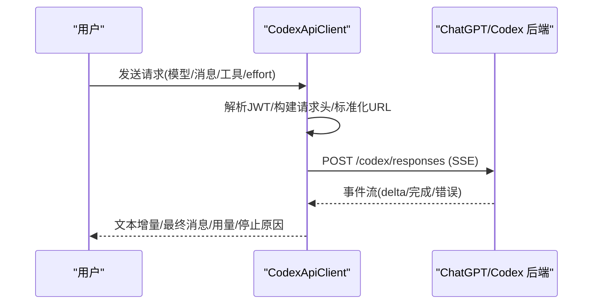
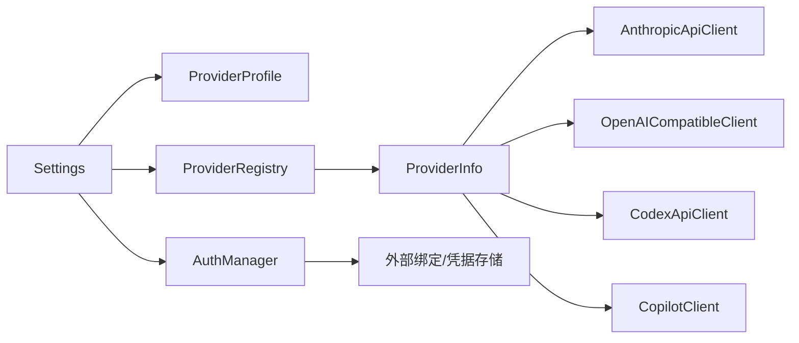

# 内置提供商

<cite>
**本文档引用的文件**
- [provider.py](file://src/openharness/api/provider.py)
- [client.py](file://src/openharness/api/client.py)
- [openai_client.py](file://src/openharness/api/openai_client.py)
- [codex_client.py](file://src/openharness/api/codex_client.py)
- [copilot_client.py](file://src/openharness/api/copilot_client.py)
- [copilot_auth.py](file://src/openharness/api/copilot_auth.py)
- [manager.py](file://src/openharness/auth/manager.py)
- [flows.py](file://src/openharness/auth/flows.py)
- [settings.py](file://src/openharness/config/settings.py)
- [registry.py](file://src/openharness/api/registry.py)
- [errors.py](file://src/openharness/api/errors.py)
- [test_client.py](file://tests/test_api/test_client.py)
- [test_openai_client.py](file://tests/test_api/test_openai_client.py)
- [test_codex_client.py](file://tests/test_api/test_codex_client.py)
- [test_copilot_client.py](file://tests/test_api/test_copilot_client.py)
</cite>

## 目录
1. [简介](#简介)
2. [项目结构](#项目结构)
3. [核心组件](#核心组件)
4. [架构总览](#架构总览)
5. [详细组件分析](#详细组件分析)
6. [依赖关系分析](#依赖关系分析)
7. [性能考量](#性能考量)
8. [故障排除指南](#故障排除指南)
9. [结论](#结论)
10. [附录](#附录)

## 简介
本文件系统性梳理 OpenHarness 直接支持的内置提供商，覆盖以下核心能力：
- Anthropic Claude：原生 SDK 客户端与订阅版 OAuth 身份标识集成
- OpenAI 兼容接口：统一适配多家兼容服务，含模型令牌上限差异处理、思维内容过滤等
- GitHub Copilot：基于 OAuth 设备码流程的会话式聊天接口
- OpenAI Codex：订阅制 ChatGPT/Codex 响应接口，通过 SSE 流式传输
- Anthropic Claude 订阅版：外部 OAuth 绑定与第三方端点限制

文档将从认证方式、配置参数、使用限制、最佳实践到具体配置示例与故障排除进行完整说明。

## 项目结构
OpenHarness 将“提供商”抽象为“后端类型 + 检测规则 + 配置状态”的统一体系，并在运行时根据配置与环境变量解析实际使用的凭据来源与 API 客户端。

图示来源
- [settings.py:534-800](file://src/openharness/config/settings.py#L534-L800)
- [registry.py:17-438](file://src/openharness/api/registry.py#L17-L438)
- [provider.py:42-94](file://src/openharness/api/provider.py#L42-L94)
- [client.py:118-268](file://src/openharness/api/client.py#L118-L268)
- [openai_client.py:260-481](file://src/openharness/api/openai_client.py#L260-L481)
- [codex_client.py:221-408](file://src/openharness/api/codex_client.py#L221-L408)
- [copilot_client.py:48-131](file://src/openharness/api/copilot_client.py#L48-L131)

章节来源
- [settings.py:534-800](file://src/openharness/config/settings.py#L534-L800)
- [registry.py:17-438](file://src/openharness/api/registry.py#L17-L438)
- [provider.py:42-94](file://src/openharness/api/provider.py#L42-L94)

## 核心组件
- 提供商检测与元数据
  - 通过注册表按关键字、前缀、URL 关键词匹配标准/网关/本地提供商
  - 运行时推导提供商名称、认证方式与语音支持状态
- 认证管理
  - 统一管理 API Key、外部 OAuth 绑定、Copilot OAuth 文件持久化
  - 支持环境变量优先级与配置文件落盘
- 客户端适配
  - Anthropic 原生 SDK 客户端（含 OAuth 标识头）
  - OpenAI 兼容客户端（消息格式转换、令牌上限字段选择、SSE/流式处理）
  - Codex 订阅响应客户端（SSE 事件解析、工具调用、用量统计）
  - Copilot 客户端（直接使用 GitHub OAuth Token）

章节来源
- [provider.py:13-94](file://src/openharness/api/provider.py#L13-L94)
- [manager.py:71-483](file://src/openharness/auth/manager.py#L71-L483)
- [client.py:118-268](file://src/openharness/api/client.py#L118-L268)
- [openai_client.py:260-481](file://src/openharness/api/openai_client.py#L260-L481)
- [codex_client.py:221-408](file://src/openharness/api/codex_client.py#L221-L408)
- [copilot_client.py:48-131](file://src/openharness/api/copilot_client.py#L48-L131)

## 架构总览
OpenHarness 的“内置提供商”由“配置解析 → 提供商检测 → 凭据解析 → 客户端调用”四步构成，关键路径如下：

图示来源
- [settings.py:730-800](file://src/openharness/config/settings.py#L730-L800)
- [registry.py:408-438](file://src/openharness/api/registry.py#L408-L438)
- [provider.py:42-94](file://src/openharness/api/provider.py#L42-L94)
- [manager.py:71-289](file://src/openharness/auth/manager.py#L71-L289)
- [client.py:118-268](file://src/openharness/api/client.py#L118-L268)

## 详细组件分析

### Anthropic Claude（原生 SDK）
- 认证方式
  - API Key：通过环境变量或配置文件注入
  - OAuth（订阅版）：通过外部绑定加载 Anthropic 认证令牌；支持 Claude Code 会话标识与归属头
- 配置参数
  - api_key 或 ANTHROPIC_API_KEY
  - base_url（可选，默认直连官方端点）
  - claude_oauth 标志位（启用订阅版身份标识与 betas 头）
- 使用限制
  - 订阅版 OAuth 仅支持直接 Anthropic/Claude 端点；第三方端点需改用 API Key 方案
  - 订阅版请求会附加系统提示归属头与 metadata 用户标识
- 最佳实践
  - 优先使用外部绑定管理订阅版令牌，避免硬编码
  - 在需要工具调用时启用 claude_oauth 并提供会话标识
- 故障排除
  - “无效 base_url”：检查是否指向第三方端点
  - “缺少凭据”：运行相应登录命令初始化外部绑定

图示来源
- [client.py:118-268](file://src/openharness/api/client.py#L118-L268)
- [manager.py:71-289](file://src/openharness/auth/manager.py#L71-L289)
- [provider.py:42-94](file://src/openharness/api/provider.py#L42-L94)

章节来源
- [client.py:118-268](file://src/openharness/api/client.py#L118-L268)
- [manager.py:71-289](file://src/openharness/auth/manager.py#L71-L289)
- [provider.py:42-94](file://src/openharness/api/provider.py#L42-L94)
- [test_client.py:7-194](file://tests/test_api/test_client.py#L7-L194)

### OpenAI 兼容接口（多云厂商/本地）
- 认证方式
  - API Key：通过环境变量或配置文件注入
  - 支持自定义 base_url（如 DashScope、Moonshot、MiniMax 等）
- 配置参数
  - api_key 或 OPENAI_API_KEY（对 OpenAI 兼容提供者）
  - base_url（默认为空，自动推断）
  - timeout（可选）
- 使用限制
  - 不同模型族对 max_tokens/max_completion_tokens 字段要求不同
  - 思维模型（如 Kimi）可能要求在工具调用回包中携带空的 reasoning_content（可通过环境变量开启）
- 最佳实践
  - 明确指定 base_url 以避免自动检测误判
  - 对推理类模型使用正确的令牌上限字段
- 故障排除
  - “401/403”：检查 API Key 是否正确
  - “429”：触发重试逻辑，注意速率限制
  - “wrong_api_format”：确认是否误传了 reasoning_content 字段

图示来源
- [openai_client.py:260-481](file://src/openharness/api/openai_client.py#L260-L481)
- [registry.py:408-438](file://src/openharness/api/registry.py#L408-L438)
- [test_openai_client.py:255-290](file://tests/test_api/test_openai_client.py#L255-L290)

章节来源
- [openai_client.py:260-481](file://src/openharness/api/openai_client.py#L260-L481)
- [registry.py:408-438](file://src/openharness/api/registry.py#L408-L438)
- [test_openai_client.py:255-290](file://tests/test_api/test_openai_client.py#L255-L290)

### GitHub Copilot（OAuth 设备码）
- 认证方式
  - OAuth 设备码流程：生成设备码 → 用户授权 → 获取 GitHub 访问令牌
  - 令牌持久化至配置目录文件，后续请求直接使用 Bearer Token
- 配置参数
  - enterprise_url（可选，企业域）
  - 默认模型：当请求未指定模型时使用 gpt-4o
- 使用限制
  - 无需额外交换，直接以 Bearer Token 调用 Copilot API
  - 支持公共 GitHub 与企业 GitHub（copilot-api.<domain>）
- 最佳实践
  - 首次使用运行设备码登录流程
  - 企业用户确保 enterprise_url 正确
- 故障排除
  - “无 GitHub Copilot 令牌”：执行登录流程
  - “超时/等待授权”：检查网络与浏览器访问权限

图示来源
- [flows.py:55-159](file://src/openharness/auth/flows.py#L55-L159)
- [copilot_auth.py:153-240](file://src/openharness/api/copilot_auth.py#L153-L240)
- [copilot_client.py:48-131](file://src/openharness/api/copilot_client.py#L48-L131)
- [test_copilot_client.py:53-141](file://tests/test_api/test_copilot_client.py#L53-L141)

章节来源
- [flows.py:55-159](file://src/openharness/auth/flows.py#L55-L159)
- [copilot_auth.py:153-240](file://src/openharness/api/copilot_auth.py#L153-L240)
- [copilot_client.py:48-131](file://src/openharness/api/copilot_client.py#L48-L131)
- [test_copilot_client.py:53-141](file://tests/test_api/test_copilot_client.py#L53-L141)

### OpenAI Codex（订阅制响应）
- 认证方式
  - 使用 ChatGPT 订阅令牌（JWT），解析 account_id 并注入请求头
- 配置参数
  - base_url（默认指向 chatgpt.com 后端 API）
  - 支持 effort 参数映射（max → xhigh）
- 使用限制
  - SSE 事件流解析，支持工具调用与用量统计
  - 停止原因根据响应状态映射（completed/failed/cancelled/incomplete）
- 最佳实践
  - 确保 base_url 指向 Codex 响应端点
  - 工具调用时注意参数 JSON 序列化
- 故障排除
  - “401/403”：检查 JWT 有效性与 account_id
  - “429/5xx”：触发指数退避重试
  - “Codex 响应失败”：查看错误事件中的 message/code/request_id

图示来源
- [codex_client.py:221-408](file://src/openharness/api/codex_client.py#L221-L408)
- [test_codex_client.py:162-245](file://tests/test_api/test_codex_client.py#L162-L245)

章节来源
- [codex_client.py:221-408](file://src/openharness/api/codex_client.py#L221-L408)
- [test_codex_client.py:162-245](file://tests/test_api/test_codex_client.py#L162-L245)

### Anthropic Claude 订阅版（外部 OAuth）
- 认证方式
  - 通过外部绑定加载 Anthropic 认证令牌（支持环境变量覆盖）
  - 仅支持直接 Anthropic/Claude 端点，不支持第三方网关
- 配置参数
  - ANTHROPIC_AUTH_TOKEN（可选，优先于外部绑定）
  - base_url（必须为官方端点）
- 使用限制
  - 第三方端点将触发异常，需切换为 API Key 方案
- 最佳实践
  - 使用外部绑定集中管理令牌
  - 保持 base_url 与官方端点一致
- 故障排除
  - “当前提供商使用订阅令牌而非 API Key”：确认 provider 与 base_url 设置
  - “第三方端点”：改为官方端点或切换为 API Key 方案

章节来源
- [settings.py:730-772](file://src/openharness/config/settings.py#L730-L772)
- [provider.py:42-94](file://src/openharness/api/provider.py#L42-L94)

## 依赖关系分析

图示来源
- [settings.py:534-800](file://src/openharness/config/settings.py#L534-L800)
- [registry.py:17-438](file://src/openharness/api/registry.py#L17-L438)
- [provider.py:42-94](file://src/openharness/api/provider.py#L42-L94)
- [manager.py:71-289](file://src/openharness/auth/manager.py#L71-L289)

章节来源
- [settings.py:534-800](file://src/openharness/config/settings.py#L534-L800)
- [registry.py:17-438](file://src/openharness/api/registry.py#L17-L438)
- [provider.py:42-94](file://src/openharness/api/provider.py#L42-L94)
- [manager.py:71-289](file://src/openharness/auth/manager.py#L71-L289)

## 性能考量
- 重试策略
  - Anthropic 客户端：指数退避 + 抖动，支持 Retry-After 头
  - OpenAI 兼容客户端：指数退避，针对 429/5xx 与网络错误重试
  - Codex 客户端：指数退避，结合 HTTPStatusError 与网络错误
- 流式处理
  - 统一事件模型（文本增量/完整消息/重试事件），降低内存占用
- 模型选择
  - 自动检测与别名映射，避免不必要的切换
- 令牌上限
  - 针对推理类模型自动选择 max_completion_tokens，减少参数错误导致的重试

[本节为通用指导，不涉及具体文件分析]

## 故障排除指南
- 常见错误类型
  - 认证失败：检查 API Key/OAuth 令牌有效性
  - 速率限制：等待冷却时间或调整并发
  - 请求失败：检查网络连通性与代理设置
- 定位步骤
  - 使用认证状态查询接口查看各提供商/认证源状态
  - 根据 ProviderInfo 的 voice_reason 判断是否支持语音模式
  - 检查外部绑定与配置文件路径
- 具体问题
  - “第三方端点”：切换为官方端点或使用 API Key
  - “Codex 响应失败”：查看事件中的 message/code/request_id
  - “无 Copilot 令牌”：执行设备码登录流程

章节来源
- [errors.py:6-20](file://src/openharness/api/errors.py#L6-L20)
- [manager.py:186-289](file://src/openharness/auth/manager.py#L186-L289)
- [provider.py:97-126](file://src/openharness/api/provider.py#L97-L126)
- [codex_client.py:337-356](file://src/openharness/api/codex_client.py#L337-L356)

## 结论
OpenHarness 通过统一的提供商注册表与认证管理器，将多种外部服务抽象为一致的客户端接口。内置提供商覆盖了主流模型厂商与订阅服务，配合完善的错误分类与重试机制，能够满足日常开发与生产场景的需求。建议优先采用外部绑定与配置文件管理敏感凭据，并根据模型特性选择合适的认证与客户端实现。

[本节为总结性内容，不涉及具体文件分析]

## 附录

### 配置示例与最佳实践清单
- Anthropic Claude（API Key）
  - 设置：ANTHROPIC_API_KEY 或在配置文件中写入 api_key
  - 建议：为不同项目使用独立的 ProviderProfile 与 credential_slot
- Anthropic Claude（订阅版）
  - 设置：base_url 指向官方端点；可设置 ANTHROPIC_AUTH_TOKEN
  - 建议：使用外部绑定管理令牌，避免硬编码
- OpenAI 兼容接口
  - 设置：OPENAI_API_KEY 或自定义 base_url
  - 建议：明确模型族，避免混用 max_tokens/max_completion_tokens
- GitHub Copilot
  - 设置：首次运行设备码登录；enterprise_url 可选
  - 建议：企业用户确保 copilot-api.<domain> 可达
- OpenAI Codex
  - 设置：base_url 指向 /codex/responses；effort 参数映射
  - 建议：工具调用时确保参数 JSON 序列化正确

[本节为通用指导，不涉及具体文件分析]