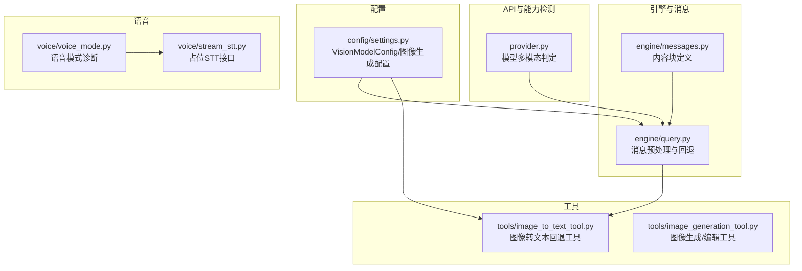
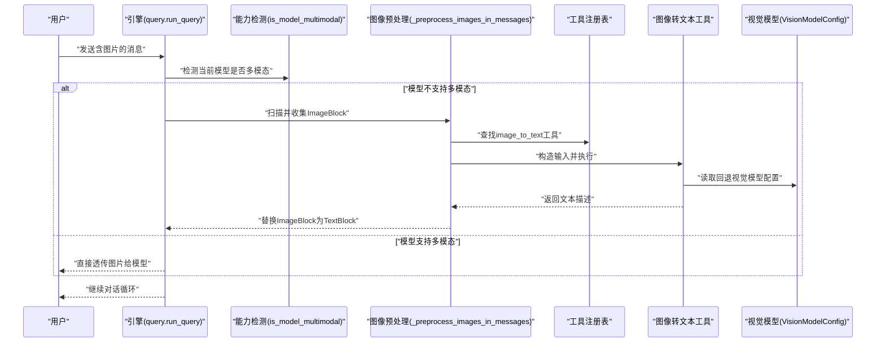
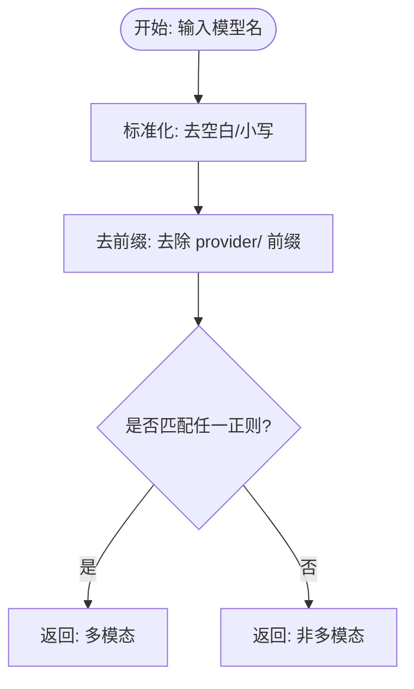
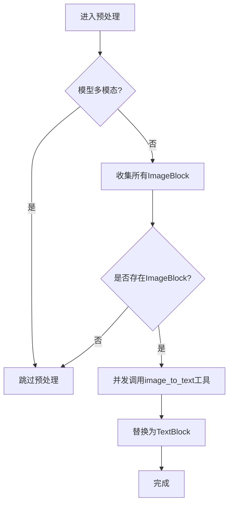
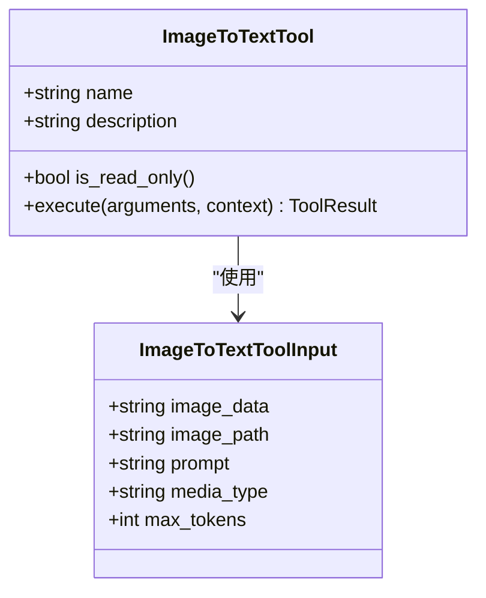
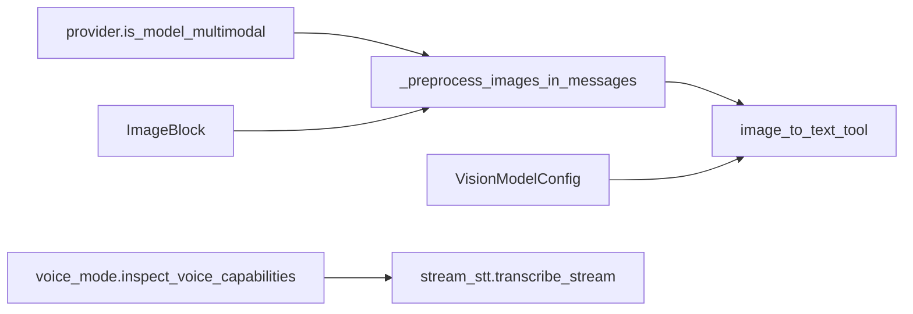

# 多模态能力检测

<cite>
**本文引用的文件**
- [provider.py](file://src/openharness/api/provider.py)
- [query.py](file://src/openharness/engine/query.py)
- [messages.py](file://src/openharness/engine/messages.py)
- [settings.py](file://src/openharness/config/settings.py)
- [image_to_text_tool.py](file://src/openharness/tools/image_to_text_tool.py)
- [image_generation_tool.py](file://src/openharness/tools/image_generation_tool.py)
- [voice_mode.py](file://src/openharness/voice/voice_mode.py)
- [stream_stt.py](file://src/openharness/voice/stream_stt.py)
- [test_image_to_text_tool.py](file://tests/test_tools/test_image_to_text_tool.py)
</cite>

## 目录
1. [简介](#简介)
2. [项目结构](#项目结构)
3. [核心组件](#核心组件)
4. [架构总览](#架构总览)
5. [详细组件分析](#详细组件分析)
6. [依赖关系分析](#依赖关系分析)
7. [性能考量](#性能考量)
8. [故障排查指南](#故障排查指南)
9. [结论](#结论)
10. [附录](#附录)

## 简介
本文件聚焦 OpenHarness 的多模态能力检测与使用，系统阐述如何识别具备视觉输入能力的模型、在非多模态模型上自动进行图像预处理与降级为“图像转文本”回退流程、以及与语音转文本（STT）能力的集成现状。文档还提供已支持的多模态模型清单、检测算法、最佳实践、性能与兼容性建议，并给出图像上传、视觉问答、语音模式等功能的配置与使用说明。

## 项目结构
围绕多模态能力的关键模块分布如下：
- 检测与能力判定：provider.py 中的模型命名规则与 is_model_multimodal 判定逻辑
- 引擎与消息流：query.py 中对非多模态模型的消息预处理；messages.py 定义 ImageBlock/TextBlock 等内容块
- 配置与环境变量：settings.py 中 VisionModelConfig 与图像生成配置
- 工具实现：image_to_text_tool.py 提供“图像转文本”的回退工具；image_generation_tool.py 支持图像生成/编辑
- 语音能力：voice_mode.py 提供语音模式诊断；stream_stt.py 当前为占位接口

**图表来源**
- [provider.py:135-186](file://src/openharness/api/provider.py#L135-L186)
- [query.py:556-631](file://src/openharness/engine/query.py#L556-L631)
- [messages.py:21-38](file://src/openharness/engine/messages.py#L21-L38)
- [settings.py:508-531](file://src/openharness/config/settings.py#L508-L531)
- [image_to_text_tool.py:62-104](file://src/openharness/tools/image_to_text_tool.py#L62-L104)
- [image_generation_tool.py:74-126](file://src/openharness/tools/image_generation_tool.py#L74-L126)
- [voice_mode.py:25-43](file://src/openharness/voice/voice_mode.py#L25-L43)
- [stream_stt.py:6-8](file://src/openharness/voice/stream_stt.py#L6-L8)

**章节来源**
- [provider.py:135-186](file://src/openharness/api/provider.py#L135-L186)
- [query.py:556-631](file://src/openharness/engine/query.py#L556-L631)
- [messages.py:21-38](file://src/openharness/engine/messages.py#L21-L38)
- [settings.py:508-531](file://src/openharness/config/settings.py#L508-L531)
- [image_to_text_tool.py:62-104](file://src/openharness/tools/image_to_text_tool.py#L62-L104)
- [image_generation_tool.py:74-126](file://src/openharness/tools/image_generation_tool.py#L74-L126)
- [voice_mode.py:25-43](file://src/openharness/voice/voice_mode.py#L25-L43)
- [stream_stt.py:6-8](file://src/openharness/voice/stream_stt.py#L6-L8)

## 核心组件
- 模型多模态判定：基于正则表达式集合的启发式匹配，用于判断当前模型是否原生支持图像输入
- 图像预处理与回退：当模型不支持多模态时，引擎扫描用户消息中的图片块，调用图像转文本工具进行描述，再替换为文本块继续对话
- 视觉模型配置：通过 VisionModelConfig 提供回退模型、密钥与可选 base_url，支持从环境变量加载
- 图像生成工具：支持 OpenAI 兼容与 Codex 两种后端，提供生成/编辑能力
- 语音模式诊断：检查录音器可用性与提供商对语音的支持状态

**章节来源**
- [provider.py:175-186](file://src/openharness/api/provider.py#L175-L186)
- [query.py:563-631](file://src/openharness/engine/query.py#L563-L631)
- [settings.py:508-531](file://src/openharness/config/settings.py#L508-L531)
- [image_generation_tool.py:74-126](file://src/openharness/tools/image_generation_tool.py#L74-L126)
- [voice_mode.py:25-43](file://src/openharness/voice/voice_mode.py#L25-L43)

## 架构总览
下图展示从消息进入引擎到多模态检测与回退的整体流程：

**图表来源**
- [query.py:563-631](file://src/openharness/engine/query.py#L563-L631)
- [provider.py:175-186](file://src/openharness/api/provider.py#L175-L186)
- [image_to_text_tool.py:73-104](file://src/openharness/tools/image_to_text_tool.py#L73-L104)
- [settings.py:508-531](file://src/openharness/config/settings.py#L508-L531)

## 详细组件分析

### 组件A：多模态模型模式匹配
- 检测算法：对模型名进行小写化与前缀剥离，然后依次匹配一组正则表达式，命中即认为是多模态
- 已覆盖系列：Claude 3+、GPT-4o/o-系列、Gemini Pro/Vision、Qwen VL、DeepSeek VL、开源多模态（LLaVA、CogVLM、InternVL、GLM-4V）、Moonshot/Kimi k2.5、StepFun Step-2/Step-1v、MiniMax VL、Mistral Pixtral、Groq vision 系列、通用“vl/vision”关键词
- 错误倾向：对未知模型倾向于返回非多模态，从而触发回退机制，避免静默失败

**图表来源**
- [provider.py:175-186](file://src/openharness/api/provider.py#L175-L186)

**章节来源**
- [provider.py:135-186](file://src/openharness/api/provider.py#L135-L186)
- [test_image_to_text_tool.py:19-72](file://tests/test_tools/test_image_to_text_tool.py#L19-L72)

### 组件B：图像预处理与回退流程
- 触发条件：当 is_model_multimodal 返回 False 且上下文包含 vision_model_config 时
- 执行步骤：
  1) 扫描用户消息中的 ImageBlock
  2) 并行调用 image_to_text 工具，将图片转为文本描述
  3) 将 ImageBlock 替换为 TextBlock，继续对话
- 并发策略：使用 gather 并行处理多个图片，提升吞吐

**图表来源**
- [query.py:563-631](file://src/openharness/engine/query.py#L563-L631)
- [image_to_text_tool.py:73-104](file://src/openharness/tools/image_to_text_tool.py#L73-L104)

**章节来源**
- [query.py:556-631](file://src/openharness/engine/query.py#L556-L631)
- [messages.py:21-38](file://src/openharness/engine/messages.py#L21-L38)

### 组件C：图像转文本工具（回退）
- 输入参数：image_data/base64 或 image_path；媒体类型；自定义提示词；最大输出 token 数
- 执行流程：
  1) 解析输入，优先使用 image_data；否则从本地路径读取
  2) 从上下文元数据读取 vision_model_config（模型、API Key、可选 base_url）
  3) 若未配置，返回错误提示
  4) 调用外部视觉模型生成文本描述
- 只读属性：该工具为只读操作，不修改系统状态

**图表来源**
- [image_to_text_tool.py:37-60](file://src/openharness/tools/image_to_text_tool.py#L37-L60)
- [image_to_text_tool.py:62-104](file://src/openharness/tools/image_to_text_tool.py#L62-L104)

**章节来源**
- [image_to_text_tool.py:62-104](file://src/openharness/tools/image_to_text_tool.py#L62-L104)
- [test_image_to_text_tool.py:129-207](file://tests/test_tools/test_image_to_text_tool.py#L129-L207)

### 组件D：视觉模型配置与环境变量
- 配置项：model、api_key、base_url
- 加载方式：支持从 OPENHARNESS_VISION_MODEL、OPENHARNESS_VISION_API_KEY、OPENHARNESS_VISION_BASE_URL 环境变量加载
- 使用位置：引擎在回退时从 ToolExecutionContext.metadata 读取

**章节来源**
- [settings.py:508-531](file://src/openharness/config/settings.py#L508-L531)
- [query.py:575-591](file://src/openharness/engine/query.py#L575-L591)

### 组件E：图像生成工具
- 功能：支持 OpenAI 兼容与 Codex 两种后端，提供图像生成与编辑能力
- 关键点：当提供 image_paths 时走编辑模式；支持多图生成、尺寸、质量、透明度等参数
- 认证：OpenAI 后端需要 api_key；Codex 需要认证令牌

**章节来源**
- [image_generation_tool.py:74-126](file://src/openharness/tools/image_generation_tool.py#L74-L126)
- [image_generation_tool.py:128-226](file://src/openharness/tools/image_generation_tool.py#L128-L226)

### 组件F：语音模式诊断与占位 STT
- 语音模式诊断：根据提供商能力与系统中是否存在 sox/ffmpeg/arecord 判断是否可用
- 占位 STT：当前返回“未配置”的占位信息，表示构建版本未接入实时语音转文本

**章节来源**
- [voice_mode.py:25-43](file://src/openharness/voice/voice_mode.py#L25-L43)
- [stream_stt.py:6-8](file://src/openharness/voice/stream_stt.py#L6-L8)

## 依赖关系分析
- provider.is_model_multimodal 是引擎预处理阶段的唯一判定依据
- engine.query 依赖 messages.ImageBlock 的存在与否决定是否触发回退
- 回退链路依赖 tools.image_to_text_tool 与 VisionModelConfig
- 语音能力由 voice.voice_mode 与 voice.stream_stt 提供诊断与占位

**图表来源**
- [provider.py:175-186](file://src/openharness/api/provider.py#L175-L186)
- [query.py:563-631](file://src/openharness/engine/query.py#L563-L631)
- [messages.py:21-38](file://src/openharness/engine/messages.py#L21-L38)
- [image_to_text_tool.py:73-104](file://src/openharness/tools/image_to_text_tool.py#L73-L104)
- [settings.py:508-531](file://src/openharness/config/settings.py#L508-L531)
- [voice_mode.py:25-43](file://src/openharness/voice/voice_mode.py#L25-L43)
- [stream_stt.py:6-8](file://src/openharness/voice/stream_stt.py#L6-L8)

**章节来源**
- [provider.py:175-186](file://src/openharness/api/provider.py#L175-L186)
- [query.py:563-631](file://src/openharness/engine/query.py#L563-L631)
- [messages.py:21-38](file://src/openharness/engine/messages.py#L21-L38)
- [image_to_text_tool.py:73-104](file://src/openharness/tools/image_to_text_tool.py#L73-L104)
- [settings.py:508-531](file://src/openharness/config/settings.py#L508-L531)
- [voice_mode.py:25-43](file://src/openharness/voice/voice_mode.py#L25-L43)
- [stream_stt.py:6-8](file://src/openharness/voice/stream_stt.py#L6-L8)

## 性能考量
- 并行回退：图像预处理阶段对多个图片采用并发执行，减少整体等待时间
- 最大输出限制：对 vision 模型响应的最大 token 数进行范围约束，避免超长输出
- 仅在必要时回退：通过 is_model_multimodal 判定，避免对多模态模型做无谓的预处理
- 生成工具：OpenAI 后端默认使用异步客户端，编辑模式会打开本地文件句柄，注意磁盘 IO 与内存占用

**章节来源**
- [query.py:594-625](file://src/openharness/engine/query.py#L594-L625)
- [image_to_text_tool.py:54-59](file://src/openharness/tools/image_to_text_tool.py#L54-L59)
- [image_generation_tool.py:196-226](file://src/openharness/tools/image_generation_tool.py#L196-L226)

## 故障排查指南
- 模型未被识别为多模态
  - 确认模型名符合已知命名规范或在正则集中新增匹配
  - 参考测试用例验证预期行为
- 图像无法回退为文本
  - 检查 vision_model_config 是否完整配置（模型名与 API Key）
  - 确认环境变量 OPENHARNESS_VISION_MODEL、OPENHARNESS_VISION_API_KEY 设置正确
  - 确认 image_to_text 工具已在工具注册表中可用
- 语音模式不可用
  - 检查系统是否安装 sox/ffmpeg/arecord
  - 查看语音诊断输出中的原因字段
- 图像生成失败
  - OpenAI 后端需提供有效 api_key
  - Codex 后端需完成认证登录或切换到 OpenAI 后端

**章节来源**
- [test_image_to_text_tool.py:156-207](file://tests/test_tools/test_image_to_text_tool.py#L156-L207)
- [settings.py:508-531](file://src/openharness/config/settings.py#L508-L531)
- [voice_mode.py:25-43](file://src/openharness/voice/voice_mode.py#L25-L43)
- [image_generation_tool.py:128-151](file://src/openharness/tools/image_generation_tool.py#L128-L151)

## 结论
OpenHarness 通过一套清晰的多模态检测与回退机制，在非多模态模型上实现了对图像输入的无缝支持。配合灵活的配置与工具体系，用户可以在不同提供商与模型之间平滑切换。未来可在以下方面持续优化：扩展更多模型的命名规则、完善 STT 占位接口、增强图像生成工具的错误恢复与重试策略。

## 附录

### 已支持的多模态模型清单（按系列）
- Anthropic Claude 3+（全部 3 代及以上）
- OpenAI GPT-4o 与 o- 系列
- Google Gemini Pro/Vision 与 2.x
- Qwen VL、Qwen2.5-VL、QVQ
- DeepSeek VL 与 DeepSeek Vision
- 开源多模态：LLaVA、CogVLM、InternVL、GLM-4V
- Moonshot/Kimi：k2.5
- StepFun（阶跃星辰）：Step-2、Step-1v
- MiniMax VL
- Zhipu GLM-4V
- Mistral Pixtral
- Groq vision 系列（如 llama-3.2-vision）
- 通用：名称包含“vl”或“vision”的模型

**章节来源**
- [provider.py:135-172](file://src/openharness/api/provider.py#L135-L172)

### 多模态检测算法要点
- 归一化与前缀剥离：统一大小写并去除 provider/ 前缀
- 正则集匹配：逐条匹配，命中即返回多模态
- 默认保守策略：未知模型视为非多模态，确保回退可用

**章节来源**
- [provider.py:175-186](file://src/openharness/api/provider.py#L175-L186)

### 配置与使用说明

- 图像上传与视觉问答
  - 在消息中以 ImageBlock 形式提交图片
  - 若当前模型不支持多模态，引擎将自动回退至图像转文本工具
  - 回退所需的视觉模型配置可通过 settings.vision 或环境变量设置

- 语音模式
  - 使用语音模式诊断函数检查系统录音器与提供商支持情况
  - 当前占位 STT 返回“未配置”，需在后续版本接入实时语音转文本

- 图像生成
  - 选择 OpenAI 兼容或 Codex 后端
  - OpenAI 后端需提供 api_key；Codex 后端需完成认证
  - 支持生成与编辑，可指定尺寸、质量、透明度等参数

**章节来源**
- [messages.py:21-38](file://src/openharness/engine/messages.py#L21-L38)
- [query.py:563-631](file://src/openharness/engine/query.py#L563-L631)
- [settings.py:508-531](file://src/openharness/config/settings.py#L508-L531)
- [voice_mode.py:25-43](file://src/openharness/voice/voice_mode.py#L25-L43)
- [stream_stt.py:6-8](file://src/openharness/voice/stream_stt.py#L6-L8)
- [image_generation_tool.py:74-126](file://src/openharness/tools/image_generation_tool.py#L74-L126)