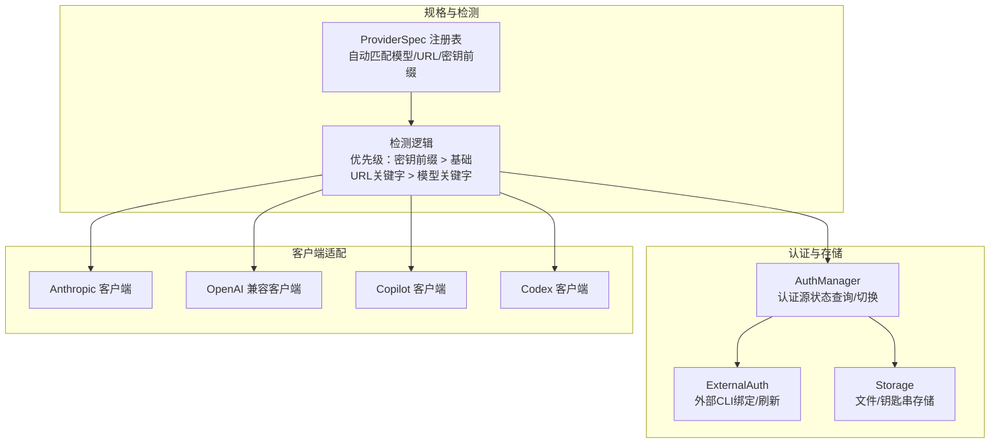
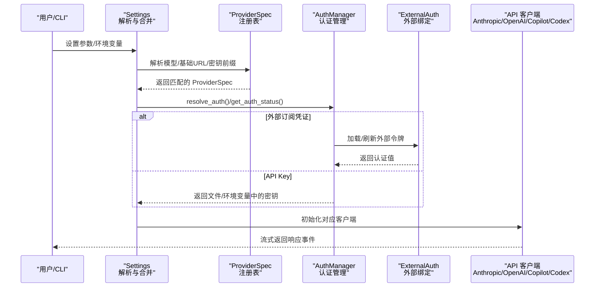
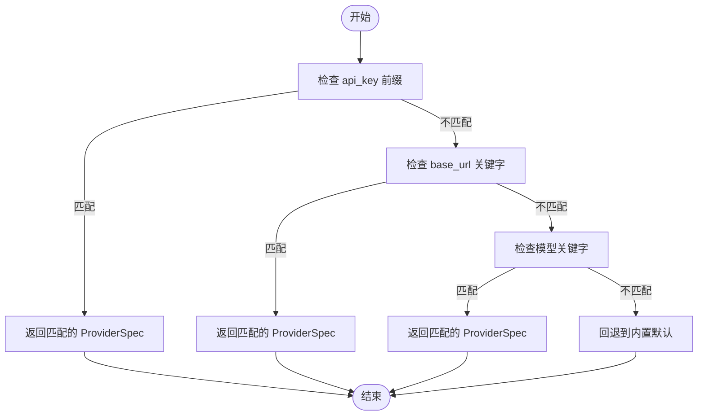
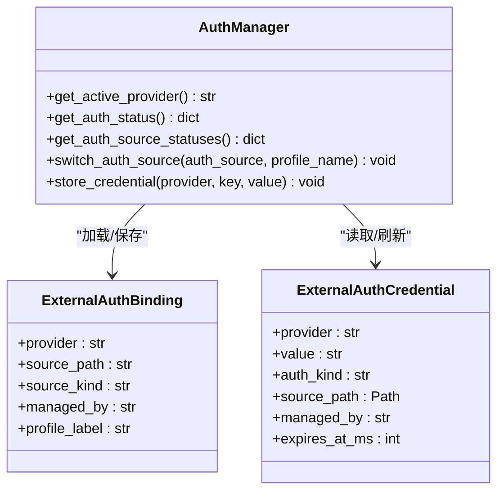
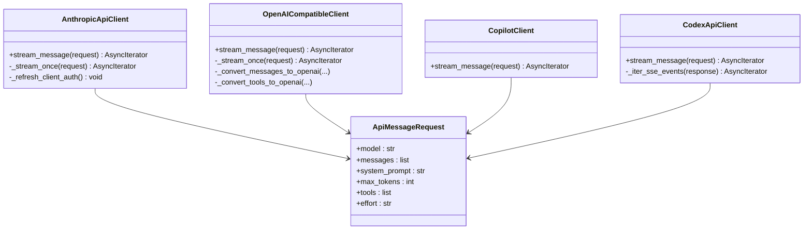
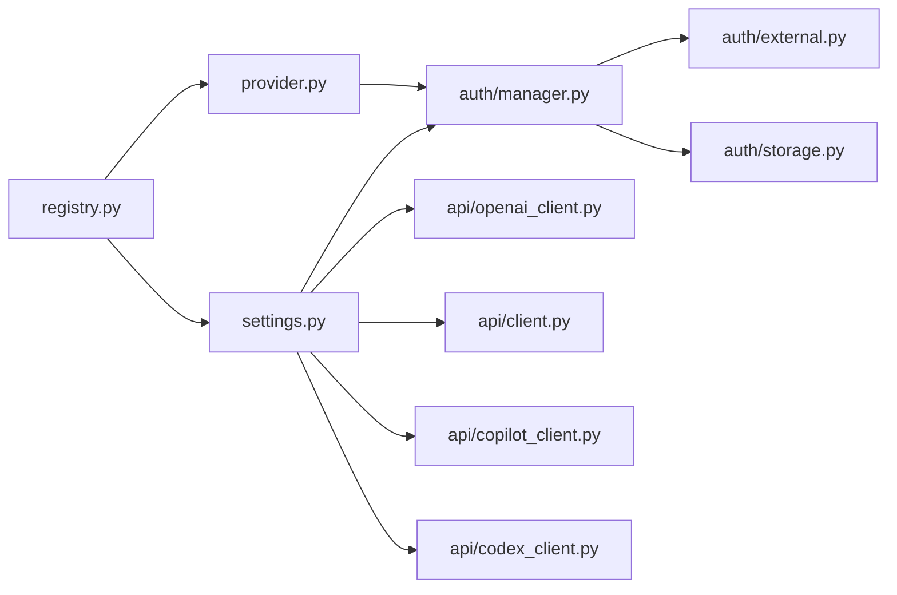

# 自定义提供商集成

<cite>
**本文档引用的文件**
- [src/openharness/api/registry.py](file://src/openharness/api/registry.py)
- [src/openharness/api/provider.py](file://src/openharness/api/provider.py)
- [src/openharness/api/client.py](file://src/openharness/api/client.py)
- [src/openharness/api/openai_client.py](file://src/openharness/api/openai_client.py)
- [src/openharness/api/codex_client.py](file://src/openharness/api/codex_client.py)
- [src/openharness/api/copilot_client.py](file://src/openharness/api/copilot_client.py)
- [src/openharness/api/errors.py](file://src/openharness/api/errors.py)
- [src/openharness/auth/manager.py](file://src/openharness/auth/manager.py)
- [src/openharness/auth/flows.py](file://src/openharness/auth/flows.py)
- [src/openharness/auth/external.py](file://src/openharness/auth/external.py)
- [src/openharness/auth/storage.py](file://src/openharness/auth/storage.py)
- [src/openharness/config/settings.py](file://src/openharness/config/settings.py)
</cite>

## 目录
1. [简介](#简介)
2. [项目结构](#项目结构)
3. [核心组件](#核心组件)
4. [架构总览](#架构总览)
5. [详细组件分析](#详细组件分析)
6. [依赖关系分析](#依赖关系分析)
7. [性能考虑](#性能考虑)
8. [故障排除指南](#故障排除指南)
9. [结论](#结论)
10. [附录](#附录)

## 简介
本指南面向希望在 OpenHarness 中添加新 AI 提供商的开发者，系统讲解提供商规格定义、认证流程实现、API 客户端适配、提供商注册机制、配置文件格式与兼容性检查等关键技术点。文档提供从简单 API Key 到复杂 OAuth 的完整集成示例，并包含调试技巧、性能优化建议与常见问题解决方案。

## 项目结构
OpenHarness 将提供商集成分为三层：
- 规格与检测层：通过统一的 ProviderSpec 注册表进行自动识别与路由
- 认证与存储层：统一的认证管理器、外部绑定与密钥存储
- 客户端适配层：针对不同后端类型的客户端封装（Anthropic SDK、OpenAI 兼容、Copilot、Codex）

图表来源
- [src/openharness/api/registry.py:17-48](file://src/openharness/api/registry.py#L17-L48)
- [src/openharness/api/provider.py:42-94](file://src/openharness/api/provider.py#L42-L94)
- [src/openharness/auth/manager.py:71-483](file://src/openharness/auth/manager.py#L71-L483)
- [src/openharness/auth/external.py:1-611](file://src/openharness/auth/external.py#L1-L611)
- [src/openharness/auth/storage.py:1-270](file://src/openharness/auth/storage.py#L1-L270)
- [src/openharness/api/client.py:118-268](file://src/openharness/api/client.py#L118-L268)
- [src/openharness/api/openai_client.py:260-481](file://src/openharness/api/openai_client.py#L260-L481)
- [src/openharness/api/copilot_client.py:48-131](file://src/openharness/api/copilot_client.py#L48-L131)
- [src/openharness/api/codex_client.py:221-408](file://src/openharness/api/codex_client.py#L221-L408)

章节来源
- [src/openharness/api/registry.py:1-438](file://src/openharness/api/registry.py#L1-L438)
- [src/openharness/api/provider.py:1-187](file://src/openharness/api/provider.py#L1-L187)

## 核心组件
- ProviderSpec 注册表：集中定义提供商元数据（名称、关键词、环境变量、默认 Base URL、检测规则、是否网关/本地/OAuth 等），并按顺序控制匹配优先级
- 认证管理器：统一查询/切换认证源，读取环境变量、文件存储或外部 CLI 绑定
- 外部认证：支持第三方 CLI 管理的订阅凭证（Codex/Claude），含过期检测与刷新
- 客户端适配：针对 Anthropic SDK、OpenAI 兼容接口、Copilot、Codex 的统一流式调用封装

章节来源
- [src/openharness/api/registry.py:17-48](file://src/openharness/api/registry.py#L17-L48)
- [src/openharness/auth/manager.py:71-483](file://src/openharness/auth/manager.py#L71-L483)
- [src/openharness/auth/external.py:116-236](file://src/openharness/auth/external.py#L116-L236)
- [src/openharness/api/client.py:118-268](file://src/openharness/api/client.py#L118-L268)

## 架构总览
下图展示从设置解析到客户端调用的完整链路，以及认证来源的决策过程。

图表来源
- [src/openharness/config/settings.py:534-846](file://src/openharness/config/settings.py#L534-L846)
- [src/openharness/api/registry.py:408-437](file://src/openharness/api/registry.py#L408-L437)
- [src/openharness/auth/manager.py:186-289](file://src/openharness/auth/manager.py#L186-L289)
- [src/openharness/auth/external.py:116-236](file://src/openharness/auth/external.py#L116-L236)
- [src/openharness/api/client.py:118-268](file://src/openharness/api/client.py#L118-L268)

## 详细组件分析

### 1) 提供商规格定义与检测
- ProviderSpec 字段含义
  - identity：name/display_name/env_key
  - routing：backend_type/default_base_url
  - auto-detection：detect_by_key_prefix/detect_by_base_keyword
  - classification：is_gateway/is_local/is_oauth
- 匹配优先级
  - 密钥前缀（如 sk-or-）> 基础 URL 关键字（如 openrouter/aihubmix）> 模型关键字（如 qwen/claude）
- 关键实现位置
  - ProviderSpec 定义与内置提供商列表
  - 检测函数：按优先级依次尝试

图表来源
- [src/openharness/api/registry.py:408-437](file://src/openharness/api/registry.py#L408-L437)

章节来源
- [src/openharness/api/registry.py:17-48](file://src/openharness/api/registry.py#L17-L48)
- [src/openharness/api/registry.py:408-437](file://src/openharness/api/registry.py#L408-L437)

### 2) 认证流程与存储
- 支持的认证类型
  - API Key：环境变量/文件存储
  - OAuth 设备码：GitHub Copilot
  - 外部订阅：Codex/Claude（由外部 CLI 管理）
- 认证状态查询
  - AuthManager.get_auth_status/get_auth_source_statuses
  - 支持多来源：env/file/external/missing
- 外部绑定与刷新
  - ExternalAuthBinding 描述外部来源
  - Claude 订阅支持过期检测与刷新

图表来源
- [src/openharness/auth/manager.py:71-483](file://src/openharness/auth/manager.py#L71-L483)
- [src/openharness/auth/storage.py:38-47](file://src/openharness/auth/storage.py#L38-L47)
- [src/openharness/auth/external.py:52-64](file://src/openharness/auth/external.py#L52-L64)

章节来源
- [src/openharness/auth/manager.py:116-289](file://src/openharness/auth/manager.py#L116-L289)
- [src/openharness/auth/external.py:116-236](file://src/openharness/auth/external.py#L116-L236)
- [src/openharness/auth/storage.py:122-227](file://src/openharness/auth/storage.py#L122-L227)

### 3) API 客户端适配
- Anthropic 客户端
  - 使用 AsyncAnthropic SDK，封装重试、流式事件与错误翻译
  - 支持 Claude OAuth 场景下的特殊头与 betas
- OpenAI 兼容客户端
  - 统一消息格式转换、工具调用格式转换、流式解析
  - 支持不同模型的最大令牌字段差异
- Copilot 客户端
  - 直接使用 GitHub OAuth Token，附加特定头
- Codex 客户端
  - ChatGPT/Codex 订阅响应流，JWT 账号提取与 SSE 解析

图表来源
- [src/openharness/api/client.py:118-268](file://src/openharness/api/client.py#L118-L268)
- [src/openharness/api/openai_client.py:260-481](file://src/openharness/api/openai_client.py#L260-L481)
- [src/openharness/api/copilot_client.py:48-131](file://src/openharness/api/copilot_client.py#L48-L131)
- [src/openharness/api/codex_client.py:221-408](file://src/openharness/api/codex_client.py#L221-L408)

章节来源
- [src/openharness/api/client.py:118-268](file://src/openharness/api/client.py#L118-L268)
- [src/openharness/api/openai_client.py:260-481](file://src/openharness/api/openai_client.py#L260-L481)
- [src/openharness/api/copilot_client.py:48-131](file://src/openharness/api/copilot_client.py#L48-L131)
- [src/openharness/api/codex_client.py:221-408](file://src/openharness/api/codex_client.py#L221-L408)

### 4) 集成示例：从零开始添加新提供商
以下为“添加新提供商”的端到端步骤与参考路径：

- 步骤 1：在注册表中新增 ProviderSpec
  - 参考路径：[src/openharness/api/registry.py:55-368](file://src/openharness/api/registry.py#L55-L368)
  - 关键字段：name/keywords/env_key/backend_type/default_base_url/detect_by_key_prefix/detect_by_base_keyword/is_gateway/is_local/is_oauth
- 步骤 2：实现认证流程（API Key 或 OAuth）
  - API Key：使用 ApiKeyFlow 或直接在 AuthManager 中扩展
    - 参考路径：[src/openharness/auth/flows.py:34-48](file://src/openharness/auth/flows.py#L34-L48)
    - 存储：[src/openharness/auth/storage.py:122-164](file://src/openharness/auth/storage.py#L122-L164)
  - OAuth：使用 DeviceCodeFlow/BrowserFlow
    - 参考路径：[src/openharness/auth/flows.py:55-190](file://src/openharness/auth/flows.py#L55-L190)
- 步骤 3：选择合适的客户端适配
  - 若为原生 SDK（如 Anthropic），复用 AnthropicApiClient
    - 参考路径：[src/openharness/api/client.py:118-268](file://src/openharness/api/client.py#L118-L268)
  - 若为 OpenAI 兼容接口，复用 OpenAICompatibleClient
    - 参考路径：[src/openharness/api/openai_client.py:260-481](file://src/openharness/api/openai_client.py#L260-L481)
  - 若为 Copilot 或 Codex，分别使用对应客户端
    - 参考路径：[src/openharness/api/copilot_client.py:48-131](file://src/openharness/api/copilot_client.py#L48-L131), [src/openharness/api/codex_client.py:221-408](file://src/openharness/api/codex_client.py#L221-L408)
- 步骤 4：在设置解析中处理新提供商
  - 参考路径：[src/openharness/config/settings.py:534-846](file://src/openharness/config/settings.py#L534-L846)
  - 在 resolve_auth 中添加新提供商分支，或复用现有分支
- 步骤 5：测试与验证
  - 使用 AuthManager.get_auth_status 验证认证状态
    - 参考路径：[src/openharness/auth/manager.py:186-289](file://src/openharness/auth/manager.py#L186-L289)
  - 使用 detect_provider_from_registry 验证自动检测
    - 参考路径：[src/openharness/api/registry.py:408-437](file://src/openharness/api/registry.py#L408-L437)

章节来源
- [src/openharness/api/registry.py:55-368](file://src/openharness/api/registry.py#L55-L368)
- [src/openharness/auth/flows.py:34-190](file://src/openharness/auth/flows.py#L34-L190)
- [src/openharness/auth/storage.py:122-164](file://src/openharness/auth/storage.py#L122-L164)
- [src/openharness/api/client.py:118-268](file://src/openharness/api/client.py#L118-L268)
- [src/openharness/api/openai_client.py:260-481](file://src/openharness/api/openai_client.py#L260-L481)
- [src/openharness/api/copilot_client.py:48-131](file://src/openharness/api/copilot_client.py#L48-L131)
- [src/openharness/api/codex_client.py:221-408](file://src/openharness/api/codex_client.py#L221-L408)
- [src/openharness/config/settings.py:534-846](file://src/openharness/config/settings.py#L534-L846)

### 5) 配置文件格式与兼容性检查
- 配置文件位置与加载
  - 默认路径：~/.openharness/settings.json
  - 加载与合并：优先 CLI > 环境变量 > 文件 > 默认值
  - 参考路径：[src/openharness/config/settings.py:972-1008](file://src/openharness/config/settings.py#L972-L1008)
- ProviderProfile 结构
  - label/provider/api_format/auth_source/default_model/base_url/allowed_models 等
  - 参考路径：[src/openharness/config/settings.py:116-130](file://src/openharness/config/settings.py#L116-L130)
- 兼容性检查
  - 第三方 Anthropic 端点仅支持订阅认证
    - 参考路径：[src/openharness/config/settings.py:751-755](file://src/openharness/config/settings.py#L751-L755)
  - 模型别名与解析
    - 参考路径：[src/openharness/config/settings.py:152-346](file://src/openharness/config/settings.py#L152-L346)

章节来源
- [src/openharness/config/settings.py:972-1008](file://src/openharness/config/settings.py#L972-L1008)
- [src/openharness/config/settings.py:116-130](file://src/openharness/config/settings.py#L116-L130)
- [src/openharness/config/settings.py:751-755](file://src/openharness/config/settings.py#L751-L755)
- [src/openharness/config/settings.py:152-346](file://src/openharness/config/settings.py#L152-L346)

## 依赖关系分析
- 组件耦合
  - ProviderSpec 是检测与路由的核心，被 detect_provider_from_registry 与 provider.py 的 detect_provider 使用
  - AuthManager 依赖 storage 与 external，用于认证状态与外部绑定
  - 客户端适配层依赖 settings.resolve_auth 的结果
- 外部依赖
  - Anthropic SDK（AsyncAnthropic）
  - OpenAI SDK（AsyncOpenAI）
  - httpx（Codex SSE）
- 可能的循环依赖
  - 当前模块间为单向依赖，未见循环导入

图表来源
- [src/openharness/api/registry.py:1-438](file://src/openharness/api/registry.py#L1-L438)
- [src/openharness/api/provider.py:1-187](file://src/openharness/api/provider.py#L1-L187)
- [src/openharness/auth/manager.py:1-483](file://src/openharness/auth/manager.py#L1-L483)
- [src/openharness/auth/external.py:1-611](file://src/openharness/auth/external.py#L1-L611)
- [src/openharness/auth/storage.py:1-270](file://src/openharness/auth/storage.py#L1-L270)
- [src/openharness/api/openai_client.py:1-481](file://src/openharness/api/openai_client.py#L1-L481)
- [src/openharness/api/client.py:1-268](file://src/openharness/api/client.py#L1-L268)
- [src/openharness/api/copilot_client.py:1-131](file://src/openharness/api/copilot_client.py#L1-L131)
- [src/openharness/api/codex_client.py:1-408](file://src/openharness/api/codex_client.py#L1-L408)
- [src/openharness/config/settings.py:1-1030](file://src/openharness/config/settings.py#L1-L1030)

章节来源
- [src/openharness/api/registry.py:1-438](file://src/openharness/api/registry.py#L1-L438)
- [src/openharness/auth/manager.py:1-483](file://src/openharness/auth/manager.py#L1-L483)
- [src/openharness/config/settings.py:1-1030](file://src/openharness/config/settings.py#L1-L1030)

## 性能考虑
- 重试策略
  - 指数退避 + 抖动，最大延迟限制；优先读取上游 Retry-After
  - 参考路径：[src/openharness/api/client.py:87-116](file://src/openharness/api/client.py#L87-L116)
- 流式解析
  - 客户端逐块解析流式事件，避免一次性缓冲大响应
  - 参考路径：[src/openharness/api/openai_client.py:311-430](file://src/openharness/api/openai_client.py#L311-L430), [src/openharness/api/codex_client.py:253-384](file://src/openharness/api/codex_client.py#L253-L384)
- 工具调用优化
  - OpenAI 兼容客户端在存在工具时避免发送 stream_options，减少模型思考模式触发
  - 参考路径：[src/openharness/api/openai_client.py:324-329](file://src/openharness/api/openai_client.py#L324-L329)
- 环境变量与文件锁
  - 写入配置/凭据使用原子写入与文件锁，避免并发冲突
  - 参考路径：[src/openharness/config/settings.py:1023-1029](file://src/openharness/config/settings.py#L1023-L1029), [src/openharness/auth/storage.py:69-76](file://src/openharness/auth/storage.py#L69-L76)

## 故障排除指南
- 常见错误类型
  - 认证失败：检查环境变量/文件存储/外部绑定
  - 速率限制：启用指数退避重试
  - 请求失败：网络/超时/上游错误，查看具体异常
  - 参考路径：[src/openharness/api/errors.py:6-20](file://src/openharness/api/errors.py#L6-L20)
- 认证状态诊断
  - 使用 AuthManager.get_auth_status/get_auth_source_statuses 获取详细状态
  - 参考路径：[src/openharness/auth/manager.py:186-318](file://src/openharness/auth/manager.py#L186-L318)
- 外部绑定问题
  - 检查 ExternalAuthBinding 是否正确保存，令牌是否过期
  - 参考路径：[src/openharness/auth/external.py:295-342](file://src/openharness/auth/external.py#L295-L342), [src/openharness/auth/storage.py:198-227](file://src/openharness/auth/storage.py#L198-L227)
- 第三方端点限制
  - Anthropic 订阅认证仅支持官方端点，第三方端点需使用 API Key 方案
  - 参考路径：[src/openharness/config/settings.py:751-755](file://src/openharness/config/settings.py#L751-L755)

章节来源
- [src/openharness/api/errors.py:6-20](file://src/openharness/api/errors.py#L6-L20)
- [src/openharness/auth/manager.py:186-318](file://src/openharness/auth/manager.py#L186-L318)
- [src/openharness/auth/external.py:295-342](file://src/openharness/auth/external.py#L295-L342)
- [src/openharness/auth/storage.py:198-227](file://src/openharness/auth/storage.py#L198-L227)
- [src/openharness/config/settings.py:751-755](file://src/openharness/config/settings.py#L751-L755)

## 结论
通过 ProviderSpec 注册表、统一认证管理与多后端客户端适配，OpenHarness 为新增 AI 提供商提供了清晰且可扩展的框架。遵循本文档的步骤，开发者可以在较短时间内完成从规格定义到认证与客户端适配的全链路集成，并借助内置的重试、流式解析与诊断能力快速上线与维护。

## 附录
- 快速参考清单
  - 在 registry.py 中添加 ProviderSpec
  - 在 settings.py 的 resolve_auth 中处理新提供商
  - 实现或复用认证流程（ApiKeyFlow/DeviceCodeFlow/BrowserFlow）
  - 选择合适的客户端适配（Anthropic/OpenAI/Copilot/Codex）
  - 使用 AuthManager 验证认证状态
  - 编写最小化测试覆盖关键场景（API Key/OAuth/重试/错误）