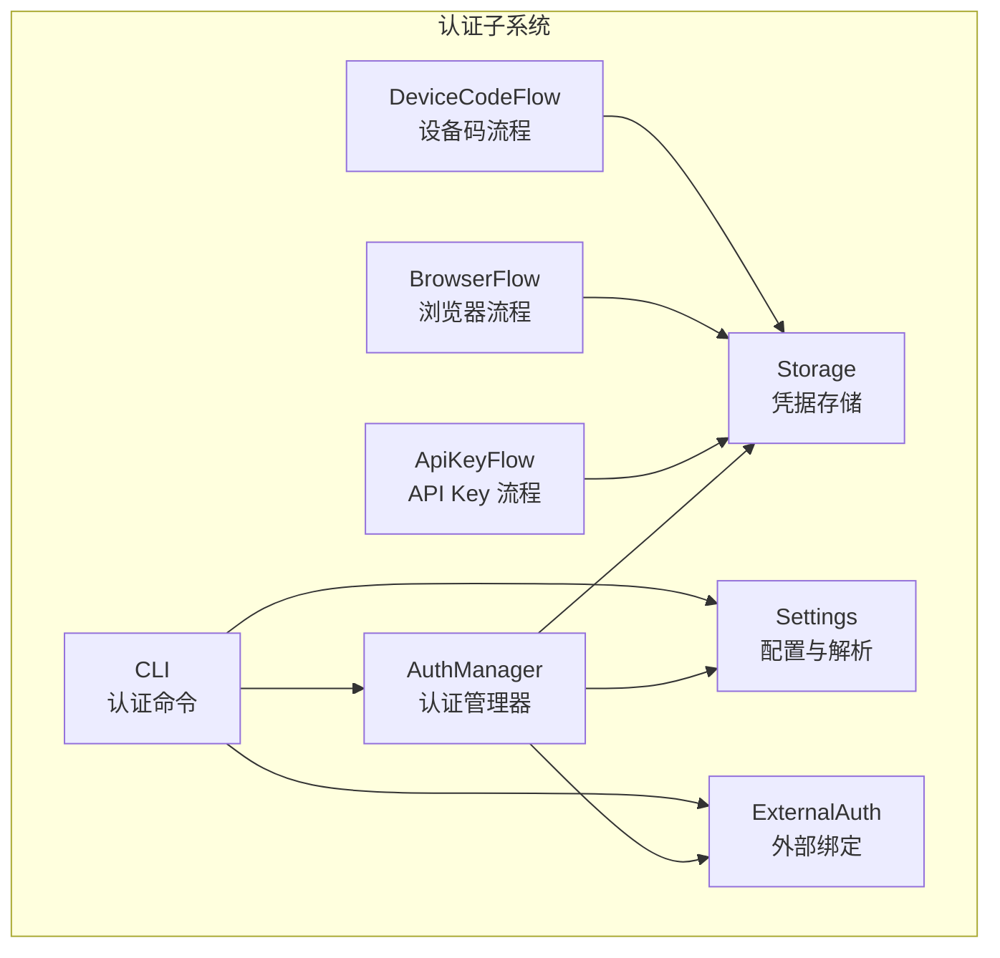
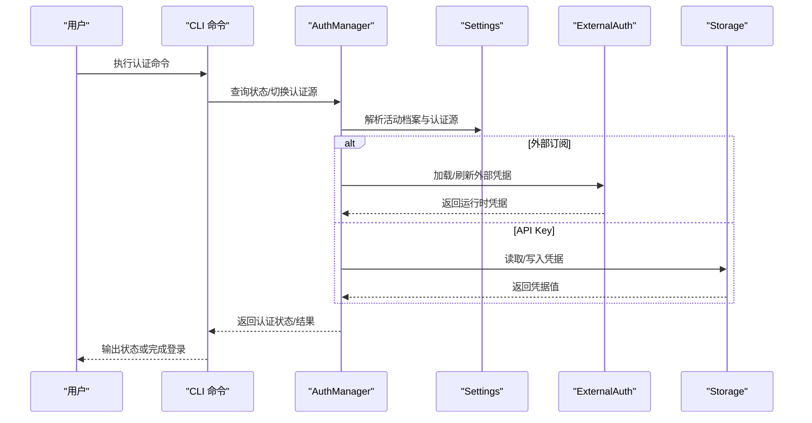
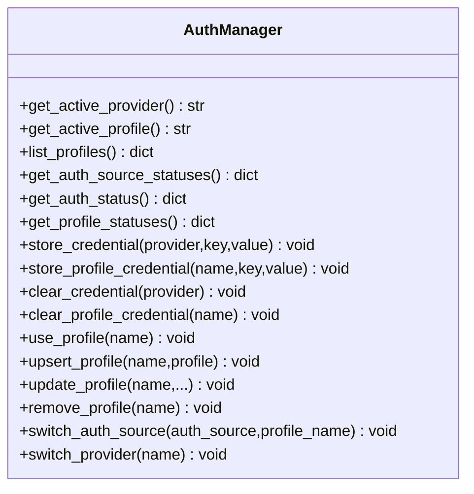
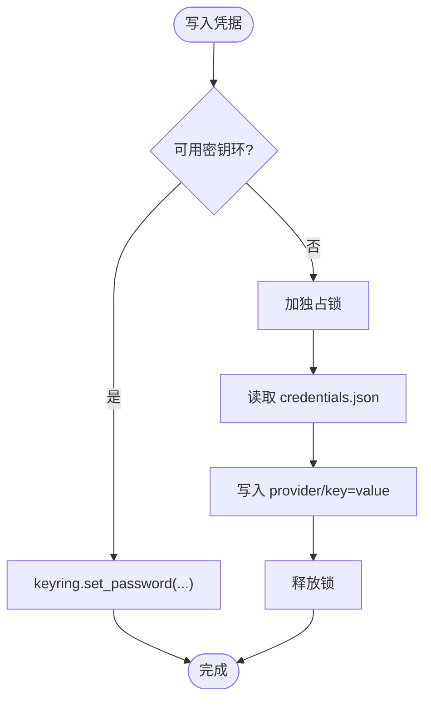
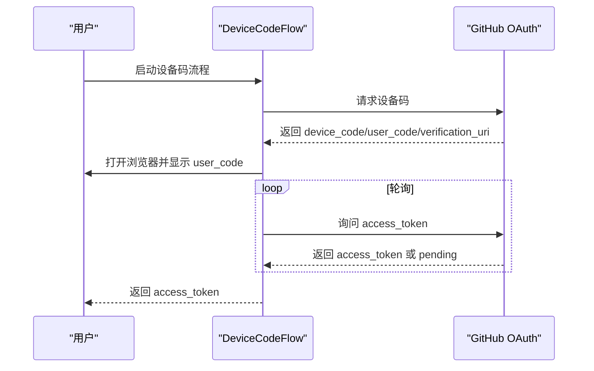
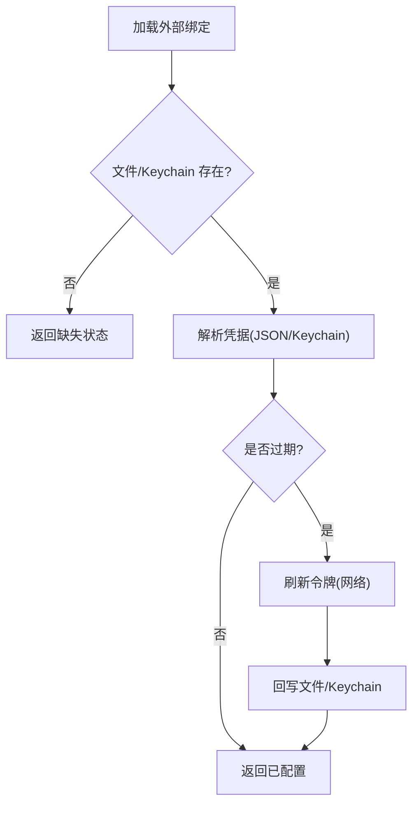
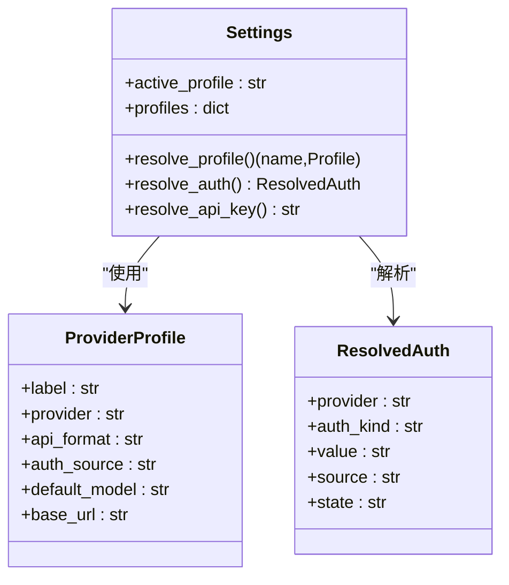
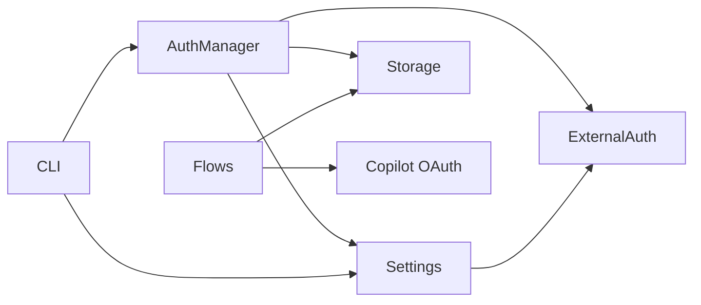

# 认证管理

<cite>
**本文引用的文件**
- [src/openharness/auth/__init__.py](file://src/openharness/auth/__init__.py)
- [src/openharness/auth/manager.py](file://src/openharness/auth/manager.py)
- [src/openharness/auth/storage.py](file://src/openharness/auth/storage.py)
- [src/openharness/auth/flows.py](file://src/openharness/auth/flows.py)
- [src/openharness/auth/external.py](file://src/openharness/auth/external.py)
- [src/openharness/api/copilot_auth.py](file://src/openharness/api/copilot_auth.py)
- [src/openharness/api/client.py](file://src/openharness/api/client.py)
- [src/openharness/config/settings.py](file://src/openharness/config/settings.py)
- [src/openharness/cli.py](file://src/openharness/cli.py)
- [tests/test_auth/test_flows.py](file://tests/test_auth/test_flows.py)
- [tests/test_auth/test_external.py](file://tests/test_auth/test_external.py)
</cite>

## 目录
1. [简介](#简介)
2. [项目结构](#项目结构)
3. [核心组件](#核心组件)
4. [架构总览](#架构总览)
5. [详细组件分析](#详细组件分析)
6. [依赖关系分析](#依赖关系分析)
7. [性能考量](#性能考量)
8. [故障排除指南](#故障排除指南)
9. [结论](#结论)
10. [附录](#附录)

## 简介
本文件系统化梳理 OpenHarness 的认证管理体系，覆盖凭据存储机制、认证状态检查、外部绑定管理与多认证方式（API Key、OAuth 设备流、外部订阅绑定）的完整工作流。文档同时提供最佳实践、安全注意事项与故障排除建议，并给出认证状态查询、凭据更新与多账户管理的使用指南。

## 项目结构
认证子系统围绕“统一认证管理器 + 多种认证流 + 凭据存储 + 外部绑定”展开，主要模块如下：
- 认证管理器：集中查询/切换认证源、读取/写入凭据、维护活动配置
- 认证流：API Key 流程、浏览器引导流程、设备码 OAuth 流程
- 凭据存储：文件后端（默认，权限保护）与可选系统密钥环后端
- 外部绑定：Codex/Claude 等外部 CLI 订阅凭据的发现、加载、刷新与状态描述
- 配置与设置：提供者档案、认证源映射、运行时凭据解析
- CLI：认证状态查看、登录/登出、切换认证源与提供者

图示来源
- [src/openharness/auth/manager.py:71-483](file://src/openharness/auth/manager.py#L71-L483)
- [src/openharness/auth/storage.py:122-270](file://src/openharness/auth/storage.py#L122-L270)
- [src/openharness/auth/flows.py:34-190](file://src/openharness/auth/flows.py#L34-L190)
- [src/openharness/auth/external.py:116-343](file://src/openharness/auth/external.py#L116-L343)
- [src/openharness/config/settings.py:534-800](file://src/openharness/config/settings.py#L534-L800)
- [src/openharness/cli.py:1837-1890](file://src/openharness/cli.py#L1837-L1890)

章节来源
- [src/openharness/auth/__init__.py:1-30](file://src/openharness/auth/__init__.py#L1-L30)
- [src/openharness/auth/manager.py:71-483](file://src/openharness/auth/manager.py#L71-L483)
- [src/openharness/auth/storage.py:122-270](file://src/openharness/auth/storage.py#L122-L270)
- [src/openharness/auth/flows.py:34-190](file://src/openharness/auth/flows.py#L34-L190)
- [src/openharness/auth/external.py:116-343](file://src/openharness/auth/external.py#L116-L343)
- [src/openharness/config/settings.py:534-800](file://src/openharness/config/settings.py#L534-L800)
- [src/openharness/cli.py:1837-1890](file://src/openharness/cli.py#L1837-L1890)

## 核心组件
- 认证管理器（AuthManager）
  - 负责列出/切换认证源、查询认证状态、读写凭据、维护活动提供者与档案
  - 提供凭据存取与 Profile 管理能力，支持同步活动设置快照
- 凭据存储（Storage）
  - 默认文件后端（~/.openharness/credentials.json，权限 600），可选系统密钥环
  - 支持外部绑定元数据持久化（指向外部 CLI 管理的凭据位置）
- 认证流（Flows）
  - ApiKeyFlow：直接交互式输入并保存 API Key
  - BrowserFlow：打开浏览器并提示粘贴令牌
  - DeviceCodeFlow：GitHub OAuth 设备码流程（含跨平台浏览器打开与轮询）
- 外部绑定（ExternalAuth）
  - 支持 Codex/Claude 等外部 CLI 的订阅凭据发现、加载、刷新与状态描述
  - 自动处理过期令牌的刷新与本地文件/密钥环回写
- 配置与解析（Settings）
  - 提供者档案、认证源映射、运行时凭据解析（含外部绑定）
- CLI 认证命令
  - 状态查询、登录/登出、切换认证源与提供者

章节来源
- [src/openharness/auth/manager.py:71-483](file://src/openharness/auth/manager.py#L71-L483)
- [src/openharness/auth/storage.py:122-270](file://src/openharness/auth/storage.py#L122-L270)
- [src/openharness/auth/flows.py:34-190](file://src/openharness/auth/flows.py#L34-L190)
- [src/openharness/auth/external.py:116-343](file://src/openharness/auth/external.py#L116-L343)
- [src/openharness/config/settings.py:534-800](file://src/openharness/config/settings.py#L534-L800)
- [src/openharness/cli.py:1837-1890](file://src/openharness/cli.py#L1837-L1890)

## 架构总览
OpenHarness 的认证体系以“配置驱动 + 存储抽象 + 外部桥接”为核心设计原则：
- 配置层：通过 ProviderProfile 与认证源（auth_source）定义凭据来源与格式
- 存储层：优先使用系统密钥环；不可用时回退到受权限保护的 JSON 文件
- 外部层：对 Codex/Claude 等外部 CLI 的订阅凭据进行桥接与刷新
- 运行时：Settings.resolve_auth() 将当前档案映射为运行时凭据，支持外部刷新

图示来源
- [src/openharness/auth/manager.py:116-184](file://src/openharness/auth/manager.py#L116-L184)
- [src/openharness/config/settings.py:730-800](file://src/openharness/config/settings.py#L730-L800)
- [src/openharness/auth/external.py:116-236](file://src/openharness/auth/external.py#L116-L236)
- [src/openharness/auth/storage.py:122-164](file://src/openharness/auth/storage.py#L122-L164)

## 详细组件分析

### 认证管理器（AuthManager）
- 主要职责
  - 列出可用提供者档案与认证源状态
  - 查询各提供者的认证状态（环境变量/文件/外部/密钥环）
  - 读写凭据（支持按提供者或按档案作用域）
  - 切换活动档案与认证源
- 关键接口
  - get_auth_source_statuses()/get_auth_status()/get_profile_statuses()
  - store_credential()/store_profile_credential()/clear_credential()/clear_profile_credential()
  - use_profile()/upsert_profile()/update_profile()/remove_profile()
  - switch_auth_source()/switch_provider()

图示来源
- [src/openharness/auth/manager.py:104-483](file://src/openharness/auth/manager.py#L104-L483)

章节来源
- [src/openharness/auth/manager.py:104-483](file://src/openharness/auth/manager.py#L104-L483)

### 凭据存储（Storage）
- 存储后端
  - 文件后端：~/.openharness/credentials.json，权限 600
  - 可选系统密钥环：在可用时优先使用
- 关键能力
  - store_credential/load_credential/clear_provider_credentials
  - 外部绑定元数据存储与加载（ExternalAuthBinding）
  - 仅用于非机密数据的轻量混淆工具（不应用于 API Key）

图示来源
- [src/openharness/auth/storage.py:122-190](file://src/openharness/auth/storage.py#L122-L190)

章节来源
- [src/openharness/auth/storage.py:122-270](file://src/openharness/auth/storage.py#L122-L270)

### 认证流（Flows）
- ApiKeyFlow：交互式输入 API Key 并返回
- BrowserFlow：打开授权 URL，提示用户粘贴令牌
- DeviceCodeFlow：请求设备码、自动打开浏览器、轮询访问令牌（跨平台安全打开）

图示来源
- [src/openharness/auth/flows.py:117-159](file://src/openharness/auth/flows.py#L117-L159)
- [src/openharness/api/copilot_auth.py:153-241](file://src/openharness/api/copilot_auth.py#L153-L241)

章节来源
- [src/openharness/auth/flows.py:34-190](file://src/openharness/auth/flows.py#L34-L190)
- [src/openharness/api/copilot_auth.py:153-241](file://src/openharness/api/copilot_auth.py#L153-L241)

### 外部绑定（ExternalAuth）
- 支持 Codex/Claude 等外部 CLI 的订阅凭据
- 默认绑定策略：根据平台与环境变量选择文件或系统密钥链
- 加载与刷新：从外部 JSON 或 Keychain 读取，必要时刷新过期令牌并回写
- 状态描述：缺失、无效、已配置、可刷新、已过期等

图示来源
- [src/openharness/auth/external.py:116-236](file://src/openharness/auth/external.py#L116-L236)
- [src/openharness/auth/external.py:295-343](file://src/openharness/auth/external.py#L295-L343)

章节来源
- [src/openharness/auth/external.py:116-343](file://src/openharness/auth/external.py#L116-L343)
- [tests/test_auth/test_external.py:35-95](file://tests/test_auth/test_external.py#L35-L95)

### 配置与运行时解析（Settings）
- ProviderProfile：定义提供者、API 格式、认证源、默认模型、基础 URL 等
- 认证源映射：将 auth_source 映射到存储/运行时提供者名
- 运行时解析：resolve_auth() 按当前档案解析凭据，支持外部订阅凭据与刷新

图示来源
- [src/openharness/config/settings.py:116-140](file://src/openharness/config/settings.py#L116-L140)
- [src/openharness/config/settings.py:534-800](file://src/openharness/config/settings.py#L534-L800)

章节来源
- [src/openharness/config/settings.py:534-800](file://src/openharness/config/settings.py#L534-L800)

### CLI 认证命令
- 认证状态：oh auth status
- 登出：oh auth logout [provider]
- 切换：oh auth switch <auth-source|profile>
- Copilot 登录：oh auth copilot-login（设备码流程）
- Codex 登录：oh auth codex-login（外部绑定）
- Claude 登录：oh auth claude-login（外部绑定，支持刷新）

章节来源
- [src/openharness/cli.py:1837-1890](file://src/openharness/cli.py#L1837-L1890)
- [src/openharness/api/copilot_auth.py:153-241](file://src/openharness/api/copilot_auth.py#L153-L241)
- [tests/test_auth/test_flows.py:55-125](file://tests/test_auth/test_flows.py#L55-L125)

## 依赖关系分析
- AuthManager 依赖 Settings、Storage、ExternalAuth
- Flows 依赖 Storage（保存/读取凭据）与 Copilot OAuth 工具
- Settings 依赖 Storage（外部绑定）与 ExternalAuth（订阅凭据）
- CLI 依赖 AuthManager 与 Settings

图示来源
- [src/openharness/auth/manager.py:18-23](file://src/openharness/auth/manager.py#L18-L23)
- [src/openharness/auth/flows.py:118-159](file://src/openharness/auth/flows.py#L118-L159)
- [src/openharness/api/copilot_auth.py:153-241](file://src/openharness/api/copilot_auth.py#L153-L241)
- [src/openharness/config/settings.py:745-772](file://src/openharness/config/settings.py#L745-L772)

章节来源
- [src/openharness/auth/manager.py:18-23](file://src/openharness/auth/manager.py#L18-L23)
- [src/openharness/auth/flows.py:118-159](file://src/openharness/auth/flows.py#L118-L159)
- [src/openharness/api/copilot_auth.py:153-241](file://src/openharness/api/copilot_auth.py#L153-L241)
- [src/openharness/config/settings.py:745-772](file://src/openharness/config/settings.py#L745-L772)

## 性能考量
- 凭据读写采用独占文件锁，避免并发冲突
- 密钥环可用性探测仅在首次调用时执行并缓存结果
- 外部订阅凭据刷新在网络请求失败时重试，避免频繁轮询
- 设备码轮询加入安全余量，降低服务端限流风险

## 故障排除指南
- 设备码流程无法打开浏览器
  - 平台差异：Windows 使用 os.startfile，macOS/Linux 使用 open/xdg-open
  - 仅允许 http(s) 协议，拒绝 file/javascript 等潜在危险协议
  - 参考测试用例验证行为
- 外部绑定缺失或无效
  - 检查默认绑定路径（Codex/Claude）与环境变量（CODEX_HOME/CLAUDE_HOME/CLAUDE_CONFIG_DIR）
  - Keychain 读取失败时检查服务名与账户属性
- 外部令牌过期
  - Claude 支持刷新，若 refresh_token 缺失则需重新登录官方 CLI
  - 刷新成功后会回写文件或 Keychain
- 密钥环不可用
  - 在容器/CI/WSL 等无可用后端环境中，系统会回退到文件后端
  - 确保 credentials.json 权限为 600，避免明文泄露

章节来源
- [tests/test_auth/test_flows.py:55-125](file://tests/test_auth/test_flows.py#L55-L125)
- [tests/test_auth/test_external.py:499-575](file://tests/test_auth/test_external.py#L499-L575)
- [src/openharness/auth/external.py:413-476](file://src/openharness/auth/external.py#L413-L476)
- [src/openharness/auth/storage.py:87-111](file://src/openharness/auth/storage.py#L87-L111)

## 结论
OpenHarness 的认证管理以“配置驱动 + 存储抽象 + 外部桥接”为核心，既支持传统 API Key，也无缝集成外部 CLI 订阅与 OAuth 设备码流程。通过统一的认证管理器与 CLI 命令，用户可以便捷地查询状态、切换认证源、更新凭据与管理多账户。

## 附录

### 认证方式与工作流程速览
- API Key
  - 通过 ApiKeyFlow 交互输入，AuthManager 写入存储
  - Settings.resolve_api_key()/resolve_auth() 读取
- OAuth 设备码（Copilot）
  - DeviceCodeFlow 请求设备码，自动打开浏览器，轮询访问令牌
  - Copilot OAuth 工具保存令牌至配置目录
- 外部订阅绑定（Codex/Claude）
  - 默认绑定指向外部 CLI 的 JSON 或 Keychain
  - 加载时校验有效性，过期时自动刷新并回写

章节来源
- [src/openharness/auth/flows.py:34-190](file://src/openharness/auth/flows.py#L34-L190)
- [src/openharness/api/copilot_auth.py:153-241](file://src/openharness/api/copilot_auth.py#L153-L241)
- [src/openharness/auth/external.py:116-236](file://src/openharness/auth/external.py#L116-L236)

### 最佳实践与安全建议
- 优先使用系统密钥环存储敏感凭据；在受限环境回退文件后端时确保文件权限严格
- 对外部绑定定期检查状态，及时刷新过期令牌
- 不在生产中使用轻量混淆函数加密机密数据
- 使用 CLI 的认证状态命令定期巡检认证配置

### 使用指南
- 认证状态查询
  - 使用 oh auth status 查看认证源与提供者档案状态
- 凭据更新
  - API Key：通过 ApiKeyFlow 或直接写入存储
  - 外部绑定：使用 oh auth codex-login/claude-login 完成绑定与刷新
- 多账户管理
  - 使用 ProviderProfile 定义多个档案，通过 oh provider use/switch 切换
  - 使用 oh auth switch 切换认证源而不改变档案

章节来源
- [src/openharness/cli.py:1837-1890](file://src/openharness/cli.py#L1837-L1890)
- [src/openharness/auth/manager.py:291-318](file://src/openharness/auth/manager.py#L291-L318)
- [src/openharness/config/settings.py:581-626](file://src/openharness/config/settings.py#L581-L626)