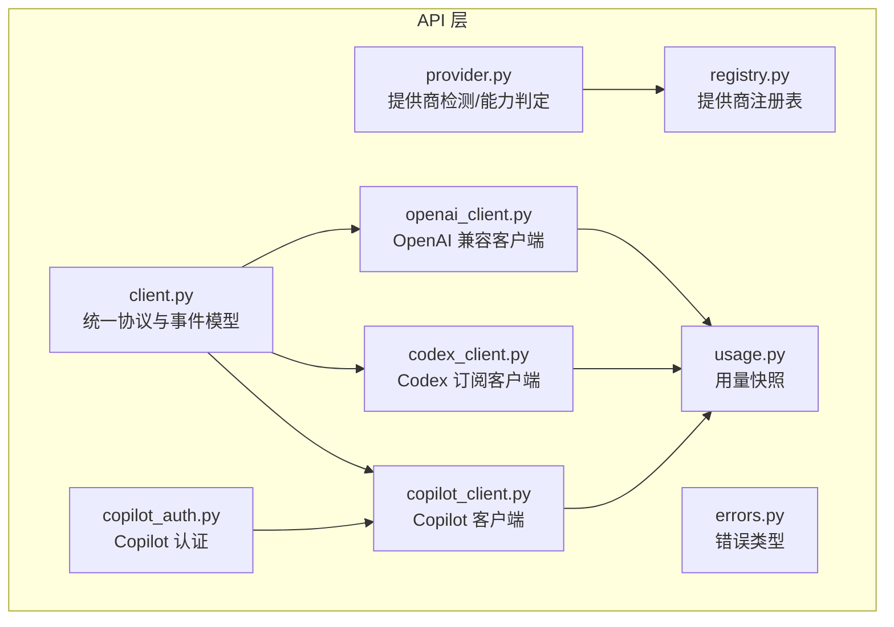
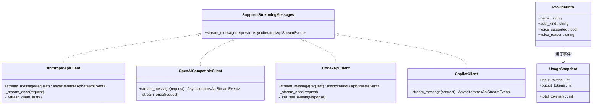
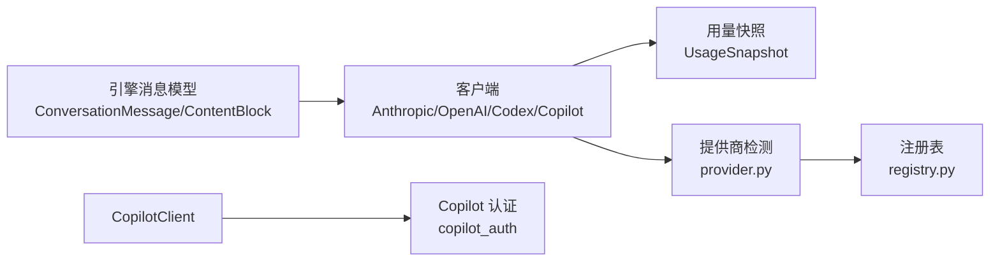

# API 参考

<cite>
**本文引用的文件**
- [src/openharness/api/__init__.py](file://src/openharness/api/__init__.py)
- [src/openharness/api/client.py](file://src/openharness/api/client.py)
- [src/openharness/api/openai_client.py](file://src/openharness/api/openai_client.py)
- [src/openharness/api/codex_client.py](file://src/openharness/api/codex_client.py)
- [src/openharness/api/copilot_client.py](file://src/openharness/api/copilot_client.py)
- [src/openharness/api/provider.py](file://src/openharness/api/provider.py)
- [src/openharness/api/registry.py](file://src/openharness/api/registry.py)
- [src/openharness/api/errors.py](file://src/openharness/api/errors.py)
- [src/openharness/api/usage.py](file://src/openharness/api/usage.py)
- [src/openharness/api/copilot_auth.py](file://src/openharness/api/copilot_auth.py)
- [tests/test_api/test_client.py](file://tests/test_api/test_client.py)
- [tests/test_api/test_openai_client.py](file://tests/test_api/test_openai_client.py)
- [tests/test_api/test_codex_client.py](file://tests/test_api/test_codex_client.py)
- [tests/test_api/test_copilot_client.py](file://tests/test_api/test_copilot_client.py)
- [tests/test_api/test_copilot_auth.py](file://tests/test_api/test_copilot_auth.py)
</cite>

## 目录
1. [简介](#简介)
2. [项目结构](#项目结构)
3. [核心组件](#核心组件)
4. [架构总览](#架构总览)
5. [详细组件分析](#详细组件分析)
6. [依赖关系分析](#依赖关系分析)
7. [性能与可靠性](#性能与可靠性)
8. [故障排查](#故障排查)
9. [结论](#结论)
10. [附录：使用示例与集成指南](#附录使用示例与集成指南)

## 简介
本文件为 OpenHarness 的完整 API 参考，覆盖以下接口与能力：
- 统一的消息流式调用协议（支持文本增量事件、完整消息事件、重试事件）
- 多提供商适配：Anthropic、OpenAI 兼容、GitHub Copilot、OpenAI Codex 订阅
- 认证与鉴权：API Key、OAuth 设备流程、Claude OAuth 标识头
- 错误类型与重试策略
- 使用统计与用量快照
- 提供商检测与能力判定
- 客户端 SDK 使用要点与最佳实践

本参考不直接展示代码片段，而是通过“文件路径+行号”定位到源码实现，便于读者在仓库中精确定位。

## 项目结构
OpenHarness 的 API 层位于 src/openharness/api 下，按职责划分为：
- 客户端封装：Anthropic、OpenAI 兼容、Copilot、Codex
- 通用模型与协议：消息请求、流事件、用量快照
- 供应商注册表与能力判定：自动识别提供商、认证方式、多模态能力
- 错误体系：统一的上游错误分类
- Copilot 认证：设备码流程与持久化

图表来源
- [src/openharness/api/client.py:39-77](file://src/openharness/api/client.py#L39-L77)
- [src/openharness/api/openai_client.py:260-481](file://src/openharness/api/openai_client.py#L260-L481)
- [src/openharness/api/codex_client.py:221-408](file://src/openharness/api/codex_client.py#L221-L408)
- [src/openharness/api/copilot_client.py:48-131](file://src/openharness/api/copilot_client.py#L48-L131)
- [src/openharness/api/provider.py:42-94](file://src/openharness/api/provider.py#L42-L94)
- [src/openharness/api/registry.py:17-368](file://src/openharness/api/registry.py#L17-L368)
- [src/openharness/api/errors.py:6-20](file://src/openharness/api/errors.py#L6-L20)
- [src/openharness/api/usage.py:8-18](file://src/openharness/api/usage.py#L8-L18)
- [src/openharness/api/copilot_auth.py:48-146](file://src/openharness/api/copilot_auth.py#L48-L146)

章节来源
- [src/openharness/api/__init__.py:1-22](file://src/openharness/api/__init__.py#L1-L22)

## 核心组件
- 统一协议与事件模型
  - 请求模型：ApiMessageRequest（模型名、消息列表、系统提示、最大输出、工具列表、推理强度）
  - 流事件：ApiTextDeltaEvent（文本增量）、ApiMessageCompleteEvent（完整消息+用量+停止原因）、ApiRetryEvent（可恢复失败的重试通知）
  - 协议：SupportsStreamingMessages（stream_message 方法）
- 用量快照：UsageSnapshot（输入/输出 token）
- 错误体系：OpenHarnessApiError 基类，AuthenticationFailure、RateLimitFailure、RequestFailure
- 提供商检测：ProviderInfo（名称、认证方式、语音支持状态与原因），auth_status 返回简要状态字符串
- 注册表：ProviderSpec（提供商元数据）与检测逻辑（按 key 前缀、base_url 关键词、模型关键字）

章节来源
- [src/openharness/api/client.py:39-77](file://src/openharness/api/client.py#L39-L77)
- [src/openharness/api/usage.py:8-18](file://src/openharness/api/usage.py#L8-L18)
- [src/openharness/api/errors.py:6-20](file://src/openharness/api/errors.py#L6-L20)
- [src/openharness/api/provider.py:32-94](file://src/openharness/api/provider.py#L32-L94)
- [src/openharness/api/registry.py:17-49](file://src/openharness/api/registry.py#L17-L49)

## 架构总览
OpenHarness 将不同提供商抽象为统一的流式消息接口。上层查询引擎仅依赖 SupportsStreamingMessages 协议，具体由各客户端实现：
- AnthropicApiClient：基于 AsyncAnthropic，支持 Claude OAuth 身份头与元数据
- OpenAICompatibleClient：将消息与工具转换为 OpenAI 格式，处理 reasoning_content、token 限制字段差异
- CodexApiClient：通过 ChatGPT 后端 API 的 SSE 流式响应解析
- CopilotClient：复用 OpenAI 兼容客户端，注入 Copilot 特定头部与企业域名

图表来源
- [src/openharness/api/client.py:80-268](file://src/openharness/api/client.py#L80-L268)
- [src/openharness/api/openai_client.py:260-481](file://src/openharness/api/openai_client.py#L260-L481)
- [src/openharness/api/codex_client.py:221-408](file://src/openharness/api/codex_client.py#L221-L408)
- [src/openharness/api/copilot_client.py:48-131](file://src/openharness/api/copilot_client.py#L48-L131)
- [src/openharness/api/provider.py:32-94](file://src/openharness/api/provider.py#L32-L94)
- [src/openharness/api/usage.py:8-18](file://src/openharness/api/usage.py#L8-L18)

## 详细组件分析

### AnthropicApiClient（流式消息）
- 功能
  - 支持 API Key 与 OAuth（含 Claude OAuth）两种认证模式
  - 自动添加身份头与元数据（会话标识、Attribution）
  - 流式解析 content_block_delta 文本增量，最终返回完整消息与用量
  - 内置指数退避与抖动的可恢复重试（429/5xx/网络错误）
- 关键行为
  - 按需刷新 OAuth Token（支持回调）
  - 根据是否 Claude OAuth 切换 messages/beta.messages 接口
  - 将 ConversationMessage 转换为 SDK 参数
- 错误映射
  - 认证失败、限流、通用请求失败分别映射到对应异常类型

章节来源
- [src/openharness/api/client.py:118-268](file://src/openharness/api/client.py#L118-L268)
- [tests/test_api/test_client.py:7-194](file://tests/test_api/test_client.py#L7-L194)

### OpenAICompatibleClient（OpenAI 兼容）
- 功能
  - 将消息与工具从 Anthropic 格式转换为 OpenAI 兼容格式
  - 处理 reasoning_content 的往返与可选空占位（环境变量开关）
  - 区分 max_tokens 与 max_completion_tokens（针对特定模型族）
  - 流式聚合文本增量、工具调用、用量信息
- 关键行为
  - 正规化 base_url，确保 /v1 路径存在
  - 对带工具调用的请求移除 stream_options，避免触发某些模型的思维模式
- 错误映射
  - 401/403 → 认证失败；429 → 限流；其他 → 通用请求失败

章节来源
- [src/openharness/api/openai_client.py:260-481](file://src/openharness/api/openai_client.py#L260-L481)
- [tests/test_api/test_openai_client.py:30-500](file://tests/test_api/test_openai_client.py#L30-L500)

### CodexApiClient（ChatGPT/Codex 订阅）
- 功能
  - 通过 ChatGPT 后端 API 的 SSE 流式接口获取响应
  - 解析 response.output_text.delta、response.output_item.done、response.completed 等事件
  - 工具调用以 function_call/function_call_output 形式回传
  - 支持 reasoning.effort（低/中/高/xhigh/max 映射）
- 关键行为
  - JWT 校验与 account_id 提取
  - 自动规范化 URL（/codex 或 /codex/responses）
  - 错误消息格式化（优先使用 error.message/detail/request_id）
- 错误映射
  - 401/403 → 认证失败；429 → 限流；其他 → 通用请求失败

章节来源
- [src/openharness/api/codex_client.py:221-408](file://src/openharness/api/codex_client.py#L221-L408)
- [tests/test_api/test_codex_client.py:69-245](file://tests/test_api/test_codex_client.py#L69-L245)

### CopilotClient（GitHub Copilot）
- 功能
  - 直接使用 GitHub OAuth Token 作为 Authorization: Bearer
  - 无需二次交换令牌；默认企业域与公开域自动推断
  - 注入 Copilot 特定头部（User-Agent、Openai-Intent）
- 关键行为
  - 从持久化文件加载或显式传入 Token
  - 企业域时使用 copilot-api.<domain> 基础地址
  - 委托给 OpenAICompatibleClient 实现流式消息

章节来源
- [src/openharness/api/copilot_client.py:48-131](file://src/openharness/api/copilot_client.py#L48-L131)
- [src/openharness/api/copilot_auth.py:48-146](file://src/openharness/api/copilot_auth.py#L48-L146)
- [tests/test_api/test_copilot_client.py:53-141](file://tests/test_api/test_copilot_client.py#L53-L141)
- [tests/test_api/test_copilot_auth.py:51-278](file://tests/test_api/test_copilot_auth.py#L51-L278)

### 提供商检测与能力判定
- detect_provider：根据配置与注册表推断当前提供商、认证方式与语音支持状态
- auth_status：返回简要认证状态字符串（缺失、已配置、企业域等）
- is_model_multimodal：基于模型名正则判断是否具备视觉能力

章节来源
- [src/openharness/api/provider.py:42-187](file://src/openharness/api/provider.py#L42-L187)
- [src/openharness/api/registry.py:408-438](file://src/openharness/api/registry.py#L408-L438)

### 统一协议与事件模型
- ApiMessageRequest：请求参数载体
- ApiTextDeltaEvent / ApiMessageCompleteEvent / ApiRetryEvent：流式事件
- SupportsStreamingMessages：上层依赖的协议

章节来源
- [src/openharness/api/client.py:39-87](file://src/openharness/api/client.py#L39-L87)

### 错误类型与重试策略
- OpenHarnessApiError 及子类：认证失败、限流、通用请求失败
- 各客户端内置重试：
  - Anthropic：429/5xx/网络错误自动重试，指数退避+抖动
  - OpenAI 兼容：429/502/503/网络错误重试
  - Codex：429/502/503/504/网络错误重试
- 错误翻译：HTTP 状态码映射到对应异常类型

章节来源
- [src/openharness/api/errors.py:6-20](file://src/openharness/api/errors.py#L6-L20)
- [src/openharness/api/client.py:87-116](file://src/openharness/api/client.py#L87-L116)
- [src/openharness/api/openai_client.py:432-450](file://src/openharness/api/openai_client.py#L432-L450)
- [src/openharness/api/codex_client.py:385-408](file://src/openharness/api/codex_client.py#L385-L408)

## 依赖关系分析
- 客户端对引擎消息模型的依赖：ConversationMessage、ContentBlock（文本/图像/工具调用/工具结果）
- 客户端对用量统计的依赖：UsageSnapshot
- Copilot 客户端对认证模块的依赖：copilot_auth（保存/加载 Token、设备码流程）
- 提供商检测对注册表与外部绑定的依赖

图表来源
- [src/openharness/api/client.py:27-27](file://src/openharness/api/client.py#L27-L27)
- [src/openharness/api/openai_client.py:29-36](file://src/openharness/api/openai_client.py#L29-L36)
- [src/openharness/api/codex_client.py:21-21](file://src/openharness/api/codex_client.py#L21-L21)
- [src/openharness/api/copilot_client.py:23-28](file://src/openharness/api/copilot_client.py#L23-L28)
- [src/openharness/api/provider.py:8-11](file://src/openharness/api/provider.py#L8-L11)
- [src/openharness/api/registry.py:17-49](file://src/openharness/api/registry.py#L17-L49)
- [src/openharness/api/usage.py:8-18](file://src/openharness/api/usage.py#L8-L18)

## 性能与可靠性
- 重试策略
  - 最大重试次数与指数退避，结合随机抖动降低碰撞
  - 针对 429/5xx 与网络错误进行自动重试
- 流式处理
  - 逐块增量输出文本，减少首字节延迟
  - 工具调用与文本增量并行聚合
- 用量统计
  - 在流中或结束时收集 input/output tokens，便于成本追踪

章节来源
- [src/openharness/api/client.py:31-116](file://src/openharness/api/client.py#L31-L116)
- [src/openharness/api/openai_client.py:279-431](file://src/openharness/api/openai_client.py#L279-L431)
- [src/openharness/api/codex_client.py:229-357](file://src/openharness/api/codex_client.py#L229-L357)

## 故障排查
- 认证失败
  - 检查 API Key/OAuth Token 是否正确配置
  - Copilot：确认 ~/.openharness/copilot_auth.json 是否存在且有效
  - Codex：确认 JWT Token 结构与 account_id 是否正确
- 限流
  - 观察重试事件与日志中的警告信息
  - 调整请求频率或升级配额
- 网络/超时
  - 检查代理与防火墙设置
  - 适当增大超时时间
- 多模态/工具调用
  - 确认模型名是否匹配注册表关键字
  - 检查工具 schema 与参数格式

章节来源
- [src/openharness/api/errors.py:6-20](file://src/openharness/api/errors.py#L6-L20)
- [src/openharness/api/copilot_auth.py:97-146](file://src/openharness/api/copilot_auth.py#L97-L146)
- [src/openharness/api/codex_client.py:30-46](file://src/openharness/api/codex_client.py#L30-L46)

## 结论
OpenHarness 的 API 层通过统一协议与多客户端适配，屏蔽了不同提供商的差异，向上提供一致的流式消息体验。配合完善的错误分类、重试机制与用量统计，既满足开发易用性，也兼顾生产稳定性。建议在集成时：
- 明确提供商与认证方式（API Key/OAuth）
- 正确处理流式事件与工具调用
- 合理配置重试与超时参数
- 使用用量快照进行成本控制

## 附录：使用示例与集成指南

### 认证与初始化
- Anthropic
  - 支持 api_key 或 auth_token（OAuth），可启用 claude_oauth 并提供 auth_token_resolver
  - 参考：[src/openharness/api/client.py:121-160](file://src/openharness/api/client.py#L121-L160)
- OpenAI 兼容
  - 传入 api_key 与 base_url（可正规化），可设置超时
  - 参考：[src/openharness/api/openai_client.py:267-277](file://src/openharness/api/openai_client.py#L267-L277)
- Codex
  - 传入 Codex 访问 Token（JWT），可指定 base_url（将被规范化）
  - 参考：[src/openharness/api/codex_client.py:224-227](file://src/openharness/api/codex_client.py#L224-L227)
- Copilot
  - 传入 GitHub OAuth Token（ghu_/gho_），或从持久化文件读取
  - 企业域：传入 enterprise_url 或在持久化文件中配置
  - 参考：[src/openharness/api/copilot_client.py:67-111](file://src/openharness/api/copilot_client.py#L67-L111)，[src/openharness/api/copilot_auth.py:97-146](file://src/openharness/api/copilot_auth.py#L97-L146)

### 发起一次流式消息
- 构造 ApiMessageRequest（模型、消息、系统提示、工具、推理强度）
- 调用 client.stream_message(request)
- 迭代事件：ApiTextDeltaEvent（增量文本）、ApiMessageCompleteEvent（完整消息+用量+停止原因）、ApiRetryEvent（可恢复错误的重试通知）
- 参考：[src/openharness/api/client.py:161-198](file://src/openharness/api/client.py#L161-L198)

### 错误处理与重试
- 捕获 OpenHarnessApiError 及其子类
- 对 429/5xx/网络错误自动重试；对认证失败与不可恢复错误及时退出
- 参考：[src/openharness/api/client.py:171-197](file://src/openharness/api/client.py#L171-L197)，[src/openharness/api/openai_client.py:283-310](file://src/openharness/api/openai_client.py#L283-L310)，[src/openharness/api/codex_client.py:231-251](file://src/openharness/api/codex_client.py#L231-L251)

### 用量统计
- 使用 UsageSnapshot 获取 input_tokens 与 output_tokens
- 参考：[src/openharness/api/usage.py:8-18](file://src/openharness/api/usage.py#L8-L18)

### 提供商检测与能力
- detect_provider：根据配置与注册表推断提供商与认证方式
- auth_status：返回简要状态字符串
- is_model_multimodal：判断模型是否具备视觉能力
- 参考：[src/openharness/api/provider.py:42-187](file://src/openharness/api/provider.py#L42-L187)，[src/openharness/api/registry.py:408-438](file://src/openharness/api/registry.py#L408-L438)

### Copilot 设备码流程（一次性）
- request_device_code：获取设备码与用户码
- poll_for_access_token：轮询直到授权或超时
- save_copilot_auth：保存 Token 与企业域
- 参考：[src/openharness/api/copilot_auth.py:153-241](file://src/openharness/api/copilot_auth.py#L153-L241)，[tests/test_api/test_copilot_auth.py:151-278](file://tests/test_api/test_copilot_auth.py#L151-L278)