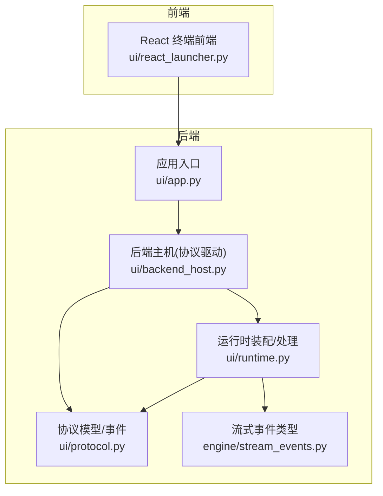
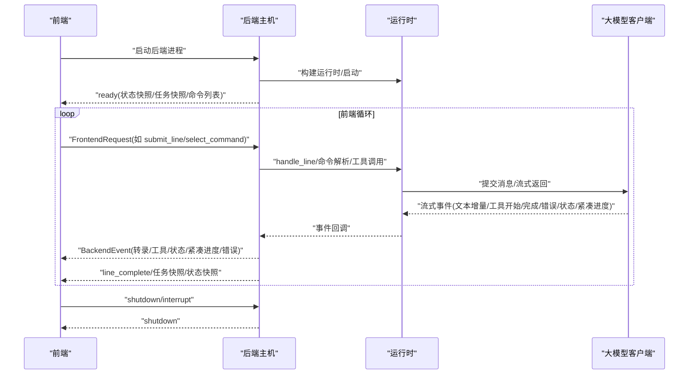
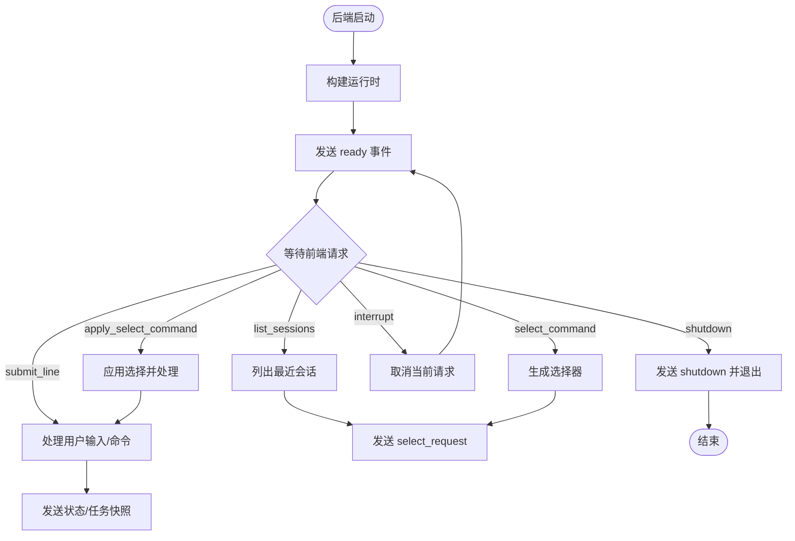
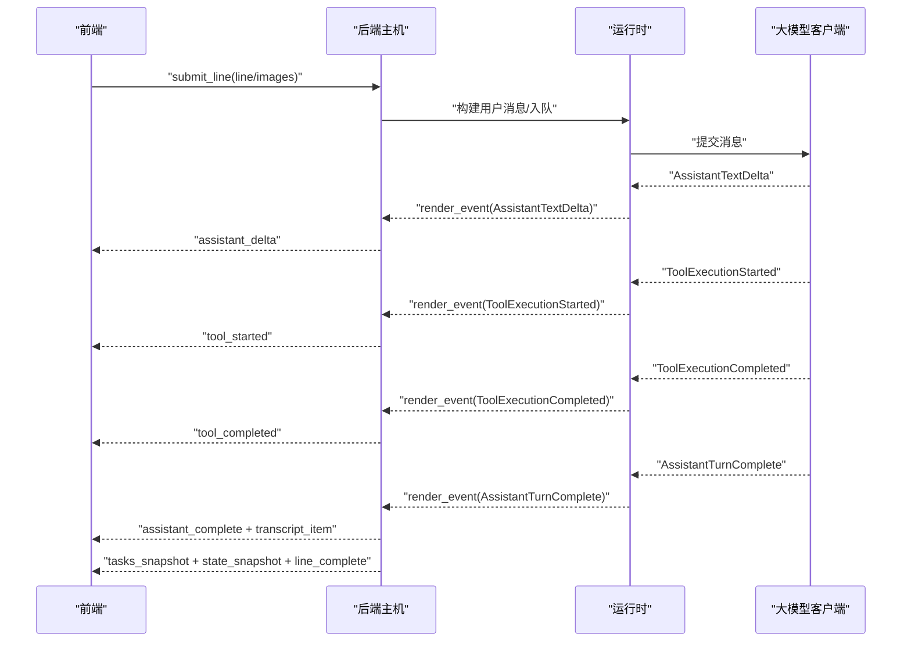
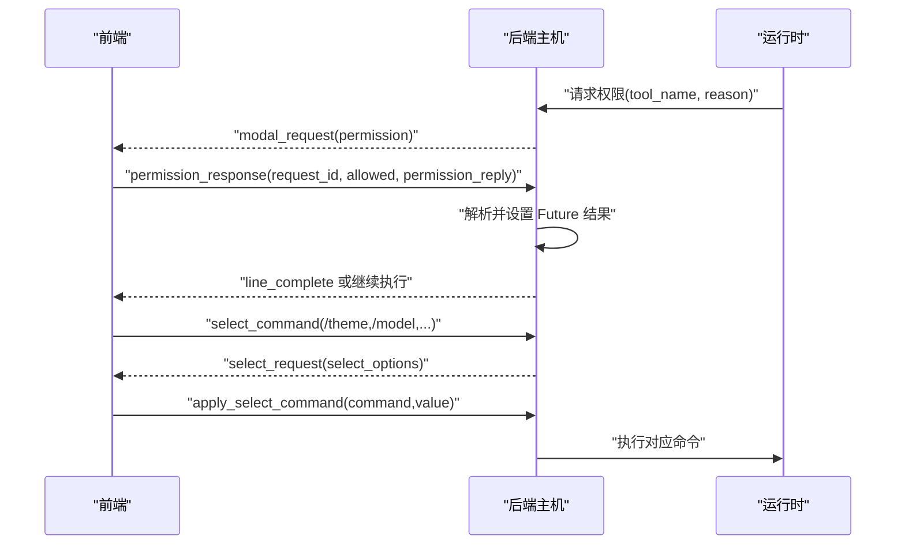
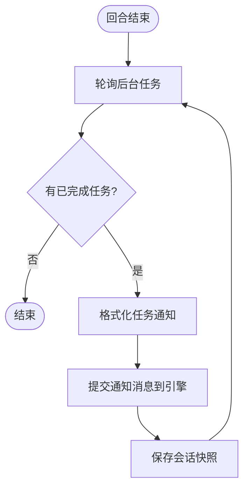
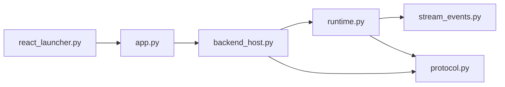

# UI 协议 API

<cite>
**本文引用的文件**
- [protocol.py](file://src/openharness/ui/protocol.py)
- [backend_host.py](file://src/openharness/ui/backend_host.py)
- [runtime.py](file://src/openharness/ui/runtime.py)
- [app.py](file://src/openharness/ui/app.py)
- [react_launcher.py](file://src/openharness/ui/react_launcher.py)
- [coordinator_drain.py](file://src/openharness/ui/coordinator_drain.py)
- [stream_events.py](file://src/openharness/engine/stream_events.py)
- [test_react_backend.py](file://tests/test_ui/test_react_backend.py)
</cite>

## 目录
1. [简介](#简介)
2. [项目结构](#项目结构)
3. [核心组件](#核心组件)
4. [架构总览](#架构总览)
5. [详细组件分析](#详细组件分析)
6. [依赖关系分析](#依赖关系分析)
7. [性能考量](#性能考量)
8. [故障排查指南](#故障排查指南)
9. [结论](#结论)
10. [附录](#附录)

## 简介
本文件系统化梳理 OpenHarness 的 UI 协议 API，覆盖前端与后端之间的消息格式、事件类型、数据传输与控制流。协议采用基于 JSON 的文本行（JSON Lines）格式，通过标准输入输出进行双向通信，支持会话管理、工具调用、状态同步、权限弹窗、选择器交互、任务状态、紧凑进度、语音与键位模式等特性。本文同时给出协议扩展点、安全与性能优化建议，以及典型使用场景的流程图。

## 项目结构
UI 协议相关代码主要位于以下模块：
- 协议模型与事件：ui/protocol.py
- 后端主机（stdin/stdout 协议驱动）：ui/backend_host.py
- 运行时装配与处理：ui/runtime.py
- 前端启动器（React 终端）：ui/react_launcher.py
- 应用入口与模式切换：ui/app.py
- 协调者模式下的异步任务收尾：ui/coordinator_drain.py
- 流式事件类型：engine/stream_events.py
- 单元测试（协议行为验证）：tests/test_ui/test_react_backend.py

图表来源
- [react_launcher.py:116-176](file://src/openharness/ui/react_launcher.py#L116-L176)
- [app.py:40-90](file://src/openharness/ui/app.py#L40-L90)
- [backend_host.py:73-188](file://src/openharness/ui/backend_host.py#L73-L188)
- [runtime.py:246-443](file://src/openharness/ui/runtime.py#L246-L443)
- [protocol.py:37-136](file://src/openharness/ui/protocol.py#L37-L136)
- [stream_events.py:12-91](file://src/openharness/engine/stream_events.py#L12-L91)

章节来源
- [react_launcher.py:116-176](file://src/openharness/ui/react_launcher.py#L116-L176)
- [app.py:40-90](file://src/openharness/ui/app.py#L40-L90)
- [backend_host.py:73-188](file://src/openharness/ui/backend_host.py#L73-L188)
- [runtime.py:246-443](file://src/openharness/ui/runtime.py#L246-L443)
- [protocol.py:37-136](file://src/openharness/ui/protocol.py#L37-L136)
- [stream_events.py:12-91](file://src/openharness/engine/stream_events.py#L12-L91)

## 核心组件
- 前端请求模型（FrontendRequest）
  - 类型：submit_line、permission_response、question_response、list_sessions、select_command、apply_select_command、interrupt、shutdown
  - 字段：line、command、value、request_id、allowed、permission_reply、answer、images（图片附件）
- 图片附件模型（FrontendImageAttachment）
  - 字段：media_type（必须以 image/ 开头）、data（非空 Base64）、source_path（可选）
- 后端事件模型（BackendEvent）
  - 类型：ready、state_snapshot、tasks_snapshot、transcript_item、compact_progress、assistant_delta、assistant_complete、line_complete、tool_started、tool_completed、clear_transcript、modal_request、select_request、todo_update、plan_mode_change、swarm_status、error、shutdown
  - 扩展字段：select_options、message、item（TranscriptItem）、state、tasks、mcp_servers、bridge_sessions、commands、modal、tool_name、tool_input、output、is_error、compact_phase、compact_trigger、attempt、compact_checkpoint、compact_metadata、todo_markdown、plan_mode、swarm_teammates、swarm_notifications
- 转录项（TranscriptItem）
  - 字段：role（system、user、assistant、tool、tool_result、log）、text、tool_name、tool_input、is_error
- 任务快照（TaskSnapshot）
  - 字段：id、type、status、description、metadata
- 流式事件（StreamEvent）
  - 类型：AssistantTextDelta、AssistantTurnComplete、ToolExecutionStarted、ToolExecutionCompleted、ErrorEvent、StatusEvent、CompactProgressEvent

章节来源
- [protocol.py:15-136](file://src/openharness/ui/protocol.py#L15-L136)
- [stream_events.py:12-91](file://src/openharness/engine/stream_events.py#L12-L91)

## 架构总览
后端主机通过 JSON Lines 在 stdin/stdout 上与前端通信。前端启动后，后端主机初始化运行时、发送 ready 事件，随后读取前端请求并执行相应动作，期间持续向前端推送各类事件（转录、工具执行、状态、紧凑进度等）。前端负责渲染与交互，后端负责业务逻辑与工具调用。

图表来源
- [backend_host.py:92-188](file://src/openharness/ui/backend_host.py#L92-L188)
- [runtime.py:579-732](file://src/openharness/ui/runtime.py#L579-L732)
- [protocol.py:90-136](file://src/openharness/ui/protocol.py#L90-L136)
- [stream_events.py:12-91](file://src/openharness/engine/stream_events.py#L12-L91)

## 详细组件分析

### 协议消息结构与序列化
- 消息封装
  - 每条消息为一行 JSON 文本，前缀固定为 OHJSON:，用于区分协议帧与普通输出。
  - 示例：OHJSON:{"type":"assistant_delta","message":"..."}

- 请求与事件的类型与字段
  - 请求类型：submit_line、permission_response、question_response、list_sessions、select_command、apply_select_command、interrupt、shutdown
  - 事件类型：ready、state_snapshot、tasks_snapshot、transcript_item、compact_progress、assistant_delta、assistant_complete、line_complete、tool_started、tool_completed、clear_transcript、modal_request、select_request、todo_update、plan_mode_change、swarm_status、error、shutdown

- 数据校验与约束
  - FrontendImageAttachment 的 media_type 必须以 image/ 开头；data 非空。
  - FrontendRequest 的 type 必须在允许集合内。
  - BackendEvent 的 ready/state_snapshot/tasks_snapshot 等方法负责构造有效负载。

章节来源
- [backend_host.py:45-45](file://src/openharness/ui/backend_host.py#L45-L45)
- [backend_host.py:190-223](file://src/openharness/ui/backend_host.py#L190-L223)
- [protocol.py:15-136](file://src/openharness/ui/protocol.py#L15-L136)

### 会话管理与状态同步
- 初始化
  - 后端主机启动后，构建运行时并发送 ready 事件，包含当前状态快照、任务快照与可用命令列表。
- 状态快照
  - 后端周期性或在关键节点发送 state_snapshot/tasks_snapshot，前端据此更新 UI 状态栏与任务面板。
- 会话恢复
  - 支持列出历史会话并以 select_request 形式呈现，用户选择后以 apply_select_command 提交。

图表来源
- [backend_host.py:92-188](file://src/openharness/ui/backend_host.py#L92-L188)
- [backend_host.py:454-473](file://src/openharness/ui/backend_host.py#L454-L473)
- [backend_host.py:475-680](file://src/openharness/ui/backend_host.py#L475-L680)
- [protocol.py:137-200](file://src/openharness/ui/protocol.py#L137-L200)

章节来源
- [backend_host.py:92-188](file://src/openharness/ui/backend_host.py#L92-L188)
- [backend_host.py:428-434](file://src/openharness/ui/backend_host.py#L428-L434)
- [protocol.py:137-200](file://src/openharness/ui/protocol.py#L137-L200)

### 工具调用与转录同步
- 用户输入
  - 前端发送 submit_line，可携带文本与图片附件；后端将其转换为带图片块的用户消息并入队列。
- 流式事件
  - 后端将模型文本增量、工具开始/完成、错误、状态、紧凑进度等事件逐条推送给前端。
- 转录项
  - transcript_item 用于在前端渲染系统消息、用户消息、助手回复、工具调用与结果等。

图表来源
- [backend_host.py:250-390](file://src/openharness/ui/backend_host.py#L250-L390)
- [runtime.py:579-732](file://src/openharness/ui/runtime.py#L579-L732)
- [stream_events.py:12-91](file://src/openharness/engine/stream_events.py#L12-L91)
- [protocol.py:90-136](file://src/openharness/ui/protocol.py#L90-L136)

章节来源
- [backend_host.py:250-390](file://src/openharness/ui/backend_host.py#L250-L390)
- [runtime.py:579-732](file://src/openharness/ui/runtime.py#L579-L732)
- [stream_events.py:12-91](file://src/openharness/engine/stream_events.py#L12-L91)

### 权限弹窗与选择器交互
- 权限弹窗
  - 当需要用户授权工具执行时，后端发出 modal_request(kind=permission)，前端弹出确认框；用户响应 permission_response，后端解析并继续执行。
- 选择器
  - 后端根据 /provider、/theme、/model、/turns 等命令生成 select_request，前端展示选项；用户选择后以 apply_select_command 提交。

图表来源
- [backend_host.py:762-784](file://src/openharness/ui/backend_host.py#L762-L784)
- [backend_host.py:475-680](file://src/openharness/ui/backend_host.py#L475-L680)
- [backend_host.py:391-426](file://src/openharness/ui/backend_host.py#L391-L426)

章节来源
- [backend_host.py:762-784](file://src/openharness/ui/backend_host.py#L762-L784)
- [backend_host.py:475-680](file://src/openharness/ui/backend_host.py#L475-L680)
- [backend_host.py:391-426](file://src/openharness/ui/backend_host.py#L391-L426)

### 协调者模式下的异步任务收尾
- 后台 Agent 完成后，系统按约定在回合之间插入任务通知消息；后端轮询任务状态，格式化通知并作为后续消息提交给协调者。

图表来源
- [coordinator_drain.py:159-199](file://src/openharness/ui/coordinator_drain.py#L159-L199)
- [runtime.py:686-732](file://src/openharness/ui/runtime.py#L686-L732)

章节来源
- [coordinator_drain.py:159-199](file://src/openharness/ui/coordinator_drain.py#L159-L199)
- [runtime.py:686-732](file://src/openharness/ui/runtime.py#L686-L732)

### 协议扩展点与自定义消息类型
- 新增事件类型
  - 在 BackendEvent 中添加新的 type 字段枚举值，并在对应工厂方法中构造 payload。
  - 在渲染侧（前端）增加对新事件类型的处理分支。
- 新增请求类型
  - 在 FrontendRequest 的 type 枚举中加入新类型，并在后端主机的请求分发逻辑中处理。
- 自定义负载字段
  - 在 BackendEvent/FrontendRequest 对应字段上扩展，确保序列化/反序列化一致。
- 注意事项
  - 保持向后兼容：新增字段需可选，避免破坏旧版前端。
  - 明确语义与边界：权限弹窗与选择器需保证互斥与幂等。

章节来源
- [protocol.py:37-136](file://src/openharness/ui/protocol.py#L37-L136)
- [backend_host.py:129-181](file://src/openharness/ui/backend_host.py#L129-L181)

## 依赖关系分析
- 后端主机依赖运行时装配与流式事件类型，负责将业务事件映射为 UI 事件。
- 前端启动器负责定位前端目录、安装依赖、注入配置并启动 TSX 入口。
- 应用入口提供 REPL、任务工作器与打印模式三种运行形态，统一复用后端主机协议。

图表来源
- [react_launcher.py:116-176](file://src/openharness/ui/react_launcher.py#L116-L176)
- [app.py:40-90](file://src/openharness/ui/app.py#L40-L90)
- [backend_host.py:73-188](file://src/openharness/ui/backend_host.py#L73-L188)
- [runtime.py:246-443](file://src/openharness/ui/runtime.py#L246-L443)
- [protocol.py:37-136](file://src/openharness/ui/protocol.py#L37-L136)
- [stream_events.py:12-91](file://src/openharness/engine/stream_events.py#L12-L91)

章节来源
- [react_launcher.py:116-176](file://src/openharness/ui/react_launcher.py#L116-L176)
- [app.py:40-90](file://src/openharness/ui/app.py#L40-L90)
- [backend_host.py:73-188](file://src/openharness/ui/backend_host.py#L73-L188)
- [runtime.py:246-443](file://src/openharness/ui/runtime.py#L246-L443)
- [protocol.py:37-136](file://src/openharness/ui/protocol.py#L37-L136)
- [stream_events.py:12-91](file://src/openharness/engine/stream_events.py#L12-L91)

## 性能考量
- 流式传输
  - 使用 assistant_delta 与工具增量事件，前端可边接收边渲染，降低感知延迟。
- 紧凑进度事件
  - compact_progress 提供上下文压缩阶段的可视化反馈，帮助用户理解长对话的内存管理过程。
- 任务与状态快照
  - 定期发送 tasks_snapshot 与 state_snapshot，减少前端重复计算与网络往返。
- 图像处理
  - 图片以 Base64 传输，建议前端做尺寸与数量限制，后端做媒体类型校验，避免过大载荷。
- 并发与锁
  - 权限弹窗与选择器采用锁机制，避免并发覆盖前端状态，保障一致性。

章节来源
- [backend_host.py:274-390](file://src/openharness/ui/backend_host.py#L274-L390)
- [backend_host.py:762-784](file://src/openharness/ui/backend_host.py#L762-L784)
- [protocol.py:90-136](file://src/openharness/ui/protocol.py#L90-L136)

## 故障排查指南
- 协议解析失败
  - 现象：后端返回 error 事件，提示无效请求。
  - 排查：检查 JSON 格式、OHJSON: 前缀、字段完整性与类型。
- 权限请求超时
  - 现象：permission_response 未及时到达导致超时拒绝。
  - 排查：确认前端弹窗状态、网络延迟、请求 ID 匹配。
- 中断无效
  - 现象：发送 interrupt 后无取消效果。
  - 排查：确认 active_request_task 是否存在且未完成。
- 图像附件校验失败
  - 现象：media_type 不以 image/ 开头或 data 为空。
  - 排查：前端上传时严格校验 MIME 与 Base64。
- 会话恢复异常
  - 现象：选择会话后未正确加载。
  - 排查：确认 select_request/select_command 处理链路与 apply_select_command 调用。

章节来源
- [backend_host.py:190-223](file://src/openharness/ui/backend_host.py#L190-L223)
- [backend_host.py:244-248](file://src/openharness/ui/backend_host.py#L244-L248)
- [protocol.py:15-35](file://src/openharness/ui/protocol.py#L15-L35)
- [test_react_backend.py:164-225](file://tests/test_ui/test_react_backend.py#L164-L225)

## 结论
UI 协议 API 以简洁稳定的 JSON Lines 为基础，结合丰富的事件类型与严格的模型校验，实现了从会话管理、工具调用到状态同步的全链路交互。通过流式事件与紧凑进度反馈，兼顾了用户体验与系统性能。遵循本文的扩展与安全建议，可在不破坏兼容性的前提下平滑演进协议能力。

## 附录

### 协议使用示例（路径指引）
- 会话管理与状态同步
  - 后端发送 ready：[protocol.py:137-151](file://src/openharness/ui/protocol.py#L137-L151)
  - 列出会话并选择：[backend_host.py:454-473](file://src/openharness/ui/backend_host.py#L454-L473)、[backend_host.py:475-680](file://src/openharness/ui/backend_host.py#L475-L680)
- 工具调用与转录
  - 处理用户输入与工具事件：[backend_host.py:250-390](file://src/openharness/ui/backend_host.py#L250-L390)
  - 流式事件类型：[stream_events.py:12-91](file://src/openharness/engine/stream_events.py#L12-L91)
- 权限弹窗与选择器
  - 弹窗与响应：[backend_host.py:762-784](file://src/openharness/ui/backend_host.py#L762-L784)、[backend_host.py:204-222](file://src/openharness/ui/backend_host.py#L204-L222)
  - 选择器生成与应用：[backend_host.py:475-680](file://src/openharness/ui/backend_host.py#L475-L680)
- 协调者模式收尾
  - 任务轮询与通知：[coordinator_drain.py:159-199](file://src/openharness/ui/coordinator_drain.py#L159-L199)

### 安全与合规建议
- 输入校验
  - 前端上传图片时严格校验 media_type 与 data；后端使用 Pydantic 校验器确保字段合法。
- 权限控制
  - 所有写操作与高风险工具调用均需显式授权；权限弹窗采用锁机制避免竞态。
- 日志与审计
  - 关键事件（工具开始/完成、错误、状态变更）均应记录，便于回溯与诊断。
- 前后端兼容
  - 新增事件/字段需向后兼容，避免强制升级前端。

章节来源
- [protocol.py:15-35](file://src/openharness/ui/protocol.py#L15-L35)
- [backend_host.py:762-784](file://src/openharness/ui/backend_host.py#L762-L784)
- [test_react_backend.py:98-111](file://tests/test_ui/test_react_backend.py#L98-L111)