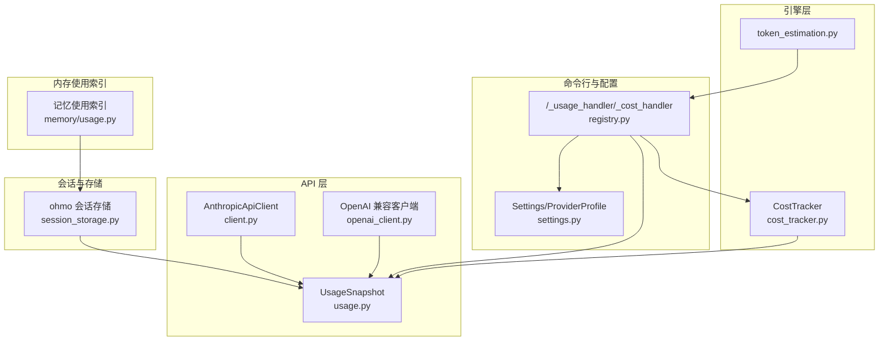
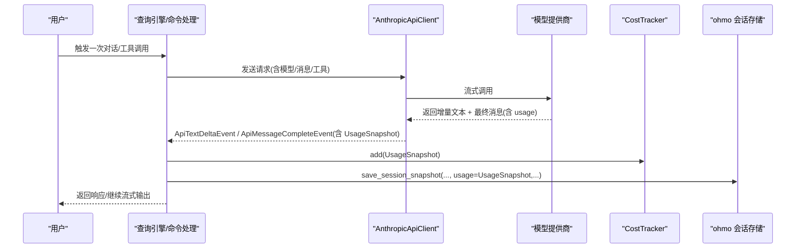
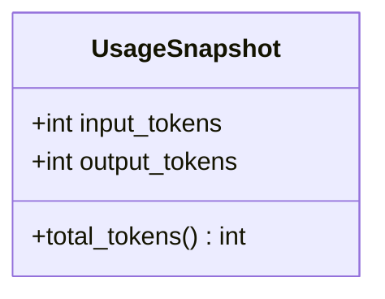
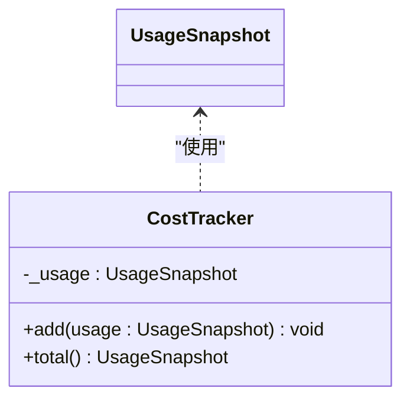
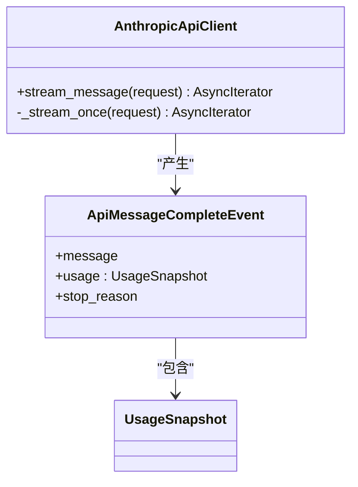
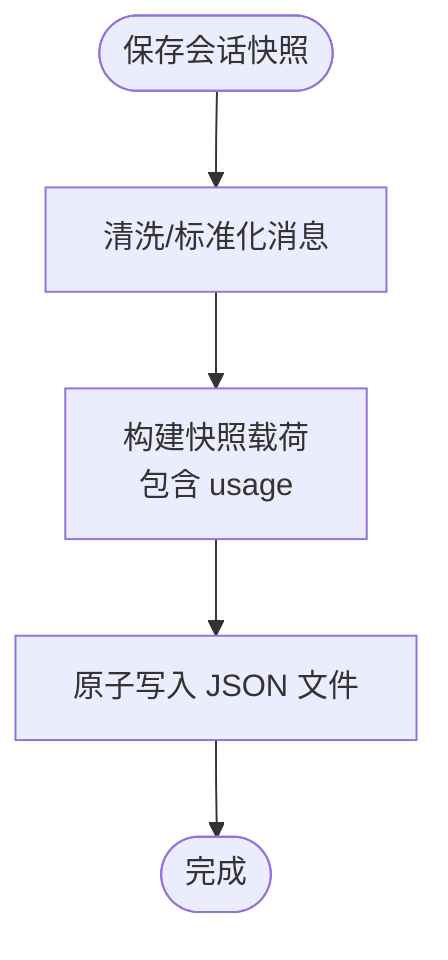
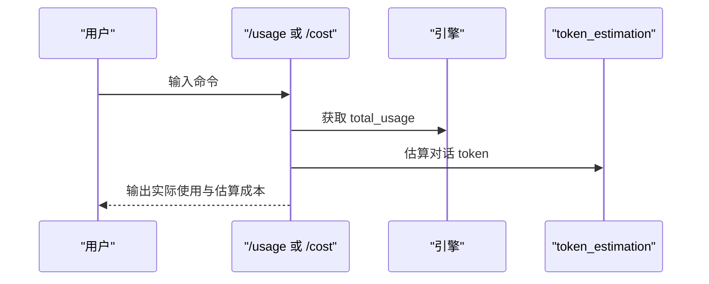
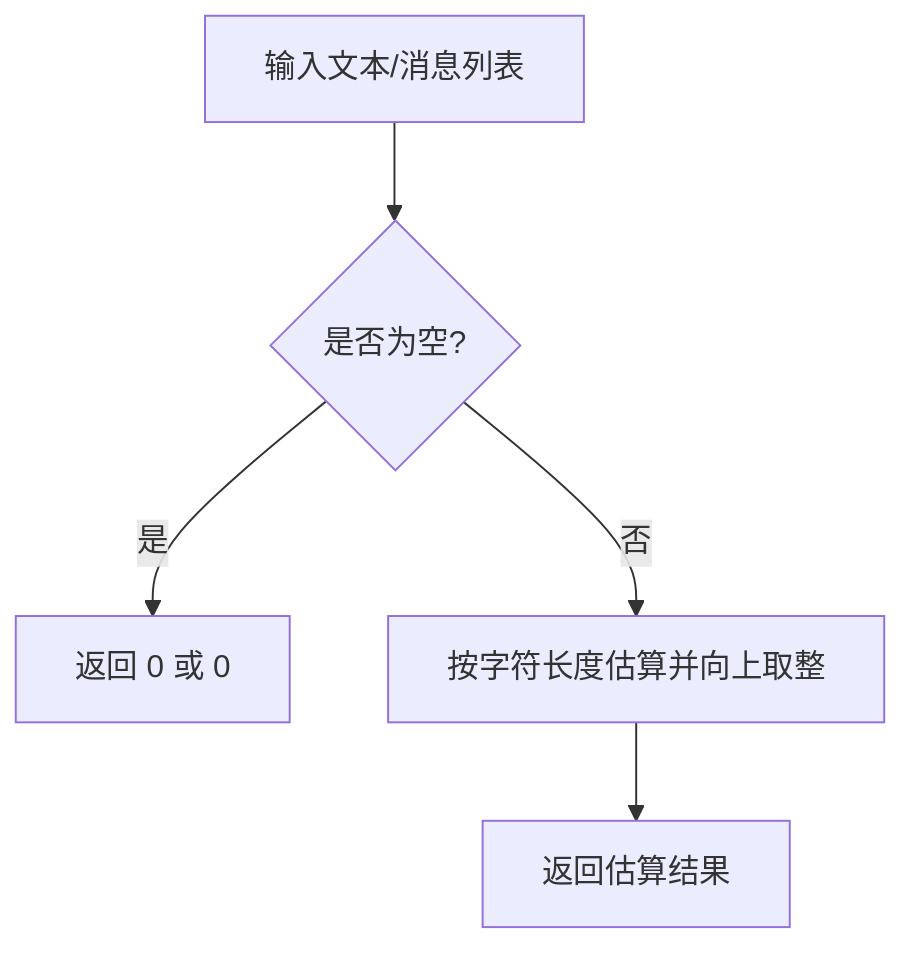
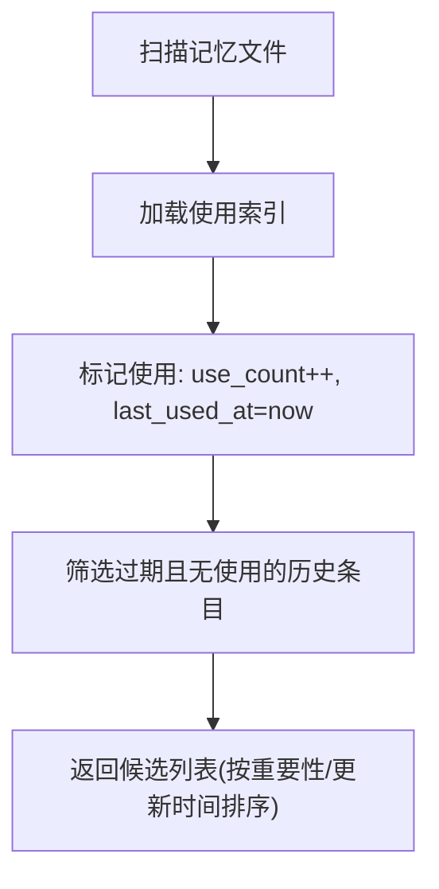
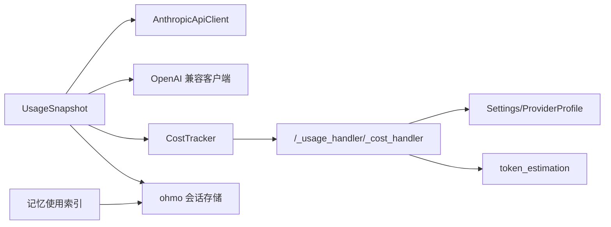

# 使用统计 API

<cite>
**本文引用的文件**
- [usage.py](file://src/openharness/api/usage.py)
- [cost_tracker.py](file://src/openharness/engine/cost_tracker.py)
- [client.py](file://src/openharness/api/client.py)
- [__init__.py](file://src/openharness/api/__init__.py)
- [session_storage.py](file://ohmo/session_storage.py)
- [token_estimation.py](file://src/openharness/services/token_estimation.py)
- [registry.py](file://src/openharness/commands/registry.py)
- [settings.py](file://src/openharness/config/settings.py)
- [usage.py（记忆）](file://src/openharness/memory/usage.py)
</cite>

## 目录
1. [简介](#简介)
2. [项目结构](#项目结构)
3. [核心组件](#核心组件)
4. [架构总览](#架构总览)
5. [详细组件分析](#详细组件分析)
6. [依赖关系分析](#依赖关系分析)
7. [性能考量](#性能考量)
8. [故障排查指南](#故障排查指南)
9. [结论](#结论)
10. [附录](#附录)

## 简介
本文件系统性梳理 OpenHarness 中“使用统计 API”的设计与实现，覆盖 token 计数、成本估算、使用量报告、会话持久化与内存使用索引等能力。文档面向开发者与运维人员，提供数据结构说明、计算方法、存储机制、API 参数与返回格式、性能优化建议以及与第三方计费系统的集成思路。

## 项目结构
围绕使用统计的关键模块分布如下：
- 数据模型与客户端：UsageSnapshot、API 客户端封装与流式事件
- 聚合与估算：CostTracker、token 估算工具
- 会话持久化：ohmo 会话存储，保存 usage 字段
- 命令行与成本展示：内置命令用于查看实际使用与估算成本
- 配置与模型解析：设置中包含模型与上下文窗口等影响成本的配置
- 内存使用索引：记录记忆条目的召回使用情况，辅助容量与清理策略

图表来源
- [usage.py:8-17](file://src/openharness/api/usage.py#L8-L17)
- [client.py:118-268](file://src/openharness/api/client.py#L118-L268)
- [cost_tracker.py:8-25](file://src/openharness/engine/cost_tracker.py#L8-L25)
- [session_storage.py:41-85](file://ohmo/session_storage.py#L41-L85)
- [registry.py:529-561](file://src/openharness/commands/registry.py#L529-L561)
- [settings.py:534-626](file://src/openharness/config/settings.py#L534-L626)
- [token_estimation.py:6-16](file://src/openharness/services/token_estimation.py#L6-L16)
- [usage.py（记忆）:67-104](file://src/openharness/memory/usage.py#L67-L104)

章节来源
- [usage.py:1-18](file://src/openharness/api/usage.py#L1-L18)
- [client.py:1-268](file://src/openharness/api/client.py#L1-L268)
- [cost_tracker.py:1-25](file://src/openharness/engine/cost_tracker.py#L1-L25)
- [session_storage.py:1-203](file://ohmo/session_storage.py#L1-L203)
- [registry.py:529-561](file://src/openharness/commands/registry.py#L529-L561)
- [settings.py:534-626](file://src/openharness/config/settings.py#L534-L626)
- [token_estimation.py:1-16](file://src/openharness/services/token_estimation.py#L1-L16)
- [usage.py（记忆）:1-154](file://src/openharness/memory/usage.py#L1-L154)

## 核心组件
- UsageSnapshot：标准化 token 使用快照，包含输入/输出 token 与合计 token 属性
- CostTracker：会话生命周期内的累计聚合器
- AnthropicApiClient/OpenAI 兼容客户端：从最终消息中提取 UsageSnapshot 并通过流式事件返回
- ohmo 会话存储：将 UsageSnapshot 持久化到会话快照 JSON
- 命令行统计与成本展示：/_usage_handler 与/_cost_handler 提供实际使用与估算成本
- token 估算：基于字符长度的启发式估算
- 记忆使用索引：记录记忆条目被召回使用的次数与时间，辅助容量与清理策略

章节来源
- [usage.py:8-17](file://src/openharness/api/usage.py#L8-L17)
- [cost_tracker.py:8-25](file://src/openharness/engine/cost_tracker.py#L8-L25)
- [client.py:26-65](file://src/openharness/api/client.py#L26-L65)
- [session_storage.py:41-85](file://ohmo/session_storage.py#L41-L85)
- [registry.py:529-561](file://src/openharness/commands/registry.py#L529-L561)
- [token_estimation.py:6-16](file://src/openharness/services/token_estimation.py#L6-L16)
- [usage.py（记忆）:67-104](file://src/openharness/memory/usage.py#L67-L104)

## 架构总览
下图展示从 API 请求到使用统计与会话持久化的关键流程：

图表来源
- [client.py:161-258](file://src/openharness/api/client.py#L161-L258)
- [cost_tracker.py:14-24](file://src/openharness/engine/cost_tracker.py#L14-L24)
- [session_storage.py:41-85](file://ohmo/session_storage.py#L41-L85)

## 详细组件分析

### UsageSnapshot 数据模型
- 字段
  - input_tokens: int，默认 0
  - output_tokens: int，默认 0
- 属性
  - total_tokens: int，返回 input_tokens + output_tokens
- 用途
  - 统一承载来自不同提供商的 token 使用信息
  - 作为 CostTracker 的输入与会话存储的持久化字段

图表来源
- [usage.py:8-17](file://src/openharness/api/usage.py#L8-L17)

章节来源
- [usage.py:8-17](file://src/openharness/api/usage.py#L8-L17)

### CostTracker 聚合器
- 职责
  - 在会话生命周期内累加 UsageSnapshot
  - 提供 total 属性返回累计结果
- 复杂度
  - 单次 add 为 O(1)
  - total 为 O(1)
- 注意
  - 每次 add 创建新的 UsageSnapshot 实例，避免共享状态导致的副作用

图表来源
- [cost_tracker.py:8-25](file://src/openharness/engine/cost_tracker.py#L8-L25)

章节来源
- [cost_tracker.py:8-25](file://src/openharness/engine/cost_tracker.py#L8-L25)

### API 客户端与 UsageSnapshot 提取
- AnthropicApiClient
  - 流式事件类型：ApiTextDeltaEvent、ApiMessageCompleteEvent、ApiRetryEvent
  - 最终消息中包含 usage 字段，客户端将其转换为 UsageSnapshot 并通过 ApiMessageCompleteEvent 返回
- OpenAI 兼容客户端
  - 同样在流式事件中携带 usage 字段，并构造 UsageSnapshot
- 错误处理
  - 对可重试错误采用指数退避+抖动策略；认证失败、速率限制等特定错误直接抛出

图表来源
- [client.py:118-268](file://src/openharness/api/client.py#L118-L268)

章节来源
- [client.py:118-268](file://src/openharness/api/client.py#L118-L268)

### 会话持久化中的使用统计
- ohmo 会话存储
  - save_session_snapshot 将 UsageSnapshot 序列化为 JSON 字段并持久化
  - 支持按 session_key 快速定位最新快照
- 读取与导出
  - load_latest/load_by_id/list_snapshots 提供会话检索
  - export_session_markdown 导出对话记录

图表来源
- [session_storage.py:41-85](file://ohmo/session_storage.py#L41-L85)

章节来源
- [session_storage.py:41-85](file://ohmo/session_storage.py#L41-L85)

### 命令行使用统计与成本估算
- /usage：显示实际 input/output tokens、估算对话 token 数与消息数量
- /cost：根据当前模型前缀进行成本估算（示例规则）
- 估算对话 token：基于 token_estimation 工具对消息列表进行估算

图表来源
- [registry.py:529-561](file://src/openharness/commands/registry.py#L529-L561)
- [token_estimation.py:6-16](file://src/openharness/services/token_estimation.py#L6-L16)

章节来源
- [registry.py:529-561](file://src/openharness/commands/registry.py#L529-L561)
- [token_estimation.py:6-16](file://src/openharness/services/token_estimation.py#L6-L16)

### token 估算工具
- estimate_tokens：基于字符长度的粗略估算
- estimate_message_tokens：对消息字符串集合求和估算

图表来源
- [token_estimation.py:6-16](file://src/openharness/services/token_estimation.py#L6-L16)

章节来源
- [token_estimation.py:6-16](file://src/openharness/services/token_estimation.py#L6-L16)

### 记忆使用索引（与容量/清理相关）
- 记录每个记忆条目的 use_count、last_used_at、path
- 提供 mark_memory_used 批量更新使用记录
- 提供 find_stale_memory_candidates 识别长期未使用且低重要性的记忆条目

图表来源
- [usage.py（记忆）:107-136](file://src/openharness/memory/usage.py#L107-L136)

章节来源
- [usage.py（记忆）:67-136](file://src/openharness/memory/usage.py#L67-L136)

## 依赖关系分析
- UsageSnapshot 由 API 客户端与引擎共同依赖
- CostTracker 依赖 UsageSnapshot 进行累计
- ohmo 会话存储依赖 UsageSnapshot 进行持久化
- 命令行统计依赖 CostTracker 与 UsageSnapshot，同时参考 Settings 中的模型配置
- token 估算工具被命令行统计使用

图表来源
- [__init__.py:8-21](file://src/openharness/api/__init__.py#L8-L21)
- [client.py:26-65](file://src/openharness/api/client.py#L26-L65)
- [cost_tracker.py:5-6](file://src/openharness/engine/cost_tracker.py#L5-L6)
- [session_storage.py:12-12](file://ohmo/session_storage.py#L12-L12)
- [registry.py:529-561](file://src/openharness/commands/registry.py#L529-L561)
- [settings.py:534-626](file://src/openharness/config/settings.py#L534-L626)
- [token_estimation.py:6-16](file://src/openharness/services/token_estimation.py#L6-L16)
- [usage.py（记忆）:67-104](file://src/openharness/memory/usage.py#L67-L104)

章节来源
- [__init__.py:8-21](file://src/openharness/api/__init__.py#L8-L21)
- [client.py:26-65](file://src/openharness/api/client.py#L26-L65)
- [cost_tracker.py:5-6](file://src/openharness/engine/cost_tracker.py#L5-L6)
- [session_storage.py:12-12](file://ohmo/session_storage.py#L12-L12)
- [registry.py:529-561](file://src/openharness/commands/registry.py#L529-L561)
- [settings.py:534-626](file://src/openharness/config/settings.py#L534-L626)
- [token_estimation.py:6-16](file://src/openharness/services/token_estimation.py#L6-L16)
- [usage.py（记忆）:67-104](file://src/openharness/memory/usage.py#L67-L104)

## 性能考量
- 流式事件与重试
  - 客户端对可重试错误采用指数退避+抖动，降低瞬时拥塞风险
  - 通过 Retry-After 头部优先尊重上游限速指示
- 聚合与估算
  - CostTracker 每次 add 创建新实例，避免共享状态带来的竞态；对高频调用影响可忽略
  - token 估算为 O(n) 线性复杂度，适合实时估算
- 存储
  - 会话快照与记忆索引均采用原子写入，保证并发安全与一致性
- 建议
  - 在高并发场景下，建议将 CostTracker 与会话存储操作置于串行队列或带锁保护的上下文中
  - 对估算成本的展示可异步执行，避免阻塞主消息流

[本节为通用性能讨论，不直接分析具体文件]

## 故障排查指南
- 认证与速率限制
  - 当上游返回速率限制或认证失败时，客户端会抛出对应异常；检查环境变量与凭据绑定
- 上游不可用或网络错误
  - 客户端对连接超时、OSError 等进行自动重试；若超过最大重试次数仍失败，请检查网络与代理配置
- 使用统计缺失
  - 若 UsageSnapshot 为空，确认客户端是否正确解析最终消息的 usage 字段
- 成本估算不准确
  - 当前估算仅基于字符长度的启发式方法；对于多模态或特殊格式内容，估算误差可能较大
- 会话快照未更新
  - 确认 save_session_snapshot 是否被调用，以及 UsageSnapshot 是否正确传入

章节来源
- [client.py:87-197](file://src/openharness/api/client.py#L87-L197)
- [client.py:261-268](file://src/openharness/api/client.py#L261-L268)

## 结论
OpenHarness 的使用统计体系以 UsageSnapshot 为核心，结合 CostTracker、API 客户端与会话存储，实现了从 token 计数到会话持久化的闭环。命令行提供了即用的使用量查询与成本估算入口；记忆使用索引则为容量管理与清理提供依据。通过合理的配置与扩展，可进一步对接第三方计费系统与自定义计费规则。

[本节为总结性内容，不直接分析具体文件]

## 附录

### API 方法与数据结构概览
- UsageSnapshot
  - 字段：input_tokens:int、output_tokens:int
  - 属性：total_tokens:int
- CostTracker
  - add(usage: UsageSnapshot) -> None
  - total() -> UsageSnapshot
- AnthropicApiClient
  - stream_message(request) -> 异步迭代器(ApiTextDeltaEvent | ApiMessageCompleteEvent | ApiRetryEvent)
  - 最终事件包含 UsageSnapshot
- ohmo 会话存储
  - save_session_snapshot(..., usage: UsageSnapshot, ...) -> Path
  - load_latest()/load_by_id()/list_snapshots() 提供检索
- 命令行
  - /usage：显示实际使用与估算对话 token
  - /cost：按模型前缀估算美元成本

章节来源
- [usage.py:8-17](file://src/openharness/api/usage.py#L8-L17)
- [cost_tracker.py:14-24](file://src/openharness/engine/cost_tracker.py#L14-L24)
- [client.py:161-258](file://src/openharness/api/client.py#L161-L258)
- [session_storage.py:41-85](file://ohmo/session_storage.py#L41-L85)
- [registry.py:529-561](file://src/openharness/commands/registry.py#L529-L561)

### 使用示例（命令行）
- 查看使用量
  - 输入：/usage
  - 输出：实际 input/output tokens、估算对话 token、消息数量
- 成本估算
  - 输入：/cost
  - 输出：模型名、input/output/total tokens、估算成本（示例规则）

章节来源
- [registry.py:529-561](file://src/openharness/commands/registry.py#L529-L561)

### 集成第三方计费系统与自定义计费规则
- 方案一：替换成本估算逻辑
  - 将命令行中的示例估算规则替换为外部计费系统提供的单价表
  - 可在 /cost 处理函数中接入外部服务，返回更精确的成本
- 方案二：扩展 UsageSnapshot
  - 在 UsageSnapshot 基础上增加额外字段（如明细、汇率、税费），并在客户端与会话存储中传播
- 方案三：会话维度计费
  - 在 save_session_snapshot 中附加计费摘要，便于按会话维度导出账单
- 注意事项
  - 保持 UsageSnapshot 的向后兼容性
  - 对外部计费系统的调用需考虑超时与重试策略

[本节为概念性指导，不直接分析具体文件]