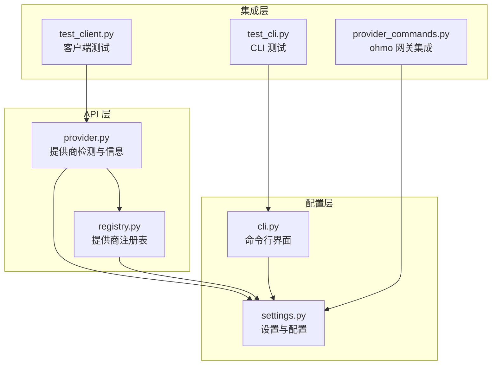
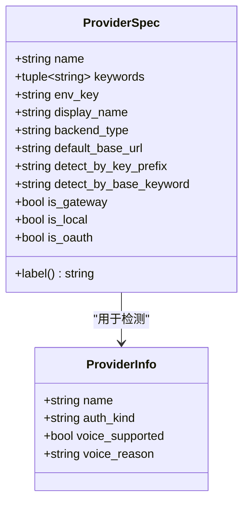
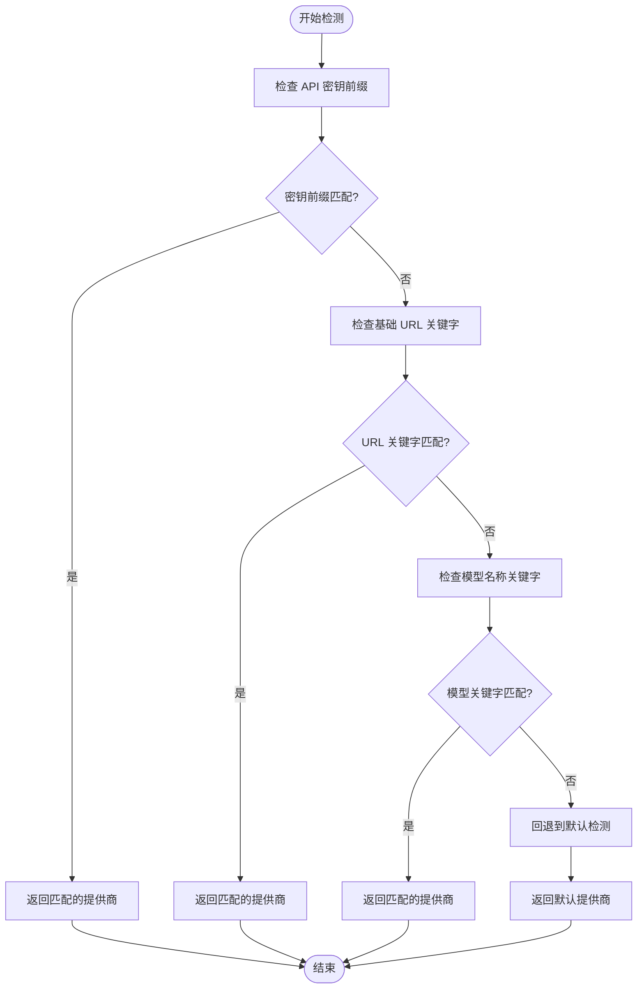
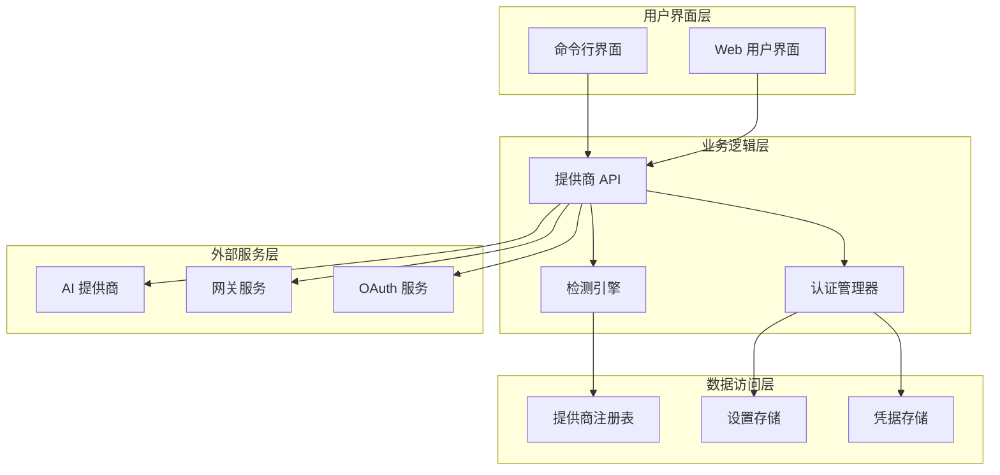
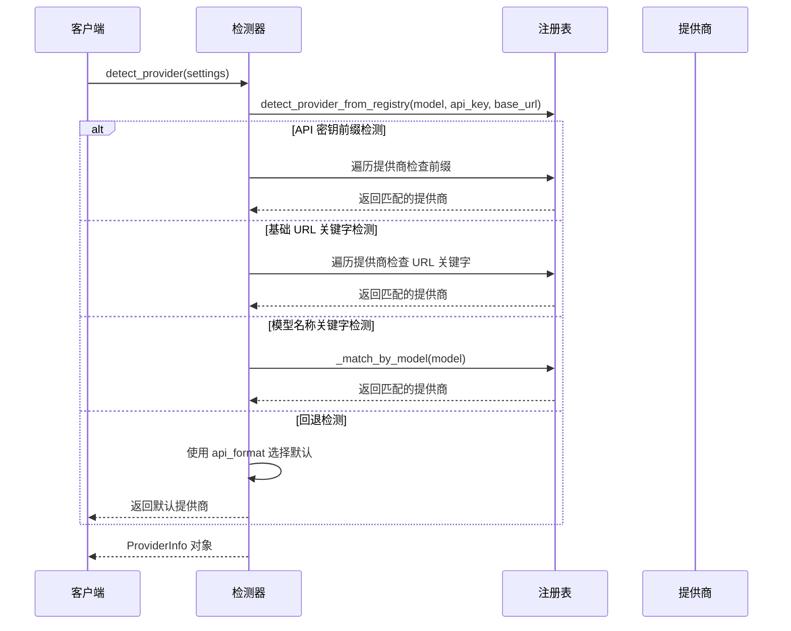
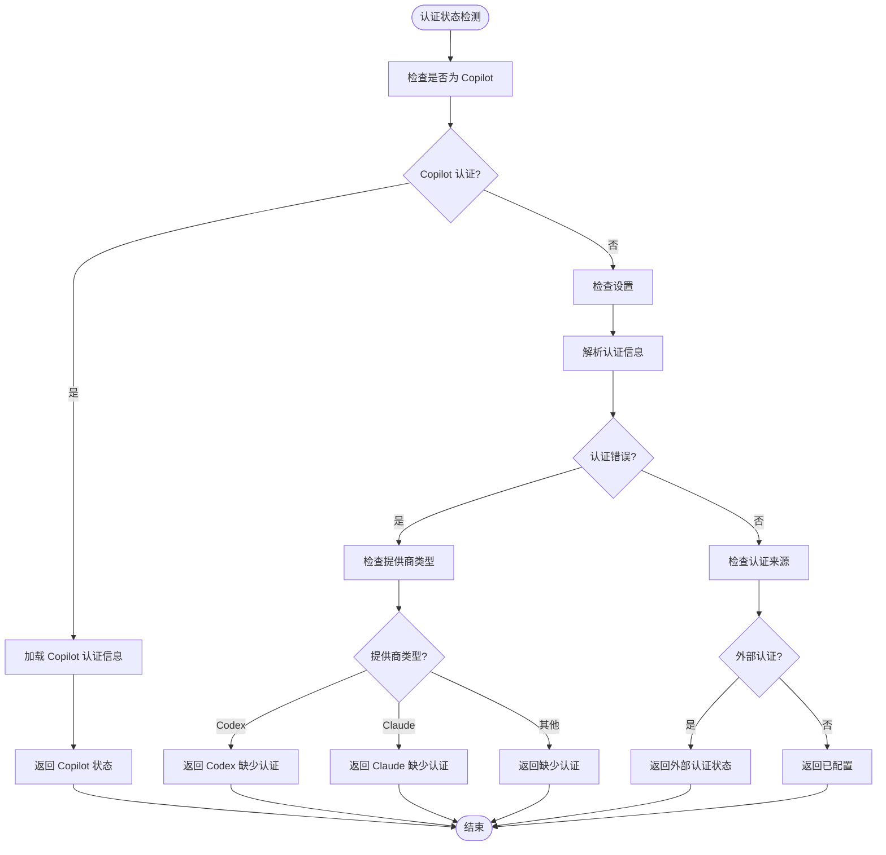
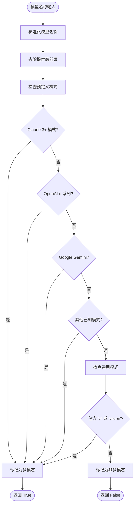
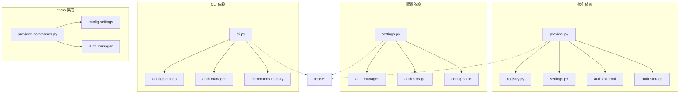

# 提供商 API

<cite>
**本文档引用的文件**
- [provider.py](file://src/openharness/api/provider.py)
- [registry.py](file://src/openharness/api/registry.py)
- [settings.py](file://src/openharness/config/settings.py)
- [cli.py](file://src/openharness/cli.py)
- [provider_commands.py](file://ohmo/gateway/provider_commands.py)
- [test_client.py](file://tests/test_api/test_client.py)
- [test_cli.py](file://tests/test_commands/test_cli.py)
</cite>

## 目录
1. [简介](#简介)
2. [项目结构](#项目结构)
3. [核心组件](#核心组件)
4. [架构概览](#架构概览)
5. [详细组件分析](#详细组件分析)
6. [依赖关系分析](#依赖关系分析)
7. [性能考虑](#性能考虑)
8. [故障排除指南](#故障排除指南)
9. [结论](#结论)
10. [附录](#附录)

## 简介

提供商 API 是 OpenHarness 项目中的核心组件，负责管理各种大语言模型提供商的注册表和检测机制。该系统提供了统一的接口来处理不同类型的 AI 模型提供商，包括本地部署、云服务提供商和网关服务。

系统的主要功能包括：
- 统一的提供商注册表管理
- 智能提供商检测机制
- 多种认证方式支持（API 密钥、OAuth、订阅制）
- 支持多种模型类型（文本、视觉、多模态）

## 项目结构

提供商 API 相关的核心文件分布如下：



**图表来源**
- [provider.py:1-187](file://src/openharness/api/provider.py#L1-L187)
- [registry.py:1-438](file://src/openharness/api/registry.py#L1-L438)
- [settings.py:1-1030](file://src/openharness/config/settings.py#L1-L1030)

**章节来源**
- [provider.py:1-187](file://src/openharness/api/provider.py#L1-L187)
- [registry.py:1-438](file://src/openharness/api/registry.py#L1-L438)
- [settings.py:1-1030](file://src/openharness/config/settings.py#L1-L1030)

## 核心组件

### ProviderSpec 数据类

ProviderSpec 是提供商注册表的核心数据结构，定义了每个提供商的元数据和配置信息。



**图表来源**
- [registry.py:17-49](file://src/openharness/api/registry.py#L17-L49)
- [provider.py:32-40](file://src/openharness/api/provider.py#L32-L40)

#### ProviderSpec 字段详解

| 字段名 | 类型 | 默认值 | 描述 |
|--------|------|--------|------|
| name | string | - | 提供商规范名称，如 "dashscope" |
| keywords | tuple[string, ...] | - | 模型名称关键字列表，用于检测（小写） |
| env_key | string | - | 主要 API 密钥环境变量名 |
| display_name | string | "" | 在状态/诊断中显示的名称 |
| backend_type | string | "openai_compat" | 后端类型："anthropic" | "openai_compat" | "copilot" |
| default_base_url | string | "" | 此提供商的回退基础 URL |
| detect_by_key_prefix | string | "" | 匹配 API 密钥前缀，如 "sk-or-" |
| detect_by_base_keyword | string | "" | 在 base_url 中匹配子字符串 |
| is_gateway | bool | False | 是否为网关路由任何模型 |
| is_local | bool | False | 是否为本地部署（vLLM, Ollama） |
| is_oauth | bool | False | 是否使用 OAuth 而非 API 密钥 |

**章节来源**
- [registry.py:17-49](file://src/openharness/api/registry.py#L17-L49)

### 提供商检测机制

系统实现了三层检测优先级：



**图表来源**
- [registry.py:408-437](file://src/openharness/api/registry.py#L408-L437)

**章节来源**
- [registry.py:408-437](file://src/openharness/api/registry.py#L408-L437)

## 架构概览

提供商 API 采用分层架构设计，确保了模块间的清晰分离和高内聚低耦合：



**图表来源**
- [provider.py:42-94](file://src/openharness/api/provider.py#L42-L94)
- [registry.py:55-368](file://src/openharness/api/registry.py#L55-L368)

## 详细组件分析

### 提供商检测流程

检测流程遵循严格的优先级顺序，确保最精确的匹配结果：



**图表来源**
- [provider.py:42-94](file://src/openharness/api/provider.py#L42-L94)
- [registry.py:408-437](file://src/openharness/api/registry.py#L408-L437)

### 认证状态管理

系统支持多种认证方式的状态检测：



**图表来源**
- [provider.py:97-126](file://src/openharness/api/provider.py#L97-L126)

**章节来源**
- [provider.py:97-126](file://src/openharness/api/provider.py#L97-L126)

### 多模态模型检测

系统实现了智能的多模态模型检测，基于模型名称模式识别：



**图表来源**
- [provider.py:175-186](file://src/openharness/api/provider.py#L175-L186)

**章节来源**
- [provider.py:175-186](file://src/openharness/api/provider.py#L175-L186)

## 依赖关系分析

提供商 API 的依赖关系体现了清晰的分层设计：



**图表来源**
- [provider.py:8-11](file://src/openharness/api/provider.py#L8-L11)
- [settings.py:12-25](file://src/openharness/config/settings.py#L12-L25)

**章节来源**
- [provider.py:8-11](file://src/openharness/api/provider.py#L8-L11)
- [settings.py:12-25](file://src/openharness/config/settings.py#L12-L25)

## 性能考虑

提供商检测机制在设计时充分考虑了性能优化：

### 检测算法复杂度
- **API 密钥前缀检测**: O(n) - 遍历所有提供商检查前缀
- **基础 URL 关键字检测**: O(n) - 遍历所有提供商检查 URL 关键字  
- **模型名称关键字检测**: O(n×m) - n 为提供商数量，m 为关键字数量
- **总体复杂度**: O(n×m)，其中 n 和 m 都相对较小

### 内存优化策略
- 使用 `@dataclass(frozen=True)` 确保不可变性，减少内存占用
- ProviderSpec 实例在进程启动时创建，避免重复分配
- 检测结果缓存机制（通过函数调用模式实现）

### 最佳实践建议
1. **提供商排序**: 将最常用的提供商放在前面，提高命中率
2. **关键字优化**: 使用更精确的关键字减少误匹配
3. **前缀检测**: 为网关服务设置独特的 API 密钥前缀
4. **URL 关键字**: 为云服务提供商设置特定的 URL 关键字

## 故障排除指南

### 常见问题及解决方案

#### 1. 提供商检测失败
**症状**: 系统无法正确识别当前使用的提供商
**可能原因**:
- API 密钥格式不正确
- 基础 URL 不包含预期的关键字
- 模型名称不在支持的关键字列表中

**解决步骤**:
1. 检查 API 密钥格式是否符合提供商要求
2. 验证基础 URL 是否包含正确的提供商关键字
3. 确认模型名称是否包含支持的关键字

#### 2. 认证状态显示异常
**症状**: 认证状态显示为 "missing" 或 "invalid"
**可能原因**:
- 环境变量未正确设置
- 凭据存储损坏或缺失
- 第三方端点不支持订阅制认证

**解决步骤**:
1. 运行 `oh auth` 命令重新配置认证
2. 检查环境变量是否正确设置
3. 验证第三方端点的兼容性

#### 3. 多模态模型检测错误
**症状**: 系统错误地将非多模态模型标记为多模态
**可能原因**:
- 模型名称不符合预期格式
- 关键字匹配过于宽松

**解决步骤**:
1. 检查模型名称格式是否正确
2. 更新 `_MULTIMODAL_MODEL_PATTERNS` 中的正则表达式
3. 添加更精确的模型名称模式

**章节来源**
- [provider.py:97-126](file://src/openharness/api/provider.py#L97-L126)
- [provider.py:175-186](file://src/openharness/api/provider.py#L175-L186)

## 结论

提供商 API 系统通过精心设计的注册表和检测机制，为 OpenHarness 提供了强大而灵活的提供商管理能力。其核心优势包括：

1. **统一抽象**: 通过 ProviderSpec 数据类统一管理所有提供商的元数据
2. **智能检测**: 多层次检测机制确保准确的提供商识别
3. **灵活扩展**: 易于添加新的提供商和认证方式
4. **性能优化**: 经过优化的检测算法保证高效的运行性能

该系统为开发者提供了完整的提供商管理解决方案，支持从简单的 API 密钥认证到复杂的 OAuth 和订阅制认证等多种场景。

## 附录

### 添加新提供商的完整指南

#### 步骤 1: 分析提供商特性
在添加新提供商之前，需要分析以下关键信息：
- 提供商名称和显示名称
- 支持的模型类型和关键字
- 认证方式（API 密钥、OAuth、订阅制）
- 基础 URL 格式和关键字
- 特殊的检测需求

#### 步骤 2: 配置 ProviderSpec 字段
根据分析结果配置 ProviderSpec 字段：

```python
ProviderSpec(
    name="your_provider",                    # 规范名称
    keywords=("keyword1", "keyword2"),       # 模型关键字
    env_key="YOUR_PROVIDER_API_KEY",         # 环境变量名
    display_name="Your Provider",            # 显示名称
    backend_type="openai_compat",           # 后端类型
    default_base_url="https://api.your-provider.com/v1",  # 默认 URL
    detect_by_key_prefix="sk-your-",        # API 密钥前缀
    detect_by_base_keyword="your-provider", # URL 关键字
    is_gateway=False,                       # 是否为网关
    is_local=False,                         # 是否为本地部署
    is_oauth=False                          # 是否使用 OAuth
)
```

#### 步骤 3: 设置检测优先级
根据提供商的重要性和使用频率，在注册表中设置合适的排序位置：
1. **网关服务**: 放在最前面，因为它们可以路由多个模型
2. **主要云提供商**: 放在中间位置
3. **标准提供商**: 放在中间偏后位置
4. **本地部署**: 放在最后，避免误匹配

#### 步骤 4: 配置环境变量
为新提供商设置必要的环境变量：
- 主要 API 密钥环境变量
- 可选的认证参数环境变量

#### 步骤 5: 测试验证
使用以下测试方法验证新提供商的正确性：
1. **单元测试**: 验证检测逻辑的准确性
2. **集成测试**: 测试完整的认证流程
3. **端到端测试**: 验证实际的 API 调用

#### 最佳实践建议

1. **关键字设计**: 使用具体且唯一的模型关键字，避免与其他提供商冲突
2. **前缀检测**: 为网关服务设置独特的 API 密钥前缀，便于快速识别
3. **URL 关键字**: 为云服务提供商设置特定的 URL 关键字
4. **错误处理**: 为新提供商实现适当的错误处理和回退机制
5. **文档更新**: 更新相关文档和示例代码

### 现有提供商配置示例

#### GitHub Copilot
```python
ProviderSpec(
    name="github_copilot",
    keywords=("copilot",),
    env_key="",  # OAuth 认证，无需 API 密钥
    display_name="GitHub Copilot",
    backend_type="copilot",
    is_oauth=True,
    is_gateway=False
)
```

#### OpenRouter 网关
```python
ProviderSpec(
    name="openrouter",
    keywords=("openrouter",),
    env_key="OPENROUTER_API_KEY",
    display_name="OpenRouter",
    backend_type="openai_compat",
    default_base_url="https://openrouter.ai/api/v1",
    detect_by_key_prefix="sk-or-",
    detect_by_base_keyword="openrouter",
    is_gateway=True
)
```

#### Anthropic
```python
ProviderSpec(
    name="anthropic",
    keywords=("anthropic", "claude"),
    env_key="ANTHROPIC_API_KEY",
    display_name="Anthropic",
    backend_type="anthropic",
    is_gateway=False,
    is_oauth=False
)
```

这些配置示例展示了不同类型提供商的最佳实践，为新提供商的添加提供了参考模板。