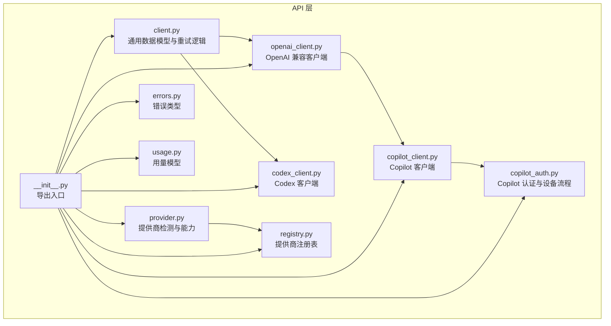
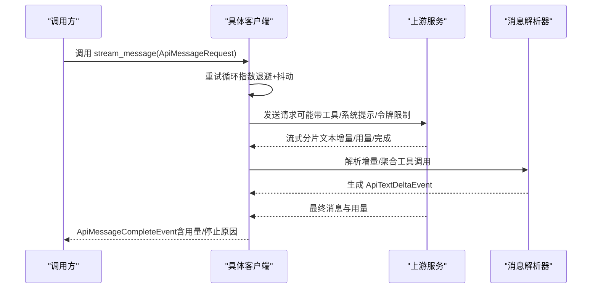
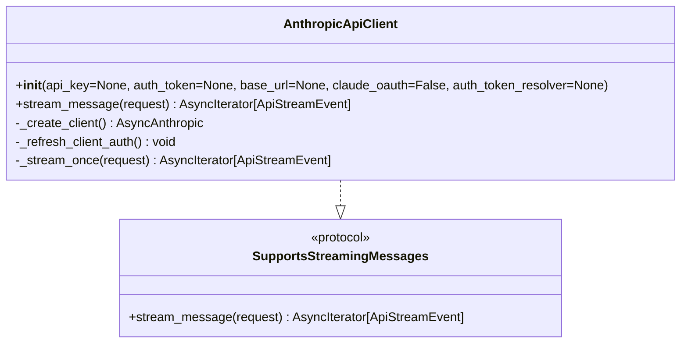
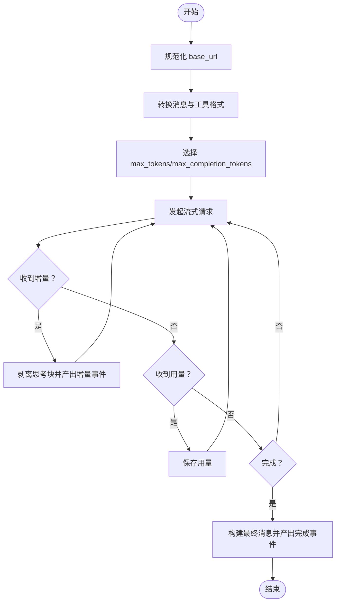
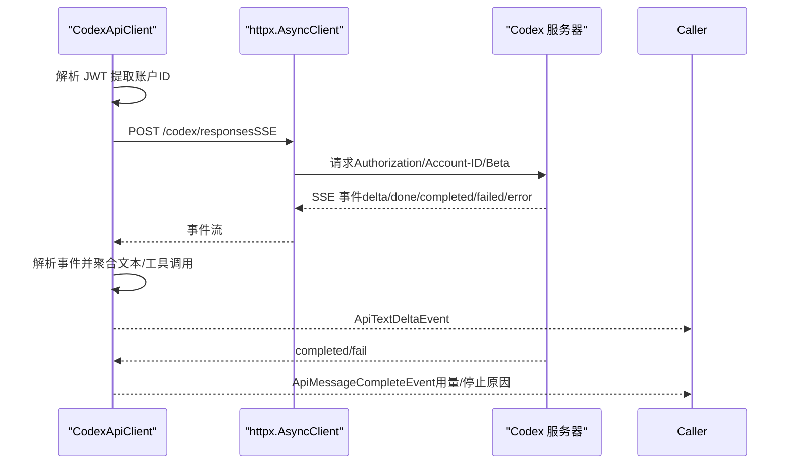
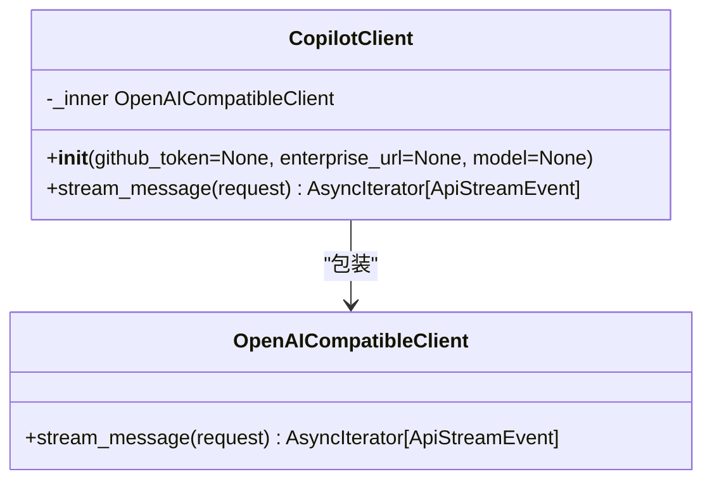
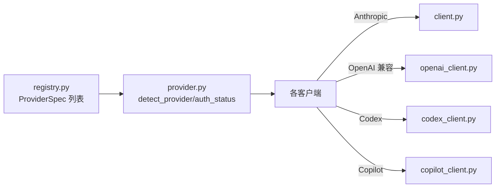

# 核心 API 接口

<cite>
**本文引用的文件**
- [client.py](file://src/openharness/api/client.py)
- [openai_client.py](file://src/openharness/api/openai_client.py)
- [codex_client.py](file://src/openharness/api/codex_client.py)
- [copilot_client.py](file://src/openharness/api/copilot_client.py)
- [copilot_auth.py](file://src/openharness/api/copilot_auth.py)
- [provider.py](file://src/openharness/api/provider.py)
- [registry.py](file://src/openharness/api/registry.py)
- [errors.py](file://src/openharness/api/errors.py)
- [usage.py](file://src/openharness/api/usage.py)
- [__init__.py](file://src/openharness/api/__init__.py)
- [test_client.py](file://tests/test_api/test_client.py)
- [test_openai_client.py](file://tests/test_api/test_openai_client.py)
- [test_codex_client.py](file://tests/test_api/test_codex_client.py)
- [test_copilot_client.py](file://tests/test_api/test_copilot_client.py)
</cite>

## 目录
1. [简介](#简介)
2. [项目结构](#项目结构)
3. [核心组件](#核心组件)
4. [架构总览](#架构总览)
5. [详细组件分析](#详细组件分析)
6. [依赖关系分析](#依赖关系分析)
7. [性能考量](#性能考量)
8. [故障排查指南](#故障排查指南)
9. [结论](#结论)
10. [附录](#附录)

## 简介
本文件系统性梳理 OpenHarness 的核心 API 客户端与接口，覆盖以下客户端：
- Anthropic 客户端（支持订阅与 OAuth）
- OpenAI 兼容客户端（支持多厂商网关与本地部署）
- Codex 客户端（ChatGPT/Codex 订阅）
- Copilot 客户端（GitHub Copilot）

文档内容包括：初始化参数、方法签名、返回值类型、异常处理、认证机制、连接管理、重试策略、流式响应处理、错误码对照与常见问题解决方案。为便于理解，还提供了数据流图、时序图与类图。

## 项目结构
OpenHarness 的 API 层位于 src/openharness/api，围绕统一的流式消息协议 SupportsStreamingMessages 构建，确保不同后端可互换使用。

图表来源
- [client.py:1-268](file://src/openharness/api/client.py#L1-L268)
- [openai_client.py:1-481](file://src/openharness/api/openai_client.py#L1-L481)
- [codex_client.py:1-408](file://src/openharness/api/codex_client.py#L1-L408)
- [copilot_client.py:1-131](file://src/openharness/api/copilot_client.py#L1-L131)
- [copilot_auth.py:1-241](file://src/openharness/api/copilot_auth.py#L1-L241)
- [provider.py:1-187](file://src/openharness/api/provider.py#L1-L187)
- [registry.py:1-438](file://src/openharness/api/registry.py#L1-L438)
- [errors.py:1-20](file://src/openharness/api/errors.py#L1-L20)
- [usage.py:1-18](file://src/openharness/api/usage.py#L1-L18)
- [__init__.py:1-22](file://src/openharness/api/__init__.py#L1-L22)

章节来源
- [__init__.py:1-22](file://src/openharness/api/__init__.py#L1-L22)

## 核心组件
- 统一请求与事件模型
  - ApiMessageRequest：模型名、消息列表、系统提示、最大输出令牌数、工具列表、推理努力度
  - ApiTextDeltaEvent：文本增量事件
  - ApiMessageCompleteEvent：完整消息事件（含用量与停止原因）
  - ApiRetryEvent：可恢复上游失败的重试事件
  - ApiStreamEvent：三者联合类型
- 流式消息协议 SupportsStreamingMessages：定义 stream_message(request) -> AsyncIterator[ApiStreamEvent]
- 用量模型 UsageSnapshot：输入/输出令牌计数与总计
- 错误体系 OpenHarnessApiError 及其子类 AuthenticationFailure、RateLimitFailure、RequestFailure

章节来源
- [client.py:39-77](file://src/openharness/api/client.py#L39-L77)
- [client.py:80-85](file://src/openharness/api/client.py#L80-L85)
- [usage.py:8-18](file://src/openharness/api/usage.py#L8-L18)
- [errors.py:6-20](file://src/openharness/api/errors.py#L6-L20)

## 架构总览
OpenHarness 将不同后端抽象为“流式消息”客户端，统一对外暴露 SupportsStreamingMessages 协议，内部通过消息格式转换与参数适配实现跨平台一致性。

图表来源
- [openai_client.py:279-430](file://src/openharness/api/openai_client.py#L279-L430)
- [codex_client.py:229-356](file://src/openharness/api/codex_client.py#L229-L356)
- [client.py:161-197](file://src/openharness/api/client.py#L161-L197)

## 详细组件分析

### AnthropicApiClient（订阅与 OAuth）
- 初始化参数
  - api_key: 可选；优先使用
  - auth_token: 可选；与 claude_oauth=True 时启用 OAuth
  - base_url: 可选；自定义基础地址
  - claude_oauth: 布尔；是否使用 Claude OAuth
  - auth_token_resolver: 可选回调；动态刷新 OAuth 令牌
- 方法
  - stream_message(request) -> AsyncIterator[ApiStreamEvent]
- 认证机制
  - 若提供 api_key，则直接使用
  - 若提供 auth_token 且 claude_oauth=True，则注入 OAuth 头与 attribution 信息，并携带 metadata 与 x-client-request-id
  - 支持在每次请求前通过 auth_token_resolver 刷新令牌
- 连接管理
  - 内部维护 AsyncAnthropic 实例；OAuth 模式下使用 beta.messages 接口
- 重试策略
  - 最大重试次数 3；指数退避，最大延迟 30 秒
  - 可重试状态码：429、500、502、503、529；网络超时/连接错误亦可重试
  - 若上游返回 Retry-After 头，按该头值与上限裁剪延迟
- 异常处理
  - 认证失败、速率限制、请求失败分别映射到对应 OpenHarnessApiError 子类
- 流式响应
  - 逐段产出 ApiTextDeltaEvent；最终产出 ApiMessageCompleteEvent（含用量与 stop_reason）

图表来源
- [client.py:118-268](file://src/openharness/api/client.py#L118-L268)

章节来源
- [client.py:118-268](file://src/openharness/api/client.py#L118-L268)
- [test_client.py:7-194](file://tests/test_api/test_client.py#L7-L194)

### OpenAICompatibleClient（多厂商兼容）
- 初始化参数
  - api_key: 必填
  - base_url: 可选；自动规范化（保留路径，缺省加 /v1）
  - timeout: 可选；传递给底层 SDK
- 方法
  - stream_message(request) -> AsyncIterator[ApiStreamEvent]
- 认证机制
  - 默认在默认头中附加 Authorization: Bearer <api_key>
- 连接管理
  - 使用 AsyncOpenAI；base_url 规范化后传入
- 重试策略
  - 最大重试次数 3；指数退避，最大延迟 30 秒
  - 可重试状态码：429、500、502、503；网络/超时错误可重试
- 消息与工具转换
  - 系统提示转为 system 消息
  - 用户消息拆分为 text/image；工具结果拆为 tool 消息
  - 助手消息支持 reasoning_content（受环境变量控制）与 tool_calls
- 流式响应
  - 文本增量剥离内部思考块（如 ）；聚合工具调用参数
  - 产出 ApiTextDeltaEvent；最终产出 ApiMessageCompleteEvent（含用量与 finish_reason）

图表来源
- [openai_client.py:311-430](file://src/openharness/api/openai_client.py#L311-L430)

章节来源
- [openai_client.py:260-481](file://src/openharness/api/openai_client.py#L260-L481)
- [test_openai_client.py:256-361](file://tests/test_api/test_openai_client.py#L256-L361)

### CodexApiClient（ChatGPT/Codex 订阅）
- 初始化参数
  - auth_token: 必填（ChatGPT 订阅访问令牌，需为有效 JWT）
  - base_url: 可选；自动解析为 /codex/responses
- 方法
  - stream_message(request) -> AsyncIterator[ApiStreamEvent]
- 认证机制
  - 从 JWT 中提取账户标识，注入 chatgpt-account-id 与 Authorization
  - 设置实验性 Beta 头与 SSE 接收
- 连接管理
  - 使用 httpx.AsyncClient；遵循重定向
- 重试策略
  - 最大重试次数 3；指数退避，最大延迟 30 秒
  - 可重试状态码：429、500、502、503、504；网络/超时错误可重试
- 消息与工具转换
  - 用户消息拆为 function_call_output（工具结果）与 input_text/input_image
  - 助手消息拆为 message（输出文本）与 function_call（工具调用）
  - 支持推理努力度（低/中/高/xhigh 映射）
- 流式响应
  - SSE 事件解析：output_text.delta、output_item.done、completed、failed、error
  - 产出 ApiTextDeltaEvent；最终产出 ApiMessageCompleteEvent（含用量与 stop_reason）

图表来源
- [codex_client.py:229-356](file://src/openharness/api/codex_client.py#L229-L356)

章节来源
- [codex_client.py:221-408](file://src/openharness/api/codex_client.py#L221-L408)
- [test_codex_client.py:163-245](file://tests/test_api/test_codex_client.py#L163-L245)

### CopilotClient（GitHub Copilot）
- 初始化参数
  - github_token: 可选；若未提供则从持久化文件加载
  - enterprise_url: 可选；企业域或从持久化文件加载
  - model: 可选；默认模型，可在请求中覆盖
- 认证机制
  - 直接使用 GitHub OAuth 令牌作为 Bearer Token
  - 自动计算 Copilot API 基础地址（公共/企业）
- 连接管理
  - 构造底层 AsyncOpenAI 并注入 User-Agent 与 OpenAI-Intent 头
  - 包装 OpenAICompatibleClient 以复用消息/工具转换
- 方法
  - stream_message(request) -> AsyncIterator[ApiStreamEvent]
- 重试策略
  - 委托底层 OpenAICompatibleClient 的重试逻辑

图表来源
- [copilot_client.py:48-131](file://src/openharness/api/copilot_client.py#L48-L131)

章节来源
- [copilot_client.py:48-131](file://src/openharness/api/copilot_client.py#L48-L131)
- [copilot_auth.py:48-108](file://src/openharness/api/copilot_auth.py#L48-L108)
- [test_copilot_client.py:53-141](file://tests/test_api/test_copilot_client.py#L53-L141)

## 依赖关系分析
- Provider 与注册表
  - provider.py 基于 registry.py 的 ProviderSpec 列表推断当前提供商与认证方式
  - 支持网关（OpenRouter/AiHubMix/SiliconFlow/VolcEngine）、标准云厂商（Anthropic/OpenAI/DashScope/Gemini 等）、本地部署（Ollama/vLLM）
- 认证状态
  - provider.py 提供 auth_status，结合外部绑定与持久化 Copilot 认证文件判断配置状态

图表来源
- [registry.py:55-438](file://src/openharness/api/registry.py#L55-L438)
- [provider.py:42-94](file://src/openharness/api/provider.py#L42-L94)

章节来源
- [provider.py:42-187](file://src/openharness/api/provider.py#L42-L187)
- [registry.py:1-438](file://src/openharness/api/registry.py#L1-L438)

## 性能考量
- 重试与退避
  - 所有客户端均采用指数退避与抖动，避免雪崩效应
  - 对上游 Retry-After 头进行尊重与裁剪
- 流式处理
  - 通过增量事件减少内存占用，提升交互体验
- 工具调用聚合
  - OpenAI 兼容客户端对工具调用参数进行增量拼接，避免重复解析
- 模型令牌限制
  - 针对特定模型族（如 gpt-5/o1/o3/o4）自动切换 max_completion_tokens，避免参数不兼容

章节来源
- [client.py:98-115](file://src/openharness/api/client.py#L98-L115)
- [openai_client.py:46-57](file://src/openharness/api/openai_client.py#L46-L57)
- [openai_client.py:320-330](file://src/openharness/api/openai_client.py#L320-L330)

## 故障排查指南
- 常见错误与处理
  - 认证失败（401/403）：检查 api_key 或 OAuth 令牌有效性
  - 速率限制（429）：触发重试；必要时降低并发或调整模型
  - 网络/超时/连接错误：自动重试；检查网络与代理设置
  - Codex 认证失败（无效 JWT）：确认令牌格式与账户元数据
- Copilot 认证
  - 无令牌：运行登录命令后重试
  - 企业域：确认 enterprise_url 正确，API 基础地址应为 copilot-api.<domain>
- 多模态模型
  - 若模型名称匹配已知模式，可接受图像输入；否则回退到图像转文本工具
- 诊断与状态
  - 使用 provider.auth_status 获取当前认证状态字符串，定位缺失或无效配置

章节来源
- [errors.py:6-20](file://src/openharness/api/errors.py#L6-L20)
- [codex_client.py:30-46](file://src/openharness/api/codex_client.py#L30-L46)
- [copilot_auth.py:97-146](file://src/openharness/api/copilot_auth.py#L97-L146)
- [provider.py:97-126](file://src/openharness/api/provider.py#L97-L126)

## 结论
OpenHarness 的 API 层通过统一的数据模型与流式协议，实现了对 Anthropic、OpenAI 兼容、Codex 与 Copilot 的一致接入。客户端内置完善的重试、认证与消息转换逻辑，配合注册表与提供商检测，能够快速适配多种部署形态与认证方式。建议在生产环境中：
- 合理配置重试与超时参数
- 使用持久化令牌与企业域配置
- 关注模型令牌限制差异
- 在需要时开启工具调用与推理内容的兼容性选项

## 附录

### API 客户端一览与关键特性
- AnthropicApiClient
  - 支持订阅与 OAuth；支持动态令牌刷新；Beta 接口与 attribution 头
- OpenAICompatibleClient
  - 多厂商/网关/本地兼容；消息/工具转换；推理内容控制；令牌限制自动切换
- CodexApiClient
  - ChatGPT/Codex 订阅；SSE 流式；JWT 认证；推理努力度
- CopilotClient
  - GitHub OAuth 直接认证；企业域支持；OpenAI 兼容头注入

章节来源
- [client.py:118-268](file://src/openharness/api/client.py#L118-L268)
- [openai_client.py:260-481](file://src/openharness/api/openai_client.py#L260-L481)
- [codex_client.py:221-408](file://src/openharness/api/codex_client.py#L221-L408)
- [copilot_client.py:48-131](file://src/openharness/api/copilot_client.py#L48-L131)

### 错误码对照（节选）
- 401/403：认证失败（AuthenticationFailure）
- 429：速率限制（RateLimitFailure）
- 500/502/503/529：请求失败（RequestFailure）
- Codex：429/500/502/503/504；网络/超时/连接错误可重试

章节来源
- [openai_client.py:442-449](file://src/openharness/api/openai_client.py#L442-L449)
- [codex_client.py:386-396](file://src/openharness/api/codex_client.py#L386-L396)
- [client.py:88-95](file://src/openharness/api/client.py#L88-L95)

### 使用示例（路径指引）
- 初始化与调用（Anthropic）
  - [client.py:121-136](file://src/openharness/api/client.py#L121-L136)
  - [client.py:161-197](file://src/openharness/api/client.py#L161-L197)
- 初始化与调用（OpenAI 兼容）
  - [openai_client.py:267-277](file://src/openharness/api/openai_client.py#L267-L277)
  - [openai_client.py:279-309](file://src/openharness/api/openai_client.py#L279-L309)
- 初始化与调用（Codex）
  - [codex_client.py:224-227](file://src/openharness/api/codex_client.py#L224-L227)
  - [codex_client.py:229-251](file://src/openharness/api/codex_client.py#L229-L251)
- 初始化与调用（Copilot）
  - [copilot_client.py:67-104](file://src/openharness/api/copilot_client.py#L67-L104)
  - [copilot_client.py:112-130](file://src/openharness/api/copilot_client.py#L112-L130)