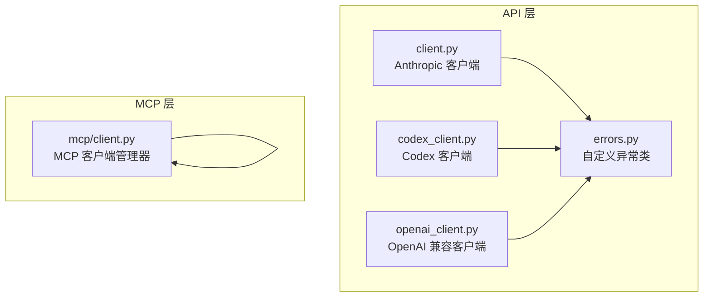
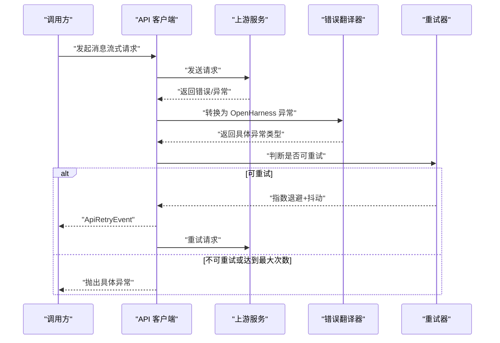
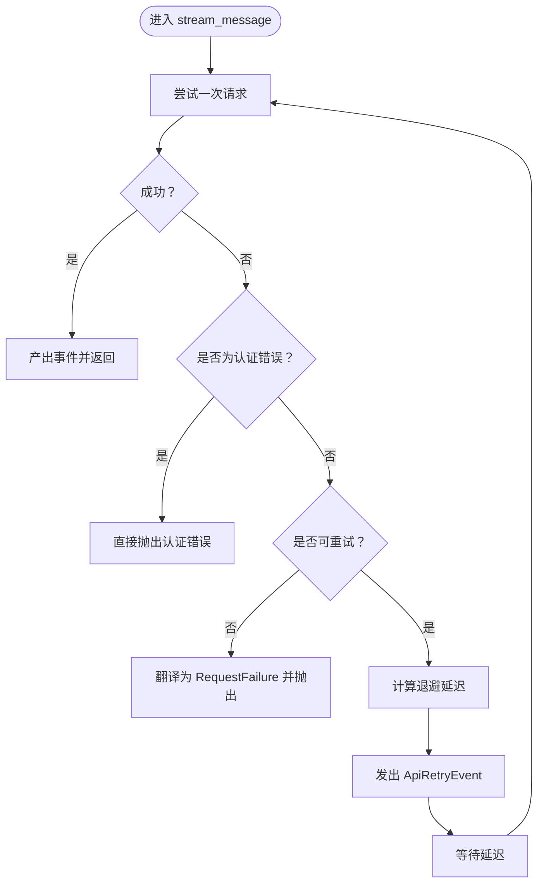
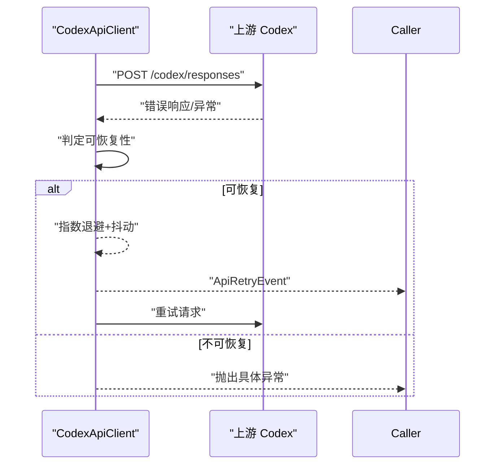
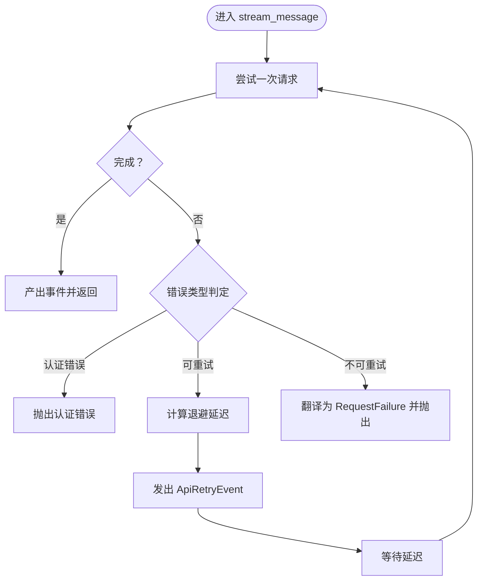
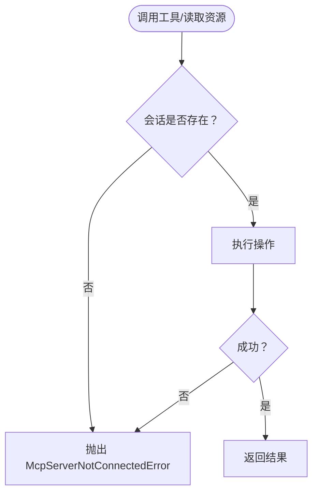
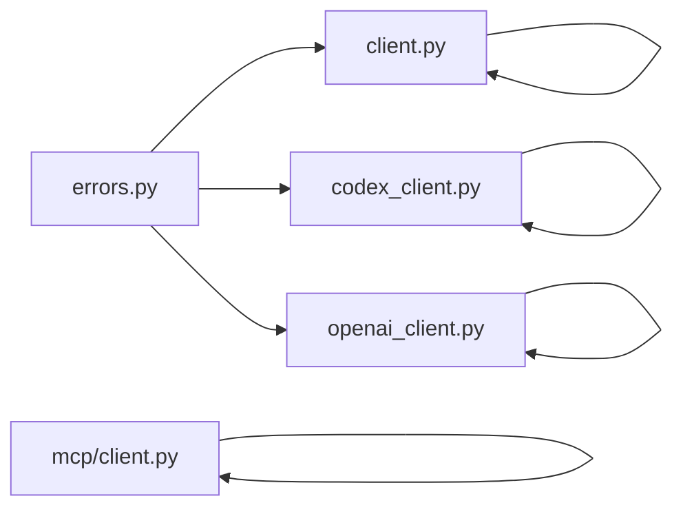

# 错误处理 API

<cite>
**本文引用的文件**
- [src/openharness/api/errors.py](file://src/openharness/api/errors.py)
- [src/openharness/api/client.py](file://src/openharness/api/client.py)
- [src/openharness/api/codex_client.py](file://src/openharness/api/codex_client.py)
- [src/openharness/api/openai_client.py](file://src/openharness/api/openai_client.py)
- [src/openharness/mcp/client.py](file://src/openharness/mcp/client.py)
- [tests/test_api/test_client.py](file://tests/test_api/test_client.py)
- [tests/test_api/test_codex_client.py](file://tests/test_api/test_codex_client.py)
- [tests/test_api/test_openai_client.py](file://tests/test_api/test_openai_client.py)
- [tests/test_engine/test_query_engine.py](file://tests/test_engine/test_query_engine.py)
</cite>

## 目录
1. [简介](#简介)
2. [项目结构](#项目结构)
3. [核心组件](#核心组件)
4. [架构总览](#架构总览)
5. [详细组件分析](#详细组件分析)
6. [依赖关系分析](#依赖关系分析)
7. [性能考量](#性能考量)
8. [故障排除指南](#故障排除指南)
9. [结论](#结论)
10. [附录](#附录)

## 简介
本文件系统化梳理 OpenHarness 的错误处理 API，聚焦以下目标：
- 全面记录自定义异常类的定义、用途与使用场景
- 解释错误类型分类（认证错误、网络错误、速率限制、通用请求失败等）
- 提供每个异常类的构造参数、属性与使用示例路径
- 总结错误处理最佳实践（重试策略、降级处理、用户友好提示）
- 给出错误码对照与故障排除清单

## 项目结构
OpenHarness 的错误处理主要分布在 API 客户端层与 MCP 客户端层：
- API 层：统一的自定义异常基类与子类，以及多个客户端对上游错误的翻译与重试
- MCP 层：连接与会话管理中的连接失败与工具调用失败异常

图表来源
- [src/openharness/api/errors.py:6-19](file://src/openharness/api/errors.py#L6-L19)
- [src/openharness/api/client.py:14-19](file://src/openharness/api/client.py#L14-L19)
- [src/openharness/api/codex_client.py:19-20](file://src/openharness/api/codex_client.py#L19-L20)
- [src/openharness/api/openai_client.py:22-27](file://src/openharness/api/openai_client.py#L22-L27)
- [src/openharness/mcp/client.py:25-26](file://src/openharness/mcp/client.py#L25-L26)

章节来源
- [src/openharness/api/errors.py:1-20](file://src/openharness/api/errors.py#L1-L20)
- [src/openharness/api/client.py:1-30](file://src/openharness/api/client.py#L1-L30)
- [src/openharness/api/codex_client.py:1-30](file://src/openharness/api/codex_client.py#L1-L30)
- [src/openharness/api/openai_client.py:1-30](file://src/openharness/api/openai_client.py#L1-L30)
- [src/openharness/mcp/client.py:1-30](file://src/openharness/mcp/client.py#L1-L30)

## 核心组件
- 自定义异常基类与子类
  - 基类：用于标识上游 API 失败的统一根异常
  - 子类：认证失败、速率限制、通用请求/传输失败
- 客户端错误翻译与重试
  - Anthropic 客户端：统一重试、可恢复错误判定、错误翻译
  - Codex 客户端：基于状态码与异常类型的翻译、指数退避与抖动
  - OpenAI 兼容客户端：基于状态码与异常类型的翻译、指数退避与抖动
- MCP 客户端异常
  - 连接失败与会话丢失时抛出的异常，便于上层感知与降级

章节来源
- [src/openharness/api/errors.py:6-19](file://src/openharness/api/errors.py#L6-L19)
- [src/openharness/api/client.py:87-116](file://src/openharness/api/client.py#L87-L116)
- [src/openharness/api/codex_client.py:385-407](file://src/openharness/api/codex_client.py#L385-L407)
- [src/openharness/api/openai_client.py:432-449](file://src/openharness/api/openai_client.py#L432-L449)
- [src/openharness/mcp/client.py:25-26](file://src/openharness/mcp/client.py#L25-L26)

## 架构总览
下图展示错误在各客户端中的传播与处理流程。

图表来源
- [src/openharness/api/client.py:161-197](file://src/openharness/api/client.py#L161-L197)
- [src/openharness/api/codex_client.py:229-251](file://src/openharness/api/codex_client.py#L229-L251)
- [src/openharness/api/openai_client.py:279-310](file://src/openharness/api/openai_client.py#L279-L310)

## 详细组件分析

### 自定义异常类
- 基类：OpenHarnessApiError
  - 用途：作为所有上游 API 失败的统一根异常类型
  - 使用场景：当需要区分“上游服务错误”与其他内部错误时
  - 示例路径：[src/openharness/api/errors.py:6-7](file://src/openharness/api/errors.py#L6-L7)
- 认证失败：AuthenticationFailure
  - 用途：当上游服务拒绝提供的凭据时
  - 使用场景：凭据无效、过期、权限不足
  - 示例路径：[src/openharness/api/errors.py:10-11](file://src/openharness/api/errors.py#L10-L11)
- 速率限制：RateLimitFailure
  - 用途：当上游服务因速率限制拒绝请求时
  - 使用场景：配额耗尽、触发限流
  - 示例路径：[src/openharness/api/errors.py:14-15](file://src/openharness/api/errors.py#L14-L15)
- 请求/传输失败：RequestFailure
  - 用途：通用的请求或传输失败
  - 使用场景：网络超时、连接中断、上游非 2xx 且非速率限制
  - 示例路径：[src/openharness/api/errors.py:18-19](file://src/openharness/api/errors.py#L18-L19)

章节来源
- [src/openharness/api/errors.py:6-19](file://src/openharness/api/errors.py#L6-L19)

### Anthropic 客户端（client.py）
- 重试策略
  - 最大重试次数、指数退避、抖动、可恢复错误判定
  - 可恢复错误：特定状态码、网络/超时/OS 错误
- 错误翻译
  - 将上游 API 错误映射到具体异常类型
- 关键实现位置
  - 可恢复错误判定：[src/openharness/api/client.py:87-95](file://src/openharness/api/client.py#L87-L95)
  - 指数退避与抖动：[src/openharness/api/client.py:98-115](file://src/openharness/api/client.py#L98-L115)
  - 流式请求重试主循环：[src/openharness/api/client.py:161-197](file://src/openharness/api/client.py#L161-L197)
  - 错误翻译逻辑：[src/openharness/api/client.py:171-197](file://src/openharness/api/client.py#L171-L197)

图表来源
- [src/openharness/api/client.py:161-197](file://src/openharness/api/client.py#L161-L197)

章节来源
- [src/openharness/api/client.py:87-116](file://src/openharness/api/client.py#L87-L116)
- [src/openharness/api/client.py:161-197](file://src/openharness/api/client.py#L161-L197)

### Codex 客户端（codex_client.py）
- 重试策略
  - 最大重试次数、指数退避、抖动、可恢复错误判定
  - 可恢复错误：特定状态码、网络/超时/速率相关字符串匹配
- 错误翻译
  - 基于状态码映射到具体异常类型；其他 HTTP 错误统一为 RequestFailure
- 关键实现位置
  - 可恢复错误判定：[src/openharness/api/codex_client.py:385-396](file://src/openharness/api/codex_client.py#L385-L396)
  - 错误翻译（状态码）：[src/openharness/api/codex_client.py:213-218](file://src/openharness/api/codex_client.py#L213-L218)
  - 错误翻译（异常）：[src/openharness/api/codex_client.py:398-407](file://src/openharness/api/codex_client.py#L398-L407)
  - 流式请求重试主循环：[src/openharness/api/codex_client.py:229-251](file://src/openharness/api/codex_client.py#L229-L251)

图表来源
- [src/openharness/api/codex_client.py:229-251](file://src/openharness/api/codex_client.py#L229-L251)
- [src/openharness/api/codex_client.py:385-407](file://src/openharness/api/codex_client.py#L385-L407)

章节来源
- [src/openharness/api/codex_client.py:213-218](file://src/openharness/api/codex_client.py#L213-L218)
- [src/openharness/api/codex_client.py:385-407](file://src/openharness/api/codex_client.py#L385-L407)
- [src/openharness/api/codex_client.py:229-251](file://src/openharness/api/codex_client.py#L229-L251)

### OpenAI 兼容客户端（openai_client.py）
- 重试策略
  - 最大重试次数、指数退避、抖动、可恢复错误判定
  - 可恢复错误：特定状态码、网络/超时/OS 错误
- 错误翻译
  - 基于状态码映射到具体异常类型；其他错误统一为 RequestFailure
- 关键实现位置
  - 可恢复错误判定：[src/openharness/api/openai_client.py:432-439](file://src/openharness/api/openai_client.py#L432-L439)
  - 错误翻译（状态码）：[src/openharness/api/openai_client.py:442-449](file://src/openharness/api/openai_client.py#L442-L449)
  - 流式请求重试主循环：[src/openharness/api/openai_client.py:279-310](file://src/openharness/api/openai_client.py#L279-L310)

图表来源
- [src/openharness/api/openai_client.py:279-310](file://src/openharness/api/openai_client.py#L279-L310)
- [src/openharness/api/openai_client.py:432-449](file://src/openharness/api/openai_client.py#L432-L449)

章节来源
- [src/openharness/api/openai_client.py:432-449](file://src/openharness/api/openai_client.py#L432-L449)
- [src/openharness/api/openai_client.py:279-310](file://src/openharness/api/openai_client.py#L279-L310)

### MCP 客户端异常（mcp/client.py）
- 异常：McpServerNotConnectedError
  - 触发条件：服务器未连接或会话丢失
  - 使用场景：调用工具或读取资源前检查连接状态
  - 实现位置：[src/openharness/mcp/client.py:25-26](file://src/openharness/mcp/client.py#L25-L26)
  - 调用点示例：工具调用失败时抛出该异常
    - [src/openharness/mcp/client.py:139-143](file://src/openharness/mcp/client.py#L139-L143)
  - 调用点示例：资源读取失败时抛出该异常
    - [src/openharness/mcp/client.py:166-170](file://src/openharness/mcp/client.py#L166-L170)

图表来源
- [src/openharness/mcp/client.py:129-178](file://src/openharness/mcp/client.py#L129-L178)

章节来源
- [src/openharness/mcp/client.py:25-26](file://src/openharness/mcp/client.py#L25-L26)
- [src/openharness/mcp/client.py:129-178](file://src/openharness/mcp/client.py#L129-L178)

## 依赖关系分析
- 异常类依赖
  - 所有客户端均导入并使用自定义异常类
- 客户端依赖
  - Anthropic 客户端依赖错误翻译与重试工具函数
  - Codex 客户端依赖状态码翻译与错误格式化
  - OpenAI 兼容客户端依赖状态码翻译与重试工具函数
- MCP 客户端依赖自身状态与会话对象

图表来源
- [src/openharness/api/errors.py:6-19](file://src/openharness/api/errors.py#L6-L19)
- [src/openharness/api/client.py:14-19](file://src/openharness/api/client.py#L14-L19)
- [src/openharness/api/codex_client.py:19-20](file://src/openharness/api/codex_client.py#L19-L20)
- [src/openharness/api/openai_client.py:22-27](file://src/openharness/api/openai_client.py#L22-L27)
- [src/openharness/mcp/client.py:25-26](file://src/openharness/mcp/client.py#L25-L26)

章节来源
- [src/openharness/api/errors.py:6-19](file://src/openharness/api/errors.py#L6-L19)
- [src/openharness/api/client.py:14-19](file://src/openharness/api/client.py#L14-L19)
- [src/openharness/api/codex_client.py:19-20](file://src/openharness/api/codex_client.py#L19-L20)
- [src/openharness/api/openai_client.py:22-27](file://src/openharness/api/openai_client.py#L22-L27)
- [src/openharness/mcp/client.py:25-26](file://src/openharness/mcp/client.py#L25-L26)

## 性能考量
- 指数退避与抖动
  - 防止雪崩效应，提升整体可用性
  - 各客户端均采用指数增长与随机抖动组合
- 最大延迟上限
  - 控制最长等待时间，避免无限延长
- 可恢复错误判定
  - 仅对可恢复错误进行重试，减少无意义的等待
- 状态码与异常类型映射
  - 快速分流不同错误类别，避免重复解析

## 故障排除指南
- 认证失败（AuthenticationFailure）
  - 现象：出现 401/403 或凭据相关错误
  - 排查：确认凭据有效、权限正确、会话未过期
  - 客户端行为：不自动重试，直接抛出异常
  - 参考实现：
    - [src/openharness/api/codex_client.py:213-218](file://src/openharness/api/codex_client.py#L213-L218)
    - [src/openharness/api/openai_client.py:442-449](file://src/openharness/api/openai_client.py#L442-L449)
    - [src/openharness/api/client.py:171-172](file://src/openharness/api/client.py#L171-L172)
- 速率限制（RateLimitFailure）
  - 现象：出现 429 或上游提示速率限制
  - 排查：降低请求频率、检查配额、关注 Retry-After
  - 客户端行为：自动重试（指数退避），必要时使用 Retry-After
  - 参考实现：
    - [src/openharness/api/codex_client.py:385-396](file://src/openharness/api/codex_client.py#L385-L396)
    - [src/openharness/api/openai_client.py:432-439](file://src/openharness/api/openai_client.py#L432-L439)
    - [src/openharness/api/client.py:87-95](file://src/openharness/api/client.py#L87-L95)
- 网络/传输错误（RequestFailure）
  - 现象：超时、连接中断、网络异常
  - 排查：检查网络连通性、代理设置、上游服务状态
  - 客户端行为：自动重试（指数退避），最终抛出异常
  - 参考实现：
    - [src/openharness/api/codex_client.py:398-407](file://src/openharness/api/codex_client.py#L398-L407)
    - [src/openharness/api/openai_client.py:442-449](file://src/openharness/api/openai_client.py#L442-L449)
    - [src/openharness/api/client.py:175-178](file://src/openharness/api/client.py#L175-L178)
- MCP 连接失败（McpServerNotConnectedError）
  - 现象：工具调用或资源读取时报“未连接”
  - 排查：检查 MCP 服务器配置、认证头、传输协议
  - 客户端行为：立即抛出异常，建议上层进行降级或重连
  - 参考实现：
    - [src/openharness/mcp/client.py:139-143](file://src/openharness/mcp/client.py#L139-L143)
    - [src/openharness/mcp/client.py:166-170](file://src/openharness/mcp/client.py#L166-L170)

章节来源
- [src/openharness/api/codex_client.py:213-218](file://src/openharness/api/codex_client.py#L213-L218)
- [src/openharness/api/openai_client.py:432-449](file://src/openharness/api/openai_client.py#L432-L449)
- [src/openharness/api/client.py:87-95](file://src/openharness/api/client.py#L87-L95)
- [src/openharness/mcp/client.py:139-143](file://src/openharness/mcp/client.py#L139-L143)

## 结论
OpenHarness 的错误处理 API 通过统一的异常体系与多客户端一致的重试/翻译机制，实现了对认证、速率限制、网络与传输等错误的清晰分层与稳健处理。结合指数退避、抖动与可恢复性判定，系统在保证用户体验的同时提升了鲁棒性。对于 MCP 场景，明确的连接状态与异常抛出有助于上层快速降级或重连。

## 附录

### 错误类型与使用场景对照
- OpenHarnessApiError（基类）
  - 用途：统一标识上游 API 失败
  - 使用场景：作为所有自定义异常的父类
  - 示例路径：[src/openharness/api/errors.py:6-7](file://src/openharness/api/errors.py#L6-L7)
- AuthenticationFailure
  - 用途：凭据被拒
  - 使用场景：401/403、令牌无效、权限不足
  - 示例路径：[src/openharness/api/errors.py:10-11](file://src/openharness/api/errors.py#L10-L11)
- RateLimitFailure
  - 用途：速率限制触发
  - 使用场景：429、配额耗尽、服务端限流
  - 示例路径：[src/openharness/api/errors.py:14-15](file://src/openharness/api/errors.py#L14-L15)
- RequestFailure
  - 用途：通用请求/传输失败
  - 使用场景：超时、连接中断、非 2xx 非 429
  - 示例路径：[src/openharness/api/errors.py:18-19](file://src/openharness/api/errors.py#L18-L19)

章节来源
- [src/openharness/api/errors.py:6-19](file://src/openharness/api/errors.py#L6-L19)

### 错误码对照（常见）
- 401/403：认证失败（AuthenticationFailure）
  - 触发位置：
    - [src/openharness/api/codex_client.py:213-218](file://src/openharness/api/codex_client.py#L213-L218)
    - [src/openharness/api/openai_client.py:442-449](file://src/openharness/api/openai_client.py#L442-L449)
- 429：速率限制（RateLimitFailure）
  - 触发位置：
    - [src/openharness/api/codex_client.py:385-396](file://src/openharness/api/codex_client.py#L385-L396)
    - [src/openharness/api/openai_client.py:432-439](file://src/openharness/api/openai_client.py#L432-L439)
- 500/502/503/504：网络/服务端错误（RequestFailure）
  - 触发位置：
    - [src/openharness/api/codex_client.py:398-407](file://src/openharness/api/codex_client.py#L398-L407)
    - [src/openharness/api/openai_client.py:442-449](file://src/openharness/api/openai_client.py#L442-L449)
    - [src/openharness/api/client.py:87-95](file://src/openharness/api/client.py#L87-L95)

章节来源
- [src/openharness/api/codex_client.py:213-218](file://src/openharness/api/codex_client.py#L213-L218)
- [src/openharness/api/openai_client.py:432-449](file://src/openharness/api/openai_client.py#L432-L449)
- [src/openharness/api/client.py:87-95](file://src/openharness/api/client.py#L87-L95)

### 最佳实践
- 重试策略
  - 对可恢复错误使用指数退避+抖动
  - 明确最大重试次数与最大延迟
  - 优先尊重上游 Retry-After
- 降级处理
  - 认证失败不重试，引导用户修正凭据
  - 速率限制时降低频率或缓存结果
  - 网络错误时回退到本地缓存或离线模式
- 用户友好提示
  - 在 UI 中以 ApiRetryEvent 提示“正在重试”，避免用户误以为卡死
  - 对 MCP 工具调用失败，提供“请检查服务器配置”的提示
- 日志与可观测性
  - 记录错误类型、状态码、重试次数与延迟
  - 保留请求 ID 以便跨系统追踪

章节来源
- [src/openharness/api/client.py:98-115](file://src/openharness/api/client.py#L98-L115)
- [src/openharness/api/codex_client.py:229-251](file://src/openharness/api/codex_client.py#L229-L251)
- [src/openharness/api/openai_client.py:279-310](file://src/openharness/api/openai_client.py#L279-L310)
- [src/openharness/mcp/client.py:139-143](file://src/openharness/mcp/client.py#L139-L143)

### 使用示例（路径）
- Anthropic 客户端重试与错误翻译
  - [src/openharness/api/client.py:161-197](file://src/openharness/api/client.py#L161-L197)
- Codex 客户端重试与错误翻译
  - [src/openharness/api/codex_client.py:229-251](file://src/openharness/api/codex_client.py#L229-L251)
  - [src/openharness/api/codex_client.py:398-407](file://src/openharness/api/codex_client.py#L398-L407)
- OpenAI 兼容客户端重试与错误翻译
  - [src/openharness/api/openai_client.py:279-310](file://src/openharness/api/openai_client.py#L279-L310)
  - [src/openharness/api/openai_client.py:442-449](file://src/openharness/api/openai_client.py#L442-L449)
- MCP 工具调用失败
  - [src/openharness/mcp/client.py:139-143](file://src/openharness/mcp/client.py#L139-L143)
- 测试用例参考
  - [tests/test_api/test_client.py:1-194](file://tests/test_api/test_client.py#L1-L194)
  - [tests/test_api/test_codex_client.py:1-245](file://tests/test_api/test_codex_client.py#L1-L245)
  - [tests/test_api/test_openai_client.py:1-500](file://tests/test_api/test_openai_client.py#L1-L500)
  - [tests/test_engine/test_query_engine.py:81-106](file://tests/test_engine/test_query_engine.py#L81-L106)