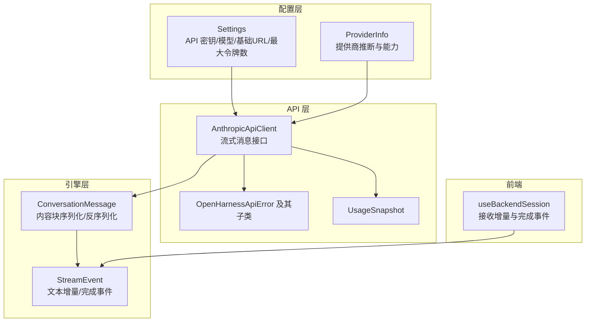
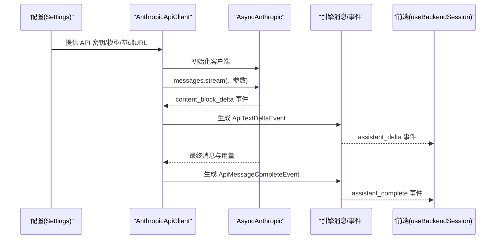
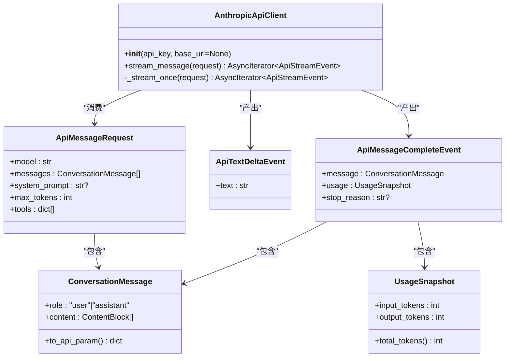
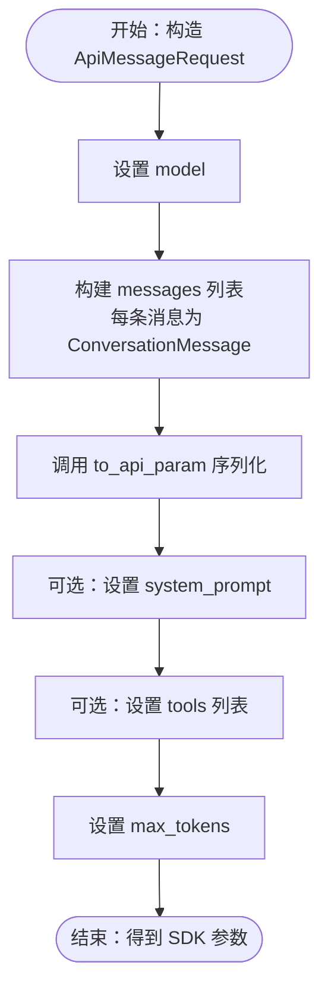
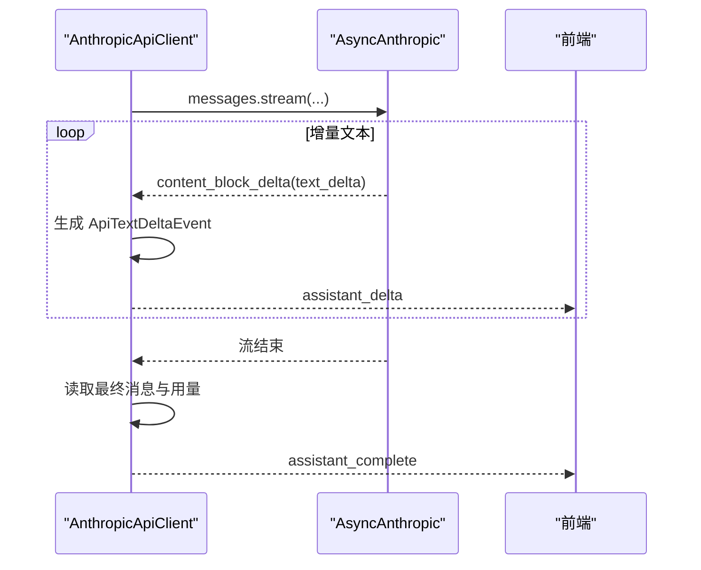
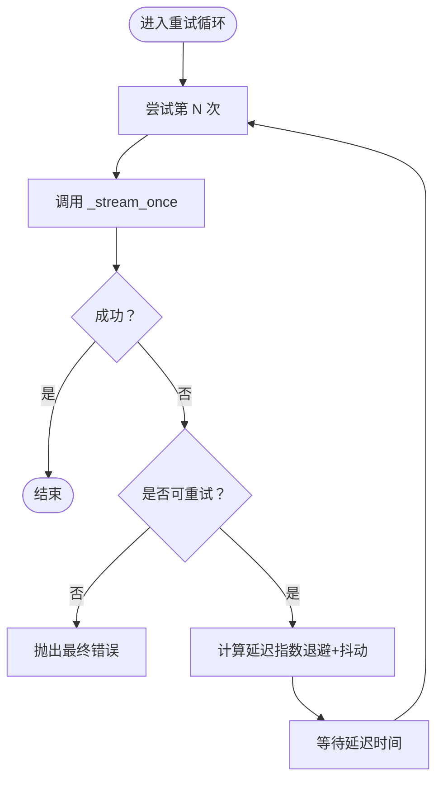
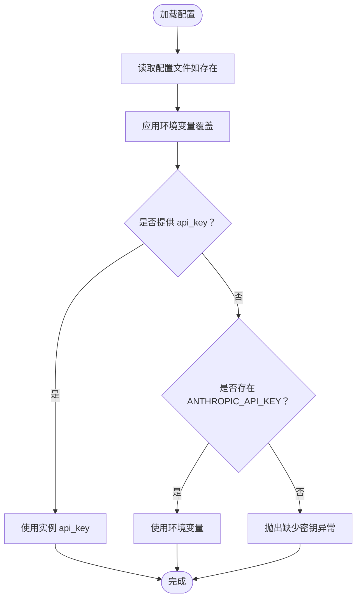
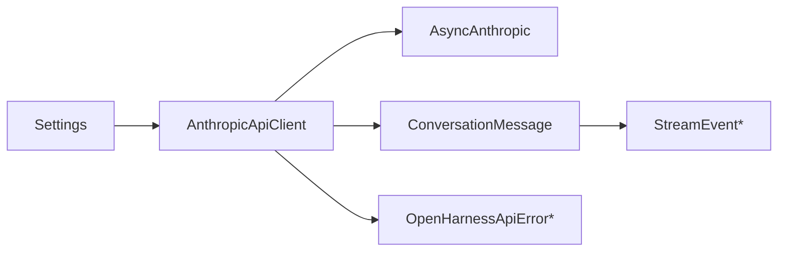

# API 客户端

<cite>
**本文引用的文件**
- [client.py](file://src/openharness/api/client.py)
- [errors.py](file://src/openharness/api/errors.py)
- [usage.py](file://src/openharness/api/usage.py)
- [messages.py](file://src/openharness/engine/messages.py)
- [stream_events.py](file://src/openharness/engine/stream_events.py)
- [settings.py](file://src/openharness/config/settings.py)
- [provider.py](file://src/openharness/api/provider.py)
- [useBackendSession.ts](file://frontend/terminal/src/hooks/useBackendSession.ts)
</cite>

## 目录
1. [简介](#简介)
2. [项目结构](#项目结构)
3. [核心组件](#核心组件)
4. [架构总览](#架构总览)
5. [详细组件分析](#详细组件分析)
6. [依赖分析](#依赖分析)
7. [性能考虑](#性能考虑)
8. [故障排查指南](#故障排查指南)
9. [结论](#结论)
10. [附录](#附录)

## 简介
本文件面向 OpenHarness 的 API 客户端使用者，重点围绕 AnthropicApiClient 类的设计与实现进行深入解析，涵盖以下主题：
- 初始化与配置：API 密钥、自定义基础 URL、环境变量与配置文件优先级
- 请求参数构建：模型选择、消息格式、系统提示、工具配置
- 流式响应处理：文本增量事件与完整消息事件的产生与消费
- 错误处理与重试：可重试错误类型、指数退避与抖动策略
- 使用示例与最佳实践：单次请求与流式处理的调用方式

## 项目结构
OpenHarness 将 API 客户端封装在独立模块中，并通过引擎层的消息模型与事件模型与上层交互。关键文件分布如下：
- API 客户端与错误模型：src/openharness/api/client.py、src/openharness/api/errors.py、src/openharness/api/usage.py
- 引擎消息与事件：src/openharness/engine/messages.py、src/openharness/engine/stream_events.py
- 配置与提供商检测：src/openharness/config/settings.py、src/openharness/api/provider.py
- 前端会话钩子（参考）：frontend/terminal/src/hooks/useBackendSession.ts

**图表来源**
- [client.py:98-186](file://src/openharness/api/client.py#L98-L186)
- [messages.py:39-109](file://src/openharness/engine/messages.py#L39-L109)
- [stream_events.py:12-50](file://src/openharness/engine/stream_events.py#L12-L50)
- [errors.py:6-20](file://src/openharness/api/errors.py#L6-L20)
- [usage.py:8-18](file://src/openharness/api/usage.py#L8-L18)
- [settings.py:49-121](file://src/openharness/config/settings.py#L49-L121)
- [provider.py:20-66](file://src/openharness/api/provider.py#L20-L66)
- [useBackendSession.ts:99-109](file://frontend/terminal/src/hooks/useBackendSession.ts#L99-L109)

**章节来源**
- [client.py:1-186](file://src/openharness/api/client.py#L1-L186)
- [messages.py:1-109](file://src/openharness/engine/messages.py#L1-L109)
- [stream_events.py:1-50](file://src/openharness/engine/stream_events.py#L1-L50)
- [errors.py:1-20](file://src/openharness/api/errors.py#L1-L20)
- [usage.py:1-18](file://src/openharness/api/usage.py#L1-L18)
- [settings.py:1-161](file://src/openharness/config/settings.py#L1-L161)
- [provider.py:1-66](file://src/openharness/api/provider.py#L1-L66)
- [useBackendSession.ts:1-172](file://frontend/terminal/src/hooks/useBackendSession.ts#L1-L172)

## 核心组件
- AnthropicApiClient：对 Anthropic 异步 SDK 的轻量封装，提供带重试的流式消息接口
- ApiMessageRequest：一次模型调用的输入参数载体
- ApiTextDeltaEvent / ApiMessageCompleteEvent：流式事件类型
- ConversationMessage：对话消息模型，支持文本、工具调用与工具结果三种内容块
- UsageSnapshot：用量统计快照
- Settings：统一的配置来源，支持环境变量与配置文件覆盖

**章节来源**
- [client.py:30-58](file://src/openharness/api/client.py#L30-L58)
- [messages.py:39-109](file://src/openharness/engine/messages.py#L39-L109)
- [usage.py:8-18](file://src/openharness/api/usage.py#L8-L18)
- [settings.py:49-121](file://src/openharness/config/settings.py#L49-L121)

## 架构总览
下图展示了从配置到客户端、再到引擎与前端的调用链路与事件流转。

**图表来源**
- [client.py:107-177](file://src/openharness/api/client.py#L107-L177)
- [messages.py:91-109](file://src/openharness/engine/messages.py#L91-L109)
- [useBackendSession.ts:99-109](file://frontend/terminal/src/hooks/useBackendSession.ts#L99-L109)

## 详细组件分析

### AnthropicApiClient 设计与实现
- 初始化
  - 支持传入 API 密钥与可选的基础 URL；若未提供则使用默认值
  - 内部持有 AsyncAnthropic 实例，用于后续异步调用
- 流式消息接口
  - 对外暴露 stream_message(request) 异步迭代器，逐个产出增量文本与最终完整消息
  - 内部通过 _stream_once 执行一次流式请求，并在发生可重试异常时按指数退避+抖动策略重试
- 参数映射
  - 将 ApiMessageRequest 映射为 SDK 的消息参数，包括模型、消息列表、系统提示、最大令牌数、工具列表
  - 消息内容通过 ConversationMessage.to_api_param 序列化为 SDK 期望的结构
- 事件生成
  - 当收到 SDK 的 content_block_delta 且类型为 text_delta 时，生成 ApiTextDeltaEvent
  - 流结束后，读取最终消息与用量，生成 ApiMessageCompleteEvent，并转换为 ConversationMessage

**图表来源**
- [client.py:98-186](file://src/openharness/api/client.py#L98-L186)
- [messages.py:39-109](file://src/openharness/engine/messages.py#L39-L109)
- [usage.py:8-18](file://src/openharness/api/usage.py#L8-L18)

**章节来源**
- [client.py:98-186](file://src/openharness/api/client.py#L98-L186)
- [messages.py:39-109](file://src/openharness/engine/messages.py#L39-L109)
- [usage.py:8-18](file://src/openharness/api/usage.py#L8-L18)

### 请求参数构建：ApiMessageRequest
- 字段说明
  - model：模型名称，来自 Settings 或环境变量
  - messages：对话消息列表，每条消息由 ConversationMessage 表示
  - system_prompt：可选系统提示字符串
  - max_tokens：最大输出令牌数
  - tools：可选工具定义列表
- 消息格式
  - ConversationMessage 支持三种内容块：纯文本、工具调用、工具结果
  - to_api_param 将本地模型序列化为 SDK 期望的字典结构
- 工具配置
  - tools 字段直接透传给 SDK，用于启用函数调用与工具执行

**图表来源**
- [client.py:140-148](file://src/openharness/api/client.py#L140-L148)
- [messages.py:62-67](file://src/openharness/engine/messages.py#L62-L67)

**章节来源**
- [client.py:30-39](file://src/openharness/api/client.py#L30-L39)
- [messages.py:39-67](file://src/openharness/engine/messages.py#L39-L67)

### 流式响应处理：文本增量与完整消息
- 文本增量事件
  - SDK 返回 content_block_delta 且 delta 类型为 text_delta 时，提取 text 并生成 ApiTextDeltaEvent
  - 前端监听 assistant_delta 事件，拼接增量文本并实时渲染
- 完整消息事件
  - 流结束后，读取最终消息与用量，生成 ApiMessageCompleteEvent
  - 同时将 SDK 原始消息转换为 ConversationMessage，便于后续引擎处理
- 停止原因
  - stop_reason 作为可选字段随完整事件返回

**图表来源**
- [client.py:150-176](file://src/openharness/api/client.py#L150-L176)
- [messages.py:91-109](file://src/openharness/engine/messages.py#L91-L109)
- [useBackendSession.ts:99-109](file://frontend/terminal/src/hooks/useBackendSession.ts#L99-L109)

**章节来源**
- [client.py:107-177](file://src/openharness/api/client.py#L107-L177)
- [messages.py:91-109](file://src/openharness/engine/messages.py#L91-L109)
- [useBackendSession.ts:99-109](file://frontend/terminal/src/hooks/useBackendSession.ts#L99-L109)

### 错误处理与重试
- 可重试条件
  - 状态码为 429、500、502、503、529 的 APIStatusError
  - APIError（网络错误）
  - 连接超时、操作系统错误
- 重试策略
  - 指数退避：2^attempt 秒，上限不超过最大延迟
  - 抖动：在延迟基础上加入 ±25% 的随机抖动
  - 若存在 Retry-After 头，则优先使用该值，但不超过最大延迟
- 错误翻译
  - 认证失败/权限不足 → AuthenticationFailure
  - 速率限制 → RateLimitFailure
  - 其他 → RequestFailure

**图表来源**
- [client.py:111-136](file://src/openharness/api/client.py#L111-L136)
- [client.py:78-95](file://src/openharness/api/client.py#L78-L95)
- [client.py:163-166](file://src/openharness/api/client.py#L163-L166)
- [errors.py:10-20](file://src/openharness/api/errors.py#L10-L20)

**章节来源**
- [client.py:67-95](file://src/openharness/api/client.py#L67-L95)
- [client.py:111-136](file://src/openharness/api/client.py#L111-L136)
- [errors.py:6-20](file://src/openharness/api/errors.py#L6-L20)

### 初始化配置：API 密钥与基础 URL
- API 密钥解析优先级
  - 实例字段 > 环境变量 ANTHROPIC_API_KEY > 配置文件
  - 若均未提供，抛出异常提示用户配置
- 环境变量覆盖
  - 支持 ANTHROPIC_MODEL、OPENHARNESS_MODEL、ANTHROPIC_BASE_URL、OPENHARNESS_BASE_URL、OPENHARNESS_MAX_TOKENS
- 自定义基础 URL
  - 可通过 Settings.base_url 或环境变量设置，用于兼容不同提供商或代理场景
- 提供商检测
  - 根据 base_url 与 model 推断提供商名称与鉴权类型，辅助 UI 与诊断

**图表来源**
- [settings.py:123-141](file://src/openharness/config/settings.py#L123-L141)
- [settings.py:76-91](file://src/openharness/config/settings.py#L76-L91)
- [settings.py:99-120](file://src/openharness/config/settings.py#L99-L120)
- [provider.py:20-57](file://src/openharness/api/provider.py#L20-L57)

**章节来源**
- [settings.py:49-121](file://src/openharness/config/settings.py#L49-L121)
- [provider.py:20-57](file://src/openharness/api/provider.py#L20-L57)

### 使用示例与最佳实践
- 单次请求（非流式）
  - 通过 Settings.resolve_api_key 获取密钥
  - 构造 ApiMessageRequest，填充 model、messages、system_prompt、max_tokens、tools
  - 调用 AnthropicApiClient.stream_message 并消费事件
  - 注意：当前实现为流式接口，如需“非流式”体验，可在收到完整事件后一次性使用
- 流式处理
  - 在前端监听 assistant_delta 事件以实时显示文本增量
  - 在收到 assistant_complete 事件后，合并缓冲文本并清空状态
- 最佳实践
  - 为每次请求设置合理的 max_tokens，避免过长输出
  - 使用 tools 字段声明工具，确保模型具备可用工具
  - 在 UI 中区分文本增量与最终消息，避免重复渲染
  - 遇到速率限制或网络波动时，利用内置重试策略自动恢复

**章节来源**
- [client.py:107-177](file://src/openharness/api/client.py#L107-L177)
- [messages.py:39-67](file://src/openharness/engine/messages.py#L39-L67)
- [useBackendSession.ts:99-109](file://frontend/terminal/src/hooks/useBackendSession.ts#L99-L109)

## 依赖分析
- 组件耦合
  - AnthropicApiClient 依赖 Settings 与 ConversationMessage，耦合度适中
  - 事件模型（ApiTextDeltaEvent、ApiMessageCompleteEvent）与引擎层（AssistantTextDelta、AssistantTurnComplete）相互映射
- 外部依赖
  - AsyncAnthropic：异步 SDK，负责实际的流式通信
  - OpenHarnessApiError 及其子类：统一错误语义
- 循环依赖
  - 未发现循环依赖，模块职责清晰

**图表来源**
- [client.py:101-105](file://src/openharness/api/client.py#L101-L105)
- [settings.py:49-121](file://src/openharness/config/settings.py#L49-L121)
- [messages.py:39-109](file://src/openharness/engine/messages.py#L39-L109)
- [stream_events.py:12-50](file://src/openharness/engine/stream_events.py#L12-L50)
- [errors.py:6-20](file://src/openharness/api/errors.py#L6-L20)

**章节来源**
- [client.py:1-186](file://src/openharness/api/client.py#L1-L186)
- [settings.py:1-161](file://src/openharness/config/settings.py#L1-L161)
- [messages.py:1-109](file://src/openharness/engine/messages.py#L1-L109)
- [stream_events.py:1-50](file://src/openharness/engine/stream_events.py#L1-L50)
- [errors.py:1-20](file://src/openharness/api/errors.py#L1-L20)

## 性能考虑
- 指数退避与抖动
  - 降低集中重试导致的雪崩效应，提升整体稳定性
- 流式传输
  - 文本增量事件可尽早呈现，改善用户体验
- 用量统计
  - UsageSnapshot 提供输入/输出令牌统计，便于成本控制与审计

[本节为通用指导，无需特定文件来源]

## 故障排查指南
- 缺少 API 密钥
  - 现象：加载配置时报错，提示需要设置环境变量或配置文件
  - 处理：在环境变量或配置文件中设置 ANTHROPIC_API_KEY 或 api_key
- 速率限制
  - 现象：出现 RateLimitFailure
  - 处理：降低请求频率或提高限额；观察 Retry-After 头进行退避
- 认证失败
  - 现象：出现 AuthenticationFailure
  - 处理：检查密钥有效性与权限范围
- 网络波动
  - 现象：偶发 RequestFailure
  - 处理：确认网络连通性；客户端已内置重试，必要时增加退避时间

**章节来源**
- [settings.py:76-91](file://src/openharness/config/settings.py#L76-L91)
- [errors.py:10-20](file://src/openharness/api/errors.py#L10-L20)
- [client.py:179-185](file://src/openharness/api/client.py#L179-L185)

## 结论
AnthropicApiClient 以简洁的封装提供了可靠的流式消息能力，结合 Settings 的灵活配置与错误翻译机制，能够稳定地支撑多场景下的对话与工具调用需求。通过增量事件与完整事件的配合，既保证了实时性，也保留了最终一致性。建议在生产环境中合理设置模型与令牌上限，并充分利用工具配置与系统提示来优化输出质量。

[本节为总结性内容，无需特定文件来源]

## 附录
- 相关类型与事件
  - ApiMessageRequest：模型、消息、系统提示、最大令牌数、工具列表
  - ApiTextDeltaEvent：文本增量
  - ApiMessageCompleteEvent：完整消息与用量
  - StreamEvent：引擎侧文本增量与完成事件
- 前端事件映射
  - assistant_delta ↔ ApiTextDeltaEvent
  - assistant_complete ↔ ApiMessageCompleteEvent

**章节来源**
- [client.py:30-58](file://src/openharness/api/client.py#L30-L58)
- [stream_events.py:12-50](file://src/openharness/engine/stream_events.py#L12-L50)
- [useBackendSession.ts:99-109](file://frontend/terminal/src/hooks/useBackendSession.ts#L99-L109)