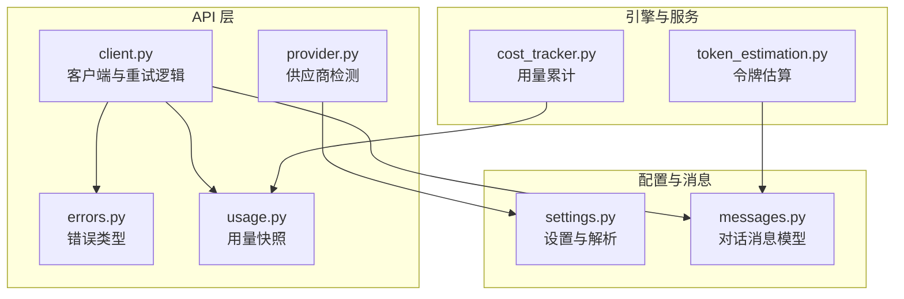
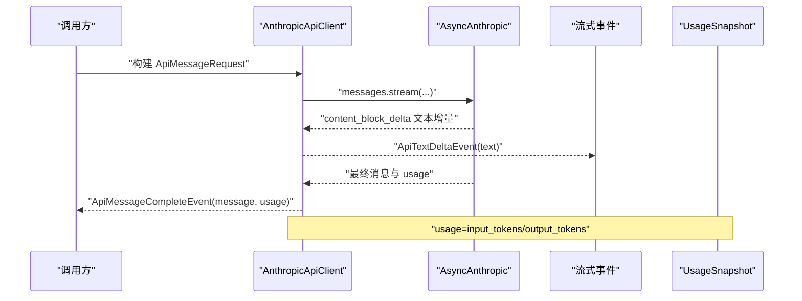
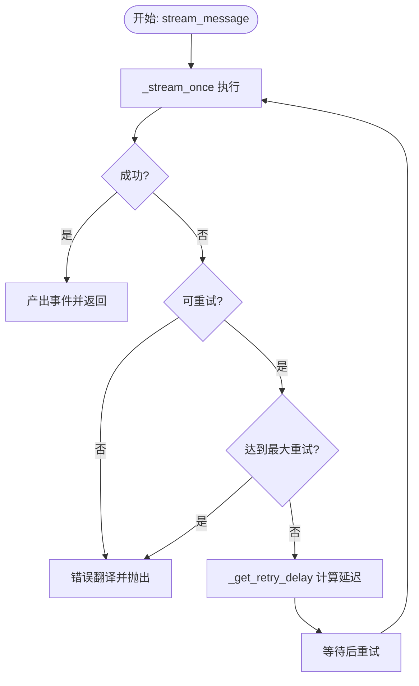
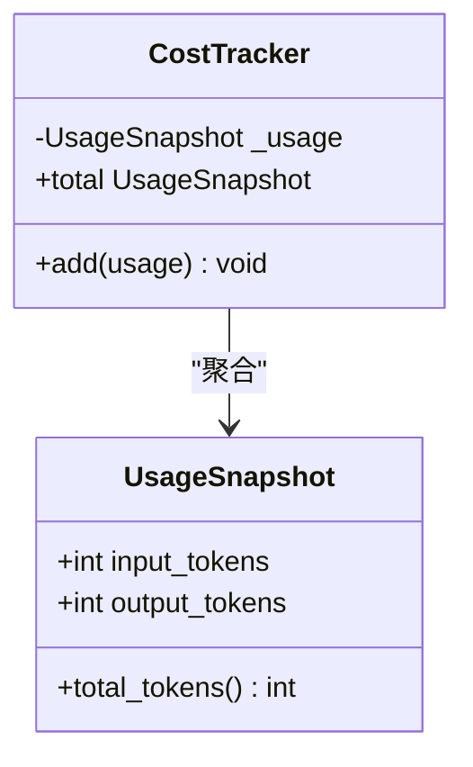
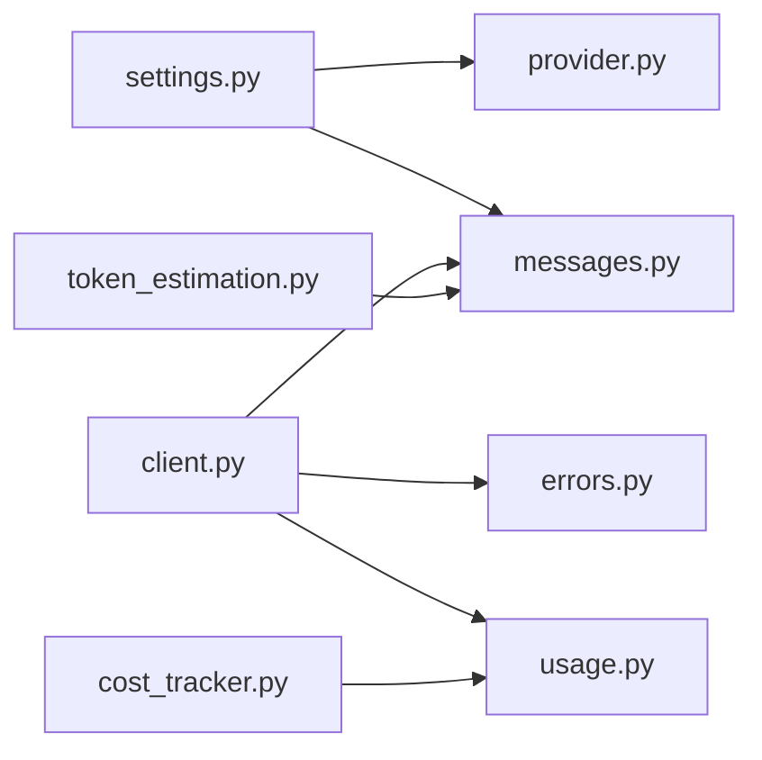

# API 系统

<cite>
**本文引用的文件**
- [client.py](file://src/openharness/api/client.py)
- [errors.py](file://src/openharness/api/errors.py)
- [provider.py](file://src/openharness/api/provider.py)
- [usage.py](file://src/openharness/api/usage.py)
- [settings.py](file://src/openharness/config/settings.py)
- [messages.py](file://src/openharness/engine/messages.py)
- [cost_tracker.py](file://src/openharness/engine/cost_tracker.py)
- [token_estimation.py](file://src/openharness/services/token_estimation.py)
- [test_harness_features.py](file://scripts/test_harness_features.py)
- [test_query_engine.py](file://tests/test_engine/test_query_engine.py)
</cite>

## 目录
1. [简介](#简介)
2. [项目结构](#项目结构)
3. [核心组件](#核心组件)
4. [架构总览](#架构总览)
5. [详细组件分析](#详细组件分析)
6. [依赖分析](#依赖分析)
7. [性能考虑](#性能考虑)
8. [故障排查指南](#故障排查指南)
9. [结论](#结论)
10. [附录](#附录)

## 简介
本文件面向需要在 OpenHarness 中集成与使用 LLM API 的开发者，系统化阐述 API 客户端的设计与实现，覆盖以下主题：
- 客户端架构与与不同供应商的兼容性设计
- 请求构建、流式响应处理、错误管理与重试策略
- 使用统计（令牌计数、累计用量、成本估算）
- 配置指南（供应商切换、认证、速率限制）
- 实际使用示例与性能优化建议
- 面向多供应商集成的完整方案

## 项目结构
OpenHarness 将 API 能力集中在 api 子包中，围绕“请求模型—客户端—事件模型—错误类型—用量统计”形成闭环；同时通过配置模块与引擎模块进行衔接。

图表来源
- [client.py:1-186](file://src/openharness/api/client.py#L1-L186)
- [errors.py:1-20](file://src/openharness/api/errors.py#L1-L20)
- [usage.py:1-18](file://src/openharness/api/usage.py#L1-L18)
- [provider.py:1-66](file://src/openharness/api/provider.py#L1-L66)
- [settings.py:1-161](file://src/openharness/config/settings.py#L1-L161)
- [messages.py:1-109](file://src/openharness/engine/messages.py#L1-L109)
- [cost_tracker.py:1-25](file://src/openharness/engine/cost_tracker.py#L1-L25)
- [token_estimation.py:1-16](file://src/openharness/services/token_estimation.py#L1-L16)

章节来源
- [client.py:1-186](file://src/openharness/api/client.py#L1-L186)
- [settings.py:1-161](file://src/openharness/config/settings.py#L1-L161)

## 核心组件
- API 客户端：封装异步 SDK，提供流式事件输出、指数退避重试、错误翻译与用量回传。
- 错误体系：统一基类与三类具体错误，便于上层区分认证失败、限流与通用请求失败。
- 用量统计：用量快照与会话级累计器，支持输入/输出令牌累加与总计查询。
- 供应商检测：基于配置推断供应商类型与鉴权方式，辅助 UI 与诊断。
- 消息模型：统一对话消息与内容块序列化/反序列化，适配上游参数格式。
- 配置系统：优先级合并（CLI > 环境变量 > 配置文件 > 默认），支持运行时覆盖。

章节来源
- [client.py:98-186](file://src/openharness/api/client.py#L98-L186)
- [errors.py:6-20](file://src/openharness/api/errors.py#L6-L20)
- [usage.py:8-18](file://src/openharness/api/usage.py#L8-L18)
- [cost_tracker.py:8-25](file://src/openharness/engine/cost_tracker.py#L8-L25)
- [provider.py:20-66](file://src/openharness/api/provider.py#L20-L66)
- [messages.py:39-109](file://src/openharness/engine/messages.py#L39-L109)
- [settings.py:49-161](file://src/openharness/config/settings.py#L49-L161)

## 架构总览
下图展示从调用方到上游 SDK 的数据流与控制流，以及错误与用量如何贯穿其中。

图表来源
- [client.py:107-176](file://src/openharness/api/client.py#L107-L176)
- [messages.py:91-109](file://src/openharness/engine/messages.py#L91-L109)
- [usage.py:8-18](file://src/openharness/api/usage.py#L8-L18)

## 详细组件分析

### API 客户端与重试机制
- 协议与事件
  - SupportsStreamingMessages：定义异步流式接口，供查询引擎与测试使用。
  - ApiStreamEvent：文本增量与完成事件的联合类型，分别承载增量文本与完整消息+用量。
- 请求与参数
  - ApiMessageRequest：包含模型名、消息列表、可选系统提示、最大输出令牌、工具列表。
  - _stream_once：将本地消息转换为上游参数，发起一次流式调用，产出增量与最终事件。
- 重试策略
  - 最大重试次数、基础/最大延迟、指数退避+抖动。
  - 可重试条件：特定状态码、网络错误、连接/超时/OSError。
  - 优先读取上游 Retry-After 响应头作为延迟上限。
- 错误翻译
  - 认证错误映射为认证失败；限流错误映射为限流失败；其他映射为通用请求失败。

图表来源
- [client.py:107-136](file://src/openharness/api/client.py#L107-L136)
- [client.py:67-95](file://src/openharness/api/client.py#L67-L95)

章节来源
- [client.py:30-57](file://src/openharness/api/client.py#L30-L57)
- [client.py:60-65](file://src/openharness/api/client.py#L60-L65)
- [client.py:107-176](file://src/openharness/api/client.py#L107-L176)
- [client.py:179-186](file://src/openharness/api/client.py#L179-L186)

### 错误类型与处理
- 统一基类：OpenHarnessApiError
- 认证失败：AuthenticationFailure
- 限流失败：RateLimitFailure
- 通用请求失败：RequestFailure
- 上游异常翻译：根据异常类型映射到上述错误，便于调用方分类处理与用户提示。

章节来源
- [errors.py:6-20](file://src/openharness/api/errors.py#L6-L20)
- [client.py:179-186](file://src/openharness/api/client.py#L179-L186)

### 用量统计与成本追踪
- 用量快照 UsageSnapshot：记录输入/输出令牌与总计。
- 会话累计 CostTracker：按会话生命周期累加用量，支持对外暴露总计。

图表来源
- [usage.py:8-18](file://src/openharness/api/usage.py#L8-L18)
- [cost_tracker.py:8-25](file://src/openharness/engine/cost_tracker.py#L8-L25)

章节来源
- [usage.py:8-18](file://src/openharness/api/usage.py#L8-L18)
- [cost_tracker.py:8-25](file://src/openharness/engine/cost_tracker.py#L8-L25)

### 供应商检测与兼容性
- detect_provider：根据 base_url 与 model 推断供应商名称、鉴权方式与语音能力。
- 支持场景：
  - Moonshot（兼容 Anthropic）：api_key 鉴权，语音不支持。
  - Bedrock 兼容：AWS 鉴权，语音不支持。
  - Vertex/AI Platform 兼容：GCP 鉴权，语音不支持。
  - 自定义 base_url：兼容 Anthropic，api_key 鉴权，语音受限。
  - 默认：Anthropic，api_key 鉴权，语音受限。
- auth_status：返回“已配置/缺失”的简要状态字符串。

章节来源
- [provider.py:20-66](file://src/openharness/api/provider.py#L20-L66)

### 消息模型与参数序列化
- ConversationMessage：用户/助手消息，支持文本块、工具调用块、工具结果块。
- 序列化/反序列化：
  - to_api_param：将本地消息转换为上游 SDK 参数。
  - assistant_message_from_api：将上游最终消息反序列化为本地消息。
- 用于适配 Anthropic 风格的消息结构。

章节来源
- [messages.py:39-109](file://src/openharness/engine/messages.py#L39-L109)

### 配置与环境变量
- Settings：集中管理 API 配置（密钥、模型、最大令牌、基础地址）、行为与 UI 设置。
- 解析优先级：实例值 > 环境变量 > 配置文件 > 默认。
- 关键字段：
  - api_key：默认空字符串，解析时支持 ANTHROPIC_API_KEY 或 OPENHARNESS_API_KEY。
  - model：默认模型名，支持 ANTHROPIC_MODEL 或 OPENHARNESS_MODEL。
  - base_url：自定义基础地址，支持 ANTHROPIC_BASE_URL 或 OPENHARNESS_BASE_URL。
  - max_tokens：默认 16384，支持 OPENHARNESS_MAX_TOKENS。
- 合并与保存：merge_cli_overrides 仅合并非空值；load_settings/save_settings 支持从默认路径读写配置文件。

章节来源
- [settings.py:49-96](file://src/openharness/config/settings.py#L49-L96)
- [settings.py:99-121](file://src/openharness/config/settings.py#L99-L121)
- [settings.py:123-161](file://src/openharness/config/settings.py#L123-L161)

### 令牌估算与成本跟踪
- 令牌估算：基于字符长度的启发式估算，适合预估与预算控制。
- 成本追踪：结合 UsageSnapshot 与 CostTracker，实现会话内累计与对外查询。

章节来源
- [token_estimation.py:6-16](file://src/openharness/services/token_estimation.py#L6-L16)
- [usage.py:14-18](file://src/openharness/api/usage.py#L14-L18)
- [cost_tracker.py:14-24](file://src/openharness/engine/cost_tracker.py#L14-L24)

## 依赖分析
- 组件耦合
  - 客户端依赖错误类型、用量快照与消息模型；通过协议解耦调用方。
  - 供应商检测依赖配置；配置与消息模型被广泛复用。
  - 引擎侧通过用量快照与消息模型与客户端交互。
- 外部依赖
  - AsyncAnthropic：上游异步 SDK。
  - Pydantic：数据模型与校验。
- 潜在循环依赖
  - 当前模块间为单向依赖，未见循环。

图表来源
- [settings.py:1-161](file://src/openharness/config/settings.py#L1-L161)
- [provider.py:1-66](file://src/openharness/api/provider.py#L1-L66)
- [client.py:1-186](file://src/openharness/api/client.py#L1-L186)
- [errors.py:1-20](file://src/openharness/api/errors.py#L1-L20)
- [usage.py:1-18](file://src/openharness/api/usage.py#L1-L18)
- [messages.py:1-109](file://src/openharness/engine/messages.py#L1-L109)
- [cost_tracker.py:1-25](file://src/openharness/engine/cost_tracker.py#L1-L25)
- [token_estimation.py:1-16](file://src/openharness/services/token_estimation.py#L1-L16)

## 性能考虑
- 流式响应：优先使用流式接口以降低首字节延迟，提升交互体验。
- 重试策略：指数退避+抖动避免雪崩；尊重上游 Retry-After；限制最大延迟。
- 令牌估算：在请求前进行粗略估算，有助于提前判断上下文窗口与预算。
- 用量累计：在会话内持续累加，减少重复计算。
- 超时与并发：建议在调用方层面对上游请求设置合理超时与并发上限，避免资源耗尽。

## 故障排查指南
- 常见错误与处理
  - 认证失败：检查 api_key 是否正确配置，或环境变量是否覆盖。
  - 限流失败：遵循 Retry-After 或降低请求频率；必要时切换供应商。
  - 通用请求失败：检查网络连通性、代理设置与上游状态。
- 重试验证
  - 可通过脚本测试重试配置与延迟是否符合预期。
- 单元测试参考
  - 查询引擎测试中提供了静态/确定性客户端，便于验证事件流与用量回传。

章节来源
- [client.py:179-186](file://src/openharness/api/client.py#L179-L186)
- [test_harness_features.py:46-76](file://scripts/test_harness_features.py#L46-L76)
- [test_query_engine.py:34-78](file://tests/test_engine/test_query_engine.py#L34-L78)

## 结论
OpenHarness 的 API 客户端以清晰的数据模型与稳健的重试机制为核心，既保证了与 Anthropic 生态的兼容，又通过供应商检测与配置系统为多供应商接入预留空间。配合用量统计与令牌估算，能够满足从开发到生产的集成需求。

## 附录

### 使用示例与最佳实践
- 基本请求流程
  - 构建 ApiMessageRequest（含模型、消息、可选系统提示与工具）。
  - 创建客户端实例（传入 api_key 与可选 base_url）。
  - 调用 stream_message 并逐个消费事件；完成后获取 UsageSnapshot。
- 错误处理
  - 捕获并区分认证失败、限流与通用请求失败，分别采取相应措施。
- 供应商切换
  - 通过配置 base_url 切换至兼容供应商；使用 detect_provider 获取当前供应商信息。
- 配置要点
  - 优先使用环境变量覆盖默认配置；在 CI/CD 中推荐通过环境变量注入密钥与模型。
- 性能优化
  - 开启流式响应；合理设置 max_tokens；利用令牌估算进行预检；在调用方层面对上游请求设置超时与并发限制。

章节来源
- [client.py:107-176](file://src/openharness/api/client.py#L107-L176)
- [provider.py:20-66](file://src/openharness/api/provider.py#L20-L66)
- [settings.py:76-96](file://src/openharness/config/settings.py#L76-L96)
- [token_estimation.py:6-16](file://src/openharness/services/token_estimation.py#L6-L16)