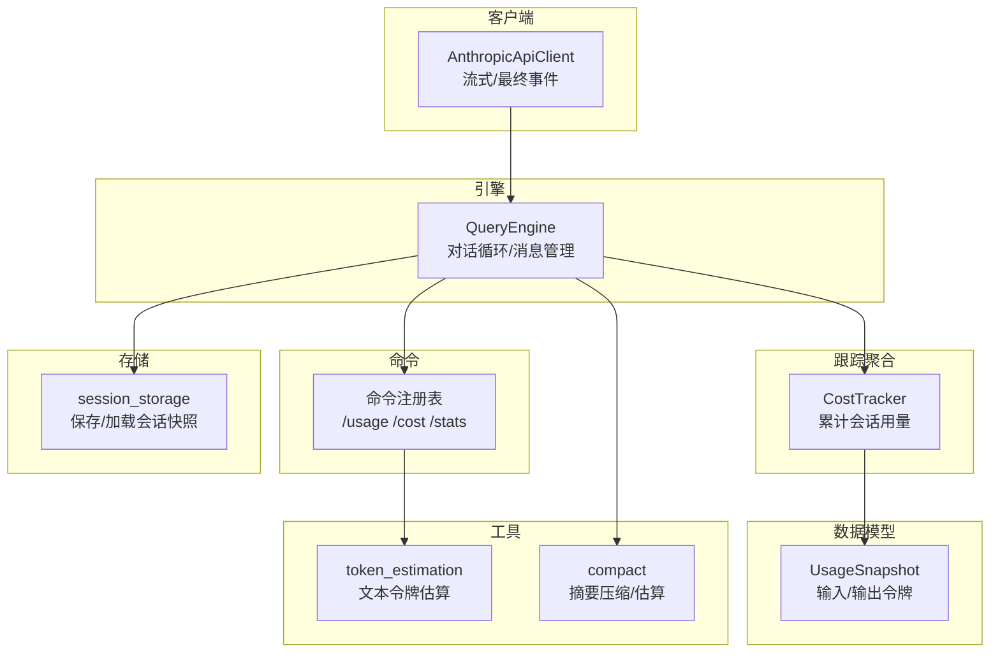
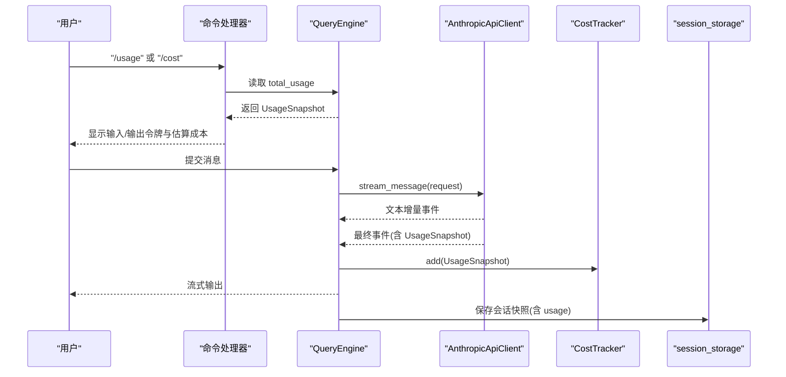
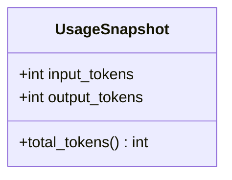
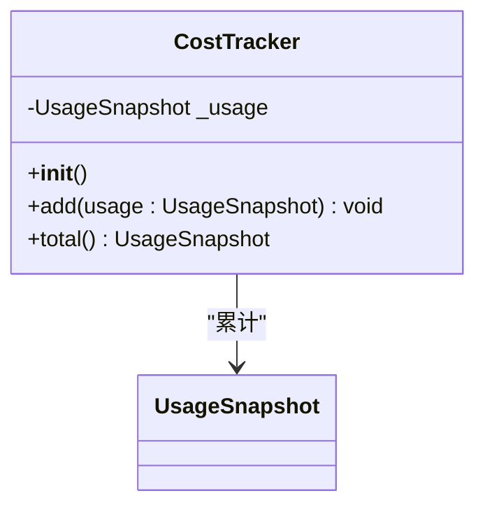
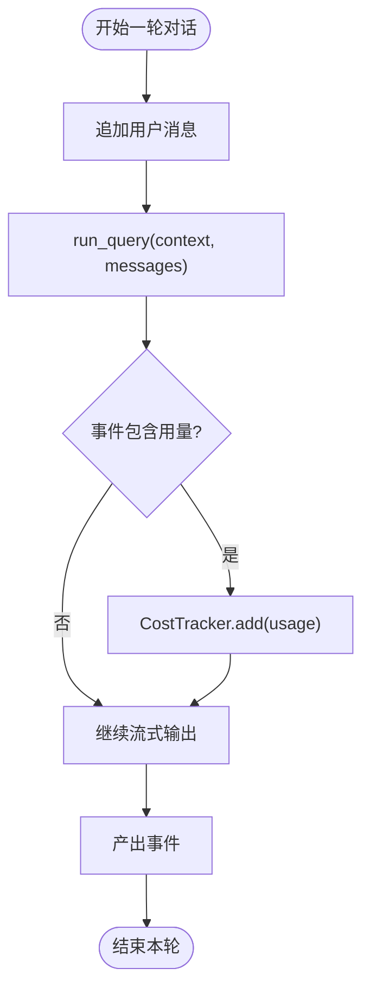
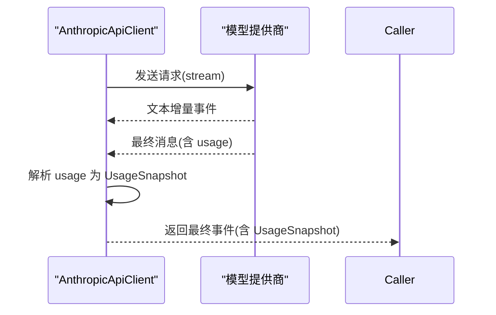
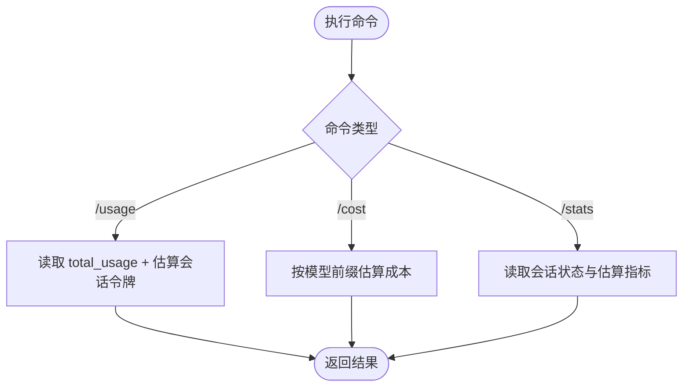
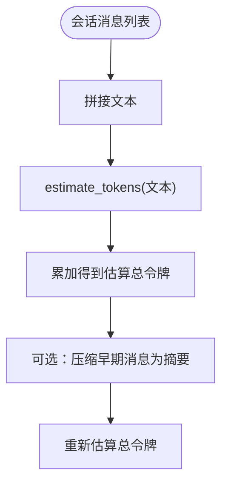
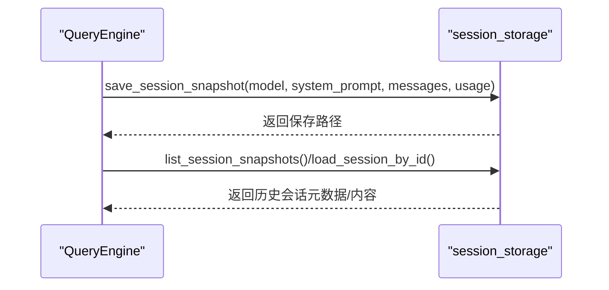
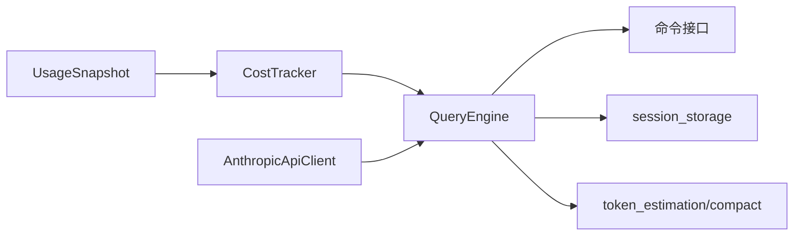

# 使用统计

<cite>
**本文引用的文件**
- [src/openharness/api/usage.py](file://src/openharness/api/usage.py)
- [src/openharness/engine/cost_tracker.py](file://src/openharness/engine/cost_tracker.py)
- [src/openharness/engine/query_engine.py](file://src/openharness/engine/query_engine.py)
- [src/openharness/api/client.py](file://src/openharness/api/client.py)
- [src/openharness/commands/registry.py](file://src/openharness/commands/registry.py)
- [src/openharness/services/token_estimation.py](file://src/openharness/services/token_estimation.py)
- [src/openharness/services/compact/__init__.py](file://src/openharness/services/compact/__init__.py)
- [src/openharness/services/session_storage.py](file://src/openharness/services/session_storage.py)
- [src/openharness/engine/messages.py](file://src/openharness/engine/messages.py)
</cite>

## 目录
1. [简介](#简介)
2. [项目结构](#项目结构)
3. [核心组件](#核心组件)
4. [架构总览](#架构总览)
5. [详细组件分析](#详细组件分析)
6. [依赖分析](#依赖分析)
7. [性能考虑](#性能考虑)
8. [故障排查指南](#故障排查指南)
9. [结论](#结论)
10. [附录](#附录)

## 简介
本文件面向 OpenHarness 的“使用统计”子系统，系统性阐述 UsageSnapshot 数据结构的设计与用途，解释输入/输出令牌的统计方式、工具调用对令牌消耗的影响、成本估算机制、以及在配额管理、性能监控、账单生成等场景中的应用。同时提供查询与分析方法（历史会话、趋势分析）及性能优化建议，并给出实际使用示例与最佳实践。

## 项目结构
使用统计相关代码主要分布在以下模块：
- 数据模型层：UsageSnapshot 定义令牌用量的最小单位
- 跟踪聚合层：CostTracker 负责会话生命周期内的累计
- 引擎层：QueryEngine 驱动对话循环并在每次响应后累加用量
- 客户端层：AnthropicApiClient 从模型返回中提取 UsageSnapshot
- 命令层：/usage、/cost、/stats 等命令用于查询当前会话统计
- 工具层：token_estimation 提供会话级粗略令牌估算；compact 提供摘要压缩与估算
- 存储层：session_storage 将 usage 持久化到会话快照

图表来源
- [src/openharness/api/usage.py:8-17](file://src/openharness/api/usage.py#L8-L17)
- [src/openharness/engine/cost_tracker.py:8-24](file://src/openharness/engine/cost_tracker.py#L8-L24)
- [src/openharness/engine/query_engine.py:18-101](file://src/openharness/engine/query_engine.py#L18-L101)
- [src/openharness/api/client.py:98-176](file://src/openharness/api/client.py#L98-L176)
- [src/openharness/commands/registry.py:267-320](file://src/openharness/commands/registry.py#L267-L320)
- [src/openharness/services/token_estimation.py:6-15](file://src/openharness/services/token_estimation.py#L6-L15)
- [src/openharness/services/compact/__init__.py:25-51](file://src/openharness/services/compact/__init__.py#L25-L51)
- [src/openharness/services/session_storage.py:26-67](file://src/openharness/services/session_storage.py#L26-L67)

章节来源
- [src/openharness/api/usage.py:1-18](file://src/openharness/api/usage.py#L1-L18)
- [src/openharness/engine/cost_tracker.py:1-25](file://src/openharness/engine/cost_tracker.py#L1-L25)
- [src/openharness/engine/query_engine.py:1-101](file://src/openharness/engine/query_engine.py#L1-L101)
- [src/openharness/api/client.py:1-186](file://src/openharness/api/client.py#L1-L186)
- [src/openharness/commands/registry.py:260-459](file://src/openharness/commands/registry.py#L260-L459)
- [src/openharness/services/token_estimation.py:1-16](file://src/openharness/services/token_estimation.py#L1-L16)
- [src/openharness/services/compact/__init__.py:1-57](file://src/openharness/services/compact/__init__.py#L1-L57)
- [src/openharness/services/session_storage.py:1-178](file://src/openharness/services/session_storage.py#L1-L178)
- [src/openharness/engine/messages.py:1-109](file://src/openharness/engine/messages.py#L1-L109)

## 核心组件
- UsageSnapshot：承载单次模型调用返回的输入/输出令牌用量，提供 total_tokens 属性汇总
- CostTracker：会话级累计器，将多次 UsageSnapshot 累加为总用量
- QueryEngine：维护消息历史与 CostTracker，每轮对话完成后累加用量
- AnthropicApiClient：从最终消息事件中提取 UsageSnapshot 并返回
- 命令接口：/usage 输出实际用量与估算；/cost 基于模型进行成本估算；/stats 展示会话概要
- 估算工具：token_estimation 提供文本级估算；compact 提供会话级估算与摘要压缩
- 会话存储：将 usage 与消息一起持久化，支持历史查询与导出

章节来源
- [src/openharness/api/usage.py:8-17](file://src/openharness/api/usage.py#L8-L17)
- [src/openharness/engine/cost_tracker.py:8-24](file://src/openharness/engine/cost_tracker.py#L8-L24)
- [src/openharness/engine/query_engine.py:50-101](file://src/openharness/engine/query_engine.py#L50-L101)
- [src/openharness/api/client.py:168-176](file://src/openharness/api/client.py#L168-L176)
- [src/openharness/commands/registry.py:267-299](file://src/openharness/commands/registry.py#L267-L299)
- [src/openharness/services/token_estimation.py:6-15](file://src/openharness/services/token_estimation.py#L6-L15)
- [src/openharness/services/compact/__init__.py:48-51](file://src/openharness/services/compact/__init__.py#L48-L51)
- [src/openharness/services/session_storage.py:26-67](file://src/openharness/services/session_storage.py#L26-L67)

## 架构总览
下图展示从模型调用到用量统计与命令查询的关键流程：

图表来源
- [src/openharness/commands/registry.py:267-299](file://src/openharness/commands/registry.py#L267-L299)
- [src/openharness/engine/query_engine.py:81-101](file://src/openharness/engine/query_engine.py#L81-L101)
- [src/openharness/api/client.py:107-176](file://src/openharness/api/client.py#L107-L176)
- [src/openharness/engine/cost_tracker.py:14-19](file://src/openharness/engine/cost_tracker.py#L14-L19)
- [src/openharness/services/session_storage.py:26-67](file://src/openharness/services/session_storage.py#L26-L67)

## 详细组件分析

### UsageSnapshot 数据结构
- 字段定义：input_tokens、output_tokens
- 计算属性：total_tokens = input_tokens + output_tokens
- 用途：作为模型提供商返回的最小统计单元，用于后续累加与成本估算

图表来源
- [src/openharness/api/usage.py:8-17](file://src/openharness/api/usage.py#L8-L17)

章节来源
- [src/openharness/api/usage.py:8-17](file://src/openharness/api/usage.py#L8-L17)

### CostTracker 累计器
- 初始化：以空 UsageSnapshot 为起点
- add：将传入 UsageSnapshot 与当前累计值逐字段相加，生成新的 UsageSnapshot
- total：返回累计结果
- 作用：在会话生命周期内累积所有轮次的用量

图表来源
- [src/openharness/engine/cost_tracker.py:8-24](file://src/openharness/engine/cost_tracker.py#L8-L24)
- [src/openharness/api/usage.py:8-17](file://src/openharness/api/usage.py#L8-L17)

章节来源
- [src/openharness/engine/cost_tracker.py:8-24](file://src/openharness/engine/cost_tracker.py#L8-L24)

### QueryEngine 对话循环与用量注入
- 维护消息列表与 CostTracker
- 每次提交消息后，运行查询循环并逐事件处理
- 当事件携带 UsageSnapshot 时，调用 CostTracker.add 进行累加
- 提供 total_usage 属性对外暴露累计用量

图表来源
- [src/openharness/engine/query_engine.py:81-101](file://src/openharness/engine/query_engine.py#L81-L101)
- [src/openharness/engine/cost_tracker.py:14-19](file://src/openharness/engine/cost_tracker.py#L14-L19)

章节来源
- [src/openharness/engine/query_engine.py:50-101](file://src/openharness/engine/query_engine.py#L50-L101)

### AnthropicApiClient 用量提取
- 在最终消息事件中提取 usage 字段
- 构造 UsageSnapshot 并随最终事件返回
- 该用量随后被 QueryEngine 接收并累加

图表来源
- [src/openharness/api/client.py:138-176](file://src/openharness/api/client.py#L138-L176)

章节来源
- [src/openharness/api/client.py:168-176](file://src/openharness/api/client.py#L168-L176)

### 命令接口：/usage、/cost、/stats
- /usage：显示实际用量（input/output）、估算会话令牌数、消息数量
- /cost：根据当前模型前缀估算成本（示例覆盖多模型），输出估算金额
- /stats：展示消息数、估算令牌、工具数、内存文件数、后台任务数、输出样式等

图表来源
- [src/openharness/commands/registry.py:267-299](file://src/openharness/commands/registry.py#L267-L299)
- [src/openharness/commands/registry.py:301-320](file://src/openharness/commands/registry.py#L301-L320)

章节来源
- [src/openharness/commands/registry.py:267-299](file://src/openharness/commands/registry.py#L267-L299)
- [src/openharness/commands/registry.py:301-320](file://src/openharness/commands/registry.py#L301-L320)

### 令牌估算与会话压缩
- token_estimation：基于字符长度的粗略估算函数，适合快速评估
- compact：将早期消息压缩为摘要，减少上下文长度，降低后续估算与成本
- estimate_conversation_tokens：对完整会话进行估算，便于容量规划

图表来源
- [src/openharness/services/token_estimation.py:6-15](file://src/openharness/services/token_estimation.py#L6-L15)
- [src/openharness/services/compact/__init__.py:25-51](file://src/openharness/services/compact/__init__.py#L25-L51)

章节来源
- [src/openharness/services/token_estimation.py:6-15](file://src/openharness/services/token_estimation.py#L6-L15)
- [src/openharness/services/compact/__init__.py:25-51](file://src/openharness/services/compact/__init__.py#L25-L51)

### 会话存储与历史查询
- 保存：将 messages 与 usage 一并写入 JSON 快照，支持 latest.json 与命名会话文件
- 加载：支持按 ID 或最新会话加载，便于回放与审计
- 导出：导出会话 Markdown，便于人工审阅与外部分析

图表来源
- [src/openharness/services/session_storage.py:26-67](file://src/openharness/services/session_storage.py#L26-L67)
- [src/openharness/services/session_storage.py:78-138](file://src/openharness/services/session_storage.py#L78-L138)
- [src/openharness/services/session_storage.py:141-154](file://src/openharness/services/session_storage.py#L141-L154)
- [src/openharness/services/session_storage.py:157-177](file://src/openharness/services/session_storage.py#L157-L177)

章节来源
- [src/openharness/services/session_storage.py:26-67](file://src/openharness/services/session_storage.py#L26-L67)
- [src/openharness/services/session_storage.py:78-138](file://src/openharness/services/session_storage.py#L78-L138)
- [src/openharness/services/session_storage.py:141-154](file://src/openharness/services/session_storage.py#L141-L154)
- [src/openharness/services/session_storage.py:157-177](file://src/openharness/services/session_storage.py#L157-L177)

## 依赖分析
- UsageSnapshot 是最小统计单元，被 CostTracker、QueryEngine、命令接口广泛使用
- CostTracker 仅依赖 UsageSnapshot，耦合度低，内聚性强
- QueryEngine 依赖 CostTracker 与 API 客户端，负责业务流程编排
- 命令接口依赖 QueryEngine 与估算工具，提供用户可见的统计视图
- 会话存储依赖 UsageSnapshot 与消息模型，用于持久化与检索

图表来源
- [src/openharness/api/usage.py:8-17](file://src/openharness/api/usage.py#L8-L17)
- [src/openharness/engine/cost_tracker.py:8-24](file://src/openharness/engine/cost_tracker.py#L8-L24)
- [src/openharness/engine/query_engine.py:18-101](file://src/openharness/engine/query_engine.py#L18-L101)
- [src/openharness/api/client.py:98-176](file://src/openharness/api/client.py#L98-L176)
- [src/openharness/commands/registry.py:267-320](file://src/openharness/commands/registry.py#L267-L320)
- [src/openharness/services/session_storage.py:26-67](file://src/openharness/services/session_storage.py#L26-L67)
- [src/openharness/services/token_estimation.py:6-15](file://src/openharness/services/token_estimation.py#L6-L15)
- [src/openharness/services/compact/__init__.py:25-51](file://src/openharness/services/compact/__init__.py#L25-L51)

章节来源
- [src/openharness/api/usage.py:8-17](file://src/openharness/api/usage.py#L8-L17)
- [src/openharness/engine/cost_tracker.py:8-24](file://src/openharness/engine/cost_tracker.py#L8-L24)
- [src/openharness/engine/query_engine.py:18-101](file://src/openharness/engine/query_engine.py#L18-L101)
- [src/openharness/api/client.py:98-176](file://src/openharness/api/client.py#L98-L176)
- [src/openharness/commands/registry.py:267-320](file://src/openharness/commands/registry.py#L267-L320)
- [src/openharness/services/session_storage.py:26-67](file://src/openharness/services/session_storage.py#L26-L67)
- [src/openharness/services/token_estimation.py:6-15](file://src/openharness/services/token_estimation.py#L6-L15)
- [src/openharness/services/compact/__init__.py:25-51](file://src/openharness/services/compact/__init__.py#L25-L51)

## 性能考虑
- 估算成本的模型映射应尽量集中管理，避免分散硬编码，便于扩展新模型
- 估算函数采用字符启发式，计算开销极低，适合频繁调用
- 会话压缩可显著降低上下文长度，从而降低估算与成本，提升吞吐
- 用量累加为纯数值运算，复杂度 O(1)，对性能影响可忽略
- 建议在高并发场景下，将会话快照写入与命令查询分离，避免阻塞对话循环

## 故障排查指南
- 用量为 0 的可能原因
  - 模型调用未返回 usage 字段
  - API 客户端解析失败或未正确传递
  - 会话刚初始化，尚未产生用量
- 成本估算为“不可用”
  - 当前模型前缀不在已知映射中
  - 建议在命令层增加默认估算或提示
- 估算不准确
  - 文本估算为近似值，工具调用、JSON 结构等未计入
  - 建议结合会话压缩与摘要，减少噪声
- 历史查询为空
  - 确认会话目录存在且有最新快照或命名快照
  - 检查权限与数据目录配置

章节来源
- [src/openharness/commands/registry.py:278-299](file://src/openharness/commands/registry.py#L278-L299)
- [src/openharness/services/session_storage.py:70-75](file://src/openharness/services/session_storage.py#L70-L75)

## 结论
OpenHarness 的使用统计体系以 UsageSnapshot 为核心，通过 CostTracker 实现会话级累计，QueryEngine 在对话循环中自动注入用量，命令接口提供即用的查询能力。配合 token_estimation 与会话压缩，系统在估算、成本控制与历史审计方面具备良好可操作性。建议在生产环境中完善模型映射与错误提示，并结合会话归档策略进行长期趋势分析。

## 附录

### 令牌计数与成本估算方法
- 输入/输出令牌区分
  - 输入令牌：来自用户消息、系统提示、工具调用参数等
  - 输出令牌：来自模型回复、工具结果等
- 工具调用的令牌消耗
  - 工具调用本身由模型决定是否计入，若返回中包含 usage，则计入 output_tokens
  - 建议在工具执行前后分别记录消息，以便更精细地追踪
- 成本估算
  - 基于模型前缀的固定单价估算（示例覆盖多模型）
  - 单价以每百万令牌为单位，注意保留足够小数位以避免误差累积

章节来源
- [src/openharness/commands/registry.py:278-299](file://src/openharness/commands/registry.py#L278-L299)
- [src/openharness/api/client.py:168-176](file://src/openharness/api/client.py#L168-L176)

### 应用场景
- 配额管理
  - 通过 /usage 与 /stats 动态监控当前会话用量与资源占用
- 性能监控
  - 结合会话压缩与估算，观察上下文长度变化与成本波动
- 账单生成
  - 以累计 input/output 令牌为基础，按模型映射计算总费用

章节来源
- [src/openharness/commands/registry.py:267-320](file://src/openharness/commands/registry.py#L267-L320)
- [src/openharness/services/compact/__init__.py:25-51](file://src/openharness/services/compact/__init__.py#L25-L51)

### 查询与分析方法
- 历史会话查询
  - 使用 /resume 列出会话快照，按时间排序
  - 使用 /session ls 查看会话目录文件
- 趋势分析
  - 导出 Markdown 会话转录，结合外部工具进行统计
  - 周期性导出会话快照，形成时间序列数据

章节来源
- [src/openharness/commands/registry.py:360-409](file://src/openharness/commands/registry.py#L360-L409)
- [src/openharness/commands/registry.py:428-459](file://src/openharness/commands/registry.py#L428-L459)
- [src/openharness/services/session_storage.py:157-177](file://src/openharness/services/session_storage.py#L157-L177)

### 实际使用示例
- 查看当前会话用量与估算
  - 执行 /usage，输出包含实际 input/output 令牌、估算会话令牌与消息数量
- 估算当前会话成本
  - 执行 /cost，根据当前模型前缀计算估算金额
- 会话归档与导出
  - 执行 /session tag <名称> 保存带标签的会话快照
  - 执行 /export 或 /share 导出会话 Markdown

章节来源
- [src/openharness/commands/registry.py:267-299](file://src/openharness/commands/registry.py#L267-L299)
- [src/openharness/commands/registry.py:428-459](file://src/openharness/commands/registry.py#L428-L459)
- [src/openharness/services/session_storage.py:157-177](file://src/openharness/services/session_storage.py#L157-L177)