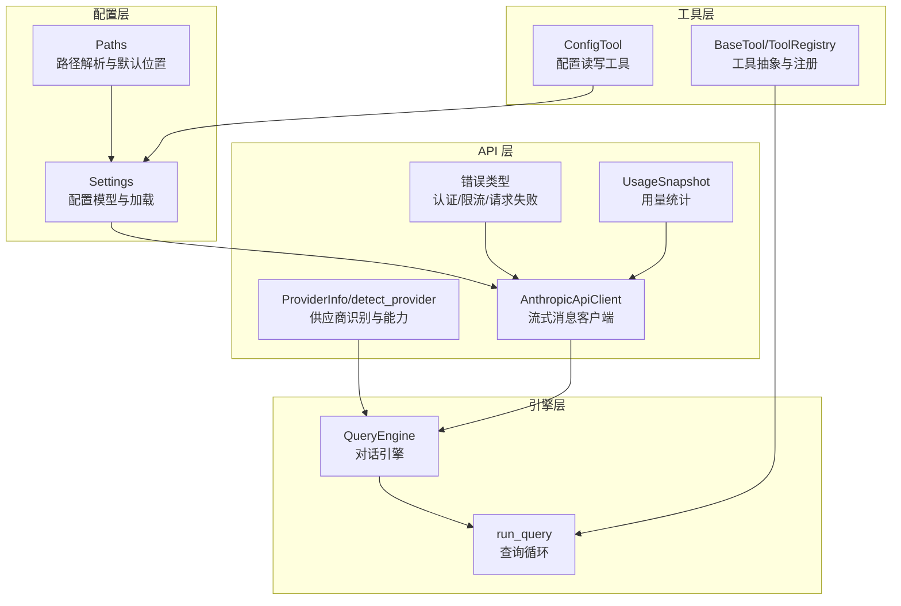
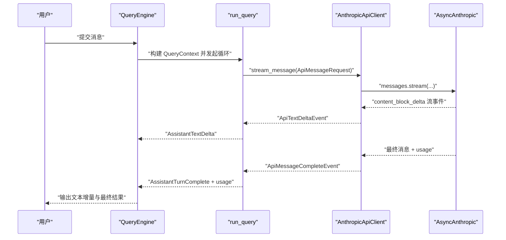
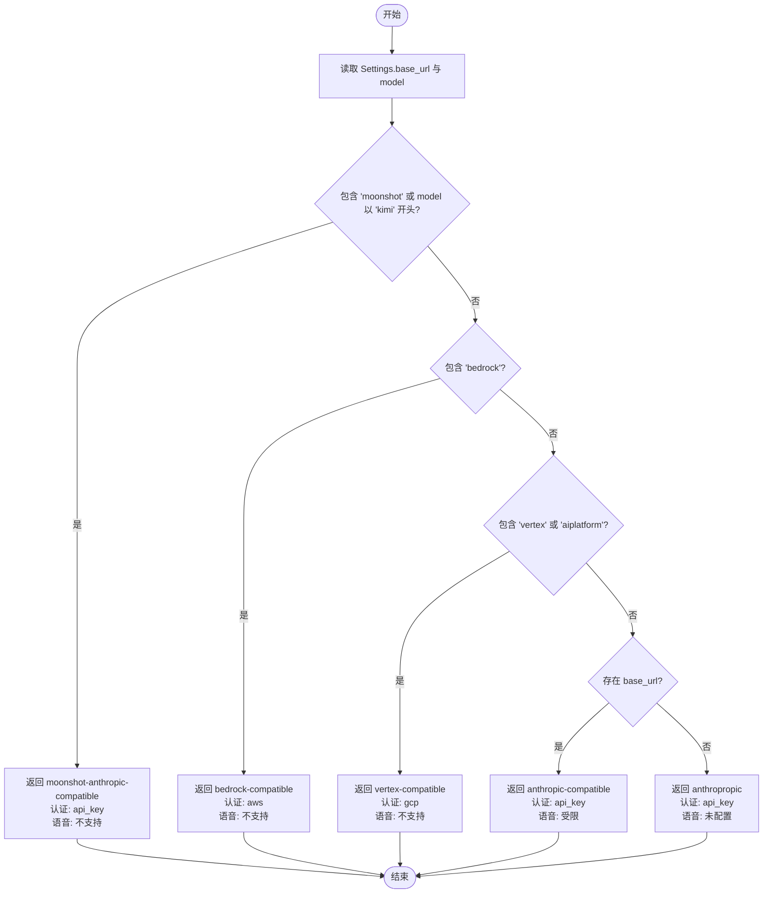
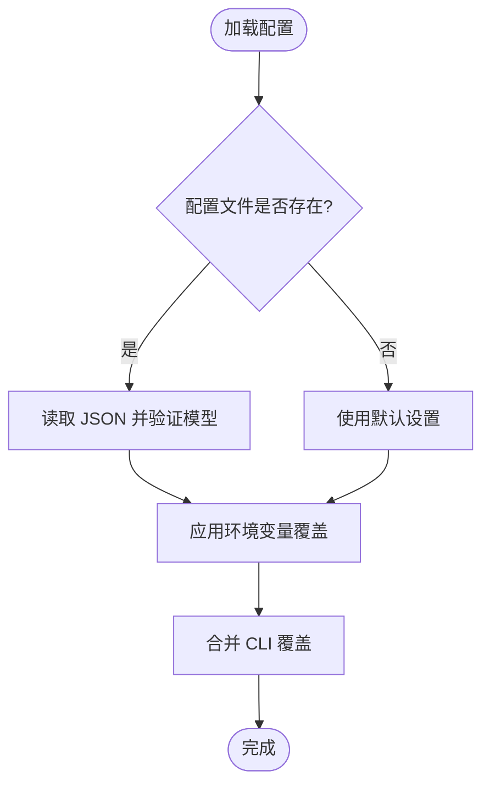
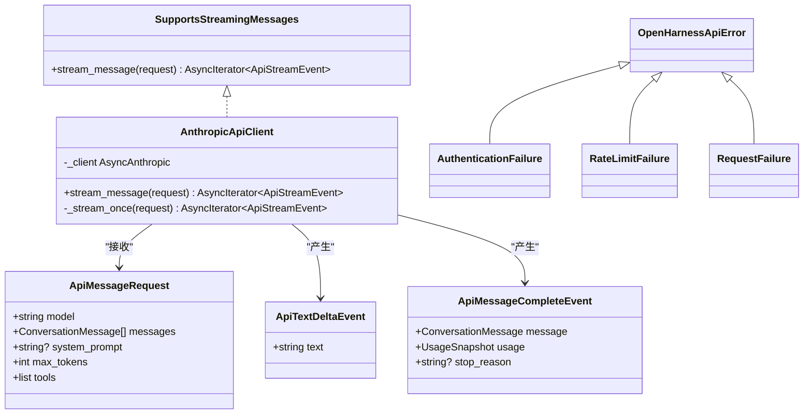
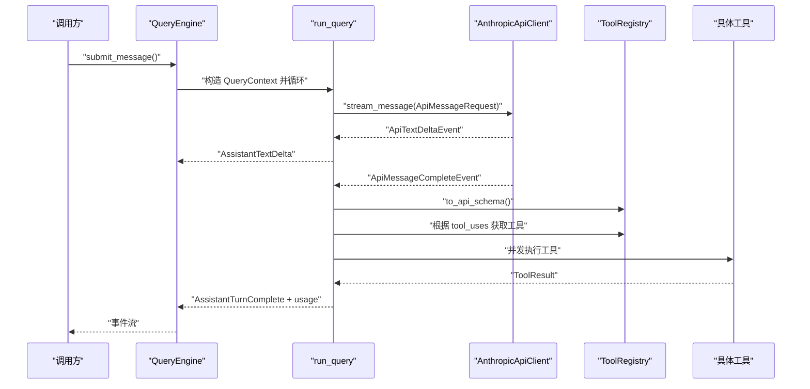
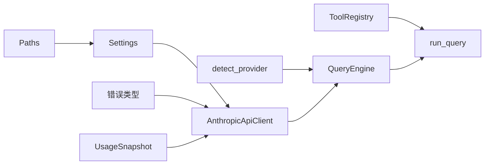

# 供应商集成

<cite>
**本文引用的文件**
- [src/openharness/api/provider.py](file://src/openharness/api/provider.py)
- [src/openharness/api/client.py](file://src/openharness/api/client.py)
- [src/openharness/api/__init__.py](file://src/openharness/api/__init__.py)
- [src/openharness/api/errors.py](file://src/openharness/api/errors.py)
- [src/openharness/api/usage.py](file://src/openharness/api/usage.py)
- [src/openharness/config/settings.py](file://src/openharness/config/settings.py)
- [src/openharness/config/paths.py](file://src/openharness/config/paths.py)
- [src/openharness/engine/query_engine.py](file://src/openharness/engine/query_engine.py)
- [src/openharness/engine/query.py](file://src/openharness/engine/query.py)
- [src/openharness/tools/base.py](file://src/openharness/tools/base.py)
- [src/openharness/mcp/config.py](file://src/openharness/mcp/config.py)
- [src/openharness/mcp/client.py](file://src/openharness/mcp/client.py)
- [src/openharness/tools/config_tool.py](file://src/openharness/tools/config_tool.py)
</cite>

## 目录
1. [简介](#简介)
2. [项目结构](#项目结构)
3. [核心组件](#核心组件)
4. [架构总览](#架构总览)
5. [详细组件分析](#详细组件分析)
6. [依赖分析](#依赖分析)
7. [性能考虑](#性能考虑)
8. [故障排查指南](#故障排查指南)
9. [结论](#结论)
10. [附录](#附录)

## 简介
本文件面向 OpenHarness 的供应商集成系统，聚焦“供应商适配器”的设计与实现，解释如何通过统一接口适配不同 LLM 供应商（如 Anthropic、兼容其协议的平台），以及在不改变上层调用逻辑的前提下实现“供应商切换”。文档涵盖以下主题：
- 供应商识别与能力推断
- 配置管理与优先级
- 客户端工厂与接口标准化
- 供应商特定功能支持（模型列表、认证方式、API 特性）
- 扩展方法：新增供应商、修改现有供应商
- 最佳实践：配置模板、错误处理、性能优化
- 实际示例与迁移指南

## 项目结构
OpenHarness 将“供应商适配”抽象为一组清晰的模块：
- 配置层：Settings 提供统一的配置模型与加载策略；路径解析模块提供 XDG 风格的目录约定
- API 层：提供供应商信息检测、错误类型、用量统计与客户端封装
- 引擎层：查询引擎与查询循环负责消息流式传输、工具调用与权限控制
- 工具层：通用工具抽象与具体工具（如配置读写工具）

图表来源
- [src/openharness/config/settings.py:49-96](file://src/openharness/config/settings.py#L49-L96)
- [src/openharness/config/paths.py:15-68](file://src/openharness/config/paths.py#L15-L68)
- [src/openharness/api/provider.py:20-57](file://src/openharness/api/provider.py#L20-L57)
- [src/openharness/api/errors.py:6-19](file://src/openharness/api/errors.py#L6-L19)
- [src/openharness/api/usage.py:8-17](file://src/openharness/api/usage.py#L8-L17)
- [src/openharness/api/client.py:98-186](file://src/openharness/api/client.py#L98-L186)
- [src/openharness/engine/query_engine.py:18-101](file://src/openharness/engine/query_engine.py#L18-L101)
- [src/openharness/engine/query.py:53-122](file://src/openharness/engine/query.py#L53-L122)
- [src/openharness/tools/base.py:30-76](file://src/openharness/tools/base.py#L30-L76)
- [src/openharness/tools/config_tool.py:19-37](file://src/openharness/tools/config_tool.py#L19-L37)

章节来源
- [src/openharness/config/settings.py:1-161](file://src/openharness/config/settings.py#L1-L161)
- [src/openharness/config/paths.py:1-117](file://src/openharness/config/paths.py#L1-L117)
- [src/openharness/api/provider.py:1-66](file://src/openharness/api/provider.py#L1-L66)
- [src/openharness/api/client.py:1-186](file://src/openharness/api/client.py#L1-L186)
- [src/openharness/api/errors.py:1-20](file://src/openharness/api/errors.py#L1-L20)
- [src/openharness/api/usage.py:1-18](file://src/openharness/api/usage.py#L1-L18)
- [src/openharness/engine/query_engine.py:1-101](file://src/openharness/engine/query_engine.py#L1-L101)
- [src/openharness/engine/query.py:1-212](file://src/openharness/engine/query.py#L1-L212)
- [src/openharness/tools/base.py:1-76](file://src/openharness/tools/base.py#L1-L76)
- [src/openharness/tools/config_tool.py:1-37](file://src/openharness/tools/config_tool.py#L1-L37)

## 核心组件
- 供应商识别与能力推断
  - 通过 Settings 中的 base_url 与 model 推断当前供应商类型与认证方式，并返回 ProviderInfo 以供 UI 和诊断使用
- 配置管理
  - Settings 提供多源合并：CLI 覆盖 > 环境变量 > 配置文件 > 默认值；并提供保存/加载
  - 路径解析遵循 XDG 风格，支持环境变量覆盖
- 客户端封装
  - AnthropicApiClient 封装异步 SDK，提供流式消息接口与重试逻辑；统一错误类型映射
- 查询引擎
  - QueryEngine 作为会话与工具循环的编排者；run_query 负责消息流、工具调用与权限校验
- 工具系统
  - BaseTool/ToolRegistry 提供工具注册与 API Schema 导出；ConfigTool 支持运行时读取/更新配置

章节来源
- [src/openharness/api/provider.py:20-64](file://src/openharness/api/provider.py#L20-L64)
- [src/openharness/config/settings.py:49-161](file://src/openharness/config/settings.py#L49-L161)
- [src/openharness/config/paths.py:15-68](file://src/openharness/config/paths.py#L15-L68)
- [src/openharness/api/client.py:98-186](file://src/openharness/api/client.py#L98-L186)
- [src/openharness/engine/query_engine.py:18-101](file://src/openharness/engine/query_engine.py#L18-L101)
- [src/openharness/engine/query.py:53-122](file://src/openharness/engine/query.py#L53-L122)
- [src/openharness/tools/base.py:30-76](file://src/openharness/tools/base.py#L30-L76)
- [src/openharness/tools/config_tool.py:19-37](file://src/openharness/tools/config_tool.py#L19-L37)

## 架构总览
OpenHarness 的供应商集成采用“接口标准化 + 供应商适配器”的模式：
- 上层仅依赖 SupportsStreamingMessages 协议与 QueryContext，屏蔽底层供应商差异
- 供应商适配器（如 AnthropicApiClient）负责将统一请求转换为具体 SDK 调用，并进行错误翻译与重试
- 配置层集中管理 API Key、模型、基础地址等参数，支持环境变量与配置文件注入

图表来源
- [src/openharness/engine/query_engine.py:81-101](file://src/openharness/engine/query_engine.py#L81-L101)
- [src/openharness/engine/query.py:62-83](file://src/openharness/engine/query.py#L62-L83)
- [src/openharness/api/client.py:107-177](file://src/openharness/api/client.py#L107-L177)

## 详细组件分析

### 供应商识别与能力推断（ProviderInfo/detect_provider）
- 输入：Settings（含 base_url 与 model）
- 输出：ProviderInfo（name、auth_kind、voice_supported、voice_reason）
- 识别规则：
  - Moonshot/Kimi：moonshot-anthropic-compatible，api_key 认证，语音不可用
  - AWS Bedrock：bedrock-compatible，aws 认证，语音不可用
  - GCP Vertex/AI Platform：vertex-compatible，gcp 认证，语音不可用
  - 自定义 base_url：anthropic-compatible，api_key 认证，语音受限
  - 默认：anthropic，api_key 认证，语音未配置
- 认证状态：auth_status 返回“configured”或“missing”

图表来源
- [src/openharness/api/provider.py:20-57](file://src/openharness/api/provider.py#L20-L57)

章节来源
- [src/openharness/api/provider.py:10-64](file://src/openharness/api/provider.py#L10-L64)

### 配置管理（Settings 与路径解析）
- 多源合并优先级：CLI > 环境变量 > 配置文件 > 默认值
- 关键字段：api_key、model、max_tokens、base_url、system_prompt、权限与插件配置、UI 行为等
- 环境变量覆盖：支持 ANTHROPIC_* 与 OPENHARNESS_* 前缀
- 路径解析：支持 OPENHARNESS_CONFIG_DIR、OPENHARNESS_DATA_DIR、OPENHARNESS_LOGS_DIR 等环境变量
- 保存/加载：自动创建目录，序列化为 JSON

图表来源
- [src/openharness/config/settings.py:123-141](file://src/openharness/config/settings.py#L123-L141)
- [src/openharness/config/paths.py:15-68](file://src/openharness/config/paths.py#L15-L68)

章节来源
- [src/openharness/config/settings.py:49-161](file://src/openharness/config/settings.py#L49-L161)
- [src/openharness/config/paths.py:15-117](file://src/openharness/config/paths.py#L15-L117)

### 客户端工厂与接口标准化（AnthropicApiClient 与 SupportsStreamingMessages）
- 接口协议：SupportsStreamingMessages，统一 stream_message(request) 的签名
- 请求对象：ApiMessageRequest（model、messages、system_prompt、max_tokens、tools）
- 事件对象：ApiTextDeltaEvent（增量文本）、ApiMessageCompleteEvent（完整消息+usage+stop_reason）
- 错误类型：OpenHarnessApiError 及其子类（认证失败、限流、请求失败）
- 重试策略：指数退避 + 抖动，尊重 Retry-After，可重试状态码集合
- 使用场景：QueryEngine 通过 SupportsStreamingMessages 与 run_query 解耦具体供应商

图表来源
- [src/openharness/api/client.py:60-186](file://src/openharness/api/client.py#L60-L186)
- [src/openharness/api/errors.py:6-19](file://src/openharness/api/errors.py#L6-L19)
- [src/openharness/api/usage.py:8-17](file://src/openharness/api/usage.py#L8-L17)

章节来源
- [src/openharness/api/client.py:60-186](file://src/openharness/api/client.py#L60-L186)
- [src/openharness/api/errors.py:1-20](file://src/openharness/api/errors.py#L1-L20)
- [src/openharness/api/usage.py:1-18](file://src/openharness/api/usage.py#L1-L18)
- [src/openharness/api/__init__.py:4-11](file://src/openharness/api/__init__.py#L4-L11)

### 查询引擎与工具调用（QueryEngine 与 run_query）
- QueryEngine 持有 SupportsStreamingMessages 实例、工具注册表、权限检查器等
- run_query 将消息发送至供应商，逐轮消费流式事件，遇到工具调用则并发执行工具并回传结果
- 权限与钩子：在工具调用前后执行钩子与权限决策，支持交互确认

图表来源
- [src/openharness/engine/query_engine.py:81-101](file://src/openharness/engine/query_engine.py#L81-L101)
- [src/openharness/engine/query.py:53-122](file://src/openharness/engine/query.py#L53-L122)
- [src/openharness/tools/base.py:55-76](file://src/openharness/tools/base.py#L55-L76)

章节来源
- [src/openharness/engine/query_engine.py:18-101](file://src/openharness/engine/query_engine.py#L18-L101)
- [src/openharness/engine/query.py:53-212](file://src/openharness/engine/query.py#L53-L212)
- [src/openharness/tools/base.py:30-76](file://src/openharness/tools/base.py#L30-L76)

### 供应商特定功能支持
- 模型列表获取：当前实现未提供通用模型列表 API；可通过供应商 SDK 或外部脚本补充
- 认证方式：基于 detect_provider 的识别结果，分别对应 api_key、aws、gcp 等认证路径
- API 特性：流式文本增量、最终消息与用量统计；错误映射到统一异常类型

章节来源
- [src/openharness/api/provider.py:20-57](file://src/openharness/api/provider.py#L20-L57)
- [src/openharness/api/client.py:107-177](file://src/openharness/api/client.py#L107-L177)
- [src/openharness/api/errors.py:10-19](file://src/openharness/api/errors.py#L10-L19)

### 扩展方法：新增供应商与修改现有供应商
- 新增供应商步骤
  1) 定义新的供应商适配器类，实现 SupportsStreamingMessages 协议
  2) 在 detect_provider 中增加识别规则，返回对应的 ProviderInfo
  3) 在配置层支持新供应商的环境变量或配置项
  4) 在需要的地方（如 UI、MCP 配置）适配新认证方式
- 修改现有供应商
  - 若需变更认证方式或基础地址，调整 Settings 字段与环境变量映射
  - 若需扩展错误类型，新增子类并更新错误翻译逻辑

章节来源
- [src/openharness/api/provider.py:20-57](file://src/openharness/api/provider.py#L20-L57)
- [src/openharness/config/settings.py:99-120](file://src/openharness/config/settings.py#L99-L120)
- [src/openharness/api/client.py:179-186](file://src/openharness/api/client.py#L179-L186)

### MCP 服务器与供应商集成的协同
- MCP 服务器配置从 Settings 与插件中合并，支持 HTTP 与 STDIO 两种传输
- 连接成功后记录工具与资源清单，失败时记录详细错误
- 与供应商认证解耦：MCP 认证通常通过环境变量或请求头注入

章节来源
- [src/openharness/mcp/config.py:8-16](file://src/openharness/mcp/config.py#L8-L16)
- [src/openharness/mcp/client.py:129-174](file://src/openharness/mcp/client.py#L129-L174)

## 依赖分析
- 组件内聚与耦合
  - QueryEngine 与 run_query 通过 SupportsStreamingMessages 与 ToolRegistry 解耦
  - API 层与配置层通过 Settings 解耦，便于替换供应商与配置来源
- 外部依赖
  - AsyncAnthropic SDK 用于流式消息；错误类型映射到统一异常体系
- 循环依赖
  - 当前模块间无明显循环依赖

图表来源
- [src/openharness/config/settings.py:49-96](file://src/openharness/config/settings.py#L49-L96)
- [src/openharness/config/paths.py:15-68](file://src/openharness/config/paths.py#L15-L68)
- [src/openharness/api/provider.py:20-57](file://src/openharness/api/provider.py#L20-L57)
- [src/openharness/api/client.py:98-186](file://src/openharness/api/client.py#L98-L186)
- [src/openharness/engine/query_engine.py:18-101](file://src/openharness/engine/query_engine.py#L18-L101)
- [src/openharness/engine/query.py:53-122](file://src/openharness/engine/query.py#L53-L122)
- [src/openharness/api/errors.py:6-19](file://src/openharness/api/errors.py#L6-L19)
- [src/openharness/api/usage.py:8-17](file://src/openharness/api/usage.py#L8-L17)

章节来源
- [src/openharness/config/settings.py:49-161](file://src/openharness/config/settings.py#L49-L161)
- [src/openharness/api/client.py:98-186](file://src/openharness/api/client.py#L98-L186)
- [src/openharness/engine/query_engine.py:18-101](file://src/openharness/engine/query_engine.py#L18-L101)
- [src/openharness/engine/query.py:53-122](file://src/openharness/engine/query.py#L53-L122)

## 性能考虑
- 流式传输：优先使用流式事件减少首字节延迟，提升交互体验
- 重试策略：指数退避 + 抖动降低雪崩风险；尊重 Retry-After
- 并发工具：多工具调用并发执行，但注意避免过度并发导致上游限流
- 用量统计：结合 UsageSnapshot 进行成本控制与预算预警
- 配置缓存：路径解析与配置加载结果可在进程内复用，避免重复 IO

## 故障排查指南
- 认证失败
  - 确认 ANTHROPIC_API_KEY 或 OPENHARNESS_BASE_URL 等环境变量是否正确
  - 使用 auth_status 判断认证状态
- 速率限制
  - 观察限流错误类型，适当降低并发或增加退避时间
- 请求失败
  - 检查网络连通性与代理设置；查看日志中的状态码与重试次数
- 供应商识别异常
  - 检查 base_url 与 model 是否符合识别规则；必要时显式设置 base_url

章节来源
- [src/openharness/api/provider.py:60-64](file://src/openharness/api/provider.py#L60-L64)
- [src/openharness/api/errors.py:10-19](file://src/openharness/api/errors.py#L10-L19)
- [src/openharness/api/client.py:67-95](file://src/openharness/api/client.py#L67-L95)

## 结论
OpenHarness 的供应商集成通过“接口标准化 + 供应商适配器 + 配置中心”的组合，实现了对不同 LLM 供应商的平滑接入与切换。借助统一的流式消息协议、完善的错误类型与重试策略、以及可扩展的工具系统，系统既保证了易用性，也为后续扩展新供应商提供了清晰路径。

## 附录

### 配置模板与最佳实践
- 配置模板（字段说明）
  - api_key：供应商 API 密钥（优先使用环境变量）
  - model：模型名称（如 claude-sonnet-4-20250514）
  - base_url：供应商基础地址（用于识别供应商与兼容性）
  - max_tokens：单次最大生成长度
  - system_prompt：系统提示词
  - permission：权限模式与工具白名单
  - enabled_plugins：启用的插件
  - mcp_servers：MCP 服务器配置（HTTP/STDIO）
  - UI 相关：theme、output_style、vim_mode、voice_mode、fast_mode、effort、passes、verbose
- 最佳实践
  - 使用环境变量管理敏感信息，避免硬编码
  - 通过配置文件集中管理非敏感参数，便于团队共享
  - 对于高并发场景，合理设置 max_tokens 与并发度，避免触发限流
  - 定期检查 UsageSnapshot，建立成本监控告警

章节来源
- [src/openharness/config/settings.py:49-96](file://src/openharness/config/settings.py#L49-L96)
- [src/openharness/tools/config_tool.py:26-37](file://src/openharness/tools/config_tool.py#L26-L37)

### 实际示例与迁移指南
- 示例：切换到 Moonshot/Kimi 兼容供应商
  - 设置 base_url 包含 “moonshot”，或 model 以 “kimi” 开头
  - 使用 api_key 认证；语音功能不可用
- 示例：切换到 AWS Bedrock
  - 设置 base_url 包含 “bedrock”
  - 使用 aws 认证；语音功能不可用
- 示例：切换到 GCP Vertex
  - 设置 base_url 包含 “vertex” 或 “aiplatform”
  - 使用 gcp 认证；语音功能不可用
- 示例：自定义基础地址
  - 设置 base_url 为任意值，进入 anthropic-compatible 分支
  - 使用 api_key 认证；语音受限
- 迁移步骤
  - 在配置文件中更新 base_url 与 model
  - 更新认证凭据（API Key/云厂商密钥）
  - 如需工具或语音功能，评估供应商支持情况并调整配置

章节来源
- [src/openharness/api/provider.py:20-57](file://src/openharness/api/provider.py#L20-L57)
- [src/openharness/config/settings.py:102-116](file://src/openharness/config/settings.py#L102-L116)