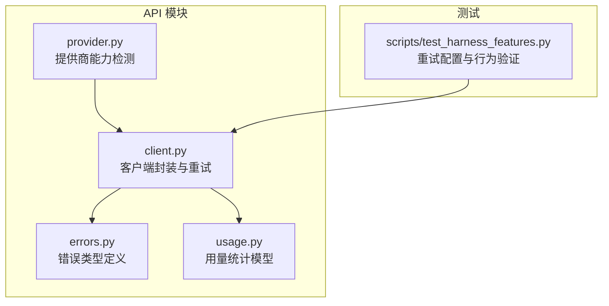
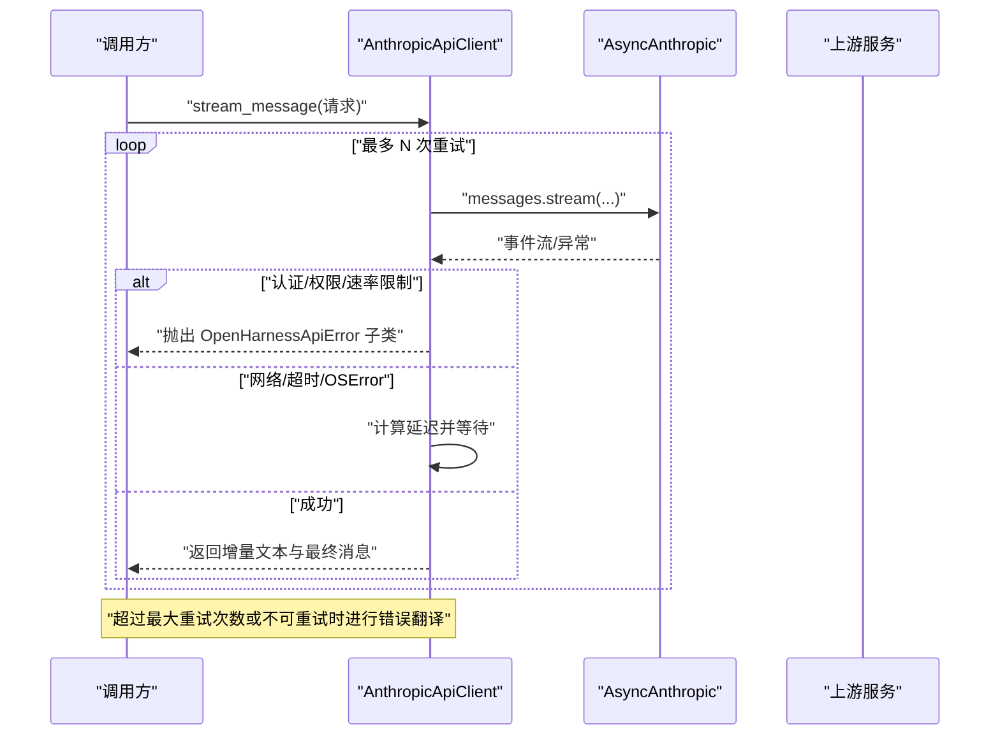
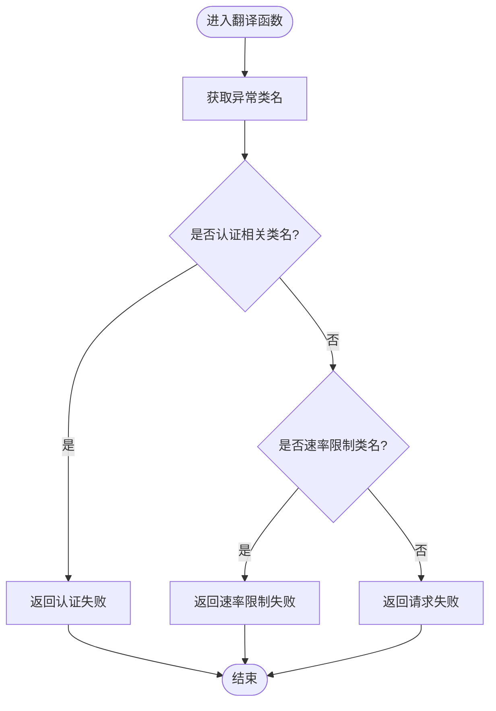
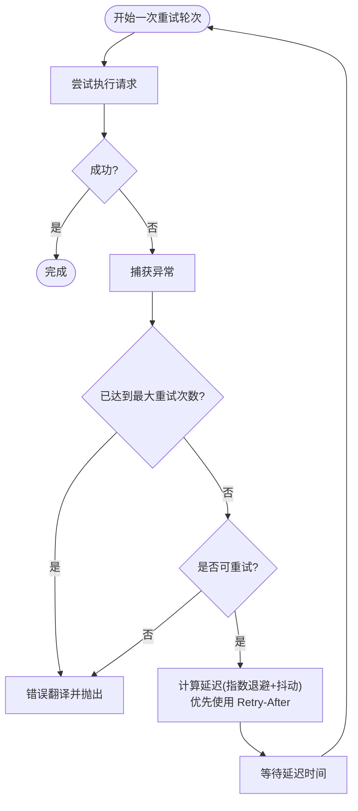
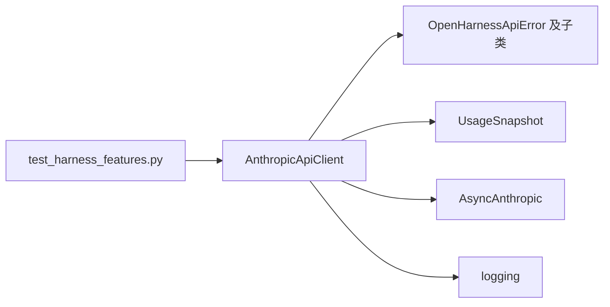

# 错误处理

<cite>
**本文引用的文件**
- [src/openharness/api/errors.py](file://src/openharness/api/errors.py)
- [src/openharness/api/client.py](file://src/openharness/api/client.py)
- [src/openharness/api/provider.py](file://src/openharness/api/provider.py)
- [src/openharness/api/usage.py](file://src/openharness/api/usage.py)
- [scripts/test_harness_features.py](file://scripts/test_harness_features.py)
</cite>

## 目录
1. [简介](#简介)
2. [项目结构](#项目结构)
3. [核心组件](#核心组件)
4. [架构总览](#架构总览)
5. [详细组件分析](#详细组件分析)
6. [依赖关系分析](#依赖关系分析)
7. [性能考量](#性能考量)
8. [故障排除指南](#故障排除指南)
9. [结论](#结论)
10. [附录](#附录)

## 简介
本文件系统性梳理 OpenHarness 的 API 错误处理体系，覆盖错误类型分类、错误翻译机制、重试逻辑（含指数退避与抖动）、可重试错误判定、最佳实践以及故障排除方法。目标是帮助开发者在面对上游服务不稳定或网络波动时，能够稳定地进行重试、正确识别错误类别，并向用户提供清晰的反馈。

## 项目结构
与错误处理直接相关的核心文件位于 openharness/api 子模块中，分别定义了错误类型、客户端封装与重试策略、提供商能力检测，以及用量统计模型。测试脚本对重试配置进行了验证。

**图表来源**
- [src/openharness/api/errors.py:1-20](file://src/openharness/api/errors.py#L1-L20)
- [src/openharness/api/client.py:1-186](file://src/openharness/api/client.py#L1-L186)
- [src/openharness/api/provider.py:1-66](file://src/openharness/api/provider.py#L1-L66)
- [src/openharness/api/usage.py:1-18](file://src/openharness/api/usage.py#L1-L18)
- [scripts/test_harness_features.py:46-76](file://scripts/test_harness_features.py#L46-L76)

**章节来源**
- [src/openharness/api/errors.py:1-20](file://src/openharness/api/errors.py#L1-L20)
- [src/openharness/api/client.py:1-186](file://src/openharness/api/client.py#L1-L186)
- [src/openharness/api/provider.py:1-66](file://src/openharness/api/provider.py#L1-L66)
- [src/openharness/api/usage.py:1-18](file://src/openharness/api/usage.py#L1-L18)
- [scripts/test_harness_features.py:46-76](file://scripts/test_harness_features.py#L46-L76)

## 核心组件
- 错误类型定义：统一抽象上游 API 失败，派生出认证失败、速率限制、通用请求失败三类，便于上层区分处理。
- 客户端封装与重试：围绕异步 SDK 封装，内置指数退避+抖动的重试策略，支持基于状态码与异常类型的可重试判定，并在达到上限或不可重试时进行错误翻译。
- 错误翻译：将底层 API 异常映射到 OpenHarness 内部错误类型，确保对外暴露一致的错误语义。
- 提供商能力检测：根据配置推断当前提供商与鉴权方式，辅助定位鉴权相关问题。
- 用量统计模型：承载输入/输出 token 统计，用于错误后的资源消耗追踪与展示。

**章节来源**
- [src/openharness/api/errors.py:6-20](file://src/openharness/api/errors.py#L6-L20)
- [src/openharness/api/client.py:98-186](file://src/openharness/api/client.py#L98-L186)
- [src/openharness/api/provider.py:20-66](file://src/openharness/api/provider.py#L20-L66)
- [src/openharness/api/usage.py:8-18](file://src/openharness/api/usage.py#L8-L18)

## 架构总览
下图展示了从调用方到上游 API 的完整流程，重点标注了错误分类、翻译与重试的关键节点。

**图表来源**
- [src/openharness/api/client.py:107-137](file://src/openharness/api/client.py#L107-L137)
- [src/openharness/api/client.py:179-185](file://src/openharness/api/client.py#L179-L185)

## 详细组件分析

### 错误类型与分类
- 基类：OpenHarnessApiError，作为所有上游 API 失败的统一根类型。
- 认证失败：AuthenticationFailure，用于上游拒绝凭据的场景。
- 速率限制：RateLimitFailure，用于触发配额/速率限制的场景。
- 请求失败：RequestFailure，用于通用传输/请求失败。

这些类型为上层提供了明确的错误语义，便于区分“需要用户干预”的认证问题与“稍后重试即可”的临时性错误。

**章节来源**
- [src/openharness/api/errors.py:6-20](file://src/openharness/api/errors.py#L6-L20)

### 错误翻译机制
- 翻译函数会根据底层异常类名进行分类：
  - 认证相关类名映射为认证失败；
  - 速率限制类名映射为速率限制失败；
  - 其他异常映射为通用请求失败。
- 这一机制确保无论底层 SDK 抛出何种异常，上层都能得到一致的内部错误类型，便于统一处理与提示。

**图表来源**
- [src/openharness/api/client.py:179-185](file://src/openharness/api/client.py#L179-L185)

**章节来源**
- [src/openharness/api/client.py:179-185](file://src/openharness/api/client.py#L179-L185)

### 重试逻辑与指数退避
- 最大重试次数：固定为 3 次。
- 指数退避：基础延迟 1 秒，每次翻倍；最大延迟 30 秒。
- 抖动：在当前延迟基础上加入不超过 25% 的随机抖动，降低“惊群效应”。
- Retry-After 头：若底层状态错误包含该头且可解析，则优先采用其值，但不超过最大延迟。
- 可重试判定：
  - 对于状态错误：仅当状态码属于预设集合（如 429、500、502、503、529）时才重试；
  - 对于网络错误：APIError、连接错误、超时、系统错误均视为可重试；
  - 对于认证/权限/速率限制等错误：不进行重试，直接抛出对应内部错误类型。

**图表来源**
- [src/openharness/api/client.py:67-95](file://src/openharness/api/client.py#L67-L95)
- [src/openharness/api/client.py:107-137](file://src/openharness/api/client.py#L107-L137)

**章节来源**
- [src/openharness/api/client.py:23-28](file://src/openharness/api/client.py#L23-L28)
- [src/openharness/api/client.py:67-95](file://src/openharness/api/client.py#L67-L95)
- [src/openharness/api/client.py:107-137](file://src/openharness/api/client.py#L107-L137)

### 可重试错误的判断标准
- 状态错误：仅当状态码在预设集合内才重试；
- 网络错误：APIError、连接错误、超时、系统错误；
- 认证/权限/速率限制：不重试，直接抛出对应内部错误类型；
- 其他异常：按通用请求失败处理。

上述规则保证了对瞬时性错误的自动恢复，同时避免对需要人工介入或永久性失败的错误进行无意义重试。

**章节来源**
- [src/openharness/api/client.py:67-75](file://src/openharness/api/client.py#L67-L75)
- [src/openharness/api/client.py:116-123](file://src/openharness/api/client.py#L116-L123)

### 用量统计与错误关联
- 用量统计模型用于记录输入/输出 token，便于在错误发生后仍能保留资源消耗数据，支撑后续计费与审计。
- 在成功路径中，客户端会从最终消息中提取用量并封装为快照；错误路径则不会更新用量。

**章节来源**
- [src/openharness/api/usage.py:8-18](file://src/openharness/api/usage.py#L8-L18)
- [src/openharness/api/client.py:168-176](file://src/openharness/api/client.py#L168-L176)

### 提供商能力检测与鉴权状态
- 提供商检测：根据配置中的基础地址与模型名称推断提供商类型与鉴权方式，辅助定位鉴权失败问题。
- 鉴权状态：提供简洁的“已配置/缺失”状态字符串，便于 UI 展示与诊断。

**章节来源**
- [src/openharness/api/provider.py:20-66](file://src/openharness/api/provider.py#L20-L66)

## 依赖关系分析
- AnthropicApiClient 依赖：
  - 错误类型：用于抛出与区分不同错误；
  - 用量模型：用于产出最终用量快照；
  - 上游 SDK：异步消息流接口；
  - 日志：记录重试警告与上下文信息。
- 测试脚本验证：
  - 重试次数与状态码集合；
  - 指数退避延迟范围；
  - 实际调用的重试可用性。

**图表来源**
- [src/openharness/api/client.py:12-18](file://src/openharness/api/client.py#L12-L18)
- [src/openharness/api/client.py:18-18](file://src/openharness/api/client.py#L18-L18)
- [scripts/test_harness_features.py:46-76](file://scripts/test_harness_features.py#L46-L76)

**章节来源**
- [src/openharness/api/client.py:12-18](file://src/openharness/api/client.py#L12-L18)
- [scripts/test_harness_features.py:46-76](file://scripts/test_harness_features.py#L46-L76)

## 性能考量
- 指数退避与抖动：有效缓解上游压力峰值，降低集中重试导致的级联失败风险。
- 最大延迟：限制最长等待时间，避免长时间阻塞。
- Retry-After 优先：尊重上游建议的等待时间，提升恢复效率。
- 日志频率：重试警告按尝试次数记录，便于观测但避免过度噪声。

[本节为通用指导，无需列出具体文件来源]

## 故障排除指南
- 认证失败
  - 现象：抛出认证失败错误类型。
  - 排查：确认提供商检测结果与鉴权状态，检查配置中的密钥与基础地址。
  - 处理：修正凭据或切换到受支持的提供商。
  - 参考
    - [src/openharness/api/client.py:179-185](file://src/openharness/api/client.py#L179-L185)
    - [src/openharness/api/provider.py:20-66](file://src/openharness/api/provider.py#L20-L66)
- 速率限制
  - 现象：抛出速率限制失败错误类型。
  - 排查：关注上游返回的 Retry-After 或状态码；评估调用频率与配额。
  - 处理：降低请求频率或升级配额；利用 Retry-After 进行更精准的等待。
  - 参考
    - [src/openharness/api/client.py:179-185](file://src/openharness/api/client.py#L179-L185)
    - [src/openharness/api/client.py:82-91](file://src/openharness/api/client.py#L82-L91)
- 请求失败（网络/超时/系统错误）
  - 现象：抛出通用请求失败错误类型。
  - 排查：检查网络连通性、代理设置、超时阈值；观察日志中的状态码。
  - 处理：重试策略已内置；必要时调整基础延迟或最大延迟。
  - 参考
    - [src/openharness/api/client.py:118-123](file://src/openharness/api/client.py#L118-L123)
    - [src/openharness/api/client.py:67-75](file://src/openharness/api/client.py#L67-L75)
- 重试配置与行为验证
  - 使用测试脚本验证最大重试次数、可重试状态码集合与指数退避延迟范围。
  - 参考
    - [scripts/test_harness_features.py:46-76](file://scripts/test_harness_features.py#L46-L76)

**章节来源**
- [src/openharness/api/client.py:67-95](file://src/openharness/api/client.py#L67-L95)
- [src/openharness/api/client.py:107-137](file://src/openharness/api/client.py#L107-L137)
- [src/openharness/api/client.py:179-185](file://src/openharness/api/client.py#L179-L185)
- [src/openharness/api/provider.py:20-66](file://src/openharness/api/provider.py#L20-L66)
- [scripts/test_harness_features.py:46-76](file://scripts/test_harness_features.py#L46-L76)

## 结论
OpenHarness 的 API 错误处理体系以清晰的错误类型、稳健的重试策略与可预测的错误翻译为核心，既提升了系统的鲁棒性，也降低了对用户的干扰。通过提供商能力检测与鉴权状态展示，进一步增强了问题定位与修复效率。建议在生产环境中结合日志与监控持续观察重试行为与错误分布，动态优化重试参数与告警策略。

[本节为总结性内容，无需列出具体文件来源]

## 附录
- 最佳实践
  - 错误日志记录：保留状态码、重试次数、延迟与异常摘要，便于回溯。
  - 用户友好提示：对认证失败与速率限制给出明确指引；对网络错误提供重试建议。
  - 资源追踪：在成功路径中记录用量，在错误路径中保持一致性，避免遗漏。
  - 参数调优：根据上游 SLA 与业务负载调整最大重试次数、基础延迟与最大延迟。
- 示例参考
  - 重试配置与行为验证：[scripts/test_harness_features.py:46-76](file://scripts/test_harness_features.py#L46-L76)
  - 错误翻译与抛出：[src/openharness/api/client.py:179-185](file://src/openharness/api/client.py#L179-L185)

**章节来源**
- [scripts/test_harness_features.py:46-76](file://scripts/test_harness_features.py#L46-L76)
- [src/openharness/api/client.py:179-185](file://src/openharness/api/client.py#L179-L185)