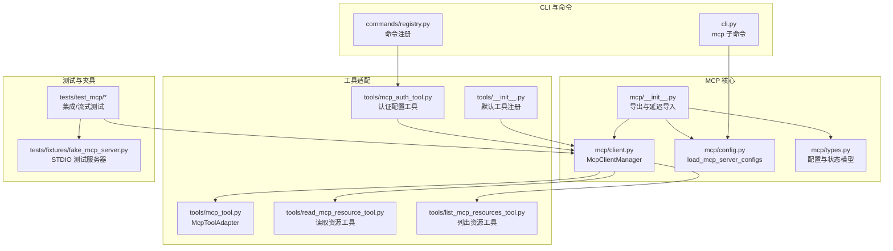
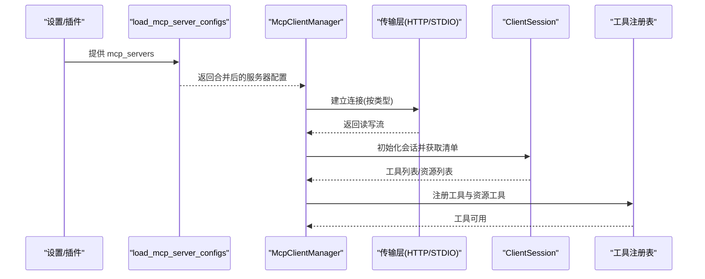
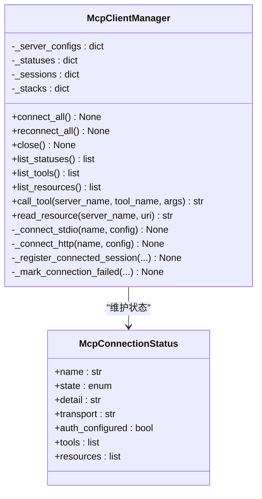
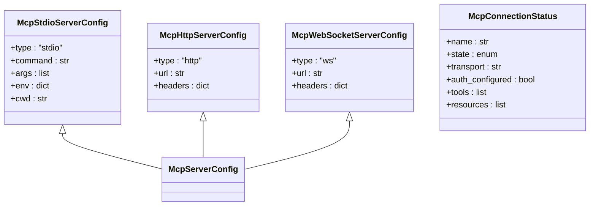
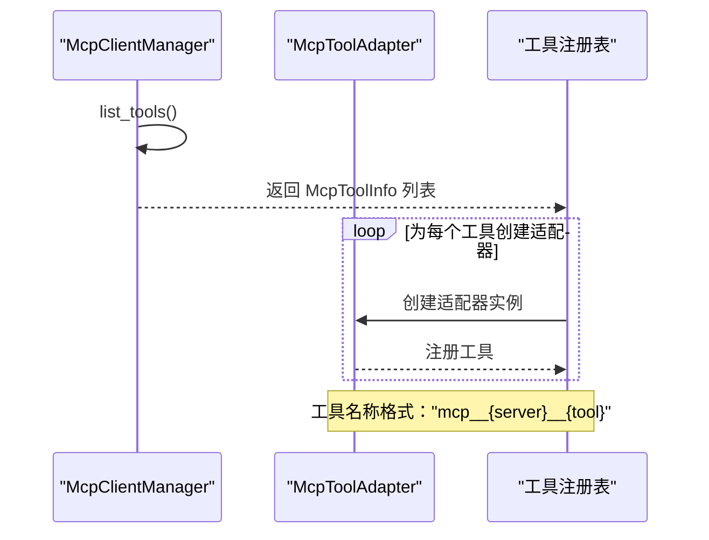
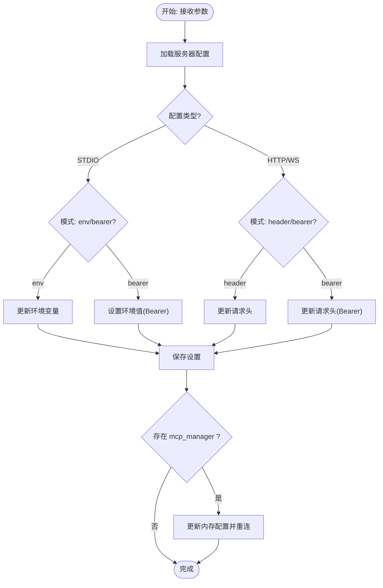
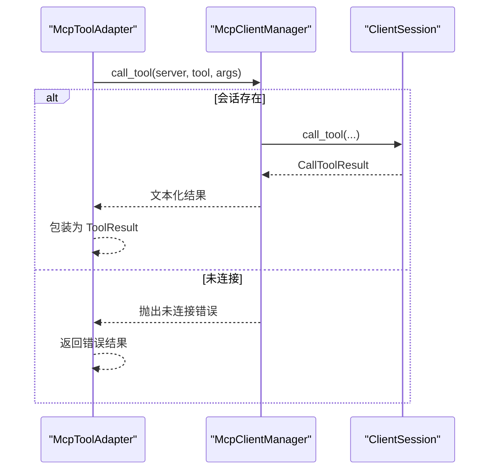
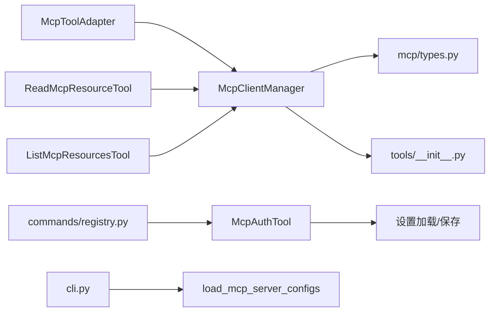

# MCP 协议支持

<cite>
**本文引用的文件**
- [mcp/__init__.py](file://src/openharness/mcp/__init__.py)
- [mcp/client.py](file://src/openharness/mcp/client.py)
- [mcp/config.py](file://src/openharness/mcp/config.py)
- [mcp/types.py](file://src/openharness/mcp/types.py)
- [tools/mcp_tool.py](file://src/openharness/tools/mcp_tool.py)
- [tools/read_mcp_resource_tool.py](file://src/openharness/tools/read_mcp_resource_tool.py)
- [tools/list_mcp_resources_tool.py](file://src/openharness/tools/list_mcp_resources_tool.py)
- [tools/mcp_auth_tool.py](file://src/openharness/tools/mcp_auth_tool.py)
- [tools/__init__.py](file://src/openharness/tools/__init__.py)
- [cli.py](file://src/openharness/cli.py)
- [commands/registry.py](file://src/openharness/commands/registry.py)
- [tests/test_mcp/test_integration.py](file://tests/test_mcp/test_integration.py)
- [tests/test_mcp/test_http_flow.py](file://tests/test_mcp/test_http_flow.py)
- [tests/test_mcp/test_stdio_flow.py](file://tests/test_mcp/test_stdio_flow.py)
- [tests/test_mcp/test_client_errors.py](file://tests/test_mcp/test_client_errors.py)
- [tests/fixtures/fake_mcp_server.py](file://tests/fixtures/fake_mcp_server.py)
</cite>

## 目录
1. [简介](#简介)
2. [项目结构](#项目结构)
3. [核心组件](#核心组件)
4. [架构总览](#架构总览)
5. [详细组件分析](#详细组件分析)
6. [依赖关系分析](#依赖关系分析)
7. [性能考虑](#性能考虑)
8. [故障排除指南](#故障排除指南)
9. [结论](#结论)
10. [附录](#附录)

## 简介
本文件系统性阐述 OpenHarness 对 MCP（Model Context Protocol）协议的支持与应用。MCP 是一种标准化协议，用于在模型驱动的应用中安全地暴露工具与资源，使外部服务能够以统一方式被发现、调用与访问。在 OpenHarness 中，MCP 支持通过客户端管理器集中连接与管理多个 MCP 服务器，动态注册其工具与资源，并将其无缝整合到 OpenHarness 的工具体系中，从而提升插件化与扩展能力。

MCP 在 OpenHarness 中的价值体现在：
- 统一接入：支持多种传输（HTTP、STDIO），便于对接不同形态的 MCP 服务器。
- 动态发现：自动拉取工具与资源清单，生成适配后的工具并注册到系统。
- 安全与可运维：提供认证配置工具，支持在不中断会话的前提下更新凭据并重连。
- 可观测性：连接状态、工具与资源清单均可查询，便于诊断与排障。

## 项目结构
围绕 MCP 的代码主要分布在以下模块：
- mcp 子包：MCP 客户端管理、配置加载与类型定义
- tools 子包：将 MCP 工具与资源适配为 OpenHarness 工具
- 测试与夹具：验证 HTTP/STDIO 连接、工具注册与错误处理
- CLI 与命令注册：提供 MCP 配置与认证的命令行入口

图表来源
- [mcp/__init__.py:1-80](file://src/openharness/mcp/__init__.py#L1-L80)
- [mcp/client.py:1-299](file://src/openharness/mcp/client.py#L1-L299)
- [mcp/config.py:1-17](file://src/openharness/mcp/config.py#L1-L17)
- [mcp/types.py:1-77](file://src/openharness/mcp/types.py#L1-L77)
- [tools/mcp_tool.py:1-73](file://src/openharness/tools/mcp_tool.py#L1-L73)
- [tools/read_mcp_resource_tool.py:1-38](file://src/openharness/tools/read_mcp_resource_tool.py#L1-L38)
- [tools/list_mcp_resources_tool.py:1-37](file://src/openharness/tools/list_mcp_resources_tool.py#L1-L37)
- [tools/mcp_auth_tool.py:1-72](file://src/openharness/tools/mcp_auth_tool.py#L1-L72)
- [tools/__init__.py:89-107](file://src/openharness/tools/__init__.py#L89-L107)
- [cli.py:780-822](file://src/openharness/cli.py#L780-L822)
- [commands/registry.py:1420-1443](file://src/openharness/commands/registry.py#L1420-L1443)
- [tests/test_mcp/test_integration.py:1-80](file://tests/test_mcp/test_integration.py#L1-L80)
- [tests/test_mcp/test_http_flow.py:1-91](file://tests/test_mcp/test_http_flow.py#L1-L91)
- [tests/test_mcp/test_stdio_flow.py:1-41](file://tests/test_mcp/test_stdio_flow.py#L1-L41)
- [tests/fixtures/fake_mcp_server.py:1-22](file://tests/fixtures/fake_mcp_server.py#L1-L22)

章节来源
- [mcp/__init__.py:1-80](file://src/openharness/mcp/__init__.py#L1-L80)
- [mcp/client.py:1-299](file://src/openharness/mcp/client.py#L1-L299)
- [mcp/config.py:1-17](file://src/openharness/mcp/config.py#L1-L17)
- [mcp/types.py:1-77](file://src/openharness/mcp/types.py#L1-L77)
- [tools/__init__.py:89-107](file://src/openharness/tools/__init__.py#L89-L107)

## 核心组件
- McpClientManager：负责连接与管理多个 MCP 服务器，维护连接状态、工具与资源清单，提供工具调用与资源读取能力。
- 配置模型：McpStdioServerConfig、McpHttpServerConfig、McpWebSocketServerConfig；以及运行时状态 McpConnectionStatus。
- 工具适配：McpToolAdapter 将 MCP 工具转换为 OpenHarness 工具；资源工具提供列出与读取功能；认证工具提供凭据持久化与重连。
- 配置加载：load_mcp_server_configs 合并设置与插件提供的 MCP 服务器配置。

章节来源
- [mcp/client.py:29-299](file://src/openharness/mcp/client.py#L29-L299)
- [mcp/types.py:11-77](file://src/openharness/mcp/types.py#L11-L77)
- [mcp/config.py:8-17](file://src/openharness/mcp/config.py#L8-L17)
- [tools/mcp_tool.py:14-73](file://src/openharness/tools/mcp_tool.py#L14-L73)
- [tools/read_mcp_resource_tool.py:18-38](file://src/openharness/tools/read_mcp_resource_tool.py#L18-L38)
- [tools/list_mcp_resources_tool.py:15-37](file://src/openharness/tools/list_mcp_resources_tool.py#L15-L37)
- [tools/mcp_auth_tool.py:21-72](file://src/openharness/tools/mcp_auth_tool.py#L21-L72)

## 架构总览
下图展示 MCP 客户端在 OpenHarness 中的整体交互：从配置加载、连接建立、工具与资源发现，到工具注册与调用。

图表来源
- [mcp/config.py:8-17](file://src/openharness/mcp/config.py#L8-L17)
- [mcp/client.py:45-299](file://src/openharness/mcp/client.py#L45-L299)
- [tools/__init__.py:89-107](file://src/openharness/tools/__init__.py#L89-L107)

## 详细组件分析

### McpClientManager：连接管理与工具/资源暴露
- 连接策略
  - 支持 STDIO 与 HTTP 两种传输。STDIO 使用进程参数启动子进程，HTTP 使用可流式的 HTTP 客户端。
  - 每个服务器连接由 AsyncExitStack 管理生命周期，确保异常时也能清理。
- 状态与可观测性
  - 维护每个服务器的连接状态（pending/connected/failed/disabled）、传输类型、是否配置了认证、工具与资源清单。
- 工具与资源
  - 初始化后调用 list_tools 与 list_resources 获取元数据，构建 McpToolInfo/McpResourceInfo 并存入状态。
  - 提供 call_tool 与 read_resource 两个核心操作，统一将结果序列化为字符串输出。
- 错误处理
  - 连接失败记录到状态 detail；对未连接或会话丢失抛出 McpServerNotConnectedError，便于上层工具捕获并返回错误结果。

图表来源
- [mcp/client.py:29-299](file://src/openharness/mcp/client.py#L29-L299)
- [mcp/types.py:66-77](file://src/openharness/mcp/types.py#L66-L77)

章节来源
- [mcp/client.py:45-299](file://src/openharness/mcp/client.py#L45-L299)
- [mcp/types.py:66-77](file://src/openharness/mcp/types.py#L66-L77)

### 配置模型与加载
- 配置模型
  - McpStdioServerConfig：命令、参数、环境变量、工作目录。
  - McpHttpServerConfig：URL、请求头（含 Authorization）。
  - McpWebSocketServerConfig：URL、请求头。
  - McpConnectionStatus：运行时状态与元数据。
- 配置加载
  - load_mcp_server_configs 合并设置与启用插件的 MCP 服务器配置，插件配置键名采用“插件名:配置名”的命名空间避免冲突。

图表来源
- [mcp/types.py:11-37](file://src/openharness/mcp/types.py#L11-L37)
- [mcp/types.py:66-77](file://src/openharness/mcp/types.py#L66-L77)

章节来源
- [mcp/types.py:11-37](file://src/openharness/mcp/types.py#L11-L37)
- [mcp/config.py:8-17](file://src/openharness/mcp/config.py#L8-L17)

### 工具适配与注册
- McpToolAdapter
  - 将 MCP 工具输入模式（JSON Schema）转换为 OpenHarness 的 Pydantic 输入模型，动态生成字段与必填项。
  - 工具名称规范化为“mcp__{server}__{tool}”形式，便于检索与调用。
- 资源工具
  - 列出资源：遍历所有已连接服务器的资源清单。
  - 读取资源：根据服务器名与 URI 调用 read_resource。
- 默认注册
  - 在创建默认工具注册表时，自动注册资源列表与读取工具，并为每个已发现的 MCP 工具创建适配器。

图表来源
- [tools/mcp_tool.py:14-73](file://src/openharness/tools/mcp_tool.py#L14-L73)
- [tools/list_mcp_resources_tool.py:15-37](file://src/openharness/tools/list_mcp_resources_tool.py#L15-L37)
- [tools/read_mcp_resource_tool.py:18-38](file://src/openharness/tools/read_mcp_resource_tool.py#L18-L38)
- [tools/__init__.py:89-107](file://src/openharness/tools/__init__.py#L89-L107)

章节来源
- [tools/mcp_tool.py:14-73](file://src/openharness/tools/mcp_tool.py#L14-L73)
- [tools/list_mcp_resources_tool.py:15-37](file://src/openharness/tools/list_mcp_resources_tool.py#L15-L37)
- [tools/read_mcp_resource_tool.py:18-38](file://src/openharness/tools/read_mcp_resource_tool.py#L18-L38)
- [tools/__init__.py:89-107](file://src/openharness/tools/__init__.py#L89-L107)

### 认证配置与重连
- McpAuthTool
  - 支持三种模式：bearer、header、env；根据服务器类型自动选择合适的键（如 Authorization 或自定义环境变量）。
  - 更新设置后，若存在 mcp_manager，尝试更新内存配置并触发全量重连。
- 命令行入口
  - CLI 与命令注册提供认证更新的命令实现，覆盖 HTTP/WS 与 STDIO 的不同场景。

图表来源
- [tools/mcp_auth_tool.py:21-72](file://src/openharness/tools/mcp_auth_tool.py#L21-L72)
- [commands/registry.py:1420-1443](file://src/openharness/commands/registry.py#L1420-L1443)

章节来源
- [tools/mcp_auth_tool.py:21-72](file://src/openharness/tools/mcp_auth_tool.py#L21-L72)
- [commands/registry.py:1420-1443](file://src/openharness/commands/registry.py#L1420-L1443)

### 工具调用与资源读取流程
- 工具调用
  - 适配器将输入模型转为 JSON 字典，调用 Manager.call_tool，最终由 ClientSession 执行并返回内容。
  - 结果按文本优先策略拼接，无输出时返回占位符。
- 资源读取
  - 通过 Manager.read_resource 获取资源内容，同样进行文本/二进制内容拼接。

图表来源
- [tools/mcp_tool.py:26-36](file://src/openharness/tools/mcp_tool.py#L26-L36)
- [mcp/client.py:129-154](file://src/openharness/mcp/client.py#L129-L154)

章节来源
- [tools/mcp_tool.py:26-36](file://src/openharness/tools/mcp_tool.py#L26-L36)
- [mcp/client.py:129-154](file://src/openharness/mcp/client.py#L129-L154)

## 依赖关系分析
- 外部库
  - mcp：ClientSession、STDIO/HTTP 传输客户端。
  - httpx：HTTP 客户端封装，支持自定义传输与请求头。
- 内部耦合
  - McpClientManager 依赖 mcp/types 中的状态与配置模型。
  - 工具适配依赖 McpClientManager 的工具/资源查询与调用接口。
  - 认证工具依赖设置加载/保存与 mcp/types 的配置模型。
  - CLI 与命令注册提供配置与认证的用户入口。

图表来源
- [mcp/client.py:16-22](file://src/openharness/mcp/client.py#L16-L22)
- [tools/mcp_tool.py:9-11](file://src/openharness/tools/mcp_tool.py#L9-L11)
- [tools/read_mcp_resource_tool.py:7-8](file://src/openharness/tools/read_mcp_resource_tool.py#L7-L8)
- [tools/list_mcp_resources_tool.py:7-8](file://src/openharness/tools/list_mcp_resources_tool.py#L7-L8)
- [tools/mcp_auth_tool.py:7-9](file://src/openharness/tools/mcp_auth_tool.py#L7-L9)
- [cli.py:788-793](file://src/openharness/cli.py#L788-L793)
- [commands/registry.py:1420-1443](file://src/openharness/commands/registry.py#L1420-L1443)

章节来源
- [mcp/client.py:16-22](file://src/openharness/mcp/client.py#L16-L22)
- [tools/mcp_tool.py:9-11](file://src/openharness/tools/mcp_tool.py#L9-L11)
- [tools/read_mcp_resource_tool.py:7-8](file://src/openharness/tools/read_mcp_resource_tool.py#L7-L8)
- [tools/list_mcp_resources_tool.py:7-8](file://src/openharness/tools/list_mcp_resources_tool.py#L7-L8)
- [tools/mcp_auth_tool.py:7-9](file://src/openharness/tools/mcp_auth_tool.py#L7-L9)
- [cli.py:788-793](file://src/openharness/cli.py#L788-L793)
- [commands/registry.py:1420-1443](file://src/openharness/commands/registry.py#L1420-L1443)

## 性能考虑
- 连接复用与生命周期管理
  - 使用 AsyncExitStack 管理传输层读写流与会话，减少资源泄漏风险，提高稳定性。
- 异步 I/O
  - HTTP 与 STDIO 均采用异步客户端与会话，避免阻塞事件循环。
- 结果序列化
  - 工具调用与资源读取均将多段内容拼接为字符串，尽量减少中间对象开销。
- 建议
  - 对频繁调用的工具，可在上层缓存工具输入校验结果与适配器实例。
  - 对高并发场景，合理拆分 MCP 服务器，避免单点瓶颈。
  - 在网络不稳定时，结合重连策略与指数退避，降低抖动影响。

## 故障排除指南
- 常见错误与定位
  - 未连接错误：当服务器未连接或会话丢失时，Manager 会抛出 McpServerNotConnectedError。检查连接状态与服务器可达性。
  - 资源列表不可用：某些服务器可能未实现资源列表方法，Manager 会容忍特定错误并继续初始化。
  - HTTP 连接失败：检查 URL、请求头与网络策略；确认服务器启用了可流式 HTTP 传输。
  - STDIO 启动失败：检查命令、参数与环境变量；确保子进程可正常启动。
- 诊断步骤
  - 使用工具注册表中的“列出资源”工具查看当前可用资源。
  - 通过 Manager.list_statuses() 查看各服务器状态与详情。
  - 使用 CLI 的 MCP 子命令查看已配置的服务器与传输类型。
- 重试与恢复
  - 使用 McpAuthTool 更新认证后，可触发重连；或手动调用 Manager.reconnect_all()。
  - 对于临时网络问题，等待重连后再试；必要时调整超时与重试策略。

章节来源
- [mcp/client.py:86-101](file://src/openharness/mcp/client.py#L86-L101)
- [mcp/client.py:129-178](file://src/openharness/mcp/client.py#L129-L178)
- [tests/test_mcp/test_client_errors.py:72-216](file://tests/test_mcp/test_client_errors.py#L72-L216)
- [tests/test_mcp/test_http_flow.py:19-91](file://tests/test_mcp/test_http_flow.py#L19-L91)
- [tests/test_mcp/test_stdio_flow.py:16-41](file://tests/test_mcp/test_stdio_flow.py#L16-L41)

## 结论
OpenHarness 的 MCP 支持以 McpClientManager 为核心，实现了对多传输、多服务器的统一接入与动态发现，并通过工具适配与认证工具将 MCP 能力无缝融入系统。配合完善的测试与可观测性，该实现既保证了易用性，也兼顾了可维护性与可扩展性。

## 附录

### MCP 服务器配置指南
- 配置来源
  - 设置文件：settings.mcp_servers
  - 插件：插件 manifest 名称前缀 + 冒号 + 配置名，避免键冲突
- 支持的传输
  - STDIO：指定命令、参数、环境变量与工作目录
  - HTTP：指定 URL 与请求头（含 Authorization）
  - WebSocket：指定 URL 与请求头（含 Authorization）
- 自动重连
  - 认证更新后可触发重连；也可手动调用 Manager.reconnect_all()

章节来源
- [mcp/config.py:8-17](file://src/openharness/mcp/config.py#L8-L17)
- [mcp/types.py:11-37](file://src/openharness/mcp/types.py#L11-L37)
- [tools/mcp_auth_tool.py:61-69](file://src/openharness/tools/mcp_auth_tool.py#L61-L69)

### MCP 工具注册与调用流程
- 注册流程
  - Manager 初始化会话并获取工具/资源清单
  - 为每个工具创建 McpToolAdapter 并注册到默认工具注册表
- 调用流程
  - 适配器将输入模型转为 JSON，调用 Manager.call_tool
  - 结果统一文本化并返回 ToolResult

章节来源
- [mcp/client.py:252-299](file://src/openharness/mcp/client.py#L252-L299)
- [tools/mcp_tool.py:14-73](file://src/openharness/tools/mcp_tool.py#L14-L73)
- [tools/__init__.py:89-107](file://src/openharness/tools/__init__.py#L89-L107)

### 实际 MCP 服务器集成示例
- HTTP 流式集成
  - 使用 FastMCP 创建可流式 HTTP 应用，Manager 通过 HTTP 传输连接并验证工具与资源清单。
- STDIO 集成
  - 使用测试夹具中的小型 STDIO 服务器，Manager 通过 STDIO 传输连接并执行工具。

章节来源
- [tests/test_mcp/test_http_flow.py:19-91](file://tests/test_mcp/test_http_flow.py#L19-L91)
- [tests/test_mcp/test_stdio_flow.py:16-41](file://tests/test_mcp/test_stdio_flow.py#L16-L41)
- [tests/fixtures/fake_mcp_server.py:1-22](file://tests/fixtures/fake_mcp_server.py#L1-L22)