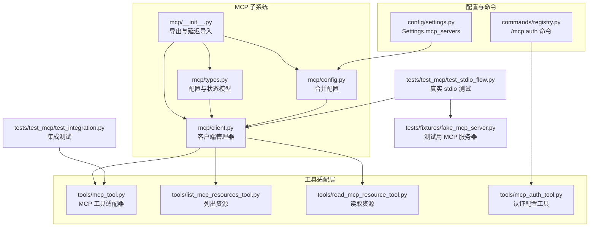
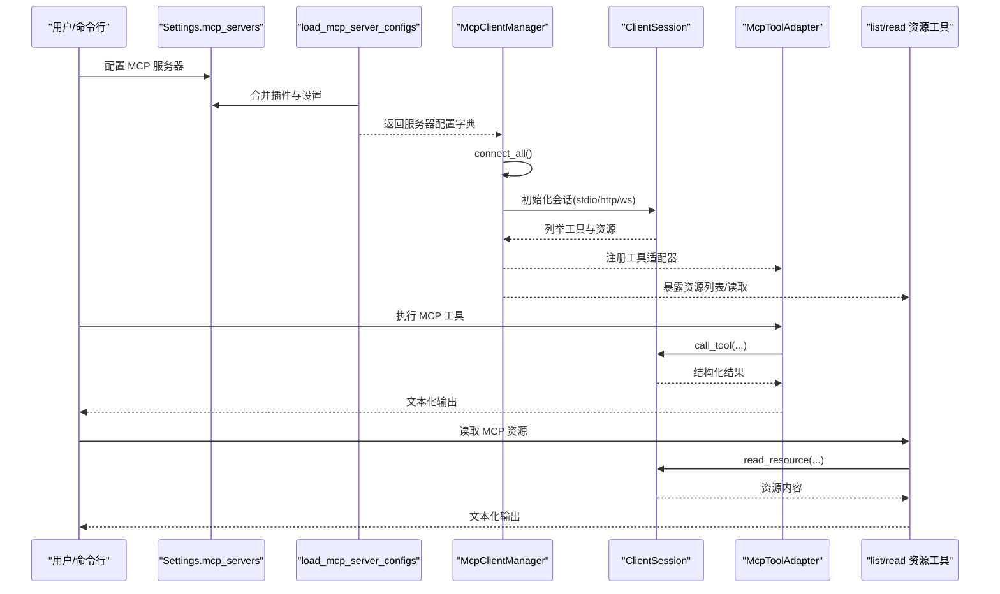
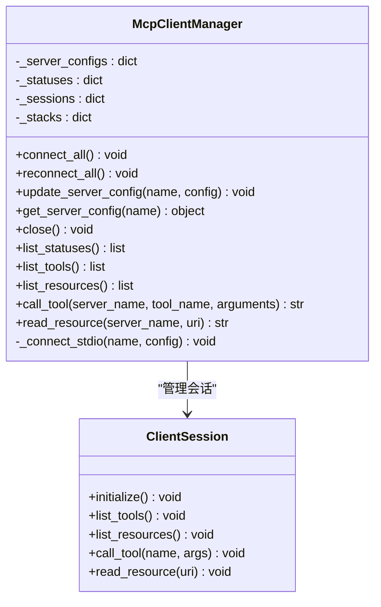
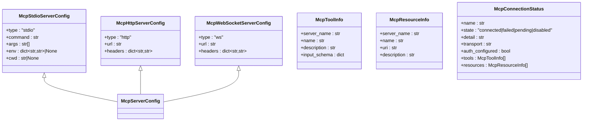
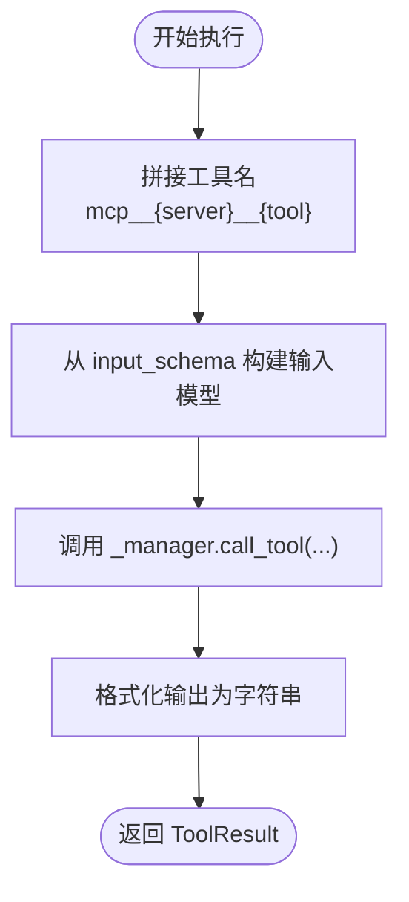
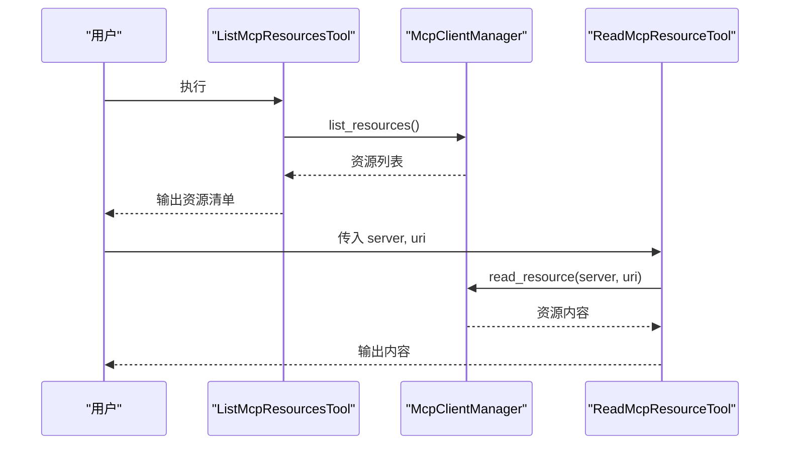
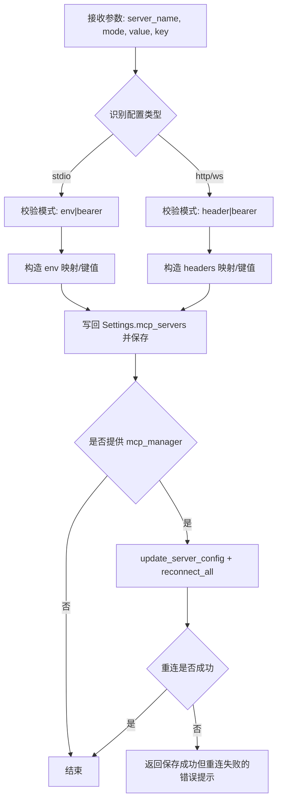
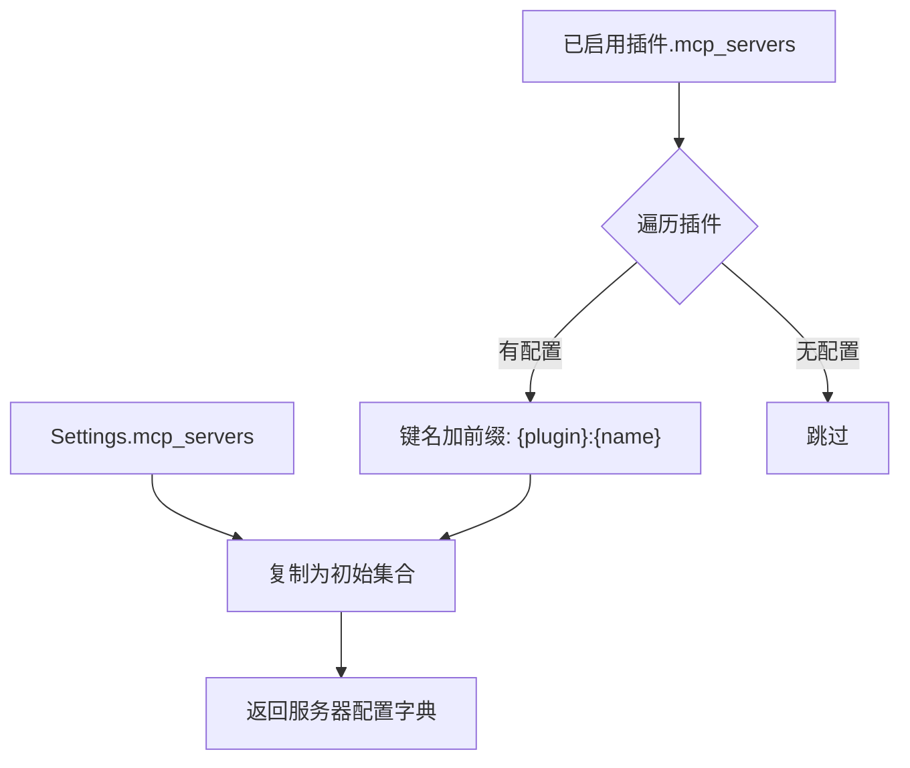
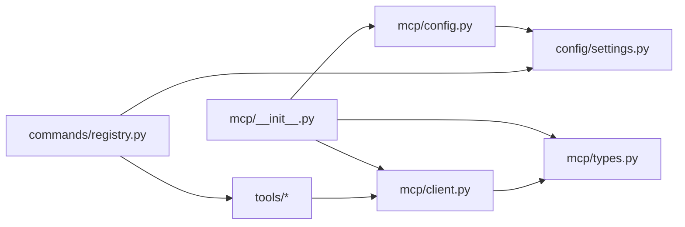

# MCP 协议支持

<cite>
**本文引用的文件**
- [src/openharness/mcp/__init__.py](file://src/openharness/mcp/__init__.py)
- [src/openharness/mcp/client.py](file://src/openharness/mcp/client.py)
- [src/openharness/mcp/config.py](file://src/openharness/mcp/config.py)
- [src/openharness/mcp/types.py](file://src/openharness/mcp/types.py)
- [src/openharness/tools/mcp_tool.py](file://src/openharness/tools/mcp_tool.py)
- [src/openharness/tools/mcp_auth_tool.py](file://src/openharness/tools/mcp_auth_tool.py)
- [src/openharness/tools/list_mcp_resources_tool.py](file://src/openharness/tools/list_mcp_resources_tool.py)
- [src/openharness/tools/read_mcp_resource_tool.py](file://src/openharness/tools/read_mcp_resource_tool.py)
- [src/openharness/config/settings.py](file://src/openharness/config/settings.py)
- [src/openharness/commands/registry.py](file://src/openharness/commands/registry.py)
- [tests/test_mcp/test_integration.py](file://tests/test_mcp/test_integration.py)
- [tests/test_mcp/test_stdio_flow.py](file://tests/test_mcp/test_stdio_flow.py)
- [tests/fixtures/fake_mcp_server.py](file://tests/fixtures/fake_mcp_server.py)
</cite>

## 目录
1. [简介](#简介)
2. [项目结构](#项目结构)
3. [核心组件](#核心组件)
4. [架构总览](#架构总览)
5. [详细组件分析](#详细组件分析)
6. [依赖分析](#依赖分析)
7. [性能考虑](#性能考虑)
8. [故障排除指南](#故障排除指南)
9. [结论](#结论)
10. [附录：集成与开发指南](#附录集成与开发指南)

## 简介
本文件系统性阐述 OpenHarness 对 Model Context Protocol（MCP）的支持与应用。MCP 是一种标准化协议，允许模型驱动的应用程序以一致的方式发现、调用工具与读取资源。在 OpenHarness 中，MCP 能力通过以下方式被整合：
- 客户端管理器负责连接 MCP 服务器、列举工具与资源、执行工具调用与资源读取。
- 工具适配器将 MCP 工具暴露为 OpenHarness 的标准工具，统一输入模型与执行流程。
- 认证工具支持持久化不同传输类型的认证配置，并在可能时自动重连。
- 配置加载器从设置与插件中合并 MCP 服务器配置，支持多来源聚合。

这些能力使得用户能够以统一方式访问外部工具与资源，扩展 OpenHarness 的外部能力边界。

## 项目结构
围绕 MCP 的代码主要分布在如下模块：
- mcp 子包：客户端管理、类型定义、配置加载入口。
- tools 子包：MCP 工具适配器、资源列表与读取工具、认证工具。
- config 子包：设置模型，包含 mcp_servers 字段。
- commands 子包：命令行工具，支持交互式更新 MCP 认证。
- tests 子包：集成与真实 stdio 流程测试，以及用于测试的最小 MCP 服务器。

图表来源
- [src/openharness/mcp/__init__.py:1-75](file://src/openharness/mcp/__init__.py#L1-L75)
- [src/openharness/mcp/types.py:1-77](file://src/openharness/mcp/types.py#L1-L77)
- [src/openharness/mcp/config.py:1-17](file://src/openharness/mcp/config.py#L1-L17)
- [src/openharness/mcp/client.py:1-175](file://src/openharness/mcp/client.py#L1-L175)
- [src/openharness/tools/mcp_tool.py:1-56](file://src/openharness/tools/mcp_tool.py#L1-L56)
- [src/openharness/tools/list_mcp_resources_tool.py:1-37](file://src/openharness/tools/list_mcp_resources_tool.py#L1-L37)
- [src/openharness/tools/read_mcp_resource_tool.py:1-36](file://src/openharness/tools/read_mcp_resource_tool.py#L1-L36)
- [src/openharness/tools/mcp_auth_tool.py:1-72](file://src/openharness/tools/mcp_auth_tool.py#L1-L72)
- [src/openharness/config/settings.py:1-161](file://src/openharness/config/settings.py#L1-L161)
- [src/openharness/commands/registry.py:853-903](file://src/openharness/commands/registry.py#L853-L903)
- [tests/test_mcp/test_integration.py:1-80](file://tests/test_mcp/test_integration.py#L1-L80)
- [tests/test_mcp/test_stdio_flow.py:1-55](file://tests/test_mcp/test_stdio_flow.py#L1-L55)
- [tests/fixtures/fake_mcp_server.py:1-22](file://tests/fixtures/fake_mcp_server.py#L1-L22)

章节来源
- [src/openharness/mcp/__init__.py:1-75](file://src/openharness/mcp/__init__.py#L1-L75)
- [src/openharness/mcp/types.py:1-77](file://src/openharness/mcp/types.py#L1-L77)
- [src/openharness/mcp/config.py:1-17](file://src/openharness/mcp/config.py#L1-L17)
- [src/openharness/mcp/client.py:1-175](file://src/openharness/mcp/client.py#L1-L175)
- [src/openharness/tools/mcp_tool.py:1-56](file://src/openharness/tools/mcp_tool.py#L1-L56)
- [src/openharness/tools/mcp_auth_tool.py:1-72](file://src/openharness/tools/mcp_auth_tool.py#L1-L72)
- [src/openharness/tools/list_mcp_resources_tool.py:1-37](file://src/openharness/tools/list_mcp_resources_tool.py#L1-L37)
- [src/openharness/tools/read_mcp_resource_tool.py:1-36](file://src/openharness/tools/read_mcp_resource_tool.py#L1-L36)
- [src/openharness/config/settings.py:1-161](file://src/openharness/config/settings.py#L1-L161)
- [src/openharness/commands/registry.py:853-903](file://src/openharness/commands/registry.py#L853-L903)
- [tests/test_mcp/test_integration.py:1-80](file://tests/test_mcp/test_integration.py#L1-L80)
- [tests/test_mcp/test_stdio_flow.py:1-55](file://tests/test_mcp/test_stdio_flow.py#L1-L55)
- [tests/fixtures/fake_mcp_server.py:1-22](file://tests/fixtures/fake_mcp_server.py#L1-L22)

## 核心组件
- MCP 客户端管理器：负责连接、列举、调用工具与读取资源；维护每个服务器的连接状态与元数据。
- MCP 类型与配置：定义 stdio/http/ws 三类服务器配置、工具与资源元数据、运行时连接状态。
- MCP 工具适配器：将 MCP 工具转换为 OpenHarness 工具，动态生成输入模型。
- 资源工具：列出与读取 MCP 资源，便于在会话中直接访问。
- 认证工具：支持持久化 stdio/env 与 http/ws/header/bearer 模式的认证配置，并尝试重连。
- 配置加载：从设置与已启用插件合并 MCP 服务器配置，支持命名空间前缀避免冲突。

章节来源
- [src/openharness/mcp/client.py:20-175](file://src/openharness/mcp/client.py#L20-L175)
- [src/openharness/mcp/types.py:11-77](file://src/openharness/mcp/types.py#L11-L77)
- [src/openharness/tools/mcp_tool.py:14-56](file://src/openharness/tools/mcp_tool.py#L14-L56)
- [src/openharness/tools/list_mcp_resources_tool.py:15-37](file://src/openharness/tools/list_mcp_resources_tool.py#L15-L37)
- [src/openharness/tools/read_mcp_resource_tool.py:18-36](file://src/openharness/tools/read_mcp_resource_tool.py#L18-L36)
- [src/openharness/tools/mcp_auth_tool.py:21-72](file://src/openharness/tools/mcp_auth_tool.py#L21-L72)
- [src/openharness/mcp/config.py:8-17](file://src/openharness/mcp/config.py#L8-L17)

## 架构总览
下图展示了 MCP 在 OpenHarness 中的整体交互：配置加载、客户端连接、工具与资源暴露、认证更新与重连。

图表来源
- [src/openharness/mcp/config.py:8-17](file://src/openharness/mcp/config.py#L8-L17)
- [src/openharness/mcp/client.py:36-175](file://src/openharness/mcp/client.py#L36-L175)
- [src/openharness/tools/mcp_tool.py:26-33](file://src/openharness/tools/mcp_tool.py#L26-L33)
- [src/openharness/tools/list_mcp_resources_tool.py:29-36](file://src/openharness/tools/list_mcp_resources_tool.py#L29-L36)
- [src/openharness/tools/read_mcp_resource_tool.py:32-35](file://src/openharness/tools/read_mcp_resource_tool.py#L32-L35)

## 详细组件分析

### MCP 客户端管理器（McpClientManager）
职责与行为：
- 统一管理多个 MCP 服务器的连接生命周期。
- 当前版本仅支持 stdio 传输；其他传输类型会在状态中标记失败。
- 连接成功后自动列举工具与资源，构建工具元数据与资源元数据。
- 提供工具调用与资源读取的便捷方法，内部将非文本内容序列化为字符串。
- 支持关闭所有会话、重连全部、更新内存中的服务器配置。

图表来源
- [src/openharness/mcp/client.py:20-175](file://src/openharness/mcp/client.py#L20-L175)

章节来源
- [src/openharness/mcp/client.py:20-175](file://src/openharness/mcp/client.py#L20-L175)

### MCP 类型与配置（McpStdioServerConfig/McpHttpServerConfig/McpWebSocketServerConfig）
- McpStdioServerConfig：描述通过进程 IO 通信的 MCP 服务器，包含命令、参数、环境变量与工作目录。
- McpHttpServerConfig：描述通过 HTTP 通信的 MCP 服务器，包含 URL 与请求头。
- McpWebSocketServerConfig：描述通过 WebSocket 通信的 MCP 服务器，包含 URL 与请求头。
- McpServerConfig：三者联合类型，作为配置字段的类型约束。
- McpJsonConfig：插件或项目配置文件使用的 JSON 形状，包含 mcpServers 字段。
- McpToolInfo/McpResourceInfo/McpConnectionStatus：运行时工具、资源与连接状态的元数据载体。

图表来源
- [src/openharness/mcp/types.py:11-77](file://src/openharness/mcp/types.py#L11-L77)

章节来源
- [src/openharness/mcp/types.py:11-77](file://src/openharness/mcp/types.py#L11-L77)

### MCP 工具适配器（McpToolAdapter）
- 将 MCP 工具元数据转换为 OpenHarness 工具名称与输入模型。
- 动态生成 Pydantic 输入模型，基于 MCP 工具的 JSON Schema properties 与 required 字段。
- 执行时将参数转为 JSON 兼容字典，调用客户端管理器的工具调用接口，并将结果封装为 ToolResult。

图表来源
- [src/openharness/tools/mcp_tool.py:17-33](file://src/openharness/tools/mcp_tool.py#L17-L33)
- [src/openharness/tools/mcp_tool.py:36-46](file://src/openharness/tools/mcp_tool.py#L36-L46)

章节来源
- [src/openharness/tools/mcp_tool.py:14-56](file://src/openharness/tools/mcp_tool.py#L14-L56)

### 资源工具（列出与读取）
- 列出资源工具：遍历所有已连接服务器的资源，输出 server:uri 描述。
- 读取资源工具：根据 server 与 uri 调用客户端管理器读取资源，返回文本化内容。

图表来源
- [src/openharness/tools/list_mcp_resources_tool.py:29-36](file://src/openharness/tools/list_mcp_resources_tool.py#L29-L36)
- [src/openharness/tools/read_mcp_resource_tool.py:32-35](file://src/openharness/tools/read_mcp_resource_tool.py#L32-L35)

章节来源
- [src/openharness/tools/list_mcp_resources_tool.py:15-37](file://src/openharness/tools/list_mcp_resources_tool.py#L15-L37)
- [src/openharness/tools/read_mcp_resource_tool.py:18-36](file://src/openharness/tools/read_mcp_resource_tool.py#L18-L36)

### 认证工具（McpAuthTool）
- 支持三种模式：
  - stdio：env 或 bearer（env 键可自定义，默认 MCP_AUTH_TOKEN）。
  - http/ws：header 或 bearer（Authorization 头默认值可自定义）。
- 更新 Settings.mcp_servers 中对应服务器的配置，保存到配置文件。
- 若存在 mcp_manager，尝试更新内存配置并重连所有服务器；若重连失败，返回错误提示但已保存配置。

图表来源
- [src/openharness/tools/mcp_auth_tool.py:28-71](file://src/openharness/tools/mcp_auth_tool.py#L28-L71)

章节来源
- [src/openharness/tools/mcp_auth_tool.py:21-72](file://src/openharness/tools/mcp_auth_tool.py#L21-L72)

### 配置加载（load_mcp_server_configs）
- 合并 Settings.mcp_servers 与已启用插件的 mcp_servers。
- 插件配置采用“插件名:配置名”的命名空间避免冲突。
- 返回统一的服务器配置字典，供客户端管理器使用。

图表来源
- [src/openharness/mcp/config.py:8-17](file://src/openharness/mcp/config.py#L8-L17)

章节来源
- [src/openharness/mcp/config.py:8-17](file://src/openharness/mcp/config.py#L8-L17)

### 命令行认证（/mcp auth）
- 支持三种语法：
  - /mcp auth SERVER TOKEN（默认 bearer）
  - /mcp auth SERVER [bearer|env] VALUE
  - /mcp auth SERVER header KEY VALUE
- 根据配置类型校验模式与键名，更新 Settings.mcp_servers，保存后提示重启会话以重连。

章节来源
- [src/openharness/commands/registry.py:853-903](file://src/openharness/commands/registry.py#L853-L903)

## 依赖分析
- 导出与延迟导入：mcp/__init__.py 提供统一导出与按需导入，避免循环依赖。
- 客户端依赖 mcp 库的 ClientSession 与 stdio 客户端参数，当前仅实现 stdio 连接路径。
- 工具适配器依赖客户端管理器提供的工具与资源元数据。
- 认证工具依赖 Settings 持久化与命令行工具的交互入口。
- 配置加载依赖插件类型定义，确保只合并已启用插件的配置。

图表来源
- [src/openharness/mcp/__init__.py:34-75](file://src/openharness/mcp/__init__.py#L34-L75)
- [src/openharness/mcp/config.py:8-17](file://src/openharness/mcp/config.py#L8-L17)
- [src/openharness/mcp/client.py:20-175](file://src/openharness/mcp/client.py#L20-L175)
- [src/openharness/config/settings.py:49-64](file://src/openharness/config/settings.py#L49-L64)
- [src/openharness/commands/registry.py:853-903](file://src/openharness/commands/registry.py#L853-L903)

章节来源
- [src/openharness/mcp/__init__.py:34-75](file://src/openharness/mcp/__init__.py#L34-L75)
- [src/openharness/mcp/config.py:8-17](file://src/openharness/mcp/config.py#L8-L17)
- [src/openharness/mcp/client.py:20-175](file://src/openharness/mcp/client.py#L20-L175)
- [src/openharness/config/settings.py:49-64](file://src/openharness/config/settings.py#L49-L64)
- [src/openharness/commands/registry.py:853-903](file://src/openharness/commands/registry.py#L853-L903)

## 性能考虑
- 连接与初始化：每次连接都会进行工具与资源列举，建议在配置稳定时避免频繁重连。
- 工具调用与资源读取：将非文本内容序列化为字符串，可能带来额外开销；如需二进制数据，请在 MCP 服务器侧进行编码处理。
- 并发与会话：客户端管理器为每个服务器维护独立会话与退出栈，注意在高并发场景下的资源释放与异常恢复。
- 配置合并：插件数量较多时，配置合并会产生线性开销；可通过减少插件启用数量优化启动时间。

## 故障排除指南
常见问题与定位要点：
- 连接失败
  - 检查服务器配置类型是否为 stdio；当前构建不支持 http/ws。
  - 查看连接状态 detail 字段，确认异常堆栈信息。
  - 确认命令、参数、环境变量与工作目录配置正确。
- 工具不可见
  - 确认连接状态中 tools 列表非空。
  - 检查工具输入模式是否符合 input_schema。
- 资源读取为空
  - 确认资源 URI 正确且服务器已发布该资源。
  - 检查资源内容是否为文本；非文本会被序列化为字符串表示。
- 认证失败
  - 使用认证工具或命令行更新配置，保存后尝试重连。
  - 对于 stdio，确认 env 键名与值；对于 http/ws，确认 Authorization 头或自定义头键名与值。
- 重连失败
  - 认证工具在重连失败时会返回错误提示，但配置已保存；请检查日志与网络状况。

章节来源
- [src/openharness/mcp/client.py:42-48](file://src/openharness/mcp/client.py#L42-L48)
- [src/openharness/mcp/client.py:166-174](file://src/openharness/mcp/client.py#L166-L174)
- [src/openharness/tools/mcp_auth_tool.py:61-71](file://src/openharness/tools/mcp_auth_tool.py#L61-L71)

## 结论
OpenHarness 的 MCP 支持以简洁的客户端管理器为核心，结合工具与资源适配器，提供了统一的外部能力接入方式。当前实现聚焦于 stdio 传输，具备完善的配置合并、认证持久化与重连机制。未来可扩展 http/ws 传输类型，进一步提升与各类 MCP 服务器的兼容性与安全性。

## 附录：集成与开发指南

### MCP 客户端使用步骤
- 配置服务器
  - 在 Settings.mcp_servers 中添加服务器配置；或通过插件提供配置。
  - 使用配置加载函数合并设置与插件配置。
- 初始化客户端管理器
  - 传入服务器配置字典，调用 connect_all 完成连接与元数据列举。
- 使用工具与资源
  - 通过工具适配器执行 MCP 工具；通过资源工具列出与读取资源。
- 更新认证
  - 使用认证工具或命令行工具更新配置并尝试重连。

章节来源
- [src/openharness/mcp/config.py:8-17](file://src/openharness/mcp/config.py#L8-L17)
- [src/openharness/mcp/client.py:36-175](file://src/openharness/mcp/client.py#L36-L175)
- [src/openharness/tools/mcp_tool.py:26-33](file://src/openharness/tools/mcp_tool.py#L26-L33)
- [src/openharness/tools/list_mcp_resources_tool.py:29-36](file://src/openharness/tools/list_mcp_resources_tool.py#L29-L36)
- [src/openharness/tools/read_mcp_resource_tool.py:32-35](file://src/openharness/tools/read_mcp_resource_tool.py#L32-L35)
- [src/openharness/tools/mcp_auth_tool.py:28-71](file://src/openharness/tools/mcp_auth_tool.py#L28-L71)
- [src/openharness/commands/registry.py:853-903](file://src/openharness/commands/registry.py#L853-L903)

### MCP 服务器开发要点
- 传输类型
  - 当前客户端仅支持 stdio；如需 http/ws，请扩展客户端管理器与会话初始化逻辑。
- 工具定义
  - 提供清晰的输入 JSON Schema，以便工具适配器动态生成输入模型。
- 资源定义
  - 为资源提供稳定的 URI 与描述，便于资源工具展示与读取。
- 认证机制
  - stdio：通过环境变量传递令牌；http/ws：通过 Authorization 头或自定义头传递令牌。
- 发现与列举
  - 实现工具与资源的自动列举，确保客户端能正确填充工具与资源元数据。

章节来源
- [src/openharness/mcp/client.py:39-48](file://src/openharness/mcp/client.py#L39-L48)
- [src/openharness/mcp/types.py:11-38](file://src/openharness/mcp/types.py#L11-L38)
- [src/openharness/tools/mcp_tool.py:36-46](file://src/openharness/tools/mcp_tool.py#L36-L46)

### 实际集成示例
- 集成测试
  - 验证配置合并、工具注册与资源列表功能。
  - 参考：[tests/test_mcp/test_integration.py:35-80](file://tests/test_mcp/test_integration.py#L35-L80)
- 真实 stdio 流程
  - 使用测试服务器脚本启动 MCP 服务，验证连接、工具调用与资源读取。
  - 参考：[tests/test_mcp/test_stdio_flow.py:17-55](file://tests/test_mcp/test_stdio_flow.py#L17-L55)，[tests/fixtures/fake_mcp_server.py:10-17](file://tests/fixtures/fake_mcp_server.py#L10-L17)

章节来源
- [tests/test_mcp/test_integration.py:35-80](file://tests/test_mcp/test_integration.py#L35-L80)
- [tests/test_mcp/test_stdio_flow.py:17-55](file://tests/test_mcp/test_stdio_flow.py#L17-L55)
- [tests/fixtures/fake_mcp_server.py:10-17](file://tests/fixtures/fake_mcp_server.py#L10-L17)