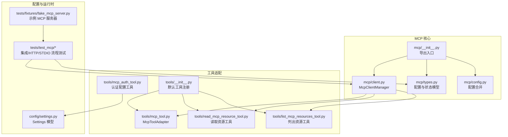
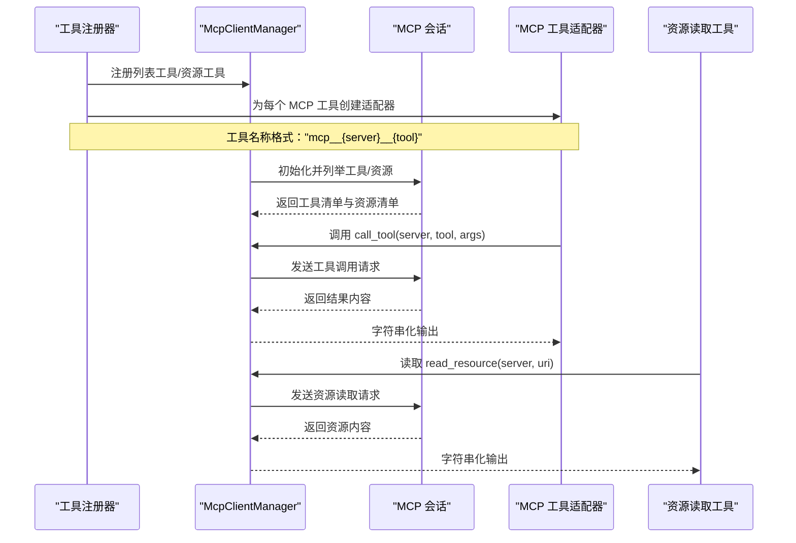
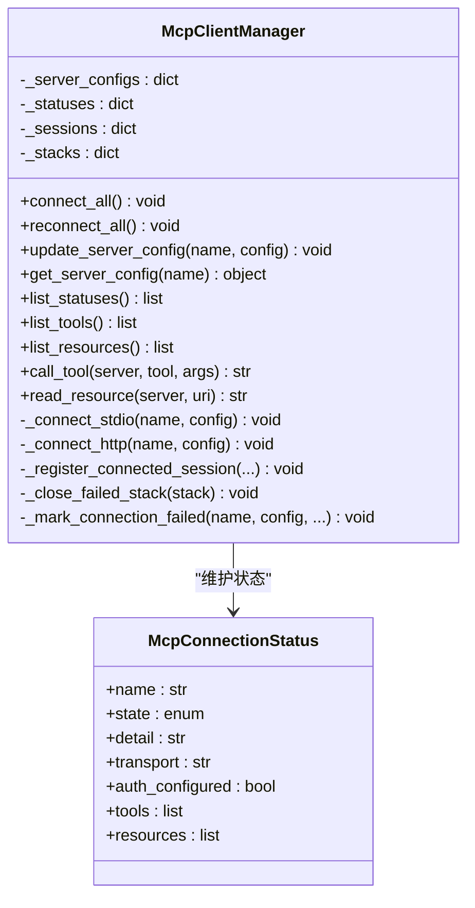
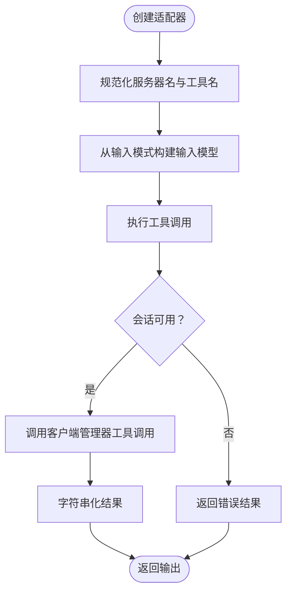
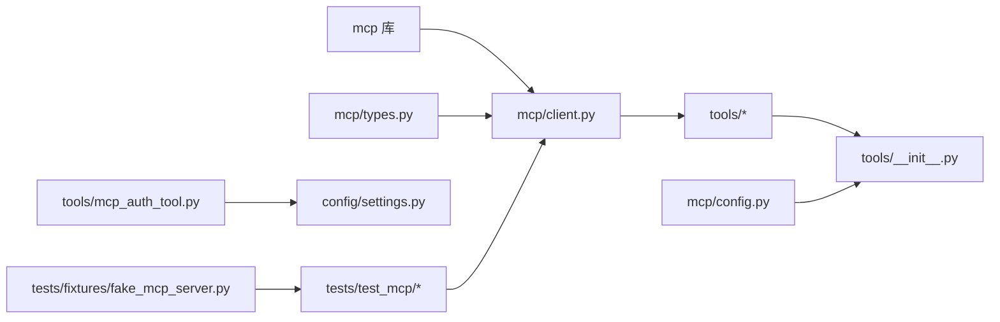

# MCP 协议概念

<cite>
**本文档引用的文件**
- [src/openharness/mcp/__init__.py](file://src/openharness/mcp/__init__.py)
- [src/openharness/mcp/client.py](file://src/openharness/mcp/client.py)
- [src/openharness/mcp/config.py](file://src/openharness/mcp/config.py)
- [src/openharness/mcp/types.py](file://src/openharness/mcp/types.py)
- [src/openharness/tools/mcp_tool.py](file://src/openharness/tools/mcp_tool.py)
- [src/openharness/tools/read_mcp_resource_tool.py](file://src/openharness/tools/read_mcp_resource_tool.py)
- [src/openharness/tools/list_mcp_resources_tool.py](file://src/openharness/tools/list_mcp_resources_tool.py)
- [src/openharness/tools/mcp_auth_tool.py](file://src/openharness/tools/mcp_auth_tool.py)
- [src/openharness/tools/__init__.py](file://src/openharness/tools/__init__.py)
- [src/openharness/config/settings.py](file://src/openharness/config/settings.py)
- [tests/test_mcp/test_integration.py](file://tests/test_mcp/test_integration.py)
- [tests/test_mcp/test_http_flow.py](file://tests/test_mcp/test_http_flow.py)
- [tests/test_mcp/test_stdio_flow.py](file://tests/test_mcp/test_stdio_flow.py)
- [tests/fixtures/fake_mcp_server.py](file://tests/fixtures/fake_mcp_server.py)
</cite>

## 目录
1. [引言](#引言)
2. [项目结构](#项目结构)
3. [核心组件](#核心组件)
4. [架构总览](#架构总览)
5. [详细组件分析](#详细组件分析)
6. [依赖关系分析](#依赖关系分析)
7. [性能考虑](#性能考虑)
8. [故障排查指南](#故障排查指南)
9. [结论](#结论)
10. [附录](#附录)

## 引言
本文件系统化阐述 MCP（Model Context Protocol）协议在 OpenHarness 中的概念与实现。MCP 是一种标准化协议，用于让 AI 模型与其上下文中的外部工具与资源进行安全、可发现且一致的交互。OpenHarness 通过统一的客户端管理器、类型模型与工具适配层，将 MCP 的工具调用与资源读取能力无缝集成到通用工具生态中，从而提升 AI 工具生态系统的互操作性与可扩展性。

## 项目结构
围绕 MCP 的核心代码集中在以下模块：
- mcp 包：协议客户端、配置加载与类型定义
- tools 包：MCP 工具适配器与资源读取工具
- 测试与夹具：验证 HTTP/STDIO 连接与工具注册流程

**图表来源**
- [src/openharness/mcp/__init__.py:1-80](file://src/openharness/mcp/__init__.py#L1-L80)
- [src/openharness/mcp/client.py:1-299](file://src/openharness/mcp/client.py#L1-L299)
- [src/openharness/mcp/types.py:1-77](file://src/openharness/mcp/types.py#L1-L77)
- [src/openharness/mcp/config.py:1-17](file://src/openharness/mcp/config.py#L1-L17)
- [src/openharness/tools/mcp_tool.py:1-73](file://src/openharness/tools/mcp_tool.py#L1-L73)
- [src/openharness/tools/read_mcp_resource_tool.py:1-38](file://src/openharness/tools/read_mcp_resource_tool.py#L1-L38)
- [src/openharness/tools/list_mcp_resources_tool.py:1-37](file://src/openharness/tools/list_mcp_resources_tool.py#L1-L37)
- [src/openharness/tools/mcp_auth_tool.py:1-72](file://src/openharness/tools/mcp_auth_tool.py#L1-L72)
- [src/openharness/tools/__init__.py:89-107](file://src/openharness/tools/__init__.py#L89-L107)
- [src/openharness/config/settings.py:1-200](file://src/openharness/config/settings.py#L1-L200)
- [tests/test_mcp/test_integration.py:1-80](file://tests/test_mcp/test_integration.py#L1-L80)
- [tests/test_mcp/test_http_flow.py:1-91](file://tests/test_mcp/test_http_flow.py#L1-L91)
- [tests/test_mcp/test_stdio_flow.py:1-41](file://tests/test_mcp/test_stdio_flow.py#L1-L41)
- [tests/fixtures/fake_mcp_server.py:1-21](file://tests/fixtures/fake_mcp_server.py#L1-L21)

**章节来源**
- [src/openharness/mcp/__init__.py:1-80](file://src/openharness/mcp/__init__.py#L1-L80)
- [src/openharness/mcp/client.py:1-299](file://src/openharness/mcp/client.py#L1-L299)
- [src/openharness/mcp/types.py:1-77](file://src/openharness/mcp/types.py#L1-L77)
- [src/openharness/mcp/config.py:1-17](file://src/openharness/mcp/config.py#L1-L17)
- [src/openharness/tools/__init__.py:89-107](file://src/openharness/tools/__init__.py#L89-L107)

## 核心组件
- MCP 客户端管理器：负责连接多种传输类型的 MCP 服务器（STDIO/HTTP/WS），维护会话与状态，暴露工具调用与资源读取接口。
- 类型与配置模型：定义服务器配置（STDIO/HTTP/WS）、工具元数据、资源元数据与连接状态。
- 工具适配器：将 MCP 工具转换为 OpenHarness 标准工具，自动根据输入模式生成输入模型。
- 资源工具：提供列出与读取 MCP 资源的能力。
- 认证工具：支持持久化不同传输类型的认证信息并触发重连。
- 配置加载：从设置与插件合并 MCP 服务器配置。

**章节来源**
- [src/openharness/mcp/client.py:29-299](file://src/openharness/mcp/client.py#L29-L299)
- [src/openharness/mcp/types.py:11-77](file://src/openharness/mcp/types.py#L11-L77)
- [src/openharness/tools/mcp_tool.py:14-73](file://src/openharness/tools/mcp_tool.py#L14-L73)
- [src/openharness/tools/read_mcp_resource_tool.py:18-38](file://src/openharness/tools/read_mcp_resource_tool.py#L18-L38)
- [src/openharness/tools/list_mcp_resources_tool.py:15-37](file://src/openharness/tools/list_mcp_resources_tool.py#L15-L37)
- [src/openharness/tools/mcp_auth_tool.py:21-72](file://src/openharness/tools/mcp_auth_tool.py#L21-L72)
- [src/openharness/mcp/config.py:8-17](file://src/openharness/mcp/config.py#L8-L17)

## 架构总览
下图展示 MCP 在 OpenHarness 中的整体交互路径：工具注册阶段将 MCP 工具与资源注入工具生态；运行时通过客户端管理器与 MCP 服务器建立连接，执行工具调用或读取资源。

**图表来源**
- [src/openharness/tools/__init__.py:89-107](file://src/openharness/tools/__init__.py#L89-L107)
- [src/openharness/mcp/client.py:129-178](file://src/openharness/mcp/client.py#L129-L178)
- [src/openharness/tools/mcp_tool.py:26-36](file://src/openharness/tools/mcp_tool.py#L26-L36)
- [src/openharness/tools/read_mcp_resource_tool.py:32-38](file://src/openharness/tools/read_mcp_resource_tool.py#L32-L38)

## 详细组件分析

### MCP 客户端管理器（McpClientManager）
职责与行为：
- 统一管理多服务器连接，支持 STDIO 与 HTTP 两种传输类型。
- 维护每个服务器的连接状态、工具清单与资源清单。
- 提供工具调用与资源读取的统一接口，并对未连接错误进行明确抛出。
- 支持重连与配置更新，清理失败连接栈以保证启动过程稳健。

关键流程：
- 连接流程：按配置类型选择 STDIO 或 HTTP 连接，初始化会话后列举工具与资源，记录状态。
- 工具调用流程：校验会话存在，发起调用，聚合返回内容为字符串。
- 资源读取流程：校验会话存在，发起读取，聚合返回内容为字符串。

**图表来源**
- [src/openharness/mcp/client.py:29-299](file://src/openharness/mcp/client.py#L29-L299)
- [src/openharness/mcp/types.py:66-77](file://src/openharness/mcp/types.py#L66-L77)

**章节来源**
- [src/openharness/mcp/client.py:45-299](file://src/openharness/mcp/client.py#L45-L299)
- [src/openharness/mcp/types.py:66-77](file://src/openharness/mcp/types.py#L66-L77)

### MCP 工具适配器（McpToolAdapter）
职责与行为：
- 将 MCP 工具元数据转换为 OpenHarness 标准工具，动态生成输入模型。
- 规范化工具名称，避免非法字符，确保工具注册唯一性。
- 执行时将参数序列化为 JSON 并调用客户端管理器的工具调用接口。

**图表来源**
- [src/openharness/tools/mcp_tool.py:14-73](file://src/openharness/tools/mcp_tool.py#L14-L73)

**章节来源**
- [src/openharness/tools/mcp_tool.py:14-73](file://src/openharness/tools/mcp_tool.py#L14-L73)

### 资源读取与资源列表工具
- 列出资源工具：遍历所有已连接服务器的资源清单，输出格式化的 URI 与描述。
- 读取资源工具：根据服务器名与 URI 读取资源内容，处理未连接错误并返回字符串化结果。

**章节来源**
- [src/openharness/tools/list_mcp_resources_tool.py:15-37](file://src/openharness/tools/list_mcp_resources_tool.py#L15-L37)
- [src/openharness/tools/read_mcp_resource_tool.py:18-38](file://src/openharness/tools/read_mcp_resource_tool.py#L18-L38)

### 认证配置工具（McpAuthTool）
职责与行为：
- 支持 STDIO（环境变量或 bearer）与 HTTP/WS（Header 或 bearer）两种认证模式。
- 将认证信息写入设置并持久化；若存在活跃管理器则尝试更新配置并重连。
- 对不支持的配置类型给出明确错误提示。

**章节来源**
- [src/openharness/tools/mcp_auth_tool.py:21-72](file://src/openharness/tools/mcp_auth_tool.py#L21-L72)

### 配置加载与合并
- 从设置与启用的插件中合并 MCP 服务器配置，插件配置键名前缀为“插件名:服务器名”，避免冲突。
- 设置模型包含 MCP 服务器字典，便于持久化与读取。

**章节来源**
- [src/openharness/mcp/config.py:8-17](file://src/openharness/mcp/config.py#L8-L17)
- [src/openharness/config/settings.py:1-200](file://src/openharness/config/settings.py#L1-L200)

## 依赖关系分析
- 外部依赖：使用 mcp 库提供的 ClientSession、stdio_client、streamable_http_client 等组件。
- 内部依赖：工具适配器依赖客户端管理器；资源工具依赖客户端管理器；认证工具依赖设置模型与客户端管理器。
- 测试依赖：集成测试通过真实 STDIO/HTTP 流程验证连接、工具与资源发现、调用与读取。

**图表来源**
- [src/openharness/mcp/client.py:1-22](file://src/openharness/mcp/client.py#L1-L22)
- [src/openharness/mcp/types.py:1-77](file://src/openharness/mcp/types.py#L1-L77)
- [src/openharness/tools/mcp_tool.py:1-11](file://src/openharness/tools/mcp_tool.py#L1-L11)
- [src/openharness/tools/__init__.py:89-107](file://src/openharness/tools/__init__.py#L89-L107)
- [src/openharness/tools/mcp_auth_tool.py:7-9](file://src/openharness/tools/mcp_auth_tool.py#L7-L9)
- [src/openharness/mcp/config.py:5-6](file://src/openharness/mcp/config.py#L5-L6)
- [tests/test_mcp/test_integration.py:1-15](file://tests/test_mcp/test_integration.py#L1-L15)
- [tests/fixtures/fake_mcp_server.py:1-21](file://tests/fixtures/fake_mcp_server.py#L1-L21)

**章节来源**
- [src/openharness/mcp/client.py:1-22](file://src/openharness/mcp/client.py#L1-L22)
- [src/openharness/tools/mcp_tool.py:1-11](file://src/openharness/tools/mcp_tool.py#L1-L11)
- [src/openharness/tools/__init__.py:89-107](file://src/openharness/tools/__init__.py#L89-L107)
- [src/openharness/tools/mcp_auth_tool.py:7-9](file://src/openharness/tools/mcp_auth_tool.py#L7-L9)
- [src/openharness/mcp/config.py:5-6](file://src/openharness/mcp/config.py#L5-L6)
- [tests/test_mcp/test_integration.py:1-15](file://tests/test_mcp/test_integration.py#L1-L15)
- [tests/fixtures/fake_mcp_server.py:1-21](file://tests/fixtures/fake_mcp_server.py#L1-L21)

## 性能考虑
- 连接复用：客户端管理器为每个服务器维护独立会话与生命周期，减少重复握手开销。
- 异步 I/O：基于异步客户端与流式传输，提高并发与吞吐。
- 结果聚合：工具调用与资源读取统一进行内容聚合与字符串化，避免多次序列化。
- 可选资源枚举：资源列举可能因服务器不支持而忽略，客户端进行容错处理。

[本节为通用指导，无需具体文件来源]

## 故障排查指南
常见问题与定位方法：
- 未连接错误：当服务器未连接或会话丢失时，工具调用与资源读取会抛出明确异常。检查连接状态与服务器配置。
- 连接失败：查看连接状态详情，确认传输类型是否受当前构建支持，以及认证头/环境变量是否正确。
- 清理异常：关闭时对已取消或运行时错误进行抑制，确保资源释放稳定。
- 重连策略：更新认证或配置后，使用重连功能刷新会话；若失败，工具会返回保存成功但重连失败的提示。

**章节来源**
- [src/openharness/mcp/client.py:25-27](file://src/openharness/mcp/client.py#L25-L27)
- [src/openharness/mcp/client.py:129-178](file://src/openharness/mcp/client.py#L129-L178)
- [src/openharness/mcp/client.py:86-101](file://src/openharness/mcp/client.py#L86-L101)
- [src/openharness/mcp/client.py:103-110](file://src/openharness/mcp/client.py#L103-L110)
- [src/openharness/tools/mcp_auth_tool.py:61-71](file://src/openharness/tools/mcp_auth_tool.py#L61-L71)

## 结论
MCP 协议在 OpenHarness 中实现了对 AI 模型与外部工具/资源的标准化接入。通过统一的客户端管理器、类型模型与工具适配层，MCP 的工具与资源被无缝纳入通用工具生态，显著提升了可发现性、可移植性与安全性。配合认证配置与重连机制，MCP 在实际应用中具备良好的稳定性与可运维性。

[本节为总结，无需具体文件来源]

## 附录

### MCP 协议在 OpenHarness 中的应用场景与价值
- 工具标准化：将第三方 MCP 工具转换为统一工具接口，降低集成成本。
- 资源可发现：自动列举服务器资源，便于在对话中引用与检索。
- 安全与权限：通过认证工具集中管理不同传输类型的凭据，结合设置模型持久化。
- 可扩展性：插件机制允许动态扩展 MCP 服务器配置，实现多来源工具与资源汇聚。

**章节来源**
- [src/openharness/tools/__init__.py:89-107](file://src/openharness/tools/__init__.py#L89-L107)
- [src/openharness/mcp/config.py:8-17](file://src/openharness/mcp/config.py#L8-L17)
- [src/openharness/tools/mcp_auth_tool.py:21-72](file://src/openharness/tools/mcp_auth_tool.py#L21-L72)

### 关键流程示例（来自测试）
- HTTP 流程：通过内置 HTTP 服务器与客户端，验证连接、工具与资源发现、调用与读取。
- STDIO 流程：通过示例服务器脚本，验证连接、工具与资源发现、调用与读取。

**章节来源**
- [tests/test_mcp/test_http_flow.py:19-91](file://tests/test_mcp/test_http_flow.py#L19-L91)
- [tests/test_mcp/test_stdio_flow.py:16-41](file://tests/test_mcp/test_stdio_flow.py#L16-L41)
- [tests/fixtures/fake_mcp_server.py:7-21](file://tests/fixtures/fake_mcp_server.py#L7-L21)