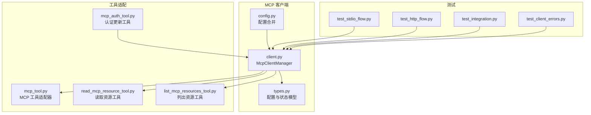
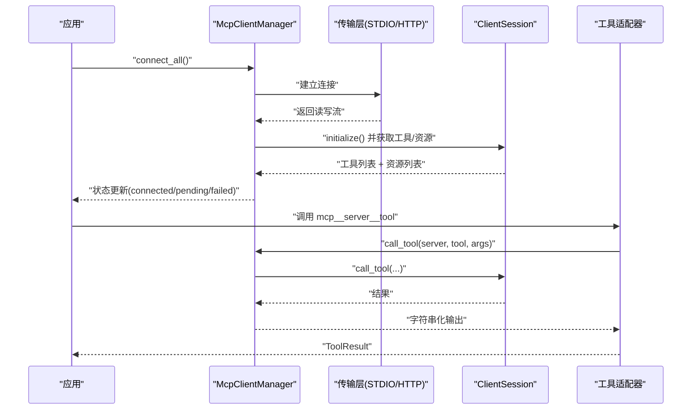
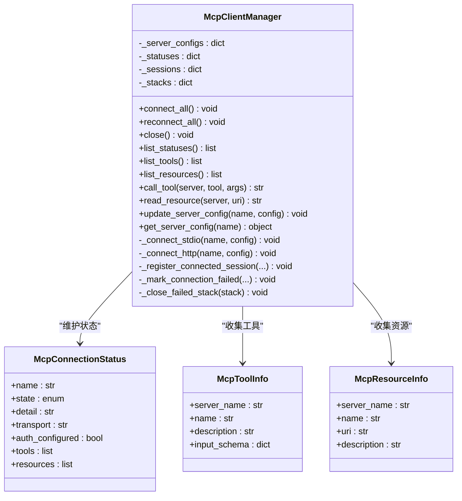
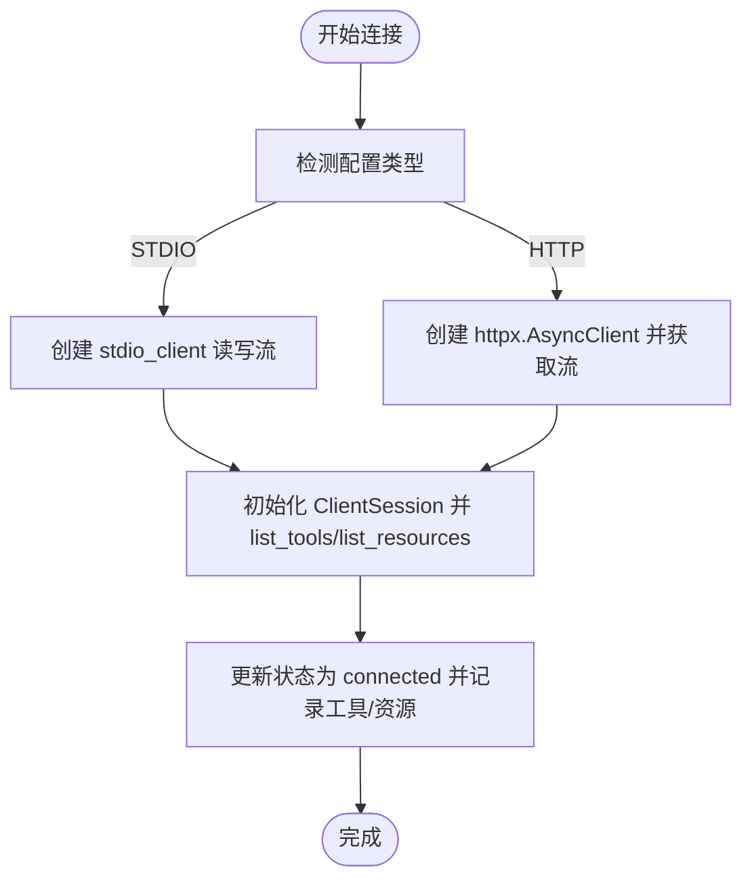
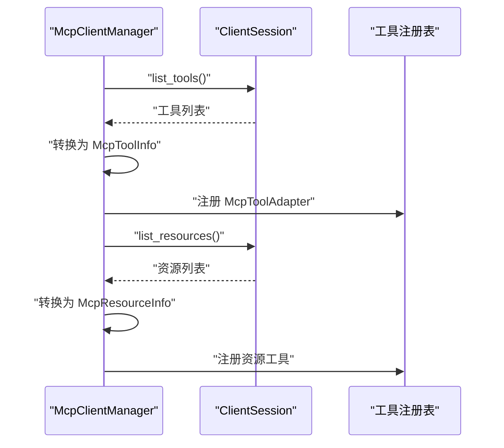
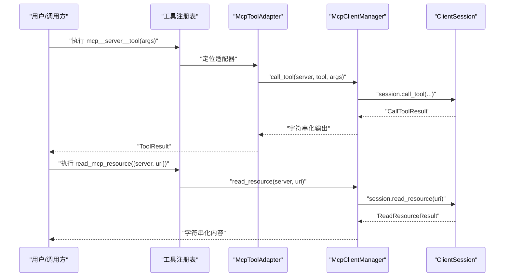
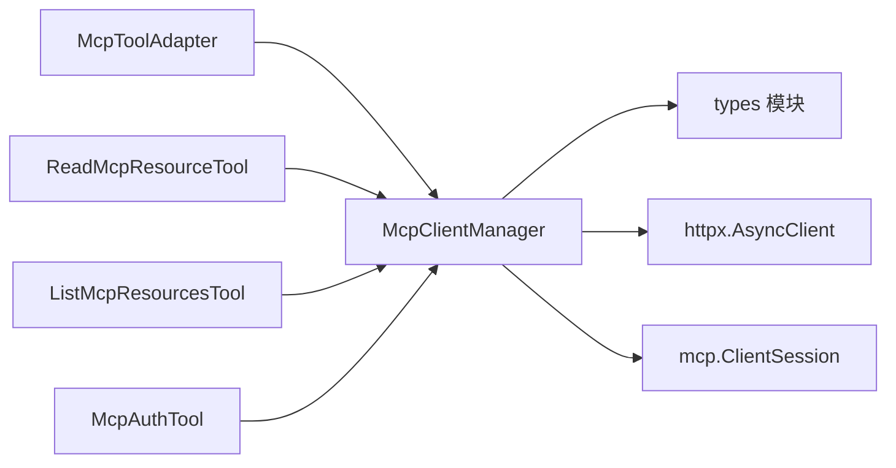

# MCP 客户端实现

<cite>
**本文引用的文件**
- [client.py](file://src/openharness/mcp/client.py)
- [types.py](file://src/openharness/mcp/types.py)
- [config.py](file://src/openharness/mcp/config.py)
- [mcp_tool.py](file://src/openharness/tools/mcp_tool.py)
- [read_mcp_resource_tool.py](file://src/openharness/tools/read_mcp_resource_tool.py)
- [list_mcp_resources_tool.py](file://src/openharness/tools/list_mcp_resources_tool.py)
- [mcp_auth_tool.py](file://src/openharness/tools/mcp_auth_tool.py)
- [test_stdio_flow.py](file://tests/test_mcp/test_stdio_flow.py)
- [test_http_flow.py](file://tests/test_mcp/test_http_flow.py)
- [test_integration.py](file://tests/test_mcp/test_integration.py)
- [test_client_errors.py](file://tests/test_mcp/test_client_errors.py)
- [settings.py](file://src/openharness/config/settings.py)
</cite>

## 目录
1. [简介](#简介)
2. [项目结构](#项目结构)
3. [核心组件](#核心组件)
4. [架构总览](#架构总览)
5. [详细组件分析](#详细组件分析)
6. [依赖关系分析](#依赖关系分析)
7. [性能考量](#性能考量)
8. [故障排查指南](#故障排查指南)
9. [结论](#结论)
10. [附录](#附录)

## 简介
本文件面向 OpenHarness 的 MCP（Model Context Protocol）客户端实现，重点围绕 McpClientManager 类进行系统化说明。内容涵盖连接管理、会话生命周期、错误处理与状态跟踪；详述支持的传输方式（STDIO 与 HTTP）及其配置参数与适用场景；解释工具注册、资源发现、工具调用与资源读取的实现流程；并给出客户端状态管理、自动重连机制、异常处理的最佳实践与使用模式。

## 项目结构
与 MCP 客户端直接相关的模块分布如下：
- mcp 子系统：客户端管理器、类型定义、配置加载
- tools 子系统：MCP 工具适配器与资源工具
- 测试：STDIO 与 HTTP 连接集成测试、错误处理测试、配置合并测试

图表来源
- [client.py:1-299](file://src/openharness/mcp/client.py#L1-L299)
- [types.py:1-77](file://src/openharness/mcp/types.py#L1-L77)
- [config.py:1-17](file://src/openharness/mcp/config.py#L1-L17)
- [mcp_tool.py:1-73](file://src/openharness/tools/mcp_tool.py#L1-L73)
- [read_mcp_resource_tool.py:1-39](file://src/openharness/tools/read_mcp_resource_tool.py#L1-L39)
- [list_mcp_resources_tool.py:1-36](file://src/openharness/tools/list_mcp_resources_tool.py#L1-L36)
- [mcp_auth_tool.py:32-71](file://src/openharness/tools/mcp_auth_tool.py#L32-L71)
- [test_stdio_flow.py:1-55](file://tests/test_mcp/test_stdio_flow.py#L1-L55)
- [test_http_flow.py:1-91](file://tests/test_mcp/test_http_flow.py#L1-L91)
- [test_integration.py:1-80](file://tests/test_mcp/test_integration.py#L1-L80)
- [test_client_errors.py:72-192](file://tests/test_mcp/test_client_errors.py#L72-L192)

章节来源
- [client.py:1-299](file://src/openharness/mcp/client.py#L1-L299)
- [types.py:1-77](file://src/openharness/mcp/types.py#L1-L77)
- [config.py:1-17](file://src/openharness/mcp/config.py#L1-L17)

## 核心组件
- McpClientManager：统一管理多个 MCP 服务器的连接、会话初始化、工具与资源发现、工具调用与资源读取，并维护运行时状态。
- 配置模型：McpStdioServerConfig、McpHttpServerConfig、McpWebSocketServerConfig 及其组合类型 McpServerConfig。
- 状态模型：McpConnectionStatus、McpToolInfo、McpResourceInfo。
- 工具适配：将 MCP 工具转换为 OpenHarness 工具注册表中的可用工具；提供资源读取与资源列表工具。

章节来源
- [client.py:29-299](file://src/openharness/mcp/client.py#L29-L299)
- [types.py:11-77](file://src/openharness/mcp/types.py#L11-L77)

## 架构总览
MCP 客户端采用“管理器 + 传输抽象 + 工具适配”的分层设计：
- 管理器负责连接与会话生命周期管理、状态聚合与错误传播。
- 传输层通过 STDIO 或 HTTP 实现流式通信，封装到 ClientSession。
- 工具层将 MCP 的工具与资源能力暴露为 OpenHarness 工具注册表中的具体工具。

图表来源
- [client.py:45-299](file://src/openharness/mcp/client.py#L45-L299)
- [mcp_tool.py:26-36](file://src/openharness/tools/mcp_tool.py#L26-L36)

## 详细组件分析

### McpClientManager 设计与实现
- 连接管理
  - 支持多服务器并发连接，按配置类型选择 STDIO 或 HTTP 传输。
  - 使用 AsyncExitStack 管理连接期间的资源生命周期，确保异常路径也能清理。
  - 对于不支持的传输类型，记录失败状态但不影响其他服务器的连接尝试。
- 会话生命周期
  - 建立连接后创建 ClientSession，执行 initialize() 后调用 list_tools() 与 list_resources() 发现能力。
  - 将工具与资源元数据转换为 McpToolInfo/McpResourceInfo 并存入状态。
- 错误处理
  - 连接失败时记录失败状态，保留 transport、auth_configured、detail 等信息。
  - 工具调用与资源读取在会话不存在或异常时抛出 McpServerNotConnectedError，便于上层统一处理。
- 自动重连
  - 提供 reconnect_all()，内部先 close() 再重新 connect_all()，并重置状态为 pending。
- 状态管理
  - 维护每个服务器的 McpConnectionStatus，包含 state、transport、auth_configured、tools、resources 等字段。
  - 提供 list_statuses()、list_tools()、list_resources() 用于查询。

图表来源
- [client.py:29-299](file://src/openharness/mcp/client.py#L29-L299)
- [types.py:46-77](file://src/openharness/mcp/types.py#L46-L77)

章节来源
- [client.py:29-299](file://src/openharness/mcp/client.py#L29-L299)

### 传输方式：STDIO 与 HTTP

- STDIO 传输
  - 配置项：command、args、env、cwd。
  - 适用场景：本地可执行程序作为 MCP 服务器，适合开发调试与本地集成。
  - 连接流程：通过 stdio_client 创建读写流，进入 AsyncExitStack 生命周期，随后初始化 ClientSession 并发现工具/资源。
  - 认证：通过 env 注入环境变量（如令牌）实现。
- HTTP 传输
  - 配置项：url、headers。
  - 适用场景：远程或容器内 MCP 服务，便于网络隔离与权限控制。
  - 连接流程：使用 httpx.AsyncClient 创建 HTTP 客户端，通过 streamable_http_client 获取读写流与会话标识，初始化 ClientSession 并发现工具/资源。
  - 认证：通过 headers 注入 Authorization 等头部实现。

图表来源
- [client.py:180-250](file://src/openharness/mcp/client.py#L180-L250)
- [types.py:11-35](file://src/openharness/mcp/types.py#L11-L35)

章节来源
- [client.py:180-250](file://src/openharness/mcp/client.py#L180-L250)
- [types.py:11-35](file://src/openharness/mcp/types.py#L11-L35)

### 工具注册与资源发现
- 工具注册
  - 通过 session.list_tools() 获取工具清单，转换为 McpToolInfo 列表，再由工具适配器 McpToolAdapter 将其包装为 OpenHarness 工具注册表中的具体工具。
  - 工具名称格式为 mcp__{server}__{tool}，输入模型基于 JSON Schema 动态生成。
- 资源发现
  - 通过 session.list_resources() 获取资源清单，转换为 McpResourceInfo 列表，供资源工具使用。
  - 若服务未实现资源方法，捕获特定错误并容忍继续运行。

图表来源
- [client.py:252-299](file://src/openharness/mcp/client.py#L252-L299)
- [mcp_tool.py:14-36](file://src/openharness/tools/mcp_tool.py#L14-L36)
- [list_mcp_resources_tool.py:15-36](file://src/openharness/tools/list_mcp_resources_tool.py#L15-L36)

章节来源
- [client.py:252-299](file://src/openharness/mcp/client.py#L252-L299)
- [mcp_tool.py:14-36](file://src/openharness/tools/mcp_tool.py#L14-L36)
- [list_mcp_resources_tool.py:15-36](file://src/openharness/tools/list_mcp_resources_tool.py#L15-L36)

### 工具调用与资源读取
- 工具调用
  - 从注册表获取 mcp__server__tool 对应的工具，解析输入模型后调用 manager.call_tool()。
  - 返回值会将内容序列化为字符串，若无文本内容则回退到结构化内容或空输出提示。
- 资源读取
  - 通过 read_mcp_resource 工具传入 server 与 uri，调用 manager.read_resource()。
  - 返回值将资源内容拼接为字符串，支持文本与二进制 blob 的混合输出。

图表来源
- [mcp_tool.py:26-36](file://src/openharness/tools/mcp_tool.py#L26-L36)
- [read_mcp_resource_tool.py:32-38](file://src/openharness/tools/read_mcp_resource_tool.py#L32-L38)
- [client.py:129-178](file://src/openharness/mcp/client.py#L129-L178)

章节来源
- [mcp_tool.py:26-36](file://src/openharness/tools/mcp_tool.py#L26-L36)
- [read_mcp_resource_tool.py:32-38](file://src/openharness/tools/read_mcp_resource_tool.py#L32-L38)
- [client.py:129-178](file://src/openharness/mcp/client.py#L129-L178)

### 配置加载与合并
- 配置来源
  - settings.mcp_servers：全局设置中的 MCP 服务器配置。
  - 插件 mcp_servers：启用插件提供的 MCP 服务器配置，键名采用 plugin:name 格式避免冲突。
- 加载流程
  - load_mcp_server_configs() 合并 settings 与插件配置，后者优先级更高（通过 setdefault 实现）。

章节来源
- [config.py:8-17](file://src/openharness/mcp/config.py#L8-L17)
- [test_integration.py:35-50](file://tests/test_mcp/test_integration.py#L35-L50)

### 认证与自动重连
- 认证更新
  - mcp_auth_tool 支持为不同传输类型设置认证：STDIO 使用 env（如 MCP_AUTH_TOKEN），HTTP/WS 使用 headers（默认 Authorization）。
  - 更新配置后可调用 reconnect_all() 触发重连。
- 自动重连
  - reconnect_all() 先关闭现有连接，重置状态为 pending，再重新连接所有服务器。

章节来源
- [mcp_auth_tool.py:32-71](file://src/openharness/tools/mcp_auth_tool.py#L32-L71)
- [client.py:61-68](file://src/openharness/mcp/client.py#L61-L68)

## 依赖关系分析
- 外部库
  - mcp：ClientSession、STDIO/HTTP 传输客户端。
  - httpx：HTTP 客户端，用于 HTTP 传输。
- 内部依赖
  - types：配置与状态模型。
  - tools：工具适配器与资源工具依赖 manager 的接口。
  - config：配置合并逻辑。

图表来源
- [client.py:10-14](file://src/openharness/mcp/client.py#L10-L14)
- [mcp_tool.py:9-11](file://src/openharness/tools/mcp_tool.py#L9-L11)
- [read_mcp_resource_tool.py:7-8](file://src/openharness/tools/read_mcp_resource_tool.py#L7-L8)
- [list_mcp_resources_tool.py:7-8](file://src/openharness/tools/list_mcp_resources_tool.py#L7-L8)
- [mcp_auth_tool.py:32-71](file://src/openharness/tools/mcp_auth_tool.py#L32-L71)

章节来源
- [client.py:10-14](file://src/openharness/mcp/client.py#L10-L14)
- [mcp_tool.py:9-11](file://src/openharness/tools/mcp_tool.py#L9-L11)
- [read_mcp_resource_tool.py:7-8](file://src/openharness/tools/read_mcp_resource_tool.py#L7-L8)
- [list_mcp_resources_tool.py:7-8](file://src/openharness/tools/list_mcp_resources_tool.py#L7-L8)
- [mcp_auth_tool.py:32-71](file://src/openharness/tools/mcp_auth_tool.py#L32-L71)

## 性能考量
- 连接复用：ClientSession 在 AsyncExitStack 中管理，避免重复握手开销；建议在稳定运行期避免频繁重建。
- 批量操作：工具与资源列表一次性获取，减少多次往返；调用链路尽量串行化以降低并发竞争。
- 资源清理：异常路径通过 _close_failed_stack() 与 _mark_connection_failed() 保证资源释放与状态记录，避免泄漏。
- I/O 开销：HTTP 传输依赖 httpx.AsyncClient，建议在高并发场景下复用客户端实例（当前实现已按连接粒度管理）。

## 故障排查指南
- 连接失败
  - 检查配置类型是否受当前构建支持；不支持的类型会被标记为 failed。
  - 查看状态 detail 字段获取异常摘要；STDIO 注意命令/参数/环境变量；HTTP 注意 URL 与 headers。
- 工具调用失败
  - 当 session 不存在或异常时会抛出 McpServerNotConnectedError；确认服务器已成功连接且会话未中断。
- 资源读取失败
  - 同样会抛出 McpServerNotConnectedError；检查服务器是否实现资源方法，或是否存在权限问题。
- 资源方法缺失
  - _register_connected_session 对“Method not found”异常进行容忍处理，仅记录日志并继续运行。
- 清理异常
  - _close_failed_stack 对 BaseExceptionGroup 等异常进行抑制处理，避免二次异常掩盖主因。

章节来源
- [client.py:53-101](file://src/openharness/mcp/client.py#L53-L101)
- [client.py:129-178](file://src/openharness/mcp/client.py#L129-L178)
- [client.py:266-270](file://src/openharness/mcp/client.py#L266-L270)
- [test_client_errors.py:72-192](file://tests/test_mcp/test_client_errors.py#L72-L192)

## 结论
McpClientManager 提供了对多 MCP 服务器的统一接入与生命周期管理，覆盖了连接、会话初始化、工具与资源发现、调用与读取等关键环节。通过 STDIO 与 HTTP 两种传输方式满足本地与远程场景需求，并结合工具适配器与资源工具形成完整的工具生态。配合认证更新与自动重连机制，可在复杂环境中保持稳定运行。建议在生产使用中关注状态监控、异常分类与资源清理，确保系统的健壮性与可观测性。

## 附录

### 使用模式与最佳实践
- 初始化与连接
  - 使用 load_mcp_server_configs() 合并配置，然后构造 McpClientManager 并调用 connect_all()。
  - 在应用启动阶段完成连接，运行期通过 list_statuses() 监控状态。
- 工具与资源使用
  - 通过 create_default_tool_registry(manager) 获取工具注册表，直接调用 mcp__server__tool 与 read_mcp_resource。
  - 对于无资源的服务，list_mcp_resources_tool 仍可列出可用资源，便于统一展示。
- 认证与重连
  - 通过 mcp_auth_tool 更新认证信息后，调用 reconnect_all() 生效。
  - 对于网络波动或服务重启，reconnect_all() 可快速恢复连接。
- 错误处理
  - 捕获 McpServerNotConnectedError 并根据业务语义决定重试或降级策略。
  - 对于 Method not found 等兼容性问题，保持容忍策略以提升稳定性。

章节来源
- [test_stdio_flow.py:16-55](file://tests/test_mcp/test_stdio_flow.py#L16-L55)
- [test_http_flow.py:19-91](file://tests/test_mcp/test_http_flow.py#L19-L91)
- [test_integration.py:52-80](file://tests/test_mcp/test_integration.py#L52-L80)
- [mcp_auth_tool.py:32-71](file://src/openharness/tools/mcp_auth_tool.py#L32-L71)