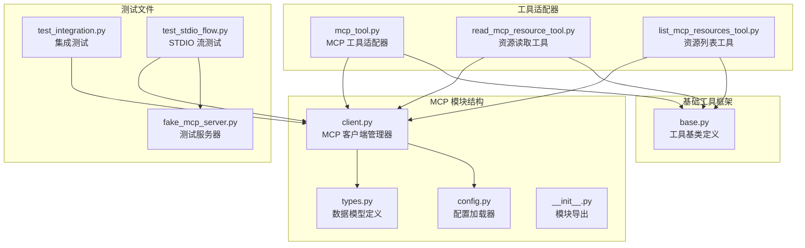
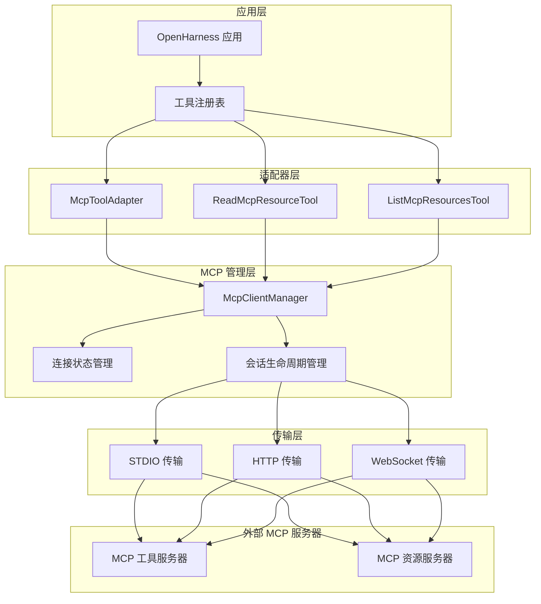
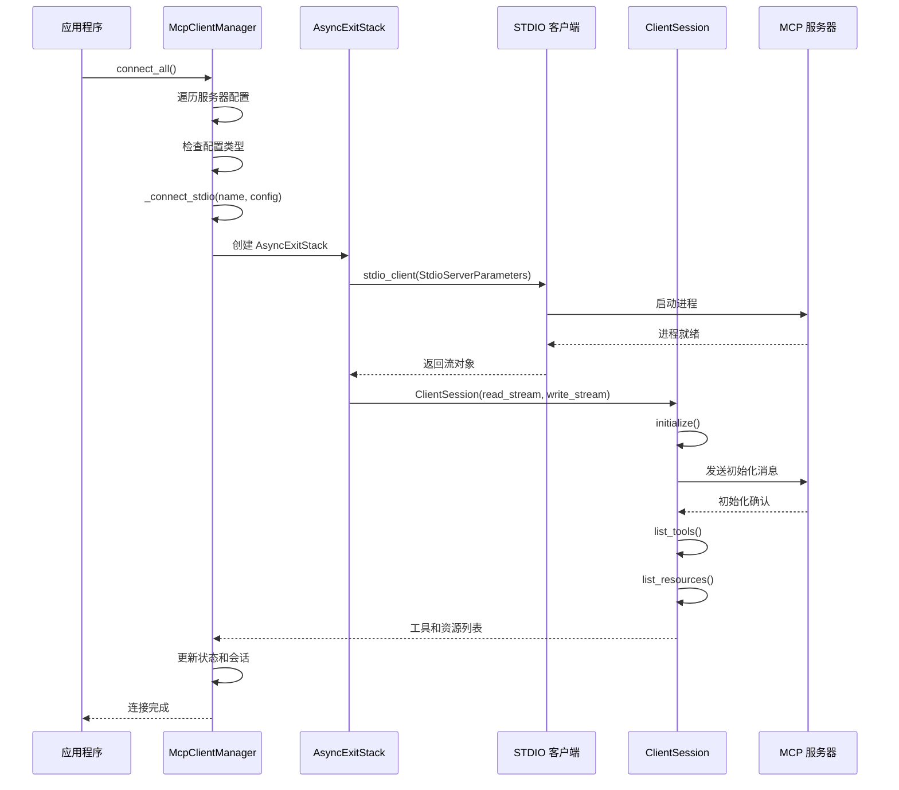
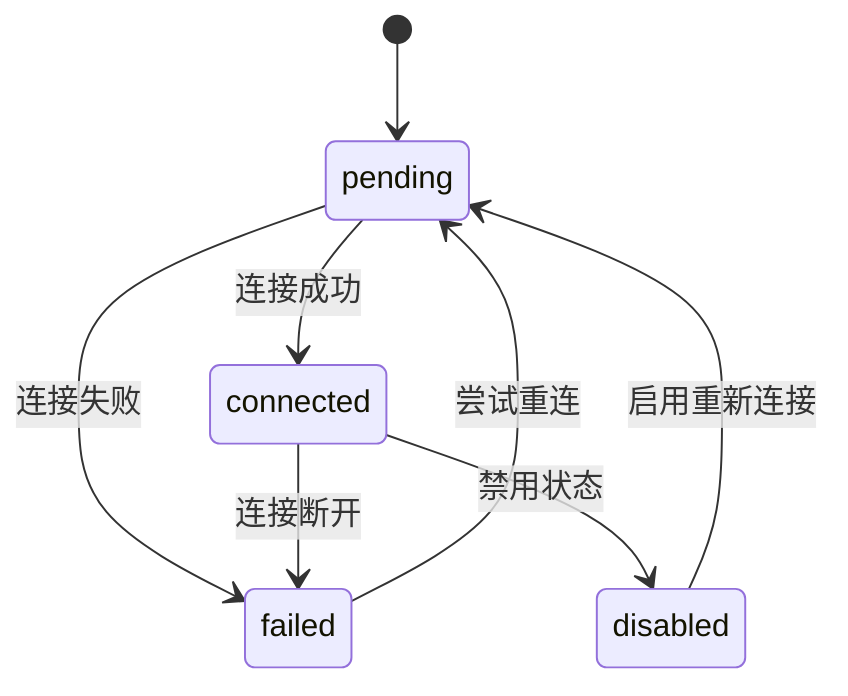
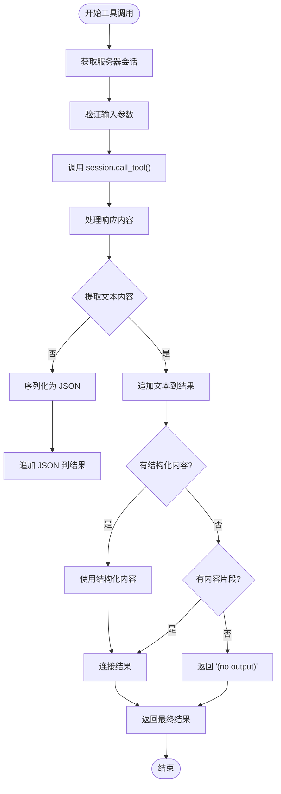
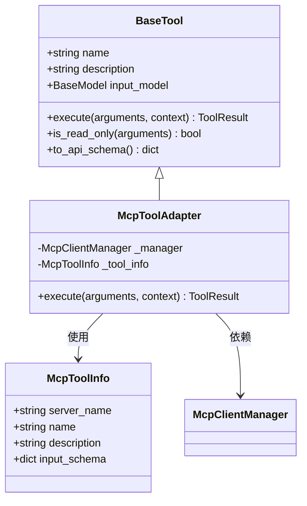
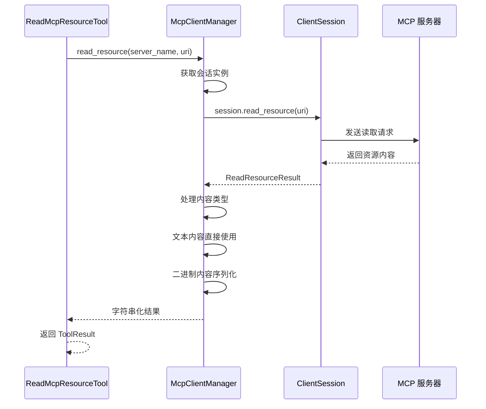
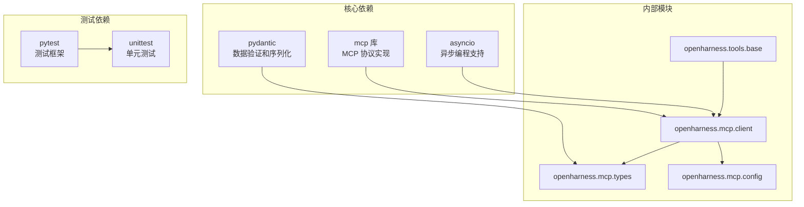
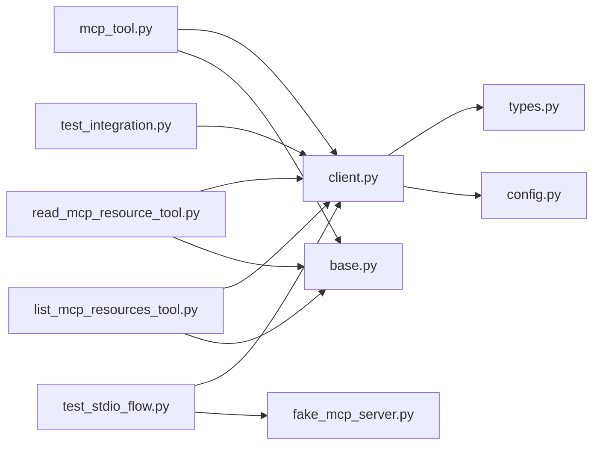

# MCP 客户端实现

<cite>
**本文档引用的文件**
- [client.py](file://src/openharness/mcp/client.py)
- [types.py](file://src/openharness/mcp/types.py)
- [config.py](file://src/openharness/mcp/config.py)
- [mcp_tool.py](file://src/openharness/tools/mcp_tool.py)
- [read_mcp_resource_tool.py](file://src/openharness/tools/read_mcp_resource_tool.py)
- [list_mcp_resources_tool.py](file://src/openharness/tools/list_mcp_resources_tool.py)
- [base.py](file://src/openharness/tools/base.py)
- [test_integration.py](file://tests/test_mcp/test_integration.py)
- [test_stdio_flow.py](file://tests/test_mcp/test_stdio_flow.py)
- [fake_mcp_server.py](file://tests/fixtures/fake_mcp_server.py)
</cite>

## 目录
1. [简介](#简介)
2. [项目结构](#项目结构)
3. [核心组件](#核心组件)
4. [架构概览](#架构概览)
5. [详细组件分析](#详细组件分析)
6. [依赖分析](#依赖分析)
7. [性能考虑](#性能考虑)
8. [故障排除指南](#故障排除指南)
9. [结论](#结论)
10. [附录](#附录)

## 简介

本文档详细介绍了 OpenHarness 项目中的 MCP（Model Context Protocol）客户端实现。MCP 是一个用于在 AI 应用程序和外部工具/资源之间建立标准化通信协议的框架。本实现提供了完整的 MCP 客户端管理器，支持多种传输方式（当前主要支持 STDIO），实现了连接管理、会话生命周期控制、工具调用和资源访问等功能。

该实现基于 Python 异步编程模型，使用 `mcp` 库作为底层通信层，通过 `AsyncExitStack` 确保资源的正确清理。系统设计遵循松耦合原则，通过适配器模式将 MCP 工具和资源暴露为标准的 OpenHarness 工具接口。

## 项目结构

OpenHarness 的 MCP 实现位于 `src/openharness/mcp/` 目录下，包含以下关键文件：



**图表来源**
- [client.py:1-175](file://src/openharness/mcp/client.py#L1-L175)
- [types.py:1-77](file://src/openharness/mcp/types.py#L1-L77)
- [config.py:1-17](file://src/openharness/mcp/config.py#L1-L17)

**章节来源**
- [client.py:1-175](file://src/openharness/mcp/client.py#L1-L175)
- [types.py:1-77](file://src/openharness/mcp/types.py#L1-L77)
- [config.py:1-17](file://src/openharness/mcp/config.py#L1-L17)

## 核心组件

### McpClientManager 类

`McpClientManager` 是 MCP 客户端实现的核心类，负责管理所有 MCP 服务器连接和操作。该类提供了完整的连接生命周期管理功能。

#### 主要职责
- 连接管理：建立和维护与 MCP 服务器的连接
- 会话生命周期：管理 ClientSession 的创建、初始化和清理
- 工具调用：执行 MCP 工具并处理返回结果
- 资源访问：读取 MCP 资源并格式化输出
- 状态跟踪：监控所有连接的状态变化

#### 关键属性
- `_server_configs`: 存储服务器配置字典
- `_statuses`: 追踪每个服务器的连接状态
- `_sessions`: 维护活跃的 MCP 会话
- `_stacks`: 管理资源清理的 AsyncExitStack

**章节来源**
- [client.py:20-175](file://src/openharness/mcp/client.py#L20-L175)

### 数据模型

系统使用 Pydantic 模型来定义 MCP 配置和状态信息：

#### 服务器配置模型
- `McpStdioServerConfig`: STDIO 传输配置
- `McpHttpServerConfig`: HTTP 传输配置  
- `McpWebSocketServerConfig`: WebSocket 传输配置
- `McpServerConfig`: 服务器配置联合类型

#### 元数据模型
- `McpToolInfo`: 工具元数据信息
- `McpResourceInfo`: 资源元数据信息
- `McpConnectionStatus`: 连接状态信息

**章节来源**
- [types.py:11-77](file://src/openharness/mcp/types.py#L11-L77)

## 架构概览

MCP 客户端实现采用分层架构设计，确保了良好的可扩展性和可维护性：



**图表来源**
- [client.py:20-175](file://src/openharness/mcp/client.py#L20-L175)
- [mcp_tool.py:14-56](file://src/openharness/tools/mcp_tool.py#L14-L56)
- [read_mcp_resource_tool.py:18-36](file://src/openharness/tools/read_mcp_resource_tool.py#L18-L36)
- [list_mcp_resources_tool.py:15-37](file://src/openharness/tools/list_mcp_resources_tool.py#L15-L37)

## 详细组件分析

### 连接管理实现

#### STDIO 传输连接流程



**图表来源**
- [client.py:121-175](file://src/openharness/mcp/client.py#L121-L175)

#### 连接状态管理

系统使用 `McpConnectionStatus` 模型来跟踪每个服务器的连接状态：



**图表来源**
- [types.py:66-77](file://src/openharness/mcp/types.py#L66-L77)

**章节来源**
- [client.py:36-57](file://src/openharness/mcp/client.py#L36-L57)
- [client.py:121-175](file://src/openharness/mcp/client.py#L121-L175)

### 工具调用实现

#### 参数序列化和结果处理



**图表来源**
- [client.py:92-106](file://src/openharness/mcp/client.py#L92-L106)

#### 工具适配器模式

MCP 工具通过 `McpToolAdapter` 适配器转换为标准 OpenHarness 工具：



**图表来源**
- [mcp_tool.py:14-34](file://src/openharness/tools/mcp_tool.py#L14-L34)
- [base.py:30-52](file://src/openharness/tools/base.py#L30-L52)

**章节来源**
- [mcp_tool.py:14-56](file://src/openharness/tools/mcp_tool.py#L14-L56)
- [base.py:30-76](file://src/openharness/tools/base.py#L30-L76)

### 资源访问实现

#### 资源读取流程



**图表来源**
- [client.py:108-119](file://src/openharness/mcp/client.py#L108-L119)

#### 资源列表工具

系统提供了专门的工具来列出所有可用的 MCP 资源：

**章节来源**
- [read_mcp_resource_tool.py:18-36](file://src/openharness/tools/read_mcp_resource_tool.py#L18-L36)
- [list_mcp_resources_tool.py:15-37](file://src/openharness/tools/list_mcp_resources_tool.py#L15-L37)

### 错误处理机制

系统实现了多层次的错误处理机制：

#### 连接错误处理
- 使用 `try-except` 块捕获连接异常
- 通过 `AsyncExitStack` 确保资源正确清理
- 设置详细的错误状态信息

#### 工具调用错误处理
- 捕获并处理工具调用异常
- 提供默认回退值（如 "(no output)"）
- 记录详细的错误信息

#### 资源访问错误处理
- 处理不同内容类型的读取
- 提供类型安全的内容访问
- 统一的字符串化输出

**章节来源**
- [client.py:166-175](file://src/openharness/mcp/client.py#L166-L175)

## 依赖分析

### 外部依赖

系统依赖以下关键外部库：



**图表来源**
- [client.py:8-17](file://src/openharness/mcp/client.py#L8-L17)
- [types.py:5-8](file://src/openharness/mcp/types.py#L5-L8)

### 内部模块依赖



**图表来源**
- [client.py:12-17](file://src/openharness/mcp/client.py#L12-L17)
- [mcp_tool.py:9-11](file://src/openharness/tools/mcp_tool.py#L9-L11)

**章节来源**
- [client.py:12-17](file://src/openharness/mcp/client.py#L12-L17)
- [mcp_tool.py:9-11](file://src/openharness/tools/mcp_tool.py#L9-L11)

## 性能考虑

### 连接池管理

系统通过 `AsyncExitStack` 实现高效的资源管理：
- 自动清理已断开的连接
- 避免内存泄漏
- 支持优雅关闭

### 异步操作优化

- 使用 `async/await` 模式避免阻塞
- 并行处理多个服务器连接
- 流式处理大文件内容

### 缓存策略

- 工具和资源元数据缓存
- 连接状态快速查询
- 减少重复的网络往返

### 最佳实践建议

1. **连接复用**: 在应用生命周期内复用连接而非频繁创建/销毁
2. **超时设置**: 为长时间运行的操作设置合理的超时时间
3. **错误重试**: 实现指数退避的重试机制
4. **资源监控**: 监控连接状态和性能指标

## 故障排除指南

### 常见问题诊断

#### 连接失败
- 检查服务器命令路径是否正确
- 验证环境变量配置
- 确认服务器进程启动日志

#### 工具调用错误
- 验证输入参数格式
- 检查工具名称拼写
- 确认服务器支持该工具

#### 资源访问问题
- 验证资源 URI 格式
- 检查权限设置
- 确认资源存在性

### 调试技巧

使用测试服务器进行本地调试：
- 参考 `fake_mcp_server.py` 进行功能验证
- 利用集成测试检查完整流程
- 通过单元测试验证边界条件

**章节来源**
- [test_integration.py:17-80](file://tests/test_mcp/test_integration.py#L17-L80)
- [test_stdio_flow.py:16-55](file://tests/test_mcp/test_stdio_flow.py#L16-L55)

## 结论

OpenHarness 的 MCP 客户端实现提供了一个完整、健壮且易于使用的 MCP 客户端解决方案。该实现具有以下特点：

1. **模块化设计**: 清晰的分层架构便于维护和扩展
2. **异步支持**: 完全基于 asyncio 的异步实现
3. **类型安全**: 使用 Pydantic 模型确保数据完整性
4. **错误处理**: 完善的错误处理和恢复机制
5. **测试覆盖**: 全面的单元测试和集成测试

该实现为开发者提供了将 MCP 工具和资源无缝集成到 OpenHarness 生态系统的能力，同时保持了良好的性能和可靠性。

## 附录

### 完整使用示例

#### 基本连接配置

```python
# 创建 MCP 服务器配置
config = {
    "my_server": McpStdioServerConfig(
        command="python",
        args=["/path/to/server.py"],
        env={"API_KEY": "secret"}
    )
}

# 初始化客户端管理器
manager = McpClientManager(config)

# 连接所有服务器
await manager.connect_all()

# 检查连接状态
statuses = manager.list_statuses()
```

#### 工具调用示例

```python
# 获取工具注册表
registry = create_default_tool_registry(manager)

# 查找特定工具
tool = registry.get("mcp__my_server__hello")

# 执行工具
if tool:
    result = await tool.execute(
        tool.input_model.model_validate({"name": "world"}),
        ToolExecutionContext(cwd=Path("."))
    )
    print(result.output)
```

#### 资源访问示例

```python
# 列出所有资源
list_tool = registry.get("list_mcp_resources")
if list_tool:
    result = await list_tool.execute(
        list_tool.input_model(),
        ToolExecutionContext(cwd=Path("."))
    )
    print(result.output)

# 读取特定资源
resource_tool = registry.get("read_mcp_resource")
if resource_tool:
    result = await resource_tool.execute(
        resource_tool.input_model.model_validate({
            "server": "my_server",
            "uri": "mcp://example/resource"
        }),
        ToolExecutionContext(cwd=Path("."))
    )
    print(result.output)
```

#### 重连机制使用

```python
# 触发重连
await manager.reconnect_all()

# 或者单独更新配置
manager.update_server_config("my_server", new_config)
await manager.reconnect_all()
```

**章节来源**
- [test_stdio_flow.py:17-54](file://tests/test_mcp/test_stdio_flow.py#L17-L54)
- [test_integration.py:52-80](file://tests/test_mcp/test_integration.py#L52-L80)