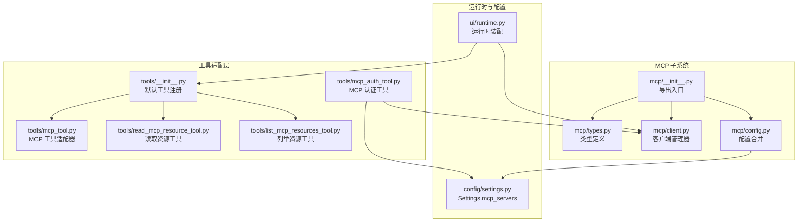
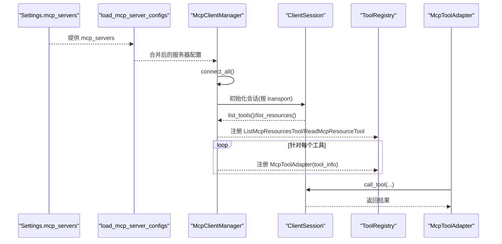
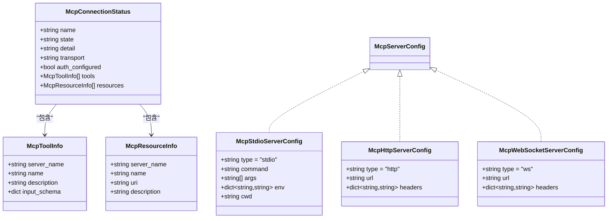
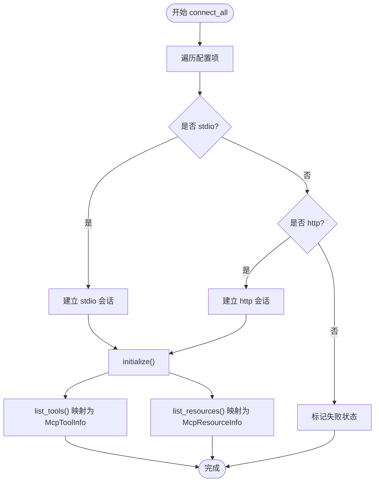
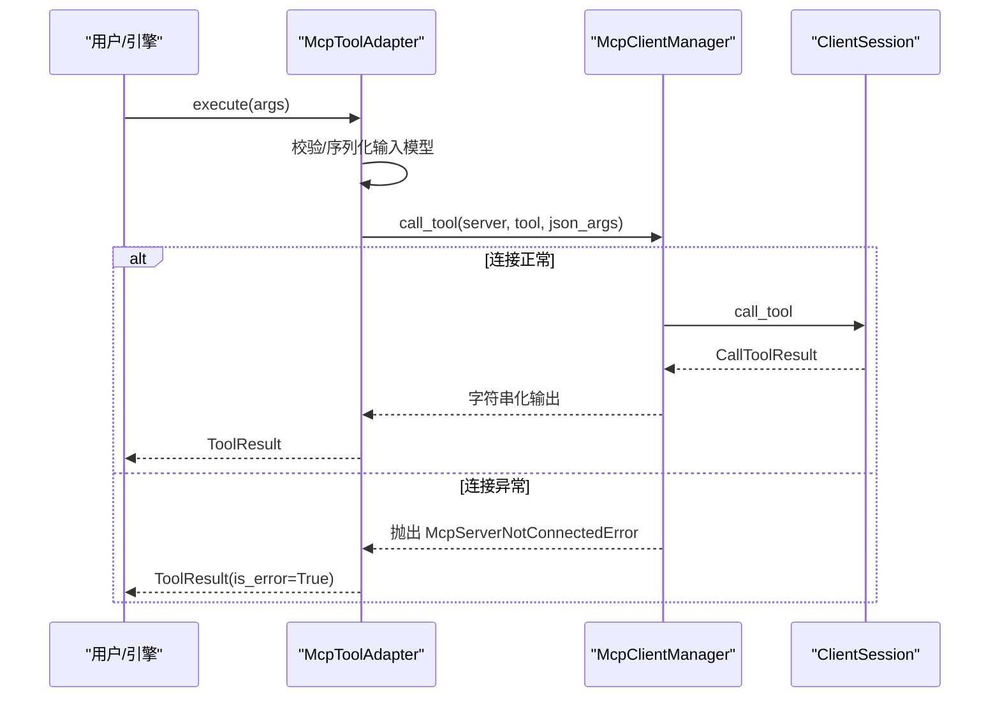
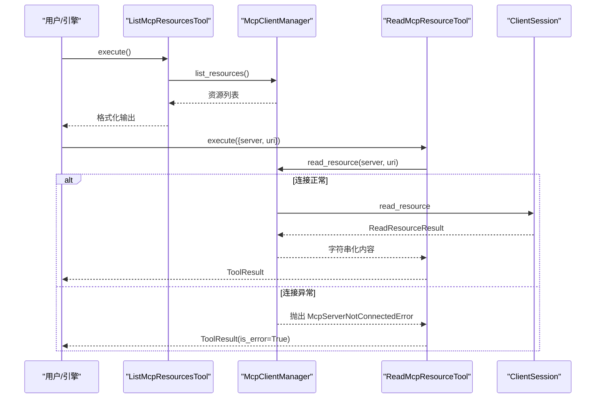
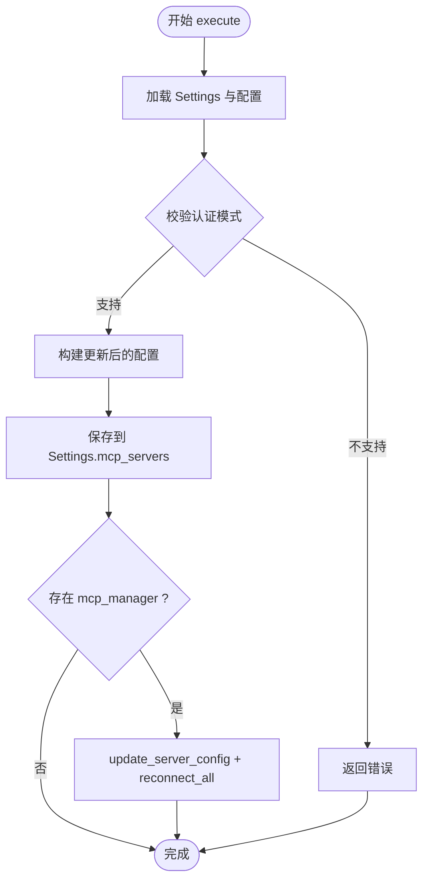
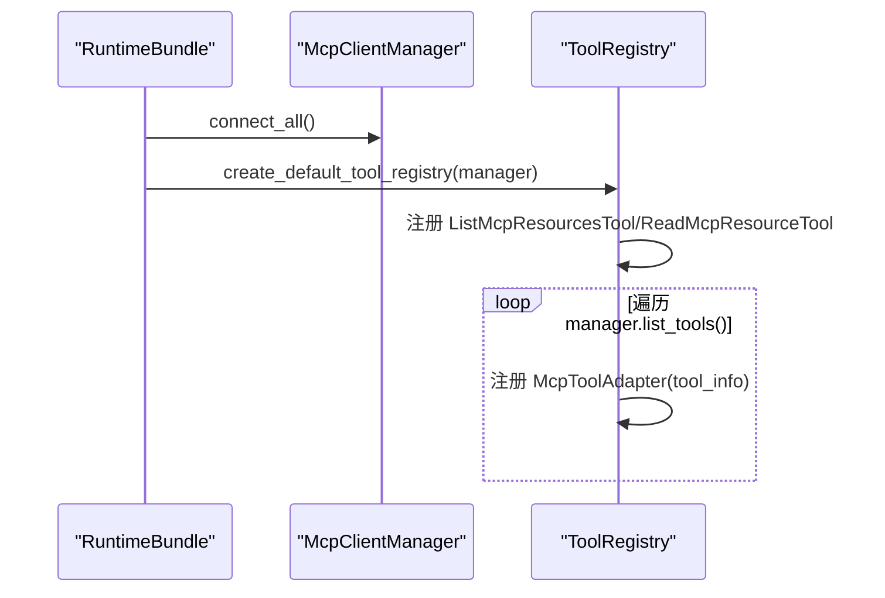
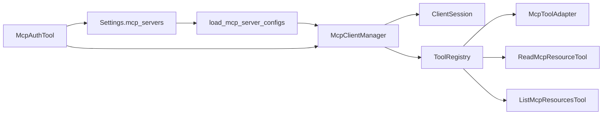

# MCP 工具和资源

<cite>
**本文引用的文件**
- [mcp/__init__.py](file://src/openharness/mcp/__init__.py)
- [mcp/types.py](file://src/openharness/mcp/types.py)
- [mcp/client.py](file://src/openharness/mcp/client.py)
- [mcp/config.py](file://src/openharness/mcp/config.py)
- [tools/mcp_tool.py](file://src/openharness/tools/mcp_tool.py)
- [tools/read_mcp_resource_tool.py](file://src/openharness/tools/read_mcp_resource_tool.py)
- [tools/list_mcp_resources_tool.py](file://src/openharness/tools/list_mcp_resources_tool.py)
- [tools/mcp_auth_tool.py](file://src/openharness/tools/mcp_auth_tool.py)
- [tools/__init__.py](file://src/openharness/tools/__init__.py)
- [ui/runtime.py](file://src/openharness/ui/runtime.py)
- [config/settings.py](file://src/openharness/config/settings.py)
- [tests/test_mcp/test_integration.py](file://tests/test_mcp/test_integration.py)
- [tests/test_mcp/test_stdio_flow.py](file://tests/test_mcp/test_stdio_flow.py)
- [tests/test_mcp/test_http_flow.py](file://tests/test_mcp/test_http_flow.py)
- [tests/fixtures/fake_mcp_server.py](file://tests/fixtures/fake_mcp_server.py)
</cite>

## 目录
1. [简介](#简介)
2. [项目结构](#项目结构)
3. [核心组件](#核心组件)
4. [架构总览](#架构总览)
5. [详细组件分析](#详细组件分析)
6. [依赖关系分析](#依赖关系分析)
7. [性能考虑](#性能考虑)
8. [故障排查指南](#故障排查指南)
9. [结论](#结论)
10. [附录：类型定义与使用示例](#附录类型定义与使用示例)

## 简介
本文件系统性阐述 OpenHarness 中的 MCP（Model Context Protocol）工具与资源管理能力，重点说明以下方面：
- 概念区分：工具与资源的职责边界与交互方式
- 集成方式：MCP 服务器配置加载、连接管理、工具与资源暴露到 OpenHarness 工具体系
- 流程细节：工具的定义、注册、调用（含参数校验）、结果处理；资源的访问机制（URI、内容类型、读取）
- 类型模型：McpToolInfo、McpResourceInfo、McpConnectionStatus 等
- 实践指南：在 OpenHarness 中如何使用 MCP 工具与资源，以及与内置工具的协同

## 项目结构
围绕 MCP 的核心代码分布在如下模块：
- mcp 子系统：类型定义、客户端管理器、配置合并
- tools 子系统：MCP 工具适配器、资源读取与列举工具、认证配置工具
- 运行时集成：UI/CLI 运行时装配 McpClientManager 并注入工具注册表
- 配置：Settings 中对 mcp_servers 字段的承载与持久化

**图表来源**
- [mcp/__init__.py:1-80](file://src/openharness/mcp/__init__.py#L1-L80)
- [mcp/types.py:1-77](file://src/openharness/mcp/types.py#L1-L77)
- [mcp/client.py:1-299](file://src/openharness/mcp/client.py#L1-L299)
- [mcp/config.py:1-17](file://src/openharness/mcp/config.py#L1-L17)
- [tools/mcp_tool.py:1-73](file://src/openharness/tools/mcp_tool.py#L1-L73)
- [tools/read_mcp_resource_tool.py:1-39](file://src/openharness/tools/read_mcp_resource_tool.py#L1-L39)
- [tools/list_mcp_resources_tool.py:1-37](file://src/openharness/tools/list_mcp_resources_tool.py#L1-L37)
- [tools/mcp_auth_tool.py:1-72](file://src/openharness/tools/mcp_auth_tool.py#L1-L72)
- [tools/__init__.py:89-107](file://src/openharness/tools/__init__.py#L89-L107)
- [ui/runtime.py:120-191](file://src/openharness/ui/runtime.py#L120-L191)
- [config/settings.py:1-200](file://src/openharness/config/settings.py#L1-L200)

**章节来源**
- [mcp/__init__.py:1-80](file://src/openharness/mcp/__init__.py#L1-L80)
- [mcp/types.py:1-77](file://src/openharness/mcp/types.py#L1-L77)
- [mcp/client.py:1-299](file://src/openharness/mcp/client.py#L1-L299)
- [mcp/config.py:1-17](file://src/openharness/mcp/config.py#L1-L17)
- [tools/mcp_tool.py:1-73](file://src/openharness/tools/mcp_tool.py#L1-L73)
- [tools/read_mcp_resource_tool.py:1-39](file://src/openharness/tools/read_mcp_resource_tool.py#L1-L39)
- [tools/list_mcp_resources_tool.py:1-37](file://src/openharness/tools/list_mcp_resources_tool.py#L1-L37)
- [tools/mcp_auth_tool.py:1-72](file://src/openharness/tools/mcp_auth_tool.py#L1-L72)
- [tools/__init__.py:89-107](file://src/openharness/tools/__init__.py#L89-L107)
- [ui/runtime.py:120-191](file://src/openharness/ui/runtime.py#L120-L191)
- [config/settings.py:1-200](file://src/openharness/config/settings.py#L1-L200)

## 核心组件
- McpClientManager：统一管理 MCP 服务器连接、会话生命周期、工具与资源发现、远程调用与资源读取
- McpToolInfo / McpResourceInfo：工具与资源的元数据载体
- McpConnectionStatus：运行时状态快照（连接状态、传输类型、工具/资源清单）
- 工具适配器：将 MCP 工具转换为 OpenHarness 原生工具，自动根据输入模式生成 Pydantic 输入模型
- 资源工具：提供“列举资源”和“按服务器+URI 读取资源”的原生工具
- 认证工具：支持为不同传输类型的 MCP 服务器配置认证（环境变量、请求头、Bearer）

**章节来源**
- [mcp/client.py:29-299](file://src/openharness/mcp/client.py#L29-L299)
- [mcp/types.py:46-77](file://src/openharness/mcp/types.py#L46-L77)
- [tools/mcp_tool.py:14-73](file://src/openharness/tools/mcp_tool.py#L14-L73)
- [tools/read_mcp_resource_tool.py:18-39](file://src/openharness/tools/read_mcp_resource_tool.py#L18-L39)
- [tools/list_mcp_resources_tool.py:15-37](file://src/openharness/tools/list_mcp_resources_tool.py#L15-L37)
- [tools/mcp_auth_tool.py:21-72](file://src/openharness/tools/mcp_auth_tool.py#L21-L72)

## 架构总览
下图展示从配置加载到工具注册、再到运行时执行的端到端流程。

**图表来源**
- [mcp/config.py:8-17](file://src/openharness/mcp/config.py#L8-L17)
- [mcp/client.py:45-299](file://src/openharness/mcp/client.py#L45-L299)
- [tools/__init__.py:89-107](file://src/openharness/tools/__init__.py#L89-L107)
- [mcp/types.py:46-77](file://src/openharness/mcp/types.py#L46-L77)

## 详细组件分析

### 类型模型与数据结构
- McpToolInfo：描述一个 MCP 工具的元信息，包含服务器名、工具名、描述、输入模式（JSON Schema）
- McpResourceInfo：描述一个 MCP 资源的元信息，包含服务器名、资源名、URI、描述
- McpConnectionStatus：运行时状态，包含连接状态、传输类型、是否已配置认证、工具与资源清单
- McpServerConfig 及其变体：MCP 服务器配置的联合类型，支持 stdio/http/ws 三种传输

**图表来源**
- [mcp/types.py:11-77](file://src/openharness/mcp/types.py#L11-L77)

**章节来源**
- [mcp/types.py:11-77](file://src/openharness/mcp/types.py#L11-L77)

### 客户端管理器（McpClientManager）
- 连接管理：支持 stdio/http/ws 三类传输；失败时记录状态与错误详情
- 工具与资源发现：初始化后调用 list_tools 与 list_resources，并映射为 McpToolInfo/McpResourceInfo 列表
- 远程调用：call_tool 将结果内容序列化为字符串；read_resource 将资源内容拼接为字符串
- 状态查询：list_statuses/list_tools/list_resources 提供运行时概览

**图表来源**
- [mcp/client.py:45-299](file://src/openharness/mcp/client.py#L45-L299)

**章节来源**
- [mcp/client.py:29-299](file://src/openharness/mcp/client.py#L29-L299)

### 工具适配器（McpToolAdapter）
- 名称与描述：基于 server_name 与 tool_name 生成规范化的工具名，描述来自元数据
- 输入模型生成：根据 input_schema 动态创建 Pydantic 输入模型，支持必填/可选字段映射
- 执行流程：调用 McpClientManager.call_tool，捕获连接异常并返回错误结果

**图表来源**
- [tools/mcp_tool.py:14-73](file://src/openharness/tools/mcp_tool.py#L14-L73)
- [mcp/client.py:129-154](file://src/openharness/mcp/client.py#L129-L154)

**章节来源**
- [tools/mcp_tool.py:14-73](file://src/openharness/tools/mcp_tool.py#L14-L73)
- [mcp/client.py:129-154](file://src/openharness/mcp/client.py#L129-L154)

### 资源工具
- 列举资源：列出所有已连接服务器的资源，格式化输出
- 读取资源：通过服务器名与 URI 读取资源内容，异常时返回错误结果

**图表来源**
- [tools/list_mcp_resources_tool.py:15-37](file://src/openharness/tools/list_mcp_resources_tool.py#L15-L37)
- [tools/read_mcp_resource_tool.py:18-39](file://src/openharness/tools/read_mcp_resource_tool.py#L18-L39)
- [mcp/client.py:156-178](file://src/openharness/mcp/client.py#L156-L178)

**章节来源**
- [tools/list_mcp_resources_tool.py:15-37](file://src/openharness/tools/list_mcp_resources_tool.py#L15-L37)
- [tools/read_mcp_resource_tool.py:18-39](file://src/openharness/tools/read_mcp_resource_tool.py#L18-L39)
- [mcp/client.py:156-178](file://src/openharness/mcp/client.py#L156-L178)

### 认证配置工具（McpAuthTool）
- 支持三种模式：stdio 的 env/bearer，http/ws 的 header/bearer
- 自动更新 Settings.mcp_servers 并持久化
- 若存在运行时 McpClientManager，尝试更新内存配置并重连

**图表来源**
- [tools/mcp_auth_tool.py:28-72](file://src/openharness/tools/mcp_auth_tool.py#L28-L72)
- [config/settings.py:1-200](file://src/openharness/config/settings.py#L1-L200)

**章节来源**
- [tools/mcp_auth_tool.py:21-72](file://src/openharness/tools/mcp_auth_tool.py#L21-L72)
- [config/settings.py:1-200](file://src/openharness/config/settings.py#L1-L200)

### 运行时集成与工具注册
- 运行时装配：ui/runtime.py 创建 McpClientManager，并将其注入工具注册表
- 默认注册：tools/__init__.py 在存在 mcp_manager 时，注册资源工具与所有 MCP 工具适配器

**图表来源**
- [ui/runtime.py:120-191](file://src/openharness/ui/runtime.py#L120-L191)
- [tools/__init__.py:89-107](file://src/openharness/tools/__init__.py#L89-L107)
- [mcp/client.py:115-127](file://src/openharness/mcp/client.py#L115-L127)

**章节来源**
- [ui/runtime.py:120-191](file://src/openharness/ui/runtime.py#L120-L191)
- [tools/__init__.py:89-107](file://src/openharness/tools/__init__.py#L89-L107)
- [mcp/client.py:115-127](file://src/openharness/mcp/client.py#L115-L127)

## 依赖关系分析
- 配置来源：Settings.mcp_servers 与插件提供的 mcp_servers 合并为最终配置
- 运行时依赖：McpClientManager 依赖 mcp 协议库 ClientSession，负责会话初始化与工具/资源发现
- 工具层依赖：McpToolAdapter 依赖 McpClientManager 的 call_tool；资源工具依赖 read_resource
- 认证依赖：McpAuthTool 依赖 Settings 的读写与持久化

**图表来源**
- [mcp/config.py:8-17](file://src/openharness/mcp/config.py#L8-L17)
- [mcp/client.py:29-299](file://src/openharness/mcp/client.py#L29-L299)
- [tools/__init__.py:89-107](file://src/openharness/tools/__init__.py#L89-L107)
- [tools/mcp_auth_tool.py:28-72](file://src/openharness/tools/mcp_auth_tool.py#L28-L72)

**章节来源**
- [mcp/config.py:8-17](file://src/openharness/mcp/config.py#L8-L17)
- [mcp/client.py:29-299](file://src/openharness/mcp/client.py#L29-L299)
- [tools/__init__.py:89-107](file://src/openharness/tools/__init__.py#L89-L107)
- [tools/mcp_auth_tool.py:28-72](file://src/openharness/tools/mcp_auth_tool.py#L28-L72)

## 性能考虑
- 连接复用：McpClientManager 维护会话与 AsyncExitStack，避免重复握手开销
- 结果序列化：工具与资源输出统一转为字符串，减少跨层序列化成本
- 资源读取：按块拼接内容，避免一次性大对象构造
- 认证更新：仅在必要时重建会话，降低重连频率

[本节为通用建议，无需特定文件引用]

## 故障排查指南
- 连接失败
  - 检查 McpConnectionStatus.detail 获取具体错误
  - 确认传输类型是否受当前构建支持
- 工具调用失败
  - 捕获 McpServerNotConnectedError 并检查服务器状态
  - 核对输入模式与必填字段
- 资源读取失败
  - 确认服务器名与 URI 是否正确
  - 检查认证配置是否生效
- 认证问题
  - 使用 McpAuthTool 更新 Settings 并重连
  - 对比发送的请求头或环境变量

**章节来源**
- [mcp/client.py:86-101](file://src/openharness/mcp/client.py#L86-L101)
- [mcp/client.py:129-154](file://src/openharness/mcp/client.py#L129-L154)
- [mcp/client.py:156-178](file://src/openharness/mcp/client.py#L156-L178)
- [tools/mcp_auth_tool.py:28-72](file://src/openharness/tools/mcp_auth_tool.py#L28-L72)

## 结论
OpenHarness 通过 McpClientManager 将外部 MCP 服务器无缝接入工具体系，实现工具与资源的统一发现、注册与调用。配合认证工具与运行时装配，用户可在不改变现有工作流的前提下扩展 MCP 生态能力。

[本节为总结，无需特定文件引用]

## 附录：类型定义与使用示例

### 类型定义速览
- McpToolInfo：工具元数据（服务器名、工具名、描述、输入模式）
- McpResourceInfo：资源元数据（服务器名、资源名、URI、描述）
- McpConnectionStatus：连接状态与工具/资源清单
- McpServerConfig 及变体：stdio/http/ws 三种传输配置

**章节来源**
- [mcp/types.py:11-77](file://src/openharness/mcp/types.py#L11-L77)

### 使用示例（步骤说明）
- 配置 MCP 服务器
  - 在 Settings.mcp_servers 中添加服务器配置（命令、参数、环境、URL、请求头等）
  - 插件可通过 mcp_servers 字段注入额外服务器
- 启动运行时
  - 运行时加载配置并创建 McpClientManager，自动连接并发现工具/资源
  - 默认工具注册表会注册资源工具与所有 MCP 工具适配器
- 调用 MCP 工具
  - 通过工具名称（如 mcp__{server}__{tool}）调用，输入参数由动态生成的输入模型校验
- 读取 MCP 资源
  - 使用 read_mcp_resource 工具，传入服务器名与 URI
- 配置认证
  - 使用 mcp_auth 工具设置认证模式与密钥，支持 env/header/bearer

**章节来源**
- [mcp/config.py:8-17](file://src/openharness/mcp/config.py#L8-L17)
- [ui/runtime.py:120-191](file://src/openharness/ui/runtime.py#L120-L191)
- [tools/__init__.py:89-107](file://src/openharness/tools/__init__.py#L89-L107)
- [tools/mcp_tool.py:14-73](file://src/openharness/tools/mcp_tool.py#L14-L73)
- [tools/read_mcp_resource_tool.py:18-39](file://src/openharness/tools/read_mcp_resource_tool.py#L18-L39)
- [tools/mcp_auth_tool.py:21-72](file://src/openharness/tools/mcp_auth_tool.py#L21-L72)

### 集成测试参考
- stdio 流程：启动本地假服务器，验证连接、工具发现与调用
- http 流程：内嵌 FastMCP 服务，验证 HTTP 传输与请求头透传
- 配置合并：插件与 Settings 的 MCP 服务器配置合并逻辑

**章节来源**
- [tests/test_mcp/test_stdio_flow.py:16-41](file://tests/test_mcp/test_stdio_flow.py#L16-L41)
- [tests/test_mcp/test_http_flow.py:19-75](file://tests/test_mcp/test_http_flow.py#L19-L75)
- [tests/test_mcp/test_integration.py:35-42](file://tests/test_mcp/test_integration.py#L35-L42)
- [tests/fixtures/fake_mcp_server.py:1-22](file://tests/fixtures/fake_mcp_server.py#L1-L22)