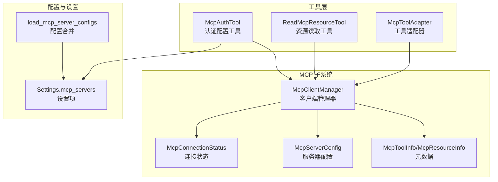
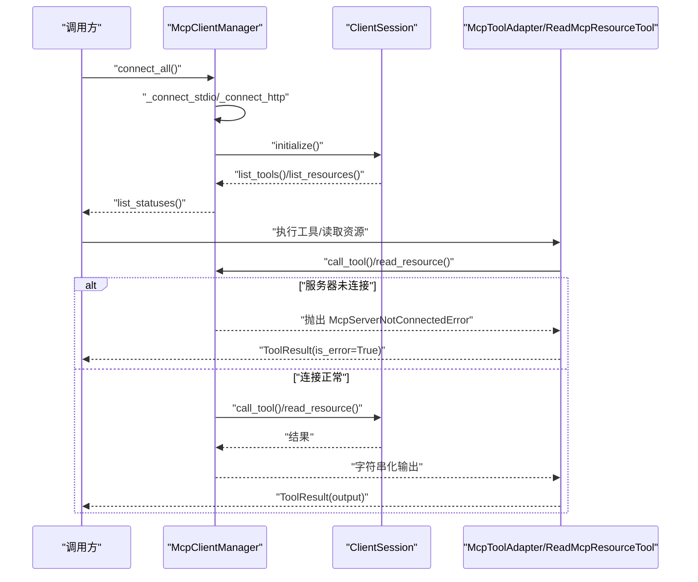
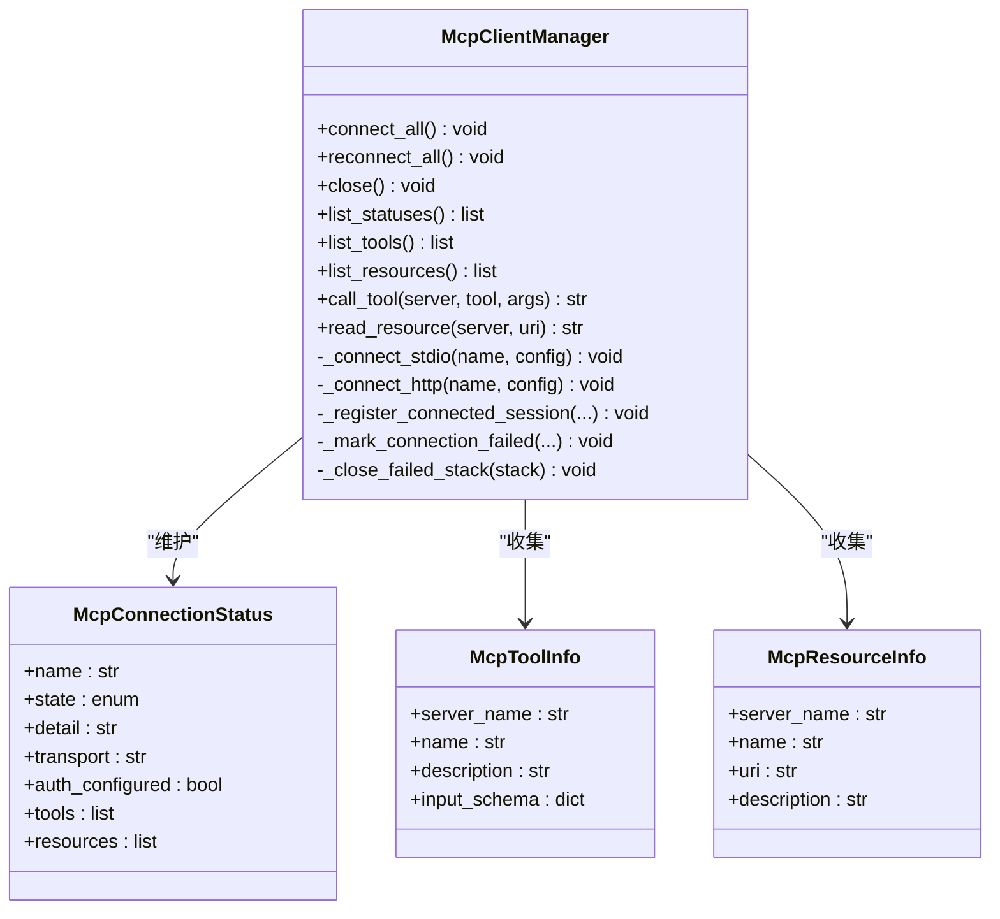
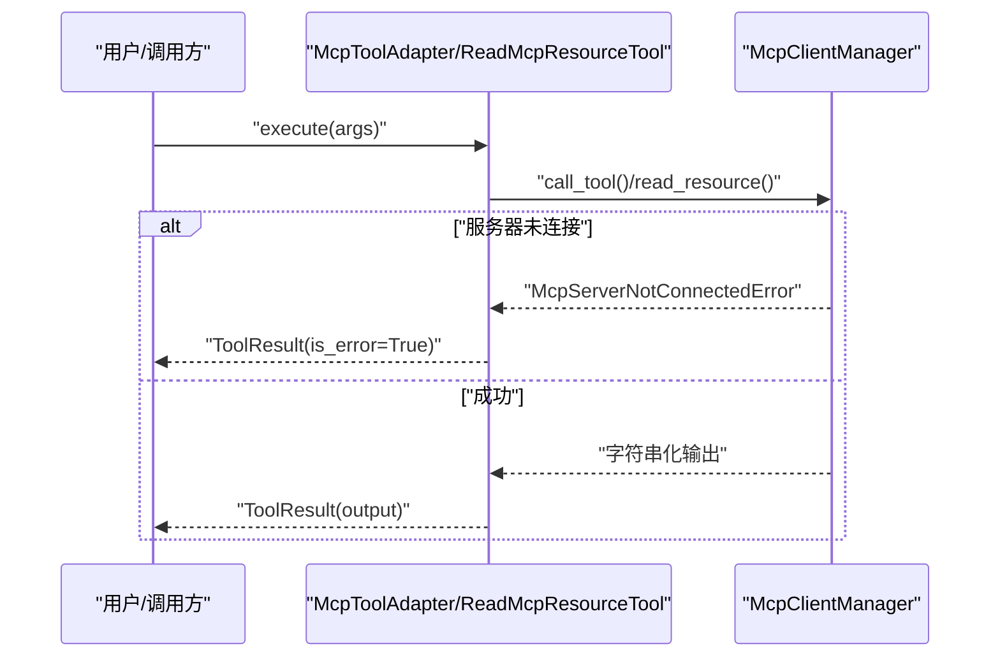
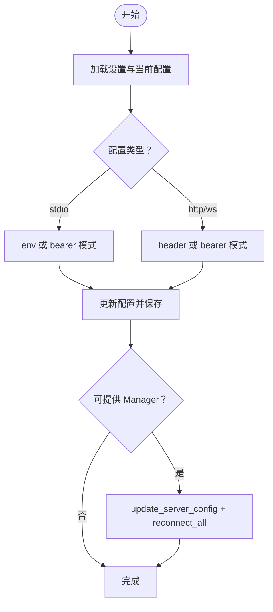
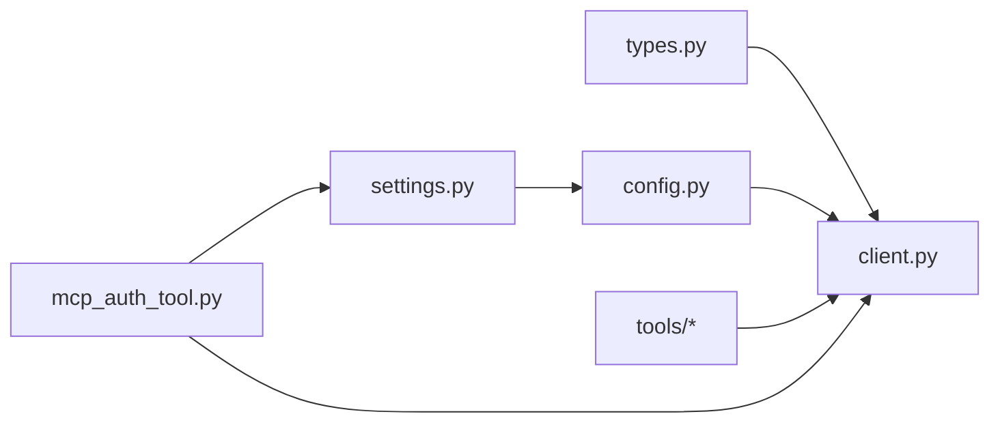

# MCP 故障排除

<cite>
**本文引用的文件**
- [client.py](file://src/openharness/mcp/client.py)
- [types.py](file://src/openharness/mcp/types.py)
- [config.py](file://src/openharness/mcp/config.py)
- [mcp_tool.py](file://src/openharness/tools/mcp_tool.py)
- [read_mcp_resource_tool.py](file://src/openharness/tools/read_mcp_resource_tool.py)
- [mcp_auth_tool.py](file://src/openharness/tools/mcp_auth_tool.py)
- [settings.py](file://src/openharness/config/settings.py)
- [test_client_errors.py](file://tests/test_mcp/test_client_errors.py)
- [test_http_flow.py](file://tests/test_mcp/test_http_flow.py)
- [test_stdio_flow.py](file://tests/test_mcp/test_stdio_flow.py)
- [test_integration.py](file://tests/test_mcp/test_integration.py)
- [fake_mcp_server.py](file://tests/fixtures/fake_mcp_server.py)
</cite>

## 目录
1. [简介](#简介)
2. [项目结构](#项目结构)
3. [核心组件](#核心组件)
4. [架构总览](#架构总览)
5. [详细组件分析](#详细组件分析)
6. [依赖关系分析](#依赖关系分析)
7. [性能考虑](#性能考虑)
8. [故障排除指南](#故障排除指南)
9. [结论](#结论)
10. [附录](#附录)

## 简介
本文件面向在 OpenHarness 中使用 MCP（Model Context Protocol）协议的开发者与运维人员，提供系统化的故障排除指南。内容覆盖连接超时、认证失败、工具不可用等常见问题，给出诊断方法、错误码与异常处理建议、性能优化策略以及调试与测试方法，并总结常见问题与最佳实践。

## 项目结构
围绕 MCP 的关键模块分布如下：
- 客户端与状态：MCP 客户端管理器负责连接、会话生命周期、状态上报与工具/资源暴露
- 配置模型：定义支持的服务器类型（stdio/http/ws）、运行时状态与元数据
- 工具适配：将 MCP 工具与资源读取封装为通用工具，统一错误返回
- 认证工具：持久化并更新 MCP 服务器的认证配置，触发重连
- 设置与加载：从设置与插件合并 MCP 服务器配置
- 测试与夹具：集成测试覆盖 HTTP/STDIO 场景，验证连接、工具与资源可用性

图表来源
- [client.py:29-299](file://src/openharness/mcp/client.py#L29-L299)
- [types.py:46-77](file://src/openharness/mcp/types.py#L46-L77)
- [config.py:8-17](file://src/openharness/mcp/config.py#L8-L17)
- [mcp_tool.py:14-36](file://src/openharness/tools/mcp_tool.py#L14-L36)
- [read_mcp_resource_tool.py:18-38](file://src/openharness/tools/read_mcp_resource_tool.py#L18-L38)
- [mcp_auth_tool.py:21-72](file://src/openharness/tools/mcp_auth_tool.py#L21-L72)
- [settings.py:534-564](file://src/openharness/config/settings.py#L534-L564)

章节来源
- [client.py:29-299](file://src/openharness/mcp/client.py#L29-L299)
- [types.py:11-77](file://src/openharness/mcp/types.py#L11-L77)
- [config.py:8-17](file://src/openharness/mcp/config.py#L8-L17)
- [mcp_tool.py:14-36](file://src/openharness/tools/mcp_tool.py#L14-L36)
- [read_mcp_resource_tool.py:18-38](file://src/openharness/tools/read_mcp_resource_tool.py#L18-L38)
- [mcp_auth_tool.py:21-72](file://src/openharness/tools/mcp_auth_tool.py#L21-L72)
- [settings.py:534-564](file://src/openharness/config/settings.py#L534-L564)

## 核心组件
- McpClientManager：负责连接所有已配置的 MCP 服务器（stdio/http），维护会话、状态、工具与资源清单；提供工具调用与资源读取能力；支持重连与关闭清理
- McpServerNotConnectedError：当服务器未连接或会话丢失时抛出的异常
- McpConnectionStatus：记录每个服务器的连接状态、传输方式、是否配置认证、工具与资源列表
- McpToolInfo/McpResourceInfo：服务器暴露的工具与资源元数据
- McpServerConfig 及其子类：支持 stdio/http/ws 三种传输方式的配置
- 工具适配器：将 MCP 工具与资源读取封装为通用工具，捕获 McpServerNotConnectedError 并返回标准错误结果
- 认证工具：持久化 MCP 认证配置并尝试触发重连
- 配置加载：从设置与插件合并 MCP 服务器配置

章节来源
- [client.py:25-299](file://src/openharness/mcp/client.py#L25-L299)
- [types.py:46-77](file://src/openharness/mcp/types.py#L46-L77)
- [mcp_tool.py:14-36](file://src/openharness/tools/mcp_tool.py#L14-L36)
- [read_mcp_resource_tool.py:18-38](file://src/openharness/tools/read_mcp_resource_tool.py#L18-L38)
- [mcp_auth_tool.py:21-72](file://src/openharness/tools/mcp_auth_tool.py#L21-L72)
- [config.py:8-17](file://src/openharness/mcp/config.py#L8-L17)

## 架构总览
下图展示 MCP 客户端管理器与工具层、配置层之间的交互，以及连接建立与工具/资源访问的关键流程。

图表来源
- [client.py:45-299](file://src/openharness/mcp/client.py#L45-L299)
- [mcp_tool.py:26-36](file://src/openharness/tools/mcp_tool.py#L26-L36)
- [read_mcp_resource_tool.py:32-38](file://src/openharness/tools/read_mcp_resource_tool.py#L32-L38)

## 详细组件分析

### 组件一：McpClientManager（连接与会话管理）
- 职责
  - 连接所有配置的 MCP 服务器（stdio/http）
  - 维护每个服务器的状态、会话与资源/工具清单
  - 提供工具调用与资源读取接口
  - 支持重连与关闭清理
- 关键行为
  - 连接失败时记录失败状态，不中断其他服务器初始化
  - 会话丢失或调用失败时抛出 McpServerNotConnectedError
  - 注册会话后拉取工具与资源清单，兼容“方法不存在”的场景
- 错误处理
  - 对 stdio/http 连接过程中的取消与异常进行捕获与状态标记
  - 关闭时抑制特定运行时错误与取消错误，避免二次异常

图表来源
- [client.py:29-299](file://src/openharness/mcp/client.py#L29-L299)
- [types.py:46-77](file://src/openharness/mcp/types.py#L46-L77)

章节来源
- [client.py:45-299](file://src/openharness/mcp/client.py#L45-L299)
- [types.py:46-77](file://src/openharness/mcp/types.py#L46-L77)

### 组件二：工具适配器与资源读取工具
- McpToolAdapter
  - 将 MCP 工具包装为通用工具，名称由服务器名与工具名拼接并清洗
  - 捕获 McpServerNotConnectedError 并返回 ToolResult(is_error=True)
- ReadMcpResourceTool
  - 读取指定服务器的资源，同样捕获并转换异常为 ToolResult

图表来源
- [mcp_tool.py:26-36](file://src/openharness/tools/mcp_tool.py#L26-L36)
- [read_mcp_resource_tool.py:32-38](file://src/openharness/tools/read_mcp_resource_tool.py#L32-L38)
- [client.py:129-178](file://src/openharness/mcp/client.py#L129-L178)

章节来源
- [mcp_tool.py:14-73](file://src/openharness/tools/mcp_tool.py#L14-L73)
- [read_mcp_resource_tool.py:18-39](file://src/openharness/tools/read_mcp_resource_tool.py#L18-L39)

### 组件三：认证配置工具与重连
- McpAuthTool
  - 支持 stdio（env/bearer）、http/ws（header/bearer）模式
  - 更新设置中的 mcp_servers，持久化后尝试更新内存配置并触发重连
- 重连策略
  - 通过 Manager.update_server_config 与 reconnect_all 实现

图表来源
- [mcp_auth_tool.py:28-72](file://src/openharness/tools/mcp_auth_tool.py#L28-L72)
- [client.py:61-68](file://src/openharness/mcp/client.py#L61-L68)

章节来源
- [mcp_auth_tool.py:21-72](file://src/openharness/tools/mcp_auth_tool.py#L21-L72)
- [client.py:61-68](file://src/openharness/mcp/client.py#L61-L68)

### 组件四：配置加载与合并
- load_mcp_server_configs
  - 合并 Settings.mcp_servers 与启用插件的 mcp_servers
  - 插件配置键名以“插件名:服务器名”形式避免冲突

章节来源
- [config.py:8-17](file://src/openharness/mcp/config.py#L8-L17)
- [settings.py:534-564](file://src/openharness/config/settings.py#L534-L564)

## 依赖关系分析
- 外部库
  - mcp.ClientSession：MCP 会话抽象
  - mcp.client.stdio/stdio_client：STDIO 传输
  - mcp.client.streamable_http/streamable_http_client：HTTP 传输
  - httpx.AsyncClient：HTTP 客户端
- 内部依赖
  - types 定义配置与状态模型
  - tools 层通过 Manager 暴露统一工具接口
  - auth tool 与 settings 集成，实现持久化与重连

图表来源
- [client.py:10-22](file://src/openharness/mcp/client.py#L10-L22)
- [types.py:11-37](file://src/openharness/mcp/types.py#L11-L37)
- [config.py:8-17](file://src/openharness/mcp/config.py#L8-L17)
- [settings.py:534-564](file://src/openharness/config/settings.py#L534-L564)
- [mcp_auth_tool.py:28-59](file://src/openharness/tools/mcp_auth_tool.py#L28-L59)

章节来源
- [client.py:10-22](file://src/openharness/mcp/client.py#L10-L22)
- [types.py:11-37](file://src/openharness/mcp/types.py#L11-L37)
- [config.py:8-17](file://src/openharness/mcp/config.py#L8-L17)
- [settings.py:534-564](file://src/openharness/config/settings.py#L534-L564)
- [mcp_auth_tool.py:28-59](file://src/openharness/tools/mcp_auth_tool.py#L28-L59)

## 性能考虑
- 连接池与并发
  - 当前实现按服务器逐个连接，未内置连接池；可通过批量任务并发启动连接（注意控制并发度与背压）
- 超时与重试
  - HTTP 客户端由 httpx.AsyncClient 创建，可在配置中注入超时参数；建议在上层工具或调用侧增加指数退避重试
- 会话复用
  - 已连接会话复用工具/资源查询，减少重复初始化开销
- 清理与资源回收
  - 关闭时抑制常见异常，避免二次异常导致资源泄漏；建议在业务层定期调用 close 释放资源

## 故障排除指南

### 常见问题与诊断步骤
- 连接超时
  - 现象：连接状态为 failed，detail 包含超时或连接被拒绝
  - 诊断：检查网络连通性、目标地址可达性、防火墙与代理设置
  - 处理：调整超时参数、切换传输方式（如从 http 切换 ws）、确认服务端监听端口
- 认证失败
  - 现象：HTTP/WS 请求返回 401/403，或 stdio 环境变量缺失
  - 诊断：核对 Authorization 头、Bearer Token、环境变量键值
  - 处理：使用 mcp_auth 工具更新认证配置并触发重连
- 工具不可用
  - 现象：工具列表为空或调用报错
  - 诊断：确认服务器已连接且 list_tools 成功；检查工具输入模式与必填字段
  - 处理：修复输入 schema、确保服务器正确实现工具
- 资源不可读
  - 现象：read_resource 返回空或报错
  - 诊断：确认资源 URI 正确、服务器支持资源读取；兼容“方法不存在”场景
  - 处理：降级处理或提示资源不可用

### 错误诊断方法
- 日志与状态检查
  - 使用 list_statuses 获取每个服务器的 state、transport、auth_configured、detail
  - 在工具执行前打印状态，便于定位未连接或失败的服务器
- 网络诊断
  - 使用 curl 或浏览器访问 HTTP MCP 端点，确认服务端可达与响应格式
  - 对 STDIO 服务器，验证命令、参数与工作目录
- 异常捕获与转换
  - 工具层统一捕获 McpServerNotConnectedError 并返回 ToolResult(is_error=True)，便于前端或上层逻辑处理

章节来源
- [client.py:111-127](file://src/openharness/mcp/client.py#L111-L127)
- [mcp_tool.py:26-36](file://src/openharness/tools/mcp_tool.py#L26-L36)
- [read_mcp_resource_tool.py:32-38](file://src/openharness/tools/read_mcp_resource_tool.py#L32-L38)

### 具体错误与异常处理
- McpServerNotConnectedError
  - 抛出场景：调用 call_tool 或 read_resource 时服务器未连接或会话丢失
  - 处理建议：捕获后返回错误结果，提示用户检查连接状态或重新连接
- 连接失败标记
  - _mark_connection_failed 会记录失败详情，便于后续诊断
- 关闭清理
  - _close_failed_stack 与 close 对特定异常进行抑制，避免二次异常

章节来源
- [client.py:25-27](file://src/openharness/mcp/client.py#L25-L27)
- [client.py:86-101](file://src/openharness/mcp/client.py#L86-L101)
- [client.py:103-109](file://src/openharness/mcp/client.py#L103-L109)
- [test_client_errors.py:38-73](file://tests/test_mcp/test_client_errors.py#L38-L73)
- [test_client_errors.py:78-94](file://tests/test_mcp/test_client_errors.py#L78-L94)

### 性能优化建议
- 连接池管理
  - 对 HTTP 传输，建议在应用层复用 httpx.AsyncClient 并设置合理的连接池大小与超时
- 超时配置
  - 在 McpHttpServerConfig 中注入 headers（如自定义超时头），并在上层工具增加超时与重试
- 重连策略
  - 使用指数退避与抖动，限制最大重试次数；在认证变更后自动触发重连
- 资源与工具缓存
  - 缓存 list_tools 与 list_resources 结果，减少重复查询

### 调试工具与测试方法
- 集成测试参考
  - HTTP 场景：使用 FastMCP 的 streamable_http_app，模拟服务端与客户端交互
  - STDIO 场景：使用测试夹具 fake_mcp_server，验证工具与资源读取
- 测试断言
  - 验证连接状态、工具与资源清单、请求头透传、调用结果
- 最佳实践
  - 在开发阶段使用本地夹具快速验证；生产环境使用稳定的服务端与明确的超时策略

章节来源
- [test_http_flow.py:19-91](file://tests/test_mcp/test_http_flow.py#L19-L91)
- [test_stdio_flow.py:16-55](file://tests/test_mcp/test_stdio_flow.py#L16-L55)
- [test_integration.py:35-80](file://tests/test_mcp/test_integration.py#L35-L80)
- [fake_mcp_server.py:10-22](file://tests/fixtures/fake_mcp_server.py#L10-L22)

## 结论
通过统一的客户端管理器、清晰的状态模型与工具适配层，OpenHarness 提供了稳健的 MCP 连接与调用能力。结合认证工具与完善的测试用例，开发者可以快速定位并解决连接超时、认证失败、工具不可用等问题。建议在生产环境中配合超时与重试策略、连接池与资源缓存，持续监控连接状态，确保系统的稳定性与可观测性。

## 附录

### 常见问题 FAQ
- 如何查看各 MCP 服务器的连接状态？
  - 使用 list_statuses 获取每个服务器的 state、transport、认证状态与工具/资源清单
- 如何更新 MCP 服务器的认证信息并自动重连？
  - 使用 mcp_auth 工具，选择对应模式（env/header/bearer），保存后触发重连
- 为什么工具调用总是返回“未连接”？
  - 检查服务器是否已成功 initialize，确认工具列表是否非空；若会话丢失，需重新连接
- 如何诊断 HTTP MCP 的认证问题？
  - 核对 Authorization 头与 Bearer Token；使用 curl 直接请求端点验证鉴权

### 最佳实践
- 在应用启动时集中调用 connect_all，并在后台周期性检查状态
- 对工具调用与资源读取进行统一异常捕获，返回标准化错误结果
- 对 HTTP 传输设置合理的超时与重试策略，避免阻塞主线程
- 使用插件机制扩展 MCP 服务器配置时，采用“插件名:服务器名”的命名避免冲突