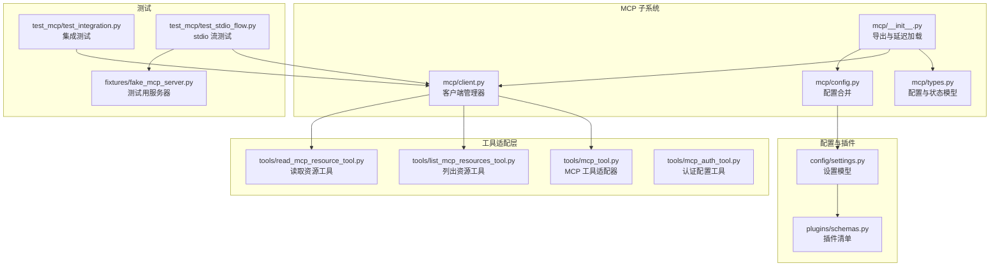
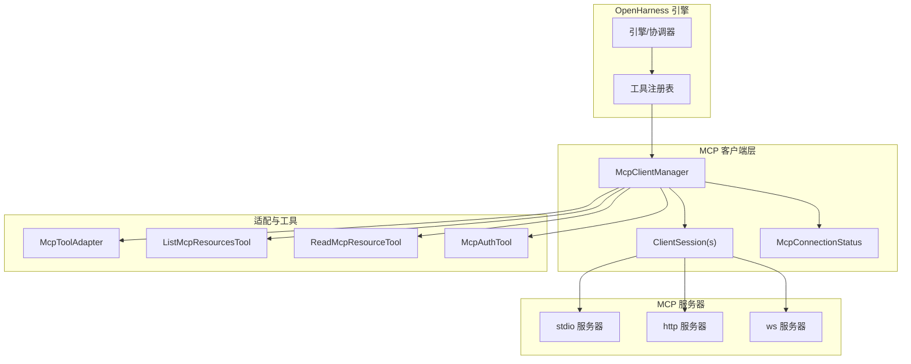
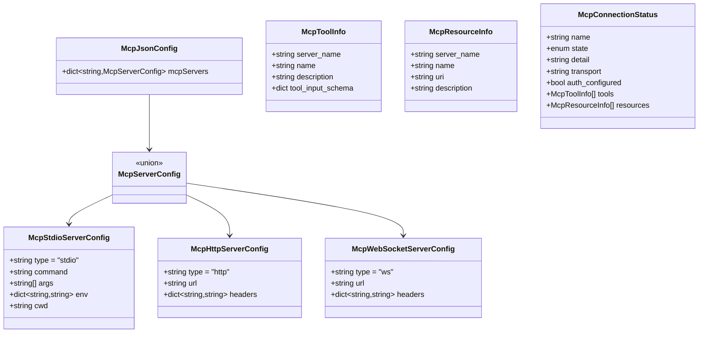
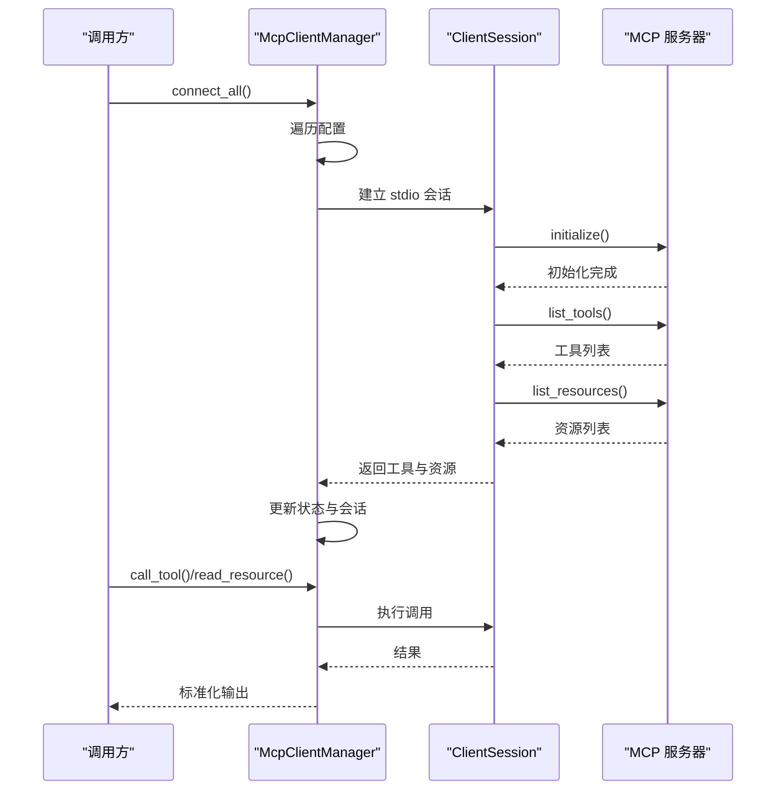
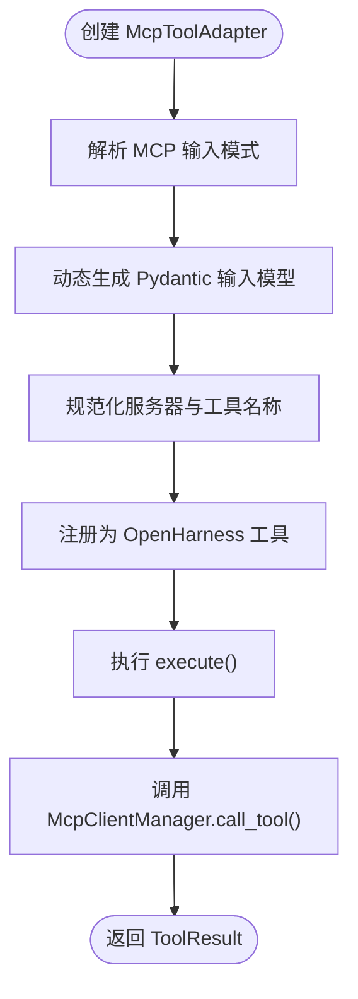
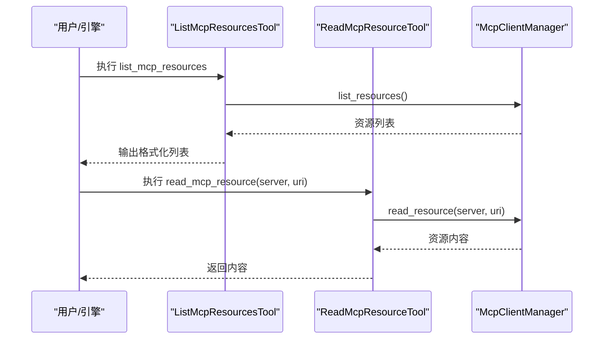
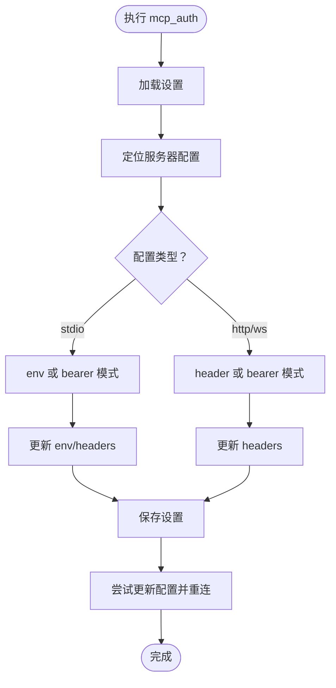
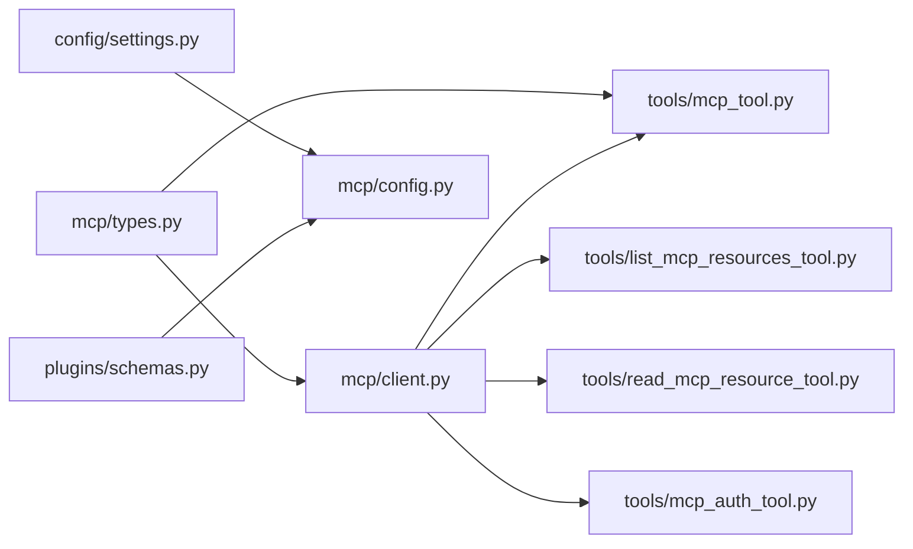

# MCP 服务器开发指南

<cite>
**本文档引用的文件**
- [mcp/__init__.py](file://src/openharness/mcp/__init__.py)
- [mcp/client.py](file://src/openharness/mcp/client.py)
- [mcp/config.py](file://src/openharness/mcp/config.py)
- [mcp/types.py](file://src/openharness/mcp/types.py)
- [tools/mcp_tool.py](file://src/openharness/tools/mcp_tool.py)
- [tools/list_mcp_resources_tool.py](file://src/openharness/tools/list_mcp_resources_tool.py)
- [tools/read_mcp_resource_tool.py](file://src/openharness/tools/read_mcp_resource_tool.py)
- [tools/mcp_auth_tool.py](file://src/openharness/tools/mcp_auth_tool.py)
- [config/settings.py](file://src/openharness/config/settings.py)
- [plugins/schemas.py](file://src/openharness/plugins/schemas.py)
- [test_mcp/test_integration.py](file://tests/test_mcp/test_integration.py)
- [test_mcp/test_stdio_flow.py](file://tests/test_mcp/test_stdio_flow.py)
- [fixtures/fake_mcp_server.py](file://tests/fixtures/fake_mcp_server.py)
- [README.md](file://README.md)
</cite>

## 目录
1. [简介](#简介)
2. [项目结构](#项目结构)
3. [核心组件](#核心组件)
4. [架构概览](#架构概览)
5. [详细组件分析](#详细组件分析)
6. [依赖关系分析](#依赖关系分析)
7. [性能考虑](#性能考虑)
8. [故障排除指南](#故障排除指南)
9. [结论](#结论)
10. [附录](#附录)

## 简介
本指南面向希望开发兼容 MCP（Model Context Protocol）服务器的开发者，基于 OpenHarness 项目的现有实现，系统讲解 MCP 协议在本项目中的应用方式、数据模型、客户端管理器、工具适配器以及认证机制。文档涵盖从协议基础到完整示例的开发流程，帮助开发者快速构建可被 OpenHarness 检测、连接、调用的 MCP 服务器。

## 项目结构
OpenHarness 的 MCP 能力主要集中在以下模块：
- mcp：MCP 客户端管理与类型定义
- tools：将 MCP 工具与资源暴露为 OpenHarness 工具
- config：设置与插件配置合并逻辑
- 测试：集成测试与真实 stdio 流测试

**图表来源**
- [mcp/__init__.py:1-75](file://src/openharness/mcp/__init__.py#L1-L75)
- [mcp/types.py:1-77](file://src/openharness/mcp/types.py#L1-L77)
- [mcp/client.py:1-175](file://src/openharness/mcp/client.py#L1-L175)
- [mcp/config.py:1-17](file://src/openharness/mcp/config.py#L1-L17)
- [tools/mcp_tool.py:1-56](file://src/openharness/tools/mcp_tool.py#L1-L56)
- [tools/list_mcp_resources_tool.py:1-37](file://src/openharness/tools/list_mcp_resources_tool.py#L1-L37)
- [tools/read_mcp_resource_tool.py:1-36](file://src/openharness/tools/read_mcp_resource_tool.py#L1-L36)
- [tools/mcp_auth_tool.py:1-72](file://src/openharness/tools/mcp_auth_tool.py#L1-L72)
- [config/settings.py:1-161](file://src/openharness/config/settings.py#L1-L161)
- [plugins/schemas.py:1-24](file://src/openharness/plugins/schemas.py#L1-L24)
- [test_mcp/test_integration.py:1-80](file://tests/test_mcp/test_integration.py#L1-L80)
- [test_mcp/test_stdio_flow.py:1-55](file://tests/test_mcp/test_stdio_flow.py#L1-L55)
- [fixtures/fake_mcp_server.py:1-22](file://tests/fixtures/fake_mcp_server.py#L1-L22)

**章节来源**
- [README.md:127-147](file://README.md#L127-L147)

## 核心组件
本节概述 MCP 子系统的关键组件及其职责：
- 配置与状态模型：定义不同传输类型的服务器配置、工具与资源元数据、连接状态等。
- 客户端管理器：负责连接 MCP 服务器、维护会话、列举工具与资源、执行工具调用与资源读取。
- 工具适配器：将 MCP 工具转换为 OpenHarness 可识别的工具，自动根据输入模式生成 Pydantic 模型。
- 认证工具：支持为不同传输类型配置认证信息（环境变量、HTTP 头或 Bearer Token），并尝试重连以生效。
- 配置合并：从设置与插件中合并 MCP 服务器配置，支持命名空间隔离。

**章节来源**
- [mcp/types.py:11-77](file://src/openharness/mcp/types.py#L11-L77)
- [mcp/client.py:20-175](file://src/openharness/mcp/client.py#L20-L175)
- [tools/mcp_tool.py:14-56](file://src/openharness/tools/mcp_tool.py#L14-L56)
- [tools/mcp_auth_tool.py:21-72](file://src/openharness/tools/mcp_auth_tool.py#L21-L72)
- [mcp/config.py:8-17](file://src/openharness/mcp/config.py#L8-L17)

## 架构概览
下图展示了 MCP 在 OpenHarness 中的整体架构：客户端管理器通过不同传输方式连接 MCP 服务器，获取工具与资源列表，随后将 MCP 工具与资源映射为 OpenHarness 工具，供上层引擎调用。

**图表来源**
- [mcp/client.py:20-175](file://src/openharness/mcp/client.py#L20-L175)
- [mcp/types.py:11-77](file://src/openharness/mcp/types.py#L11-L77)
- [tools/mcp_tool.py:14-56](file://src/openharness/tools/mcp_tool.py#L14-L56)
- [tools/list_mcp_resources_tool.py:15-37](file://src/openharness/tools/list_mcp_resources_tool.py#L15-L37)
- [tools/read_mcp_resource_tool.py:18-36](file://src/openharness/tools/read_mcp_resource_tool.py#L18-L36)
- [tools/mcp_auth_tool.py:21-72](file://src/openharness/tools/mcp_auth_tool.py#L21-L72)

## 详细组件分析

### 配置与状态模型
- McpStdioServerConfig/McpHttpServerConfig/McpWebSocketServerConfig：分别描述 stdio、HTTP、WebSocket 三种传输类型的服务器配置，包含必要的认证头或环境变量字段。
- McpServerConfig：联合类型，统一表示任意一种服务器配置。
- McpJsonConfig：用于插件或项目文件的配置文件结构，包含 mcpServers 字段。
- McpToolInfo/McpResourceInfo：工具与资源的元数据结构，包含名称、URI、描述及输入模式等。
- McpConnectionStatus：运行时状态，记录连接状态、传输类型、是否已配置认证、工具与资源列表等。

**图表来源**
- [mcp/types.py:11-77](file://src/openharness/mcp/types.py#L11-L77)

**章节来源**
- [mcp/types.py:11-77](file://src/openharness/mcp/types.py#L11-L77)

### 客户端管理器（McpClientManager）
- 连接管理：支持一次性连接所有配置的服务器；对 stdio 类型进行实际连接，其他类型记录失败状态。
- 会话生命周期：使用 AsyncExitStack 管理会话与流的关闭；维护每个服务器的 ClientSession 与状态。
- 工具与资源发现：连接成功后调用 list_tools 与 list_resources，填充 McpToolInfo 与 McpResourceInfo 列表。
- 工具调用与资源读取：封装 call_tool 与 read_resource，将结果标准化为字符串输出。
- 错误处理：捕获连接异常，更新状态详情；提供重连与关闭能力。

**图表来源**
- [mcp/client.py:36-175](file://src/openharness/mcp/client.py#L36-L175)

**章节来源**
- [mcp/client.py:20-175](file://src/openharness/mcp/client.py#L20-L175)

### 工具适配器（McpToolAdapter）
- 输入模式推断：根据 MCP 工具的输入模式动态生成 Pydantic 输入模型，确保类型安全与参数校验。
- 名称规范化：将服务器名与工具名转换为合法的 OpenHarness 工具标识符。
- 执行桥接：将 OpenHarness 工具调用转发至 McpClientManager 的 call_tool，再由底层 ClientSession 调用 MCP 服务器工具。

**图表来源**
- [tools/mcp_tool.py:14-56](file://src/openharness/tools/mcp_tool.py#L14-L56)

**章节来源**
- [tools/mcp_tool.py:14-56](file://src/openharness/tools/mcp_tool.py#L14-L56)

### 资源工具（列出与读取）
- 列出资源：遍历所有已连接服务器的资源，输出格式化列表，便于用户选择。
- 读取资源：根据服务器名与 URI 读取资源内容，返回字符串形式的结果。

**图表来源**
- [tools/list_mcp_resources_tool.py:15-37](file://src/openharness/tools/list_mcp_resources_tool.py#L15-L37)
- [tools/read_mcp_resource_tool.py:18-36](file://src/openharness/tools/read_mcp_resource_tool.py#L18-L36)
- [mcp/client.py:85-119](file://src/openharness/mcp/client.py#L85-L119)

**章节来源**
- [tools/list_mcp_resources_tool.py:15-37](file://src/openharness/tools/list_mcp_resources_tool.py#L15-L37)
- [tools/read_mcp_resource_tool.py:18-36](file://src/openharness/tools/read_mcp_resource_tool.py#L18-L36)
- [mcp/client.py:85-119](file://src/openharness/mcp/client.py#L85-L119)

### 认证配置工具（McpAuthTool）
- 支持的模式：
  - stdio：env 或 bearer（写入环境变量）
  - http/ws：header 或 bearer（写入 Authorization 头或其他自定义头）
- 动态更新：修改设置后尝试更新内存中的服务器配置并重连，若失败则提示但保存成功。
- 安全性：仅在必要时覆盖默认键名，避免破坏已有配置。

**图表来源**
- [tools/mcp_auth_tool.py:28-72](file://src/openharness/tools/mcp_auth_tool.py#L28-L72)

**章节来源**
- [tools/mcp_auth_tool.py:21-72](file://src/openharness/tools/mcp_auth_tool.py#L21-L72)

### 配置合并与插件集成
- 合并策略：将设置中的 mcp_servers 与启用插件的 mcp_servers 合并，插件配置使用“插件名:配置名”的命名空间避免冲突。
- 插件清单：插件清单包含 mcp_file 字段，默认指向 mcp.json，用于插件内嵌 MCP 服务器配置。

**章节来源**
- [mcp/config.py:8-17](file://src/openharness/mcp/config.py#L8-L17)
- [plugins/schemas.py:8-24](file://src/openharness/plugins/schemas.py#L8-L24)
- [config/settings.py:49-64](file://src/openharness/config/settings.py#L49-L64)

## 依赖关系分析
- 组件耦合：
  - McpClientManager 依赖 mcp.types 中的状态与配置模型，以及外部 mcp 库的 ClientSession。
  - 工具适配器依赖 McpClientManager 与 mcp.types 的工具元数据。
  - 认证工具依赖设置模型与 McpClientManager 的运行时更新能力。
- 外部依赖：
  - 使用 mcp 库提供的 ClientSession、stdio 客户端参数等。
  - 使用 pydantic 进行配置与输入模型验证。
- 潜在循环依赖：当前模块间为单向依赖，未见循环导入迹象。

**图表来源**
- [mcp/types.py:11-77](file://src/openharness/mcp/types.py#L11-L77)
- [mcp/client.py:12-17](file://src/openharness/mcp/client.py#L12-L17)
- [tools/mcp_tool.py:9-11](file://src/openharness/tools/mcp_tool.py#L9-L11)
- [mcp/config.py:5-16](file://src/openharness/mcp/config.py#L5-L16)
- [config/settings.py:19-21](file://src/openharness/config/settings.py#L19-L21)
- [plugins/schemas.py:5-24](file://src/openharness/plugins/schemas.py#L5-L24)

**章节来源**
- [mcp/client.py:12-17](file://src/openharness/mcp/client.py#L12-L17)
- [tools/mcp_tool.py:9-11](file://src/openharness/tools/mcp_tool.py#L9-L11)
- [mcp/config.py:5-16](file://src/openharness/mcp/config.py#L5-L16)
- [config/settings.py:19-21](file://src/openharness/config/settings.py#L19-L21)
- [plugins/schemas.py:5-24](file://src/openharness/plugins/schemas.py#L5-L24)

## 性能考虑
- 连接复用：McpClientManager 对每个服务器维护独立会话与退出栈，避免重复建立连接带来的开销。
- 异步执行：所有工具调用与资源读取均采用异步模式，减少阻塞。
- 输入模式推断：动态生成输入模型仅在工具注册时发生，后续执行不涉及额外模式解析。
- 最佳实践：
  - 将 MCP 服务器设计为长连接，避免频繁重启导致的初始化成本。
  - 在工具与资源列表较大时，优先按需加载与缓存，减少每次请求的往返次数。
  - 对于高并发场景，考虑在 MCP 服务器端实现限流与背压策略。

[本节为通用指导，无需特定文件来源]

## 故障排除指南
- 连接失败：
  - 检查服务器命令与参数是否正确，确认 stdio 服务器可正常启动。
  - 查看 McpConnectionStatus 的 detail 字段，定位具体错误原因。
- 工具调用异常：
  - 确认工具名称与输入模式一致；使用动态生成的输入模型进行参数校验。
  - 若 MCP 服务器返回非文本内容，检查 call_tool 的序列化逻辑。
- 资源读取为空：
  - 确认资源 URI 正确且服务器已声明该资源；检查 read_resource 的内容拼接逻辑。
- 认证问题：
  - 对于 stdio：确认环境变量键值正确；对于 http/ws：确认头名称与值格式。
  - 使用 mcp_auth 工具更新配置后，观察是否触发重连成功。

**章节来源**
- [mcp/client.py:166-175](file://src/openharness/mcp/client.py#L166-L175)
- [tools/mcp_tool.py:26-33](file://src/openharness/tools/mcp_tool.py#L26-L33)
- [tools/read_mcp_resource_tool.py:32-35](file://src/openharness/tools/read_mcp_resource_tool.py#L32-L35)
- [tools/mcp_auth_tool.py:38-56](file://src/openharness/tools/mcp_auth_tool.py#L38-L56)

## 结论
OpenHarness 提供了完整的 MCP 客户端框架：从配置模型、连接管理、工具与资源适配，到认证与重连机制，形成了可扩展、可测试的 MCP 集成方案。开发者可据此快速实现兼容的 MCP 服务器，并通过工具适配器无缝接入 OpenHarness 的工具生态。

[本节为总结，无需特定文件来源]

## 附录

### MCP 服务器开发示例

#### 示例一：Echo 工具服务器（stdio）
- 目标：实现一个最小化的 MCP 服务器，提供一个 echo 工具与一个只读资源。
- 关键点：
  - 使用 stdio 传输，遵循 MCP 协议的消息格式与初始化流程。
  - 通过装饰器声明工具与资源，确保工具输入模式与资源 URI 规范化。
  - 在测试中通过 McpClientManager 进行连接、列举与调用。

参考路径：
- [fixtures/fake_mcp_server.py:10-22](file://tests/fixtures/fake_mcp_server.py#L10-L22)
- [test_mcp/test_stdio_flow.py:16-55](file://tests/test_mcp/test_stdio_flow.py#L16-L55)

**章节来源**
- [fixtures/fake_mcp_server.py:10-22](file://tests/fixtures/fake_mcp_server.py#L10-L22)
- [test_mcp/test_stdio_flow.py:16-55](file://tests/test_mcp/test_stdio_flow.py#L16-L55)

#### 示例二：文件资源服务器（资源提供）
- 目标：提供静态文件资源，允许客户端通过 URI 读取。
- 关键点：
  - 资源声明需包含唯一 URI 与可选名称；客户端通过 read_mcp_resource_tool 读取。
  - 注意资源访问权限与路径规则，结合 OpenHarness 的权限系统进行控制。

参考路径：
- [tools/read_mcp_resource_tool.py:18-36](file://src/openharness/tools/read_mcp_resource_tool.py#L18-L36)
- [test_mcp/test_integration.py:52-80](file://tests/test_mcp/test_integration.py#L52-L80)

**章节来源**
- [tools/read_mcp_resource_tool.py:18-36](file://src/openharness/tools/read_mcp_resource_tool.py#L18-L36)
- [test_mcp/test_integration.py:52-80](file://tests/test_mcp/test_integration.py#L52-L80)

#### 示例三：工具服务器（工具注册与调用）
- 目标：实现一个具备输入模式的工具，支持参数校验与结果返回。
- 关键点：
  - 工具输入模式通过 JSON Schema 描述；McpToolAdapter 自动转换为 Pydantic 模型。
  - 工具调用通过 ClientSession 执行，结果经标准化后返回给调用方。

参考路径：
- [tools/mcp_tool.py:14-56](file://src/openharness/tools/mcp_tool.py#L14-L56)
- [test_mcp/test_integration.py:52-80](file://tests/test_mcp/test_integration.py#L52-L80)

**章节来源**
- [tools/mcp_tool.py:14-56](file://src/openharness/tools/mcp_tool.py#L14-L56)
- [test_mcp/test_integration.py:52-80](file://tests/test_mcp/test_integration.py#L52-L80)

### 部署与分发
- 配置文件：在设置中定义 mcp_servers，或通过插件的 mcp.json 提供服务器配置。
- 插件集成：插件清单中的 mcp_file 字段指向插件内的 MCP 配置文件，实现即插即用。
- 运行时更新：通过 mcp_auth 工具动态更新认证配置并尝试重连，保证变更即时生效。

参考路径：
- [config/settings.py:49-64](file://src/openharness/config/settings.py#L49-L64)
- [plugins/schemas.py:17](file://src/openharness/plugins/schemas.py#L17)
- [mcp/config.py:8-17](file://src/openharness/mcp/config.py#L8-L17)
- [tools/mcp_auth_tool.py:28-72](file://src/openharness/tools/mcp_auth_tool.py#L28-L72)

**章节来源**
- [config/settings.py:49-64](file://src/openharness/config/settings.py#L49-L64)
- [plugins/schemas.py:17](file://src/openharness/plugins/schemas.py#L17)
- [mcp/config.py:8-17](file://src/openharness/mcp/config.py#L8-L17)
- [tools/mcp_auth_tool.py:28-72](file://src/openharness/tools/mcp_auth_tool.py#L28-L72)

### 开发最佳实践
- 明确传输类型：根据场景选择 stdio、HTTP 或 WebSocket；stdio 适合本地进程，HTTP/WS 适合远程服务。
- 规范化命名：工具与资源名称应符合标识符规范，避免特殊字符；使用 McpToolAdapter 的名称规范化逻辑。
- 输入模式设计：为工具提供清晰的 JSON Schema，确保参数校验与文档生成。
- 认证策略：优先使用环境变量或标准头字段；避免硬编码密钥；支持动态更新与重连。
- 错误处理：在 MCP 服务器端提供明确的错误码与消息；客户端侧记录 detail 以便诊断。
- 测试覆盖：编写集成测试与真实 stdio 流测试，验证连接、工具与资源的完整链路。

[本节为通用指导，无需特定文件来源]