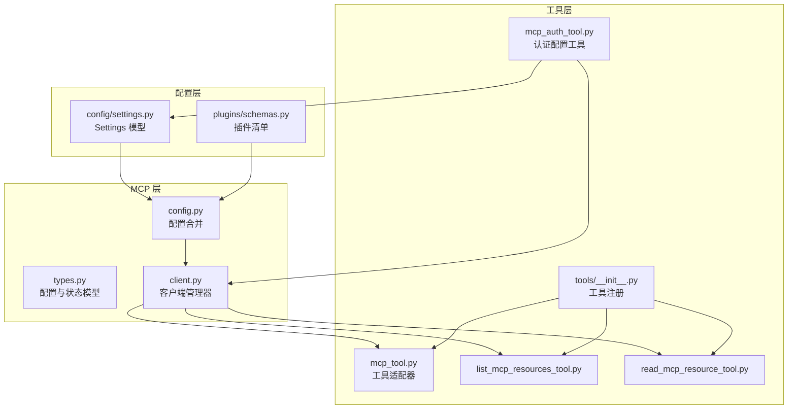
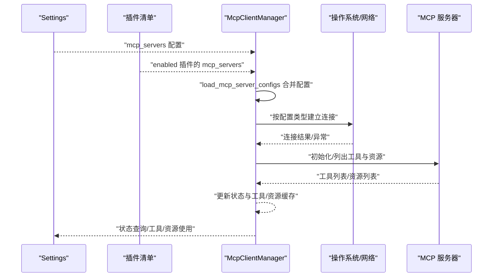
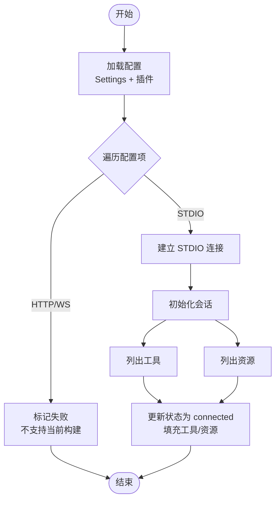
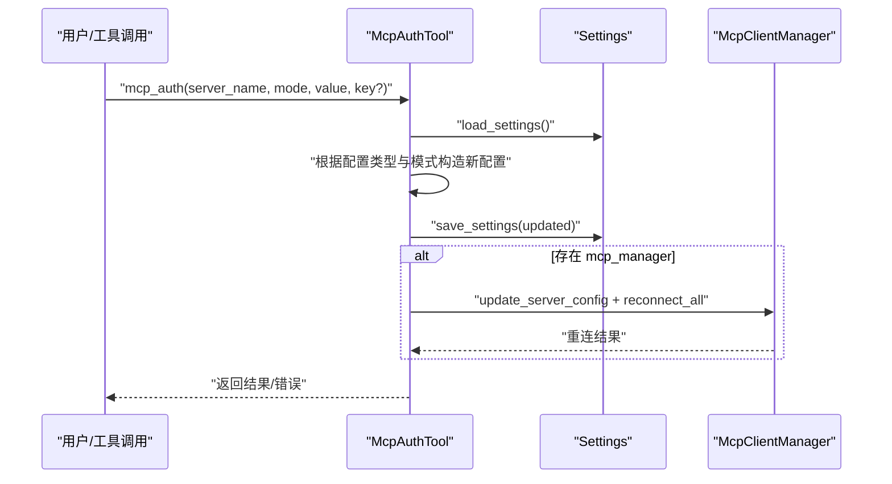
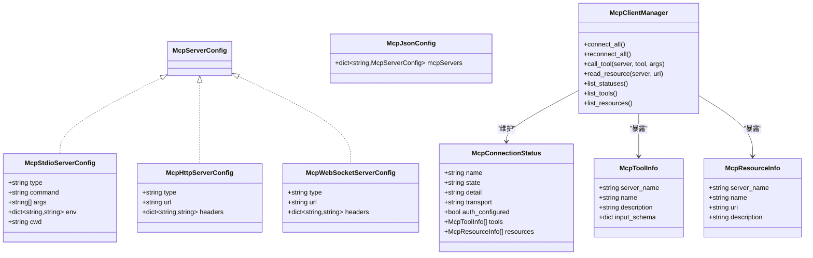
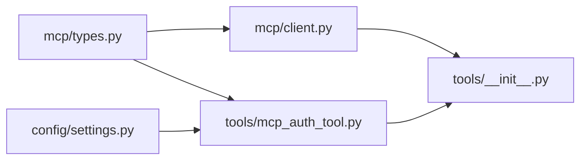

# MCP 服务器配置

<cite>
**本文引用的文件**
- [src/openharness/mcp/types.py](file://src/openharness/mcp/types.py)
- [src/openharness/mcp/client.py](file://src/openharness/mcp/client.py)
- [src/openharness/mcp/config.py](file://src/openharness/mcp/config.py)
- [src/openharness/tools/mcp_auth_tool.py](file://src/openharness/tools/mcp_auth_tool.py)
- [src/openharness/tools/mcp_tool.py](file://src/openharness/tools/mcp_tool.py)
- [src/openharness/tools/list_mcp_resources_tool.py](file://src/openharness/tools/list_mcp_resources_tool.py)
- [src/openharness/tools/read_mcp_resource_tool.py](file://src/openharness/tools/read_mcp_resource_tool.py)
- [src/openharness/config/settings.py](file://src/openharness/config/settings.py)
- [src/openharness/plugins/schemas.py](file://src/openharness/plugins/schemas.py)
- [src/openharness/tools/__init__.py](file://src/openharness/tools/__init__.py)
- [tests/test_mcp/test_integration.py](file://tests/test_mcp/test_integration.py)
- [tests/test_mcp/test_stdio_flow.py](file://tests/test_mcp/test_stdio_flow.py)
</cite>

## 目录
1. [简介](#简介)
2. [项目结构](#项目结构)
3. [核心组件](#核心组件)
4. [架构总览](#架构总览)
5. [详细组件分析](#详细组件分析)
6. [依赖分析](#依赖分析)
7. [性能考虑](#性能考虑)
8. [故障排查指南](#故障排查指南)
9. [结论](#结论)
10. [附录：配置示例与最佳实践](#附录配置示例与最佳实践)

## 简介
本文件系统性阐述 OpenHarness 中 MCP（Model Context Protocol）服务器的配置与运行机制，覆盖数据结构、参数设置、传输类型支持、认证配置、连接与状态管理、配置加载与合并、以及工具适配与资源访问。文档同时提供基于仓库实现的配置示例与最佳实践，帮助用户在本地、远程与带认证场景下完成 MCP 服务器的集成。

## 项目结构
围绕 MCP 的核心模块位于 openharness/mcp 下，配合工具层与配置层共同完成从配置到运行时的全链路能力：
- mcp/types.py：定义 MCP 服务器配置模型与运行时状态模型
- mcp/client.py：MCP 客户端会话管理器，负责连接、状态更新、工具与资源暴露
- mcp/config.py：将设置与插件中的 MCP 配置进行合并
- tools/mcp_auth_tool.py：认证配置持久化与重连工具
- tools/mcp_tool.py：将 MCP 工具适配为通用工具
- tools/list_mcp_resources_tool.py、read_mcp_resource_tool.py：资源列举与读取工具
- config/settings.py：全局设置模型，包含 mcp_servers 字段
- plugins/schemas.py：插件清单，包含 mcp_file 字段用于插件内嵌 MCP 配置
- tools/__init__.py：默认工具注册，动态注入 MCP 工具与资源工具

图表来源
- [src/openharness/mcp/types.py:11-77](file://src/openharness/mcp/types.py#L11-L77)
- [src/openharness/mcp/client.py:20-175](file://src/openharness/mcp/client.py#L20-L175)
- [src/openharness/mcp/config.py:8-16](file://src/openharness/mcp/config.py#L8-L16)
- [src/openharness/tools/mcp_auth_tool.py:21-72](file://src/openharness/tools/mcp_auth_tool.py#L21-L72)
- [src/openharness/tools/mcp_tool.py:14-56](file://src/openharness/tools/mcp_tool.py#L14-L56)
- [src/openharness/tools/list_mcp_resources_tool.py:15-37](file://src/openharness/tools/list_mcp_resources_tool.py#L15-L37)
- [src/openharness/tools/read_mcp_resource_tool.py:18-36](file://src/openharness/tools/read_mcp_resource_tool.py#L18-L36)
- [src/openharness/config/settings.py:49-64](file://src/openharness/config/settings.py#L49-L64)
- [src/openharness/plugins/schemas.py:8-24](file://src/openharness/plugins/schemas.py#L8-L24)
- [src/openharness/tools/__init__.py:45-92](file://src/openharness/tools/__init__.py#L45-L92)

章节来源
- [src/openharness/mcp/types.py:11-77](file://src/openharness/mcp/types.py#L11-L77)
- [src/openharness/mcp/client.py:20-175](file://src/openharness/mcp/client.py#L20-L175)
- [src/openharness/mcp/config.py:8-16](file://src/openharness/mcp/config.py#L8-L16)
- [src/openharness/config/settings.py:49-64](file://src/openharness/config/settings.py#L49-L64)
- [src/openharness/plugins/schemas.py:8-24](file://src/openharness/plugins/schemas.py#L8-L24)
- [src/openharness/tools/__init__.py:45-92](file://src/openharness/tools/__init__.py#L45-L92)

## 核心组件
- 配置模型
  - McpStdioServerConfig：STDIO 传输配置，包含命令、参数、环境变量、工作目录
  - McpHttpServerConfig：HTTP 传输配置，包含 URL 与请求头
  - McpWebSocketServerConfig：WebSocket 传输配置，包含 URL 与请求头
  - McpServerConfig：三者联合类型，表示任意一种 MCP 服务器配置
  - McpJsonConfig：插件或项目配置文件使用的顶层对象，包含 mcpServers 字典
- 运行时状态
  - McpConnectionStatus：记录单个服务器的连接状态、传输类型、认证状态、可用工具与资源
  - McpToolInfo/McpResourceInfo：工具与资源元数据
- 客户端管理器
  - McpClientManager：统一管理多个 MCP 服务器的连接、状态更新、工具与资源暴露、调用与资源读取
- 配置合并
  - load_mcp_server_configs：将 Settings.mcp_servers 与已启用插件的 mcp_servers 合并，插件配置键名以“插件名:配置名”形式避免冲突

章节来源
- [src/openharness/mcp/types.py:11-77](file://src/openharness/mcp/types.py#L11-L77)
- [src/openharness/mcp/client.py:20-175](file://src/openharness/mcp/client.py#L20-L175)
- [src/openharness/mcp/config.py:8-16](file://src/openharness/mcp/config.py#L8-L16)

## 架构总览
下图展示 MCP 配置从设置与插件加载、到客户端连接、再到工具与资源暴露的整体流程。

图表来源
- [src/openharness/mcp/config.py:8-16](file://src/openharness/mcp/config.py#L8-L16)
- [src/openharness/mcp/client.py:36-175](file://src/openharness/mcp/client.py#L36-L175)
- [src/openharness/config/settings.py:49-64](file://src/openharness/config/settings.py#L49-L64)
- [src/openharness/plugins/schemas.py:8-24](file://src/openharness/plugins/schemas.py#L8-L24)

## 详细组件分析

### 配置数据结构与参数
- STDIO 配置（McpStdioServerConfig）
  - 关键字段：type 固定为 "stdio"，command 必填；args 可选；env/cwd 可选
  - 用途：通过进程标准输入输出与服务器通信，适合本地可执行程序
- HTTP 配置（McpHttpServerConfig）
  - 关键字段：type 固定为 "http"，url 必填；headers 可选
  - 用途：通过 HTTP 访问服务器接口，适合远程 HTTP 服务
- WebSocket 配置（McpWebSocketServerConfig）
  - 关键字段：type 固定为 "ws"，url 必填；headers 可选
  - 用途：通过 WebSocket 建立长连接，适合需要双向实时通信的服务
- 联合类型与 JSON 结构
  - McpServerConfig 为三种配置类型的联合
  - McpJsonConfig 的 mcpServers 字段用于插件或项目配置文件中声明多台服务器

章节来源
- [src/openharness/mcp/types.py:11-37](file://src/openharness/mcp/types.py#L11-L37)
- [src/openharness/mcp/types.py:40-44](file://src/openharness/mcp/types.py#L40-L44)

### 服务器发现与连接流程
- 配置加载与合并
  - 从 Settings.mcp_servers 获取全局配置
  - 遍历已启用插件，将插件的 mcp_servers 以“插件名:配置名”的键名合并入最终字典
- 连接建立
  - 当前构建仅支持 STDIO 传输；其他传输类型会被标记为失败并记录原因
  - 对 STDIO：使用 stdio_client 建立读写流，创建 ClientSession 并初始化；随后列出工具与资源
  - 成功后更新状态为 connected，并填充工具与资源清单；失败则记录 detail
- 状态监控
  - McpConnectionStatus 提供 name/state/detail/transport/auth_configured/tools/resources 字段
  - 支持查询所有状态、工具与资源列表

图表来源
- [src/openharness/mcp/config.py:8-16](file://src/openharness/mcp/config.py#L8-L16)
- [src/openharness/mcp/client.py:36-175](file://src/openharness/mcp/client.py#L36-L175)

章节来源
- [src/openharness/mcp/config.py:8-16](file://src/openharness/mcp/config.py#L8-L16)
- [src/openharness/mcp/client.py:36-175](file://src/openharness/mcp/client.py#L36-L175)

### 不同传输方式的支持与差异
- STDIO
  - 支持：当前构建明确支持
  - 参数：command/args/env/cwd
  - 认证：通过 env 注入令牌（如 MCP_AUTH_TOKEN 或自定义键）
- HTTP
  - 支持：当前构建不支持（连接时直接标记失败）
  - 参数：url/headers
  - 认证：通过 headers 注入 Authorization 或自定义键
- WebSocket
  - 支持：当前构建不支持（连接时直接标记失败）
  - 参数：url/headers
  - 认证：通过 headers 注入 Authorization 或自定义键

章节来源
- [src/openharness/mcp/client.py:36-48](file://src/openharness/mcp/client.py#L36-L48)
- [src/openharness/tools/mcp_auth_tool.py:39-56](file://src/openharness/tools/mcp_auth_tool.py#L39-L56)

### 认证配置与更新
- 支持的模式
  - STDIO：env、bearer
  - HTTP/WS：header、bearer
- 更新流程
  - 解析输入参数（server_name、mode、value、key）
  - 根据配置类型选择对应键（env 或 headers），构造新的配置副本
  - 写回 Settings.mcp_servers 并保存至配置文件
  - 若存在 mcp_manager，则更新内存配置并尝试重连所有服务器
- 错误处理
  - 未知服务器名、不支持的传输类型、不支持的认证模式均返回错误信息

图表来源
- [src/openharness/tools/mcp_auth_tool.py:28-72](file://src/openharness/tools/mcp_auth_tool.py#L28-L72)
- [src/openharness/config/settings.py:123-161](file://src/openharness/config/settings.py#L123-L161)
- [src/openharness/mcp/client.py:50-57](file://src/openharness/mcp/client.py#L50-L57)

章节来源
- [src/openharness/tools/mcp_auth_tool.py:28-72](file://src/openharness/tools/mcp_auth_tool.py#L28-L72)
- [src/openharness/config/settings.py:123-161](file://src/openharness/config/settings.py#L123-L161)
- [src/openharness/mcp/client.py:50-57](file://src/openharness/mcp/client.py#L50-L57)

### 工具适配与资源访问
- 工具适配
  - 将每个 MCP 工具转换为通用工具，名称格式为 mcp__{server}__{tool}
  - 输入模型由工具的 inputSchema 动态生成，支持必填与可选字段
- 资源工具
  - list_mcp_resources：列出所有已连接服务器的资源
  - read_mcp_resource：按服务器与 URI 读取资源内容
- 注册机制
  - 默认工具注册时，若传入 mcp_manager，会动态注册上述工具与所有 MCP 工具

章节来源
- [src/openharness/tools/mcp_tool.py:14-56](file://src/openharness/tools/mcp_tool.py#L14-L56)
- [src/openharness/tools/list_mcp_resources_tool.py:15-37](file://src/openharness/tools/list_mcp_resources_tool.py#L15-L37)
- [src/openharness/tools/read_mcp_resource_tool.py:18-36](file://src/openharness/tools/read_mcp_resource_tool.py#L18-L36)
- [src/openharness/tools/__init__.py:45-92](file://src/openharness/tools/__init__.py#L45-L92)

### 类关系与交互（代码级）

图表来源
- [src/openharness/mcp/types.py:11-77](file://src/openharness/mcp/types.py#L11-L77)
- [src/openharness/mcp/client.py:20-175](file://src/openharness/mcp/client.py#L20-L175)

## 依赖分析
- 组件耦合
  - McpClientManager 依赖 mcp.types 中的配置与状态模型
  - 认证工具依赖 Settings 的加载/保存与 mcp.types 的配置类型
  - 工具注册依赖 mcp_client 的工具与资源列表
- 外部依赖
  - 使用 mcp 库的 ClientSession、stdio_client 与 StdioServerParameters
  - 使用 pydantic 进行配置校验与序列化
- 潜在循环依赖
  - 当前模块间为单向依赖，未见循环导入

图表来源
- [src/openharness/mcp/types.py:11-77](file://src/openharness/mcp/types.py#L11-L77)
- [src/openharness/mcp/client.py:20-175](file://src/openharness/mcp/client.py#L20-L175)
- [src/openharness/tools/mcp_auth_tool.py:21-72](file://src/openharness/tools/mcp_auth_tool.py#L21-L72)
- [src/openharness/config/settings.py:49-64](file://src/openharness/config/settings.py#L49-L64)
- [src/openharness/tools/__init__.py:45-92](file://src/openharness/tools/__init__.py#L45-L92)

章节来源
- [src/openharness/mcp/types.py:11-77](file://src/openharness/mcp/types.py#L11-L77)
- [src/openharness/mcp/client.py:20-175](file://src/openharness/mcp/client.py#L20-L175)
- [src/openharness/tools/mcp_auth_tool.py:21-72](file://src/openharness/tools/mcp_auth_tool.py#L21-L72)
- [src/openharness/config/settings.py:49-64](file://src/openharness/config/settings.py#L49-L64)
- [src/openharness/tools/__init__.py:45-92](file://src/openharness/tools/__init__.py#L45-L92)

## 性能考虑
- 连接建立成本
  - STDIO 进程启动与会话初始化为主要开销，建议复用连接而非频繁重建
- 批量操作
  - 工具与资源列表在连接成功后缓存于状态中，避免重复查询
- 并发与资源释放
  - 使用 AsyncExitStack 确保异常路径也能正确关闭流与会话，降低资源泄漏风险

## 故障排查指南
- “不支持的 MCP 传输”
  - 现象：状态为 failed，detail 指明当前构建不支持该传输类型
  - 排查：确认构建是否包含相应传输支持；仅 STDIO 在当前构建中受支持
- “连接失败/异常”
  - 现象：状态为 failed，detail 显示具体异常信息
  - 排查：检查命令/URL 是否正确、网络可达性、认证配置是否有效
- “未知 MCP 服务器”
  - 现象：认证工具返回未知服务器名
  - 排查：确认配置键名是否存在，插件合并后的键名为“插件名:配置名”
- “认证未生效”
  - 现象：工具调用仍提示未授权
  - 排查：确认认证模式与键名匹配（STDIO 使用 env，HTTP/WS 使用 headers），必要时手动重连

章节来源
- [src/openharness/mcp/client.py:42-48](file://src/openharness/mcp/client.py#L42-L48)
- [src/openharness/mcp/client.py:166-174](file://src/openharness/mcp/client.py#L166-L174)
- [src/openharness/tools/mcp_auth_tool.py:36-37](file://src/openharness/tools/mcp_auth_tool.py#L36-L37)
- [src/openharness/tools/mcp_auth_tool.py:40-41](file://src/openharness/tools/mcp_auth_tool.py#L40-L41)
- [src/openharness/tools/mcp_auth_tool.py:47-48](file://src/openharness/tools/mcp_auth_tool.py#L47-L48)

## 结论
OpenHarness 的 MCP 配置体系以 Pydantic 模型为核心，结合 Settings 与插件机制实现灵活的服务器配置合并；客户端管理器负责连接、状态与工具/资源暴露，当前构建重点支持 STDIO 传输。通过认证工具与资源/工具适配器，用户可在本地与远程场景下便捷地集成 MCP 服务器，并获得一致的工具调用体验。

## 附录：配置示例与最佳实践

### 配置示例
- 本地 STDIO 服务器
  - 示例路径：[tests/test_mcp/test_stdio_flow.py:19-26](file://tests/test_mcp/test_stdio_flow.py#L19-L26)
  - 关键点：command 指向可执行脚本，args 传递服务器脚本参数
- 插件内嵌 MCP 服务器
  - 示例路径：[tests/test_mcp/test_integration.py:36-44](file://tests/test_mcp/test_integration.py#L36-L44)
  - 关键点：插件启用后，其配置键名自动加上“插件名:”，避免冲突
- 远程 HTTP/WS 服务器
  - 当前构建不支持，需等待后续扩展
  - 若未来支持，参考 Http/WebSocket 配置模型字段

章节来源
- [tests/test_mcp/test_stdio_flow.py:19-26](file://tests/test_mcp/test_stdio_flow.py#L19-L26)
- [tests/test_mcp/test_integration.py:36-44](file://tests/test_mcp/test_integration.py#L36-L44)
- [src/openharness/mcp/types.py:21-34](file://src/openharness/mcp/types.py#L21-L34)

### 最佳实践
- 配置优先级与合并
  - 全局 Settings.mcp_servers 与插件 mcp_servers 合并，插件键名加前缀，便于区分
  - 示例参考：[src/openharness/mcp/config.py:8-16](file://src/openharness/mcp/config.py#L8-L16)
- 认证策略
  - STDIO：通过 env 注入令牌；HTTP/WS：通过 headers 注入 Authorization
  - 使用认证工具统一更新并持久化，必要时触发重连
  - 示例参考：[src/openharness/tools/mcp_auth_tool.py:28-72](file://src/openharness/tools/mcp_auth_tool.py#L28-L72)
- 工具与资源使用
  - 连接成功后，工具与资源会自动注册到默认工具集
  - 使用 list_mcp_resources 与 read_mcp_resource 工具进行资源管理
  - 示例参考：[src/openharness/tools/__init__.py:87-92](file://src/openharness/tools/__init__.py#L87-L92)，[src/openharness/tools/list_mcp_resources_tool.py:29-36](file://src/openharness/tools/list_mcp_resources_tool.py#L29-L36)，[src/openharness/tools/read_mcp_resource_tool.py:32-35](file://src/openharness/tools/read_mcp_resource_tool.py#L32-L35)
- 状态监控
  - 通过 list_statuses 获取各服务器状态，定位连接与认证问题
  - 示例参考：[src/openharness/mcp/client.py:74-76](file://src/openharness/mcp/client.py#L74-L76)