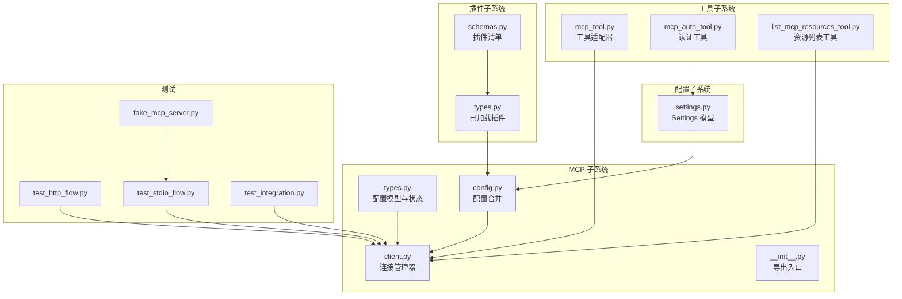
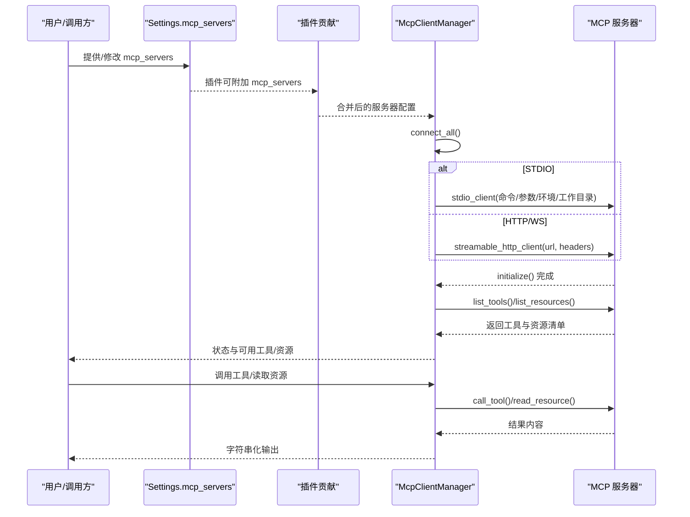
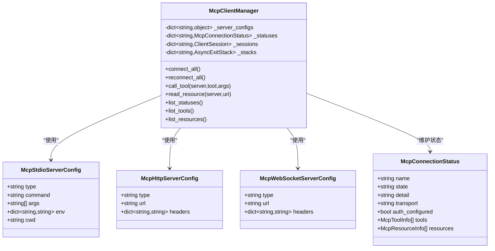
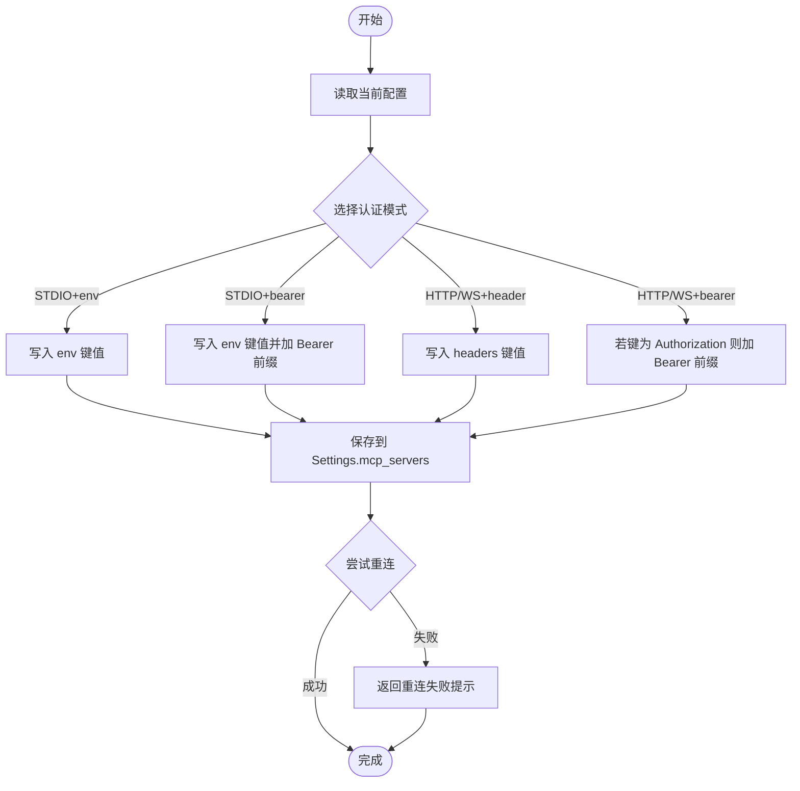
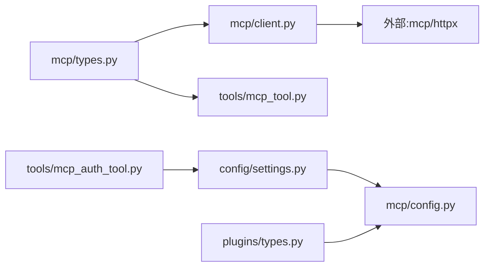

# MCP 服务器配置

<cite>
**本文引用的文件**
- [src/openharness/mcp/__init__.py](file://src/openharness/mcp/__init__.py)
- [src/openharness/mcp/types.py](file://src/openharness/mcp/types.py)
- [src/openharness/mcp/config.py](file://src/openharness/mcp/config.py)
- [src/openharness/mcp/client.py](file://src/openharness/mcp/client.py)
- [src/openharness/tools/mcp_tool.py](file://src/openharness/tools/mcp_tool.py)
- [src/openharness/tools/mcp_auth_tool.py](file://src/openharness/tools/mcp_auth_tool.py)
- [src/openharness/tools/list_mcp_resources_tool.py](file://src/openharness/tools/list_mcp_resources_tool.py)
- [src/openharness/plugins/schemas.py](file://src/openharness/plugins/schemas.py)
- [src/openharness/plugins/types.py](file://src/openharness/plugins/types.py)
- [src/openharness/config/settings.py](file://src/openharness/config/settings.py)
- [tests/test_mcp/test_integration.py](file://tests/test_mcp/test_integration.py)
- [tests/test_mcp/test_http_flow.py](file://tests/test_mcp/test_http_flow.py)
- [tests/test_mcp/test_stdio_flow.py](file://tests/test_mcp/test_stdio_flow.py)
- [tests/fixtures/fake_mcp_server.py](file://tests/fixtures/fake_mcp_server.py)
</cite>

## 目录
1. [简介](#简介)
2. [项目结构](#项目结构)
3. [核心组件](#核心组件)
4. [架构总览](#架构总览)
5. [详细组件分析](#详细组件分析)
6. [依赖关系分析](#依赖关系分析)
7. [性能考量](#性能考量)
8. [故障排查指南](#故障排查指南)
9. [结论](#结论)
10. [附录：配置示例与最佳实践](#附录配置示例与最佳实践)

## 简介
本文件面向 MCP（Model Context Protocol）服务器在 OpenHarness 中的配置与使用，覆盖以下主题：
- 不同类型 MCP 服务器的配置参数：STDIO、HTTP、WebSocket 的字段与差异
- 配置文件结构与来源：Settings、插件贡献、合并策略
- 认证配置：HTTP 头部认证、环境变量注入、动态更新与重连
- 服务器发现与注册：工具与资源的自动发现、暴露与命名规范
- 常见配置场景与最佳实践

## 项目结构
围绕 MCP 的相关模块主要分布在以下位置：
- mcp 子系统：类型定义、客户端管理器、配置加载
- tools 子系统：MCP 工具适配器、认证工具、资源列表工具
- plugins 子系统：插件清单与运行时类型，支持插件贡献 MCP 服务器
- config 子系统：Settings 模型与加载逻辑，包含 mcp_servers 字段
- tests 子系统：端到端集成测试，验证 HTTP 与 STDIO 流程

图表来源
- [src/openharness/mcp/types.py:11-77](file://src/openharness/mcp/types.py#L11-L77)
- [src/openharness/mcp/client.py:29-299](file://src/openharness/mcp/client.py#L29-L299)
- [src/openharness/mcp/config.py:8-17](file://src/openharness/mcp/config.py#L8-L17)
- [src/openharness/tools/mcp_tool.py:14-73](file://src/openharness/tools/mcp_tool.py#L14-L73)
- [src/openharness/tools/mcp_auth_tool.py:21-72](file://src/openharness/tools/mcp_auth_tool.py#L21-L72)
- [src/openharness/tools/list_mcp_resources_tool.py:15-37](file://src/openharness/tools/list_mcp_resources_tool.py#L15-L37)
- [src/openharness/plugins/schemas.py:8-25](file://src/openharness/plugins/schemas.py#L8-L25)
- [src/openharness/plugins/types.py:40-60](file://src/openharness/plugins/types.py#L40-L60)
- [src/openharness/config/settings.py:534-564](file://src/openharness/config/settings.py#L534-L564)
- [tests/test_mcp/test_http_flow.py:19-91](file://tests/test_mcp/test_http_flow.py#L19-L91)
- [tests/test_mcp/test_stdio_flow.py:16-55](file://tests/test_mcp/test_stdio_flow.py#L16-L55)
- [tests/test_mcp/test_integration.py:35-80](file://tests/test_mcp/test_integration.py#L35-L80)
- [tests/fixtures/fake_mcp_server.py:1-22](file://tests/fixtures/fake_mcp_server.py#L1-L22)

章节来源
- [src/openharness/mcp/__init__.py:20-32](file://src/openharness/mcp/__init__.py#L20-L32)
- [src/openharness/config/settings.py:534-564](file://src/openharness/config/settings.py#L534-L564)

## 核心组件
- 配置模型
  - STDIO 服务器：命令、参数、环境变量、工作目录
  - HTTP 服务器：URL、请求头（用于认证）
  - WebSocket 服务器：URL、请求头（用于认证）
  - 统一配置联合类型，支持多传输协议
- 连接管理器
  - 统一连接流程：STDIO、HTTP、WS
  - 初始化后自动列举工具与资源，记录状态
  - 支持重连与关闭
- 工具与资源
  - 将 MCP 工具包装为通用工具，按输入模式动态生成 Pydantic 输入模型
  - 列表工具用于展示所有可用资源
- 认证工具
  - 支持为 STDIO 注入环境变量或 Bearer 模式；为 HTTP/WS 设置 Authorization 或自定义头部
  - 更新持久化配置并尝试重连
- 插件与配置合并
  - Settings.mcp_servers 与插件贡献的 mcp_servers 合并，插件键名带前缀“插件名:”
- 测试与示例
  - HTTP 与 STDIO 的端到端连接、工具调用与资源读取
  - 使用内置 FastMCP 作为被测服务器

章节来源
- [src/openharness/mcp/types.py:11-77](file://src/openharness/mcp/types.py#L11-L77)
- [src/openharness/mcp/client.py:29-299](file://src/openharness/mcp/client.py#L29-L299)
- [src/openharness/tools/mcp_tool.py:14-73](file://src/openharness/tools/mcp_tool.py#L14-L73)
- [src/openharness/tools/mcp_auth_tool.py:21-72](file://src/openharness/tools/mcp_auth_tool.py#L21-L72)
- [src/openharness/tools/list_mcp_resources_tool.py:15-37](file://src/openharness/tools/list_mcp_resources_tool.py#L15-L37)
- [src/openharness/mcp/config.py:8-17](file://src/openharness/mcp/config.py#L8-L17)
- [src/openharness/plugins/types.py:40-60](file://src/openharness/plugins/types.py#L40-L60)

## 架构总览
下图展示了从配置到连接、工具与资源发现、以及工具执行的整体流程。

图表来源
- [src/openharness/mcp/client.py:45-299](file://src/openharness/mcp/client.py#L45-L299)
- [src/openharness/mcp/config.py:8-17](file://src/openharness/mcp/config.py#L8-L17)
- [src/openharness/plugins/types.py:40-60](file://src/openharness/plugins/types.py#L40-L60)
- [tests/test_mcp/test_http_flow.py:19-91](file://tests/test_mcp/test_http_flow.py#L19-L91)
- [tests/test_mcp/test_stdio_flow.py:16-55](file://tests/test_mcp/test_stdio_flow.py#L16-L55)

## 详细组件分析

### 配置模型与字段说明
- STDIO 服务器配置
  - 字段：type 固定为 "stdio"，command 必填，args 可选，env 可选，cwd 可选
  - 用途：通过进程启动 MCP 服务，适合本地脚本或二进制
- HTTP 服务器配置
  - 字段：type 固定为 "http"，url 必填，headers 可选（常用于 Authorization）
  - 用途：通过 HTTP/WS 流式接口访问远程 MCP 服务
- WebSocket 服务器配置
  - 字段：type 固定为 "ws"，url 必填，headers 可选
  - 用途：与 HTTP 类似，但基于 WebSocket 传输
- 统一配置类型
  - McpServerConfig = STDIO | HTTP | WS
- JSON 配置文件形状
  - mcpServers: 字典，键为服务器名称，值为上述任一配置对象

章节来源
- [src/openharness/mcp/types.py:11-37](file://src/openharness/mcp/types.py#L11-L37)
- [src/openharness/mcp/types.py:40-44](file://src/openharness/mcp/types.py#L40-L44)

### 连接管理器与状态
- 初始化
  - 基于配置字典初始化状态，type 映射为 transport
- 连接流程
  - STDIO：使用 stdio_client，传入命令、参数、环境变量、工作目录
  - HTTP：使用 streamable_http_client，传入 URL 与 headers
  - 其他类型：标记为失败并记录详情
- 发现与注册
  - 初始化后调用 list_tools 与 list_resources，并填充状态中的工具与资源列表
  - 认证状态根据是否提供 env/headers 推断
- 工具与资源操作
  - call_tool：将结果文本化
  - read_resource：将资源内容文本化
- 关闭与重连
  - close：清理所有会话
  - reconnect_all：重建状态并重新连接

图表来源
- [src/openharness/mcp/types.py:11-77](file://src/openharness/mcp/types.py#L11-L77)
- [src/openharness/mcp/client.py:29-299](file://src/openharness/mcp/client.py#L29-L299)

章节来源
- [src/openharness/mcp/client.py:29-299](file://src/openharness/mcp/client.py#L29-L299)
- [src/openharness/mcp/types.py:46-77](file://src/openharness/mcp/types.py#L46-L77)

### 工具适配器与资源列表
- 工具适配器
  - 将 MCP 工具包装为通用工具，名称格式为 mcp__{server}__{tool}
  - 基于 MCP 输入模式动态生成 Pydantic 输入模型
  - 执行时调用管理器的 call_tool 并返回字符串化结果
- 资源列表工具
  - 列出所有已连接服务器的资源，格式为 server:uri 描述

章节来源
- [src/openharness/tools/mcp_tool.py:14-73](file://src/openharness/tools/mcp_tool.py#L14-L73)
- [src/openharness/tools/list_mcp_resources_tool.py:15-37](file://src/openharness/tools/list_mcp_resources_tool.py#L15-L37)

### 认证配置与动态更新
- 支持的认证模式
  - STDIO：env 注入；或 bearer（通过 env 注入 Bearer token）
  - HTTP/WS：header 设置；或 bearer（当头部键为 Authorization 时自动加 Bearer 前缀）
- 动态更新流程
  - 保存新的配置到 Settings.mcp_servers
  - 更新内存中配置并尝试 reconnect_all
  - 若重连失败，返回提示信息

图表来源
- [src/openharness/tools/mcp_auth_tool.py:28-72](file://src/openharness/tools/mcp_auth_tool.py#L28-L72)

章节来源
- [src/openharness/tools/mcp_auth_tool.py:21-72](file://src/openharness/tools/mcp_auth_tool.py#L21-L72)

### 插件贡献与配置合并
- 插件清单
  - 包含 mcp_file 字段，默认指向 mcp.json
- 已加载插件
  - mcp_servers 字段由插件贡献，键名为“插件名:服务器名”
- 配置合并
  - Settings.mcp_servers 与各插件的 mcp_servers 合并，插件项键名带前缀

章节来源
- [src/openharness/plugins/schemas.py:8-25](file://src/openharness/plugins/schemas.py#L8-L25)
- [src/openharness/plugins/types.py:40-60](file://src/openharness/plugins/types.py#L40-L60)
- [src/openharness/mcp/config.py:8-17](file://src/openharness/mcp/config.py#L8-L17)

### 服务器发现与注册机制
- 自动发现
  - 连接成功后调用 list_tools 与 list_resources
  - 将返回的工具与资源映射为 McpToolInfo/McpResourceInfo
- 命名规范
  - 工具名称：mcp__{server}__{tool}
  - 资源名称：server:uri 描述
- 注册与暴露
  - 通过工具注册中心暴露工具
  - 资源通过 list_mcp_resources 工具统一列出

章节来源
- [src/openharness/mcp/client.py:252-299](file://src/openharness/mcp/client.py#L252-L299)
- [src/openharness/tools/mcp_tool.py:14-37](file://src/openharness/tools/mcp_tool.py#L14-L37)
- [src/openharness/tools/list_mcp_resources_tool.py:15-37](file://src/openharness/tools/list_mcp_resources_tool.py#L15-L37)

## 依赖关系分析
- 模块耦合
  - McpClientManager 依赖 types 中的配置模型与状态模型
  - 工具适配器依赖 McpClientManager 与 McpToolInfo
  - 认证工具依赖 Settings 与各配置模型
  - 配置合并依赖插件运行时类型
- 外部依赖
  - mcp 库：ClientSession、stdio_client、streamable_http_client
  - httpx：HTTP 客户端
- 循环依赖
  - 未见直接循环导入；__init__.py 使用延迟导入避免循环

图表来源
- [src/openharness/mcp/types.py:11-77](file://src/openharness/mcp/types.py#L11-L77)
- [src/openharness/mcp/client.py:16-22](file://src/openharness/mcp/client.py#L16-L22)
- [src/openharness/tools/mcp_tool.py:9-11](file://src/openharness/tools/mcp_tool.py#L9-L11)
- [src/openharness/config/settings.py:534-564](file://src/openharness/config/settings.py#L534-L564)
- [src/openharness/mcp/config.py:8-17](file://src/openharness/mcp/config.py#L8-L17)
- [src/openharness/plugins/types.py:40-60](file://src/openharness/plugins/types.py#L40-L60)
- [src/openharness/tools/mcp_auth_tool.py:7-9](file://src/openharness/tools/mcp_auth_tool.py#L7-L9)

章节来源
- [src/openharness/mcp/__init__.py:35-79](file://src/openharness/mcp/__init__.py#L35-L79)

## 性能考量
- 连接并发
  - 当前实现逐个连接，无显式并发；如需提升启动速度可在 connect_all 中引入并发控制
- 资源与工具枚举
  - 初始化后一次性枚举工具与资源，后续复用状态，避免重复网络开销
- 重连策略
  - reconnect_all 会关闭并重建所有会话，适合配置变更后的恢复
- I/O 与序列化
  - 工具调用与资源读取均进行字符串化处理，避免复杂对象传递

## 故障排查指南
- 常见错误与定位
  - 服务器未连接：调用工具或读取资源时报错，检查对应服务器状态 detail
  - 不支持的传输类型：当前构建不包含该传输，需安装相应依赖或切换类型
  - HTTP/WS 认证失败：确认 headers 是否正确设置 Authorization 或其他必要头部
  - STDIO 启动失败：检查 command、args、env、cwd 是否正确
- 诊断步骤
  - 查看状态列表，确认 state 与 detail
  - 使用 list_mcp_resources 工具核对资源可用性
  - 通过 mcp_auth 工具更新认证并尝试重连
- 单元测试参考
  - HTTP 流程：验证连接、工具与资源发现、头部透传
  - STDIO 流程：验证本地脚本启动、工具与资源发现
  - 集成流程：验证 Settings 与插件合并后的配置

章节来源
- [src/openharness/mcp/client.py:86-101](file://src/openharness/mcp/client.py#L86-L101)
- [src/openharness/tools/mcp_auth_tool.py:28-72](file://src/openharness/tools/mcp_auth_tool.py#L28-L72)
- [tests/test_mcp/test_http_flow.py:19-91](file://tests/test_mcp/test_http_flow.py#L19-L91)
- [tests/test_mcp/test_stdio_flow.py:16-55](file://tests/test_mcp/test_stdio_flow.py#L16-L55)
- [tests/test_mcp/test_integration.py:35-80](file://tests/test_mcp/test_integration.py#L35-L80)

## 结论
OpenHarness 对 MCP 的支持以清晰的配置模型、统一的连接管理器与工具适配器为核心，辅以插件贡献与动态认证更新能力。通过标准化的服务器发现与注册机制，用户可以便捷地接入本地或远程 MCP 服务，并将其工具与资源无缝暴露给上层工具体系。

## 附录：配置示例与最佳实践

### 配置文件结构与字段说明
- Settings.mcp_servers
  - 键：服务器名称（字符串）
  - 值：STDIO/HTTP/WS 配置对象之一
- STDIO 配置
  - 必填：command
  - 可选：args、env、cwd
- HTTP 配置
  - 必填：url
  - 可选：headers（常用于 Authorization）
- WebSocket 配置
  - 必填：url
  - 可选：headers
- 插件贡献
  - 插件 mcp_servers 的键名将被前缀为“插件名:”，避免冲突

章节来源
- [src/openharness/config/settings.py:534-564](file://src/openharness/config/settings.py#L534-L564)
- [src/openharness/mcp/types.py:11-37](file://src/openharness/mcp/types.py#L11-L37)
- [src/openharness/plugins/schemas.py:8-25](file://src/openharness/plugins/schemas.py#L8-L25)
- [src/openharness/mcp/config.py:8-17](file://src/openharness/mcp/config.py#L8-L17)

### 认证配置指南
- HTTP/WS
  - 使用 mcp_auth 工具设置 header 或 bearer（当头部键为 Authorization 时自动加 Bearer 前缀）
- STDIO
  - 使用 mcp_auth 工具设置 env 或 bearer（通过 env 注入 Bearer token）
- 动态更新
  - 更新 Settings.mcp_servers 后，尝试 reconnect_all；若失败，返回提示

章节来源
- [src/openharness/tools/mcp_auth_tool.py:28-72](file://src/openharness/tools/mcp_auth_tool.py#L28-L72)

### 服务器发现与注册机制
- 自动发现
  - 连接成功后自动调用 list_tools 与 list_resources
- 工具与资源命名
  - 工具：mcp__{server}__{tool}
  - 资源：server:uri 描述
- 工具注册
  - 通过工具注册中心暴露工具
  - 资源通过 list_mcp_resources 工具统一列出

章节来源
- [src/openharness/mcp/client.py:252-299](file://src/openharness/mcp/client.py#L252-L299)
- [src/openharness/tools/mcp_tool.py:14-37](file://src/openharness/tools/mcp_tool.py#L14-L37)
- [src/openharness/tools/list_mcp_resources_tool.py:15-37](file://src/openharness/tools/list_mcp_resources_tool.py#L15-L37)

### 常见配置场景与最佳实践
- 本地脚本（STDIO）
  - 使用 command 指向 Python 解释器与脚本路径
  - 如需注入密钥，优先使用 env；或通过 bearer 模式注入 Bearer token
  - 设置 cwd 指向工作目录，确保脚本可访问所需资源
- 远程服务（HTTP/WS）
  - 使用 url 指向 MCP 服务地址
  - 在 headers 中设置 Authorization 或其他必要头部
  - 若服务要求 Bearer Token，且头部键为 Authorization，则使用 bearer 模式
- 插件贡献
  - 插件 mcp.json 中定义服务器配置，键名将自动前缀“插件名:”
  - 主工程 Settings.mcp_servers 与插件贡献合并，避免键冲突
- 最佳实践
  - 明确区分认证方式：HTTP/WS 用 header/bearer；STDIO 用 env/bearer
  - 在开发阶段使用本地脚本（STDIO），生产阶段迁移到 HTTP/WS
  - 使用 mcp_auth 工具集中管理认证，避免硬编码
  - 定期检查状态列表与资源列表，确保服务可用

章节来源
- [tests/test_mcp/test_http_flow.py:19-91](file://tests/test_mcp/test_http_flow.py#L19-L91)
- [tests/test_mcp/test_stdio_flow.py:16-55](file://tests/test_mcp/test_stdio_flow.py#L16-L55)
- [tests/test_mcp/test_integration.py:35-80](file://tests/test_mcp/test_integration.py#L35-L80)
- [tests/fixtures/fake_mcp_server.py:1-22](file://tests/fixtures/fake_mcp_server.py#L1-L22)