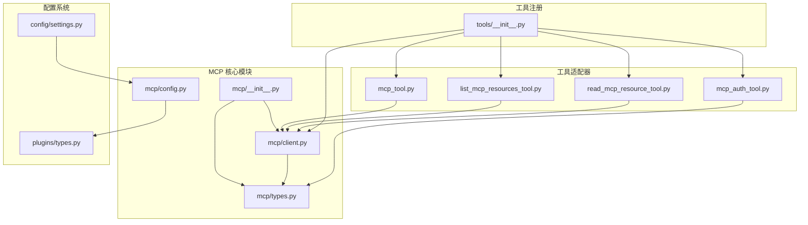
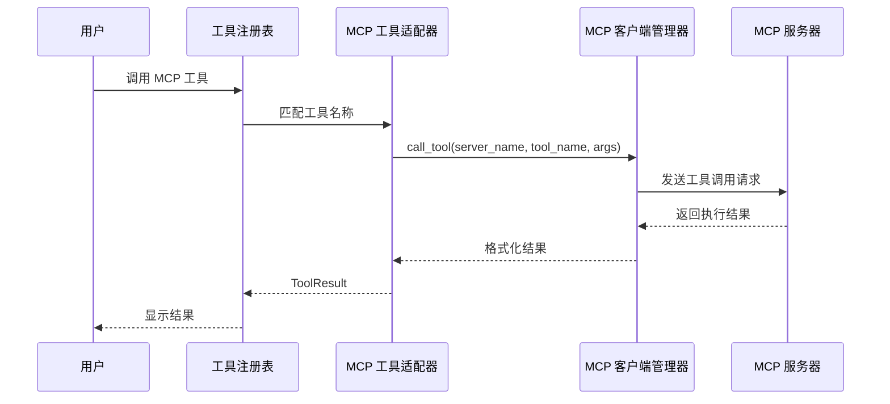
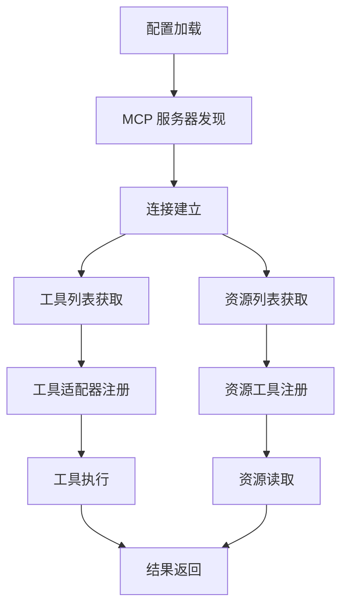
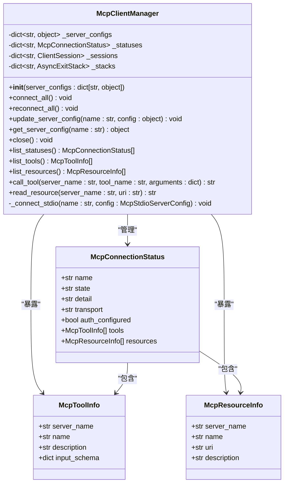
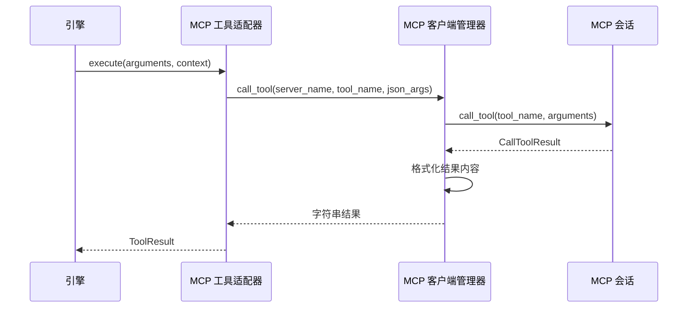
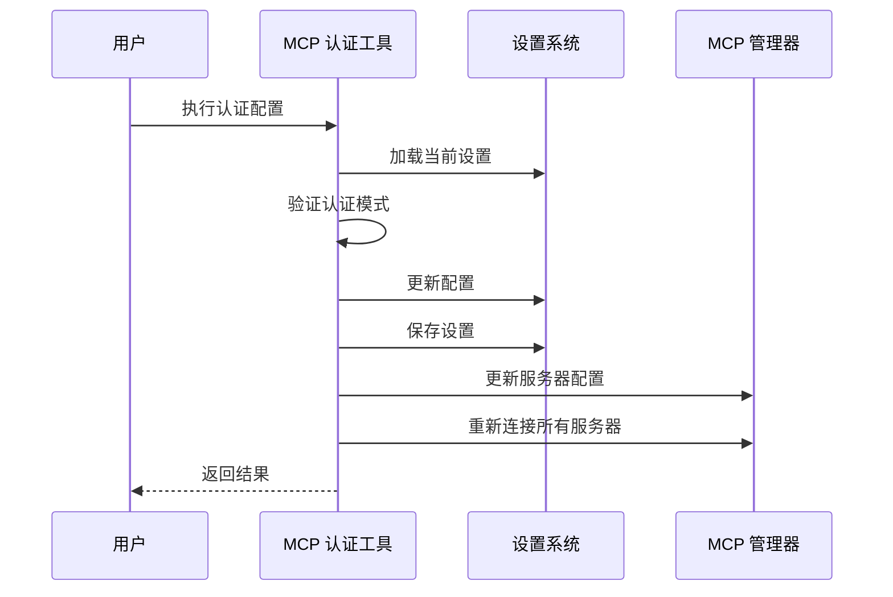
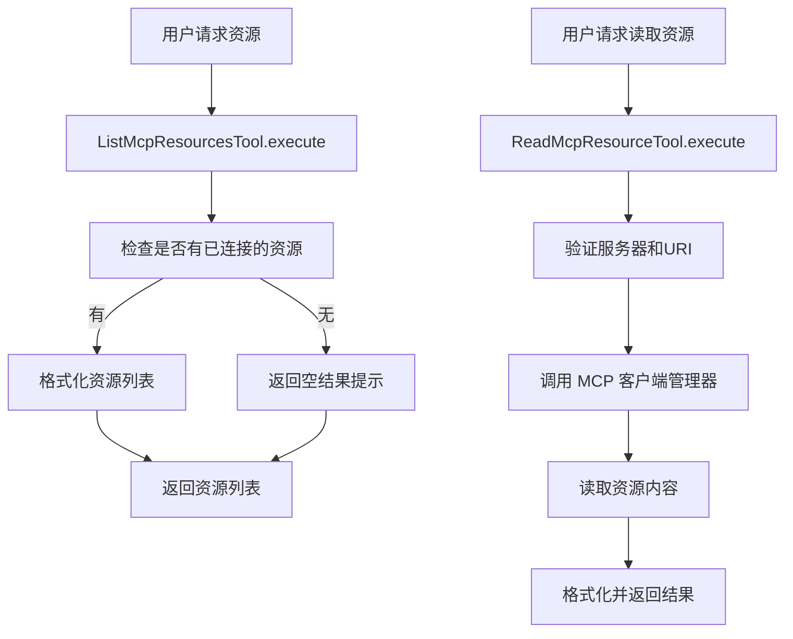
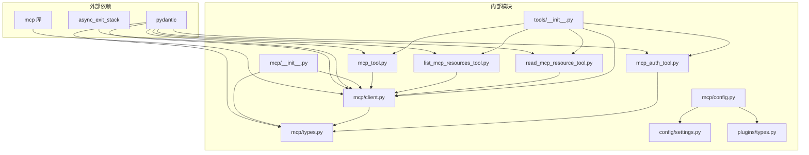
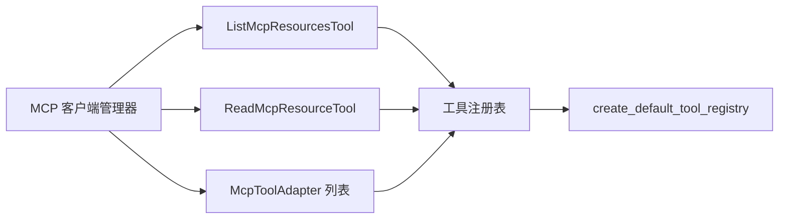

# MCP 集成使用指南

<cite>
**本文档引用的文件**
- [mcp/__init__.py](file://src/openharness/mcp/__init__.py)
- [mcp/client.py](file://src/openharness/mcp/client.py)
- [mcp/config.py](file://src/openharness/mcp/config.py)
- [mcp/types.py](file://src/openharness/mcp/types.py)
- [tools/mcp_tool.py](file://src/openharness/tools/mcp_tool.py)
- [tools/mcp_auth_tool.py](file://src/openharness/tools/mcp_auth_tool.py)
- [tools/list_mcp_resources_tool.py](file://src/openharness/tools/list_mcp_resources_tool.py)
- [tools/read_mcp_resource_tool.py](file://src/openharness/tools/read_mcp_resource_tool.py)
- [tools/__init__.py](file://src/openharness/tools/__init__.py)
- [config/settings.py](file://src/openharness/config/settings.py)
- [plugins/types.py](file://src/openharness/plugins/types.py)
- [test_mcp/test_integration.py](file://tests/test_mcp/test_integration.py)
- [test_tools/test_mcp_auth_tool.py](file://tests/test_tools/test_mcp_auth_tool.py)
</cite>

## 目录
1. [简介](#简介)
2. [项目结构](#项目结构)
3. [核心组件](#核心组件)
4. [架构概览](#架构概览)
5. [详细组件分析](#详细组件分析)
6. [依赖关系分析](#依赖关系分析)
7. [性能考虑](#性能考虑)
8. [故障排除指南](#故障排除指南)
9. [结论](#结论)
10. [附录](#附录)

## 简介

OpenHarness 的 MCP（Model Context Protocol）集成为用户提供了与外部 AI 服务和工具进行交互的能力。MCP 允许 OpenHarness 连接到各种 MCP 服务器，发现可用的工具和资源，并通过统一的接口进行调用。

本指南将详细介绍如何在 OpenHarness 中使用 MCP 工具和资源，包括 MCP 工具的封装和调用方法、MCP 资源访问工具的使用、MCP 认证工具的使用方法，以及完整的 MCP 集成示例。

## 项目结构

OpenHarness 的 MCP 集成主要分布在以下模块中：

**图表来源**
- [mcp/__init__.py:1-75](file://src/openharness/mcp/__init__.py#L1-L75)
- [mcp/client.py:1-175](file://src/openharness/mcp/client.py#L1-L175)
- [tools/__init__.py:1-102](file://src/openharness/tools/__init__.py#L1-L102)

**章节来源**
- [mcp/__init__.py:1-75](file://src/openharness/mcp/__init__.py#L1-L75)
- [mcp/client.py:1-175](file://src/openharness/mcp/client.py#L1-L175)
- [tools/__init__.py:1-102](file://src/openharness/tools/__init__.py#L1-L102)

## 核心组件

### MCP 客户端管理器

McpClientManager 是 MCP 集成的核心组件，负责管理 MCP 连接和暴露工具/资源。

**关键功能：**
- 连接和断开 MCP 服务器
- 管理多个 MCP 服务器的连接状态
- 提供工具调用和资源读取功能
- 处理连接重试和错误恢复

**章节来源**
- [mcp/client.py:20-175](file://src/openharness/mcp/client.py#L20-L175)

### MCP 配置管理

MCP 配置系统支持从设置文件和插件中加载服务器配置，并提供配置合并功能。

**配置类型：**
- McpStdioServerConfig：标准输入输出传输
- McpHttpServerConfig：HTTP 传输
- McpWebSocketServerConfig：WebSocket 传输

**章节来源**
- [mcp/types.py:11-37](file://src/openharness/mcp/types.py#L11-L37)
- [mcp/config.py:8-17](file://src/openharness/mcp/config.py#L8-L17)

### 工具适配器

OpenHarness 提供了多种 MCP 工具适配器，用于将 MCP 工具和资源转换为 OpenHarness 可用的标准工具。

**工具类型：**
- McpToolAdapter：将 MCP 工具适配为 OpenHarness 工具
- McpAuthTool：管理 MCP 认证配置
- ListMcpResourcesTool：列出可用的 MCP 资源
- ReadMcpResourceTool：读取 MCP 资源

**章节来源**
- [tools/mcp_tool.py:14-56](file://src/openharness/tools/mcp_tool.py#L14-L56)
- [tools/mcp_auth_tool.py:21-72](file://src/openharness/tools/mcp_auth_tool.py#L21-L72)
- [tools/list_mcp_resources_tool.py:15-37](file://src/openharness/tools/list_mcp_resources_tool.py#L15-L37)
- [tools/read_mcp_resource_tool.py:18-36](file://src/openharness/tools/read_mcp_resource_tool.py#L18-L36)

## 架构概览

OpenHarness 的 MCP 集成采用分层架构设计，确保了良好的可扩展性和维护性：

**图表来源**
- [tools/mcp_tool.py:26-33](file://src/openharness/tools/mcp_tool.py#L26-L33)
- [mcp/client.py:92-106](file://src/openharness/mcp/client.py#L92-L106)

### 数据流图

**图表来源**
- [mcp/client.py:136-155](file://src/openharness/mcp/client.py#L136-L155)
- [tools/__init__.py:87-92](file://src/openharness/tools/__init__.py#L87-L92)

## 详细组件分析

### MCP 客户端管理器类图

**图表来源**
- [mcp/client.py:20-175](file://src/openharness/mcp/client.py#L20-L175)
- [mcp/types.py:46-77](file://src/openharness/mcp/types.py#L46-L77)

### MCP 工具适配器工作流程

**图表来源**
- [tools/mcp_tool.py:26-33](file://src/openharness/tools/mcp_tool.py#L26-L33)
- [mcp/client.py:92-106](file://src/openharness/mcp/client.py#L92-L106)

**章节来源**
- [tools/mcp_tool.py:14-56](file://src/openharness/tools/mcp_tool.py#L14-L56)
- [mcp/client.py:92-106](file://src/openharness/mcp/client.py#L92-L106)

### MCP 认证工具序列图

**图表来源**
- [tools/mcp_auth_tool.py:28-72](file://src/openharness/tools/mcp_auth_tool.py#L28-L72)
- [config/settings.py:144-161](file://src/openharness/config/settings.py#L144-L161)

**章节来源**
- [tools/mcp_auth_tool.py:21-72](file://src/openharness/tools/mcp_auth_tool.py#L21-L72)
- [config/settings.py:49-64](file://src/openharness/config/settings.py#L49-L64)

### 资源访问工具流程图

**图表来源**
- [tools/list_mcp_resources_tool.py:29-36](file://src/openharness/tools/list_mcp_resources_tool.py#L29-L36)
- [tools/read_mcp_resource_tool.py:32-35](file://src/openharness/tools/read_mcp_resource_tool.py#L32-L35)

**章节来源**
- [tools/list_mcp_resources_tool.py:15-37](file://src/openharness/tools/list_mcp_resources_tool.py#L15-L37)
- [tools/read_mcp_resource_tool.py:18-36](file://src/openharness/tools/read_mcp_resource_tool.py#L18-L36)

## 依赖关系分析

### 模块依赖图

**图表来源**
- [mcp/client.py:8-17](file://src/openharness/mcp/client.py#L8-L17)
- [mcp/types.py:5-8](file://src/openharness/mcp/types.py#L5-L8)
- [tools/mcp_tool.py:7-11](file://src/openharness/tools/mcp_tool.py#L7-L11)

### 工具注册依赖

**图表来源**
- [tools/__init__.py:87-92](file://src/openharness/tools/__init__.py#L87-L92)

**章节来源**
- [mcp/client.py:1-175](file://src/openharness/mcp/client.py#L1-L175)
- [tools/__init__.py:45-92](file://src/openharness/tools/__init__.py#L45-L92)

## 性能考虑

### 连接管理优化

1. **异步连接管理**：使用 AsyncExitStack 确保连接的正确清理和资源释放
2. **批量操作**：支持同时连接多个 MCP 服务器，提高整体性能
3. **连接复用**：已建立的会话可以在重新认证时复用

### 内存使用优化

1. **延迟初始化**：仅在需要时创建 MCP 工具适配器
2. **状态缓存**：缓存工具和资源列表以避免重复查询
3. **资源清理**：及时关闭不再使用的连接和会话

### 错误处理策略

1. **优雅降级**：单个服务器连接失败不影响其他服务器
2. **重试机制**：支持重新连接所有服务器
3. **超时控制**：避免长时间阻塞操作

## 故障排除指南

### 常见问题及解决方案

#### 连接失败问题

**症状**：MCP 服务器无法连接
**可能原因**：
- 服务器配置错误
- 网络连接问题
- 权限不足

**解决步骤**：
1. 检查服务器配置是否正确
2. 验证网络连接
3. 确认认证信息有效

#### 工具调用失败

**症状**：MCP 工具调用返回错误
**可能原因**：
- 输入参数不正确
- 工具未正确注册
- 服务器响应异常

**解决步骤**：
1. 验证工具输入模型
2. 检查工具注册状态
3. 查看服务器日志

#### 资源访问问题

**症状**：无法读取 MCP 资源
**可能原因**：
- 资源 URI 不正确
- 权限不足
- 服务器未提供该资源

**解决步骤**：
1. 验证资源 URI 格式
2. 检查访问权限
3. 使用资源列表工具确认资源存在

**章节来源**
- [mcp/client.py:166-175](file://src/openharness/mcp/client.py#L166-L175)
- [tools/mcp_auth_tool.py:36-56](file://src/openharness/tools/mcp_auth_tool.py#L36-L56)

### 调试技巧

1. **启用详细日志**：检查连接状态和错误详情
2. **使用诊断工具**：通过 `list_mcp_resources` 工具查看可用资源
3. **验证配置**：确保 MCP 服务器配置正确且可访问

## 结论

OpenHarness 的 MCP 集成提供了一个强大而灵活的框架，使用户能够无缝地与各种 MCP 服务器进行交互。通过标准化的工具适配器、资源管理和认证机制，用户可以轻松地扩展和定制 MCP 功能。

主要优势包括：
- 统一的工具接口
- 灵活的配置管理
- 完善的错误处理
- 良好的性能表现

建议在实际使用中：
1. 合理规划 MCP 服务器配置
2. 建立完善的监控和日志机制
3. 定期更新和维护 MCP 连接
4. 制定安全的认证策略

## 附录

### 配置示例

MCP 服务器配置支持多种传输协议：

1. **STDIO 配置**：适用于本地进程
2. **HTTP 配置**：适用于远程 HTTP 服务器
3. **WebSocket 配置**：适用于实时通信场景

### 最佳实践

1. **安全考虑**：使用环境变量存储敏感信息
2. **性能优化**：合理设置连接池和超时时间
3. **监控告警**：建立连接状态监控机制
4. **备份恢复**：定期备份 MCP 配置和认证信息