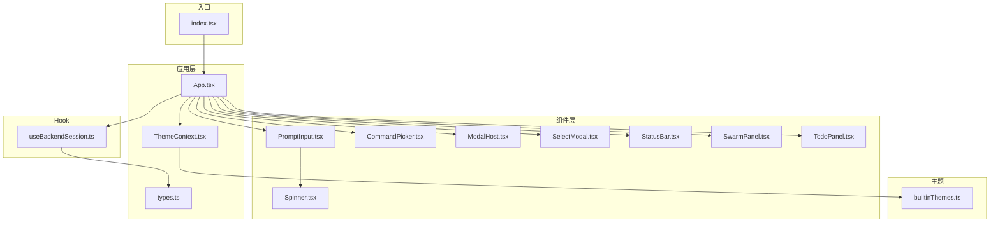
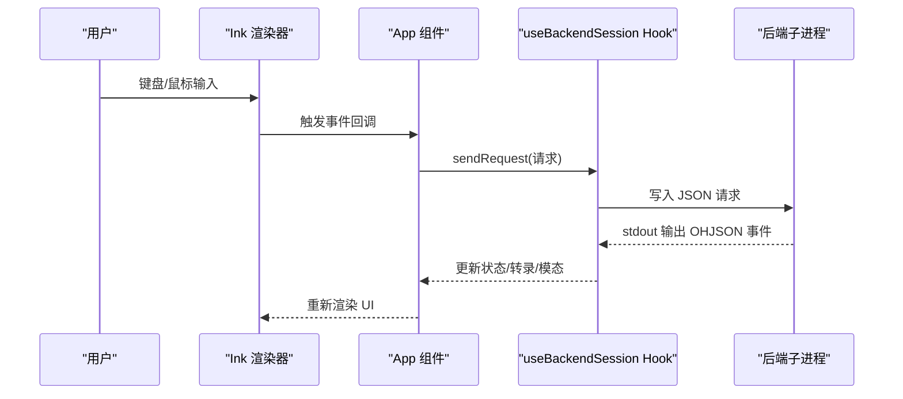
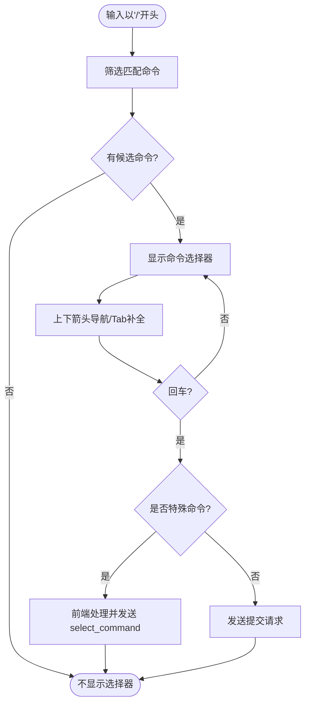
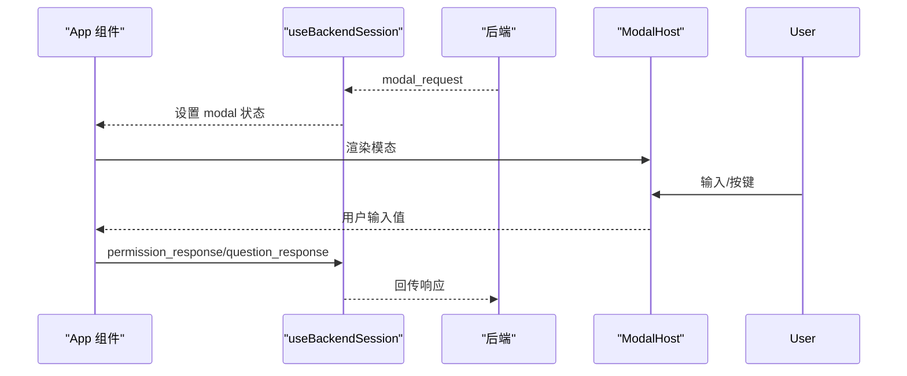
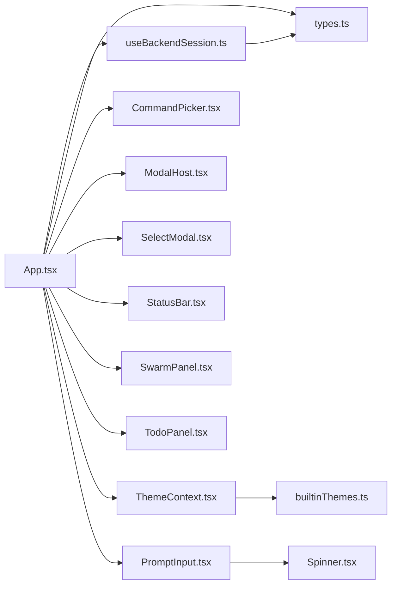

# React TUI 交互界面

<cite>
**本文档引用的文件**
- [App.tsx](file://frontend/terminal/src/App.tsx)
- [index.tsx](file://frontend/terminal/src/index.tsx)
- [CommandPicker.tsx](file://frontend/terminal/src/components/CommandPicker.tsx)
- [StatusBar.tsx](file://frontend/terminal/src/components/StatusBar.tsx)
- [PromptInput.tsx](file://frontend/terminal/src/components/PromptInput.tsx)
- [ModalHost.tsx](file://frontend/terminal/src/components/ModalHost.tsx)
- [SelectModal.tsx](file://frontend/terminal/src/components/SelectModal.tsx)
- [ThemeContext.tsx](file://frontend/terminal/src/theme/ThemeContext.tsx)
- [builtinThemes.ts](file://frontend/terminal/src/theme/builtinThemes.ts)
- [Spinner.tsx](file://frontend/terminal/src/components/Spinner.tsx)
- [SwarmPanel.tsx](file://frontend/terminal/src/components/SwarmPanel.tsx)
- [TodoPanel.tsx](file://frontend/terminal/src/components/TodoPanel.tsx)
- [useBackendSession.ts](file://frontend/terminal/src/hooks/useBackendSession.ts)
- [types.ts](file://frontend/terminal/src/types.ts)
</cite>

## 目录
1. [简介](#简介)
2. [项目结构](#项目结构)
3. [核心组件](#核心组件)
4. [架构总览](#架构总览)
5. [详细组件分析](#详细组件分析)
6. [依赖关系分析](#依赖关系分析)
7. [性能考虑](#性能考虑)
8. [故障排除指南](#故障排除指南)
9. [结论](#结论)
10. [附录](#附录)

## 简介
本文件为 OpenHarness 的 React TUI（文本用户界面）交互界面的权威技术文档。该界面基于 React 和 Ink 构建，通过子进程与后端服务通信，提供命令选择器、权限对话框、状态栏、动画反馈、实时更新、面板化任务管理等能力。文档覆盖界面布局、键盘快捷键系统、命令选择流程、权限与对话框交互、状态栏信息与动画反馈、主题与界面定制、跨平台兼容与性能优化，并给出常见使用场景的操作指南与最佳实践。

## 项目结构
前端终端界面位于 frontend/terminal/src，采用按功能模块划分的目录组织方式：
- components：界面组件（输入、状态栏、命令选择器、模态框、面板等）
- hooks：自定义 Hook（如后端会话管理）
- theme：主题上下文与内置主题
- 类型定义：统一的数据结构与事件类型
- 入口：index.tsx 负责渲染应用并处理终端兼容性

图表来源
- [index.tsx:1-82](file://frontend/terminal/src/index.tsx#L1-L82)
- [App.tsx:1-590](file://frontend/terminal/src/App.tsx#L1-L590)
- [PromptInput.tsx:1-255](file://frontend/terminal/src/components/PromptInput.tsx#L1-L255)
- [CommandPicker.tsx:1-36](file://frontend/terminal/src/components/CommandPicker.tsx#L1-L36)
- [ModalHost.tsx:1-254](file://frontend/terminal/src/components/ModalHost.tsx#L1-L254)
- [SelectModal.tsx:1-45](file://frontend/terminal/src/components/SelectModal.tsx#L1-L45)
- [StatusBar.tsx:1-120](file://frontend/terminal/src/components/StatusBar.tsx#L1-L120)
- [Spinner.tsx:1-48](file://frontend/terminal/src/components/Spinner.tsx#L1-L48)
- [SwarmPanel.tsx:1-128](file://frontend/terminal/src/components/SwarmPanel.tsx#L1-L128)
- [TodoPanel.tsx:1-92](file://frontend/terminal/src/components/TodoPanel.tsx#L1-L92)
- [ThemeContext.tsx:1-41](file://frontend/terminal/src/theme/ThemeContext.tsx#L1-L41)
- [builtinThemes.ts:1-162](file://frontend/terminal/src/theme/builtinThemes.ts#L1-L162)
- [useBackendSession.ts:1-463](file://frontend/terminal/src/hooks/useBackendSession.ts#L1-L463)
- [types.ts:1-99](file://frontend/terminal/src/types.ts#L1-L99)

章节来源
- [index.tsx:1-82](file://frontend/terminal/src/index.tsx#L1-L82)
- [App.tsx:1-590](file://frontend/terminal/src/App.tsx#L1-L590)

## 核心组件
- 应用容器 App：负责整体布局、键盘输入处理、命令提示与选择、模态框与选择框、状态栏与面板渲染、主题切换、脚本化自动化等。
- 后端会话 Hook useBackendSession：建立与后端的子进程通信，解析 OHJSON 协议事件，缓冲流式输出，维护状态快照与转录。
- 输入组件 PromptInput：支持多行编辑、光标定位、退格删除、Shift+Enter 换行、提交控制、忙碌状态指示与图片附件提示。
- 命令选择器 CommandPicker：在输入以“/”开头时显示可选命令列表，支持上下导航与回车选择。
- 权限与对话框 ModalHost：处理后端发起的权限确认、编辑差异展示、问答输入等模态交互。
- 前端选择框 SelectModal：处理前端主动触发的选择请求（如 /permissions、/resume 等），支持数字键快速选择。
- 状态栏 StatusBar：显示模型、令牌用量、模式、任务数、MCP 连接数、计划模式指示与阻断工具提示。
- 动画与反馈：Spinner 提供跨平台兼容的旋转动画；键盘提示与粘贴状态提示增强交互反馈。
- 面板：SwarmPanel 展示群智能体运行状态与通知；TodoPanel 展示待办清单与完成进度。
- 主题系统：ThemeContext + builtinThemes 提供主题切换与图标配置。

章节来源
- [App.tsx:52-590](file://frontend/terminal/src/App.tsx#L52-L590)
- [useBackendSession.ts:24-463](file://frontend/terminal/src/hooks/useBackendSession.ts#L24-L463)
- [PromptInput.tsx:199-255](file://frontend/terminal/src/components/PromptInput.tsx#L199-L255)
- [CommandPicker.tsx:1-36](file://frontend/terminal/src/components/CommandPicker.tsx#L1-L36)
- [ModalHost.tsx:187-254](file://frontend/terminal/src/components/ModalHost.tsx#L187-L254)
- [SelectModal.tsx:11-45](file://frontend/terminal/src/components/SelectModal.tsx#L11-L45)
- [StatusBar.tsx:57-120](file://frontend/terminal/src/components/StatusBar.tsx#L57-L120)
- [Spinner.tsx:19-48](file://frontend/terminal/src/components/Spinner.tsx#L19-L48)
- [SwarmPanel.tsx:39-128](file://frontend/terminal/src/components/SwarmPanel.tsx#L39-L128)
- [TodoPanel.tsx:21-92](file://frontend/terminal/src/components/TodoPanel.tsx#L21-L92)
- [ThemeContext.tsx:17-41](file://frontend/terminal/src/theme/ThemeContext.tsx#L17-L41)
- [builtinThemes.ts:159-162](file://frontend/terminal/src/theme/builtinThemes.ts#L159-L162)

## 架构总览
TUI 采用“前端 React 组件 + Ink 渲染 + 子进程后端”的双进程架构。前端负责 UI 与交互，后端负责业务逻辑与工具调用。两者通过标准输入/输出以 OHJSON 协议交换事件。

图表来源
- [index.tsx:40-82](file://frontend/terminal/src/index.tsx#L40-L82)
- [App.tsx:223-449](file://frontend/terminal/src/App.tsx#L223-L449)
- [useBackendSession.ts:107-136](file://frontend/terminal/src/hooks/useBackendSession.ts#L107-L136)

## 详细组件分析

### 布局与交互流
- 整体布局采用垂直方向的 Box 容器，从上到下依次为：对话视图、后端模态、前端选择模态、命令选择器、待办面板、群智能体面板、状态栏、输入区与键盘提示。
- 当后端未就绪时显示连接提示；当存在模态或选择框时隐藏输入区，避免冲突。
- 输入区根据忙碌状态显示旋转动画与当前工具名提示；支持图片附件标签与剪贴板状态提示。

章节来源
- [App.tsx:503-588](file://frontend/terminal/src/App.tsx#L503-L588)
- [PromptInput.tsx:219-255](file://frontend/terminal/src/components/PromptInput.tsx#L219-L255)

### 键盘快捷键系统
- 全局与输入相关快捷键均在 App.useInput 中集中处理，避免重复提交与冲突。
- 忙碌状态下的特殊键：Esc 发送中断请求；Ctrl+C 在忙碌时停止，空闲时退出。
- 命令选择器：上下箭头导航、Tab 补全、Esc 取消。
- 历史记录：上下箭头在非命令选择器状态下进行历史回放。
- 模态交互：权限/编辑差异/问答模态分别支持 y/n/a/数字键/ESC 等快速响应。
- 图片粘贴：Ctrl+V 在非忙碌且允许时读取剪贴板图像并附加到消息。
- 键盘提示：底部显示常用快捷键提示，帮助用户快速掌握操作。

章节来源
- [App.tsx:223-449](file://frontend/terminal/src/App.tsx#L223-L449)
- [PromptInput.tsx:75-160](file://frontend/terminal/src/components/PromptInput.tsx#L75-L160)

### 命令选择器
- 当输入以“/”开头且后端返回可用命令时，显示命令提示列表。
- 支持上下导航、Tab 自动补全、回车执行、Esc 取消。
- 特殊命令拦截：对 /permissions、/resume、/plan、/theme 等进行前端交互处理，其余交由后端执行。

图表来源
- [App.tsx:148-154](file://frontend/terminal/src/App.tsx#L148-L154)
- [App.tsx:188-221](file://frontend/terminal/src/App.tsx#L188-L221)
- [CommandPicker.tsx:4-36](file://frontend/terminal/src/components/CommandPicker.tsx#L4-L36)

章节来源
- [App.tsx:148-221](file://frontend/terminal/src/App.tsx#L148-L221)
- [CommandPicker.tsx:1-36](file://frontend/terminal/src/components/CommandPicker.tsx#L1-L36)

### 权限对话框与后端模态
- 权限确认：y 允许一次，n 拒绝；支持 ESC 取消。
- 编辑差异：显示文件变更摘要，支持 y（仅一次）、a（总是）、n（拒绝）。
- 问答模态：支持多行输入（Shift+Enter 新增一行，Enter 提交）。
- MCP 认证：显示认证提示并接收用户输入。

图表来源
- [ModalHost.tsx:187-254](file://frontend/terminal/src/components/ModalHost.tsx#L187-L254)
- [useBackendSession.ts:387-390](file://frontend/terminal/src/hooks/useBackendSession.ts#L387-L390)

章节来源
- [ModalHost.tsx:1-254](file://frontend/terminal/src/components/ModalHost.tsx#L1-L254)
- [useBackendSession.ts:378-390](file://frontend/terminal/src/hooks/useBackendSession.ts#L378-L390)

### 前端选择框（SelectModal）
- 用于前端主动触发的选择场景（如 /permissions、/resume 等）。
- 支持上下导航、回车选择、数字键快速选择、ESC 取消。
- 选择完成后向后端发送 apply_select_command 并进入忙碌状态。

章节来源
- [App.tsx:164-185](file://frontend/terminal/src/App.tsx#L164-L185)
- [SelectModal.tsx:11-45](file://frontend/terminal/src/components/SelectModal.tsx#L11-L45)

### 状态栏与动画反馈
- 状态栏显示模型、令牌用量、模式、任务数、MCP 连接数，并在计划模式下提供视觉反馈与阻断工具提示。
- 旋转动画 Spinner 在 Windows 上使用安全字符集，在其他平台使用主题图标数组。
- 状态栏闪烁效果用于计划模式关闭的提示。

章节来源
- [StatusBar.tsx:57-120](file://frontend/terminal/src/components/StatusBar.tsx#L57-L120)
- [Spinner.tsx:19-48](file://frontend/terminal/src/components/Spinner.tsx#L19-L48)

### 面板：SwarmPanel 与 TodoPanel
- SwarmPanel：显示群智能体运行状态、持续时间、任务摘要与最近通知；支持 Ctrl+W 折叠/展开。
- TodoPanel：解析 Markdown 待办项，支持 Ctrl+T 切换紧凑/展开视图。

章节来源
- [SwarmPanel.tsx:39-128](file://frontend/terminal/src/components/SwarmPanel.tsx#L39-L128)
- [TodoPanel.tsx:21-92](file://frontend/terminal/src/components/TodoPanel.tsx#L21-L92)

### 主题系统与界面定制
- ThemeContext 提供主题上下文与切换函数；builtinThemes 定义默认、深色、极简、赛博朋克、Solarized 等主题。
- 主题包含颜色与图标两部分，影响提示文字、边框、动画帧等视觉表现。
- 主题名称可通过后端状态动态更新，实现运行时切换。

章节来源
- [ThemeContext.tsx:17-41](file://frontend/terminal/src/theme/ThemeContext.tsx#L17-L41)
- [builtinThemes.ts:159-162](file://frontend/terminal/src/theme/builtinThemes.ts#L159-L162)
- [App.tsx:85-90](file://frontend/terminal/src/App.tsx#L85-L90)

### 实时更新与流式渲染
- 使用 startTransition 与定时器缓冲 assistant 流与转录事件，避免高频重渲染导致闪烁。
- 支持“助手增量”与“转录项”两类事件的批量刷新策略。
- 会话结束与错误事件清理缓冲并恢复忙碌状态。

章节来源
- [useBackendSession.ts:48-106](file://frontend/terminal/src/hooks/useBackendSession.ts#L48-L106)
- [useBackendSession.ts:297-353](file://frontend/terminal/src/hooks/useBackendSession.ts#L297-L353)

## 依赖关系分析

图表来源
- [App.tsx:1-16](file://frontend/terminal/src/App.tsx#L1-L16)
- [useBackendSession.ts:1-16](file://frontend/terminal/src/hooks/useBackendSession.ts#L1-L16)
- [ThemeContext.tsx:1-6](file://frontend/terminal/src/theme/ThemeContext.tsx#L1-L6)
- [builtinThemes.ts:1-24](file://frontend/terminal/src/theme/builtinThemes.ts#L1-L24)
- [PromptInput.tsx:1-8](file://frontend/terminal/src/components/PromptInput.tsx#L1-L8)
- [Spinner.tsx:1-5](file://frontend/terminal/src/components/Spinner.tsx#L1-L5)
- [types.ts:1-99](file://frontend/terminal/src/types.ts#L1-L99)

章节来源
- [App.tsx:1-16](file://frontend/terminal/src/App.tsx#L1-L16)
- [useBackendSession.ts:1-16](file://frontend/terminal/src/hooks/useBackendSession.ts#L1-L16)

## 性能考虑
- 渲染优化
  - 使用 useDeferredValue 对转录、助手缓冲、状态、任务等进行延迟渲染，降低主线程压力。
  - 使用 startTransition 包裹频繁更新的状态（如助手增量、转录项），减少重排抖动。
- 流式渲染节流
  - 助手增量与转录项采用定时器批量刷新，避免逐 token 重渲染。
- 资源释放
  - 组件卸载与进程退出时清理定时器与子进程，防止内存泄漏与僵尸进程。
- 跨平台兼容
  - 处理 setRawMode/EIO 错误，WSL/Windows 场景下回退到 /dev/tty 获取真实 TTY。
  - Windows 上使用安全动画字符集，保证兼容性。

章节来源
- [App.tsx:76-82](file://frontend/terminal/src/App.tsx#L76-L82)
- [useBackendSession.ts:48-106](file://frontend/terminal/src/hooks/useBackendSession.ts#L48-L106)
- [index.tsx:9-38](file://frontend/terminal/src/index.tsx#L9-L38)
- [index.tsx:58-81](file://frontend/terminal/src/index.tsx#L58-L81)
- [Spinner.tsx:21](file://frontend/terminal/src/components/Spinner.tsx#L21)

## 故障排除指南
- 终端输入异常或 EIO 错误
  - 现象：在 SSH、tmux、Docker 等环境中 Ink 初始化失败。
  - 处理：入口已捕获 EIO/EAGAIN 并优雅退出；必要时启用 /dev/tty 回退。
- Ctrl+C 无法退出
  - 现象：忙碌状态下 Ctrl+C 不生效。
  - 处理：忙碌时发送中断请求；空闲时才退出 TUI。
- 剪贴板图片粘贴无效
  - 现象：Ctrl+V 无响应或报错。
  - 处理：检查平台支持与权限；错误会通过临时状态提示反馈。
- 计划模式阻断工具
  - 现象：某些写入类工具在计划模式下被阻断。
  - 处理：状态栏会高亮提示当前阻断工具名称，退出计划模式后解除。
- 模态框卡住
  - 现象：权限/问答/差异模态无法关闭。
  - 处理：使用 y/n/a/ESC 或数字键快速响应；若仍卡住，尝试 Esc 清除输入并重试。

章节来源
- [index.tsx:9-38](file://frontend/terminal/src/index.tsx#L9-L38)
- [App.tsx:228-237](file://frontend/terminal/src/App.tsx#L228-L237)
- [App.tsx:100-124](file://frontend/terminal/src/App.tsx#L100-L124)
- [StatusBar.tsx:45-54](file://frontend/terminal/src/components/StatusBar.tsx#L45-L54)
- [ModalHost.tsx:198-254](file://frontend/terminal/src/components/ModalHost.tsx#L198-L254)

## 结论
本 TUI 界面通过清晰的组件分层、完善的键盘交互体系、丰富的状态反馈与主题定制能力，提供了稳定高效的终端交互体验。其流式渲染与跨平台兼容设计确保了在复杂工作负载下的流畅性与可靠性。建议在实际使用中结合本文档的最佳实践，充分利用命令选择器、权限对话框与面板功能，提升协作与自动化效率。

## 附录

### 常见使用场景与最佳实践
- 快速命令执行
  - 输入“/”触发命令选择器，使用上下箭头与 Tab 快速选择并回车执行。
- 权限与安全
  - 对敏感操作保持谨慎，优先使用“仅一次”或“拒绝”选项；必要时退出计划模式。
- 多行编辑与图片
  - Shift+Enter 在输入框内换行；Ctrl+V 粘贴图片并附带标签提示。
- 任务与群智能体
  - 使用 SwarmPanel 查看团队成员状态与通知；使用 TodoPanel 管理任务进度。
- 主题与可读性
  - 根据环境选择合适主题；在低对比度环境下使用深色主题提升可读性。

### 跨平台兼容性要点
- Windows：使用安全动画字符集；注意子进程组管理差异。
- WSL/WSL2：确保 TTY 正常；必要时启用 /dev/tty 回退。
- tmux/screen：避免嵌套终端导致的 raw mode 异常，出现 EIO 时优雅退出。