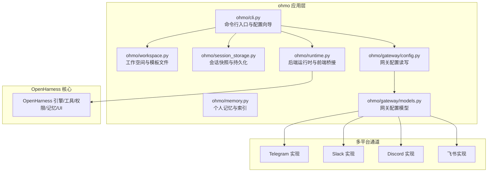
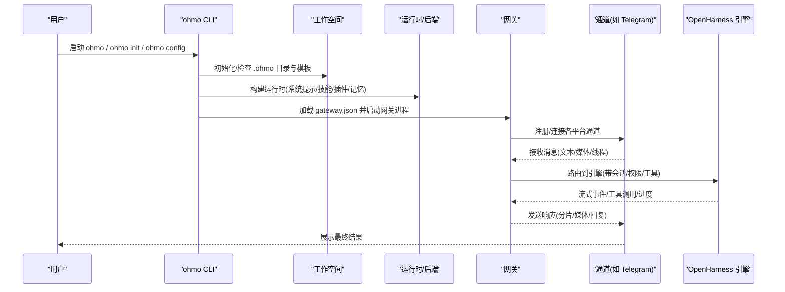
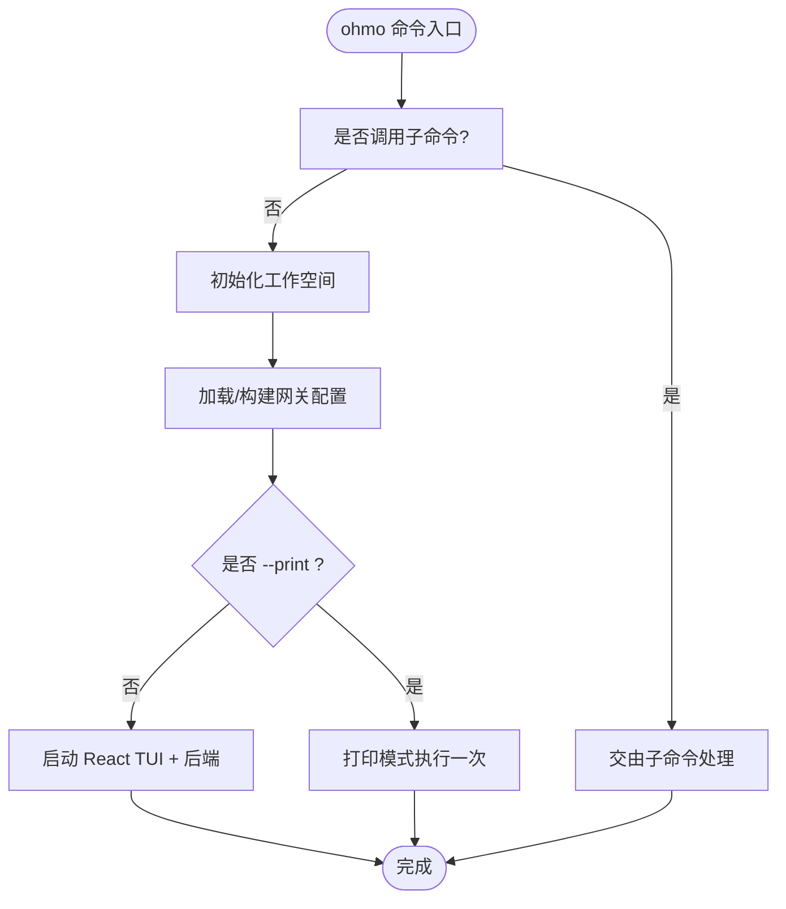
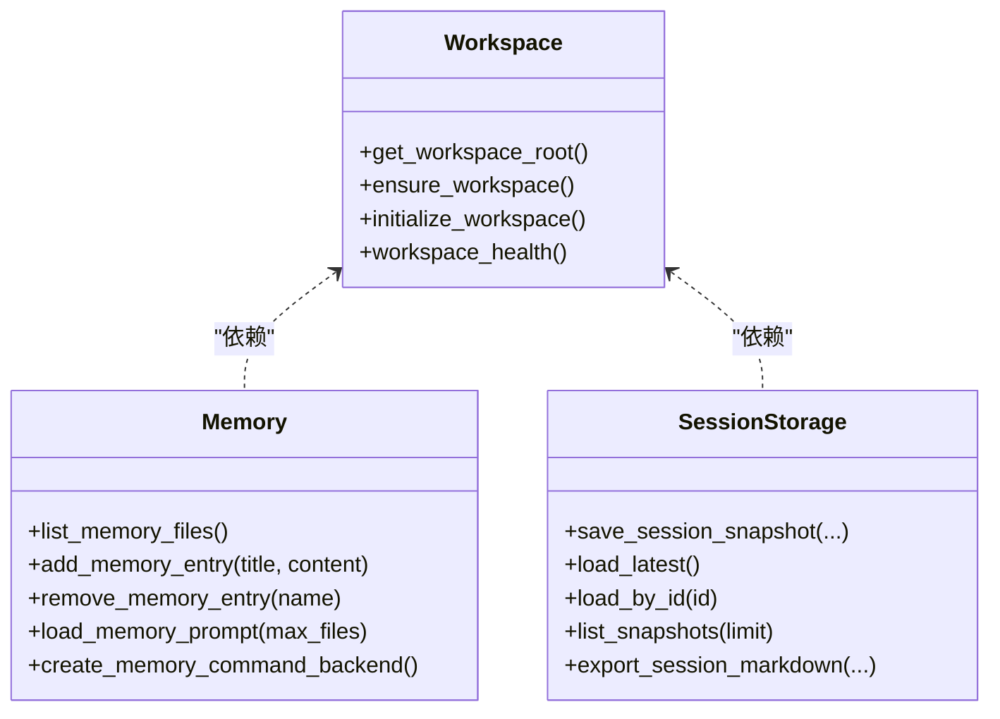
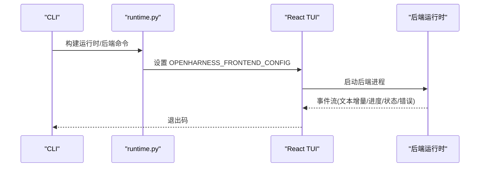
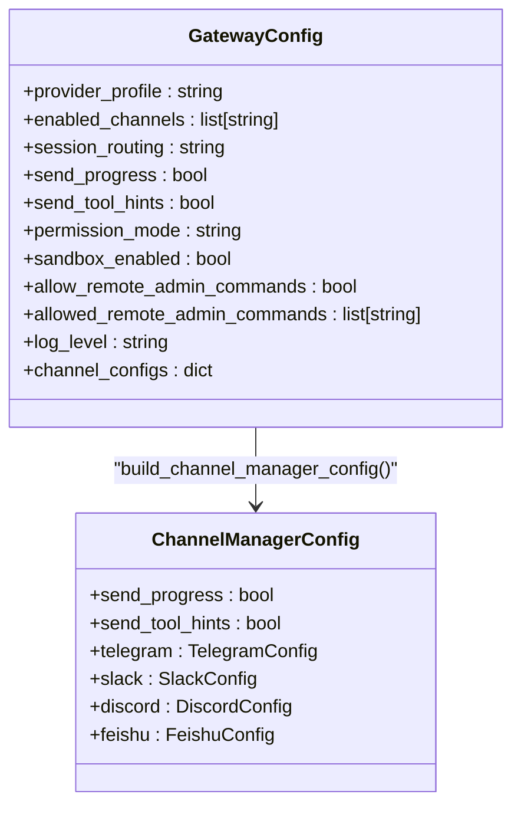
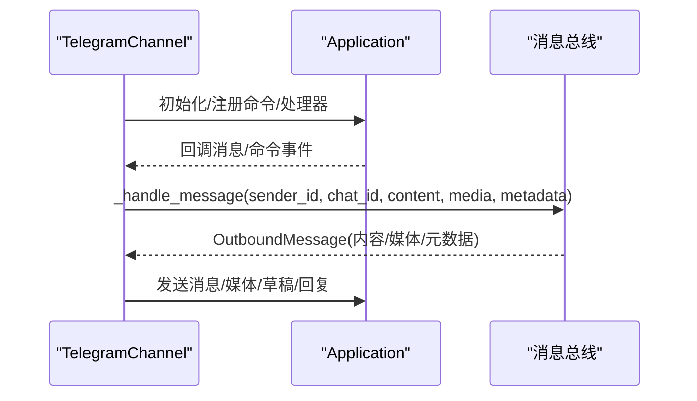
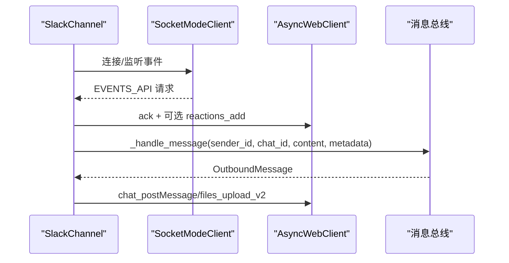
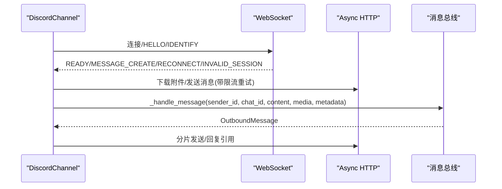
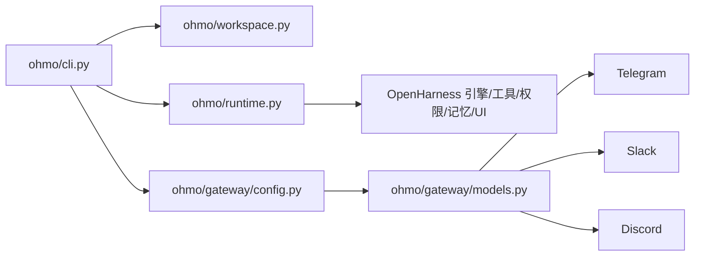

# ohmo 个人代理

<cite>
**本文引用的文件**
- [README.md](file://README.md)
- [ohmo/__main__.py](file://ohmo/__main__.py)
- [ohmo/cli.py](file://ohmo/cli.py)
- [ohmo/workspace.py](file://ohmo/workspace.py)
- [ohmo/memory.py](file://ohmo/memory.py)
- [ohmo/session_storage.py](file://ohmo/session_storage.py)
- [ohmo/runtime.py](file://ohmo/runtime.py)
- [ohmo/gateway/__init__.py](file://ohmo/gateway/__init__.py)
- [ohmo/gateway/config.py](file://ohmo/gateway/config.py)
- [ohmo/gateway/models.py](file://ohmo/gateway/models.py)
- [src/openharness/channels/impl/telegram.py](file://src/openharness/channels/impl/telegram.py)
- [src/openharness/channels/impl/slack.py](file://src/openharness/channels/impl/slack.py)
- [src/openharness/channels/impl/discord.py](file://src/openharness/channels/impl/discord.py)
</cite>

## 目录
1. [简介](#简介)
2. [项目结构](#项目结构)
3. [核心组件](#核心组件)
4. [架构总览](#架构总览)
5. [详细组件分析](#详细组件分析)
6. [依赖关系分析](#依赖关系分析)
7. [性能考量](#性能考量)
8. [故障排查指南](#故障排查指南)
9. [结论](#结论)
10. [附录](#附录)

## 简介
ohmo 是一个基于 OpenHarness 的“个人代理”，并非普通的聊天机器人，而是能够长期运行、在多个即时通讯平台（Telegram、Slack、Discord、飞书）中为你工作的智能助手。它直接复用你已有的 Claude Code 或 Codex 订阅，无需额外 API 密钥；通过“个人工作空间”沉淀记忆、偏好与历史，支持跨会话的连续性体验。

与传统聊天机器人的区别：
- 长期工作流：不是一次性问答，而是持续执行任务、分支开发、写代码、跑测试、开 PR 的“实际工作者”
- 多通道接入：统一网关在多个 IM 平台保持一致行为
- 个人记忆：soul/user/memory 等文件构成稳定的人格与上下文
- 安全与权限：可配置权限模式、路径规则、命令白名单，支持交互式审批
- 可扩展：兼容技能、插件、MCP、工具集，支持子代理与后台任务

## 项目结构
ohmo 作为独立应用打包在 OpenHarness 项目中，核心目录与职责如下：
- ohmo/：ohmo 应用层（CLI、工作空间、网关配置、运行时）
- src/openharness/channels/impl/*：各平台通道实现（Telegram、Slack、Discord、飞书等）
- src/openharness/...：OpenHarness 核心能力（引擎、工具、权限、记忆、UI 等）

图表来源
- [ohmo/cli.py:1-676](file://ohmo/cli.py#L1-L676)
- [ohmo/workspace.py:1-320](file://ohmo/workspace.py#L1-L320)
- [ohmo/memory.py:1-220](file://ohmo/memory.py#L1-L220)
- [ohmo/session_storage.py:1-203](file://ohmo/session_storage.py#L1-L203)
- [ohmo/runtime.py:1-219](file://ohmo/runtime.py#L1-L219)
- [ohmo/gateway/config.py:1-42](file://ohmo/gateway/config.py#L1-L42)
- [ohmo/gateway/models.py:1-34](file://ohmo/gateway/models.py#L1-L34)
- [src/openharness/channels/impl/telegram.py:1-526](file://src/openharness/channels/impl/telegram.py#L1-L526)
- [src/openharness/channels/impl/slack.py:1-285](file://src/openharness/channels/impl/slack.py#L1-L285)
- [src/openharness/channels/impl/discord.py:1-312](file://src/openharness/channels/impl/discord.py#L1-L312)

章节来源
- [README.md:1-880](file://README.md#L1-L880)
- [ohmo/cli.py:1-676](file://ohmo/cli.py#L1-L676)
- [ohmo/workspace.py:1-320](file://ohmo/workspace.py#L1-L320)

## 核心组件
- 工作空间与模板：初始化 .ohmo 目录，生成 soul/user/memory 索引等模板文件，并记录状态与网关配置默认值
- 个人记忆：扫描、添加、删除记忆条目，渲染为系统提示的一部分
- 会话持久化：保存最新/按会话键/按会话 ID 的快照，支持导出对话摘要
- 运行时与 UI：构建后端运行时，启动 React 终端 UI，或以打印模式输出单次结果
- 网关配置：加载/保存 gateway.json，将 ohmo 配置映射到通道兼容模型
- 多平台通道：Telegram、Slack、Discord、飞书的长连接/轮询、消息分片、媒体处理、线程/回复策略

章节来源
- [ohmo/workspace.py:163-320](file://ohmo/workspace.py#L163-L320)
- [ohmo/memory.py:28-177](file://ohmo/memory.py#L28-L177)
- [ohmo/session_storage.py:41-149](file://ohmo/session_storage.py#L41-L149)
- [ohmo/runtime.py:28-219](file://ohmo/runtime.py#L28-L219)
- [ohmo/gateway/config.py:13-42](file://ohmo/gateway/config.py#L13-L42)
- [ohmo/gateway/models.py:8-34](file://ohmo/gateway/models.py#L8-L34)

## 架构总览
ohmo 的运行由“CLI 启动 → 工作空间初始化 → 运行时构建 → 网关启动 → 多通道接入 → 消息路由 → OpenHarness 引擎执行 → 结果回传”的闭环组成。

图表来源
- [ohmo/cli.py:414-491](file://ohmo/cli.py#L414-L491)
- [ohmo/runtime.py:28-66](file://ohmo/runtime.py#L28-L66)
- [ohmo/gateway/config.py:29-42](file://ohmo/gateway/config.py#L29-L42)
- [src/openharness/channels/impl/telegram.py:129-189](file://src/openharness/channels/impl/telegram.py#L129-L189)

章节来源
- [README.md:446-502](file://README.md#L446-L502)
- [ohmo/cli.py:414-491](file://ohmo/cli.py#L414-L491)
- [ohmo/runtime.py:28-66](file://ohmo/runtime.py#L28-L66)

## 详细组件分析

### ohmo CLI 与配置向导
- 提供 init/config/doctor 等子命令，支持交互式选择提供方与通道
- 支持在终端可用时使用 questionary，否则回退到纯文本菜单
- 自动检测网关运行状态，必要时提示重启以应用新配置
- 支持 --workspace 指定工作空间根目录，支持 --print 模式快速输出

图表来源
- [ohmo/cli.py:414-491](file://ohmo/cli.py#L414-L491)
- [ohmo/cli.py:522-534](file://ohmo/cli.py#L522-L534)
- [ohmo/cli.py:536-560](file://ohmo/cli.py#L536-L560)

章节来源
- [ohmo/cli.py:1-676](file://ohmo/cli.py#L1-L676)

### 工作空间与个人记忆
- 工作空间包含 soul.md、user.md、identity.md、BOOTSTRAP.md、memory/、skills/、plugins/、groups/、sessions/、logs/、attachments/、state.json、gateway.json 等
- 首次初始化自动写入模板与默认网关配置
- 个人记忆以 markdown 文件形式存储，支持签名去重、软删除、索引同步

图表来源
- [ohmo/workspace.py:163-320](file://ohmo/workspace.py#L163-L320)
- [ohmo/memory.py:28-177](file://ohmo/memory.py#L28-L177)
- [ohmo/session_storage.py:41-149](file://ohmo/session_storage.py#L41-L149)

章节来源
- [ohmo/workspace.py:1-320](file://ohmo/workspace.py#L1-L320)
- [ohmo/memory.py:1-220](file://ohmo/memory.py#L1-L220)
- [ohmo/session_storage.py:1-203](file://ohmo/session_storage.py#L1-L203)

### 运行时与 UI 桥接
- 构建运行时：注入系统提示、技能/插件根目录、记忆后端、会话后端、最大轮次等
- React TUI：检测/安装前端依赖，通过环境变量传递后端命令，启动 TSX 入口
- 打印模式：单次提示直接输出，便于脚本化与非交互场景

图表来源
- [ohmo/runtime.py:92-144](file://ohmo/runtime.py#L92-L144)
- [ohmo/runtime.py:147-219](file://ohmo/runtime.py#L147-L219)

章节来源
- [ohmo/runtime.py:1-219](file://ohmo/runtime.py#L1-L219)

### 网关配置与通道适配
- 网关配置模型包含 provider_profile、enabled_channels、session_routing、权限模式、远程管理命令开关、日志级别、通道专属配置等
- 将 ohmo 配置映射到通用通道配置，启用对应通道并注入参数

图表来源
- [ohmo/gateway/models.py:8-34](file://ohmo/gateway/models.py#L8-L34)
- [ohmo/gateway/config.py:29-42](file://ohmo/gateway/config.py#L29-L42)

章节来源
- [ohmo/gateway/models.py:1-34](file://ohmo/gateway/models.py#L1-L34)
- [ohmo/gateway/config.py:1-42](file://ohmo/gateway/config.py#L1-L42)

### 多平台即时通讯集成

#### Telegram 通道
- 使用 python-telegram-bot 长轮询，支持文本、图片、语音、音频、文档
- 文本转 Telegram HTML，避免 token 泄露的日志降噪
- 支持媒体组聚合、草稿发送、回复原消息、打字指示、语音转写

图表来源
- [src/openharness/channels/impl/telegram.py:129-189](file://src/openharness/channels/impl/telegram.py#L129-L189)
- [src/openharness/channels/impl/telegram.py:223-312](file://src/openharness/channels/impl/telegram.py#L223-L312)

章节来源
- [src/openharness/channels/impl/telegram.py:1-526](file://src/openharness/channels/impl/telegram.py#L1-L526)

#### Slack 通道
- 使用 Socket Mode，支持提及/普通消息、私聊/群组策略、线程回复、反应标记
- 将 Markdown 转换为 Slack mrkdwn，表格/代码/链接等格式保留

图表来源
- [src/openharness/channels/impl/slack.py:33-65](file://src/openharness/channels/impl/slack.py#L33-L65)
- [src/openharness/channels/impl/slack.py:108-205](file://src/openharness/channels/impl/slack.py#L108-L205)

章节来源
- [src/openharness/channels/impl/slack.py:1-285](file://src/openharness/channels/impl/slack.py#L1-L285)

#### Discord 通道
- 使用 Discord Gateway WebSocket，心跳保活、识别、事件派发
- 支持媒体下载、大小限制、分片发送、回复引用、打字指示

图表来源
- [src/openharness/channels/impl/discord.py:39-61](file://src/openharness/channels/impl/discord.py#L39-L61)
- [src/openharness/channels/impl/discord.py:127-168](file://src/openharness/channels/impl/discord.py#L127-L168)
- [src/openharness/channels/impl/discord.py:205-265](file://src/openharness/channels/impl/discord.py#L205-L265)

章节来源
- [src/openharness/channels/impl/discord.py:1-312](file://src/openharness/channels/impl/discord.py#L1-L312)

## 依赖关系分析
- ohmo/cli.py 依赖工作空间、网关配置、运行时、会话后端与 UI 启动逻辑
- 运行时依赖 OpenHarness 引擎、工具、权限、记忆与会话后端
- 渠道实现依赖各自 SDK/协议，向上游提供统一的 OutboundMessage 接口
- 网关配置将 ohmo 的高层配置映射到具体通道的兼容模型

图表来源
- [ohmo/cli.py:15-34](file://ohmo/cli.py#L15-L34)
- [ohmo/runtime.py:11-21](file://ohmo/runtime.py#L11-L21)
- [ohmo/gateway/config.py:7-10](file://ohmo/gateway/config.py#L7-L10)

章节来源
- [ohmo/cli.py:1-676](file://ohmo/cli.py#L1-L676)
- [ohmo/runtime.py:1-219](file://ohmo/runtime.py#L1-L219)
- [ohmo/gateway/config.py:1-42](file://ohmo/gateway/config.py#L1-L42)

## 性能考量
- 通道侧的消息分片与媒体处理：Telegram/Discord 对超长文本进行切片，避免平台限制；媒体下载/上传采用异步与限流策略
- 打字指示与线程管理：减少用户等待感，避免重复处理
- 会话持久化：仅保存必要的消息与用量快照，使用原子写入降低损坏风险
- UI 启动：前端依赖首次安装与缓存，建议在 CI/CD 中预热 node_modules

## 故障排查指南
- doctor 命令：检查工作空间健康度、可用提供方、当前工作目录与网关配置位置
- 网关状态：查询运行态、PID、活动会话数、最后错误
- 通道问题：
  - Telegram：确认 token、代理配置、日志降噪；检查媒体下载失败与语音转写
  - Slack：确认 bot/app token、Socket Mode 连接、提及/线程策略
  - Discord：关注重连/无效会话/速率限制，检查意图位掩码与媒体大小
- 权限与安全：检查权限模式、路径规则、命令白名单；必要时临时切换到自动模式验证问题

章节来源
- [ohmo/cli.py:536-560](file://ohmo/cli.py#L536-L560)
- [ohmo/cli.py:669-676](file://ohmo/cli.py#L669-L676)
- [src/openharness/channels/impl/telegram.py:25-29](file://src/openharness/channels/impl/telegram.py#L25-L29)
- [src/openharness/channels/impl/slack.py:34-41](file://src/openharness/channels/impl/slack.py#L34-L41)
- [src/openharness/channels/impl/discord.py:48-61](file://src/openharness/channels/impl/discord.py#L48-L61)

## 结论
ohmo 将 OpenHarness 的强大能力封装为“个人代理”，通过统一网关与多平台通道，将模型推理、工具执行、权限控制与个人记忆整合为可长期运行的工作流。借助清晰的安装与配置流程、完善的会话与记忆持久化、以及对多平台的深度适配，ohmo 能够在不同团队与个人场景中稳定落地，成为真正的“为你工作”的智能助理。

## 附录

### 安装与配置流程
- 安装：Linux/macOS/WSL 与 Windows 均提供一键安装脚本与 pip 安装方式
- 配置：使用 ohmo init 初始化工作空间；ohmo config 进入交互式配置向导，选择提供方与启用/配置各通道
- 运行：ohmo gateway start 启动网关；ohmo doctor 检查健康状态

章节来源
- [README.md:197-254](file://README.md#L197-L254)

### 多平台通道配置要点
- Telegram：需要 bot token；可选择是否回复原消息；支持媒体组与草稿发送
- Slack：需要 bot_token 与 app_token；支持 Socket Mode；可配置 DM/群组策略与线程回复
- Discord：需要 bot token 与 gateway URL；配置意图位掩码；支持媒体下载与速率限制处理
- 飞书：需要 app_id/app_secret/加密密钥/校验 token；可配置 bot 名称与组策略

章节来源
- [ohmo/cli.py:194-316](file://ohmo/cli.py#L194-L316)
- [src/openharness/channels/impl/telegram.py:21-31](file://src/openharness/channels/impl/telegram.py#L21-L31)
- [src/openharness/channels/impl/slack.py:21-32](file://src/openharness/channels/impl/slack.py#L21-L32)
- [src/openharness/channels/impl/discord.py:24-38](file://src/openharness/channels/impl/discord.py#L24-L38)

### 使用示例与最佳实践
- 个人工作流程设计：利用 memory/ 记录偏好与上下文；通过 sessions/ 快照回溯历史
- 任务管理：结合 OpenHarness 的任务与子代理能力，在通道中发起计划/执行/汇报
- 协作模式：在 Slack/Discord 中使用线程与提及策略，确保信息有序流转；Telegram 中合理使用回复与媒体组

章节来源
- [ohmo/memory.py:156-177](file://ohmo/memory.py#L156-L177)
- [ohmo/session_storage.py:102-132](file://ohmo/session_storage.py#L102-L132)
- [README.md:663-719](file://README.md#L663-L719)