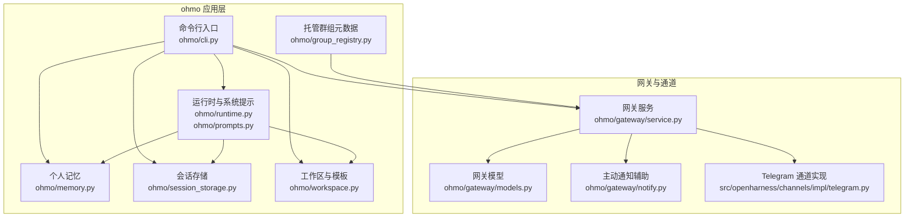
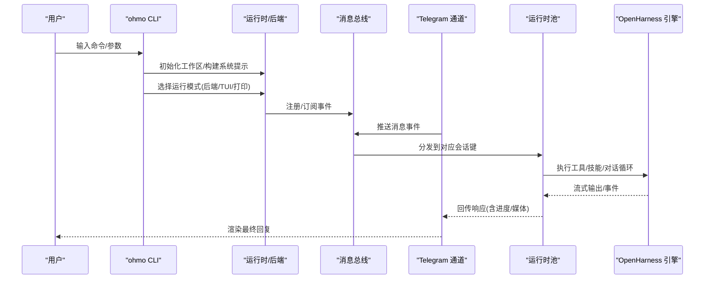
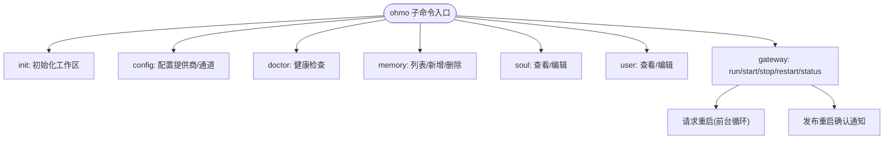
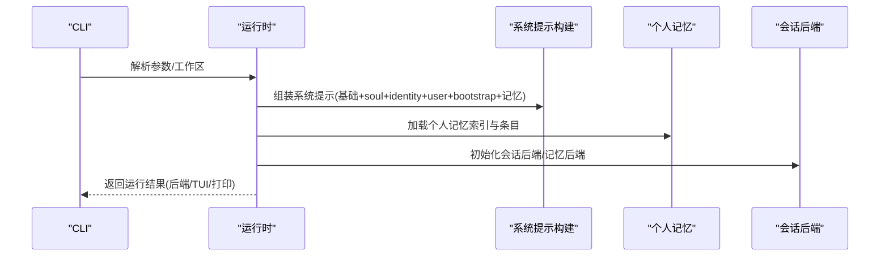
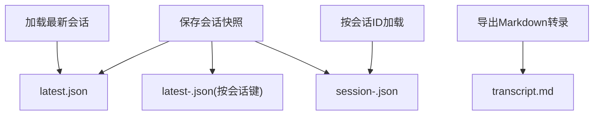
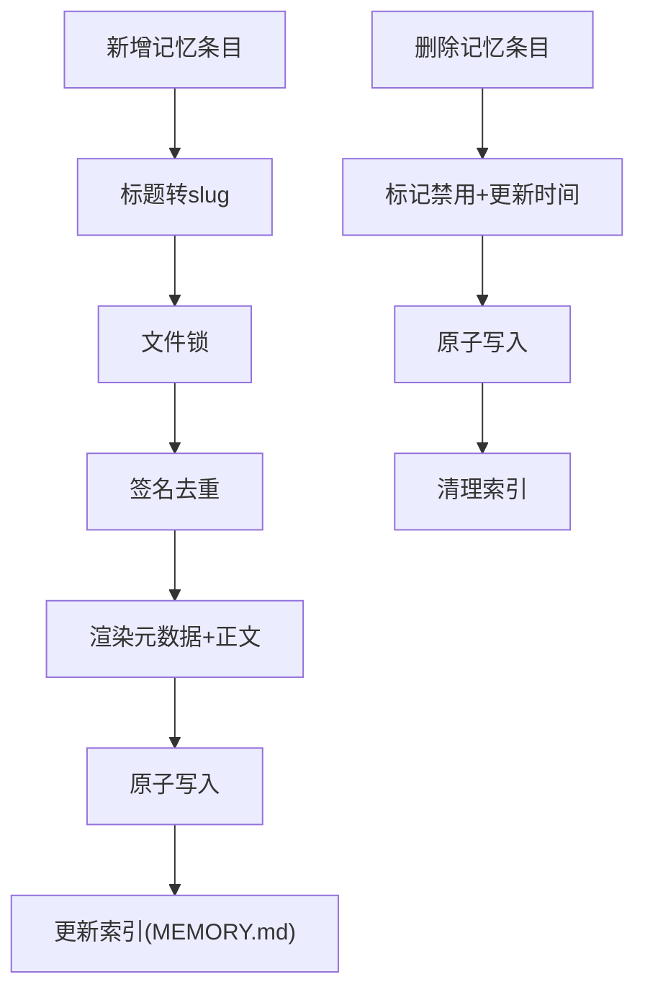
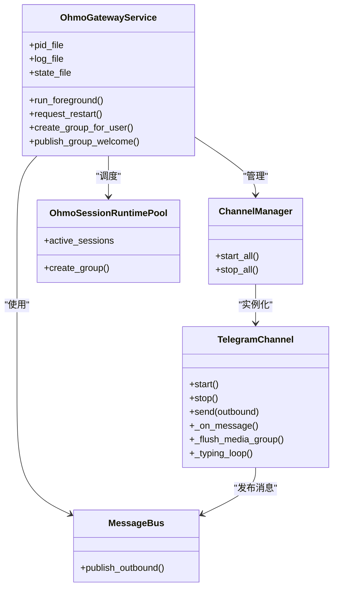
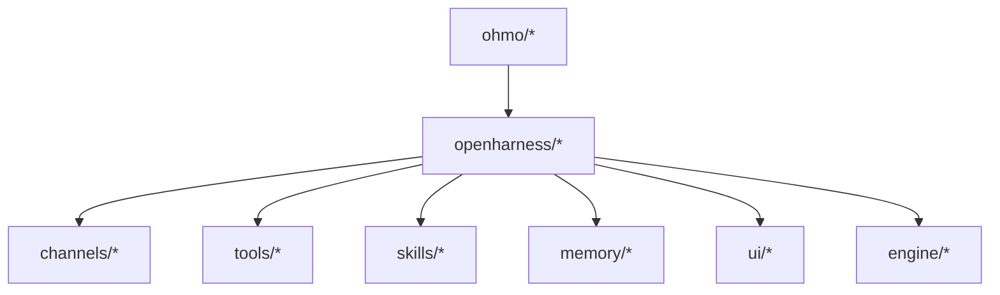

# 功能概述

<cite>
**本文引用的文件**
- [ohmo/__init__.py](file://ohmo/__init__.py)
- [ohmo/cli.py](file://ohmo/cli.py)
- [ohmo/runtime.py](file://ohmo/runtime.py)
- [ohmo/prompts.py](file://ohmo/prompts.py)
- [ohmo/memory.py](file://ohmo/memory.py)
- [ohmo/session_storage.py](file://ohmo/session_storage.py)
- [ohmo/workspace.py](file://ohmo/workspace.py)
- [ohmo/group_registry.py](file://ohmo/group_registry.py)
- [ohmo/gateway/service.py](file://ohmo/gateway/service.py)
- [ohmo/gateway/models.py](file://ohmo/gateway/models.py)
- [ohmo/gateway/notify.py](file://ohmo/gateway/notify.py)
- [src/openharness/channels/impl/telegram.py](file://src/openharness/channels/impl/telegram.py)
- [README.md](file://README.md)
</cite>

## 目录
1. [简介](#简介)
2. [项目结构](#项目结构)
3. [核心组件](#核心组件)
4. [架构总览](#架构总览)
5. [详细组件分析](#详细组件分析)
6. [依赖关系分析](#依赖关系分析)
7. [性能考量](#性能考量)
8. [故障排查指南](#故障排查指南)
9. [结论](#结论)
10. [附录](#附录)

## 简介
ohmo 是构建于 OpenHarness 之上的“个人代理”应用，目标是成为开发者在长对话与长期协作中真正可用、可靠且可信赖的智能助理。它不是泛用聊天机器人，而是能跨平台即时通讯、具备持久记忆、可执行工具与任务、并支持个人工作流的“私人助手”。ohmo 通过统一的系统提示注入个人身份、用户画像、持久记忆与工作区上下文，并以会话持久化与多通道网关实现“随地可续”的智能体验。

对比传统聊天机器人，ohmo 的核心差异在于：
- 长期性：通过个人记忆与会话历史实现连续性，而非一次性问答
- 可操作性：直接调用工具与技能，完成分支管理、代码编写、测试运行、PR 创建等实际任务
- 多通道接入：统一网关对接 Telegram、Slack、Discord、飞书等即时通讯平台
- 安全与边界：内置权限模式、路径规则与交互式审批，确保安全可控

## 项目结构
ohmo 的核心由以下模块组成：
- 命令行入口与子命令：初始化工作区、配置网关、内存管理、用户与灵魂文件编辑、网关生命周期控制
- 运行时与系统提示：构建 ohmo 专属系统提示，整合个人记忆与工作区上下文
- 会话存储：保存/加载会话快照、导出对话记录
- 个人记忆：个人知识条目管理、索引与检索
- 工作区：.ohmo 根目录、模板文件、状态与配置
- 网关服务：消息总线、通道管理器、运行时池、重启通知与托管群组
- 通道实现：以 Telegram 为例的长轮询接入与媒体处理

图表来源
- [ohmo/cli.py](file://ohmo/cli.py)
- [ohmo/runtime.py](file://ohmo/runtime.py)
- [ohmo/prompts.py](file://ohmo/prompts.py)
- [ohmo/memory.py](file://ohmo/memory.py)
- [ohmo/session_storage.py](file://ohmo/session_storage.py)
- [ohmo/workspace.py](file://ohmo/workspace.py)
- [ohmo/group_registry.py](file://ohmo/group_registry.py)
- [ohmo/gateway/service.py](file://ohmo/gateway/service.py)
- [ohmo/gateway/models.py](file://ohmo/gateway/models.py)
- [ohmo/gateway/notify.py](file://ohmo/gateway/notify.py)
- [src/openharness/channels/impl/telegram.py](file://src/openharness/channels/impl/telegram.py)

章节来源
- [ohmo/cli.py](file://ohmo/cli.py)
- [ohmo/runtime.py](file://ohmo/runtime.py)
- [ohmo/prompts.py](file://ohmo/prompts.py)
- [ohmo/memory.py](file://ohmo/memory.py)
- [ohmo/session_storage.py](file://ohmo/session_storage.py)
- [ohmo/workspace.py](file://ohmo/workspace.py)
- [ohmo/group_registry.py](file://ohmo/group_registry.py)
- [ohmo/gateway/service.py](file://ohmo/gateway/service.py)
- [ohmo/gateway/models.py](file://ohmo/gateway/models.py)
- [ohmo/gateway/notify.py](file://ohmo/gateway/notify.py)
- [src/openharness/channels/impl/telegram.py](file://src/openharness/channels/impl/telegram.py)

## 核心组件
- 命令行入口与子命令
  - 提供初始化、配置、医生检查、内存管理、用户与灵魂文件编辑、网关启停与状态查询等子命令
  - 支持交互式向导与非交互模式，自动检测终端能力并选择合适的输入方式
- 运行时与系统提示
  - 构建 ohmo 专属系统提示，融合 soul/identity/user/bootstrap、工作区路径与个人记忆
  - 支持打印模式与 React 终端 UI 启动两种运行形态
- 会话存储
  - 持久化最近一次与指定会话，支持摘要、消息计数、模型信息与用量统计
  - 导出 Markdown 转录，便于归档与复盘
- 个人记忆
  - 个人知识条目增删、索引维护、签名去重、与系统提示注入
  - 支持类型与类别的默认值，重要性与 TTL 等元数据
- 工作区
  - 自动创建 .ohmo 根目录与模板文件（soul/user/identity/MEMORY.md），初始化状态与网关配置
  - 提供健康检查与路径解析
- 网关服务
  - 基于消息总线与通道管理器，统一调度多通道消息
  - 运行时池按会话键管理并发会话，支持重启请求与状态写入
  - 主动通知与托管群组元数据持久化
- 通道实现
  - 以 Telegram 为例，提供长轮询、Markdown 到 HTML 转换、媒体下载与转录、分片发送、打字指示等能力

章节来源
- [ohmo/cli.py](file://ohmo/cli.py)
- [ohmo/runtime.py](file://ohmo/runtime.py)
- [ohmo/prompts.py](file://ohmo/prompts.py)
- [ohmo/session_storage.py](file://ohmo/session_storage.py)
- [ohmo/memory.py](file://ohmo/memory.py)
- [ohmo/workspace.py](file://ohmo/workspace.py)
- [ohmo/gateway/service.py](file://ohmo/gateway/service.py)
- [src/openharness/channels/impl/telegram.py](file://src/openharness/channels/impl/telegram.py)

## 架构总览
ohmo 将 OpenHarness 的引擎、工具、技能、权限与 UI 能力封装为“个人代理”，通过以下关键路径实现：
- CLI 启动：解析参数、初始化工作区、构建系统提示、选择运行模式
- 运行时：启动后端或 React TUI，注入系统提示与个人记忆，建立会话后端
- 网关：启动消息总线与通道管理器，桥接通道消息到运行时池
- 通道：将 IM 平台消息转换为统一事件，投递到消息总线
- 记忆与会话：从个人记忆与会话存储中提取上下文，驱动模型决策

图表来源
- [ohmo/cli.py](file://ohmo/cli.py)
- [ohmo/runtime.py](file://ohmo/runtime.py)
- [ohmo/gateway/service.py](file://ohmo/gateway/service.py)
- [src/openharness/channels/impl/telegram.py](file://src/openharness/channels/impl/telegram.py)

章节来源
- [ohmo/cli.py](file://ohmo/cli.py)
- [ohmo/runtime.py](file://ohmo/runtime.py)
- [ohmo/gateway/service.py](file://ohmo/gateway/service.py)
- [src/openharness/channels/impl/telegram.py](file://src/openharness/channels/impl/telegram.py)

## 详细组件分析

### ohmo CLI 与子命令
- 初始化与配置
  - 初始化 .ohmo 工作区，生成模板文件；可交互式引导选择提供商与通道
  - 医生检查：输出工作区、网关配置、可用提供商状态与项目路径
- 内存管理
  - 列表、新增、删除个人记忆条目；自动维护 MEMORY.md 索引
- 用户与灵魂
  - 查看/编辑 soul.md 与 user.md，用于塑造代理身份与用户画像
- 网关生命周期
  - 前台运行、后台启动/停止/重启、状态查询；支持远程管理员命令白名单

图表来源
- [ohmo/cli.py](file://ohmo/cli.py)

章节来源
- [ohmo/cli.py](file://ohmo/cli.py)

### 运行时与系统提示
- 系统提示组装
  - 合并基础提示、附加指令、soul/identity/user/bootstrap、工作区路径与个人记忆
  - 可选包含项目记忆，形成“个人+项目”双层上下文
- 运行模式
  - 后端模式：仅运行后端，供前端或外部进程调用
  - React 终端 UI：启动前端与后端，提供交互式对话界面
  - 打印模式：单次提示执行并输出结果，适合脚本与管道

图表来源
- [ohmo/runtime.py](file://ohmo/runtime.py)
- [ohmo/prompts.py](file://ohmo/prompts.py)
- [ohmo/memory.py](file://ohmo/memory.py)

章节来源
- [ohmo/runtime.py](file://ohmo/runtime.py)
- [ohmo/prompts.py](file://ohmo/prompts.py)
- [ohmo/memory.py](file://ohmo/memory.py)

### 会话存储
- 快照保存
  - 自动生成会话 ID，记录模型、系统提示、消息、用量与工具元数据
  - 维护最新快照与按会话键的“最新”快照，便于恢复与续会
- 列表与加载
  - 支持列出最近会话、按 ID 加载、导出 Markdown 转录
- 会话后端
  - 封装在 OhmoSessionBackend 中，统一接口给运行时使用

图表来源
- [ohmo/session_storage.py](file://ohmo/session_storage.py)

章节来源
- [ohmo/session_storage.py](file://ohmo/session_storage.py)

### 个人记忆
- 条目管理
  - 新增/删除：自动去重、签名计算、原子写入、索引同步
  - 支持类型/类别默认值、重要性、来源、TTL、禁用标记等元数据
- 索引与注入
  - 自动生成 MEMORY.md 索引，按需注入到系统提示，提升模型对个人知识的利用效率

图表来源
- [ohmo/memory.py](file://ohmo/memory.py)

章节来源
- [ohmo/memory.py](file://ohmo/memory.py)

### 工作区与模板
- 根目录与模板
  - 自动创建 .ohmo 根目录与 soul/user/identity/MEMORY.md 等模板
  - 初始化状态文件与网关配置，首次运行写入引导文件
- 路径解析
  - 提供 soul/user/identity/memory/skills/plugins/groups/sessions/logs/attachments 等路径访问
- 健康检查
  - 检查关键资产是否存在，辅助诊断问题

章节来源
- [ohmo/workspace.py](file://ohmo/workspace.py)

### 网关服务与通道
- 网关服务
  - 生命周期：前台运行、后台启动/停止/重启；写入状态文件，记录 PID、活跃会话与错误
  - 重启机制：请求重启后发布“已恢复”通知，再优雅关闭并执行就地重启
  - 运行时池：按会话键管理并发，支持托管群组创建与欢迎消息发布
- 通道实现（以 Telegram 为例）
  - 长轮询接入、Markdown 到 HTML 转换、媒体下载与转录、分片发送、打字指示
  - 媒体组聚合：短时间内的媒体消息合并为一次对话回合
  - 错误处理：捕获并记录通道错误，避免静默失败

图表来源
- [ohmo/gateway/service.py](file://ohmo/gateway/service.py)
- [src/openharness/channels/impl/telegram.py](file://src/openharness/channels/impl/telegram.py)

章节来源
- [ohmo/gateway/service.py](file://ohmo/gateway/service.py)
- [src/openharness/channels/impl/telegram.py](file://src/openharness/channels/impl/telegram.py)

### 托管群组与通知
- 托管群组
  - 记录渠道、聊天 ID、所有者、名称、创建时间、绑定状态与元数据
  - 规范化群名长度与安全命名，支持按渠道与聊天 ID 定位
- 主动通知
  - 文本分块策略，避免超长消息被平台拒绝
  - 提供同步发送方法，用于紧急通知或诊断

章节来源
- [ohmo/group_registry.py](file://ohmo/group_registry.py)
- [ohmo/gateway/notify.py](file://ohmo/gateway/notify.py)

## 依赖关系分析
- ohmo 与 OpenHarness 的耦合点
  - 运行时依赖 OpenHarness 的后端主机、运行时构建、事件流与 UI 协议
  - 系统提示与记忆注入依赖 OpenHarness 的系统提示与内存扫描/渲染能力
  - 会话后端与工具/技能生态复用 OpenHarness 的插件与命令体系
- 网关与通道
  - 网关服务依赖消息总线与通道管理器，通道实现依赖具体平台 SDK
  - 通道与运行时通过消息总线解耦，便于扩展新平台

图表来源
- [ohmo/runtime.py](file://ohmo/runtime.py)
- [README.md](file://README.md)

章节来源
- [ohmo/runtime.py](file://ohmo/runtime.py)
- [README.md](file://README.md)

## 性能考量
- 上下文压缩与自动紧凑
  - 在长时间会话中保持任务状态与通道日志，减少频繁清理带来的上下文丢失
- 并行工具执行与重试退避
  - 工具调用支持并行与指数回退，提升整体吞吐与稳定性
- 前端渲染优化
  - React TUI 全量渲染 Markdown，减少中间态闪烁与错误提示
- 通道侧优化
  - Telegram 长轮询连接池扩容、媒体组聚合、分片发送与打字指示，改善用户体验

## 故障排查指南
- 医生检查
  - 使用 doctor 子命令查看工作区、网关配置、提供商状态与项目路径
- 网关状态
  - 查询运行状态、PID、活跃会话与最后错误；必要时重启网关
- 通道错误
  - 检查通道 last_error 字段，关注令牌、网络代理与平台限制
- 重启流程
  - 请求重启后，网关会发布“已恢复”通知，随后执行就地重启
- 会话恢复
  - 使用 --continue 或 --resume 恢复最近或指定会话，确保会话键一致

章节来源
- [ohmo/cli.py](file://ohmo/cli.py)
- [ohmo/gateway/service.py](file://ohmo/gateway/service.py)

## 结论
ohmo 以“个人代理”的定位，将 OpenHarness 的工具、技能、记忆与多通道接入能力整合为一个可长期使用的智能助理。其核心价值在于：
- 长期连续性：通过个人记忆与会话历史，实现跨对话的上下文延续
- 实战能力：直接执行工具与技能，完成分支、编码、测试与 PR 等实际任务
- 多通道接入：统一网关对接主流即时通讯平台，随时随地续会
- 安全可控：内置权限与交互式审批，保障操作安全与边界

对于开发者工作流，ohmo 可作为：
- 日常问答与知识检索的“个人知识库”
- 代码审查、计划制定、调试与测试的“智能搭档”
- 多平台沟通中的“智能转发与摘要”

## 附录
- 快速开始
  - 初始化工作区、配置提供商与通道、启动网关，即可在各即时通讯平台与 ohmo 对话
- 版本与兼容
  - 支持多种提供商与兼容 API，适配本地与云端模型
- 生态与扩展
  - 可加载用户/项目/插件/技能，按需扩展能力边界

章节来源
- [README.md](file://README.md)
- [ohmo/cli.py](file://ohmo/cli.py)