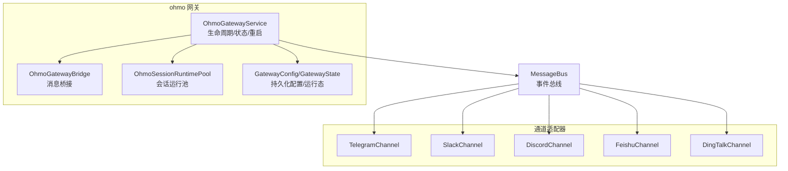
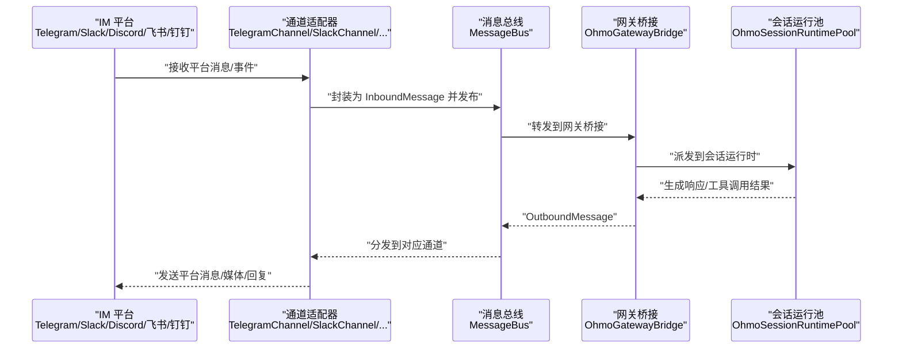
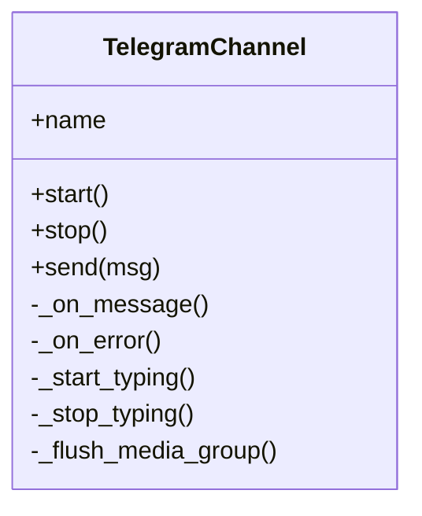
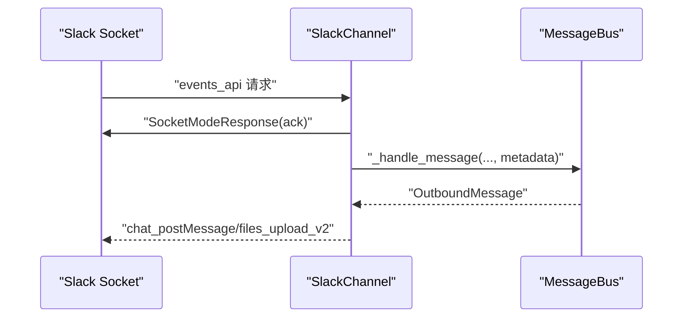
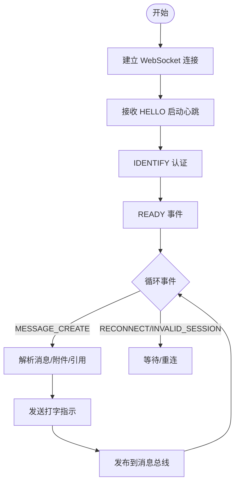
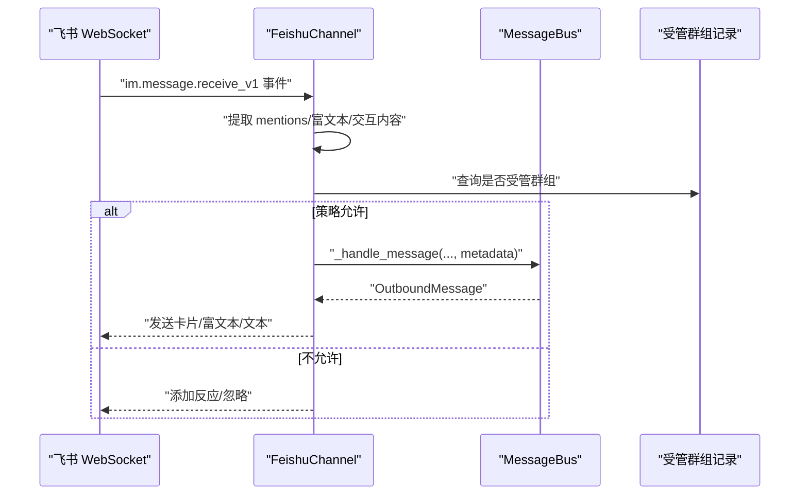
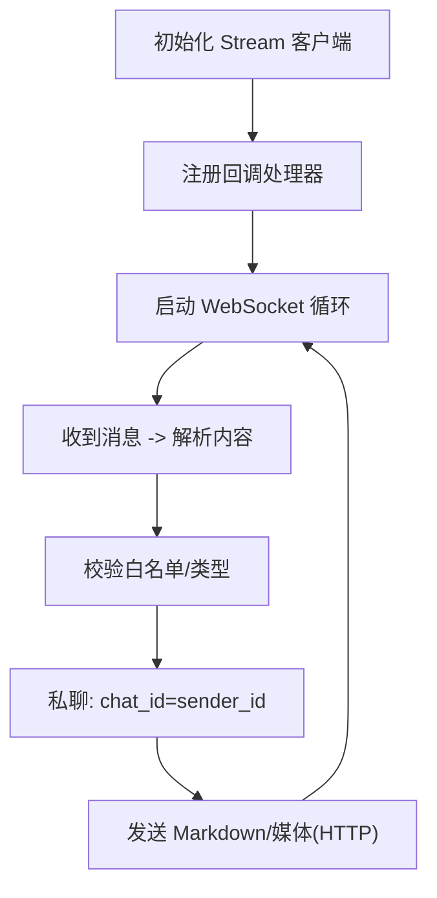
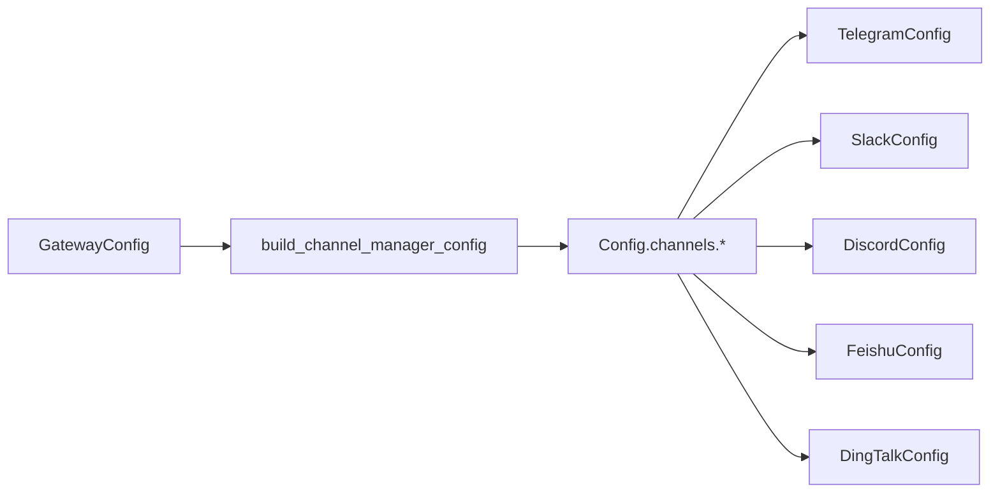

# 多平台集成

<cite>
**本文引用的文件**
- [ohmo/__init__.py](file://ohmo/__init__.py)
- [ohmo/workspace.py](file://ohmo/workspace.py)
- [ohmo/gateway/models.py](file://ohmo/gateway/models.py)
- [ohmo/gateway/config.py](file://ohmo/gateway/config.py)
- [ohmo/gateway/router.py](file://ohmo/gateway/router.py)
- [ohmo/gateway/service.py](file://ohmo/gateway/service.py)
- [src/openharness/channels/impl/telegram.py](file://src/openharness/channels/impl/telegram.py)
- [src/openharness/channels/impl/discord.py](file://src/openharness/channels/impl/discord.py)
- [src/openharness/channels/impl/feishu.py](file://src/openharness/channels/impl/feishu.py)
- [src/openharness/channels/impl/slack.py](file://src/openharness/channels/impl/slack.py)
- [src/openharness/channels/impl/dingtalk.py](file://src/openharness/channels/impl/dingtalk.py)
- [src/openharness/config/schema.py](file://src/openharness/config/schema.py)
- [tests/test_channels/test_feishu_security.py](file://tests/test_channels/test_feishu_security.py)
- [tests/test_channels/test_telegram_security.py](file://tests/test_channels/test_telegram_security.py)
</cite>

## 目录
1. [简介](#简介)
2. [项目结构](#项目结构)
3. [核心组件](#核心组件)
4. [架构总览](#架构总览)
5. [详细组件分析](#详细组件分析)
6. [依赖关系分析](#依赖关系分析)
7. [性能考量](#性能考量)
8. [故障排查指南](#故障排查指南)
9. [结论](#结论)
10. [附录](#附录)

## 简介
本指南面向需要在 ohmo 中集成多即时通讯平台（Telegram、Slack、Discord、飞书、钉钉等）的用户与开发者，系统讲解各平台的接入方式、配置要点、认证流程与机器人创建步骤，以及平台间功能差异与使用场景。文档同时覆盖会话路由、多账号管理、群组协作、欢迎消息发布、重启通知等高级能力，并提供可复用的配置模板与最佳实践。

## 项目结构
ohmo 的多平台集成由“网关服务 + 通道适配器 + 配置模型 + 工作区管理”四部分组成：
- 网关服务负责生命周期管理、消息总线、运行态状态持久化与重启通知
- 通道适配器封装各平台的连接、鉴权、消息收发与格式转换
- 配置模型定义各平台参数与兼容层
- 工作区管理负责工作目录、模板文件与网关配置文件的初始化与读写

图示来源
- [ohmo/gateway/service.py:39-104](file://ohmo/gateway/service.py#L39-L104)
- [ohmo/gateway/models.py:8-34](file://ohmo/gateway/models.py#L8-L34)
- [src/openharness/channels/impl/telegram.py:95-128](file://src/openharness/channels/impl/telegram.py#L95-L128)
- [src/openharness/channels/impl/slack.py:21-32](file://src/openharness/channels/impl/slack.py#L21-L32)
- [src/openharness/channels/impl/discord.py:24-38](file://src/openharness/channels/impl/discord.py#L24-L38)
- [src/openharness/channels/impl/feishu.py:411-434](file://src/openharness/channels/impl/feishu.py#L411-L434)
- [src/openharness/channels/impl/dingtalk.py:93-121](file://src/openharness/channels/impl/dingtalk.py#L93-L121)

章节来源
- [ohmo/gateway/service.py:39-104](file://ohmo/gateway/service.py#L39-L104)
- [ohmo/gateway/models.py:8-34](file://ohmo/gateway/models.py#L8-L34)
- [src/openharness/config/schema.py:101-119](file://src/openharness/config/schema.py#L101-L119)

## 核心组件
- 网关配置与状态
  - GatewayConfig：持久化网关配置（启用通道、会话路由策略、日志级别、权限模式、沙箱开关、远程命令等）
  - GatewayState：运行时状态快照（运行中/进程ID/活动会话数/最后错误）
- 工作区与模板
  - 初始化工作区、生成 soul/user/identity/memory 等模板文件，确保首次启动有可用上下文
- 通道配置模型
  - 统一的 ChannelConfigs 与各平台 Config 模型，支持 allow_from 白名单、代理、回复策略等
- 会话路由
  - 基于聊天类型、线程/消息 ID、发送者身份构建会话键，保障共享聊天的内存隔离

章节来源
- [ohmo/gateway/models.py:8-34](file://ohmo/gateway/models.py#L8-L34)
- [ohmo/workspace.py:252-301](file://ohmo/workspace.py#L252-L301)
- [src/openharness/config/schema.py:101-119](file://src/openharness/config/schema.py#L101-L119)
- [ohmo/gateway/router.py:8-32](file://ohmo/gateway/router.py#L8-L32)

## 架构总览
下图展示从平台到网关的消息流：平台通道将消息转为统一事件，经消息总线进入网关桥接，再交由运行时处理；输出消息通过通道适配器回送到对应平台。

图示来源
- [src/openharness/channels/impl/telegram.py:352-470](file://src/openharness/channels/impl/telegram.py#L352-L470)
- [src/openharness/channels/impl/slack.py:108-205](file://src/openharness/channels/impl/slack.py#L108-L205)
- [src/openharness/channels/impl/discord.py:205-266](file://src/openharness/channels/impl/discord.py#L205-L266)
- [src/openharness/channels/impl/feishu.py:487-520](file://src/openharness/channels/impl/feishu.py#L487-L520)
- [src/openharness/channels/impl/dingtalk.py:152-160](file://src/openharness/channels/impl/dingtalk.py#L152-L160)

## 详细组件分析

### Telegram 集成
- 连接方式：长轮询（无需公网 IP），支持代理
- 关键特性
  - 命令菜单注册（/start /new /help /stop）
  - 文本、图片、语音、音频、文档等多类型消息处理
  - 媒体组聚合（短时间内的多媒体合并为一次对话回合）
  - 语音转文字（可选 Groq 提供商）
  - 回复引用、打字指示、进度草稿
- 安全与稳定性
  - 降噪日志（屏蔽 token 明文）
  - 错误处理器记录 last_error
- 配置要点
  - token、proxy（可选）、reply_to_message、bot_name
  - allow_from 白名单控制来源

图示来源
- [src/openharness/channels/impl/telegram.py:95-128](file://src/openharness/channels/impl/telegram.py#L95-L128)

章节来源
- [src/openharness/channels/impl/telegram.py:129-190](file://src/openharness/channels/impl/telegram.py#L129-L190)
- [src/openharness/channels/impl/telegram.py:223-312](file://src/openharness/channels/impl/telegram.py#L223-L312)
- [src/openharness/channels/impl/telegram.py:352-470](file://src/openharness/channels/impl/telegram.py#L352-L470)
- [src/openharness/channels/impl/telegram.py:486-526](file://src/openharness/channels/impl/telegram.py#L486-L526)
- [tests/test_channels/test_telegram_security.py:44-65](file://tests/test_channels/test_telegram_security.py#L44-L65)

### Slack 集成
- 连接方式：Socket Mode（无需公网 IP）
- 关键特性
  - 应用提及或普通消息两种入口
  - 群组/频道消息支持 open/mention/allowlist 策略
  - DM 默认允许，可配置 allowlist
  - 可选在频道内按线程回复
  - 打点表情反馈（eyes/自定义）
- 安全与稳定性
  - 先 ack 再处理，避免重复消费
  - 跳过 bot 自身消息与子类型消息
- 配置要点
  - bot_token、app_token、signing_secret
  - dm 策略与 allowlist
  - group_policy 与 reply_in_thread/react_emoji

图示来源
- [src/openharness/channels/impl/slack.py:108-205](file://src/openharness/channels/impl/slack.py#L108-L205)

章节来源
- [src/openharness/channels/impl/slack.py:33-65](file://src/openharness/channels/impl/slack.py#L33-L65)
- [src/openharness/channels/impl/slack.py:76-107](file://src/openharness/channels/impl/slack.py#L76-L107)
- [src/openharness/channels/impl/slack.py:206-229](file://src/openharness/channels/impl/slack.py#L206-L229)

### Discord 集成
- 连接方式：WebSocket 网关（Gateway），REST 发送
- 关键特性
  - 心跳保活、重连机制
  - 速率限制自动退避重试
  - 媒体附件大小限制与下载
  - 群组消息策略（open/mention）
- 配置要点
  - token、gateway_url、intents
  - allow_from 白名单
  - group_policy（open/mention）

图示来源
- [src/openharness/channels/impl/discord.py:127-168](file://src/openharness/channels/impl/discord.py#L127-L168)
- [src/openharness/channels/impl/discord.py:205-266](file://src/openharness/channels/impl/discord.py#L205-L266)

章节来源
- [src/openharness/channels/impl/discord.py:39-62](file://src/openharness/channels/impl/discord.py#L39-L62)
- [src/openharness/channels/impl/discord.py:78-126](file://src/openharness/channels/impl/discord.py#L78-L126)
- [src/openharness/channels/impl/discord.py:169-204](file://src/openharness/channels/impl/discord.py#L169-L204)

### 飞书（Lark）集成
- 连接方式：WebSocket 长连接（无需公网 IP）
- 关键特性
  - 丰富的富文本/卡片渲染策略（text/post/interactive）
  - 多表拆分（API 限制每卡仅一张表格）
  - 群组策略：open/mention/managed/managed_or_mention
  - 受管群组创建与欢迎消息发布
  - 媒体下载与安全路径落盘
- 安全要点
  - 严格限制附件保存路径在工作区附件目录
  - 机器人名称/open_id 多维度识别
- 配置要点
  - app_id、app_secret、encrypt_key、verification_token
  - group_policy、bot_open_id、bot_names
  - allow_from 白名单

图示来源
- [src/openharness/channels/impl/feishu.py:487-520](file://src/openharness/channels/impl/feishu.py#L487-L520)
- [src/openharness/channels/impl/feishu.py:185-204](file://src/openharness/channels/impl/feishu.py#L185-L204)

章节来源
- [src/openharness/channels/impl/feishu.py:454-520](file://src/openharness/channels/impl/feishu.py#L454-L520)
- [src/openharness/channels/impl/feishu.py:564-740](file://src/openharness/channels/impl/feishu.py#L564-L740)
- [src/openharness/channels/impl/feishu.py:740-800](file://src/openharness/channels/impl/feishu.py#L740-L800)
- [tests/test_channels/test_feishu_security.py:19-75](file://tests/test_channels/test_feishu_security.py#L19-L75)

### 钉钉（DingTalk）集成
- 连接方式：Stream Mode（WebSocket 接收），HTTP API 发送
- 关键特性
  - 私聊支持，群聊当前以私信回复
  - 自动获取/刷新 access_token
  - 多媒体上传与引用发送
- 配置要点
  - client_id、client_secret、robot_code
  - allow_from 白名单

图示来源
- [src/openharness/channels/impl/dingtalk.py:122-160](file://src/openharness/channels/impl/dingtalk.py#L122-L160)
- [src/openharness/channels/impl/dingtalk.py:405-426](file://src/openharness/channels/impl/dingtalk.py#L405-L426)

章节来源
- [src/openharness/channels/impl/dingtalk.py:93-121](file://src/openharness/channels/impl/dingtalk.py#L93-L121)
- [src/openharness/channels/impl/dingtalk.py:176-202](file://src/openharness/channels/impl/dingtalk.py#L176-L202)
- [src/openharness/channels/impl/dingtalk.py:263-337](file://src/openharness/channels/impl/dingtalk.py#L263-L337)

## 依赖关系分析
- 配置映射
  - 网关配置 GatewayConfig 通过 build_channel_manager_config 投射到通用 Config 的 channels 字段，驱动各通道启用与参数注入
- 通道适配器
  - 统一继承 BaseChannel，实现 start/stop/send/_handle_message 等接口
  - 通过 MessageBus 发布/订阅事件，解耦平台差异
- 工作区与网关
  - 工作区初始化时生成 gateway.json，默认关闭远程管理命令，建议生产环境保持默认
  - 网关服务持久化 state.json 与 pid 文件，支持前台/后台运行、优雅停止与原地重启

图示来源
- [ohmo/gateway/config.py:29-42](file://ohmo/gateway/config.py#L29-L42)
- [src/openharness/config/schema.py:101-119](file://src/openharness/config/schema.py#L101-L119)

章节来源
- [ohmo/gateway/config.py:13-26](file://ohmo/gateway/config.py#L13-L26)
- [ohmo/gateway/service.py:42-74](file://ohmo/gateway/service.py#L42-L74)
- [ohmo/workspace.py:279-301](file://ohmo/workspace.py#L279-L301)

## 性能考量
- 连接与并发
  - Telegram 使用较大的连接池参数降低长时间运行的超时风险
  - Discord/飞书/钉钉均采用异步客户端与心跳/重连策略，减少断连影响
- 消息体积与格式
  - 各通道对长文本进行切片发送，避免平台限制
  - 飞书根据内容复杂度选择 text/post/interactive 三种格式，兼顾可读性与渲染能力
- I/O 与磁盘
  - 附件下载统一落至工作区 attachments 子目录，避免路径穿越
  - 媒体组在短时间内聚合，减少会话碎片

章节来源
- [src/openharness/channels/impl/telegram.py:140-145](file://src/openharness/channels/impl/telegram.py#L140-L145)
- [src/openharness/channels/impl/discord.py:87-104](file://src/openharness/channels/impl/discord.py#L87-L104)
- [src/openharness/channels/impl/feishu.py:564-740](file://src/openharness/channels/impl/feishu.py#L564-L740)
- [tests/test_channels/test_feishu_security.py:19-75](file://tests/test_channels/test_feishu_security.py#L19-L75)

## 故障排查指南
- 常见问题定位
  - 通道错误：各通道维护 last_error，可在网关状态中查看
  - 权限未生效：确认 allow_from 是否正确配置，白名单策略（open/allowlist）
  - 群组策略：飞书 group_policy 未触发时检查 mentions_bot、受管群组记录
- 诊断步骤
  - 查看网关状态文件与日志目录
  - 检查工作区 gateway.json 的 enabled_channels 与 channel_configs
  - 在测试用例中参考安全与行为验证逻辑，快速复现问题
- 重启与恢复
  - 网关支持前台运行与原地重启，重启后自动发布“已恢复”提示

章节来源
- [ohmo/gateway/service.py:87-104](file://ohmo/gateway/service.py#L87-L104)
- [ohmo/gateway/service.py:105-123](file://ohmo/gateway/service.py#L105-L123)
- [tests/test_channels/test_feishu_security.py:195-243](file://tests/test_channels/test_feishu_security.py#L195-L243)
- [tests/test_channels/test_telegram_security.py:44-65](file://tests/test_channels/test_telegram_security.py#L44-L65)

## 结论
ohmo 通过统一的网关与通道适配器，实现了多平台即时通讯的一致接入体验。平台间差异被抽象为可配置的通道模型与路由策略，既保证易用性，又保留扩展空间。建议在生产环境中：
- 严格设置 allow_from 白名单
- 合理选择群组策略（飞书）
- 开启沙箱与最小权限原则
- 使用工作区模板与网关配置文件固化部署

## 附录

### 平台对比与使用场景
- Telegram：适合个人/小团队日常沟通，支持多媒体与语音转写
- Slack：企业常用，支持 Socket Mode、线程回复与应用提及
- Discord：社区/游戏类群组活跃，支持高并发与速率限制退避
- 飞书：国内企业首选，富文本/卡片渲染能力强，支持受管群组
- 钉钉：阿里生态内私聊/内部协作，媒体上传与私聊回复完善

章节来源
- [src/openharness/channels/impl/telegram.py:95-128](file://src/openharness/channels/impl/telegram.py#L95-L128)
- [src/openharness/channels/impl/slack.py:21-32](file://src/openharness/channels/impl/slack.py#L21-L32)
- [src/openharness/channels/impl/discord.py:24-38](file://src/openharness/channels/impl/discord.py#L24-L38)
- [src/openharness/channels/impl/feishu.py:411-434](file://src/openharness/channels/impl/feishu.py#L411-L434)
- [src/openharness/channels/impl/dingtalk.py:93-121](file://src/openharness/channels/impl/dingtalk.py#L93-L121)

### 配置示例与最佳实践
- 工作区初始化
  - 首次运行会生成 soul/user/identity/memory 等模板文件，便于定制个人代理
- 网关配置
  - gateway.json 默认关闭远程管理命令，建议生产保持默认
  - enabled_channels 列表声明启用的平台
  - channel_configs 注入各平台专属参数
- 最佳实践
  - 将敏感密钥放入环境变量或安全存储，不直接写入配置文件
  - 为每个平台单独设置 allow_from 白名单
  - 飞书群组策略优先使用 managed_or_mention，避免无关打扰
  - 启用沙箱与最小权限，谨慎授予远程命令

章节来源
- [ohmo/workspace.py:252-301](file://ohmo/workspace.py#L252-L301)
- [ohmo/gateway/config.py:29-42](file://ohmo/gateway/config.py#L29-L42)
- [ohmo/gateway/models.py:8-22](file://ohmo/gateway/models.py#L8-L22)