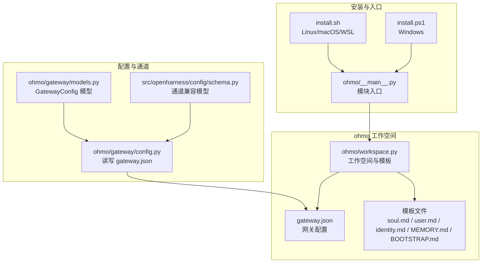
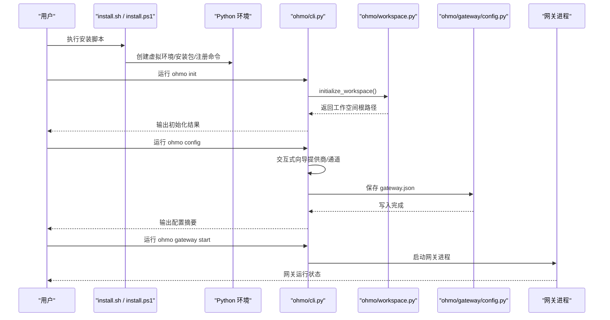
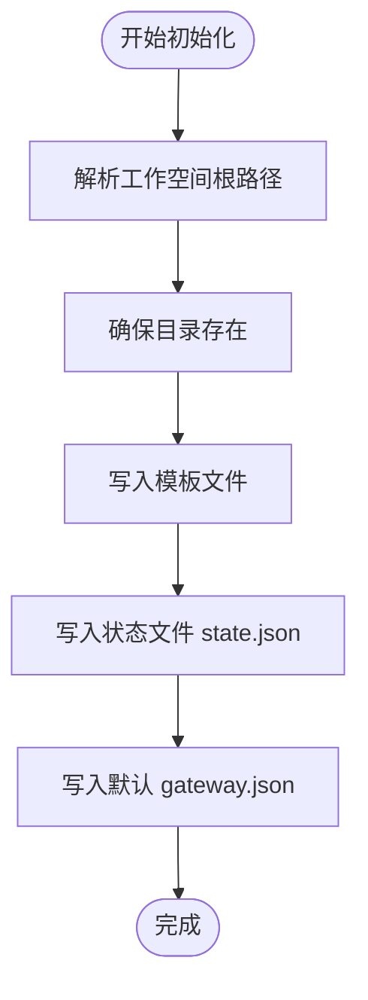
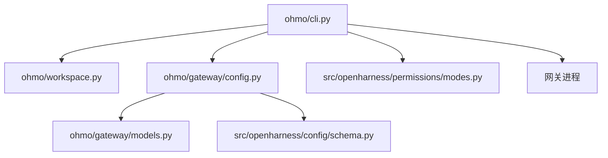

# 安装和配置

<cite>
**本文引用的文件**
- [ohmo/__main__.py](file://ohmo/__main__.py)
- [ohmo/cli.py](file://ohmo/cli.py)
- [ohmo/workspace.py](file://ohmo/workspace.py)
- [ohmo/gateway/config.py](file://ohmo/gateway/config.py)
- [ohmo/gateway/models.py](file://ohmo/gateway/models.py)
- [ohmo/gateway/notify.py](file://ohmo/gateway/notify.py)
- [scripts/install.sh](file://scripts/install.sh)
- [scripts/install.ps1](file://scripts/install.ps1)
- [README.md](file://README.md)
- [src/openharness/config/schema.py](file://src/openharness/config/schema.py)
- [src/openharness/permissions/modes.py](file://src/openharness/permissions/modes.py)
- [tests/test_ohmo/test_cli.py](file://tests/test_ohmo/test_cli.py)
- [tests/test_ohmo/test_workspace.py](file://tests/test_ohmo/test_workspace.py)
</cite>

## 目录
1. [简介](#简介)
2. [项目结构](#项目结构)
3. [核心组件](#核心组件)
4. [架构总览](#架构总览)
5. [详细组件分析](#详细组件分析)
6. [依赖关系分析](#依赖关系分析)
7. [性能考虑](#性能考虑)
8. [故障排除指南](#故障排除指南)
9. [结论](#结论)
10. [附录](#附录)

## 简介
本指南面向首次部署与配置 ohmo 个人代理的用户，覆盖系统要求、前置条件、多平台安装步骤、工作空间初始化流程、配置项详解（提供商、通道、权限）、常见配置场景、安装验证与故障排除。ohmo 基于 OpenHarness 构建，提供可交互的终端界面与网关服务，支持在多个即时通讯渠道中运行。

## 项目结构
ohmo 作为 OpenHarness 的个人代理应用，其安装与配置涉及以下关键位置与文件：
- 安装脚本：Linux/macOS/WSL 使用 install.sh；Windows 使用 install.ps1
- ohmo 命令入口：通过 Python 模块入口启动
- 工作空间：默认位于用户主目录下的 .ohmo，包含 soul/user/identity/memory 等模板文件与 gateway.json 配置
- 网关配置：gateway.json 中定义提供商配置、启用的通道、日志级别、远程管理策略等
- 渠道适配：兼容多种 IM 渠道（Telegram、Slack、Discord、Feishu），并通过兼容模型映射到统一配置

图表来源
- [scripts/install.sh:1-388](file://scripts/install.sh#L1-L388)
- [scripts/install.ps1:1-330](file://scripts/install.ps1#L1-L330)
- [ohmo/__main__.py:1-9](file://ohmo/__main__.py#L1-L9)
- [ohmo/workspace.py:163-320](file://ohmo/workspace.py#L163-L320)
- [ohmo/gateway/config.py:13-26](file://ohmo/gateway/config.py#L13-L26)
- [ohmo/gateway/models.py:8-22](file://ohmo/gateway/models.py#L8-L22)
- [src/openharness/config/schema.py:116-119](file://src/openharness/config/schema.py#L116-L119)

章节来源
- [scripts/install.sh:1-388](file://scripts/install.sh#L1-L388)
- [scripts/install.ps1:1-330](file://scripts/install.ps1#L1-L330)
- [ohmo/__main__.py:1-9](file://ohmo/__main__.py#L1-L9)
- [ohmo/workspace.py:163-320](file://ohmo/workspace.py#L163-L320)
- [ohmo/gateway/config.py:13-26](file://ohmo/gateway/config.py#L13-L26)
- [ohmo/gateway/models.py:8-22](file://ohmo/gateway/models.py#L8-L22)
- [src/openharness/config/schema.py:116-119](file://src/openharness/config/schema.py#L116-L119)

## 核心组件
- ohmo CLI 与命令子系统：提供 init/config/doctor/gateway 等子命令，支持交互式向导与非交互模式
- 工作空间与模板：自动创建 .ohmo 目录、种子模板文件与状态文件
- 网关配置：持久化 gateway.json，包含提供商、通道、日志级别、远程管理策略等
- 渠道适配：将 ohmo 的通道配置映射到 OpenHarness 兼容模型，实现跨渠道一致性
- 权限模式：支持 default/plan/full_auto 三种模式，用于控制工具执行的安全策略

章节来源
- [ohmo/cli.py:414-534](file://ohmo/cli.py#L414-L534)
- [ohmo/workspace.py:252-301](file://ohmo/workspace.py#L252-L301)
- [ohmo/gateway/config.py:13-26](file://ohmo/gateway/config.py#L13-L26)
- [ohmo/gateway/models.py:8-22](file://ohmo/gateway/models.py#L8-L22)
- [src/openharness/config/schema.py:116-119](file://src/openharness/config/schema.py#L116-L119)
- [src/openharness/permissions/modes.py:8-13](file://src/openharness/permissions/modes.py#L8-L13)

## 架构总览
下图展示 ohmo 安装、初始化与配置的关键流程：安装脚本负责环境准备与命令链接；ohmo init 初始化工作空间并生成模板；ohmo config 启动交互式向导写入 gateway.json；gateway 进程根据配置连接各 IM 渠道。

图表来源
- [scripts/install.sh:184-238](file://scripts/install.sh#L184-L238)
- [scripts/install.ps1:127-191](file://scripts/install.ps1#L127-L191)
- [ohmo/cli.py:493-534](file://ohmo/cli.py#L493-L534)
- [ohmo/workspace.py:252-301](file://ohmo/workspace.py#L252-L301)
- [ohmo/gateway/config.py:21-26](file://ohmo/gateway/config.py#L21-L26)

## 详细组件分析

### 安装与系统要求
- 系统要求
  - Python 版本：3.10 或更高
  - 可选：Node.js 18+（用于 React 终端 UI）
- 支持平台
  - Linux/macOS/WSL：使用 install.sh
  - Windows：使用 install.ps1
- 安装方式
  - 在线一键安装（推荐）
  - 从源码安装（editable 模式）
  - 通过 pip 安装发布包

章节来源
- [scripts/install.sh:88-128](file://scripts/install.sh#L88-L128)
- [scripts/install.sh:151-179](file://scripts/install.sh#L151-L179)
- [scripts/install.ps1:62-96](file://scripts/install.ps1#L62-L96)
- [scripts/install.ps1:99-122](file://scripts/install.ps1#L99-L122)
- [README.md:201-222](file://README.md#L201-L222)

### 工作空间初始化
- 默认工作空间路径
  - 用户主目录下的 .ohmo（可通过环境变量或参数覆盖）
- 初始化内容
  - 创建必要目录：memory/skills/plugins/groups/sessions/logs/attachments
  - 写入种子模板：soul.md、user.md、identity.md、MEMORY.md、BOOTSTRAP.md
  - 写入状态文件 state.json
  - 写入默认网关配置 gateway.json（包含提供商、通道、日志级别等）
- 健康检查
  - 检查工作空间与关键文件是否存在

图表来源
- [ohmo/workspace.py:163-175](file://ohmo/workspace.py#L163-L175)
- [ohmo/workspace.py:238-249](file://ohmo/workspace.py#L238-L249)
- [ohmo/workspace.py:252-301](file://ohmo/workspace.py#L252-L301)
- [ohmo/workspace.py:304-319](file://ohmo/workspace.py#L304-L319)

章节来源
- [ohmo/workspace.py:163-175](file://ohmo/workspace.py#L163-L175)
- [ohmo/workspace.py:238-301](file://ohmo/workspace.py#L238-L301)
- [tests/test_ohmo/test_workspace.py:15-38](file://tests/test_ohmo/test_workspace.py#L15-L38)

### 配置选项详解
- 提供商设置
  - provider_profile：选择已配置的提供商档案（如 codex、claude-api、openai-compatible 等）
  - 通过提供商档案管理 API 密钥与后端地址
- 通道配置
  - enabled_channels：启用的通道列表（当前支持 Telegram、Slack、Discord、Feishu）
  - channel_configs：各通道的详细配置（如 token/app_id/app_secret、allow_from 白名单、回复策略等）
  - allow_from：允许来自的用户/群组 ID 列表；留空表示拒绝所有；使用 "*" 表示开放
- 远程管理与安全
  - send_progress/send_tool_hints：是否向通道发送进度与工具提示
  - allow_remote_admin_commands/allowed_remote_admin_commands：是否允许远程管理员指令及其白名单
- 日志与会话
  - log_level：网关日志级别
  - session_routing：会话路由策略（如 chat-thread）

章节来源
- [ohmo/gateway/models.py:8-22](file://ohmo/gateway/models.py#L8-L22)
- [ohmo/gateway/config.py:29-41](file://ohmo/gateway/config.py#L29-L41)
- [src/openharness/config/schema.py:101-113](file://src/openharness/config/schema.py#L101-L113)
- [ohmo/cli.py:194-360](file://ohmo/cli.py#L194-L360)

### 权限管理
- 权限模式
  - default：默认模式，写操作需确认
  - plan：计划模式，禁止写操作
  - full_auto：自动模式，允许一切（谨慎使用）
- 路径级规则与命令禁用
  - 可通过设置文件添加路径规则与命令禁用列表
- 敏感路径保护
  - 内置敏感路径（如 .ssh、AWS 凭证等）在任何模式下均被阻止

章节来源
- [src/openharness/permissions/modes.py:8-13](file://src/openharness/permissions/modes.py#L8-L13)
- [tests/test_permissions/test_checker.py:135-160](file://tests/test_permissions/test_checker.py#L135-L160)

### 常见配置场景
- 仅本地使用（无通道）
  - enabled_channels 为空；allow_remote_admin_commands 关闭
- 开放通道但限制访问
  - 启用所需通道；为每个通道设置 allow_from 白名单
- 远程管理员指令
  - 开启 allow_remote_admin_commands，并指定 allowed_remote_admin_commands 列表
- Feishu 通道配置要点
  - app_id/app_secret/verification_token/encrypt_key 必填
  - group_policy 控制群组回复策略
  - bot_names 用于精确提及检测

章节来源
- [ohmo/cli.py:194-316](file://ohmo/cli.py#L194-L316)
- [tests/test_ohmo/test_cli.py:106-143](file://tests/test_ohmo/test_cli.py#L106-L143)
- [tests/test_ohmo/test_cli.py:184-222](file://tests/test_ohmo/test_cli.py#L184-L222)

### 安装验证步骤
- 验证 ohmo 命令可用性
  - Linux/macOS/WSL：检查 ~/.local/bin 是否加入 PATH，或使用 python -m ohmo
  - Windows：检查 PATH 中是否包含虚拟环境 Scripts 目录，或使用 openh/ohmo
- 初始化与健康检查
  - 运行 ohmo init 初始化工作空间
  - 运行 ohmo doctor 查看工作空间与提供商就绪状态
- 网关运行
  - 运行 ohmo gateway start 启动网关
  - 使用 ohmo gateway status 查看运行状态

章节来源
- [scripts/install.sh:294-313](file://scripts/install.sh#L294-L313)
- [scripts/install.ps1:258-305](file://scripts/install.ps1#L258-L305)
- [ohmo/cli.py:536-560](file://ohmo/cli.py#L536-L560)
- [ohmo/cli.py:628-676](file://ohmo/cli.py#L628-L676)

## 依赖关系分析
- ohmo CLI 依赖 OpenHarness 配置与认证系统，以解析提供商档案与通道配置
- 网关配置通过兼容模型映射到具体通道参数，保证跨渠道一致性
- 权限系统贯穿工具执行生命周期，保障安全边界

图表来源
- [ohmo/cli.py:12-34](file://ohmo/cli.py#L12-L34)
- [ohmo/gateway/config.py:7-10](file://ohmo/gateway/config.py#L7-L10)
- [ohmo/gateway/models.py:8-22](file://ohmo/gateway/models.py#L8-L22)
- [src/openharness/config/schema.py:116-119](file://src/openharness/config/schema.py#L116-L119)
- [src/openharness/permissions/modes.py:8-13](file://src/openharness/permissions/modes.py#L8-L13)

章节来源
- [ohmo/cli.py:12-34](file://ohmo/cli.py#L12-L34)
- [ohmo/gateway/config.py:7-10](file://ohmo/gateway/config.py#L7-L10)
- [ohmo/gateway/models.py:8-22](file://ohmo/gateway/models.py#L8-L22)
- [src/openharness/config/schema.py:116-119](file://src/openharness/config/schema.py#L116-L119)
- [src/openharness/permissions/modes.py:8-13](file://src/openharness/permissions/modes.py#L8-L13)

## 性能考虑
- 网关日志级别建议在生产环境设为 INFO 或更高，避免过多调试输出影响性能
- 合理配置通道的 allow_from 白名单，减少无效消息处理开销
- 在需要时启用 send_progress/send_tool_hints，平衡可观测性与带宽占用

## 故障排除指南
- Python 版本过低
  - 现象：安装脚本报错或无法创建虚拟环境
  - 处理：升级至 Python 3.10+
- Node.js 缺失或版本过低
  - 现象：React TUI 功能不可用
  - 处理：安装 Node.js 18+ 并重新安装前端依赖
- PATH 未更新导致命令不可用
  - 现象：oh/ohmo/openharness 命令找不到
  - 处理：按安装脚本提示将 ~/.local/bin 或虚拟环境 Scripts 加入 PATH 并重启终端
- 工作空间初始化失败
  - 现象：.ohmo 目录未创建或模板文件缺失
  - 处理：手动运行 ohmo init 或检查磁盘权限
- 网关无法启动或通道无响应
  - 现象：ohmo doctor 显示通道缺失或未启用
  - 处理：运行 ohmo config 重新配置通道；检查 allow_from 与令牌配置
- 远程管理员指令未生效
  - 现象：通道中无法执行特定指令
  - 处理：确认 allow_remote_admin_commands 与 allowed_remote_admin_commands 设置

章节来源
- [scripts/install.sh:105-125](file://scripts/install.sh#L105-L125)
- [scripts/install.sh:164-179](file://scripts/install.sh#L164-L179)
- [scripts/install.ps1:85-93](file://scripts/install.ps1#L85-L93)
- [scripts/install.ps1:118-122](file://scripts/install.ps1#L118-L122)
- [tests/test_ohmo/test_cli.py:100-103](file://tests/test_ohmo/test_cli.py#L100-L103)
- [tests/test_ohmo/test_cli.py:145-178](file://tests/test_ohmo/test_cli.py#L145-L178)

## 结论
通过本指南，您可以在 Windows、macOS、Linux 上完成 ohmo 的安装与配置，理解工作空间初始化流程与网关配置项，并掌握常见配置场景与故障排除方法。建议在生产环境中谨慎开启远程管理员指令与自动模式，优先使用白名单与默认权限模式以确保安全。

## 附录
- 快速开始命令
  - 初始化工作空间：ohmo init
  - 配置提供商与通道：ohmo config
  - 启动网关：ohmo gateway start
  - 查看健康状态：ohmo doctor
- 参考文档
  - README 中的快速开始与提供商兼容性说明

章节来源
- [README.md:243-251](file://README.md#L243-L251)
- [README.md:305-444](file://README.md#L305-L444)