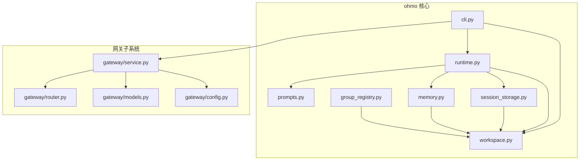
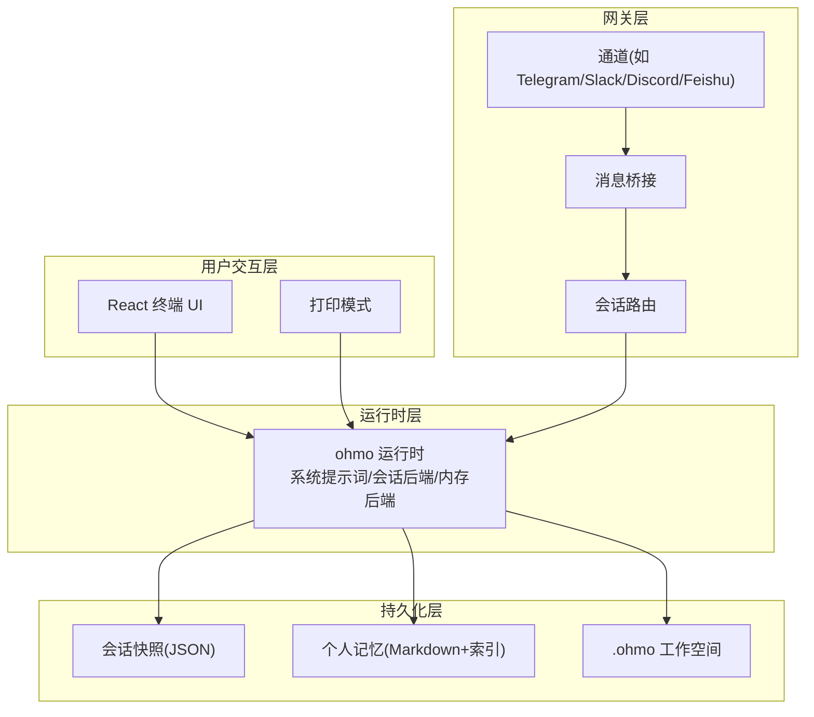
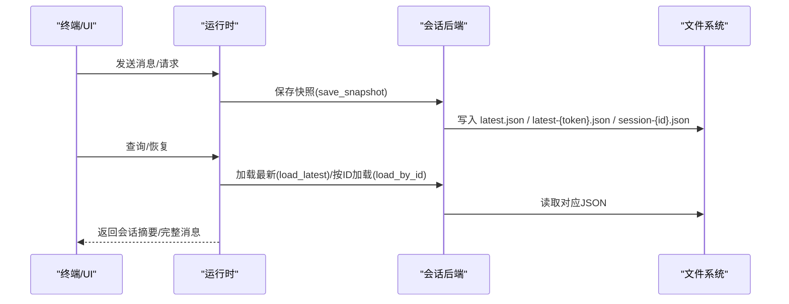
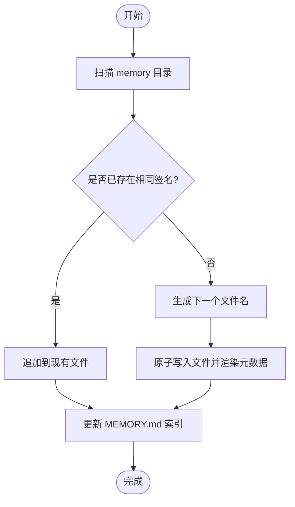
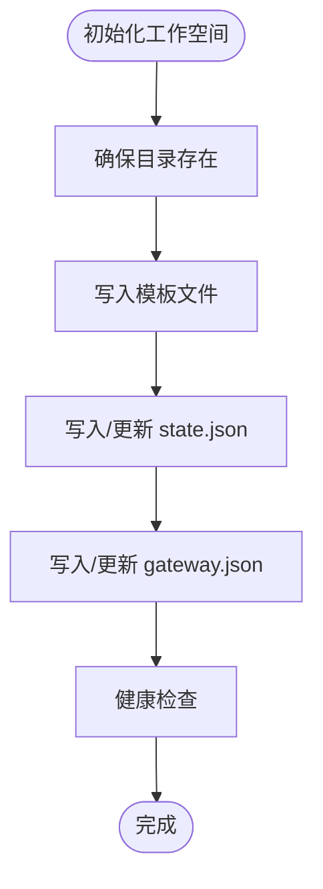
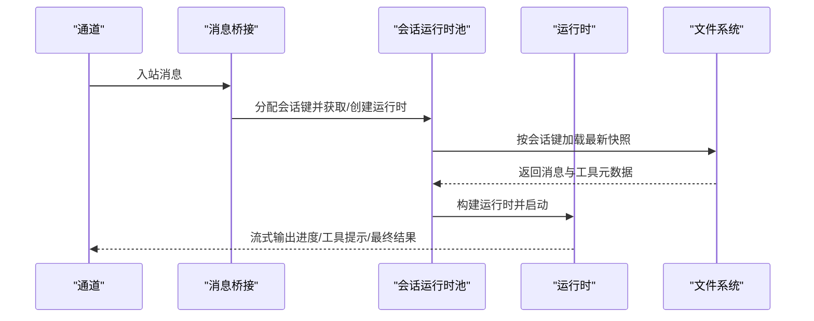
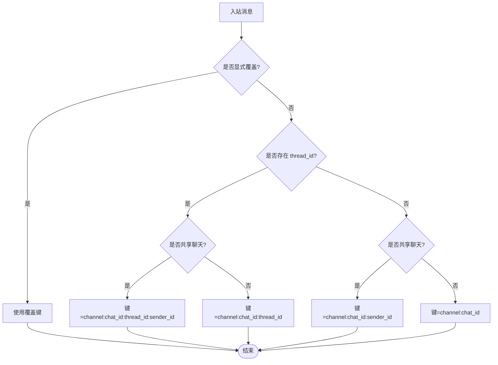
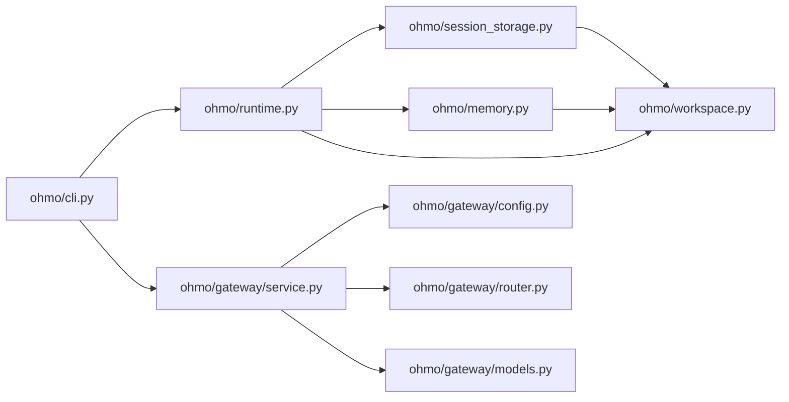

# 工作流程管理

<cite>
**本文引用的文件**
- [ohmo/__init__.py](file://ohmo/__init__.py)
- [ohmo/runtime.py](file://ohmo/runtime.py)
- [ohmo/memory.py](file://ohmo/memory.py)
- [ohmo/session_storage.py](file://ohmo/session_storage.py)
- [ohmo/workspace.py](file://ohmo/workspace.py)
- [ohmo/prompts.py](file://ohmo/prompts.py)
- [ohmo/cli.py](file://ohmo/cli.py)
- [ohmo/group_registry.py](file://ohmo/group_registry.py)
- [ohmo/gateway/router.py](file://ohmo/gateway/router.py)
- [ohmo/gateway/service.py](file://ohmo/gateway/service.py)
- [ohmo/gateway/models.py](file://ohmo/gateway/models.py)
- [ohmo/gateway/config.py](file://ohmo/gateway/config.py)
- [tests/test_ohmo/test_cli.py](file://tests/test_ohmo/test_cli.py)
- [tests/test_ohmo/test_gateway.py](file://tests/test_ohmo/test_gateway.py)
- [tests/test_ohmo/test_workspace.py](file://tests/test_ohmo/test_workspace.py)
</cite>

## 目录
1. [简介](#简介)
2. [项目结构](#项目结构)
3. [核心组件](#核心组件)
4. [架构总览](#架构总览)
5. [详细组件分析](#详细组件分析)
6. [依赖关系分析](#依赖关系分析)
7. [性能与可扩展性](#性能与可扩展性)
8. [故障排查指南](#故障排查指南)
9. [结论](#结论)
10. [附录：使用案例与最佳实践](#附录使用案例与最佳实践)

## 简介
本文件系统化阐述 ohmo 工作流程管理的设计与实现，覆盖会话管理、个人记忆（内存）存储、任务调度与运行时集成、团队协作与权限控制、以及 CLI 使用与运维。ohmo 基于 OpenHarness 构建，提供“个人代理”的工作空间与持久化能力，支持在多渠道（IM）中进行会话路由与恢复，并通过统一的运行时后端承载对话、工具调用与进度反馈。

## 项目结构
ohmo 的核心位于 ohmo/ 目录，围绕以下模块组织：
- 运行时与入口：runtime.py、cli.py
- 工作空间与模板：workspace.py
- 提示词构建：prompts.py
- 会话持久化：session_storage.py
- 个人记忆（Markdown 文件与索引）：memory.py
- 网关与通道：gateway/*（router、service、models、config）
- 团队群组元数据：group_registry.py

图表来源
- [ohmo/runtime.py:28-66](file://ohmo/runtime.py#L28-L66)
- [ohmo/cli.py:414-490](file://ohmo/cli.py#L414-L490)
- [ohmo/workspace.py:252-301](file://ohmo/workspace.py#L252-L301)
- [ohmo/prompts.py:27-74](file://ohmo/prompts.py#L27-L74)
- [ohmo/session_storage.py:151-203](file://ohmo/session_storage.py#L151-L203)
- [ohmo/memory.py:179-191](file://ohmo/memory.py#L179-L191)
- [ohmo/gateway/router.py:8-31](file://ohmo/gateway/router.py#L8-L31)
- [ohmo/gateway/service.py:39-73](file://ohmo/gateway/service.py#L39-L73)
- [ohmo/gateway/models.py:8-33](file://ohmo/gateway/models.py#L8-L33)
- [ohmo/gateway/config.py:13-41](file://ohmo/gateway/config.py#L13-L41)
- [ohmo/group_registry.py:40-77](file://ohmo/group_registry.py#L40-L77)

章节来源
- [ohmo/__init__.py:1-6](file://ohmo/__init__.py#L1-L6)
- [ohmo/workspace.py:163-320](file://ohmo/workspace.py#L163-L320)

## 核心组件
- 运行时与 UI 启动：负责启动 React 终端 UI 或打印模式，绑定系统提示词、会话后端、内存后端与自动记忆目录。
- 会话存储：以 JSON 形式保存最新快照、按会话键分发的快照、会话列表与导出 Markdown。
- 个人记忆：基于 Markdown 文件与索引的轻量知识库，支持去重、软删除、签名校验与增量索引。
- 工作空间：初始化 .ohmo 根目录、模板文件（soul/user/identity/MEMORY.md/BOOTSTRAP）、状态与网关配置。
- 网关服务：前台/后台生命周期管理、通道连接、消息桥接、重启通知、状态写盘。
- 会话路由：根据私聊/群聊、线程、发送者区分会话键，确保共享上下文隔离。
- 网关配置模型：提供 provider、通道启用、进度/工具提示开关、远程管理命令白名单等。
- 团队群组注册：记录受控群组的元数据（渠道、聊天ID、所有者、绑定工作区、仓库等）。

章节来源
- [ohmo/runtime.py:28-66](file://ohmo/runtime.py#L28-L66)
- [ohmo/session_storage.py:41-148](file://ohmo/session_storage.py#L41-L148)
- [ohmo/memory.py:41-176](file://ohmo/memory.py#L41-L176)
- [ohmo/workspace.py:252-301](file://ohmo/workspace.py#L252-L301)
- [ohmo/gateway/service.py:39-73](file://ohmo/gateway/service.py#L39-L73)
- [ohmo/gateway/router.py:8-31](file://ohmo/gateway/router.py#L8-L31)
- [ohmo/gateway/models.py:8-33](file://ohmo/gateway/models.py#L8-L33)
- [ohmo/group_registry.py:40-77](file://ohmo/group_registry.py#L40-L77)

## 架构总览
ohmo 将“个人工作空间”作为统一根，运行时通过会话后端与内存后端接入 OpenHarness 引擎；网关服务负责多通道消息接入与会话路由，结合工作空间的模板与配置，形成完整的个人工作流程闭环。

图表来源
- [ohmo/runtime.py:28-66](file://ohmo/runtime.py#L28-L66)
- [ohmo/session_storage.py:151-203](file://ohmo/session_storage.py#L151-L203)
- [ohmo/memory.py:179-191](file://ohmo/memory.py#L179-L191)
- [ohmo/gateway/service.py:39-73](file://ohmo/gateway/service.py#L39-L73)
- [ohmo/gateway/router.py:8-31](file://ohmo/gateway/router.py#L8-L31)

## 详细组件分析

### 会话管理与持久化
- 会话快照保存：包含 app、session_id、session_key、cwd、model、system_prompt、消息、用量、工具元数据、摘要、消息数与时间戳；同时写入 latest.json 与 latest-{token}.json 以便按会话键快速恢复。
- 最新会话加载：从 sessions 目录读取 latest.json 并做负载清洗。
- 会话列表与查询：遍历 session-*.json，限制数量并返回摘要信息。
- Markdown 导出：将消息转为 Markdown 文档，便于归档与审计。
- 会话后端封装：OhmoSessionBackend 实现 SessionBackend 接口，统一路径与操作。

图表来源
- [ohmo/session_storage.py:41-148](file://ohmo/session_storage.py#L41-L148)
- [ohmo/session_storage.py:151-203](file://ohmo/session_storage.py#L151-L203)

章节来源
- [ohmo/session_storage.py:41-148](file://ohmo/session_storage.py#L41-L148)
- [ohmo/session_storage.py:151-203](file://ohmo/session_storage.py#L151-L203)

### 个人记忆（内存）存储
- 列表与添加：扫描 memory 目录，按需生成 slug，计算签名避免重复，原子写入文件并更新 MEMORY.md 索引。
- 删除：软删除（标记 disabled），更新索引，不物理删除文件。
- 提示词注入：构建包含最近若干条记忆片段与索引的提示段落，供系统提示词拼装。
- 命令后端：将个人记忆能力暴露为 /memory 命令后端，绑定默认类型与目录。

图表来源
- [ohmo/memory.py:41-107](file://ohmo/memory.py#L41-L107)
- [ohmo/memory.py:179-191](file://ohmo/memory.py#L179-L191)

章节来源
- [ohmo/memory.py:28-176](file://ohmo/memory.py#L28-L176)
- [ohmo/memory.py:179-191](file://ohmo/memory.py#L179-L191)

### 工作空间与模板
- 初始化：确保 .ohmo 根目录及子目录存在，缺失时写入 soul.md、user.md、identity.md、MEMORY.md、BOOTSTRAP.md 与 state.json；首次初始化写入引导文件。
- 网关配置：若不存在则写入默认 gateway.json，包含 provider_profile、enabled_channels、session_routing、send_progress、send_tool_hints、permission_mode、sandbox_enabled、allow_remote_admin_commands、allowed_remote_admin_commands、log_level、channel_configs 等字段。
- 健康检查：返回各关键资产的存在性。

图表来源
- [ohmo/workspace.py:252-301](file://ohmo/workspace.py#L252-L301)
- [ohmo/workspace.py:304-320](file://ohmo/workspace.py#L304-L320)

章节来源
- [ohmo/workspace.py:252-301](file://ohmo/workspace.py#L252-L301)
- [ohmo/workspace.py:304-320](file://ohmo/workspace.py#L304-L320)

### 网关服务与通道集成
- 生命周期：前台运行写入 PID 与状态文件，心跳更新；后台启动/停止/重启；支持就地重启。
- 消息桥接：将通道消息桥接到运行时池，按会话键恢复或新建会话。
- 重启通知：在重启前向通道发布“已恢复”提示，确保连续性。
- 状态与日志：状态文件记录运行状态、活跃会话数、错误信息；日志文件输出到 logs 目录。

图表来源
- [ohmo/gateway/service.py:198-253](file://ohmo/gateway/service.py#L198-L253)
- [ohmo/gateway/router.py:8-31](file://ohmo/gateway/router.py#L8-L31)

章节来源
- [ohmo/gateway/service.py:39-73](file://ohmo/gateway/service.py#L39-L73)
- [ohmo/gateway/service.py:198-253](file://ohmo/gateway/service.py#L198-L253)

### 会话路由策略
- 私聊：保持 channel:chat_id 粒度，兼容历史会话。
- 群聊：加入 sender_id 区分不同发送者，避免共享上下文污染。
- 线程：优先使用 thread_id，再回退到 chat_id；私聊无 thread_id 时仍按私聊键。
- 显式覆盖：支持消息级别的 session_key_override。

图表来源
- [ohmo/gateway/router.py:8-31](file://ohmo/gateway/router.py#L8-L31)

章节来源
- [ohmo/gateway/router.py:8-31](file://ohmo/gateway/router.py#L8-L31)

### 团队协作与权限
- 网关配置模型：包含 permission_mode、sandbox_enabled、allow_remote_admin_commands、allowed_remote_admin_commands 等字段，用于控制权限与安全边界。
- 通道配置：按通道写入 channel_configs，如 Telegram/Slack/Discord/Feishu 的令牌、策略与白名单。
- 群组管理：通过 group_registry 记录受控群组元数据，支持按渠道/聊天ID定位并绑定工作区/仓库。

章节来源
- [ohmo/gateway/models.py:8-33](file://ohmo/gateway/models.py#L8-L33)
- [ohmo/gateway/config.py:29-41](file://ohmo/gateway/config.py#L29-L41)
- [ohmo/group_registry.py:40-77](file://ohmo/group_registry.py#L40-L77)

### CLI 与运行模式
- 主命令：支持 --backend-only、--print、--model、--profile、--workspace、--max-turns、--resume、--continue 等选项；支持 doctor、init、config、gateway 子命令。
- 打印模式：构建运行时，提交单条 prompt，流式渲染事件，返回错误码。
- React TUI：解析前端配置，安装依赖，启动 TSX 进程并与后端通信。
- 网关命令：run/start/stop/restart/status，支持前台运行与后台守护。

章节来源
- [ohmo/cli.py:414-490](file://ohmo/cli.py#L414-L490)
- [ohmo/runtime.py:92-144](file://ohmo/runtime.py#L92-L144)
- [ohmo/runtime.py:147-218](file://ohmo/runtime.py#L147-L218)

## 依赖关系分析
- 运行时依赖 OpenHarness 的 UI 运行时、消息事件流、API 客户端与会话后端接口。
- 会话后端与内存后端均依赖 ohmo/workspace 的目录约定。
- 网关服务依赖通道适配器与消息总线，路由模块独立于具体通道实现。
- CLI 作为入口协调运行时、网关与工作空间初始化。

图表来源
- [ohmo/cli.py:414-490](file://ohmo/cli.py#L414-L490)
- [ohmo/runtime.py:28-66](file://ohmo/runtime.py#L28-L66)
- [ohmo/session_storage.py:151-203](file://ohmo/session_storage.py#L151-L203)
- [ohmo/memory.py:179-191](file://ohmo/memory.py#L179-L191)
- [ohmo/workspace.py:252-301](file://ohmo/workspace.py#L252-L301)
- [ohmo/gateway/service.py:39-73](file://ohmo/gateway/service.py#L39-L73)
- [ohmo/gateway/config.py:13-41](file://ohmo/gateway/config.py#L13-L41)
- [ohmo/gateway/router.py:8-31](file://ohmo/gateway/router.py#L8-L31)
- [ohmo/gateway/models.py:8-33](file://ohmo/gateway/models.py#L8-L33)

章节来源
- [ohmo/cli.py:414-490](file://ohmo/cli.py#L414-L490)
- [ohmo/runtime.py:28-66](file://ohmo/runtime.py#L28-L66)
- [ohmo/session_storage.py:151-203](file://ohmo/session_storage.py#L151-L203)
- [ohmo/memory.py:179-191](file://ohmo/memory.py#L179-L191)
- [ohmo/workspace.py:252-301](file://ohmo/workspace.py#L252-L301)
- [ohmo/gateway/service.py:39-73](file://ohmo/gateway/service.py#L39-L73)
- [ohmo/gateway/config.py:13-41](file://ohmo/gateway/config.py#L13-L41)
- [ohmo/gateway/router.py:8-31](file://ohmo/gateway/router.py#L8-L31)
- [ohmo/gateway/models.py:8-33](file://ohmo/gateway/models.py#L8-L33)

## 性能与可扩展性
- 会话快照写入采用原子写入，减少竞态与损坏风险。
- 会话键哈希缩短 token，便于按会话键快速检索最新快照。
- 路由策略在群聊与线程场景下引入 sender_id，避免共享上下文导致的额外负担。
- 网关服务心跳与状态文件降低监控成本，便于外部进程管理。
- 个人记忆采用签名去重与索引增量更新，控制 I/O 成本。

[本节为通用指导，无需列出章节来源]

## 故障排查指南
- doctor 命令：检查工作空间、模板文件、状态文件、网关配置与可用的 provider 配置状态。
- 网关状态：通过状态文件与 PID 文件判断运行状态；若 PID 文件存在但进程不可用，清理 PID 文件后重试。
- 通道配置：确认 enabled_channels 与 channel_configs 是否正确；allow_from 为空表示默认拒绝远程访问，需显式配置。
- 重启通知：若出现“网关已恢复”提示，确认重启通知文件是否被消费并清理。
- 权限与远程命令：若远程管理命令无效，检查 allow_remote_admin_commands 与 allowed_remote_admin_commands 设置。

章节来源
- [ohmo/cli.py:536-560](file://ohmo/cli.py#L536-L560)
- [ohmo/gateway/service.py:415-449](file://ohmo/gateway/service.py#L415-L449)
- [tests/test_ohmo/test_cli.py:17-28](file://tests/test_ohmo/test_cli.py#L17-L28)
- [tests/test_ohmo/test_cli.py:145-178](file://tests/test_ohmo/test_cli.py#L145-L178)

## 结论
ohmo 通过统一的工作空间、会话后端与个人记忆能力，将 OpenHarness 的引擎能力与多通道网关整合，形成可恢复、可扩展、可审计的个人工作流程系统。其会话路由策略与权限模型确保在复杂协作场景下的上下文隔离与安全可控；CLI 与网关服务提供了完善的运维与可观测性支持。

[本节为总结，无需列出章节来源]

## 附录：使用案例与最佳实践

### 日常开发工作流
- 初始化工作空间：使用 init 命令生成模板文件与默认网关配置；doctor 检查健康状态。
- 本地对话：直接运行 ohmo，进入 React TUI 或使用 --print 模式快速输出。
- 会话恢复：使用 --continue 或 --resume 指定恢复上次会话或指定会话ID。
- 个人记忆：通过 memory 子命令增删改查记忆条目，或在系统提示词中自动注入最近记忆。

章节来源
- [ohmo/cli.py:493-520](file://ohmo/cli.py#L493-L520)
- [ohmo/cli.py:562-588](file://ohmo/cli.py#L562-L588)
- [ohmo/runtime.py:28-66](file://ohmo/runtime.py#L28-L66)

### 项目管理与知识管理
- 将项目相关知识沉淀为个人记忆文件，定期维护 MEMORY.md 索引。
- 使用会话导出功能生成 Markdown 汇总，便于归档与复盘。
- 在网关配置中开启 send_progress 与 send_tool_hints，提升协作透明度。

章节来源
- [ohmo/memory.py:156-176](file://ohmo/memory.py#L156-L176)
- [ohmo/session_storage.py:134-148](file://ohmo/session_storage.py#L134-L148)
- [ohmo/gateway/config.py:29-41](file://ohmo/gateway/config.py#L29-L41)

### 团队协作与权限管理
- 通道配置：按需启用 Telegram/Slack/Discord/Feishu，设置 allow_from 白名单，默认拒绝所有远程访问。
- 群组绑定：通过 group_registry 记录受控群组，绑定工作区与仓库，确保上下文一致性。
- 权限模式：根据需要调整 permission_mode、sandbox_enabled 与远程管理命令白名单。

章节来源
- [ohmo/gateway/config.py:29-41](file://ohmo/gateway/config.py#L29-L41)
- [ohmo/group_registry.py:40-77](file://ohmo/group_registry.py#L40-L77)
- [tests/test_ohmo/test_cli.py:42-49](file://tests/test_ohmo/test_cli.py#L42-L49)
- [tests/test_ohmo/test_cli.py:106-143](file://tests/test_ohmo/test_cli.py#L106-L143)