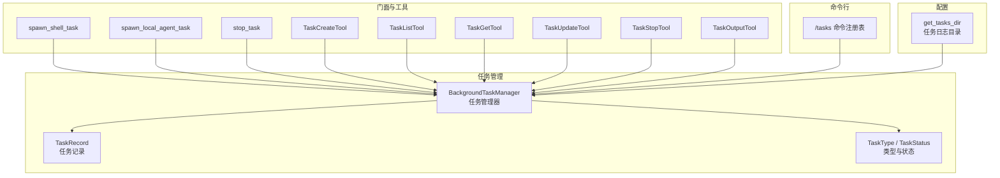
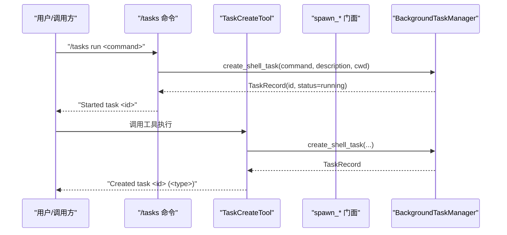
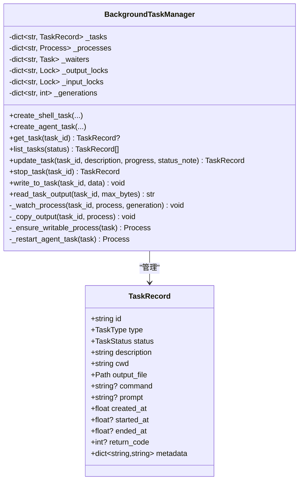
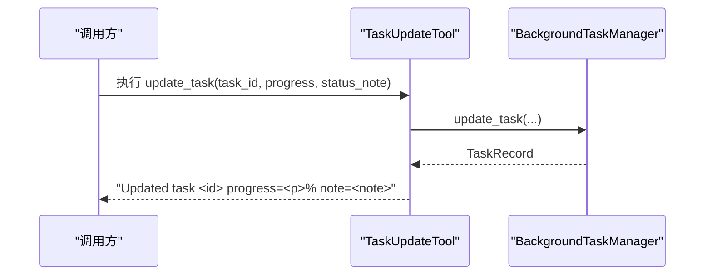
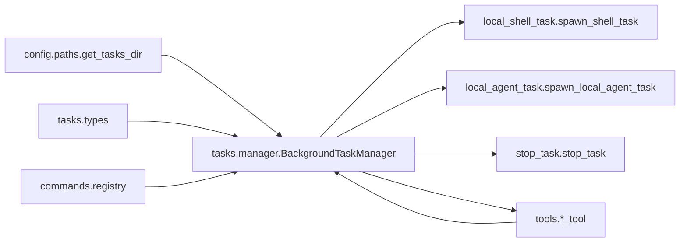

# 任务操作与使用

<cite>
**本文引用的文件**
- [src/openharness/tasks/manager.py](file://src/openharness/tasks/manager.py)
- [src/openharness/tasks/__init__.py](file://src/openharness/tasks/__init__.py)
- [src/openharness/tasks/types.py](file://src/openharness/tasks/types.py)
- [src/openharness/tasks/local_shell_task.py](file://src/openharness/tasks/local_shell_task.py)
- [src/openharness/tasks/local_agent_task.py](file://src/openharness/tasks/local_agent_task.py)
- [src/openharness/tasks/stop_task.py](file://src/openharness/tasks/stop_task.py)
- [src/openharness/tools/task_create_tool.py](file://src/openharness/tools/task_create_tool.py)
- [src/openharness/tools/task_get_tool.py](file://src/openharness/tools/task_get_tool.py)
- [src/openharness/tools/task_list_tool.py](file://src/openharness/tools/task_list_tool.py)
- [src/openharness/tools/task_update_tool.py](file://src/openharness/tools/task_update_tool.py)
- [src/openharness/tools/task_stop_tool.py](file://src/openharness/tools/task_stop_tool.py)
- [src/openharness/tools/task_output_tool.py](file://src/openharness/tools/task_output_tool.py)
- [src/openharness/commands/registry.py](file://src/openharness/commands/registry.py)
- [src/openharness/config/paths.py](file://src/openharness/config/paths.py)
- [tests/test_tasks/test_manager.py](file://tests/test_tasks/test_manager.py)
- [tests/test_tools/test_task_tools.py](file://tests/test_tools/test_task_tools.py)
</cite>

## 目录
1. [简介](#简介)
2. [项目结构](#项目结构)
3. [核心组件](#核心组件)
4. [架构总览](#架构总览)
5. [详细组件分析](#详细组件分析)
6. [依赖分析](#依赖分析)
7. [性能考虑](#性能考虑)
8. [故障排查指南](#故障排查指南)
9. [结论](#结论)
10. [附录：API 使用示例与最佳实践](#附录api-使用示例与最佳实践)

## 简介
本文件面向需要在 OpenHarness 中进行后台任务管理的开发者与使用者，提供从创建、查询、更新到停止的完整 API 使用指南。内容覆盖任务管理器的核心方法（如 create_shell_task、create_agent_task、get_task、list_tasks、update_task、stop_task），解释参数、返回值与典型使用场景；并通过工具层与命令行入口展示在实际项目中的调用方式；最后给出并发与线程安全、错误处理与调试技巧等实用建议。

## 项目结构
任务管理相关代码主要分布在 tasks 子包与工具层（tools）及命令注册表（commands）。核心职责划分如下：
- tasks/manager.py：后台任务管理器，负责任务生命周期、进程管理、输出读写、并发控制等
- tasks/types.py：任务数据模型与类型定义
- tasks/local_shell_task.py、local_agent_task.py、stop_task.py：任务创建与停止的轻量门面
- tools/*_tool.py：面向工具系统的任务操作封装（如 task_create、task_list、task_update、task_stop、task_output）
- commands/registry.py：命令行“/tasks”子命令的实现入口
- config/paths.py：任务日志目录与路径解析

图表来源
- [src/openharness/tasks/manager.py:18-281](file://src/openharness/tasks/manager.py#L18-L281)
- [src/openharness/tasks/types.py:10-31](file://src/openharness/tasks/types.py#L10-L31)
- [src/openharness/tasks/local_shell_task.py:11-18](file://src/openharness/tasks/local_shell_task.py#L11-L18)
- [src/openharness/tasks/local_agent_task.py:11-29](file://src/openharness/tasks/local_agent_task.py#L11-L29)
- [src/openharness/tasks/stop_task.py:9-12](file://src/openharness/tasks/stop_task.py#L9-L12)
- [src/openharness/tools/task_create_tool.py:23-57](file://src/openharness/tools/task_create_tool.py#L23-L57)
- [src/openharness/tools/task_list_tool.py:17-36](file://src/openharness/tools/task_list_tool.py#L17-L36)
- [src/openharness/tools/task_get_tool.py:17-34](file://src/openharness/tools/task_get_tool.py#L17-L34)
- [src/openharness/tools/task_update_tool.py:20-51](file://src/openharness/tools/task_update_tool.py#L20-L51)
- [src/openharness/tools/task_stop_tool.py:17-31](file://src/openharness/tools/task_stop_tool.py#L17-L31)
- [src/openharness/tools/task_output_tool.py:18-36](file://src/openharness/tools/task_output_tool.py#L18-L36)
- [src/openharness/commands/registry.py:1204-1256](file://src/openharness/commands/registry.py#L1204-L1256)
- [src/openharness/config/paths.py:78-82](file://src/openharness/config/paths.py#L78-L82)

章节来源
- [src/openharness/tasks/__init__.py:1-19](file://src/openharness/tasks/__init__.py#L1-L19)

## 核心组件
- 任务管理器 BackgroundTaskManager：负责任务创建、运行、停止、输出读取、输入写入、并发锁与进程生命周期管理
- 任务数据模型 TaskRecord：描述任务的标识、类型、状态、描述、工作目录、输出文件、命令、提示词、时间戳、返回码与元数据
- 类型定义 TaskType、TaskStatus：限定任务类型与状态集合
- 门面函数：spawn_shell_task、spawn_local_agent_task、stop_task，简化外部调用
- 工具封装：TaskCreateTool、TaskListTool、TaskGetTool、TaskUpdateTool、TaskStopTool、TaskOutputTool，面向工具系统与插件生态
- 命令行入口：/tasks 子命令，支持 list/run/stop/show/update/output 等操作
- 路径与日志：get_tasks_dir 提供任务输出日志目录

章节来源
- [src/openharness/tasks/manager.py:18-281](file://src/openharness/tasks/manager.py#L18-L281)
- [src/openharness/tasks/types.py:10-31](file://src/openharness/tasks/types.py#L10-L31)
- [src/openharness/tasks/local_shell_task.py:11-18](file://src/openharness/tasks/local_shell_task.py#L11-L18)
- [src/openharness/tasks/local_agent_task.py:11-29](file://src/openharness/tasks/local_agent_task.py#L11-L29)
- [src/openharness/tasks/stop_task.py:9-12](file://src/openharness/tasks/stop_task.py#L9-L12)
- [src/openharness/tools/task_create_tool.py:23-57](file://src/openharness/tools/task_create_tool.py#L23-L57)
- [src/openharness/tools/task_list_tool.py:17-36](file://src/openharness/tools/task_list_tool.py#L17-L36)
- [src/openharness/tools/task_get_tool.py:17-34](file://src/openharness/tools/task_get_tool.py#L17-L34)
- [src/openharness/tools/task_update_tool.py:20-51](file://src/openharness/tools/task_update_tool.py#L20-L51)
- [src/openharness/tools/task_stop_tool.py:17-31](file://src/openharness/tools/task_stop_tool.py#L17-L31)
- [src/openharness/tools/task_output_tool.py:18-36](file://src/openharness/tools/task_output_tool.py#L18-L36)
- [src/openharness/commands/registry.py:1204-1256](file://src/openharness/commands/registry.py#L1204-L1256)
- [src/openharness/config/paths.py:78-82](file://src/openharness/config/paths.py#L78-L82)

## 架构总览
任务管理采用“管理器 + 门面 + 工具 + 命令行”的分层设计：
- 管理器集中处理进程生命周期、输出/输入流、并发锁、状态变更与持久化输出
- 门面与工具提供统一的异步接口，便于在不同上下文（脚本、插件、命令行）中复用
- 命令行通过注册表桥接用户输入与管理器操作

图表来源
- [src/openharness/commands/registry.py:1213-1220](file://src/openharness/commands/registry.py#L1213-L1220)
- [src/openharness/tools/task_create_tool.py:30-56](file://src/openharness/tools/task_create_tool.py#L30-L56)
- [src/openharness/tasks/local_shell_task.py:11-18](file://src/openharness/tasks/local_shell_task.py#L11-L18)
- [src/openharness/tasks/manager.py:29-56](file://src/openharness/tasks/manager.py#L29-L56)

## 详细组件分析

### 任务管理器 BackgroundTaskManager
- 角色与职责
  - 维护任务字典、进程映射、等待任务、输出/输入锁、代数计数
  - 创建 shell 与 agent 任务，启动子进程，监控退出码，更新状态
  - 提供任务查询、列表、更新元数据、停止、写入输入、读取输出等能力
- 关键方法与行为
  - create_shell_task：生成任务 ID，创建输出文件，初始化记录，启动进程并注册 watcher
  - create_agent_task：若未显式提供命令，则基于环境变量与可选模型参数构造命令；随后复用 shell 任务流程
  - get_task/list_tasks：按 ID 获取单个任务或按状态过滤列表
  - update_task：更新描述、进度（metadata）、状态备注（metadata），用于协调与 UI 展示
  - stop_task：终止进程，带超时重试，最终标记 killed 并记录结束时间
  - write_to_task：向任务 stdin 写入一行数据，自动处理本地 agent 的重启与恢复
  - read_task_output：读取输出文件尾部内容，支持最大字节数限制
  - 内部机制：_watch_process/_copy_output 实现输出复制与状态收尾；_ensure_writable_process/_restart_agent_task 处理 agent 输入与重启
  - 单例：get_task_manager 返回按数据目录键绑定的默认实例，确保同一数据目录下的任务隔离
- 数据模型
  - TaskRecord：包含 id、type、status、description、cwd、output_file、command、prompt、时间戳、return_code、metadata
  - TaskType/TaskStatus：约束类型与状态集合

图表来源
- [src/openharness/tasks/manager.py:18-281](file://src/openharness/tasks/manager.py#L18-L281)
- [src/openharness/tasks/types.py:14-31](file://src/openharness/tasks/types.py#L14-L31)

章节来源
- [src/openharness/tasks/manager.py:18-281](file://src/openharness/tasks/manager.py#L18-L281)
- [src/openharness/tasks/types.py:10-31](file://src/openharness/tasks/types.py#L10-L31)

### 任务类型与数据模型
- TaskType：local_bash、local_agent、remote_agent、in_process_teammate
- TaskStatus：pending、running、completed、failed、killed
- TaskRecord：任务运行期表示，包含必要字段与可扩展 metadata

章节来源
- [src/openharness/tasks/types.py:10-31](file://src/openharness/tasks/types.py#L10-L31)

### 门面与工具层
- spawn_shell_task/spawn_local_agent_task/stop_task：直接委托给 get_task_manager，简化调用
- TaskCreateTool/TaskListTool/TaskGetTool/TaskUpdateTool/TaskStopTool/TaskOutputTool：封装输入校验、调用管理器并返回标准化结果

图表来源
- [src/openharness/tools/task_update_tool.py:27-50](file://src/openharness/tools/task_update_tool.py#L27-L50)
- [src/openharness/tasks/manager.py:105-125](file://src/openharness/tasks/manager.py#L105-L125)

章节来源
- [src/openharness/tasks/local_shell_task.py:11-18](file://src/openharness/tasks/local_shell_task.py#L11-L18)
- [src/openharness/tasks/local_agent_task.py:11-29](file://src/openharness/tasks/local_agent_task.py#L11-L29)
- [src/openharness/tasks/stop_task.py:9-12](file://src/openharness/tasks/stop_task.py#L9-L12)
- [src/openharness/tools/task_create_tool.py:23-57](file://src/openharness/tools/task_create_tool.py#L23-L57)
- [src/openharness/tools/task_list_tool.py:17-36](file://src/openharness/tools/task_list_tool.py#L17-L36)
- [src/openharness/tools/task_get_tool.py:17-34](file://src/openharness/tools/task_get_tool.py#L17-L34)
- [src/openharness/tools/task_update_tool.py:20-51](file://src/openharness/tools/task_update_tool.py#L20-L51)
- [src/openharness/tools/task_stop_tool.py:17-31](file://src/openharness/tools/task_stop_tool.py#L17-L31)
- [src/openharness/tools/task_output_tool.py:18-36](file://src/openharness/tools/task_output_tool.py#L18-L36)

### 命令行集成
- /tasks 子命令支持：
  - list：列出所有任务
  - run <command>：创建 shell 任务
  - stop <id>：停止指定任务
  - show <id>：显示任务详情
  - update <id> description|progress|note ...：更新任务元数据
  - output <id>：读取任务输出

章节来源
- [src/openharness/commands/registry.py:1204-1256](file://src/openharness/commands/registry.py#L1204-L1256)

## 依赖分析
- 模块耦合
  - manager 依赖 types 定义与 config.paths 解析任务日志目录
  - 门面与工具均依赖 get_task_manager 单例
  - 命令行通过注册表间接依赖管理器
- 并发与锁
  - 输出/输入分别使用 asyncio.Lock，避免竞态
  - 进程 watcher 与输出复制分离，保证稳定性
- 可能的循环依赖
  - 当前结构清晰，无循环导入迹象

图表来源
- [src/openharness/config/paths.py:78-82](file://src/openharness/config/paths.py#L78-L82)
- [src/openharness/tasks/manager.py:14-15](file://src/openharness/tasks/manager.py#L14-L15)
- [src/openharness/tasks/types.py:10-31](file://src/openharness/tasks/types.py#L10-L31)
- [src/openharness/tasks/local_shell_task.py:7-8](file://src/openharness/tasks/local_shell_task.py#L7-L8)
- [src/openharness/tasks/local_agent_task.py:7-8](file://src/openharness/tasks/local_agent_task.py#L7-L8)
- [src/openharness/tasks/stop_task.py:5-6](file://src/openharness/tasks/stop_task.py#L5-L6)
- [src/openharness/tools/task_create_tool.py:9-10](file://src/openharness/tools/task_create_tool.py#L9-L10)
- [src/openharness/commands/registry.py:1204-1205](file://src/openharness/commands/registry.py#L1204-L1205)

## 性能考虑
- I/O 与缓冲
  - 输出复制采用分块读取，避免一次性大块内存占用
  - 通过 max_bytes 控制输出读取上限，防止 UI 或工具层阻塞
- 并发与锁粒度
  - 输出/输入锁按任务粒度分配，降低争用范围
  - 进程 watcher 与输出复制分离，减少阻塞
- 重启与恢复
  - 本地 agent 在输入断开时自动重启，提升鲁棒性
- 资源清理
  - 进程结束后及时移除映射，避免内存泄漏

[本节为通用性能讨论，无需特定文件引用]

## 故障排查指南
- 常见错误与处理
  - 任务不存在：get_task/update_task/stop_task/read_task_output 在找不到任务时抛出异常，需先确认任务 ID 或使用 list_tasks 校验
  - 任务未运行：stop_task 对非运行任务会报错，需检查当前状态
  - 不接受输入：write_to_task 对不支持输入的任务会报错，本地 agent 需要专用命令或自动重启
  - 缺少密钥：本地 agent 任务需要 ANTHROPIC_API_KEY 或显式命令覆盖
- 调试技巧
  - 使用 /tasks output <id> 查看最新输出
  - 使用 /tasks list 与 /tasks show <id> 核对任务状态与描述
  - 在工具层使用 TaskOutputTool/TaskGetTool 快速验证
- 单测参考
  - 测试覆盖了 shell 任务创建与输出读取、agent 任务写入与重启、停止任务状态变更等关键路径

章节来源
- [src/openharness/tasks/manager.py:127-145](file://src/openharness/tasks/manager.py#L127-L145)
- [src/openharness/tasks/manager.py:147-161](file://src/openharness/tasks/manager.py#L147-L161)
- [src/openharness/tasks/manager.py:68-80](file://src/openharness/tasks/manager.py#L68-L80)
- [tests/test_tasks/test_manager.py:14-86](file://tests/test_tasks/test_manager.py#L14-L86)
- [tests/test_tools/test_task_tools.py:19-111](file://tests/test_tools/test_task_tools.py#L19-L111)

## 结论
OpenHarness 的任务管理以 BackgroundTaskManager 为核心，结合门面与工具层，提供了从创建、运行、更新到停止的完整能力，并通过命令行与 UI 层实现易用的交互体验。其并发模型采用细粒度锁与进程 watcher，兼顾稳定性与性能。遵循本文的 API 使用指南与最佳实践，可在复杂场景下可靠地管理后台任务。

[本节为总结性内容，无需特定文件引用]

## 附录：API 使用示例与最佳实践

### 方法与参数说明
- create_shell_task
  - 参数：command（必需）、description（必需）、cwd（必需）、task_type（可选，默认 local_bash）
  - 返回：TaskRecord
  - 场景：执行任意 shell 命令，适合构建、测试、部署等流水线步骤
- create_agent_task
  - 参数：prompt（必需）、description（必需）、cwd（必需）、task_type（可选，默认 local_agent）、model（可选）、api_key（可选）、command（可选）
  - 返回：TaskRecord
  - 场景：本地或远程智能体对话、推理与交互
- get_task(task_id)
  - 参数：task_id（必需）
  - 返回：TaskRecord 或 None
  - 场景：查询单个任务详情
- list_tasks(status=None)
  - 参数：status（可选，按状态过滤）
  - 返回：TaskRecord 列表（按创建时间倒序）
  - 场景：任务概览与筛选
- update_task(task_id, description=None, progress=None, status_note=None)
  - 参数：任务 ID 与可选的描述、进度（0-100）、状态备注
  - 返回：TaskRecord
  - 场景：UI 进度展示与人工状态标注
- stop_task(task_id)
  - 参数：task_id（必需）
  - 返回：TaskRecord（状态 killed）
  - 场景：取消长时间运行或异常任务
- write_to_task(task_id, data)
  - 参数：任务 ID 与待发送的一行文本
  - 返回：None
  - 场景：向 agent 任务输入后续指令
- read_task_output(task_id, max_bytes=12000)
  - 参数：任务 ID 与最大读取字节数
  - 返回：字符串（输出尾部片段）
  - 场景：实时查看任务输出

章节来源
- [src/openharness/tasks/manager.py:29-56](file://src/openharness/tasks/manager.py#L29-L56)
- [src/openharness/tasks/manager.py:58-92](file://src/openharness/tasks/manager.py#L58-L92)
- [src/openharness/tasks/manager.py:94-103](file://src/openharness/tasks/manager.py#L94-L103)
- [src/openharness/tasks/manager.py:98-103](file://src/openharness/tasks/manager.py#L98-L103)
- [src/openharness/tasks/manager.py:105-125](file://src/openharness/tasks/manager.py#L105-L125)
- [src/openharness/tasks/manager.py:127-145](file://src/openharness/tasks/manager.py#L127-L145)
- [src/openharness/tasks/manager.py:147-161](file://src/openharness/tasks/manager.py#L147-L161)
- [src/openharness/tasks/manager.py:162-168](file://src/openharness/tasks/manager.py#L162-L168)

### 典型使用路径与示例
- 通过命令行创建并查看输出
  - /tasks run <command> 启动任务
  - /tasks list 查看任务列表
  - /tasks output <id> 查看输出
- 通过工具层创建与更新
  - TaskCreateTool：type=local_bash 或 local_agent，传入 description、command/prompt、model
  - TaskUpdateTool：更新 progress 与 status_note，便于 UI 展示
- 通过门面函数快速创建
  - spawn_shell_task / spawn_local_agent_task / stop_task 直接调用默认管理器

章节来源
- [src/openharness/commands/registry.py:1213-1220](file://src/openharness/commands/registry.py#L1213-L1220)
- [src/openharness/tools/task_create_tool.py:30-56](file://src/openharness/tools/task_create_tool.py#L30-L56)
- [src/openharness/tools/task_update_tool.py:27-50](file://src/openharness/tools/task_update_tool.py#L27-L50)
- [src/openharness/tasks/local_shell_task.py:11-18](file://src/openharness/tasks/local_shell_task.py#L11-L18)
- [src/openharness/tasks/local_agent_task.py:11-29](file://src/openharness/tasks/local_agent_task.py#L11-L29)
- [src/openharness/tasks/stop_task.py:9-12](file://src/openharness/tasks/stop_task.py#L9-L12)

### 并发与线程安全要点
- 输出/输入锁：每个任务独立的 asyncio.Lock，避免并发写入冲突
- 进程 watcher：独立协程复制 stdout，完成后统一收尾
- agent 自恢复：写入失败时自动重启进程，保证交互连续性
- 任务隔离：get_task_manager 按数据目录键绑定，确保不同工作空间任务互不影响

章节来源
- [src/openharness/tasks/manager.py:25-27](file://src/openharness/tasks/manager.py#L25-L27)
- [src/openharness/tasks/manager.py:170-191](file://src/openharness/tasks/manager.py#L170-L191)
- [src/openharness/tasks/manager.py:231-256](file://src/openharness/tasks/manager.py#L231-L256)
- [src/openharness/tasks/manager.py:259-270](file://src/openharness/tasks/manager.py#L259-L270)

### 错误处理与异常情况
- 任务不存在：get_task/update_task/stop_task/read_task_output 前应先校验任务存在
- 非运行任务：stop_task 仅对运行中的任务有效
- 不接受输入：write_to_task 对不支持输入的任务会报错，本地 agent 需要正确命令或允许自动重启
- 缺少密钥：本地 agent 任务需要 ANTHROPIC_API_KEY 或显式 command

章节来源
- [src/openharness/tasks/manager.py:127-145](file://src/openharness/tasks/manager.py#L127-L145)
- [src/openharness/tasks/manager.py:147-161](file://src/openharness/tasks/manager.py#L147-L161)
- [src/openharness/tasks/manager.py:68-80](file://src/openharness/tasks/manager.py#L68-L80)

### 最佳实践
- 使用 TaskUpdateTool 更新 progress 与 status_note，保持 UI 与任务状态一致
- 对长输出使用 TaskOutputTool 并设置合理的 max_bytes
- 优先使用 spawn_* 门面与工具层，避免直接操作管理器细节
- 在多任务场景下，合理设置任务描述与元数据，便于检索与排障
- 对 agent 任务提供稳定的输入命令，减少重启次数

[本节为通用最佳实践，无需特定文件引用]