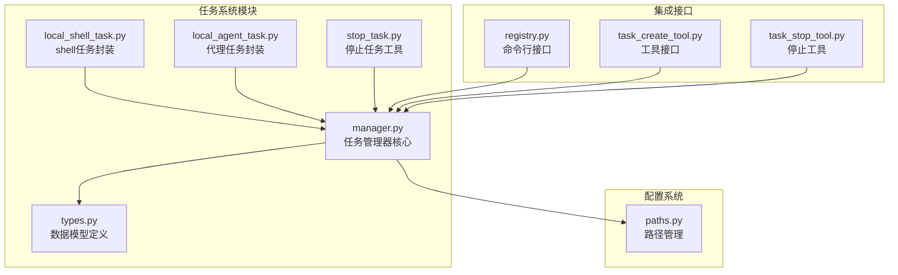
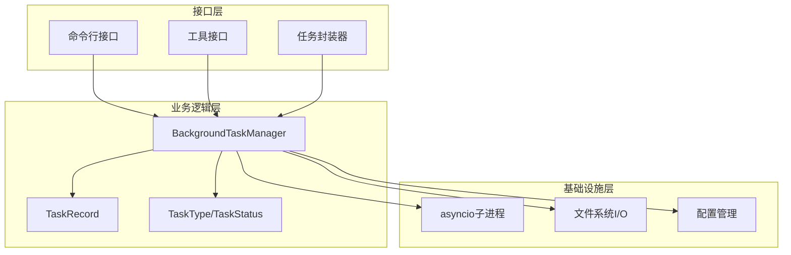
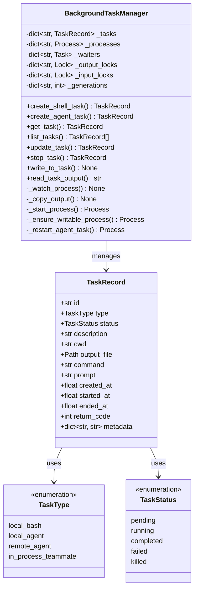
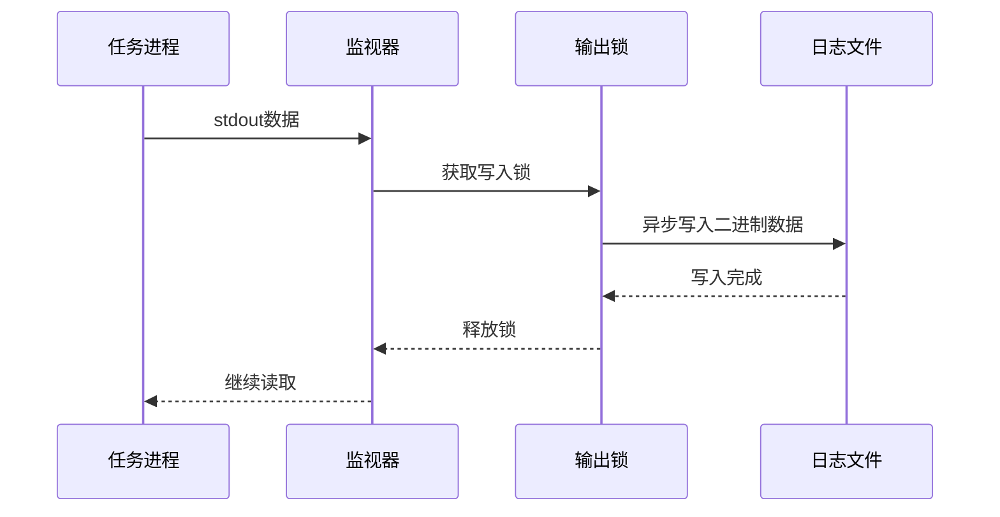
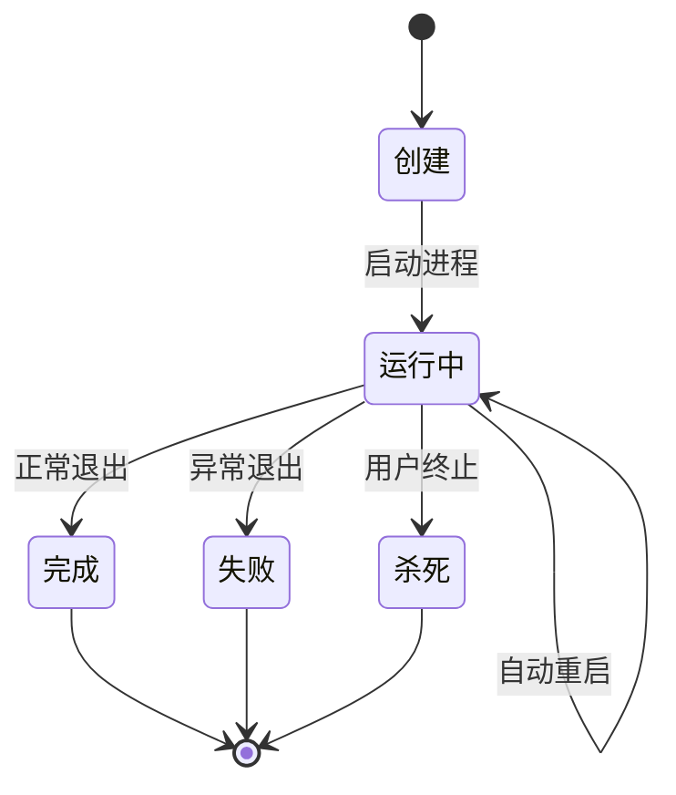
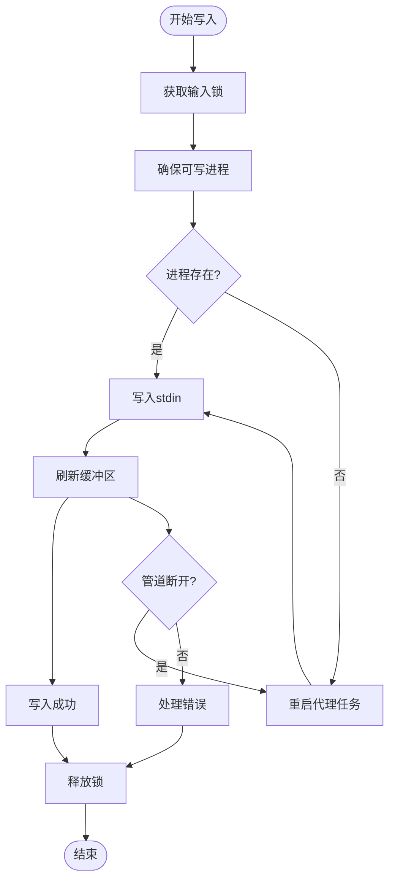
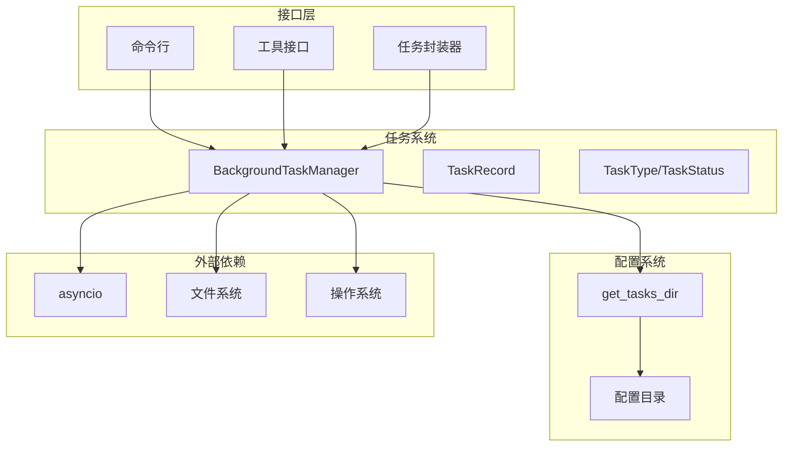

# 任务架构设计

<cite>
**本文档引用的文件**
- [manager.py](file://src/openharness/tasks/manager.py)
- [types.py](file://src/openharness/tasks/types.py)
- [local_shell_task.py](file://src/openharness/tasks/local_shell_task.py)
- [local_agent_task.py](file://src/openharness/tasks/local_agent_task.py)
- [stop_task.py](file://src/openharness/tasks/stop_task.py)
- [paths.py](file://src/openharness/config/paths.py)
- [registry.py](file://src/openharness/commands/registry.py)
- [task_create_tool.py](file://src/openharness/tools/task_create_tool.py)
- [task_stop_tool.py](file://src/openharness/tools/task_stop_tool.py)
- [test_manager.py](file://tests/test_tasks/test_manager.py)
</cite>

## 目录
1. [简介](#简介)
2. [项目结构](#项目结构)
3. [核心组件](#核心组件)
4. [架构概览](#架构概览)
5. [详细组件分析](#详细组件分析)
6. [依赖关系分析](#依赖关系分析)
7. [性能考虑](#性能考虑)
8. [故障排除指南](#故障排除指南)
9. [结论](#结论)

## 简介

OpenHarness 任务系统是一个基于 Python asyncio 的后台任务管理系统，专门设计用于管理各种类型的子进程任务。该系统提供了统一的任务抽象层，支持 shell 命令执行、本地代理任务、远程代理任务等多种任务类型，并通过异步处理模型实现了高效的并发任务管理。

系统的核心设计理念是通过单一的 BackgroundTaskManager 类来集中管理所有任务生命周期，包括任务创建、启动、监控、停止和清理等操作。每个任务都由 TaskRecord 数据结构进行完整描述，包含任务状态、元数据、输出文件路径等关键信息。

## 项目结构

任务系统位于 `src/openharness/tasks/` 目录下，采用模块化设计，每个功能模块都有明确的职责分工：

**图表来源**
- [manager.py:1-281](file://src/openharness/tasks/manager.py#L1-L281)
- [types.py:1-31](file://src/openharness/tasks/types.py#L1-L31)
- [paths.py:78-82](file://src/openharness/config/paths.py#L78-L82)

**章节来源**
- [manager.py:1-281](file://src/openharness/tasks/manager.py#L1-L281)
- [types.py:1-31](file://src/openharness/tasks/types.py#L1-L31)
- [paths.py:1-117](file://src/openharness/config/paths.py#L1-L117)

## 核心组件

### BackgroundTaskManager 类

BackgroundTaskManager 是整个任务系统的核心类，负责管理所有任务的生命周期。它维护了四个主要字典映射：

- `_tasks`: 存储所有任务记录的字典
- `_processes`: 存储活跃进程的字典  
- `_waiters`: 存储任务监视器协程的字典
- `_output_locks`: 存储输出写入锁的字典

该类提供了完整的异步任务管理能力，包括任务创建、状态更新、输入输出处理、进程重启等核心功能。

**章节来源**
- [manager.py:18-281](file://src/openharness/tasks/manager.py#L18-L281)

### TaskRecord 数据结构

TaskRecord 是任务的运行时表示，使用 dataclass 定义，包含以下关键字段：

- **基础信息**: id、type、status、description
- **执行环境**: cwd（工作目录）、output_file（输出文件路径）
- **执行参数**: command（命令）、prompt（提示词）
- **时间戳**: created_at、started_at、ended_at
- **执行结果**: return_code
- **元数据**: metadata 字典，用于存储动态信息如进度、状态备注等

**章节来源**
- [types.py:14-31](file://src/openharness/tasks/types.py#L14-L31)

### 任务类型系统

系统支持四种任务类型：
- `local_bash`: 本地 shell 命令执行
- `local_agent`: 本地代理任务
- `remote_agent`: 远程代理任务
- `in_process_teammate`: 内置团队成员任务

每种类型都有特定的前缀标识符，用于生成唯一的任务 ID。

**章节来源**
- [types.py:10-11](file://src/openharness/tasks/types.py#L10-L11)
- [manager.py:273-281](file://src/openharness/tasks/manager.py#L273-L281)

## 架构概览

任务系统采用分层架构设计，从上到下分为接口层、业务逻辑层、基础设施层三个层次：

**图表来源**
- [manager.py:18-281](file://src/openharness/tasks/manager.py#L18-L281)
- [registry.py:1203-1263](file://src/openharness/commands/registry.py#L1203-L1263)

系统的核心异步处理模型基于 asyncio.subprocess，实现了非阻塞的任务执行和监控。每个任务都通过独立的 bash 进程执行，标准输出被实时重定向到任务专用的日志文件中。

## 详细组件分析

### 任务管理器架构

**图表来源**
- [manager.py:18-281](file://src/openharness/tasks/manager.py#L18-L281)
- [types.py:14-31](file://src/openharness/tasks/types.py#L14-L31)

### 单例模式实现

任务管理器采用全局单例模式，通过 `get_task_manager()` 函数确保在整个应用生命周期内只有一个实例存在。单例的键值基于任务目录的绝对路径，当配置目录发生变化时会自动创建新的实例。

这种设计确保了：
- 全局状态一致性
- 避免重复的进程管理开销
- 支持多工作区场景

**章节来源**
- [manager.py:259-271](file://src/openharness/tasks/manager.py#L259-L271)

### 任务标识符生成策略

系统使用带前缀的 UUID4 作为任务 ID，前缀与任务类型对应：
- `b` 前缀：local_bash 任务
- `a` 前缀：local_agent 任务  
- `r` 前缀：remote_agent 任务
- `t` 前缀：in_process_teammate 任务

这种设计提供了：
- 唯一性保证
- 类型可读性
- 简短的标识符长度

**章节来源**
- [manager.py:273-281](file://src/openharness/tasks/manager.py#L273-L281)

### 输出重定向机制

系统实现了高效的输出重定向机制，通过异步文件写入确保输出的实时性和完整性：

**图表来源**
- [manager.py:192-202](file://src/openharness/tasks/manager.py#L192-L202)

**章节来源**
- [manager.py:192-202](file://src/openharness/tasks/manager.py#L192-L202)

### 并发安全机制

系统通过多种机制确保并发安全性：

1. **输出锁**: 每个任务都有独立的输出锁，防止并发写入冲突
2. **输入锁**: 保护任务输入的原子性操作
3. **进程代数**: 使用 generation 字段防止过期进程接管
4. **异步上下文**: 所有操作都在 asyncio 事件循环中执行

**章节来源**
- [manager.py:25-27](file://src/openharness/tasks/manager.py#L25-L27)
- [manager.py:214-215](file://src/openharness/tasks/manager.py#L214-L215)

### 任务生命周期管理

**图表来源**
- [manager.py:170-191](file://src/openharness/tasks/manager.py#L170-L191)

系统支持以下状态转换：
- **正常完成**: 进程返回码为 0
- **执行失败**: 进程异常退出
- **手动终止**: 用户调用 stop_task 方法
- **自动重启**: 代理任务在断开连接后自动恢复

**章节来源**
- [manager.py:170-191](file://src/openharness/tasks/manager.py#L170-L191)

### 不同类型任务的处理

#### Shell 命令执行

本地 shell 任务通过 `/bin/bash -lc` 启动，支持：
- 命令行参数传递
- 工作目录设置
- 环境变量继承
- 标准输出重定向

#### 本地代理任务

本地代理任务具有特殊的能力：
- 自动检测和设置 API 密钥
- 支持模型参数配置
- 实现自动重启机制
- 支持交互式输入输出

#### 远程代理任务

远程代理任务通过网络协议与外部服务通信，支持：
- 异步消息传递
- 错误恢复机制
- 超时处理

**章节来源**
- [manager.py:29-92](file://src/openharness/tasks/manager.py#L29-L92)

### 输入输出处理流程

**图表来源**
- [manager.py:147-161](file://src/openharness/tasks/manager.py#L147-L161)

**章节来源**
- [manager.py:147-161](file://src/openharness/tasks/manager.py#L147-L161)

## 依赖关系分析

任务系统与其他模块的依赖关系如下：

**图表来源**
- [manager.py:14-15](file://src/openharness/tasks/manager.py#L14-L15)
- [paths.py:78-82](file://src/openharness/config/paths.py#L78-L82)

**章节来源**
- [manager.py:14-15](file://src/openharness/tasks/manager.py#L14-L15)
- [paths.py:78-82](file://src/openharness/config/paths.py#L78-L82)

## 性能考虑

### 异步处理优势

系统采用完全异步的设计，具有以下性能优势：
- **非阻塞 I/O**: 使用 asyncio.subprocess 实现非阻塞的进程管理
- **并发执行**: 多个任务可以同时运行而不互相阻塞
- **内存效率**: 通过流式读取避免大输出内容的内存占用
- **资源控制**: 通过锁机制避免资源竞争

### 输出优化策略

- **增量写入**: 使用 4096 字节块进行输出读取，平衡延迟和性能
- **尾部截断**: 输出读取限制最大字节数，防止内存溢出
- **二进制写入**: 直接写入原始字节，避免编码转换开销

### 内存管理

- **字典映射**: 使用字典存储任务状态，提供 O(1) 访问时间
- **惰性初始化**: 仅在需要时创建锁和等待器
- **进程复用**: 代理任务支持重启而非重新创建

## 故障排除指南

### 常见问题及解决方案

#### 任务无法启动
**症状**: 创建任务时报错，进程无法启动
**可能原因**:
- 缺少必要的命令参数
- 工作目录不存在或权限不足
- bash 解释器不可用

**解决方法**:
- 检查命令字符串的有效性
- 验证工作目录的可访问性
- 确认系统已安装 bash

#### 代理任务断开连接
**症状**: 代理任务意外退出，无法接收输入
**可能原因**:
- 进程异常终止
- 管道连接中断
- 资源限制导致的进程回收

**解决方法**:
- 系统会自动尝试重启代理任务
- 检查 API 密钥配置
- 监控系统资源使用情况

#### 输出读取异常
**症状**: 读取任务输出时出现乱码或截断
**可能原因**:
- 编码不匹配
- 输出过大被截断
- 文件权限问题

**解决方法**:
- 使用 UTF-8 编码读取
- 检查输出文件的可读性
- 调整最大输出字节数限制

**章节来源**
- [test_manager.py:14-86](file://tests/test_tasks/test_manager.py#L14-L86)

### 调试技巧

1. **启用详细日志**: 检查任务输出文件中的详细信息
2. **监控进程状态**: 使用系统工具查看进程树
3. **验证配置**: 确认任务目录和权限设置正确
4. **测试最小化**: 创建简单的测试任务验证系统功能

## 结论

OpenHarness 任务系统通过精心设计的架构实现了高效、可靠的后台任务管理。其核心优势包括：

**设计亮点**:
- **统一抽象**: 通过 TaskRecord 提供一致的任务表示
- **异步优先**: 完全基于 asyncio 的异步处理模型
- **类型安全**: 使用类型注解确保编译时检查
- **并发安全**: 通过锁机制和异步上下文保证线程安全

**扩展性考虑**:
- **插件化设计**: 易于添加新的任务类型
- **配置灵活**: 支持环境变量驱动的配置
- **监控友好**: 完整的状态跟踪和日志记录

**最佳实践建议**:
- 在创建任务时提供清晰的描述信息
- 合理设置超时和重试机制
- 监控系统资源使用情况
- 定期清理过期的任务输出文件

该系统为 OpenHarness 提供了强大的后台任务执行能力，支持从简单的 shell 命令到复杂的代理交互等各种应用场景。