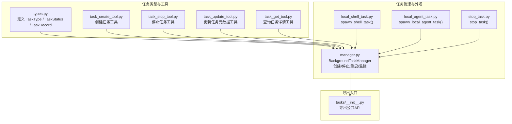
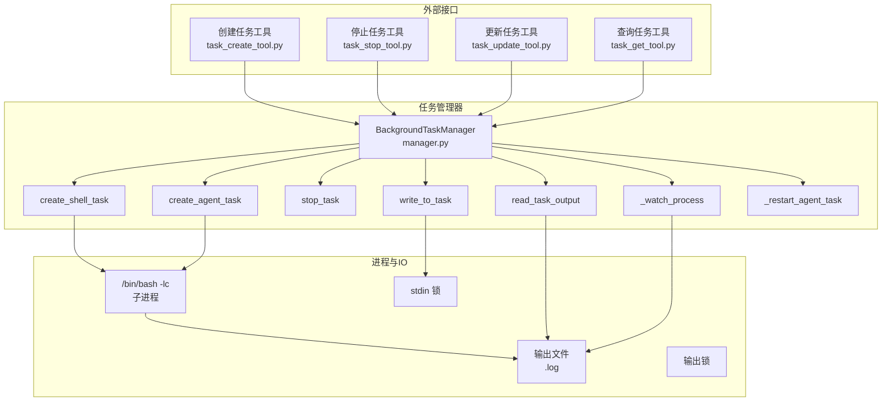
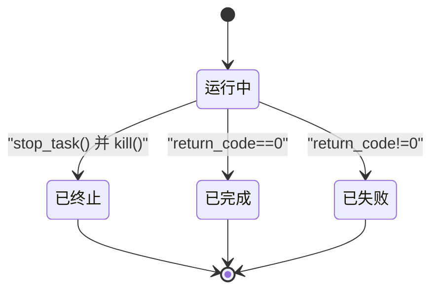
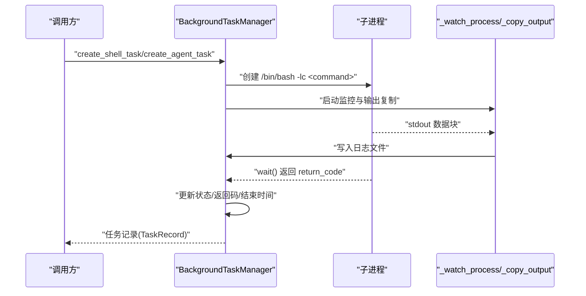
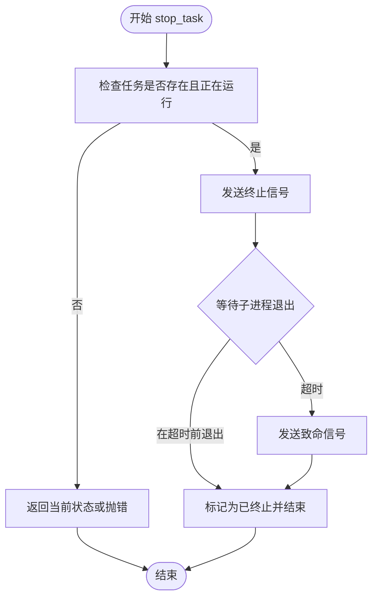
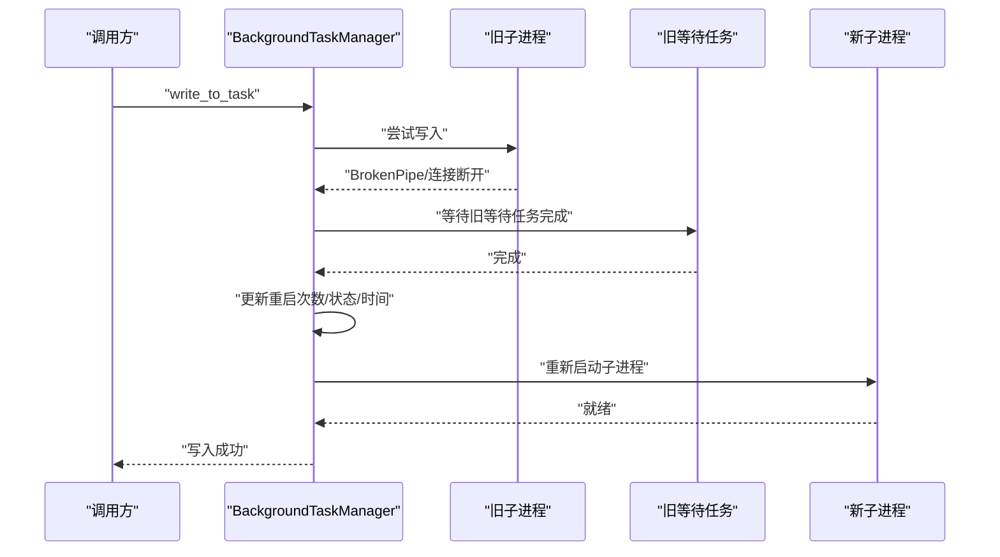
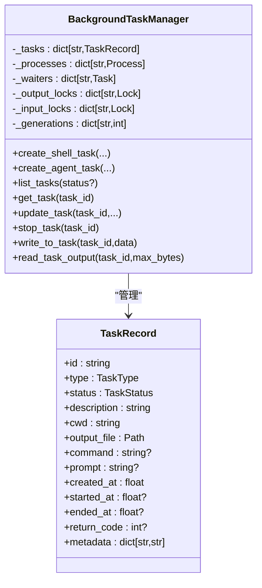
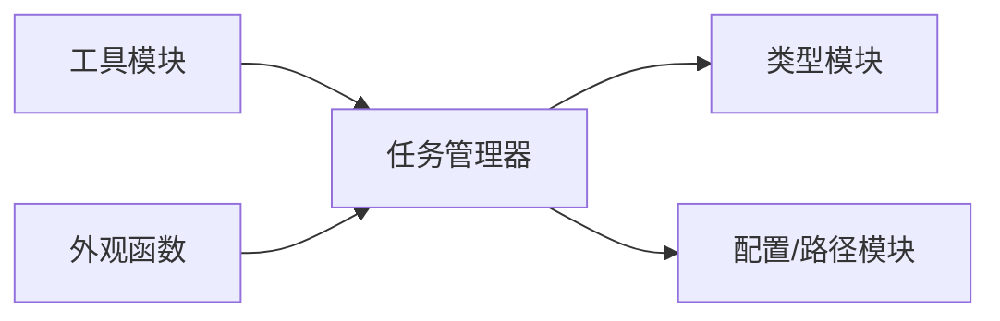

# 任务生命周期管理

<cite>
**本文引用的文件**
- [src/openharness/tasks/__init__.py](file://src/openharness/tasks/__init__.py)
- [src/openharness/tasks/types.py](file://src/openharness/tasks/types.py)
- [src/openharness/tasks/manager.py](file://src/openharness/tasks/manager.py)
- [src/openharness/tasks/local_agent_task.py](file://src/openharness/tasks/local_agent_task.py)
- [src/openharness/tasks/local_shell_task.py](file://src/openharness/tasks/local_shell_task.py)
- [src/openharness/tasks/stop_task.py](file://src/openharness/tasks/stop_task.py)
- [src/openharness/tools/task_create_tool.py](file://src/openharness/tools/task_create_tool.py)
- [src/openharness/tools/task_stop_tool.py](file://src/openharness/tools/task_stop_tool.py)
- [src/openharness/tools/task_update_tool.py](file://src/openharness/tools/task_update_tool.py)
- [src/openharness/tools/task_get_tool.py](file://src/openharness/tools/task_get_tool.py)
- [tests/test_tasks/test_manager.py](file://tests/test_tasks/test_manager.py)
</cite>

## 目录
1. [简介](#简介)
2. [项目结构](#项目结构)
3. [核心组件](#核心组件)
4. [架构总览](#架构总览)
5. [详细组件分析](#详细组件分析)
6. [依赖分析](#依赖分析)
7. [性能考虑](#性能考虑)
8. [故障排除指南](#故障排除指南)
9. [结论](#结论)
10. [附录](#附录)

## 简介
本文件系统性阐述 OpenHarness 中“任务生命周期管理”的实现与最佳实践，覆盖任务从创建、运行、完成、失败、终止的状态转换；状态检查、更新与持久化；启动流程（进程创建、输出重定向、监控启动）；停止机制（正常终止、强制杀死、超时处理）；以及本地代理任务的自动重启策略。同时给出错误处理、异常恢复与资源清理的关键环节说明，并提供可操作的故障排除建议。

## 项目结构
任务生命周期管理主要由以下模块组成：
- 类型定义：任务类型与状态枚举、任务记录数据模型
- 管理器：统一的任务创建、运行、停止、重启与状态维护
- 工具接口：面向工具调用的创建、停止、更新、查询任务的入口
- 外观函数：简化本地任务创建的便捷函数
- 测试用例：验证生命周期行为与状态转换

图表来源
- [src/openharness/tasks/types.py:10-31](file://src/openharness/tasks/types.py#L10-L31)
- [src/openharness/tasks/manager.py:18-281](file://src/openharness/tasks/manager.py#L18-L281)
- [src/openharness/tasks/local_shell_task.py:11-18](file://src/openharness/tasks/local_shell_task.py#L11-L18)
- [src/openharness/tasks/local_agent_task.py:11-29](file://src/openharness/tasks/local_agent_task.py#L11-L29)
- [src/openharness/tasks/stop_task.py:9-12](file://src/openharness/tasks/stop_task.py#L9-L12)
- [src/openharness/tools/task_create_tool.py:23-57](file://src/openharness/tools/task_create_tool.py#L23-L57)
- [src/openharness/tools/task_stop_tool.py:17-31](file://src/openharness/tools/task_stop_tool.py#L17-L31)
- [src/openharness/tools/task_update_tool.py:20-51](file://src/openharness/tools/task_update_tool.py#L20-L51)
- [src/openharness/tools/task_get_tool.py:17-34](file://src/openharness/tools/task_get_tool.py#L17-L34)
- [src/openharness/tasks/__init__.py:3-18](file://src/openharness/tasks/__init__.py#L3-L18)

章节来源
- [src/openharness/tasks/__init__.py:1-19](file://src/openharness/tasks/__init__.py#L1-L19)
- [src/openharness/tasks/types.py:1-31](file://src/openharness/tasks/types.py#L1-L31)
- [src/openharness/tasks/manager.py:1-281](file://src/openharness/tasks/manager.py#L1-L281)
- [src/openharness/tasks/local_agent_task.py:1-29](file://src/openharness/tasks/local_agent_task.py#L1-L29)
- [src/openharness/tasks/local_shell_task.py:1-18](file://src/openharness/tasks/local_shell_task.py#L1-L18)
- [src/openharness/tasks/stop_task.py:1-12](file://src/openharness/tasks/stop_task.py#L1-L12)
- [src/openharness/tools/task_create_tool.py:1-57](file://src/openharness/tools/task_create_tool.py#L1-L57)
- [src/openharness/tools/task_stop_tool.py:1-31](file://src/openharness/tools/task_stop_tool.py#L1-L31)
- [src/openharness/tools/task_update_tool.py:1-51](file://src/openharness/tools/task_update_tool.py#L1-L51)
- [src/openharness/tools/task_get_tool.py:1-34](file://src/openharness/tools/task_get_tool.py#L1-L34)

## 核心组件
- 任务类型与状态
  - 任务类型：本地 Shell、本地 Agent、远程 Agent、进程内队友
  - 任务状态：待定、运行中、已完成、已失败、已终止
  - 任务记录：包含标识、类型、状态、描述、工作目录、输出文件、命令、提示词、时间戳、返回码、元数据等字段
- 任务管理器
  - 统一持有任务字典、子进程映射、等待任务、输出/输入锁、代数计数器
  - 提供创建 Shell 任务、创建 Agent 任务、列出/查询任务、更新任务元数据、停止任务、写入任务输入、读取任务输出、内部进程监控与重启等能力
- 工具接口
  - 通过工具封装对外暴露任务创建、停止、更新、查询能力，便于集成到更高层的编排或插件系统
- 外观函数
  - 提供 spawn_shell_task 与 spawn_local_agent_task 的便捷入口，内部委托给默认任务管理器

章节来源
- [src/openharness/tasks/types.py:10-31](file://src/openharness/tasks/types.py#L10-L31)
- [src/openharness/tasks/manager.py:18-281](file://src/openharness/tasks/manager.py#L18-L281)
- [src/openharness/tools/task_create_tool.py:23-57](file://src/openharness/tools/task_create_tool.py#L23-L57)
- [src/openharness/tools/task_stop_tool.py:17-31](file://src/openharness/tools/task_stop_tool.py#L17-L31)
- [src/openharness/tools/task_update_tool.py:20-51](file://src/openharness/tools/task_update_tool.py#L20-L51)
- [src/openharness/tools/task_get_tool.py:17-34](file://src/openharness/tools/task_get_tool.py#L17-L34)
- [src/openharness/tasks/local_shell_task.py:11-18](file://src/openharness/tasks/local_shell_task.py#L11-L18)
- [src/openharness/tasks/local_agent_task.py:11-29](file://src/openharness/tasks/local_agent_task.py#L11-L29)

## 架构总览
下图展示任务生命周期管理的整体架构与交互路径，包括状态机、进程监控、输出重定向与重启策略。

图表来源
- [src/openharness/tools/task_create_tool.py:23-57](file://src/openharness/tools/task_create_tool.py#L23-L57)
- [src/openhHarness/tools/task_stop_tool.py:17-31](file://src/openharness/tools/task_stop_tool.py#L17-L31)
- [src/openharness/tools/task_update_tool.py:20-51](file://src/openharness/tools/task_update_tool.py#L20-L51)
- [src/openharness/tools/task_get_tool.py:17-34](file://src/openharness/tools/task_get_tool.py#L17-L34)
- [src/openharness/tasks/manager.py:29-256](file://src/openharness/tasks/manager.py#L29-L256)

## 详细组件分析

### 任务状态机与状态转换
- 状态集合：待定、运行中、已完成、已失败、已终止
- 转换规则
  - 创建：任务被创建后初始状态为“运行中”
  - 运行中 → 已完成：子进程退出码为 0
  - 运行中 → 已失败：子进程退出码非 0
  - 运行中 → 已终止：主动停止（发送终止信号，超时则强制杀死）
  - 已终止不会回退到其他状态
- 重要细节
  - 监控协程在进程结束后更新状态、返回码与结束时间
  - 停止流程中若进程已不存在且任务处于已完成/失败/已终止，则视为成功但不重复处理

图表来源
- [src/openharness/tasks/manager.py:170-191](file://src/openharness/tasks/manager.py#L170-L191)
- [src/openharness/tasks/manager.py:127-145](file://src/openharness/tasks/manager.py#L127-L145)

章节来源
- [src/openharness/tasks/types.py:10-31](file://src/openharness/tasks/types.py#L10-L31)
- [src/openharness/tasks/manager.py:170-191](file://src/openharness/tasks/manager.py#L170-L191)
- [src/openharness/tasks/manager.py:127-145](file://src/openharness/tasks/manager.py#L127-L145)

### 启动流程：进程创建、输出重定向与监控
- 进程创建
  - 使用 bash 作为外壳执行命令，启用登录 shell 以加载环境
  - 子进程标准输入/输出/错误均被捕获，stderr 被合并到 stdout
  - 保存子进程句柄与等待任务，用于后续监控与回收
- 输出重定向
  - 每个任务对应一个日志文件，输出以二进制追加方式写入
  - 写入过程受输出锁保护，避免并发竞争
- 监控启动
  - 启动输出复制协程，持续从 stdout 读取并写入日志文件
  - 等待子进程退出，更新状态、返回码与结束时间
  - 若当前代数与生成计数一致，才进行状态更新，防止重启导致的竞态

图表来源
- [src/openharness/tasks/manager.py:209-229](file://src/openharness/tasks/manager.py#L209-L229)
- [src/openharness/tasks/manager.py:192-202](file://src/openharness/tasks/manager.py#L192-L202)
- [src/openharness/tasks/manager.py:170-191](file://src/openharness/tasks/manager.py#L170-L191)

章节来源
- [src/openharness/tasks/manager.py:29-56](file://src/openharness/tasks/manager.py#L29-L56)
- [src/openharness/tasks/manager.py:209-229](file://src/openharness/tasks/manager.py#L209-L229)
- [src/openharness/tasks/manager.py:192-202](file://src/openharness/tasks/manager.py#L192-L202)
- [src/openharness/tasks/manager.py:170-191](file://src/openharness/tasks/manager.py#L170-L191)

### 停止机制：正常终止、强制杀死与超时处理
- 正常终止
  - 发送终止信号，等待子进程优雅退出
  - 设置超时时间，若超时则进入强制杀死
- 强制杀死
  - 发送致命信号，等待进程退出并清理资源
- 状态更新
  - 将任务状态置为“已终止”，记录结束时间
- 边界情况
  - 若任务未在运行中（可能已退出），根据是否存在进程决定是否抛错或直接返回

图表来源
- [src/openharness/tasks/manager.py:127-145](file://src/openharness/tasks/manager.py#L127-L145)

章节来源
- [src/openharness/tasks/manager.py:127-145](file://src/openharness/tasks/manager.py#L127-L145)

### 重启机制：本地代理任务的自动重启策略
- 触发条件
  - 当向本地/远程 Agent 或进程内队友任务写入输入时，若检测到进程不可写（如断开），则触发重启
- 重启流程
  - 等待旧等待任务完成（避免竞态）
  - 更新重启次数、状态、开始时间、清空结束时间与返回码
  - 重新启动子进程并返回新的进程句柄
- 代数与生成计数
  - 每次重启会递增生成计数，监控协程仅接受与其代数一致的退出事件，防止旧协程覆盖新状态

图表来源
- [src/openharness/tasks/manager.py:231-256](file://src/openharness/tasks/manager.py#L231-L256)
- [src/openharness/tasks/manager.py:147-161](file://src/openharness/tasks/manager.py#L147-L161)

章节来源
- [src/openharness/tasks/manager.py:231-256](file://src/openharness/tasks/manager.py#L231-L256)
- [src/openharness/tasks/manager.py:147-161](file://src/openharness/tasks/manager.py#L147-L161)

### 状态检查、更新与持久化
- 状态检查
  - 查询单个任务或按状态过滤列表
  - 支持按创建时间排序
- 状态更新
  - 可更新描述、进度百分比、状态备注
  - 进度与备注存储于元数据字典中
- 状态持久化
  - 任务记录对象保存在内存字典中
  - 日志文件以二进制形式追加写入，作为输出层面的持久化载体
  - 任务记录本身不序列化到磁盘，重启后由监控与状态机更新

图表来源
- [src/openharness/tasks/types.py:14-31](file://src/openharness/tasks/types.py#L14-L31)
- [src/openharness/tasks/manager.py:18-281](file://src/openharness/tasks/manager.py#L18-L281)

章节来源
- [src/openharness/tasks/manager.py:94-126](file://src/openharness/tasks/manager.py#L94-L126)
- [src/openharness/tasks/manager.py:162-168](file://src/openharness/tasks/manager.py#L162-L168)
- [src/openharness/tasks/types.py:14-31](file://src/openharness/tasks/types.py#L14-L31)

### 工具接口与使用示例
- 创建任务
  - 支持本地 Shell 与本地 Agent 两种类型
  - Agent 任务可指定模型与 API 密钥，或通过命令覆盖
- 停止任务
  - 通过工具传入任务 ID，交由管理器执行停止逻辑
- 更新任务
  - 支持更新描述、进度与状态备注
- 查询任务
  - 返回任务的详细状态信息

章节来源
- [src/openharness/tools/task_create_tool.py:23-57](file://src/openharness/tools/task_create_tool.py#L23-L57)
- [src/openharness/tools/task_stop_tool.py:17-31](file://src/openharness/tools/task_stop_tool.py#L17-L31)
- [src/openharness/tools/task_update_tool.py:20-51](file://src/openharness/tools/task_update_tool.py#L20-L51)
- [src/openharness/tools/task_get_tool.py:17-34](file://src/openharness/tools/task_get_tool.py#L17-L34)

## 依赖分析
- 组件耦合
  - 管理器与类型模块强耦合（使用 TaskRecord、TaskType、TaskStatus）
  - 工具模块依赖管理器进行任务操作
  - 外观函数依赖管理器进行任务创建
- 外部依赖
  - 子进程管理依赖 asyncio.subprocess
  - 文件 IO 依赖路径与文件系统
- 循环依赖
  - 未发现循环导入；模块间为单向依赖

图表来源
- [src/openharness/tasks/manager.py:14](file://src/openharness/tasks/manager.py#L14)
- [src/openharness/tasks/local_shell_task.py:7-8](file://src/openharness/tasks/local_shell_task.py#L7-L8)
- [src/openharness/tasks/local_agent_task.py:7-8](file://src/openharness/tasks/local_agent_task.py#L7-L8)
- [src/openharness/tools/task_create_tool.py:9](file://src/openharness/tools/task_create_tool.py#L9)

章节来源
- [src/openharness/tasks/manager.py:14](file://src/openharness/tasks/manager.py#L14)
- [src/openharness/tasks/local_shell_task.py:7-8](file://src/openharness/tasks/local_shell_task.py#L7-L8)
- [src/openharness/tasks/local_agent_task.py:7-8](file://src/openharness/tasks/local_agent_task.py#L7-L8)
- [src/openharness/tools/task_create_tool.py:9](file://src/openharness/tools/task_create_tool.py#L9)

## 性能考虑
- 输出写入
  - 使用二进制追加写入与输出锁，避免频繁系统调用与竞态
- 监控与复制
  - 输出复制采用固定大小块读取，减少内存占用
- 并发控制
  - 输入写入与输出复制分别使用独立锁，提升并发吞吐
- 重启成本
  - 重启涉及等待旧等待任务、重建进程与重新注入提示词，应避免频繁重启
- I/O 与日志
  - 日志文件过大时仅返回尾部内容，降低读取开销

## 故障排除指南
- 无法创建本地 Agent 任务
  - 缺少 API 密钥且未提供命令覆盖时会抛错
  - 解决：设置环境变量或显式传入命令
- 写入任务输入时报错
  - 非可写任务类型会报错
  - 对于本地/远程 Agent 或进程内队友，会自动重启并重试
- 停止任务无效
  - 若任务已不在运行中（例如已退出），需检查任务状态或进程是否存在
- 重启次数异常
  - 检查元数据中的重启计数，确认是否为预期行为
- 输出为空或过短
  - 确认输出文件路径与权限，注意日志截断策略

章节来源
- [src/openharness/tasks/manager.py:69-92](file://src/openharness/tasks/manager.py#L69-L92)
- [src/openharness/tasks/manager.py:147-161](file://src/openharness/tasks/manager.py#L147-L161)
- [src/openharness/tasks/manager.py:127-145](file://src/openharness/tasks/manager.py#L127-L145)
- [tests/test_tasks/test_manager.py:32-86](file://tests/test_tasks/test_manager.py#L32-L86)

## 结论
OpenHarness 的任务生命周期管理以 BackgroundTaskManager 为核心，围绕“创建—运行—完成/失败/终止”状态机构建，结合子进程监控、输出重定向与自动重启策略，实现了对本地 Shell 与本地 Agent 任务的可靠管理。通过工具与外观函数提供简洁的外部接口，配合元数据更新与日志持久化，满足日常开发与自动化场景的需求。遵循本文最佳实践与故障排除建议，可有效提升任务稳定性与可观测性。

## 附录
- 最佳实践
  - 明确区分任务类型与输入约束，避免在不可写任务上写入
  - 合理设置命令与工作目录，确保子进程环境正确
  - 使用工具更新任务进度与备注，增强可观测性
  - 控制重启频率，必要时通过元数据与日志定位问题
- 参考测试
  - 验证创建与输出读取、Agent 写入与重启、停止任务状态转换等关键行为

章节来源
- [tests/test_tasks/test_manager.py:14-86](file://tests/test_tasks/test_manager.py#L14-L86)