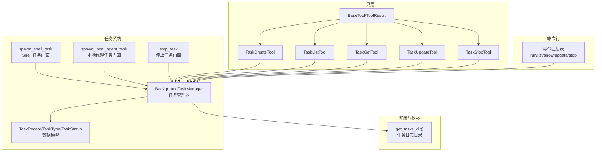
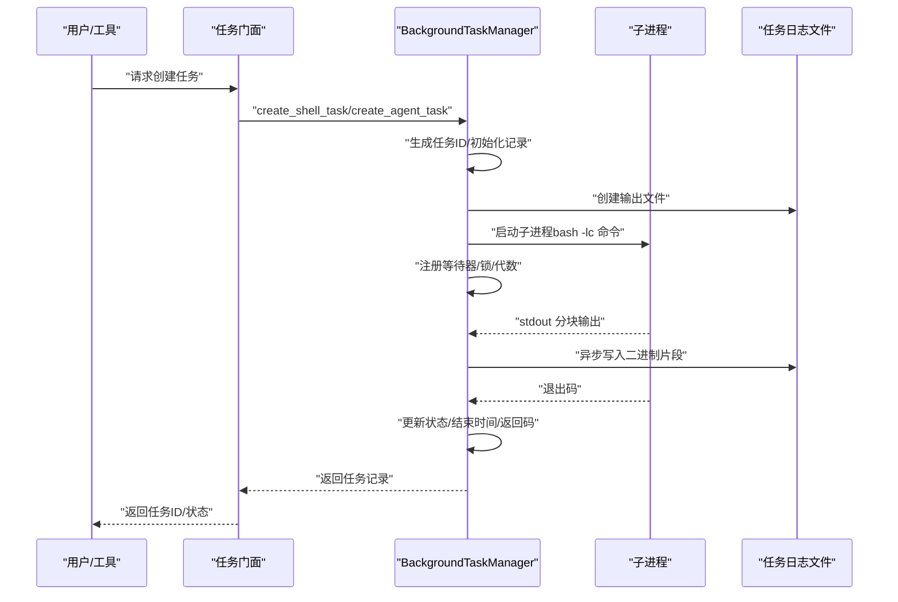
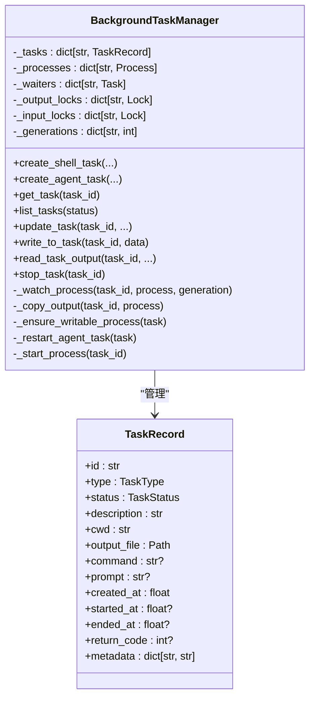
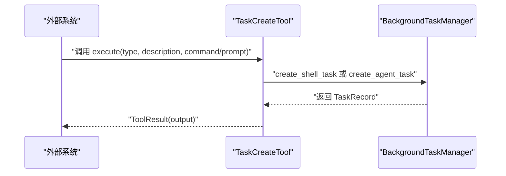
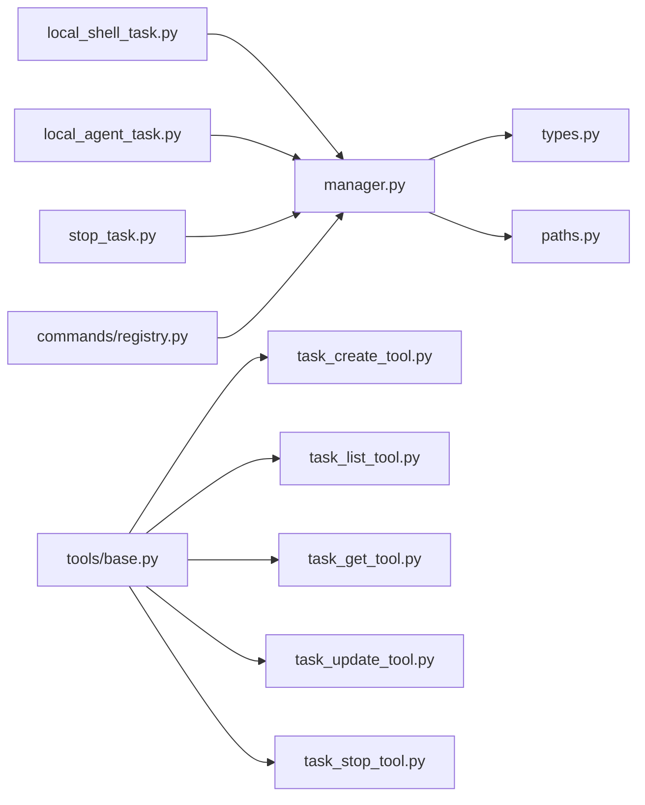
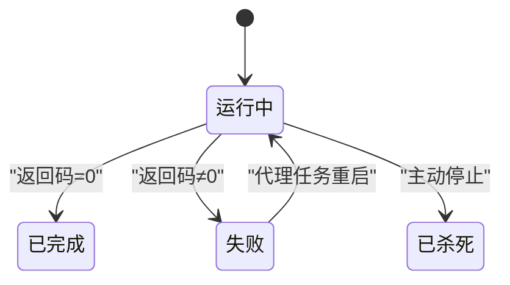

# 任务管理系统

<cite>
**本文引用的文件**
- [src/openharness/tasks/__init__.py](file://src/openharness/tasks/__init__.py)
- [src/openharness/tasks/manager.py](file://src/openharness/tasks/manager.py)
- [src/openharness/tasks/types.py](file://src/openharness/tasks/types.py)
- [src/openharness/tasks/local_agent_task.py](file://src/openharness/tasks/local_agent_task.py)
- [src/openharness/tasks/local_shell_task.py](file://src/openharness/tasks/local_shell_task.py)
- [src/openharness/tasks/stop_task.py](file://src/openharness/tasks/stop_task.py)
- [src/openharness/tools/task_create_tool.py](file://src/openharness/tools/task_create_tool.py)
- [src/openharness/tools/task_list_tool.py](file://src/openharness/tools/task_list_tool.py)
- [src/openharness/tools/task_get_tool.py](file://src/openharness/tools/task_get_tool.py)
- [src/openharness/tools/task_stop_tool.py](file://src/openharness/tools/task_stop_tool.py)
- [src/openharness/tools/task_update_tool.py](file://src/openharness/tools/task_update_tool.py)
- [src/openharness/tools/base.py](file://src/openharness/tools/base.py)
- [src/openharness/config/paths.py](file://src/openharness/config/paths.py)
- [tests/test_tasks/test_manager.py](file://tests/test_tasks/test_manager.py)
- [src/openharness/commands/registry.py](file://src/openharness/commands/registry.py)
</cite>

## 目录
1. [简介](#简介)
2. [项目结构](#项目结构)
3. [核心组件](#核心组件)
4. [架构总览](#架构总览)
5. [详细组件分析](#详细组件分析)
6. [依赖关系分析](#依赖关系分析)
7. [性能考量](#性能考量)
8. [故障排查指南](#故障排查指南)
9. [结论](#结论)
10. [附录：任务开发与最佳实践](#附录任务开发与最佳实践)

## 简介
本文件系统性阐述 OpenHarness 的任务管理系统，聚焦于后台任务执行与资源管理的设计理念与实现细节。系统通过统一的任务管理器协调多种类型的任务（本地 Shell 任务、本地代理任务等），提供任务创建、启动、监控、更新与停止的完整生命周期管理，并通过工具化接口与命令行入口对外暴露能力，满足异步处理与后台执行场景。

## 项目结构
任务系统主要由以下模块组成：
- 任务管理器与数据模型：负责任务生命周期、进程管理、输出与输入流处理、状态跟踪与并发控制
- 任务工具：以工具形式封装任务的创建、查询、列表、更新与停止操作
- 命令行入口：提供 CLI 子命令用于快速运行、列出、查看、更新与停止任务
- 配置与路径：定义任务日志与输出目录的解析逻辑

图表来源
- [src/openharness/tasks/manager.py:18-281](file://src/openharness/tasks/manager.py#L18-L281)
- [src/openharness/tasks/types.py:10-31](file://src/openharness/tasks/types.py#L10-L31)
- [src/openharness/tasks/local_shell_task.py:11-18](file://src/openharness/tasks/local_shell_task.py#L11-L18)
- [src/openharness/tasks/local_agent_task.py:11-29](file://src/openharness/tasks/local_agent_task.py#L11-L29)
- [src/openharness/tasks/stop_task.py:9-12](file://src/openharness/tasks/stop_task.py#L9-L12)
- [src/openharness/tools/task_create_tool.py:23-57](file://src/openharness/tools/task_create_tool.py#L23-L57)
- [src/openharness/tools/task_list_tool.py:17-36](file://src/openharness/tools/task_list_tool.py#L17-L36)
- [src/openharness/tools/task_get_tool.py:17-34](file://src/openharness/tools/task_get_tool.py#L17-L34)
- [src/openharness/tools/task_update_tool.py:20-51](file://src/openharness/tools/task_update_tool.py#L20-L51)
- [src/openharness/tools/task_stop_tool.py:17-31](file://src/openharness/tools/task_stop_tool.py#L17-L31)
- [src/openharness/tools/base.py:13-76](file://src/openharness/tools/base.py#L13-L76)
- [src/openharness/config/paths.py:78-82](file://src/openharness/config/paths.py#L78-L82)
- [src/openharness/commands/registry.py:1204-1233](file://src/openharness/commands/registry.py#L1204-L1233)

章节来源
- [src/openharness/tasks/__init__.py:1-19](file://src/openharness/tasks/__init__.py#L1-L19)
- [src/openharness/tasks/manager.py:18-281](file://src/openharness/tasks/manager.py#L18-L281)
- [src/openharness/tasks/types.py:10-31](file://src/openharness/tasks/types.py#L10-L31)
- [src/openharness/tasks/local_shell_task.py:11-18](file://src/openharness/tasks/local_shell_task.py#L11-L18)
- [src/openharness/tasks/local_agent_task.py:11-29](file://src/openharness/tasks/local_agent_task.py#L11-L29)
- [src/openharness/tasks/stop_task.py:9-12](file://src/openharness/tasks/stop_task.py#L9-L12)
- [src/openharness/tools/base.py:13-76](file://src/openharness/tools/base.py#L13-L76)
- [src/openharness/config/paths.py:78-82](file://src/openharness/config/paths.py#L78-L82)
- [src/openharness/commands/registry.py:1204-1233](file://src/openharness/commands/registry.py#L1204-L1233)

## 核心组件
- 任务管理器（BackgroundTaskManager）：维护任务字典、子进程句柄、等待任务、输出与输入锁、代数（generation）等，提供创建、写入、读取、停止、更新元数据等能力
- 数据模型（TaskRecord/TaskType/TaskStatus）：描述任务的标识、类型、状态、工作目录、输出文件、命令、提示词、时间戳、返回码与任意元数据
- 任务门面函数：spawn_shell_task、spawn_local_agent_task、stop_task，作为高层 API 直接委托给默认任务管理器
- 工具集：TaskCreateTool、TaskListTool、TaskGetTool、TaskUpdateTool、TaskStopTool，封装任务的工具化操作
- 路径与配置：get_tasks_dir 提供任务输出日志目录，遵循 XDG 类约定

章节来源
- [src/openharness/tasks/manager.py:18-281](file://src/openharness/tasks/manager.py#L18-L281)
- [src/openharness/tasks/types.py:14-31](file://src/openharness/tasks/types.py#L14-L31)
- [src/openharness/tasks/local_shell_task.py:11-18](file://src/openharness/tasks/local_shell_task.py#L11-L18)
- [src/openharness/tasks/local_agent_task.py:11-29](file://src/openharness/tasks/local_agent_task.py#L11-L29)
- [src/openharness/tasks/stop_task.py:9-12](file://src/openharness/tasks/stop_task.py#L9-L12)
- [src/openharness/tools/task_create_tool.py:23-57](file://src/openharness/tools/task_create_tool.py#L23-L57)
- [src/openharness/tools/task_list_tool.py:17-36](file://src/openharness/tools/task_list_tool.py#L17-L36)
- [src/openharness/tools/task_get_tool.py:17-34](file://src/openharness/tools/task_get_tool.py#L17-L34)
- [src/openharness/tools/task_update_tool.py:20-51](file://src/openharness/tools/task_update_tool.py#L20-L51)
- [src/openharness/tools/task_stop_tool.py:17-31](file://src/openharness/tools/task_stop_tool.py#L17-L31)
- [src/openharness/config/paths.py:78-82](file://src/openharness/config/paths.py#L78-L82)

## 架构总览
任务系统采用“管理器 + 门面 + 工具 + 命令行”的分层设计：
- 管理器层：负责进程生命周期、I/O 复制、状态机推进、并发安全与重启策略
- 门面层：简化调用，直接使用默认任务管理器
- 工具层：面向外部系统（如代理或插件）提供标准化的工具接口
- 命令行层：提供交互式任务管理命令
- 配置层：统一解析任务日志目录，确保跨平台与可配置性

图表来源
- [src/openharness/tasks/manager.py:29-92](file://src/openharness/tasks/manager.py#L29-L92)
- [src/openharness/tasks/manager.py:170-229](file://src/openharness/tasks/manager.py#L170-L229)
- [src/openharness/tasks/manager.py:192-202](file://src/openharness/tasks/manager.py#L192-L202)
- [src/openharness/config/paths.py:78-82](file://src/openharness/config/paths.py#L78-L82)

## 详细组件分析

### 任务管理器（BackgroundTaskManager）
- 设计要点
  - 使用 asyncio 子进程管理任务生命周期，支持标准输出复制到任务日志文件
  - 通过 generation 字段避免竞态，确保重启后不再处理旧等待器
  - 为每个任务维护独立的输出锁与输入锁，保证并发安全
  - 支持本地代理任务的自动重启与输入重写，增强鲁棒性
- 关键方法
  - 创建任务：create_shell_task、create_agent_task
  - 查询与列表：get_task、list_tasks
  - 更新元数据：update_task（描述、进度、状态备注）
  - 输入输出：write_to_task、read_task_output
  - 停止任务：stop_task（先 terminate，超时则 kill）
  - 内部机制：_watch_process、_copy_output、_restart_agent_task、_ensure_writable_process、_start_process
- 并发与容错
  - 输出写入使用 asyncio.Lock；stdin 写入使用 asyncio.Lock
  - 代理任务断开时自动重启并重写输入
  - 停止流程包含优雅终止与强制杀死两种路径

图表来源
- [src/openharness/tasks/manager.py:18-281](file://src/openharness/tasks/manager.py#L18-L281)
- [src/openharness/tasks/types.py:14-31](file://src/openharness/tasks/types.py#L14-L31)

章节来源
- [src/openharness/tasks/manager.py:18-281](file://src/openharness/tasks/manager.py#L18-L281)
- [src/openharness/tasks/types.py:14-31](file://src/openharness/tasks/types.py#L14-L31)

### 任务类型与状态
- 任务类型（TaskType）：local_bash、local_agent、remote_agent、in_process_teammate
- 任务状态（TaskStatus）：pending、running、completed、failed、killed
- 任务记录（TaskRecord）：包含标识、类型、状态、描述、工作目录、输出文件、命令、提示词、时间戳、返回码与任意元数据

章节来源
- [src/openharness/tasks/types.py:10-31](file://src/openharness/tasks/types.py#L10-L31)

### 任务门面函数
- spawn_shell_task：创建本地 Shell 任务
- spawn_local_agent_task：创建本地代理任务（可自动推导命令或使用自定义命令）
- stop_task：停止指定任务

章节来源
- [src/openharness/tasks/local_shell_task.py:11-18](file://src/openharness/tasks/local_shell_task.py#L11-L18)
- [src/openharness/tasks/local_agent_task.py:11-29](file://src/openharness/tasks/local_agent_task.py#L11-L29)
- [src/openharness/tasks/stop_task.py:9-12](file://src/openharness/tasks/stop_task.py#L9-L12)

### 任务工具（工具化接口）
- TaskCreateTool：根据类型创建 Shell 或本地代理任务，校验参数并返回任务信息
- TaskListTool：按状态过滤列出任务
- TaskGetTool：获取单个任务详情
- TaskUpdateTool：更新任务描述、进度与状态备注
- TaskStopTool：停止任务并返回结果

图表来源
- [src/openharness/tools/task_create_tool.py:30-56](file://src/openharness/tools/task_create_tool.py#L30-L56)
- [src/openharness/tasks/manager.py:29-92](file://src/openharness/tasks/manager.py#L29-L92)

章节来源
- [src/openharness/tools/task_create_tool.py:23-57](file://src/openharness/tools/task_create_tool.py#L23-L57)
- [src/openharness/tools/task_list_tool.py:17-36](file://src/openharness/tools/task_list_tool.py#L17-L36)
- [src/openharness/tools/task_get_tool.py:17-34](file://src/openharness/tools/task_get_tool.py#L17-L34)
- [src/openharness/tools/task_update_tool.py:20-51](file://src/openharness/tools/task_update_tool.py#L20-L51)
- [src/openharness/tools/task_stop_tool.py:17-31](file://src/openharness/tools/task_stop_tool.py#L17-L31)

### 命令行入口
- 子命令支持：list、run、stop、show、update
- run：基于命令行传入的 shell 命令创建任务
- list/show：查看任务列表与详情
- stop：停止指定任务
- update：更新任务元数据字段

章节来源
- [src/openharness/commands/registry.py:1204-1233](file://src/openharness/commands/registry.py#L1204-L1233)

### 路径与配置
- get_tasks_dir：返回任务日志目录（~/.openharness/data/tasks 或环境变量覆盖）
- 任务输出文件命名规则：任务ID.log

章节来源
- [src/openharness/config/paths.py:78-82](file://src/openharness/config/paths.py#L78-L82)

## 依赖关系分析
- 模块内聚与耦合
  - 任务管理器与数据模型紧密耦合，但通过门面与工具层解耦外部调用
  - 工具层依赖任务管理器，但不直接依赖具体实现细节
  - 命令行层仅依赖任务管理器接口，便于扩展
- 外部依赖
  - asyncio 子进程、shlex、uuid、time、pathlib
  - 配置解析依赖环境变量与 XDG 约定

图表来源
- [src/openharness/tasks/manager.py:14-15](file://src/openharness/tasks/manager.py#L14-L15)
- [src/openharness/tasks/types.py:5-7](file://src/openharness/tasks/types.py#L5-L7)
- [src/openharness/config/paths.py:78-82](file://src/openharness/config/paths.py#L78-L82)
- [src/openharness/tools/base.py:5-10](file://src/openharness/tools/base.py#L5-L10)
- [src/openharness/commands/registry.py:1204-1233](file://src/openharness/commands/registry.py#L1204-L1233)

章节来源
- [src/openharness/tasks/manager.py:14-15](file://src/openharness/tasks/manager.py#L14-L15)
- [src/openharness/tasks/types.py:5-7](file://src/openharness/tasks/types.py#L5-L7)
- [src/openharness/config/paths.py:78-82](file://src/openharness/config/paths.py#L78-L82)
- [src/openharness/tools/base.py:5-10](file://src/openharness/tools/base.py#L5-L10)
- [src/openharness/commands/registry.py:1204-1233](file://src/openharness/commands/registry.py#L1204-L1233)

## 性能考量
- I/O 复制与缓冲
  - 输出复制采用分块读取（4096 字节），减少内存峰值
  - 异步写入文件，避免阻塞事件循环
- 并发控制
  - 每个任务独立的输出锁与输入锁，降低竞争
  - 代理任务自动重启时等待旧等待器完成，避免竞态
- 进程生命周期
  - 优先优雅终止，超时后强制杀死，平衡响应性与可靠性
- 目录与文件
  - 任务日志文件按任务 ID 命名，便于清理与检索

[本节为通用性能建议，无需特定文件引用]

## 故障排查指南
- 无法停止任务
  - 若任务未在运行中，停止会抛出异常；确认任务状态为 running
  - 建议先检查任务是否存在与是否仍在进程中
- 代理任务无输入
  - 非代理类任务不接受输入；若需输入请使用 local_agent 或兼容类型
  - 断开连接后会自动重启并重写输入，确认重启次数与输出
- 输出为空或截断
  - 输出读取有最大字节数限制；必要时调整读取范围或查看日志文件
- 任务状态异常
  - 检查返回码与结束时间；failed 表示非零返回，completed 表示零返回
- 单元测试参考
  - 测试覆盖了任务创建、输出读取、代理任务重启与停止行为

章节来源
- [tests/test_tasks/test_manager.py:14-86](file://tests/test_tasks/test_manager.py#L14-L86)
- [src/openharness/tasks/manager.py:127-146](file://src/openharness/tasks/manager.py#L127-L146)
- [src/openharness/tasks/manager.py:147-161](file://src/openharness/tasks/manager.py#L147-L161)

## 结论
OpenHarness 的任务系统以“统一管理器 + 多层次入口”为核心，兼顾易用性与可扩展性。通过明确的任务类型与状态机、完善的生命周期管理与并发控制、以及工具化与命令行入口，系统能够稳定支撑异步与后台执行需求。建议在生产环境中结合日志目录配置与监控策略，持续优化 I/O 与进程管理性能。

[本节为总结性内容，无需特定文件引用]

## 附录：任务开发与最佳实践

### 任务类型与适用场景
- local_bash：适合执行任意 Shell 命令，适用于脚本化、批处理与系统运维任务
- local_agent：适合需要与本地代理交互的任务，支持输入重写与自动重启
- remote_agent/in_process_teammate：预留类型，便于扩展远程或进程内协作模式

章节来源
- [src/openharness/tasks/types.py:10-11](file://src/openharness/tasks/types.py#L10-L11)

### 生命周期与状态流转
- pending → running：任务创建并启动子进程
- running → completed/failed：进程退出，依据返回码更新状态
- running → killed：主动停止
- failed/running → running：代理任务自动重启（含输入重写）

图表来源
- [src/openharness/tasks/manager.py:184-189](file://src/openharness/tasks/manager.py#L184-L189)
- [src/openharness/tasks/manager.py:242-256](file://src/openharness/tasks/manager.py#L242-L256)

### 开发指南（接口与规范）
- 使用门面函数简化调用
  - spawn_shell_task：传入命令、描述与工作目录
  - spawn_local_agent_task：传入提示词、描述与工作目录，可选模型与 API Key
  - stop_task：传入任务 ID
- 通过工具进行编排
  - TaskCreateTool：按类型创建任务，校验必填参数
  - TaskListTool/TaskGetTool：查询任务状态与详情
  - TaskUpdateTool：更新描述、进度与状态备注
  - TaskStopTool：停止任务
- 自定义命令行
  - 参考命令注册表中的 run/list/show/update/stop 实现

章节来源
- [src/openharness/tasks/local_shell_task.py:11-18](file://src/openharness/tasks/local_shell_task.py#L11-L18)
- [src/openharness/tasks/local_agent_task.py:11-29](file://src/openharness/tasks/local_agent_task.py#L11-L29)
- [src/openharness/tasks/stop_task.py:9-12](file://src/openharness/tasks/stop_task.py#L9-L12)
- [src/openharness/tools/task_create_tool.py:30-56](file://src/openharness/tools/task_create_tool.py#L30-L56)
- [src/openharness/tools/task_list_tool.py:28-35](file://src/openharness/tools/task_list_tool.py#L28-L35)
- [src/openharness/tools/task_get_tool.py:28-33](file://src/openharness/tools/task_get_tool.py#L28-L33)
- [src/openharness/tools/task_update_tool.py:33-50](file://src/openharness/tools/task_update_tool.py#L33-L50)
- [src/openharness/tools/task_stop_tool.py:24-30](file://src/openharness/tools/task_stop_tool.py#L24-L30)
- [src/openharness/commands/registry.py:1204-1233](file://src/openharness/commands/registry.py#L1204-L1233)

### 错误处理与健壮性
- 参数校验：工具层对必填字段进行校验，失败时返回错误结果
- 代理任务断连：自动重启并重写输入，保留重启次数统计
- 停止策略：先 terminate，超时后 kill，确保资源回收
- I/O 容错：捕获 BrokenPipe/ConnectionReset，触发重启流程

章节来源
- [src/openharness/tasks/manager.py:70-86](file://src/openharness/tasks/manager.py#L70-L86)
- [src/openharness/tasks/manager.py:155-161](file://src/openharness/tasks/manager.py#L155-L161)
- [src/openharness/tasks/manager.py:136-141](file://src/openharness/tasks/manager.py#L136-L141)

### 实际使用示例（步骤说明）
- 创建本地 Shell 任务
  - 通过工具：TaskCreateTool，设置 type=local_bash、command、description
  - 通过命令行：run 后跟 shell 命令
  - 通过门面：spawn_shell_task
- 创建本地代理任务
  - 通过工具：TaskCreateTool，设置 type=local_agent、prompt、description
  - 通过门面：spawn_local_agent_task
- 查看与更新
  - 通过 TaskListTool/TaskGetTool 获取任务状态
  - 通过 TaskUpdateTool 更新进度与备注
- 停止任务
  - 通过 TaskStopTool 或命令行 stop 子命令

章节来源
- [src/openharness/tools/task_create_tool.py:30-56](file://src/openharness/tools/task_create_tool.py#L30-L56)
- [src/openharness/tools/task_list_tool.py:28-35](file://src/openharness/tools/task_list_tool.py#L28-L35)
- [src/openharness/tools/task_get_tool.py:28-33](file://src/openharness/tools/task_get_tool.py#L28-L33)
- [src/openharness/tools/task_update_tool.py:33-50](file://src/openharness/tools/task_update_tool.py#L33-L50)
- [src/openharness/tools/task_stop_tool.py:24-30](file://src/openharness/tools/task_stop_tool.py#L24-L30)
- [src/openharness/commands/registry.py:1204-1233](file://src/openharness/commands/registry.py#L1204-L1233)