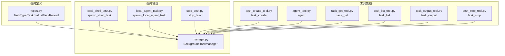
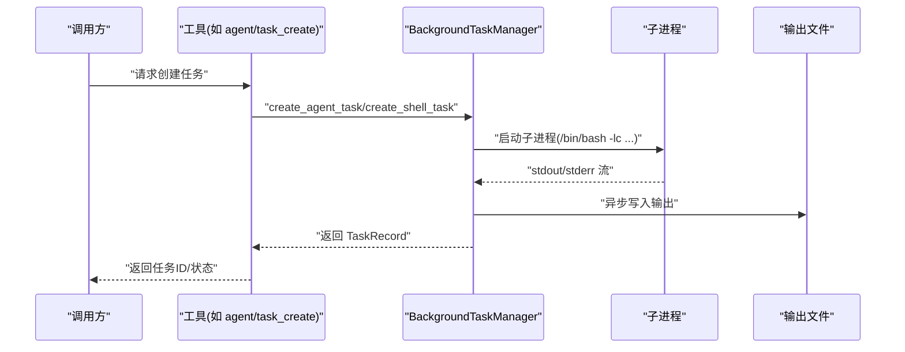
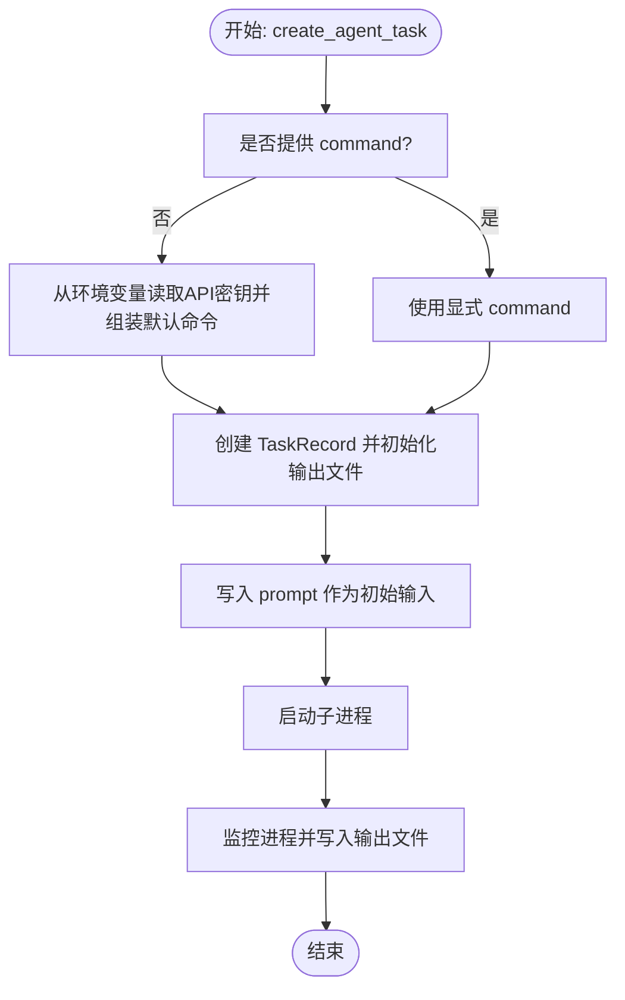
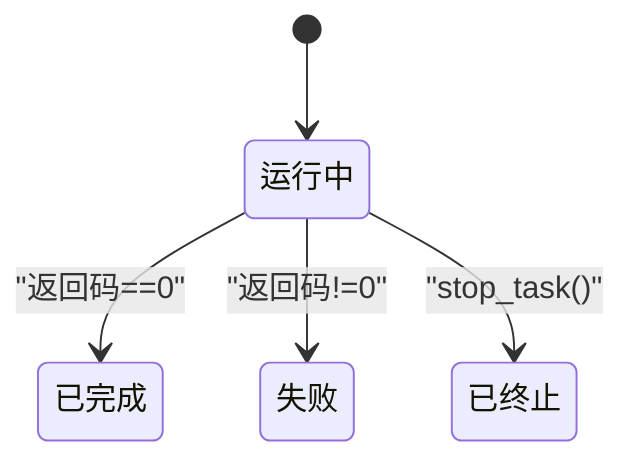
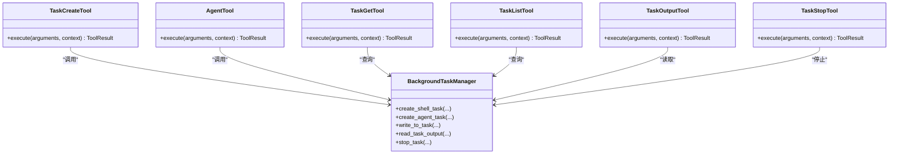
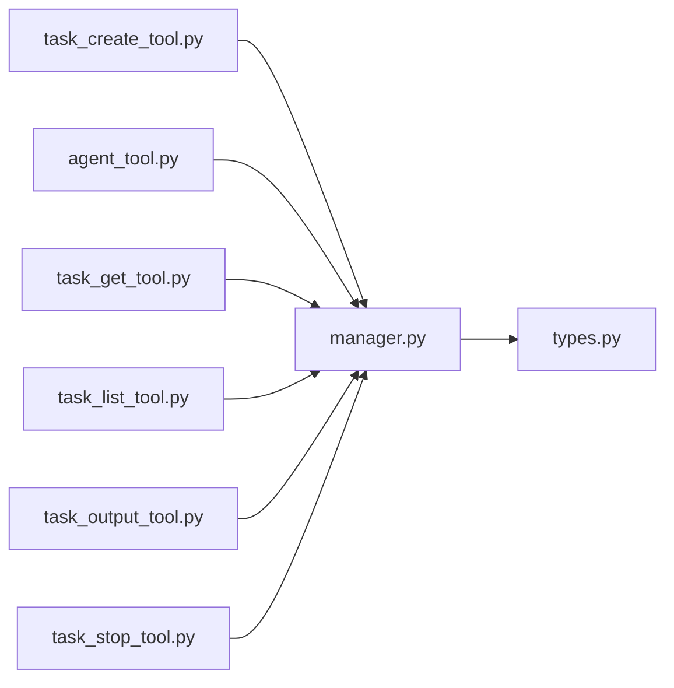

# 任务类型与实现

<cite>
**本文引用的文件**
- [src/openharness/tasks/__init__.py](file://src/openharness/tasks/__init__.py)
- [src/openharness/tasks/types.py](file://src/openharness/tasks/types.py)
- [src/openharness/tasks/manager.py](file://src/openharness/tasks/manager.py)
- [src/openharness/tasks/local_agent_task.py](file://src/openharness/tasks/local_agent_task.py)
- [src/openharness/tasks/local_shell_task.py](file://src/openharness/tasks/local_shell_task.py)
- [src/openharness/tasks/stop_task.py](file://src/openharness/tasks/stop_task.py)
- [src/openharness/tools/task_create_tool.py](file://src/openharness/tools/task_create_tool.py)
- [src/openharness/tools/task_get_tool.py](file://src/openharness/tools/task_get_tool.py)
- [src/openharness/tools/task_list_tool.py](file://src/openharness/tools/task_list_tool.py)
- [src/openharness/tools/task_output_tool.py](file://src/openharness/tools/task_output_tool.py)
- [src/openharness/tools/task_stop_tool.py](file://src/openharness/tools/task_stop_tool.py)
- [src/openharness/tools/agent_tool.py](file://src/openharness/tools/agent_tool.py)
- [src/openharness/cli.py](file://src/openharness/cli.py)
</cite>

## 目录
1. [简介](#简介)
2. [项目结构](#项目结构)
3. [核心组件](#核心组件)
4. [架构总览](#架构总览)
5. [详细组件分析](#详细组件分析)
6. [依赖分析](#依赖分析)
7. [性能考虑](#性能考虑)
8. [故障排查指南](#故障排查指南)
9. [结论](#结论)
10. [附录：实际使用与最佳实践](#附录实际使用与最佳实践)

## 简介
本文件系统性梳理 OpenHarness 的“任务类型与实现”，覆盖以下内容：
- 支持的任务类型：本地 Shell 任务（local_bash）、本地代理任务（local_agent）、远程代理任务（remote_agent）、进程内队友任务（in_process_teammate）。
- 每类任务的创建方式、关键配置参数、执行环境与行为差异。
- 本地代理任务的特殊处理机制：API 密钥来源、命令行参数传递、代理模式切换。
- 任务类型的扩展机制与新增方式。
- 与工具系统的集成关系及典型调用路径。
- 实际使用示例与最佳实践。

## 项目结构
任务系统由“任务定义 + 任务管理器 + 工具封装”三层组成：
- 任务定义层：统一的数据模型与类型约束。
- 任务管理层：负责生命周期管理、子进程启动、输入输出读写、状态更新与重启。
- 工具封装层：面向外部的可调用工具接口，便于在工作流中创建、查询、停止任务。

图表来源
- [src/openharness/tasks/types.py:10-31](file://src/openharness/tasks/types.py#L10-L31)
- [src/openharness/tasks/manager.py:18-281](file://src/openharness/tasks/manager.py#L18-L281)
- [src/openharness/tasks/local_shell_task.py:11-18](file://src/openharness/tasks/local_shell_task.py#L11-L18)
- [src/openharness/tasks/local_agent_task.py:11-29](file://src/openharness/tasks/local_agent_task.py#L11-L29)
- [src/openharness/tasks/stop_task.py:9-12](file://src/openharness/tasks/stop_task.py#L9-L12)
- [src/openharness/tools/task_create_tool.py:23-57](file://src/openharness/tools/task_create_tool.py#L23-L57)
- [src/openharness/tools/agent_tool.py:28-56](file://src/openharness/tools/agent_tool.py#L28-L56)
- [src/openharness/tools/task_get_tool.py:17-34](file://src/openharness/tools/task_get_tool.py#L17-L34)
- [src/openharness/tools/task_list_tool.py:17-36](file://src/openharness/tools/task_list_tool.py#L17-L36)
- [src/openharness/tools/task_output_tool.py:18-36](file://src/openharness/tools/task_output_tool.py#L18-L36)
- [src/openharness/tools/task_stop_tool.py:17-31](file://src/openharness/tools/task_stop_tool.py#L17-L31)

章节来源
- [src/openharness/tasks/__init__.py:1-19](file://src/openharness/tasks/__init__.py#L1-L19)
- [src/openharness/tasks/types.py:10-31](file://src/openharness/tasks/types.py#L10-L31)
- [src/openharness/tasks/manager.py:18-281](file://src/openharness/tasks/manager.py#L18-L281)

## 核心组件
- 任务类型与状态
  - 类型枚举：local_bash、local_agent、remote_agent、in_process_teammate。
  - 状态枚举：pending、running、completed、failed、killed。
- 任务记录 TaskRecord
  - 关键字段：id、type、status、description、cwd、output_file、command/prompt、时间戳、返回码、metadata。
- 任务管理器 BackgroundTaskManager
  - 负责创建 shell 任务、创建 agent 任务、写入任务输入、读取输出、停止任务、进程监控与自动重启。
- 任务工具
  - task_create、agent、task_get、task_list、task_output、task_stop 等工具，提供对外可调用能力。

章节来源
- [src/openharness/tasks/types.py:10-31](file://src/openharness/tasks/types.py#L10-L31)
- [src/openharness/tasks/manager.py:18-281](file://src/openharness/tasks/manager.py#L18-L281)
- [src/openharness/tools/task_create_tool.py:13-57](file://src/openharness/tools/task_create_tool.py#L13-L57)
- [src/openharness/tools/agent_tool.py:14-56](file://src/openharness/tools/agent_tool.py#L14-L56)

## 架构总览
任务系统围绕“类型 + 记录 + 管理器 + 工具”的分层设计展开，形成清晰的职责边界与调用链路。

图表来源
- [src/openharness/tools/agent_tool.py:35-55](file://src/openharness/tools/agent_tool.py#L35-L55)
- [src/openharness/tools/task_create_tool.py:30-56](file://src/openharness/tools/task_create_tool.py#L30-L56)
- [src/openharness/tasks/manager.py:29-92](file://src/openharness/tasks/manager.py#L29-L92)
- [src/openharness/tasks/manager.py:209-229](file://src/openharness/tasks/manager.py#L209-L229)

## 详细组件分析

### 任务类型与创建方式
- local_bash
  - 创建入口：通过工具 task_create 或直接调用 spawn_shell_task。
  - 关键参数：command、description、cwd。
  - 执行环境：在当前工作目录下以交互式 shell 启动，标准输出/错误合并到任务日志文件。
- local_agent
  - 创建入口：工具 agent 或直接调用 spawn_local_agent_task。
  - 关键参数：prompt、description、cwd、model、api_key、command。
  - 特殊处理：若未显式提供 command，则从环境变量读取 API 密钥并拼装默认命令；支持向任务写入 prompt 作为初始输入。
- remote_agent
  - 创建入口：工具 agent（mode=remote_agent）或直接调用 manager.create_agent_task(task_type="remote_agent")。
  - 行为特征：与 local_agent 共享同一创建流程，但通过 task_type 区分模式；内部会将 agent_mode 写入 metadata。
- in_process_teammate
  - 创建入口：工具 agent（mode=in_process_teammate）或直接调用 manager.create_agent_task(task_type="in_process_teammate")。
  - 行为特征：同样共享创建流程，通过 task_type 与 metadata["agent_mode"] 标记模式。

章节来源
- [src/openharness/tasks/local_shell_task.py:11-18](file://src/openharness/tasks/local_shell_task.py#L11-L18)
- [src/openharness/tasks/local_agent_task.py:11-29](file://src/openharness/tasks/local_agent_task.py#L11-L29)
- [src/openharness/tools/task_create_tool.py:30-56](file://src/openharness/tools/task_create_tool.py#L30-L56)
- [src/openharness/tools/agent_tool.py:35-55](file://src/openharness/tools/agent_tool.py#L35-L55)
- [src/openharness/tasks/manager.py:58-92](file://src/openharness/tasks/manager.py#L58-L92)

### 本地代理任务的特殊处理机制
- API 密钥管理
  - 若未显式传入 api_key，将尝试从环境变量读取；若仍为空则抛出异常，要求显式提供或设置环境变量。
- 命令行参数传递
  - 可通过 command 参数完全自定义启动命令；否则根据 model 等参数生成默认命令片段。
- 代理模式切换
  - 通过 task_type 与 metadata["agent_mode"] 标识不同模式；remote_agent 与 in_process_teammate 在内部以相同流程启动，但会写入 agent_mode 以便后续识别。
- 输入写入与自动重启
  - 对于接受输入的任务（local_agent/remote_agent/in_process_teammate），写入时会确保可写进程存在；若因进程退出导致管道断开，将自动重启并重试写入。

图表来源
- [src/openharness/tasks/manager.py:58-92](file://src/openharness/tasks/manager.py#L58-L92)
- [src/openharness/tasks/manager.py:209-229](file://src/openharness/tasks/manager.py#L209-L229)
- [src/openharness/tasks/manager.py:147-161](file://src/openharness/tasks/manager.py#L147-L161)

章节来源
- [src/openharness/tasks/manager.py:58-92](file://src/openharness/tasks/manager.py#L58-L92)
- [src/openharness/tasks/manager.py:147-161](file://src/openharness/tasks/manager.py#L147-L161)
- [src/openharness/tasks/manager.py:231-256](file://src/openharness/tasks/manager.py#L231-L256)

### 进程内队友任务与远程代理任务
- 进程内队友任务（in_process_teammate）
  - 通过 agent 工具以 mode=in_process_teammate 调用，内部以相同流程创建，但标记 agent_mode。
- 远程代理任务（remote_agent）
  - 通过 agent 工具以 mode=remote_agent 调用，内部以相同流程创建，但标记 agent_mode。
- 两者均依赖 manager 的通用 agent 创建逻辑与输入/输出处理。

章节来源
- [src/openharness/tools/agent_tool.py:35-55](file://src/openharness/tools/agent_tool.py#L35-L55)
- [src/openharness/tasks/manager.py:88-92](file://src/openharness/tasks/manager.py#L88-L92)

### 任务生命周期与状态流转
- 生命周期阶段：创建 → 启动 → 运行 → 完成/失败/终止。
- 状态更新：进程退出后根据返回码更新为 completed 或 failed；手动停止更新为 killed。
- 输出读取：支持按字节上限读取尾部输出，避免一次性读取过大文件。

图表来源
- [src/openharness/tasks/manager.py:170-191](file://src/openharness/tasks/manager.py#L170-L191)
- [src/openharness/tasks/stop_task.py:9-12](file://src/openharness/tasks/stop_task.py#L9-L12)

章节来源
- [src/openharness/tasks/manager.py:170-191](file://src/openharness/tasks/manager.py#L170-L191)
- [src/openharness/tasks/manager.py:127-146](file://src/openharness/tasks/manager.py#L127-L146)

### 任务工具与工具系统集成
- task_create
  - 支持类型：local_bash、local_agent。
  - 校验：local_bash 需要 command；local_agent 需要 prompt；不支持的类型返回错误。
- agent
  - 支持模式：local_agent、remote_agent、in_process_teammate。
  - 可选参数：model、command、team（加入团队注册表）。
- task_get/task_list/task_output/task_stop
  - 提供只读查询、列表过滤、输出读取、停止任务等能力。

图表来源
- [src/openharness/tools/task_create_tool.py:23-57](file://src/openharness/tools/task_create_tool.py#L23-L57)
- [src/openharness/tools/agent_tool.py:28-56](file://src/openharness/tools/agent_tool.py#L28-L56)
- [src/openharness/tools/task_get_tool.py:17-34](file://src/openharness/tools/task_get_tool.py#L17-L34)
- [src/openharness/tools/task_list_tool.py:17-36](file://src/openharness/tools/task_list_tool.py#L17-L36)
- [src/openharness/tools/task_output_tool.py:18-36](file://src/openharness/tools/task_output_tool.py#L18-L36)
- [src/openharness/tools/task_stop_tool.py:17-31](file://src/openharness/tools/task_stop_tool.py#L17-L31)
- [src/openharness/tasks/manager.py:29-146](file://src/openharness/tasks/manager.py#L29-L146)

章节来源
- [src/openharness/tools/task_create_tool.py:23-57](file://src/openharness/tools/task_create_tool.py#L23-L57)
- [src/openharness/tools/agent_tool.py:28-56](file://src/openharness/tools/agent_tool.py#L28-L56)
- [src/openharness/tools/task_get_tool.py:17-34](file://src/openharness/tools/task_get_tool.py#L17-L34)
- [src/openharness/tools/task_list_tool.py:17-36](file://src/openharness/tools/task_list_tool.py#L17-L36)
- [src/openharness/tools/task_output_tool.py:18-36](file://src/openharness/tools/task_output_tool.py#L18-L36)
- [src/openharness/tools/task_stop_tool.py:17-31](file://src/openharness/tools/task_stop_tool.py#L17-L31)

### 任务扩展机制
- 新增任务类型步骤
  1. 在类型定义中增加新类型值（例如在 TaskType 中添加新字符串字面量）。
  2. 在工具层（如 task_create_tool、agent_tool）中扩展对新类型的判断与参数校验。
  3. 在 manager 层根据需要扩展创建逻辑（如是否需要特定的命令拼装或输入处理）。
  4. 如需 UI 或状态展示，补充相应元数据字段并在工具层暴露。
- 注意事项
  - 保持 TaskRecord 字段与工具输入一致。
  - 对于需要输入的任务，确保 write_to_task 与自动重启逻辑兼容。
  - 为新类型选择合适的任务 ID 前缀（参考 _task_id 映射）。

章节来源
- [src/openharness/tasks/types.py:10-11](file://src/openharness/tasks/types.py#L10-L11)
- [src/openharness/tasks/manager.py:273-280](file://src/openharness/tasks/manager.py#L273-L280)

## 依赖分析
- 组件耦合
  - 工具层仅依赖 manager 的公共接口，降低耦合度。
  - manager 依赖配置路径模块以确定任务日志目录，保证运行时隔离。
- 外部依赖
  - 子进程管理依赖 asyncio.subprocess。
  - CLI 提供认证与 MCP 等子命令，与任务系统解耦。

图表来源
- [src/openharness/tools/task_create_tool.py:9-56](file://src/openharness/tools/task_create_tool.py#L9-L56)
- [src/openharness/tools/agent_tool.py:9-55](file://src/openharness/tools/agent_tool.py#L9-L55)
- [src/openharness/tools/task_get_tool.py:7-33](file://src/openharness/tools/task_get_tool.py#L7-L33)
- [src/openharness/tools/task_list_tool.py:7-35](file://src/openharness/tools/task_list_tool.py#L7-L35)
- [src/openharness/tools/task_output_tool.py:7-35](file://src/openharness/tools/task_output_tool.py#L7-L35)
- [src/openharness/tools/task_stop_tool.py:6-30](file://src/openharness/tools/task_stop_tool.py#L6-L30)
- [src/openharness/tasks/manager.py:14-15](file://src/openharness/tasks/manager.py#L14-L15)
- [src/openharness/tasks/types.py:3-7](file://src/openharness/tasks/types.py#L3-L7)

章节来源
- [src/openharness/tasks/manager.py:14-15](file://src/openharness/tasks/manager.py#L14-L15)
- [src/openharness/tasks/types.py:3-7](file://src/openharness/tasks/types.py#L3-L7)

## 性能考虑
- 输出读取限制：默认最大读取字节数，避免一次性加载过大数据。
- 异步输出复制：使用异步读取与写入锁，减少阻塞。
- 进程重启计数：记录重启次数，便于诊断与限流。
- 任务 ID 前缀：便于按类型快速筛选与统计。

章节来源
- [src/openharness/tasks/manager.py:162-168](file://src/openharness/tasks/manager.py#L162-L168)
- [src/openharness/tasks/manager.py:250-251](file://src/openharness/tasks/manager.py#L250-L251)
- [src/openharness/tasks/manager.py:273-280](file://src/openharness/tasks/manager.py#L273-L280)

## 故障排查指南
- “任务不接受输入”
  - 触发条件：对非 agent 类型写入输入。
  - 解决建议：确认任务类型为 local_agent/remote_agent/in_process_teammate。
- “无法找到任务”
  - 触发条件：查询/停止/读取不存在的任务 ID。
  - 解决建议：检查任务 ID 是否正确，或先列出任务确认状态。
- “API 密钥缺失”
  - 触发条件：local_agent 未提供 command 且未设置 API 密钥。
  - 解决建议：设置环境变量或显式传入 api_key/command。
- “进程退出导致写入失败”
  - 触发条件：管道断开。
  - 解决建议：系统会自动重启并重试；如频繁发生，检查命令稳定性与资源限制。

章节来源
- [src/openharness/tasks/manager.py:156-161](file://src/openharness/tasks/manager.py#L156-L161)
- [src/openharness/tasks/manager.py:203-207](file://src/openharness/tasks/manager.py#L203-L207)
- [src/openharness/tasks/manager.py:70-79](file://src/openharness/tasks/manager.py#L70-L79)
- [src/openharness/tasks/manager.py:156-161](file://src/openharness/tasks/manager.py#L156-L161)

## 结论
OpenHarness 的任务系统以类型化数据模型为基础，通过统一的管理器实现跨类型的一致生命周期与 I/O 处理，并以工具层提供易用的调用接口。本地代理任务具备完善的 API 密钥与命令拼装机制，同时支持多种代理模式；系统还提供了便捷的扩展点，便于新增任务类型。整体设计兼顾了可用性、可观测性与可维护性。

## 附录：实际使用与最佳实践
- 使用工具创建任务
  - 本地 Shell 任务：通过 task_create 指定 type=local_bash 与 command。
  - 本地代理任务：通过 task_create 指定 type=local_agent 与 prompt；或通过 agent 工具指定 mode=local_agent。
- 读取任务输出
  - 使用 task_output 工具，合理设置 max_bytes。
- 列表与查询
  - 使用 task_list 过滤状态；使用 task_get 获取详情。
- 停止任务
  - 使用 task_stop 工具安全终止运行中的任务。
- 最佳实践
  - 为每个任务提供清晰的 description，便于协作与审计。
  - 对于需要持续交互的任务，优先使用 agent 模式并关注重启次数。
  - 将敏感信息（如 API 密钥）通过环境变量注入，避免硬编码。
  - 在 CI/CD 场景中，结合 task_list 与 task_output 实现自动化观测。

章节来源
- [src/openharness/tools/task_create_tool.py:30-56](file://src/openharness/tools/task_create_tool.py#L30-L56)
- [src/openharness/tools/agent_tool.py:35-55](file://src/openharness/tools/agent_tool.py#L35-L55)
- [src/openharness/tools/task_output_tool.py:29-35](file://src/openharness/tools/task_output_tool.py#L29-L35)
- [src/openharness/tools/task_list_tool.py:28-35](file://src/openharness/tools/task_list_tool.py#L28-L35)
- [src/openharness/tools/task_get_tool.py:28-33](file://src/openharness/tools/task_get_tool.py#L28-L33)
- [src/openharness/tools/task_stop_tool.py:24-30](file://src/openharness/tools/task_stop_tool.py#L24-L30)