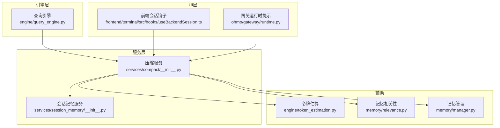
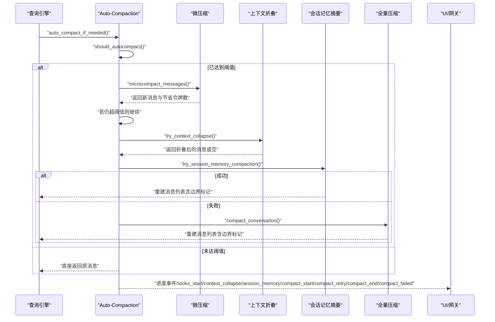
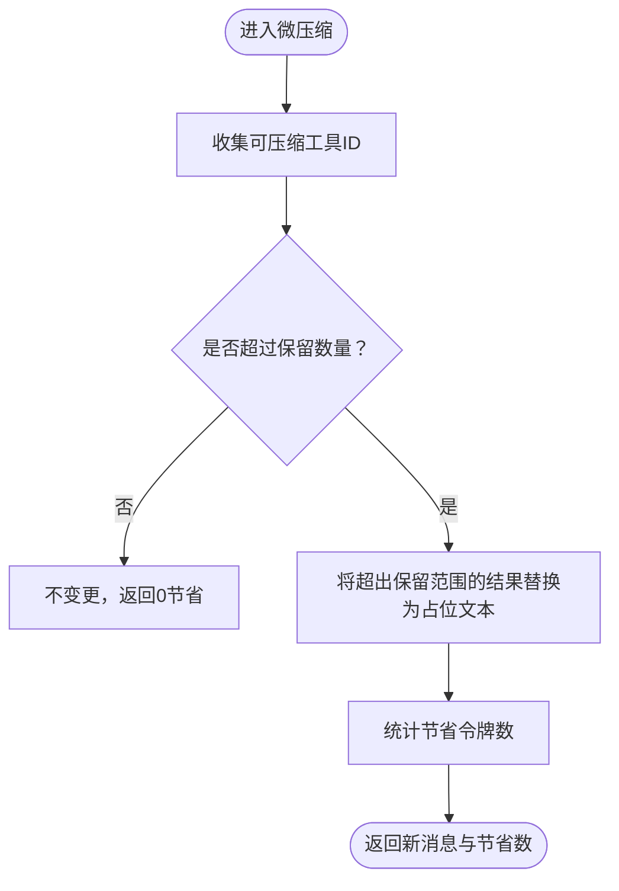
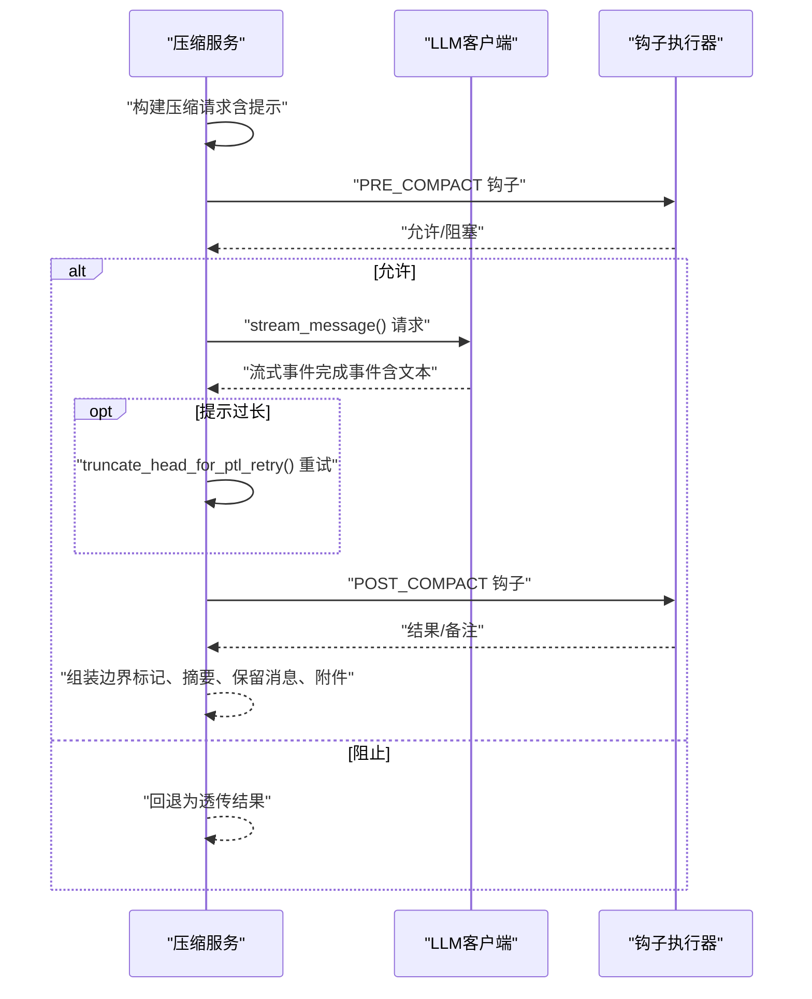
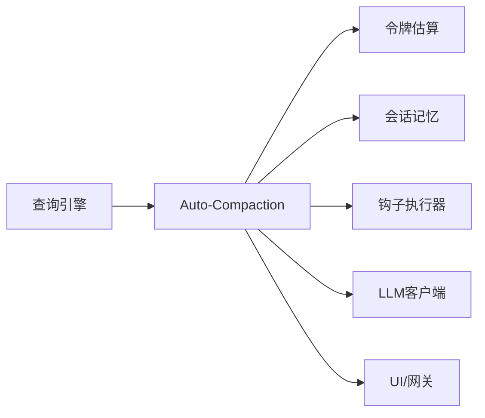

# 上下文压缩与 Auto-Compaction

<cite>
**本文引用的文件**
- [src/openharness/services/compact/__init__.py](file://src/openharness/services/compact/__init__.py)
- [src/openharness/services/session_memory/__init__.py](file://src/openharness/services/session_memory/__init__.py)
- [src/openharness/engine/query_engine.py](file://src/openharness/engine/query_engine.py)
- [src/openharness/engine/token_estimation.py](file://src/openharness/engine/token_estimation.py)
- [src/openharness/memory/relevance.py](file://src/openharness/memory/relevance.py)
- [src/openharness/memory/manager.py](file://src/openharness/memory/manager.py)
- [tests/test_services/test_compact.py](file://tests/test_services/test_compact.py)
- [frontend/terminal/src/hooks/useBackendSession.ts](file://frontend/terminal/src/hooks/useBackendSession.ts)
- [ohmo/gateway/runtime.py](file://ohmo/gateway/runtime.py)
</cite>

## 目录
1. [简介](#简介)
2. [项目结构](#项目结构)
3. [核心组件](#核心组件)
4. [架构总览](#架构总览)
5. [详细组件分析](#详细组件分析)
6. [依赖关系分析](#依赖关系分析)
7. [性能考量](#性能考量)
8. [故障排查指南](#故障排查指南)
9. [结论](#结论)
10. [附录：配置与调优](#附录配置与调优)

## 简介
本文件系统化阐述 OpenHarness 中的“上下文压缩与 Auto-Compaction”机制，覆盖以下主题：
- 上下文窗口限制与阈值计算
- 智能截断与折叠算法（文本折叠、工具结果清理、会话记忆摘要）
- 相关性与内容选择策略（附件、工具发现、任务焦点等）
- Auto-Compaction 触发条件、执行时机与失败回退
- 压缩过程中的信息保留与丢失权衡
- 压缩参数配置与调优建议
- 压缩效果评估指标与监控方法
- 对对话质量与性能的影响

## 项目结构
围绕上下文压缩与自动压缩的核心代码位于服务模块，UI 层负责进度反馈，引擎层在查询循环中集成 Auto-Compaction。

图示来源
- [src/openharness/services/compact/__init__.py:1119-1475](file://src/openharness/services/compact/__init__.py#L1119-L1475)
- [src/openharness/services/session_memory/__init__.py:1-140](file://src/openharness/services/session_memory/__init__.py#L1-L140)
- [src/openharness/engine/query_engine.py:31-129](file://src/openharness/engine/query_engine.py#L31-L129)
- [frontend/terminal/src/hooks/useBackendSession.ts:263-287](file://frontend/terminal/src/hooks/useBackendSession.ts#L263-L287)
- [ohmo/gateway/runtime.py:945-981](file://ohmo/gateway/runtime.py#L945-L981)

章节来源
- [src/openharness/services/compact/__init__.py:1119-1475](file://src/openharness/services/compact/__init__.py#L1119-L1475)
- [src/openharness/services/session_memory/__init__.py:1-140](file://src/openharness/services/session_memory/__init__.py#L1-L140)
- [src/openharness/engine/query_engine.py:31-129](file://src/openharness/engine/query_engine.py#L31-L129)
- [frontend/terminal/src/hooks/useBackendSession.ts:263-287](file://frontend/terminal/src/hooks/useBackendSession.ts#L263-L287)
- [ohmo/gateway/runtime.py:945-981](file://ohmo/gateway/runtime.py#L945-L981)

## 核心组件
- 上下文估计与阈值
  - 令牌估算：基于字符长度的保守估算，并对图像令牌进行单独预算
  - 上下文窗口与阈值：根据模型族默认窗口、输出预留与缓冲计算触发阈值
- 微压缩（Microcompact）
  - 清理旧工具结果内容，仅保留最近若干条，快速降低令牌数
- 文本折叠（Context Collapse）
  - 对过长文本块进行头尾截断折叠，避免 LLM 输入过大
- 会话记忆摘要（Session Memory Compaction）
  - 将早期对话生成可插入的“会话记忆摘要”，减少后续全量压缩成本
- 全量压缩（Full Compaction）
  - 调用 LLM 生成结构化摘要，替换历史消息并注入边界标记与附件
- Auto-Compaction 集成
  - 在每次查询回合开始前检查是否需要压缩；支持强制触发、重试与失败计数
- 进度与监控
  - 通过进度事件与“检查点”记录压缩各阶段状态，便于 UI 反馈与审计

章节来源
- [src/openharness/services/compact/__init__.py:116-136](file://src/openharness/services/compact/__init__.py#L116-L136)
- [src/openharness/services/compact/__init__.py:1065-1112](file://src/openharness/services/compact/__init__.py#L1065-L1112)
- [src/openharness/services/compact/__init__.py:808-856](file://src/openharness/services/compact/__init__.py#L808-L856)
- [src/openharness/services/compact/__init__.py:302-343](file://src/openharness/services/compact/__init__.py#L302-L343)
- [src/openharness/services/compact/__init__.py:915-957](file://src/openharness/services/compact/__init__.py#L915-L957)
- [src/openharness/services/compact/__init__.py:1119-1475](file://src/openharness/services/compact/__init__.py#L1119-L1475)
- [src/openharness/services/compact/__init__.py:1482-1660](file://src/openharness/services/compact/__init__.py#L1482-L1660)

## 架构总览
Auto-Compaction 在查询循环中按顺序尝试多种廉价压缩策略，必要时再调用 LLM 执行全量压缩。整个流程具备重试、失败计数与进度上报能力。

图示来源
- [src/openharness/services/compact/__init__.py:1482-1660](file://src/openharness/services/compact/__init__.py#L1482-L1660)
- [src/openharness/services/compact/__init__.py:1119-1475](file://src/openharness/services/compact/__init__.py#L1119-L1475)
- [frontend/terminal/src/hooks/useBackendSession.ts:263-287](file://frontend/terminal/src/hooks/useBackendSession.ts#L263-L287)
- [ohmo/gateway/runtime.py:945-981](file://ohmo/gateway/runtime.py#L945-L981)

## 详细组件分析

### 上下文窗口与阈值计算
- 默认上下文窗口按模型族设定，保守默认为固定值
- 自动压缩阈值 = 上下文窗口 − 输出最大长度 − 缓冲
- 支持手动覆盖上下文窗口与阈值，便于不同环境与模型族适配

章节来源
- [src/openharness/services/compact/__init__.py:1065-1112](file://src/openharness/services/compact/__init__.py#L1065-L1112)
- [tests/test_services/test_compact.py:621-637](file://tests/test_services/test_compact.py#L621-L637)

### 令牌估算与图像预算
- 文本采用字符长度粗略估算
- 图像采用独立预算，可通过环境变量覆盖
- 估算包含保守倍率，确保留有余量

章节来源
- [src/openharness/services/compact/__init__.py:116-146](file://src/openharness/services/compact/__init__.py#L116-L146)
- [src/openharness/engine/token_estimation.py:6-10](file://src/openharness/engine/token_estimation.py#L6-L10)

### 微压缩（Microcompact）
- 识别可压缩工具结果（白名单工具与可判定的非白名单大结果）
- 保留最近若干条结果，其余替换为统一占位文本
- 返回节省的令牌数，用于快速降本

图示来源
- [src/openharness/services/compact/__init__.py:785-856](file://src/openharness/services/compact/__init__.py#L785-L856)
- [tests/test_services/test_compact.py:203-244](file://tests/test_services/test_compact.py#L203-L244)

章节来源
- [src/openharness/services/compact/__init__.py:785-856](file://src/openharness/services/compact/__init__.py#L785-L856)
- [tests/test_services/test_compact.py:203-244](file://tests/test_services/test_compact.py#L203-L244)

### 文本折叠（Context Collapse）
- 对过长文本与工具结果进行头尾截断折叠，保留关键边界
- 仅在确有变化且整体令牌数下降时才应用
- 保证不会破坏工具调用与结果的配对完整性

章节来源
- [src/openharness/services/compact/__init__.py:293-343](file://src/openharness/services/compact/__init__.py#L293-L343)
- [tests/test_services/test_compact.py:154-201](file://tests/test_services/test_compact.py#L154-L201)

### 会话记忆摘要（Session Memory Compaction）
- 将早期对话生成“会话记忆摘要”消息，插入到保留的近期消息之前
- 支持从持久化文件读取摘要，作为“文件会话记忆”
- 该路径无需 LLM，成本低，适合长会话的预处理

章节来源
- [src/openharness/services/compact/__init__.py:915-957](file://src/openharness/services/compact/__init__.py#L915-L957)
- [src/openharness/services/session_memory/__init__.py:77-120](file://src/openharness/services/session_memory/__init__.py#L77-L120)

### 全量压缩（Full Compaction）
- 构建结构化压缩提示，调用 LLM 生成摘要
- 对请求中的图像进行占位替换，避免浪费上下文
- 支持提示过长错误检测与重试（头部截断）
- 产出边界标记、摘要消息、保留的近期消息以及各类附件

图示来源
- [src/openharness/services/compact/__init__.py:1119-1475](file://src/openharness/services/compact/__init__.py#L1119-L1475)

章节来源
- [src/openharness/services/compact/__init__.py:1119-1475](file://src/openharness/services/compact/__init__.py#L1119-L1475)

### Auto-Compaction 触发与执行
- 触发条件：当前令牌数 ≥ 阈值，且连续失败次数未达上限
- 执行顺序：微压缩 → 上下文折叠 → 会话记忆摘要 → 全量压缩
- 失败处理：记录失败次数与检查点，必要时返回原消息
- 强制模式：忽略阈值直接执行压缩

章节来源
- [src/openharness/services/compact/__init__.py:1095-1112](file://src/openharness/services/compact/__init__.py#L1095-L1112)
- [src/openharness/services/compact/__init__.py:1482-1660](file://src/openharness/services/compact/__init__.py#L1482-L1660)
- [tests/test_services/test_compact.py:591-618](file://tests/test_services/test_compact.py#L591-L618)

### 相关性与内容选择策略
- 附件提取：从消息与图片源路径中抽取本地附件路径
- 工具发现：统计早期对话中出现的工具名，控制上限
- 任务焦点与工作日志：保留目标、近期目标、活动工件、已验证状态、下一步等
- 计划模式与异步代理状态：在压缩后仍保持权限与状态一致性
- 会话记忆文件：优先使用持久化摘要，否则动态生成

章节来源
- [src/openharness/services/compact/__init__.py:364-402](file://src/openharness/services/compact/__init__.py#L364-L402)
- [src/openharness/services/compact/__init__.py:518-733](file://src/openharness/services/compact/__init__.py#L518-L733)
- [src/openharness/services/compact/__init__.py:893-912](file://src/openharness/services/compact/__init__.py#L893-L912)
- [src/openharness/services/session_memory/__init__.py:77-120](file://src/openharness/services/session_memory/__init__.py#L77-L120)

### 信息保留与丢失权衡
- 保留近期消息与工具调用配对，确保连续性
- 折叠与清理以“节省令牌”为目标，但可能丢弃冗余细节
- 会话记忆摘要承载关键上下文，减少全量压缩压力
- 边界标记与附件帮助重建连续性与外部资产线索

章节来源
- [src/openharness/services/compact/__init__.py:458-468](file://src/openharness/services/compact/__init__.py#L458-L468)
- [src/openharness/services/compact/__init__.py:506-516](file://src/openharness/services/compact/__init__.py#L506-L516)

## 依赖关系分析
- 查询引擎在每轮对话开始调用 Auto-Compaction，决定是否压缩
- 压缩服务依赖令牌估算、会话记忆服务、钩子执行器与 LLM 客户端
- UI 通过进度事件实时反馈压缩状态

图示来源
- [src/openharness/engine/query_engine.py:31-129](file://src/openharness/engine/query_engine.py#L31-L129)
- [src/openharness/services/compact/__init__.py:1119-1475](file://src/openharness/services/compact/__init__.py#L1119-L1475)
- [frontend/terminal/src/hooks/useBackendSession.ts:263-287](file://frontend/terminal/src/hooks/useBackendSession.ts#L263-L287)
- [ohmo/gateway/runtime.py:945-981](file://ohmo/gateway/runtime.py#L945-L981)

章节来源
- [src/openharness/engine/query_engine.py:31-129](file://src/openharness/engine/query_engine.py#L31-L129)
- [src/openharness/services/compact/__init__.py:1119-1475](file://src/openharness/services/compact/__init__.py#L1119-L1475)
- [frontend/terminal/src/hooks/useBackendSession.ts:263-287](file://frontend/terminal/src/hooks/useBackendSession.ts#L263-L287)
- [ohmo/gateway/runtime.py:945-981](file://ohmo/gateway/runtime.py#L945-L981)

## 性能考量
- 令牌估算保守，避免实际溢出
- 微压缩与上下文折叠优先，大幅减少 LLM 调用频率
- 会话记忆摘要显著降低全量压缩成本
- 提示过长重试与超时保护，避免长时间阻塞
- 图像预算可调，平衡视觉输入的成本

章节来源
- [src/openharness/services/compact/__init__.py:116-146](file://src/openharness/services/compact/__init__.py#L116-L146)
- [src/openharness/services/compact/__init__.py:1283-1350](file://src/openharness/services/compact/__init__.py#L1283-L1350)

## 故障排查指南
- 提示过长错误识别：针对常见报错关键词进行匹配
- 超时与中断：设置超时时间与最大重试次数，必要时返回原消息
- 失败计数与检查点：记录失败次数与关键节点元数据，便于诊断
- UI 反馈：通过进度事件与网关提示语向用户说明压缩状态

章节来源
- [src/openharness/services/compact/__init__.py:249-270](file://src/openharness/services/compact/__init__.py#L249-L270)
- [src/openharness/services/compact/__init__.py:1283-1350](file://src/openharness/services/compact/__init__.py#L1283-L1350)
- [src/openharness/services/compact/__init__.py:187-212](file://src/openharness/services/compact/__init__.py#L187-L212)
- [frontend/terminal/src/hooks/useBackendSession.ts:263-287](file://frontend/terminal/src/hooks/useBackendSession.ts#L263-L287)
- [ohmo/gateway/runtime.py:945-981](file://ohmo/gateway/runtime.py#L945-L981)

## 结论
OpenHarness 的上下文压缩体系通过“微压缩 → 折叠 → 会话记忆 → 全量压缩”的分层策略，在保证对话连续性的前提下有效控制上下文大小。Auto-Compaction 将压缩无缝嵌入查询循环，结合进度事件与检查点，既提升了稳定性也增强了可观测性。合理配置阈值与预算，可在对话质量与性能之间取得良好平衡。

## 附录：配置与调优
- 关键常量与阈值
  - 自动压缩缓冲：用于安全余量
  - 输出最大长度：限制摘要长度
  - 最大连续失败次数：失败上限
  - 微压缩保留数量：默认保留最近若干条结果
  - 上下文折叠字符限制与头尾截断长度
  - 会话记忆最大行数与字符数
  - 最大附件与工具发现数量
  - 图像令牌预算（可通过环境变量覆盖）

- 配置入口
  - 上下文窗口与阈值：支持按模型族与自定义覆盖
  - 令牌估算：字符估算与图像预算
  - Auto-Compaction：在查询引擎初始化时传入阈值与窗口参数

- 调优建议
  - 长会话场景优先启用“会话记忆摘要”
  - 对视觉密集型任务适当提高图像预算
  - 根据模型上下文窗口与输出需求调整阈值与缓冲
  - 适度增加微压缩保留数量，减少误删重要结果
  - 使用进度事件与检查点持续监控压缩效果与失败趋势

章节来源
- [src/openharness/services/compact/__init__.py:54-81](file://src/openharness/services/compact/__init__.py#L54-L81)
- [src/openharness/services/compact/__init__.py:1065-1112](file://src/openharness/services/compact/__init__.py#L1065-L1112)
- [src/openharness/engine/query_engine.py:31-129](file://src/openharness/engine/query_engine.py#L31-L129)