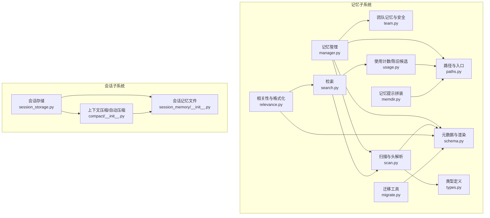
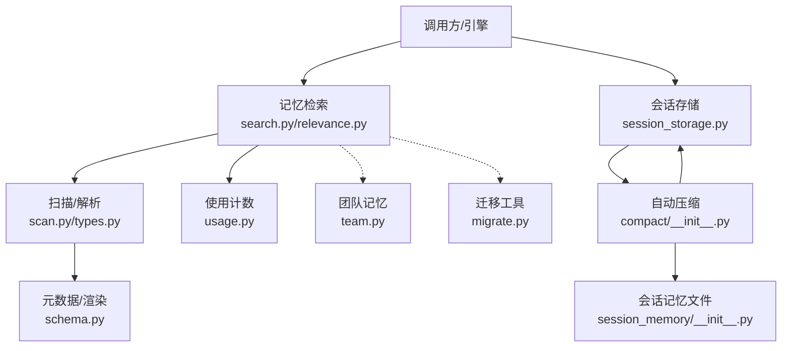
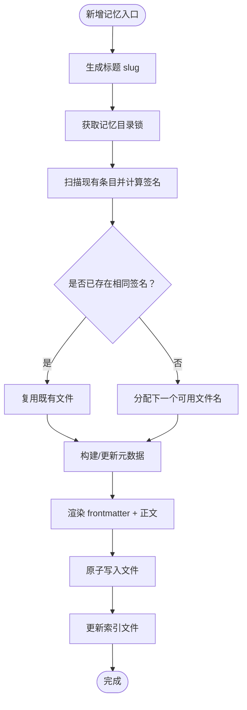
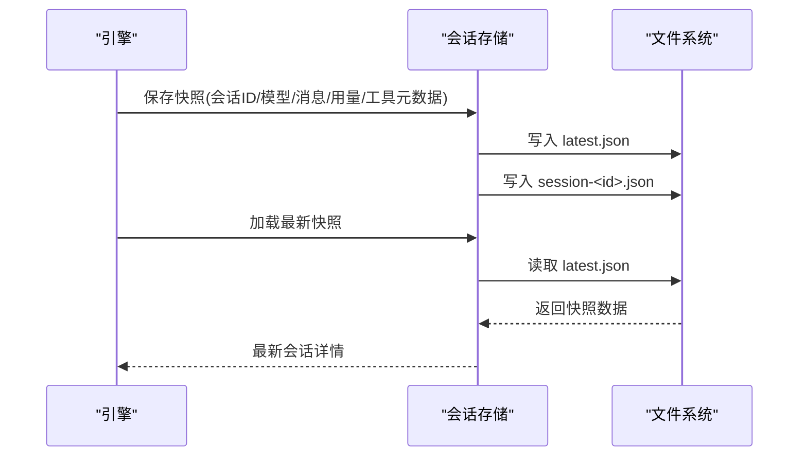
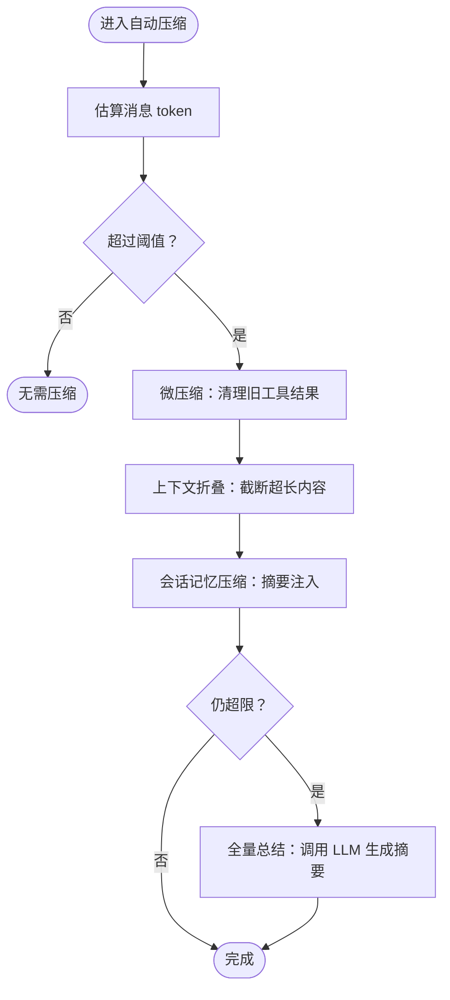
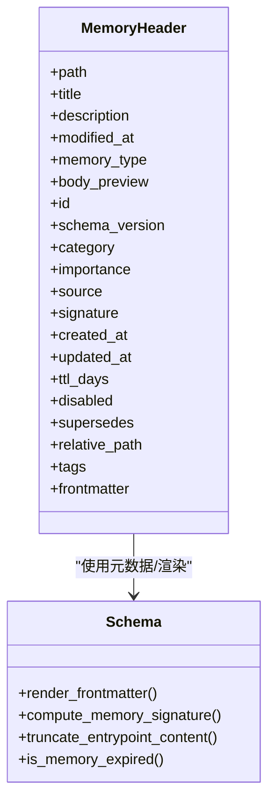
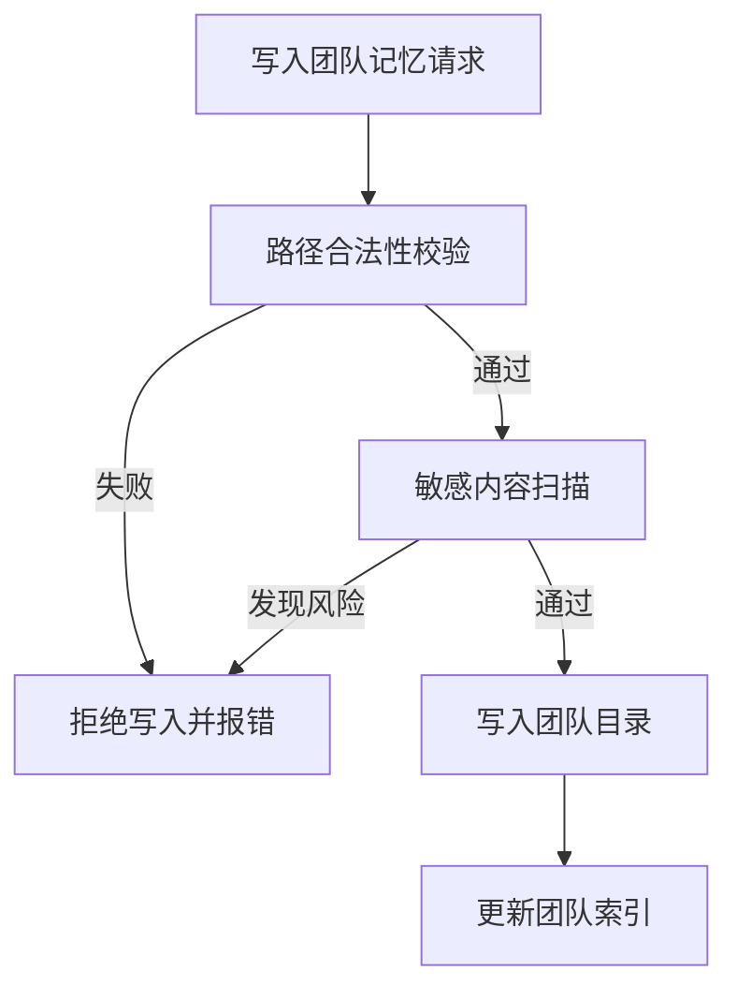
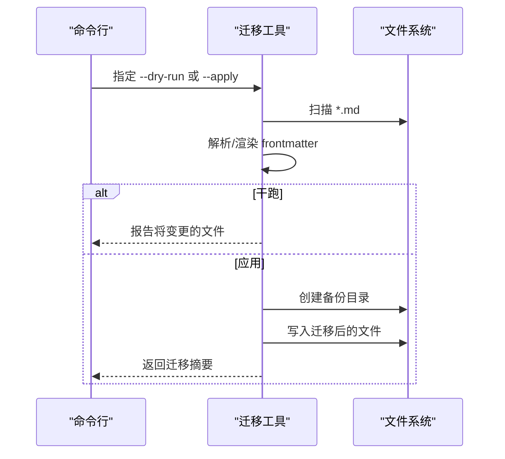
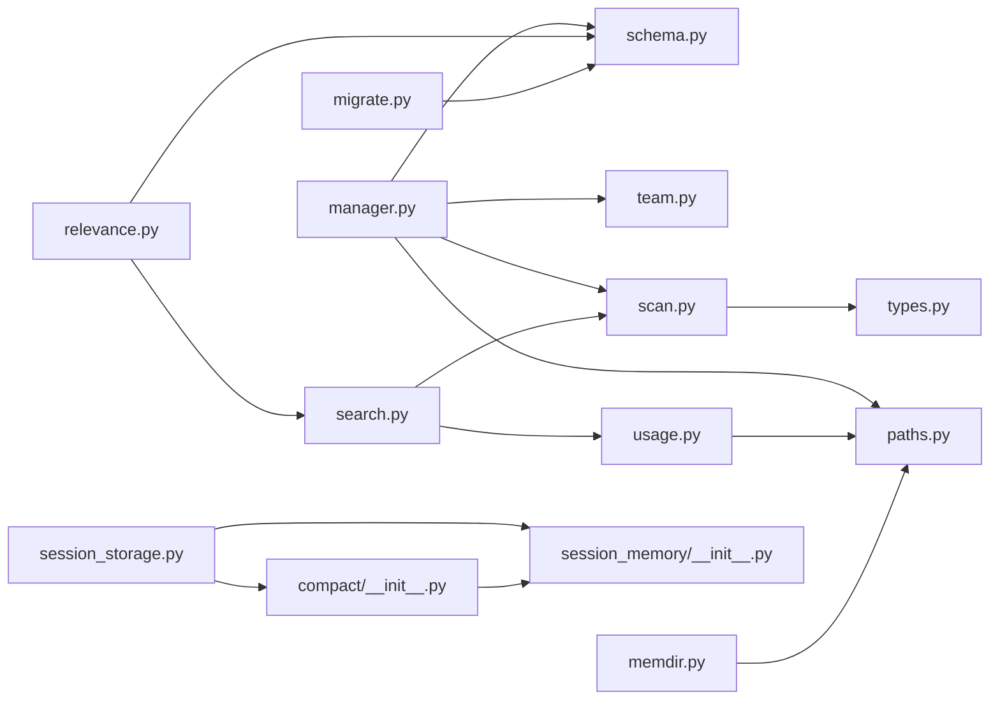

# 会话和记忆管理

<cite>
**本文引用的文件**
- [src/openharness/memory/manager.py](file://src/openharness/memory/manager.py)
- [src/openharness/memory/team.py](file://src/openharness/memory/team.py)
- [src/openharness/memory/schema.py](file://src/openharness/memory/schema.py)
- [src/openharness/memory/scan.py](file://src/openharness/memory/scan.py)
- [src/openharness/memory/types.py](file://src/openharness/memory/types.py)
- [src/openharness/memory/paths.py](file://src/openharness/memory/paths.py)
- [src/openharness/memory/relevance.py](file://src/openharness/memory/relevance.py)
- [src/openharness/memory/search.py](file://src/openharness/memory/search.py)
- [src/openharness/memory/usage.py](file://src/openharness/memory/usage.py)
- [src/openharness/memory/memdir.py](file://src/openharness/memory/memdir.py)
- [src/openharness/memory/migrate.py](file://src/openharness/memory/migrate.py)
- [scripts/migrate_memory.py](file://scripts/migrate_memory.py)
- [src/openharness/services/session_storage.py](file://src/openharness/services/session_storage.py)
- [src/openharness/services/compact/__init__.py](file://src/openharness/services/compact/__init__.py)
- [src/openharness/services/session_memory/__init__.py](file://src/openharness/services/session_memory/__init__.py)
</cite>

## 目录
1. [简介](#简介)
2. [项目结构](#项目结构)
3. [核心组件](#核心组件)
4. [架构总览](#架构总览)
5. [详细组件分析](#详细组件分析)
6. [依赖关系分析](#依赖关系分析)
7. [性能考量](#性能考量)
8. [故障排查指南](#故障排查指南)
9. [结论](#结论)
10. [附录](#附录)

## 简介
本文件系统性阐述 OpenHarness 的“会话与记忆”体系：包括记忆系统的架构与数据持久化、会话管理（创建、恢复、历史）、上下文压缩（Auto-Compaction）工作原理与配置项、记忆数据的组织与访问模式、团队记忆与跨会话知识共享、数据迁移与备份恢复，以及性能优化与存储管理最佳实践。目标是帮助开发者与使用者在不深入源码的前提下，也能高效地使用与扩展该能力。

## 项目结构
围绕“会话与记忆”的核心目录与文件如下：
- 记忆子系统
  - 存储路径与入口：[src/openharness/memory/paths.py](file://src/openharness/memory/paths.py)
  - 记忆文件扫描与头信息解析：[src/openharness/memory/scan.py](file://src/openharness/memory/scan.py)，[src/openharness/memory/types.py](file://src/openharness/memory/types.py)
  - 记忆增删改与索引维护：[src/openharness/memory/manager.py](file://src/openharness/memory/manager.py)
  - 团队记忆与安全校验：[src/openharness/memory/team.py](file://src/openharness/memory/team.py)
  - 元数据与渲染：[src/openharness/memory/schema.py](file://src/openharness/memory/schema.py)
  - 相关性检索与提示格式化：[src/openharness/memory/search.py](file://src/openharness/memory/search.py)，[src/openharness/memory/relevance.py](file://src/openharness/memory/relevance.py)
  - 使用计数与陈旧候选：[src/openharness/memory/usage.py](file://src/openharness/memory/usage.py)
  - 记忆提示拼装：[src/openharness/memory/memdir.py](file://src/openharness/memory/memdir.py)
  - 迁移工具：[src/openharness/memory/migrate.py](file://src/openharness/memory/migrate.py)，[scripts/migrate_memory.py](file://scripts/migrate_memory.py)
- 会话子系统
  - 会话持久化与历史列表：[src/openharness/services/session_storage.py](file://src/openharness/services/session_storage.py)
  - 会话记忆（文件式）：[src/openharness/services/session_memory/__init__.py](file://src/openharness/services/session_memory/__init__.py)
  - 上下文压缩与自动压缩：[src/openharness/services/compact/__init__.py](file://src/openharness/services/compact/__init__.py)

图表来源
- [src/openharness/memory/manager.py:1-184](file://src/openharness/memory/manager.py#L1-L184)
- [src/openharness/memory/team.py:1-91](file://src/openharness/memory/team.py#L1-L91)
- [src/openharness/memory/scan.py:1-117](file://src/openharness/memory/scan.py#L1-L117)
- [src/openharness/memory/types.py:1-34](file://src/openharness/memory/types.py#L1-L34)
- [src/openharness/memory/paths.py:1-23](file://src/openharness/memory/paths.py#L1-L23)
- [src/openharness/memory/schema.py:1-444](file://src/openharness/memory/schema.py#L1-L444)
- [src/openharness/memory/search.py:1-72](file://src/openharness/memory/search.py#L1-L72)
- [src/openharness/memory/relevance.py:1-146](file://src/openharness/memory/relevance.py#L1-L146)
- [src/openharness/memory/usage.py:1-154](file://src/openharness/memory/usage.py#L1-L154)
- [src/openharness/memory/memdir.py:1-53](file://src/openharness/memory/memdir.py#L1-L53)
- [src/openharness/memory/migrate.py:1-138](file://src/openharness/memory/migrate.py#L1-L138)
- [src/openharness/services/session_storage.py:1-231](file://src/openharness/services/session_storage.py#L1-L231)
- [src/openharness/services/session_memory/__init__.py:1-140](file://src/openharness/services/session_memory/__init__.py#L1-L140)
- [src/openharness/services/compact/__init__.py:1-200](file://src/openharness/services/compact/__init__.py#L1-L200)

章节来源
- [src/openharness/memory/manager.py:1-184](file://src/openharness/memory/manager.py#L1-L184)
- [src/openharness/services/session_storage.py:1-231](file://src/openharness/services/session_storage.py#L1-L231)

## 核心组件
- 记忆管理器：负责记忆条目的创建、更新、软删除、去重、索引同步与锁保护。
- 记忆扫描器：遍历项目记忆目录，解析头部元数据，过滤禁用/过期条目，并按时间排序。
- 元数据与渲染：统一的 frontmatter 结构、字段标准化、时间格式化、签名计算、渲染与拆分。
- 相关性检索：基于词元匹配、重要度、使用计数、时效性加权的启发式检索。
- 使用计数与陈旧候选：记录召回次数与最近使用时间，识别长期未用的记忆条目。
- 团队记忆：隔离的共享目录、写入路径校验、敏感内容扫描与拦截。
- 会话存储：以 JSON 持久化对话快照，支持“最新”与按 ID 两种保存方式，提供历史列表与导出。
- 会话记忆文件：将近期状态与对话摘要写入 Markdown 文件，供压缩后跨边界复用。
- 自动压缩：在消息过多时触发微压缩与全量总结，结合会话记忆文件进行确定性压缩。

章节来源
- [src/openharness/memory/manager.py:34-121](file://src/openharness/memory/manager.py#L34-L121)
- [src/openharness/memory/scan.py:20-47](file://src/openharness/memory/scan.py#L20-L47)
- [src/openharness/memory/schema.py:326-367](file://src/openharness/memory/schema.py#L326-L367)
- [src/openharness/memory/search.py:15-50](file://src/openharness/memory/search.py#L15-L50)
- [src/openharness/memory/usage.py:67-104](file://src/openharness/memory/usage.py#L67-L104)
- [src/openharness/memory/team.py:34-91](file://src/openharness/memory/team.py#L34-L91)
- [src/openharness/services/session_storage.py:63-107](file://src/openharness/services/session_storage.py#L63-L107)
- [src/openharness/services/session_memory/__init__.py:62-108](file://src/openharness/services/session_memory/__init__.py#L62-L108)
- [src/openharness/services/compact/__init__.py:116-136](file://src/openharness/services/compact/__init__.py#L116-L136)

## 架构总览
OpenHarness 将“记忆”与“会话”解耦但协同：
- 记忆系统以项目为单位，持久化于独立的数据目录，采用 Markdown + YAML frontmatter 的结构化存储；通过索引文件（MEMORY.md）进行导航。
- 会话系统以项目为单位，持久化对话快照与会话记忆文件，支持历史回放与导出。
- 压缩系统在会话流中自动裁剪上下文，优先使用会话记忆文件，必要时再进行 LLM 总结，确保模型输入在上下文窗口内。

图表来源
- [src/openharness/memory/search.py:15-50](file://src/openharness/memory/search.py#L15-L50)
- [src/openharness/memory/relevance.py:44-85](file://src/openharness/memory/relevance.py#L44-L85)
- [src/openharness/memory/scan.py:20-47](file://src/openharness/memory/scan.py#L20-L47)
- [src/openharness/memory/schema.py:234-261](file://src/openharness/memory/schema.py#L234-L261)
- [src/openharness/memory/usage.py:67-104](file://src/openharness/memory/usage.py#L67-L104)
- [src/openharness/services/session_storage.py:63-107](file://src/openharness/services/session_storage.py#L63-L107)
- [src/openharness/services/compact/__init__.py:1584-1623](file://src/openharness/services/compact/__init__.py#L1584-L1623)
- [src/openharness/services/session_memory/__init__.py:62-108](file://src/openharness/services/session_memory/__init__.py#L62-L108)
- [src/openharness/memory/team.py:34-91](file://src/openharness/memory/team.py#L34-L91)
- [src/openharness/memory/migrate.py:38-93](file://src/openharness/memory/migrate.py#L38-L93)

## 详细组件分析

### 记忆系统：架构与数据持久化
- 存储位置与入口
  - 每个项目拥有独立的记忆根目录，由项目路径哈希生成稳定子目录，避免多项目冲突。
  - 入口文件为 MEMORY.md，作为索引与策略展示。
- 文件结构与元数据
  - 每个记忆条目为一个 Markdown 文件，frontmatter 包含标准化字段（如 id、name、type、scope、category、importance、signature、created_at、updated_at、ttl_days、disabled、supersedes、tags 等），并以固定顺序渲染，保证可比较性。
  - 内容签名用于重复检测，结合 type 与 category，确保语义等价即视为重复。
- 增删改与索引
  - 新增：根据标题生成 slug，若存在同签名条目则复用；否则分配新文件名；更新索引文件（仅追加，避免覆盖）。
  - 软删除：标记 disabled 并更新 updated_at，同时从索引中移除对应条目。
  - 锁保护：写操作使用独占锁，避免并发写入导致损坏。
- 扫描与视图
  - 支持限制返回数量、包含禁用/过期条目、按修改时间倒序。
  - 头部信息包含预览文本，便于检索与选择。
- 相关性与格式化
  - 检索权重偏向 frontmatter 字段，其次为正文预览；综合重要度、使用计数、时效性加权。
  - 输出格式化时，附加“新鲜度”提示，提醒用户注意记忆时效。
- 使用计数与陈旧候选
  - 使用计数与最近使用时间记录在 usage_index.json 中，定期清理长期未用且低重要度的记忆。
- 团队记忆与安全
  - 团队目录独立，写入前进行路径校验，防止越权或符号链接逃逸。
  - 对潜在敏感内容（私钥、令牌、密钥等）进行规则扫描，阻止写入团队记忆。
- 提示拼装
  - 将 MEMORY.md 截断到合理大小，配合策略提示，形成稳定的记忆提示块。
- 迁移工具
  - 针对旧版无 frontmatter 的记忆文件进行回填，支持干跑与应用，并自动生成备份目录。

图表来源
- [src/openharness/memory/manager.py:39-121](file://src/openharness/memory/manager.py#L39-L121)
- [src/openharness/memory/schema.py:234-261](file://src/openharness/memory/schema.py#L234-L261)
- [src/openharness/memory/paths.py:11-22](file://src/openharness/memory/paths.py#L11-L22)

章节来源
- [src/openharness/memory/paths.py:11-22](file://src/openharness/memory/paths.py#L11-L22)
- [src/openharness/memory/schema.py:326-367](file://src/openharness/memory/schema.py#L326-L367)
- [src/openharness/memory/manager.py:39-121](file://src/openharness/memory/manager.py#L39-L121)
- [src/openharness/memory/scan.py:20-47](file://src/openharness/memory/scan.py#L20-L47)
- [src/openharness/memory/relevance.py:44-85](file://src/openharness/memory/relevance.py#L44-L85)
- [src/openharness/memory/usage.py:67-104](file://src/openharness/memory/usage.py#L67-L104)
- [src/openharness/memory/team.py:34-91](file://src/openharness/memory/team.py#L34-L91)
- [src/openharness/memory/memdir.py:15-52](file://src/openharness/memory/memdir.py#L15-L52)
- [src/openharness/memory/migrate.py:38-93](file://src/openharness/memory/migrate.py#L38-L93)

### 会话管理：创建、恢复与历史
- 会话快照
  - 保存“最新”与“按 ID”两类文件，便于快速恢复与命名归档。
  - 快照包含会话 ID、工作目录、模型、系统提示、消息列表、用量统计、工具元数据、摘要与消息计数等。
- 历史列表
  - 列表按创建时间倒序，支持限制数量；兼容“latest.json”与命名文件混排。
- 按 ID 加载
  - 支持直接加载指定会话 ID 或“latest”别名。
- 导出
  - 可将对话转存为 Markdown 文档，便于离线审阅与分享。

图表来源
- [src/openharness/services/session_storage.py:63-107](file://src/openharness/services/session_storage.py#L63-L107)
- [src/openharness/services/session_storage.py:123-191](file://src/openharness/services/session_storage.py#L123-L191)
- [src/openharness/services/session_storage.py:194-207](file://src/openharness/services/session_storage.py#L194-L207)

章节来源
- [src/openharness/services/session_storage.py:54-231](file://src/openharness/services/session_storage.py#L54-L231)

### 上下文压缩（Auto-Compaction）：原理与配置
- 触发条件
  - 当估算的上下文 token 超过阈值（考虑输出预留与缓冲）时触发自动压缩。
- 压缩阶段
  - 微压缩：清理旧工具结果内容，低成本降低 token。
  - 上下文折叠：对超长消息与工具结果进行截断，保留最近若干轮次。
  - 会话记忆压缩：将早期对话摘要写入会话记忆文件，随后注入到压缩边界，实现确定性压缩。
  - 全量总结：当仍超限，调用 LLM 生成结构化摘要。
- 关键常量（节选）
  - 缓冲与输出预留、最大连续失败次数、超时与重试、会话记忆保留行数与字符上限、上下文折叠阈值等。
- 进度回调与检查点
  - 在各阶段记录检查点与元数据，便于可观测与调试。

图表来源
- [src/openharness/services/compact/__init__.py:1575-1623](file://src/openharness/services/compact/__init__.py#L1575-L1623)
- [src/openharness/services/compact/__init__.py:915-957](file://src/openharness/services/compact/__init__.py#L915-L957)
- [src/openharness/services/compact/__init__.py:116-136](file://src/openharness/services/compact/__init__.py#L116-L136)

章节来源
- [src/openharness/services/compact/__init__.py:54-81](file://src/openharness/services/compact/__init__.py#L54-L81)
- [src/openharness/services/compact/__init__.py:1575-1623](file://src/openharness/services/compact/__init__.py#L1575-L1623)
- [src/openharness/services/compact/__init__.py:915-957](file://src/openharness/services/compact/__init__.py#L915-L957)

### 记忆数据组织与访问模式
- 组织结构
  - 项目级记忆根目录：每个项目有唯一目录，避免冲突。
  - 条目文件：Markdown + frontmatter，按 slug 命名，重复标题自动编号。
  - 索引文件：MEMORY.md，仅包含指向条目的链接，正文另存。
  - 使用计数：usage_index.json，记录召回次数与最近使用时间。
- 访问模式
  - 检索：基于查询词元与权重评分，返回前 N 条目。
  - 选择：可选二次 rerank，按相对路径精确选择。
  - 格式化：将选中条目渲染为提示上下文，附带新鲜度提示。
  - 过滤：可包含/排除禁用与过期条目，控制返回数量。

图表来源
- [src/openharness/memory/types.py:10-34](file://src/openharness/memory/types.py#L10-L34)
- [src/openharness/memory/schema.py:254-274](file://src/openharness/memory/schema.py#L254-L274)
- [src/openharness/memory/schema.py:103-108](file://src/openharness/memory/schema.py#L103-L108)
- [src/openharness/memory/schema.py:137-169](file://src/openharness/memory/schema.py#L137-L169)
- [src/openharness/memory/schema.py:283-292](file://src/openharness/memory/schema.py#L283-L292)

章节来源
- [src/openharness/memory/paths.py:11-22](file://src/openharness/memory/paths.py#L11-L22)
- [src/openharness/memory/scan.py:20-47](file://src/openharness/memory/scan.py#L20-L47)
- [src/openharness/memory/relevance.py:27-100](file://src/openharness/memory/relevance.py#L27-L100)
- [src/openharness/memory/schema.py:326-367](file://src/openharness/memory/schema.py#L326-L367)

### 团队记忆与跨会话知识共享
- 目录与入口
  - 团队记忆位于项目记忆根目录下的 team 子目录，入口为 MEMORY.md。
- 安全与合规
  - 写入前进行路径合法性校验，防止越界与符号链接逃逸。
  - 敏感内容扫描规则覆盖私钥、AWS、GitHub、OpenAI、Anthropic 等令牌与通用密钥模式。
- 共享与可见性
  - 团队成员可共同编辑，但需遵循“不存放敏感信息”的原则。

图表来源
- [src/openharness/memory/team.py:51-67](file://src/openharness/memory/team.py#L51-L67)
- [src/openharness/memory/team.py:80-91](file://src/openharness/memory/team.py#L80-L91)

章节来源
- [src/openharness/memory/team.py:34-91](file://src/openharness/memory/team.py#L34-L91)

### 数据迁移与备份恢复
- 迁移流程
  - 扫描顶层 *.md（排除索引文件），为缺失 frontmatter 的条目补全元数据（类型、分类、ID、时间戳、签名等）。
  - 支持干跑（仅报告）与应用（实际写入），并自动生成备份目录（含 usage_index.json）。
- 备份策略
  - 备份目录按时间戳命名，避免覆盖；迁移前后均可保留。
- 使用建议
  - 迁移前先执行干跑，确认变更范围；应用迁移时务必保留备份。

图表来源
- [src/openharness/memory/migrate.py:38-93](file://src/openharness/memory/migrate.py#L38-L93)
- [src/openharness/memory/migrate.py:120-133](file://src/openharness/memory/migrate.py#L120-L133)
- [scripts/migrate_memory.py:1-15](file://scripts/migrate_memory.py#L1-L15)

章节来源
- [src/openharness/memory/migrate.py:38-93](file://src/openharness/memory/migrate.py#L38-L93)
- [scripts/migrate_memory.py:1-15](file://scripts/migrate_memory.py#L1-L15)

## 依赖关系分析
- 记忆管理器依赖路径、扫描器、元数据渲染与文件锁；扫描器依赖元数据解析与类型定义；相关性模块依赖检索与使用计数；团队记忆依赖路径校验与规则扫描；迁移工具依赖元数据渲染与备份创建。
- 会话存储与压缩系统相互协作：压缩系统在压缩后重建消息，会话存储负责持久化与导出；会话记忆文件为压缩提供稳定的上下文摘要。

图表来源
- [src/openharness/memory/manager.py:8-27](file://src/openharness/memory/manager.py#L8-L27)
- [src/openharness/memory/scan.py:7-17](file://src/openharness/memory/scan.py#L7-L17)
- [src/openharness/memory/search.py:9-12](file://src/openharness/memory/search.py#L9-L12)
- [src/openharness/memory/relevance.py:10-13](file://src/openharness/memory/relevance.py#L10-L13)
- [src/openharness/memory/usage.py:10-15](file://src/openharness/memory/usage.py#L10-L15)
- [src/openharness/memory/memdir.py:7-12](file://src/openharness/memory/memdir.py#L7-L12)
- [src/openharness/memory/migrate.py:11-18](file://src/openharness/memory/migrate.py#L11-L18)
- [src/openharness/services/session_storage.py:13-15](file://src/openharness/services/session_storage.py#L13-L15)
- [src/openharness/services/compact/__init__.py:21-33](file://src/openharness/services/compact/__init__.py#L21-L33)
- [src/openharness/services/session_memory/__init__.py:8-11](file://src/openharness/services/session_memory/__init__.py#L8-L11)

章节来源
- [src/openharness/memory/manager.py:1-184](file://src/openharness/memory/manager.py#L1-L184)
- [src/openharness/memory/scan.py:1-117](file://src/openharness/memory/scan.py#L1-L117)
- [src/openharness/memory/search.py:1-72](file://src/openharness/memory/search.py#L1-L72)
- [src/openharness/memory/relevance.py:1-146](file://src/openharness/memory/relevance.py#L1-L146)
- [src/openharness/memory/usage.py:1-154](file://src/openharness/memory/usage.py#L1-L154)
- [src/openharness/memory/migrate.py:1-138](file://src/openharness/memory/migrate.py#L1-L138)
- [src/openharness/services/session_storage.py:1-231](file://src/openharness/services/session_storage.py#L1-L231)
- [src/openharness/services/compact/__init__.py:1-200](file://src/openharness/services/compact/__init__.py#L1-L200)
- [src/openharness/services/session_memory/__init__.py:1-140](file://src/openharness/services/session_memory/__init__.py#L1-L140)

## 性能考量
- 记忆检索
  - 控制扫描上限与返回数量，避免一次性加载过多文件。
  - 使用元数据权重与使用计数提升相关性，减少无效匹配。
- 记忆写入
  - 使用独占锁与原子写入，避免并发写入竞争；重复检测基于签名，减少冗余。
- 会话存储
  - 仅保存必要字段，避免大对象；导出时按需生成，减少 IO。
- 压缩策略
  - 优先微压缩与上下文折叠，最后才进行全量总结；合理设置保留最近轮次，平衡上下文与成本。
- 存储管理
  - 定期清理长期未用且低重要度的记忆条目；迁移后保留备份，便于回滚。

## 故障排查指南
- 记忆无法写入团队目录
  - 检查路径是否越界或通过符号链接逃逸；确认内容是否命中敏感规则。
- 索引未更新或重复条目未合并
  - 确认签名计算一致；检查 frontmatter 是否正确渲染；查看锁文件是否遗留。
- 会话恢复失败
  - 检查 session-<id>.json 或 latest.json 是否存在且可解析；确认消息结构兼容。
- 压缩后上下文仍超限
  - 调整保留最近轮次参数；检查会话记忆文件是否正确注入；必要时增加模型上下文窗口或减少附件。
- 迁移失败或中断
  - 查看备份目录；确认干跑与应用参数互斥；重新运行迁移并保留备份。

章节来源
- [src/openharness/memory/team.py:51-67](file://src/openharness/memory/team.py#L51-L67)
- [src/openharness/memory/manager.py:60-75](file://src/openharness/memory/manager.py#L60-L75)
- [src/openharness/services/session_storage.py:123-191](file://src/openharness/services/session_storage.py#L123-L191)
- [src/openharness/services/compact/__init__.py:1575-1623](file://src/openharness/services/compact/__init__.py#L1575-L1623)
- [src/openharness/memory/migrate.py:120-133](file://src/openharness/memory/migrate.py#L120-L133)

## 结论
OpenHarness 的“会话与记忆”体系通过清晰的文件结构、严格的元数据规范与完善的压缩机制，实现了高可用的知识持久化与上下文管理。团队记忆的安全策略与迁移工具进一步增强了可运维性。遵循本文的组织与访问模式、配置与最佳实践，可在不同规模项目中稳定落地。

## 附录
- 常用路径与文件
  - 项目记忆根目录：由项目路径哈希生成的稳定子目录。
  - 入口索引：MEMORY.md。
  - 使用计数：usage_index.json。
  - 会话快照：latest.json 与 session-<id>.json。
  - 会话记忆文件：session-<session_id>.md。
- 命令行工具
  - 迁移工具：支持干跑与应用，并自动生成备份目录。