# 会话管理

<cite>
**本文引用的文件**
- [session_storage.py](file://src/openharness/services/session_storage.py)
- [session_backend.py](file://src/openharness/services/session_backend.py)
- [lock.py](file://src/openharness/services/autodream/lock.py)
- [backup.py](file://src/openharness/services/autodream/backup.py)
- [service.py](file://src/openharness/services/autodream/service.py)
- [paths.py](file://src/openharness/memory/paths.py)
- [settings.py](file://src/openharness/config/settings.py)
- [query_engine.py](file://src/openharness/engine/query_engine.py)
- [useBackendSession.ts](file://frontend/terminal/src/hooks/useBackendSession.ts)
</cite>

## 目录
1. [简介](#简介)
2. [项目结构](#项目结构)
3. [核心组件](#核心组件)
4. [架构总览](#架构总览)
5. [详细组件分析](#详细组件分析)
6. [依赖分析](#依赖分析)
7. [性能考虑](#性能考虑)
8. [故障排查指南](#故障排查指南)
9. [结论](#结论)
10. [附录](#附录)

## 简介
本文件系统性阐述 OpenHarness 的会话管理能力，覆盖会话的创建、恢复与销毁；会话状态的持久化机制与存储格式；会话历史记录的管理与查询接口；会话锁机制与并发访问控制；会话清理与垃圾回收策略；会话备份与恢复操作指南；以及会话与记忆文件的关联关系与数据同步机制。目标是帮助开发者与用户在不深入源码的前提下，理解并正确使用会话管理功能。

## 项目结构
围绕会话管理的关键模块分布如下：
- 会话持久化与历史：session_storage.py、session_backend.py
- 自动记忆整合（Auto-Dream）：service.py、lock.py、backup.py
- 记忆目录与入口：memory/paths.py
- 配置开关与阈值：config/settings.py
- 前端会话生命周期：frontend/terminal/src/hooks/useBackendSession.ts

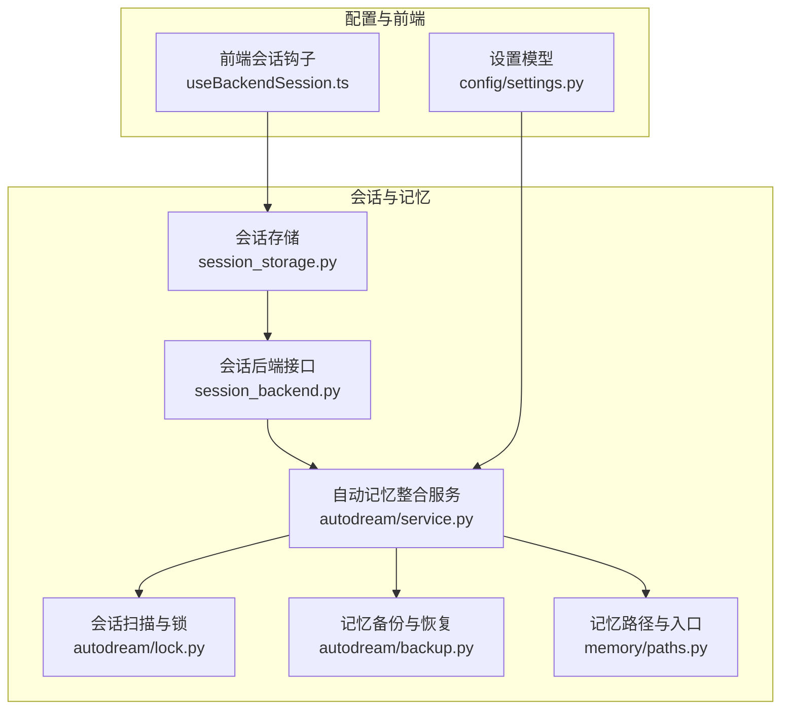

**图表来源**
- [session_storage.py:1-231](file://src/openharness/services/session_storage.py#L1-L231)
- [session_backend.py:1-98](file://src/openharness/services/session_backend.py#L1-L98)
- [service.py:1-314](file://src/openharness/services/autodream/service.py#L1-L314)
- [lock.py:1-139](file://src/openharness/services/autodream/lock.py#L1-L139)
- [backup.py:1-105](file://src/openharness/services/autodream/backup.py#L1-L105)
- [paths.py:1-23](file://src/openharness/memory/paths.py#L1-L23)
- [settings.py:60-75](file://src/openharness/config/settings.py#L60-L75)
- [useBackendSession.ts:1-463](file://frontend/terminal/src/hooks/useBackendSession.ts#L1-L463)

**章节来源**
- [session_storage.py:54-107](file://src/openharness/services/session_storage.py#L54-L107)
- [session_backend.py:51-97](file://src/openharness/services/session_backend.py#L51-L97)
- [service.py:97-245](file://src/openharness/services/autodream/service.py#L97-L245)
- [lock.py:52-94](file://src/openharness/services/autodream/lock.py#L52-L94)
- [backup.py:27-105](file://src/openharness/services/autodream/backup.py#L27-L105)
- [paths.py:11-23](file://src/openharness/memory/paths.py#L11-L23)
- [settings.py:60-75](file://src/openharness/config/settings.py#L60-L75)
- [useBackendSession.ts:24-177](file://frontend/terminal/src/hooks/useBackendSession.ts#L24-L177)

## 核心组件
- 会话存储与历史
  - 保存最新会话快照与按 ID 存档，支持导出 Markdown 转录。
  - 提供加载最新、按 ID 加载、列出最近快照等接口。
- 会话后端抽象
  - 将会话存储的具体实现封装为协议，便于替换或扩展。
- 自动记忆整合（Auto-Dream）
  - 基于会话扫描与时间阈值触发记忆整合任务。
  - 使用锁文件避免并发冲突，支持预览模式与回滚。
- 记忆备份与恢复
  - 创建时间戳备份、对比差异、恢复到指定备份。
- 记忆路径与入口
  - 生成项目级记忆目录与入口文件路径。
- 设置与阈值
  - 控制是否启用 Auto-Dream、最小小时数、最少会话数等。
- 前端会话生命周期
  - 启动后端进程、解析事件流、维护会话状态与转录缓冲。

**章节来源**
- [session_storage.py:63-107](file://src/openharness/services/session_storage.py#L63-L107)
- [session_storage.py:123-207](file://src/openharness/services/session_storage.py#L123-L207)
- [session_backend.py:14-49](file://src/openharness/services/session_backend.py#L14-L49)
- [service.py:97-245](file://src/openharness/services/autodream/service.py#L97-L245)
- [lock.py:52-94](file://src/openharness/services/autodream/lock.py#L52-L94)
- [backup.py:27-105](file://src/openharness/services/autodream/backup.py#L27-L105)
- [paths.py:11-23](file://src/openharness/memory/paths.py#L11-L23)
- [settings.py:60-75](file://src/openharness/config/settings.py#L60-L75)
- [useBackendSession.ts:24-177](file://frontend/terminal/src/hooks/useBackendSession.ts#L24-L177)

## 架构总览
下图展示从“会话创建”到“记忆整合”的关键交互路径，包括锁机制与备份恢复：

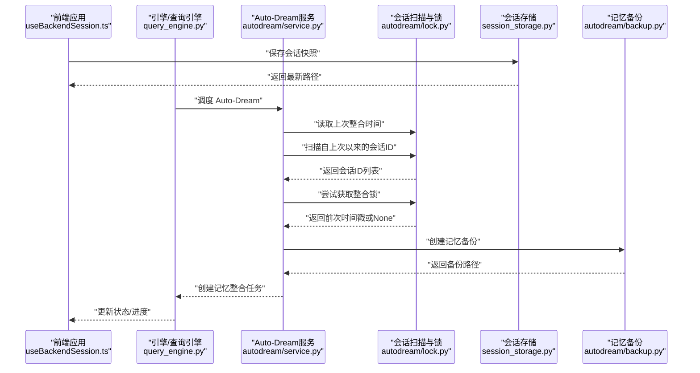

**图表来源**
- [useBackendSession.ts:107-113](file://frontend/terminal/src/hooks/useBackendSession.ts#L107-L113)
- [query_engine.py:141-153](file://src/openharness/engine/query_engine.py#L141-L153)
- [service.py:120-136](file://src/openharness/services/autodream/service.py#L120-L136)
- [lock.py:22-28](file://src/openharness/services/autodream/lock.py#L22-L28)
- [lock.py:105-138](file://src/openharness/services/autodream/lock.py#L105-L138)
- [lock.py:52-75](file://src/openharness/services/autodream/lock.py#L52-L75)
- [backup.py:27-48](file://src/openharness/services/autodream/backup.py#L27-L48)
- [session_storage.py:63-107](file://src/openharness/services/session_storage.py#L63-L107)

## 详细组件分析

### 会话创建与持久化
- 会话目录
  - 按项目路径计算哈希，生成唯一目录，确保多项目隔离。
- 快照保存
  - 同时写入“最新”与“按ID”文件，便于快速恢复与检索。
  - 内容包含模型、系统提示、消息列表、用量统计、工具元数据、摘要与计数等。
- 导出转录
  - 将当前对话导出为 Markdown 文件，便于审计与分享。

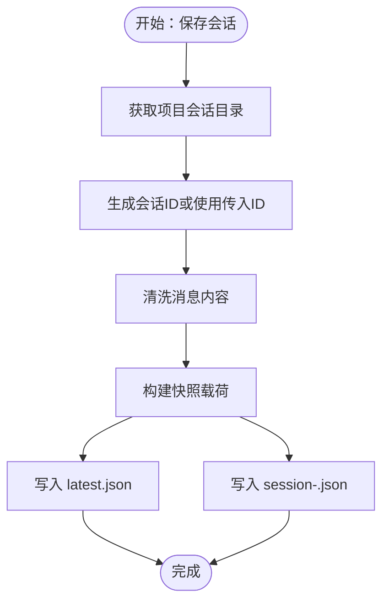

**图表来源**
- [session_storage.py:54-107](file://src/openharness/services/session_storage.py#L54-L107)
- [session_storage.py:85-96](file://src/openharness/services/session_storage.py#L85-L96)

**章节来源**
- [session_storage.py:54-107](file://src/openharness/services/session_storage.py#L54-L107)
- [session_storage.py:210-231](file://src/openharness/services/session_storage.py#L210-L231)

### 会话恢复与历史查询
- 加载最新
  - 读取“latest.json”，进行向前兼容的清洗处理。
- 按 ID 加载
  - 先查命名文件，再回退到 latest.json 匹配 session_id 或 "latest"。
- 列表与摘要
  - 遍历 session-*.json，提取摘要、消息数、模型与创建时间。
  - 若未对应命名文件，仍可从 latest.json 补充显示。

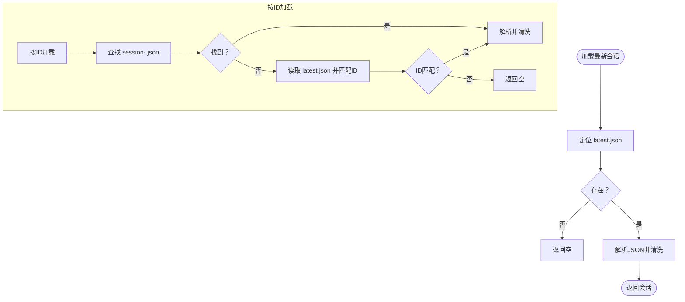

**图表来源**
- [session_storage.py:123-128](file://src/openharness/services/session_storage.py#L123-L128)
- [session_storage.py:194-207](file://src/openharness/services/session_storage.py#L194-L207)
- [session_storage.py:131-191](file://src/openharness/services/session_storage.py#L131-L191)

**章节来源**
- [session_storage.py:123-207](file://src/openharness/services/session_storage.py#L123-L207)

### 会话后端抽象与默认实现
- 接口定义
  - 统一的 get_session_dir/save_snapshot/load_latest/list_snapshots/load_by_id/export_markdown。
- 默认实现
  - 直接委托给 session_storage 的具体函数，保持一致的 API 语义。

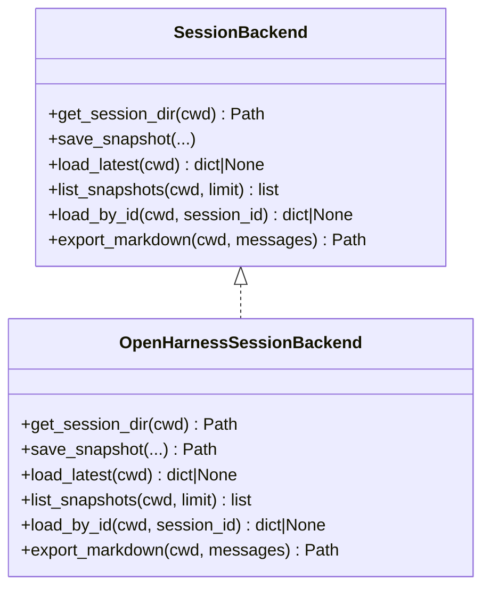

**图表来源**
- [session_backend.py:14-49](file://src/openharness/services/session_backend.py#L14-L49)
- [session_backend.py:51-97](file://src/openharness/services/session_backend.py#L51-L97)

**章节来源**
- [session_backend.py:14-97](file://src/openharness/services/session_backend.py#L14-L97)

### 会话锁机制与并发控制
- 锁文件与持有者
  - 使用 .consolidate-lock 记录 PID 与 mtime，作为“最后成功整合时间戳”。
- 获取锁
  - 若锁存在且未过期且持有进程仍在运行，则拒绝；否则写入当前 PID。
- 回滚
  - 失败或被中断时，将锁时间戳回退至获取前值，避免后续误判。
- 会话扫描
  - 基于会话快照文件的修改时间，筛选自上次整合以来变更的会话 ID。

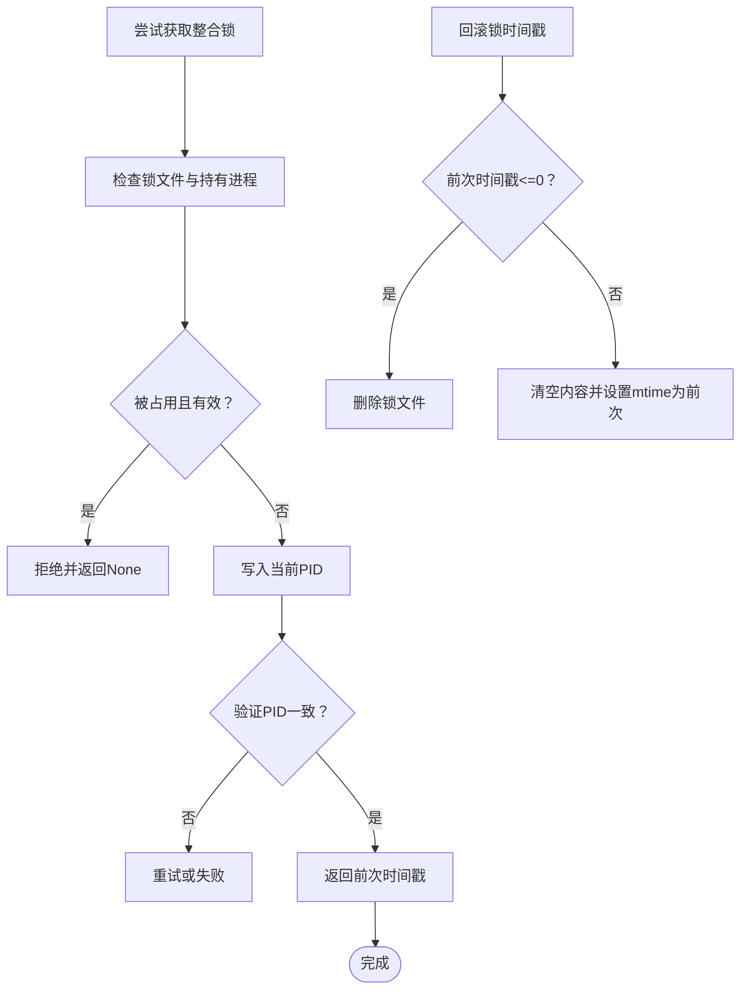

**图表来源**
- [lock.py:52-75](file://src/openharness/services/autodream/lock.py#L52-L75)
- [lock.py:78-94](file://src/openharness/services/autodream/lock.py#L78-L94)
- [lock.py:105-138](file://src/openharness/services/autodream/lock.py#L105-L138)

**章节来源**
- [lock.py:52-94](file://src/openharness/services/autodream/lock.py#L52-L94)
- [lock.py:105-138](file://src/openharness/services/autodream/lock.py#L105-L138)

### 会话历史记录管理与查询接口
- 列表接口
  - 支持 limit 限制，优先按文件修改时间倒序，补充 latest.json。
- 摘要与消息数
  - 从第一条用户消息提取摘要，若无则从消息内容中截取。
- 按 ID 查询
  - 兼容 "latest" 作为 session_id 的别名。

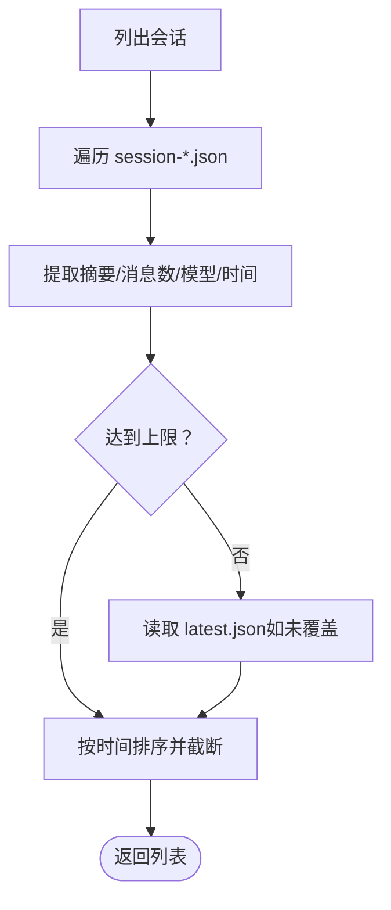

**图表来源**
- [session_storage.py:131-191](file://src/openharness/services/session_storage.py#L131-L191)

**章节来源**
- [session_storage.py:131-191](file://src/openharness/services/session_storage.py#L131-L191)

### 会话清理与垃圾回收策略
- Auto-Dream 触发条件
  - 至少满足“距上次整合的小时数阈值”与“自上次以来的会话数量阈值”。
- 会话扫描
  - 基于会话快照文件的 mtime 过滤，排除当前会话 ID。
- 任务监听与回滚
  - 通过任务完成监听器在失败/被杀时回滚锁时间戳，保证一致性。
- 记忆文件变更检测
  - 对比备份前后记忆文件的增删改，用于报告与追踪。

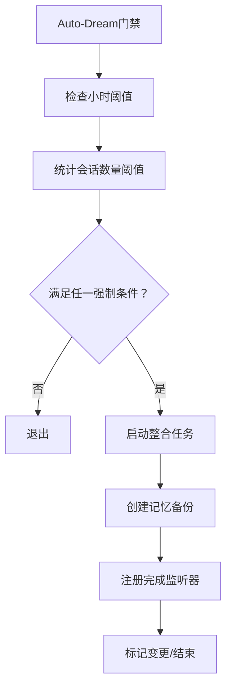

**图表来源**
- [service.py:248-303](file://src/openharness/services/autodream/service.py#L248-L303)
- [service.py:89-86](file://src/openharness/services/autodream/service.py#L89-L86)
- [service.py:231-244](file://src/openharness/services/autodream/service.py#L231-L244)
- [backup.py:27-48](file://src/openharness/services/autodream/backup.py#L27-L48)

**章节来源**
- [service.py:248-303](file://src/openharness/services/autodream/service.py#L248-L303)
- [service.py:89-86](file://src/openharness/services/autodream/service.py#L89-L86)
- [service.py:231-244](file://src/openharness/services/autodream/service.py#L231-L244)
- [backup.py:27-48](file://src/openharness/services/autodream/backup.py#L27-L48)

### 会话备份与恢复操作指南
- 创建备份
  - 以时间戳命名的目录，若冲突自动追加后缀。
- 差异对比
  - 比较两个记忆目录的新增/删除/变更文件名。
- 恢复备份
  - 采用临时目录+原子重命名的方式，避免部分覆盖风险。

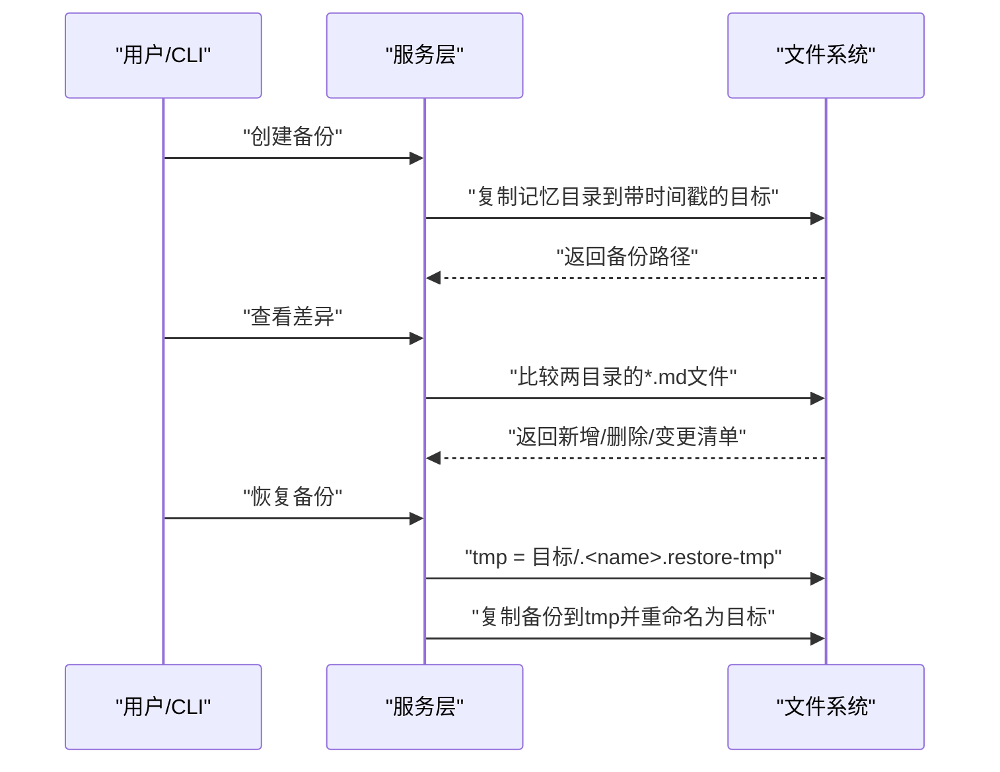

**图表来源**
- [backup.py:27-48](file://src/openharness/services/autodream/backup.py#L27-L48)
- [backup.py:51-76](file://src/openharness/services/autodream/backup.py#L51-L76)
- [backup.py:91-105](file://src/openharness/services/autodream/backup.py#L91-L105)

**章节来源**
- [backup.py:27-105](file://src/openharness/services/autodream/backup.py#L27-L105)

### 会话与记忆文件的关联关系与数据同步
- Auto-Dream 服务
  - 读取记忆目录与会话目录，构建整合提示，执行记忆整理任务。
- 锁与回滚
  - 在任务失败/被杀时回滚锁时间戳，确保下次能正确触发。
- 任务完成后的变更标记
  - 记录新增/变更/删除的文件，便于审计与可视化。

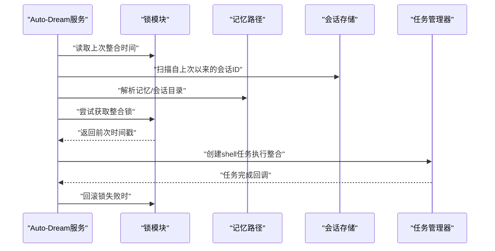

**图表来源**
- [service.py:120-136](file://src/openharness/services/autodream/service.py#L120-L136)
- [service.py:140-145](file://src/openharness/services/autodream/service.py#L140-L145)
- [service.py:212-214](file://src/openharness/services/autodream/service.py#L212-L214)
- [paths.py:11-23](file://src/openharness/memory/paths.py#L11-L23)

**章节来源**
- [service.py:120-136](file://src/openharness/services/autodream/service.py#L120-L136)
- [service.py:212-214](file://src/openharness/services/autodream/service.py#L212-L214)
- [paths.py:11-23](file://src/openharness/memory/paths.py#L11-L23)

## 依赖分析
- 低耦合高内聚
  - 会话存储与后端接口解耦，便于替换实现。
  - Auto-Dream 仅依赖会话扫描与锁，不直接耦合具体存储实现。
- 关键依赖链
  - 前端提交请求 → 会话存储保存 → 引擎调度 Auto-Dream → 锁扫描 → 备份 → 任务执行 → 变更标记。
- 外部依赖
  - 文件系统（原子写、时间戳、目录结构）。
  - 任务管理器（异步任务生命周期监听）。

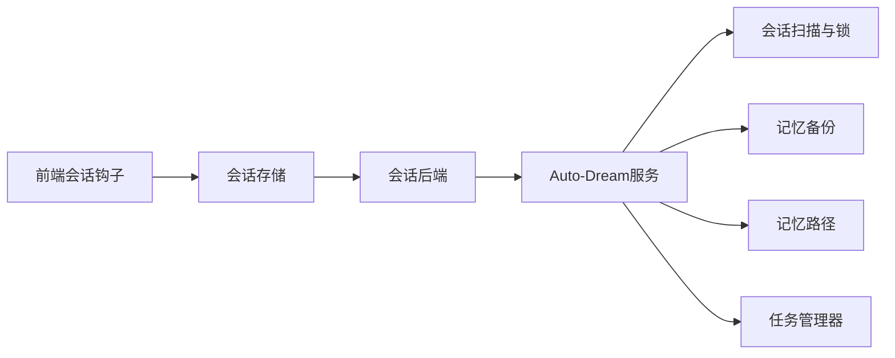

**图表来源**
- [useBackendSession.ts:107-113](file://frontend/terminal/src/hooks/useBackendSession.ts#L107-L113)
- [session_storage.py:63-107](file://src/openharness/services/session_storage.py#L63-L107)
- [session_backend.py:51-97](file://src/openharness/services/session_backend.py#L51-L97)
- [service.py:97-245](file://src/openharness/services/autodream/service.py#L97-L245)
- [lock.py:52-94](file://src/openharness/services/autodream/lock.py#L52-L94)
- [backup.py:27-48](file://src/openharness/services/autodream/backup.py#L27-L48)
- [paths.py:11-23](file://src/openharness/memory/paths.py#L11-L23)

**章节来源**
- [useBackendSession.ts:24-177](file://frontend/terminal/src/hooks/useBackendSession.ts#L24-L177)
- [session_backend.py:51-97](file://src/openharness/services/session_backend.py#L51-L97)
- [service.py:97-245](file://src/openharness/services/autodream/service.py#L97-L245)

## 性能考虑
- I/O 优化
  - 使用原子写入减少崩溃风险；批量读取/写入会话文件，避免频繁小写入。
- 扫描效率
  - 会话扫描基于文件 mtime 排序，减少无效解析；Auto-Dream 间隔扫描避免高频触发。
- 流式渲染
  - 前端对助手输出与转录项进行缓冲与节流，降低渲染抖动与卡顿。
- 记忆整合
  - 预览模式与回滚机制避免无谓的大规模写入；仅在必要时执行整合。

[本节为通用指导，无需特定文件分析]

## 故障排查指南
- 无法获取整合锁
  - 检查 .consolidate-lock 是否存在且持有进程仍在运行；确认 HOLDER_STALE_SECONDS 是否足够。
- 会话列表为空
  - 确认 session-*.json 是否存在；若仅存在 latest.json，检查其 session_id 字段。
- 备份/恢复异常
  - 确认备份目录权限与磁盘空间；恢复时注意临时目录的原子重命名过程。
- Auto-Dream 未触发
  - 检查设置中的 auto_dream_enabled、auto_dream_min_hours、auto_dream_min_sessions；确认会话扫描结果非空。

**章节来源**
- [lock.py:52-75](file://src/openharness/services/autodream/lock.py#L52-L75)
- [session_storage.py:131-191](file://src/openharness/services/session_storage.py#L131-L191)
- [backup.py:91-105](file://src/openharness/services/autodream/backup.py#L91-L105)
- [settings.py:60-75](file://src/openharness/config/settings.py#L60-L75)

## 结论
OpenHarness 的会话管理以“文件系统为中心”的设计实现了高可靠与可审计的会话持久化，结合 Auto-Dream 的锁与备份机制，提供了稳健的记忆整合与恢复能力。通过统一的后端接口与清晰的触发策略，既满足了日常使用场景，也为扩展与定制留足空间。

[本节为总结性内容，无需特定文件分析]

## 附录
- 配置要点
  - memory.auto_dream_enabled：是否启用自动记忆整合。
  - memory.auto_dream_min_hours：距离上次整合的最小时数。
  - memory.auto_dream_min_sessions：自上次以来的最少会话数。
- 前端会话生命周期
  - 启动后端进程、解析 OHJSON 事件流、维护转录缓冲与忙碌状态。

**章节来源**
- [settings.py:60-75](file://src/openharness/config/settings.py#L60-L75)
- [useBackendSession.ts:115-177](file://frontend/terminal/src/hooks/useBackendSession.ts#L115-L177)