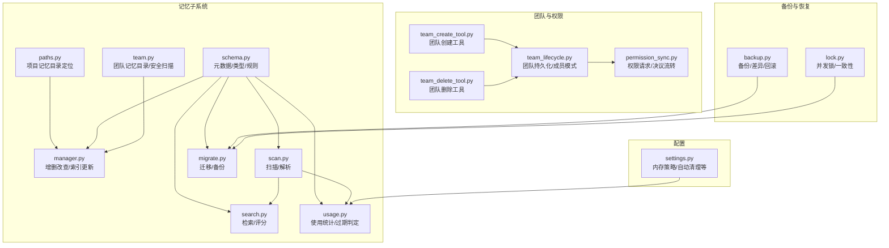
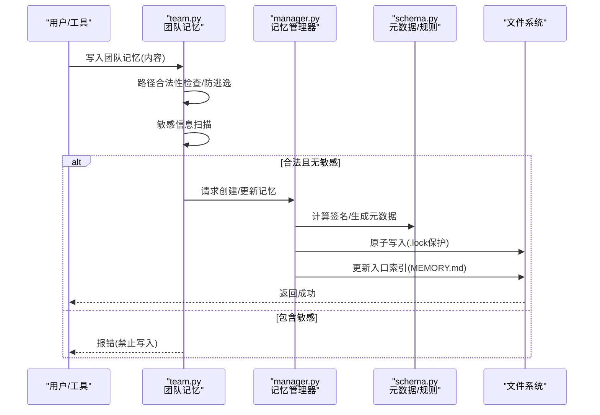
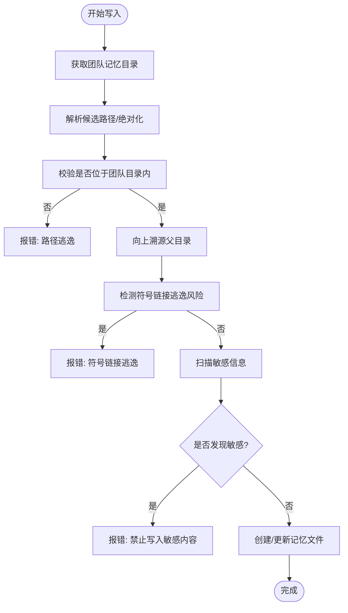
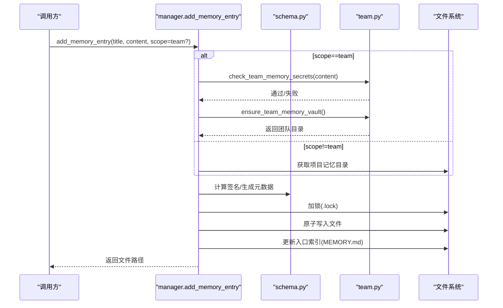
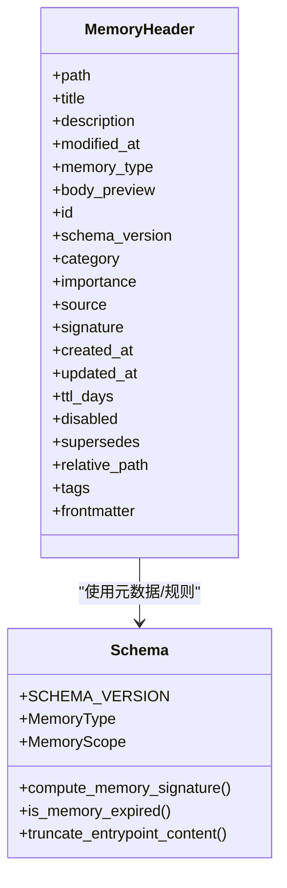
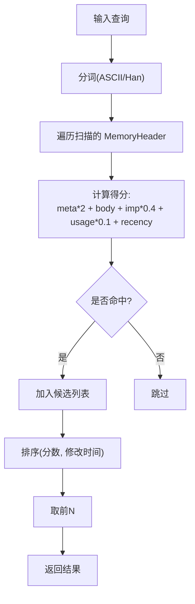
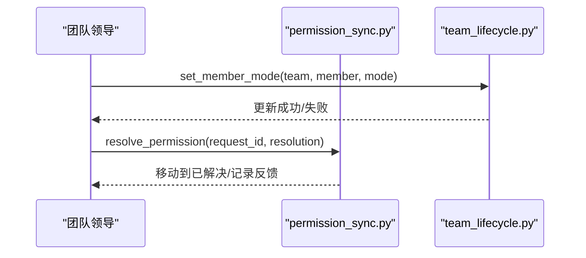
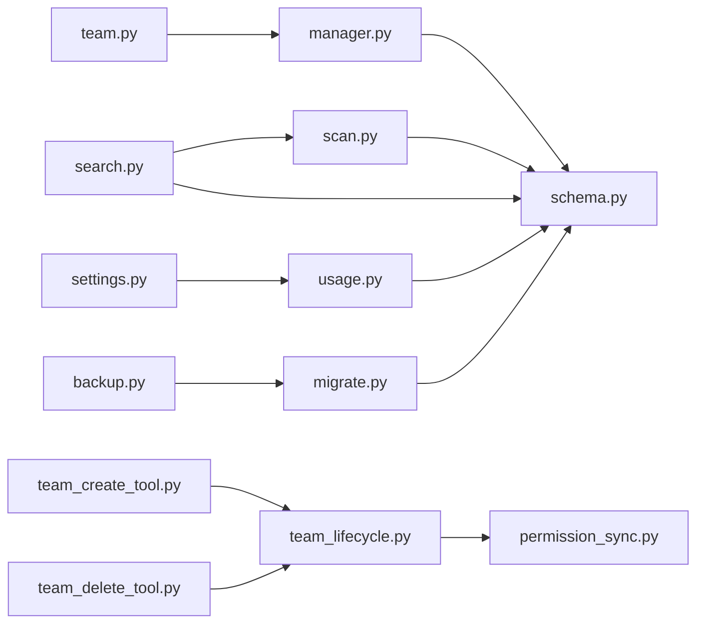

# 团队记忆共享

<cite>
**本文引用的文件**
- [team.py](file://src/openharness/memory/team.py)
- [manager.py](file://src/openharness/memory/manager.py)
- [schema.py](file://src/openharness/memory/schema.py)
- [search.py](file://src/openharness/memory/search.py)
- [paths.py](file://src/openharness/memory/paths.py)
- [scan.py](file://src/openharness/memory/scan.py)
- [types.py](file://src/openharness/memory/types.py)
- [usage.py](file://src/openharness/memory/usage.py)
- [migrate.py](file://src/openharness/memory/migrate.py)
- [team_lifecycle.py](file://src/openharness/swarm/team_lifecycle.py)
- [permission_sync.py](file://src/openharness/swarm/permission_sync.py)
- [team_create_tool.py](file://src/openharness/tools/team_create_tool.py)
- [team_delete_tool.py](file://src/openharness/tools/team_delete_tool.py)
- [backup.py](file://src/openharness/services/autodream/backup.py)
- [lock.py](file://src/openharness/services/autodream/lock.py)
- [settings.py](file://src/openharness/config/settings.py)
</cite>

## 目录
1. [简介](#简介)
2. [项目结构](#项目结构)
3. [核心组件](#核心组件)
4. [架构总览](#架构总览)
5. [详细组件分析](#详细组件分析)
6. [依赖关系分析](#依赖关系分析)
7. [性能考量](#性能考量)
8. [故障排查指南](#故障排查指南)
9. [结论](#结论)
10. [附录](#附录)

## 简介
本文件系统性阐述 OpenHarness 的“团队记忆共享”能力：包括团队记忆的作用域与访问控制、团队记忆库的创建与维护流程、团队成员权限与安全控制、团队记忆的同步与冲突处理策略、搜索与检索机制、备份与灾难恢复方案，以及团队记忆与个人记忆的隔离与整合方式。目标是帮助不同技术背景的读者快速理解并正确使用该能力。

## 项目结构
围绕团队记忆共享的相关模块主要分布在以下路径：
- 记忆存储与管理：src/openharness/memory/*
- 团队生命周期与权限同步：src/openharness/swarm/*
- 工具接口（团队创建/删除）：src/openharness/tools/*
- 备份与恢复：src/openharness/services/autodream/*
- 配置与策略：src/openharness/config/*

**图表来源**
- [paths.py:11-22](file://src/openharness/memory/paths.py#L11-L22)
- [schema.py:17-49](file://src/openharness/memory/schema.py#L17-L49)
- [manager.py:34-121](file://src/openharness/memory/manager.py#L34-L121)
- [team.py:34-91](file://src/openharness/memory/team.py#L34-L91)
- [scan.py:20-47](file://src/openharness/memory/scan.py#L20-L47)
- [search.py:15-51](file://src/openharness/memory/search.py#L15-L51)
- [usage.py:67-104](file://src/openharness/memory/usage.py#L67-L104)
- [migrate.py:38-93](file://src/openharness/memory/migrate.py#L38-L93)
- [team_lifecycle.py:231-257](file://src/openharness/swarm/team_lifecycle.py#L231-L257)
- [permission_sync.py:519-543](file://src/openharness/swarm/permission_sync.py#L519-L543)
- [team_create_tool.py:18-31](file://src/openharness/tools/team_create_tool.py#L18-L31)
- [team_delete_tool.py:17-31](file://src/openharness/tools/team_delete_tool.py#L17-L31)
- [backup.py:13-32](file://src/openharness/services/autodream/backup.py#L13-L32)
- [lock.py:52-75](file://src/openharness/services/autodream/lock.py#L52-L75)
- [settings.py:60-75](file://src/openharness/config/settings.py#L60-L75)

**章节来源**
- [paths.py:11-22](file://src/openharness/memory/paths.py#L11-L22)
- [schema.py:17-49](file://src/openharness/memory/schema.py#L17-L49)
- [manager.py:34-121](file://src/openharness/memory/manager.py#L34-L121)
- [team.py:34-91](file://src/openharness/memory/team.py#L34-L91)
- [scan.py:20-47](file://src/openharness/memory/scan.py#L20-L47)
- [search.py:15-51](file://src/openharness/memory/search.py#L15-L51)
- [usage.py:67-104](file://src/openharness/memory/usage.py#L67-L104)
- [migrate.py:38-93](file://src/openharness/memory/migrate.py#L38-L93)
- [team_lifecycle.py:231-257](file://src/openharness/swarm/team_lifecycle.py#L231-L257)
- [permission_sync.py:519-543](file://src/openharness/swarm/permission_sync.py#L519-L543)
- [team_create_tool.py:18-31](file://src/openharness/tools/team_create_tool.py#L18-L31)
- [team_delete_tool.py:17-31](file://src/openharness/tools/team_delete_tool.py#L17-L31)
- [backup.py:13-32](file://src/openharness/services/autodream/backup.py#L13-L32)
- [lock.py:52-75](file://src/openharness/services/autodream/lock.py#L52-L75)
- [settings.py:60-75](file://src/openharness/config/settings.py#L60-L75)

## 核心组件
- 团队记忆目录与安全扫描：负责团队共享记忆的根目录创建、入口文件初始化、写入路径校验与敏感信息扫描。
- 记忆管理器：统一处理记忆条目的新增、更新、软删除、索引维护与去重签名计算。
- 元数据与类型：定义记忆类型、作用域、时间戳格式、签名算法、过期判定、入口文件截断策略等。
- 检索与评分：基于标题/描述/正文内容进行启发式匹配，并结合重要度、使用频次与新鲜度加权排序。
- 扫描与解析：遍历项目记忆目录，解析 frontmatter，构建 MemoryHeader 列表。
- 使用统计与过期：记录记忆使用次数与最近使用时间，支持“长期未用”候选识别与清理。
- 迁移与备份：为历史文件补全 schema 前言元数据；提供备份/差异/回滚能力。
- 团队生命周期与权限同步：团队配置持久化、成员权限模式变更与同步、权限请求决议流转。
- 工具接口：提供团队创建/删除的工具调用入口。
- 配置与策略：内存系统开关、最大文件数、入口文件大小限制、自动清理阈值等。

**章节来源**
- [team.py:34-91](file://src/openharness/memory/team.py#L34-L91)
- [manager.py:34-121](file://src/openharness/memory/manager.py#L34-L121)
- [schema.py:17-49](file://src/openharness/memory/schema.py#L17-L49)
- [search.py:15-51](file://src/openharness/memory/search.py#L15-L51)
- [scan.py:20-47](file://src/openharness/memory/scan.py#L20-L47)
- [usage.py:67-104](file://src/openharness/memory/usage.py#L67-L104)
- [migrate.py:38-93](file://src/openharness/memory/migrate.py#L38-L93)
- [team_lifecycle.py:231-257](file://src/openharness/swarm/team_lifecycle.py#L231-L257)
- [permission_sync.py:519-543](file://src/openharness/swarm/permission_sync.py#L519-L543)
- [team_create_tool.py:18-31](file://src/openharness/tools/team_create_tool.py#L18-L31)
- [team_delete_tool.py:17-31](file://src/openharness/tools/team_delete_tool.py#L17-L31)
- [backup.py:13-32](file://src/openharness/services/autodream/backup.py#L13-L32)
- [settings.py:60-75](file://src/openharness/config/settings.py#L60-L75)

## 架构总览
团队记忆共享以“项目级记忆目录”为核心，其中团队记忆位于独立的 team 子目录下，通过严格的路径校验与敏感信息扫描保障安全。写入操作采用独占锁与原子写入，避免并发冲突。检索时综合元数据权重、使用频次与新鲜度，确保高价值记忆优先呈现。团队生命周期与权限同步模块负责成员权限模式的持久化与同步，配合权限请求/决议流程实现协作治理。

**图表来源**
- [team.py:51-91](file://src/openharness/memory/team.py#L51-L91)
- [manager.py:39-121](file://src/openharness/memory/manager.py#L39-L121)
- [schema.py:103-108](file://src/openharness/memory/schema.py#L103-L108)

**章节来源**
- [team.py:51-91](file://src/openharness/memory/team.py#L51-L91)
- [manager.py:39-121](file://src/openharness/memory/manager.py#L39-L121)
- [schema.py:103-108](file://src/openharness/memory/schema.py#L103-L108)

## 详细组件分析

### 团队记忆目录与安全控制
- 目录与入口：团队记忆根目录在项目记忆目录下创建 team 子目录，并保证入口文件存在。
- 路径校验：严格限制写入路径不得逃逸团队目录，防止符号链接绕过与相对路径穿越。
- 敏感扫描：内置多类敏感规则（私钥、AWS、GitHub、OpenAI、Anthropic、通用密钥等），发现潜在敏感信息即拒绝写入。
- 安全策略：团队记忆面向项目协作者共享，严禁存放机密、凭证、临时任务对话等。

**图表来源**
- [team.py:34-91](file://src/openharness/memory/team.py#L34-L91)

**章节来源**
- [team.py:34-91](file://src/openharness/memory/team.py#L34-L91)

### 记忆管理器：创建/更新/软删除与索引维护
- 新增/更新：根据标题生成 slug，计算内容签名以去重；若重复则复用原文件；否则生成新文件名；原子写入并更新入口索引。
- 软删除：标记 disabled 并更新时间戳，同时从入口索引中移除对应条目。
- 锁与并发：使用独占锁保护关键写入路径，避免竞态。
- 类型与作用域：当 scope 为 team 时，强制执行敏感扫描与团队目录写入。

**图表来源**
- [manager.py:39-121](file://src/openharness/memory/manager.py#L39-L121)
- [team.py:50-58](file://src/openharness/memory/team.py#L50-L58)
- [schema.py:103-108](file://src/openharness/memory/schema.py#L103-L108)

**章节来源**
- [manager.py:39-121](file://src/openharness/memory/manager.py#L39-L121)
- [team.py:50-58](file://src/openharness/memory/team.py#L50-L58)
- [schema.py:103-108](file://src/openharness/memory/schema.py#L103-L108)

### 元数据与类型：作用域、签名与过期
- 作用域：支持 private/project/team；team 对应共享范围。
- 类型：user/feedback/project/reference；用于区分记忆用途。
- 签名：基于标准化后的内容、类型与类别计算哈希，用于去重。
- 过期：依据 updated_at/created_at 与 ttl_days 判定是否过期隐藏。
- 入口文件截断：限制行数与字节数，超限时警告仅加载部分。

**图表来源**
- [types.py:10-34](file://src/openharness/memory/types.py#L10-L34)
- [schema.py:17-49](file://src/openharness/memory/schema.py#L17-L49)
- [schema.py:103-108](file://src/openharness/memory/schema.py#L103-L108)
- [schema.py:283-292](file://src/openharness/memory/schema.py#L283-L292)
- [schema.py:137-169](file://src/openharness/memory/schema.py#L137-L169)

**章节来源**
- [types.py:10-34](file://src/openharness/memory/types.py#L10-L34)
- [schema.py:17-49](file://src/openharness/memory/schema.py#L17-L49)
- [schema.py:103-108](file://src/openharness/memory/schema.py#L103-L108)
- [schema.py:283-292](file://src/openharness/memory/schema.py#L283-L292)
- [schema.py:137-169](file://src/openharness/memory/schema.py#L137-L169)

### 检索与评分：启发式搜索与排序
- 令牌化：ASCII 词与中日韩字符分别提取，过滤短词。
- 评分：元数据命中权重更高，正文命中次之；叠加重要度、使用频次与新鲜度加成。
- 结果：按分数降序、修改时间次序返回前 N 条。

**图表来源**
- [search.py:15-51](file://src/openharness/memory/search.py#L15-L51)
- [usage.py:67-104](file://src/openharness/memory/usage.py#L67-L104)
- [schema.py:61-91](file://src/openharness/memory/schema.py#L61-L91)

**章节来源**
- [search.py:15-51](file://src/openharness/memory/search.py#L15-L51)
- [usage.py:67-104](file://src/openharness/memory/usage.py#L67-L104)
- [schema.py:61-91](file://src/openharness/memory/schema.py#L61-L91)

### 扫描与解析：构建 MemoryHeader
- 解析：拆分 frontmatter 与正文，提取标题/描述/类型等字段。
- 预览：正文去空行与标题行后截断，作为检索预览。
- 排序：按修改时间倒序，支持最大数量限制。

**章节来源**
- [scan.py:20-47](file://src/openharness/memory/scan.py#L20-L47)
- [scan.py:50-108](file://src/openharness/memory/scan.py#L50-L108)

### 使用统计与过期：长期未用候选识别
- 使用统计：记录 use_count 与 last_used_at，支持并发写入的锁保护。
- 候选识别：在非禁用/非过期前提下，重要度低且长时间未被使用的历史记忆进入清理候选集。

**章节来源**
- [usage.py:67-104](file://src/openharness/memory/usage.py#L67-L104)
- [usage.py:107-136](file://src/openharness/memory/usage.py#L107-L136)

### 迁移与备份：历史文件补全与灾难恢复
- 迁移：为顶层 *.md 文件补全 schema 前言元数据，支持 dry-run 与原子写入，失败/变更计数汇总。
- 备份：默认备份根目录按应用标签与内存目录定位；创建时间戳备份副本；提供差异格式化与最新备份查找；回滚时采用临时目录替换策略。
- 锁：合并/清理流程使用进程锁避免并发冲突。

**章节来源**
- [migrate.py:38-93](file://src/openharness/memory/migrate.py#L38-L93)
- [migrate.py:120-133](file://src/openharness/memory/migrate.py#L120-L133)
- [backup.py:13-32](file://src/openharness/services/autodream/backup.py#L13-L32)
- [backup.py:68-88](file://src/openharness/services/autodream/backup.py#L68-L88)
- [backup.py:91-104](file://src/openharness/services/autodream/backup.py#L91-L104)
- [lock.py:52-75](file://src/openharness/services/autodream/lock.py#L52-L75)

### 团队生命周期与权限同步
- 团队持久化：团队配置文件包含成员、权限模式、允许路径等，支持原子写入与读取。
- 成员模式：支持单个或批量更新成员权限模式，并同步到团队配置文件。
- 权限请求：权限请求/决议流转，支持批准/拒绝与反馈，最终移动至已解决状态。

**图表来源**
- [team_lifecycle.py:474-513](file://src/openharness/swarm/team_lifecycle.py#L474-L513)
- [team_lifecycle.py:534-557](file://src/openharness/swarm/team_lifecycle.py#L534-L557)
- [permission_sync.py:546-557](file://src/openharness/swarm/permission_sync.py#L546-L557)

**章节来源**
- [team_lifecycle.py:474-513](file://src/openharness/swarm/team_lifecycle.py#L474-L513)
- [team_lifecycle.py:534-557](file://src/openharness/swarm/team_lifecycle.py#L534-L557)
- [permission_sync.py:546-557](file://src/openharness/swarm/permission_sync.py#L546-L557)

### 工具接口：团队创建与删除
- 团队创建：通过工具调用创建轻量级内存团队。
- 团队删除：通过工具调用删除指定团队。

**章节来源**
- [team_create_tool.py:18-31](file://src/openharness/tools/team_create_tool.py#L18-L31)
- [team_delete_tool.py:17-31](file://src/openharness/tools/team_delete_tool.py#L17-L31)

### 配置与策略：内存系统参数
- 内存系统开关与限制：启用/禁用、最大文件数、入口文件行数/字节上限、会话记忆开关、自动清理开关与阈值等。
- 与使用统计联动：自动清理最小小时数与最小会话数影响“长期未用”候选识别。

**章节来源**
- [settings.py:60-75](file://src/openharness/config/settings.py#L60-L75)

## 依赖关系分析
- 组件耦合：
  - team.py 与 manager.py 在团队写入场景强耦合（team 侧安全前置、manager 侧原子写入）。
  - schema.py 提供跨模块的元数据/规则，被 scan/search/usage/migrate 等广泛使用。
  - swarm 模块与 memory 模块通过工具与配置间接交互。
- 外部依赖：
  - 文件系统：路径解析、原子写入、锁文件。
  - 配置系统：settings 提供策略参数。
- 潜在循环依赖：当前模块间通过函数调用解耦，未见直接循环导入。

**图表来源**
- [team.py:50-58](file://src/openharness/memory/team.py#L50-L58)
- [manager.py:39-121](file://src/openharness/memory/manager.py#L39-L121)
- [schema.py:17-49](file://src/openharness/memory/schema.py#L17-L49)
- [scan.py:20-47](file://src/openharness/memory/scan.py#L20-L47)
- [search.py:15-51](file://src/openharness/memory/search.py#L15-L51)
- [usage.py:67-104](file://src/openharness/memory/usage.py#L67-L104)
- [migrate.py:38-93](file://src/openharness/memory/migrate.py#L38-L93)
- [team_lifecycle.py:231-257](file://src/openharness/swarm/team_lifecycle.py#L231-L257)
- [permission_sync.py:519-543](file://src/openharness/swarm/permission_sync.py#L519-L543)
- [team_create_tool.py:18-31](file://src/openharness/tools/team_create_tool.py#L18-L31)
- [team_delete_tool.py:17-31](file://src/openharness/tools/team_delete_tool.py#L17-L31)
- [backup.py:13-32](file://src/openharness/services/autodream/backup.py#L13-L32)
- [settings.py:60-75](file://src/openharness/config/settings.py#L60-L75)

**章节来源**
- [team.py:50-58](file://src/openharness/memory/team.py#L50-L58)
- [manager.py:39-121](file://src/openharness/memory/manager.py#L39-L121)
- [schema.py:17-49](file://src/openharness/memory/schema.py#L17-L49)
- [scan.py:20-47](file://src/openharness/memory/scan.py#L20-L47)
- [search.py:15-51](file://src/openharness/memory/search.py#L15-L51)
- [usage.py:67-104](file://src/openharness/memory/usage.py#L67-L104)
- [migrate.py:38-93](file://src/openharness/memory/migrate.py#L38-L93)
- [team_lifecycle.py:231-257](file://src/openharness/swarm/team_lifecycle.py#L231-L257)
- [permission_sync.py:519-543](file://src/openharness/swarm/permission_sync.py#L519-L543)
- [team_create_tool.py:18-31](file://src/openharness/tools/team_create_tool.py#L18-L31)
- [team_delete_tool.py:17-31](file://src/openharness/tools/team_delete_tool.py#L17-L31)
- [backup.py:13-32](file://src/openharness/services/autodream/backup.py#L13-L32)
- [settings.py:60-75](file://src/openharness/config/settings.py#L60-L75)

## 性能考量
- 检索复杂度：对最多 100 个记忆文件进行启发式匹配与评分，时间复杂度近似 O(k·n)，k 为查询令牌数，n 为扫描文件数。
- 写入开销：独占锁与原子写入确保一致性，但可能成为高并发写入瓶颈；建议在团队共享场景中减少频繁写入。
- 过期与清理：结合使用统计与新鲜度评分，可降低无效记忆对检索与上下文窗口的影响。
- 入口文件截断：避免超大索引导致加载缓慢。

[本节为通用性能讨论，不直接分析具体文件]

## 故障排查指南
- 写入被拒：检查内容是否包含敏感信息；确认写入路径未逃逸团队目录；确认未发生符号链接绕过。
- 写入冲突：确保同一时刻只有一个写入进程；检查 .lock 是否被占用。
- 检索无结果：确认查询词长度与分词规则；检查记忆是否被标记为 disabled 或过期；查看入口文件是否过大被截断。
- 清理误判：调整重要度与使用统计阈值；检查自动清理配置。
- 备份/回滚：确认备份根目录与时间戳命名；回滚前备份当前状态；核对权限与路径规则。

**章节来源**
- [team.py:51-91](file://src/openharness/memory/team.py#L51-L91)
- [manager.py:124-159](file://src/openharness/memory/manager.py#L124-L159)
- [search.py:15-51](file://src/openharness/memory/search.py#L15-L51)
- [schema.py:137-169](file://src/openharness/memory/schema.py#L137-L169)
- [backup.py:91-104](file://src/openharness/services/autodream/backup.py#L91-L104)
- [settings.py:60-75](file://src/openharness/config/settings.py#L60-L75)

## 结论
OpenHarness 的团队记忆共享以“安全优先、可审计、可协作”为目标：通过严格的路径校验与敏感扫描保障安全；通过去重签名、入口索引与使用统计提升检索质量；通过团队生命周期与权限同步实现协作治理；通过迁移与备份提供数据可靠性保障。建议在团队协作中遵循最小暴露原则与最小持久化原则，合理设置自动清理与权限模式，确保团队记忆既高效又安全。

[本节为总结性内容，不直接分析具体文件]

## 附录

### 团队记忆与个人记忆的隔离与整合
- 隔离：团队记忆位于团队目录，个人记忆位于项目记忆根目录；写入时根据 scope 自动选择目录；路径校验严格限制团队目录边界。
- 整合：检索时统一扫描项目记忆目录（包含团队与个人），通过元数据权重与使用统计提升高质量记忆的可见性；入口文件作为索引，便于统一浏览。

**章节来源**
- [team.py:34-58](file://src/openharness/memory/team.py#L34-L58)
- [paths.py:11-22](file://src/openharness/memory/paths.py#L11-L22)
- [manager.py:39-121](file://src/openharness/memory/manager.py#L39-L121)
- [scan.py:20-47](file://src/openharness/memory/scan.py#L20-L47)
- [search.py:15-51](file://src/openharness/memory/search.py#L15-L51)