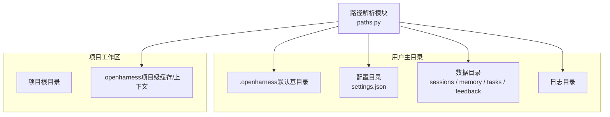
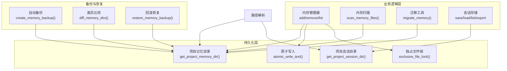
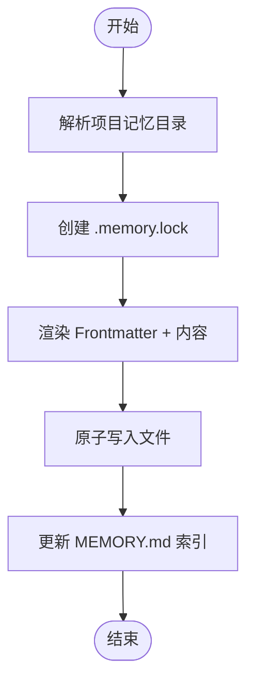
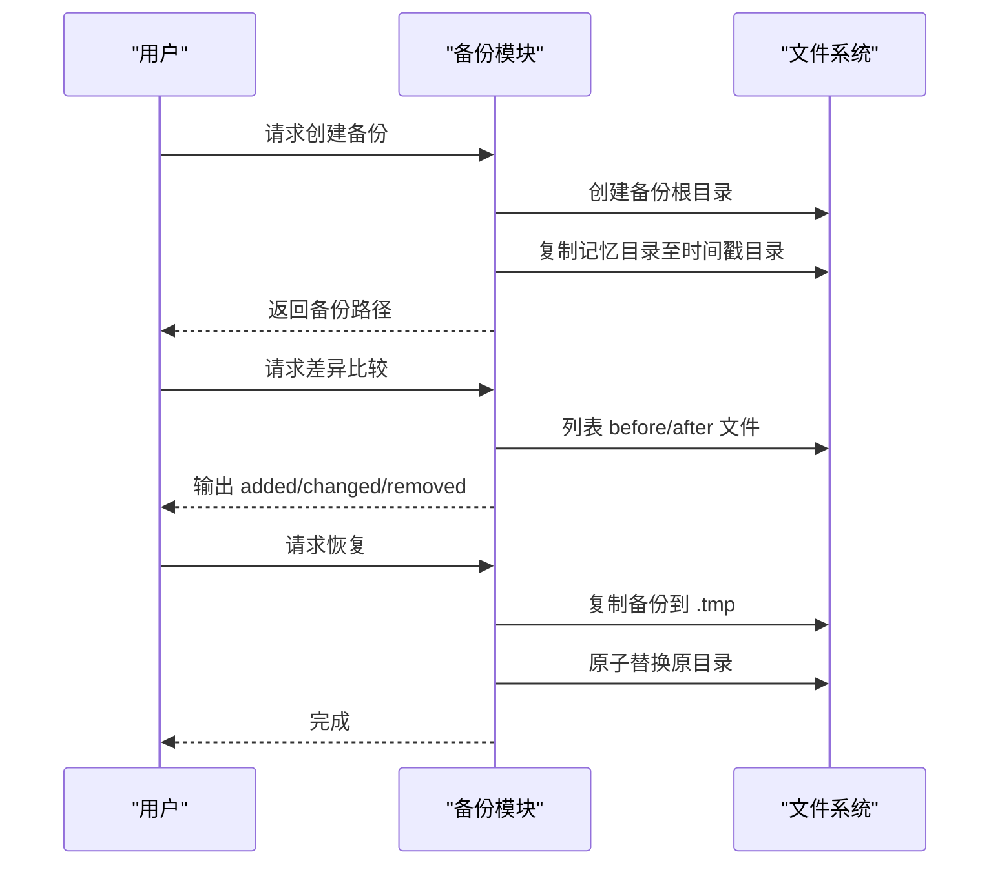
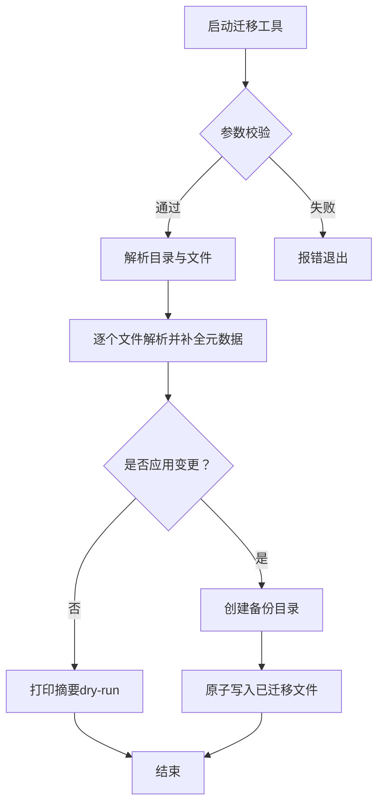
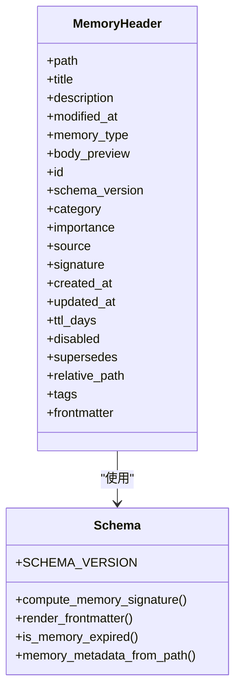
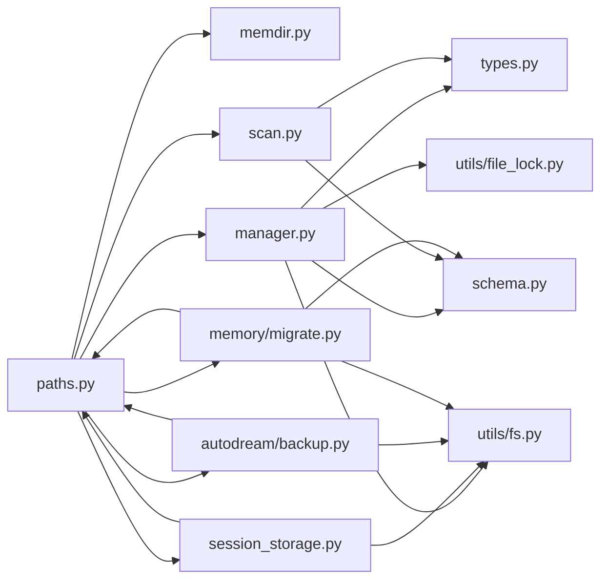

# 数据持久化与备份

<cite>
**本文引用的文件**
- [路径解析（paths.py）](file://src/openharness/config/paths.py)
- [内存目录与入口（memdir.py）](file://src/openharness/memory/memdir.py)
- [内存管理器（manager.py）](file://src/openharness/memory/manager.py)
- [内存扫描（scan.py）](file://src/openharness/memory/scan.py)
- [内存模式与元数据（schema.py）](file://src/openharness/memory/schema.py)
- [内存类型定义（types.py）](file://src/openharness/memory/types.py)
- [团队共享内存（team.py）](file://src/openharness/memory/team.py)
- [会话存储（session_storage.py）](file://src/openharness/services/session_storage.py)
- [自动记忆备份（backup.py）](file://src/openharness/services/autodream/backup.py)
- [文件原子写入（fs.py）](file://src/openharness/utils/fs.py)
- [文件独占锁（file_lock.py）](file://src/openharness/utils/file_lock.py)
- [内存迁移工具（migrate.py）](file://src/openharness/memory/migrate.py)
- [内存迁移脚本入口（migrate_memory.py）](file://scripts/migrate_memory.py)
</cite>

## 目录
1. [简介](#简介)
2. [项目结构](#项目结构)
3. [核心组件](#核心组件)
4. [架构总览](#架构总览)
5. [详细组件分析](#详细组件分析)
6. [依赖关系分析](#依赖关系分析)
7. [性能考量](#性能考量)
8. [故障排查与应急方案](#故障排查与应急方案)
9. [结论](#结论)
10. [附录](#附录)

## 简介
本文件聚焦 OpenHarness 的数据持久化与备份恢复能力，覆盖以下主题：
- 记忆文件的存储策略与目录结构
- 数据备份的自动化流程与策略
- 数据恢复的操作步骤与注意事项
- 数据迁移工具的使用指南与最佳实践
- 数据完整性检查与校验机制
- 批量操作与性能优化建议
- 故障恢复与数据修复的应急方案

## 项目结构
OpenHarness 将持久化数据按“配置目录”和“数据目录”分层组织，并采用“项目隔离 + 哈希命名”的目录策略，确保多项目并存时互不干扰。

图表来源
- [路径解析（paths.py）:15-161](file://src/openharness/config/paths.py#L15-L161)

章节来源
- [路径解析（paths.py）:15-161](file://src/openharness/config/paths.py#L15-L161)

## 核心组件
- 路径解析：统一解析配置、数据、会话、任务、反馈等目录，支持环境变量覆盖。
- 内存子系统：以 Markdown + YAML Frontmatter 的结构化方式存储知识，提供索引、扫描、去重、过期控制、签名校验等能力。
- 会话存储：以 JSON 形式保存对话快照，支持最新快照与按 ID 快照，提供导出 Markdown 转录。
- 自动备份：对记忆目录进行时间戳备份、差异比较、回滚恢复。
- 原子写入与独占锁：保证并发安全与崩溃安全，避免半写文件。
- 迁移工具：为历史文件补全元数据，生成备份并可选择应用变更。

章节来源
- [路径解析（paths.py）:15-161](file://src/openharness/config/paths.py#L15-L161)
- [内存管理器（manager.py）:1-184](file://src/openharness/memory/manager.py#L1-L184)
- [内存扫描（scan.py）:1-117](file://src/openharness/memory/scan.py#L1-L117)
- [内存模式与元数据（schema.py）:1-444](file://src/openharness/memory/schema.py#L1-L444)
- [会话存储（session_storage.py）:1-231](file://src/openharness/services/session_storage.py#L1-L231)
- [自动记忆备份（backup.py）:1-105](file://src/openharness/services/autodream/backup.py#L1-L105)
- [文件原子写入（fs.py）:1-99](file://src/openharness/utils/fs.py#L1-L99)
- [文件独占锁（file_lock.py）:1-81](file://src/openharness/utils/file_lock.py#L1-L81)
- [内存迁移工具（migrate.py）:1-138](file://src/openharness/memory/migrate.py#L1-L138)

## 架构总览
OpenHarness 的持久化与备份围绕“目录隔离 + 结构化元数据 + 原子写入 + 并发保护 + 备份恢复”展开。

图表来源
- [路径解析（paths.py）:11-75](file://src/openharness/config/paths.py#L11-L75)
- [内存管理器（manager.py）:30-121](file://src/openharness/memory/manager.py#L30-L121)
- [内存扫描（scan.py）:20-47](file://src/openharness/memory/scan.py#L20-L47)
- [内存迁移工具（migrate.py）:38-93](file://src/openharness/memory/migrate.py#L38-L93)
- [会话存储（session_storage.py）:54-107](file://src/openharness/services/session_storage.py#L54-L107)
- [自动记忆备份（backup.py）:27-105](file://src/openharness/services/autodream/backup.py#L27-L105)
- [文件原子写入（fs.py）:69-78](file://src/openharness/utils/fs.py#L69-L78)
- [文件独占锁（file_lock.py）:26-44](file://src/openharness/utils/file_lock.py#L26-L44)

## 详细组件分析

### 记忆文件存储策略与目录结构
- 目录命名：基于项目路径计算短哈希，形成“项目名-哈希”的稳定目录，避免同名冲突。
- 入口文件：每个项目的记忆入口为 MEMORY.md，作为索引文件；具体条目为独立 .md 文件。
- 结构化元数据：采用 YAML Frontmatter 存储 id、name、type、scope、category、signature、created_at、updated_at、ttl_days、disabled、supersedes、tags 等字段。
- 去重与签名：通过内容归一化与 SHA256 计算签名，避免重复条目。
- 过期控制：根据 updated_at 与 ttl_days 判断是否过期。
- 团队共享：团队内存位于独立 team 子目录，具备路径校验与敏感信息扫描，防止泄露。

图表来源
- [内存管理器（manager.py）:39-121](file://src/openharness/memory/manager.py#L39-L121)
- [内存模式与元数据（schema.py）:234-262](file://src/openharness/memory/schema.py#L234-L262)
- [文件原子写入（fs.py）:69-78](file://src/openharness/utils/fs.py#L69-L78)
- [文件独占锁（file_lock.py）:26-44](file://src/openharness/utils/file_lock.py#L26-L44)

章节来源
- [内存目录与入口（memdir.py）:15-53](file://src/openharness/memory/memdir.py#L15-L53)
- [内存管理器（manager.py）:39-121](file://src/openharness/memory/manager.py#L39-L121)
- [内存扫描（scan.py）:20-47](file://src/openharness/memory/scan.py#L20-L47)
- [内存模式与元数据（schema.py）:17-49, 103-108, 234-262, 326-367:17-49](file://src/openharness/memory/schema.py#L17-L49)
- [团队共享内存（team.py）:34-48](file://src/openharness/memory/team.py#L34-L48)

### 数据备份自动化流程与策略
- 备份根目录：优先从目标记忆目录向上查找 .ohmo，若存在则在该层级下创建 backups；否则使用数据目录下的 memory-backups/app_label。
- 时间戳命名：memory-YYYYMMDD-HHMMSS，冲突时追加 -N。
- 备份内容：完整复制记忆目录（忽略特定锁定文件），同时复制 usage_index.json（如存在）。
- 差异比较：对比两个备份或当前状态，输出新增、删除、修改的文件列表。
- 恢复流程：先将备份复制到临时目录，再原子替换原目录，保证一致性。

图表来源
- [自动记忆备份（backup.py）:27-105](file://src/openharness/services/autodream/backup.py#L27-L105)

章节来源
- [自动记忆备份（backup.py）:13-105](file://src/openharness/services/autodream/backup.py#L13-L105)

### 数据恢复操作步骤与注意事项
- 步骤
  1) 定位备份根目录与目标记忆目录。
  2) 使用“最新备份”定位器确认目标备份。
  3) 执行恢复：将备份复制到临时目录，再原子替换原目录。
- 注意事项
  - 恢复前建议手动备份当前状态，以防误操作。
  - 恢复后验证 MEMORY.md 与各条目文件完整性。
  - 若存在并发写入，应在恢复前后协调进程，避免竞争。

章节来源
- [自动记忆备份（backup.py）:79-105](file://src/openharness/services/autodream/backup.py#L79-L105)

### 数据迁移工具使用指南与最佳实践
- 功能概述
  - 扫描项目记忆目录下的所有 .md（排除 MEMORY.md）。
  - 解析 Frontmatter，补全缺失的 schema_version、id、created_at、updated_at、signature 等字段。
  - 可选择“仅报告（dry-run）”或“应用变更（apply）”，并在应用前创建备份目录。
- 使用建议
  - 首次运行建议 dry-run，核对变更清单与失败项。
  - apply 时确保有足够磁盘空间与权限。
  - 备份目录结构包含原始文件与 usage_index.json（如存在）。
- CLI 参数
  - --cwd：项目工作目录
  - --memory-dir：显式指定记忆目录
  - --default-type/--default-category：为无类型的旧文件设置默认值
  - --dry-run 或 --apply：二选一
  - 输出 JSON 摘要，包含扫描数、变更数、未变更数、失败数、备份目录、变更/失败文件列表

图表来源
- [内存迁移工具（migrate.py）:96-138](file://src/openharness/memory/migrate.py#L96-L138)
- [内存迁移工具（migrate.py）:38-93](file://src/openharness/memory/migrate.py#L38-L93)
- [内存迁移脚本入口（migrate_memory.py）:13-15](file://scripts/migrate_memory.py#L13-L15)

章节来源
- [内存迁移工具（migrate.py）:1-138](file://src/openharness/memory/migrate.py#L1-L138)
- [内存迁移脚本入口（migrate_memory.py）:1-15](file://scripts/migrate_memory.py#L1-L15)

### 数据完整性检查与校验机制
- 原子写入：所有写入均通过临时文件 + replace 实现，避免半写文件。
- 并发保护：关键写入段落配合独占文件锁，避免竞态。
- Frontmatter 规范：固定字段顺序与格式，便于跨版本兼容与解析。
- 签名与去重：基于内容归一化 + SHA256 的签名，用于检测重复与一致性。
- 过期判断：基于 updated_at 与 ttl_days 的过期判定，隐藏陈旧内容。
- 路径安全：团队共享内存写入前进行路径校验，防止目录穿越与符号链接逃逸。

图表来源
- [内存类型定义（types.py）:10-34](file://src/openharness/memory/types.py#L10-L34)
- [内存模式与元数据（schema.py）:17-49, 103-108, 264-275, 283-293, 326-367:17-49](file://src/openharness/memory/schema.py#L17-L49)

章节来源
- [文件原子写入（fs.py）:1-99](file://src/openharness/utils/fs.py#L1-L99)
- [文件独占锁（file_lock.py）:1-81](file://src/openharness/utils/file_lock.py#L1-L81)
- [内存模式与元数据（schema.py）:103-108, 264-275, 283-293, 326-367:103-108](file://src/openharness/memory/schema.py#L103-L108)

### 批量操作与性能优化建议
- 批量写入
  - 使用原子写入与独占锁组合，减少竞态与崩溃风险。
  - 合理拆分大文件，避免单次写入过大导致锁持有时间过长。
- 扫描与索引
  - scan_memory_files 支持限制返回数量与过滤禁用/过期条目，避免一次性加载过多文件。
  - 维护 MEMORY.md 索引，减少全文检索成本。
- IO 优化
  - 备份采用复制目录树，尽量在同文件系统内完成，降低跨盘复制开销。
  - 差异比较仅基于文件名与内容比较，避免深度解析。
- 并发控制
  - 对 MEMORY.md 与 .memory.lock 的读写序列使用独占锁，避免多个进程同时写入索引或条目。

章节来源
- [内存扫描（scan.py）:20-47](file://src/openharness/memory/scan.py#L20-L47)
- [内存管理器（manager.py）:60-121](file://src/openharness/memory/manager.py#L60-L121)
- [自动记忆备份（backup.py）:44-48](file://src/openharness/services/autodream/backup.py#L44-L48)

## 依赖关系分析
- 路径解析模块为所有持久化模块提供基础目录，确保一致性。
- 内存管理器依赖路径解析、扫描、模式与原子写入，实现条目的增删改查与索引维护。
- 会话存储依赖路径解析与原子写入，保障对话快照的可靠持久化。
- 自动备份模块依赖路径解析与文件系统操作，提供备份、差异与回滚能力。
- 迁移工具依赖路径解析、扫描与模式，实现历史文件的元数据补全与备份。

图表来源
- [路径解析（paths.py）:11-75](file://src/openharness/config/paths.py#L11-L75)
- [内存管理器（manager.py）:8-27](file://src/openharness/memory/manager.py#L8-L27)
- [内存扫描（scan.py）:7-17](file://src/openharness/memory/scan.py#L7-L17)
- [会话存储（session_storage.py）:13-15](file://src/openharness/services/session_storage.py#L13-L15)
- [自动记忆备份（backup.py）:10-10](file://src/openharness/services/autodream/backup.py#L10-L10)
- [内存迁移工具（migrate.py）:11-18](file://src/openharness/memory/migrate.py#L11-L18)

章节来源
- [路径解析（paths.py）:11-75](file://src/openharness/config/paths.py#L11-L75)
- [内存管理器（manager.py）:8-27](file://src/openharness/memory/manager.py#L8-L27)
- [内存扫描（scan.py）:7-17](file://src/openharness/memory/scan.py#L7-L17)
- [会话存储（session_storage.py）:13-15](file://src/openharness/services/session_storage.py#L13-L15)
- [自动记忆备份（backup.py）:10-10](file://src/openharness/services/autodream/backup.py#L10-L10)
- [内存迁移工具（migrate.py）:11-18](file://src/openharness/memory/migrate.py#L11-L18)

## 性能考量
- 目录命名与哈希：通过短哈希避免长路径与频繁重命名，提升 IO 稳定性。
- 原子写入：减少崩溃后的修复成本，提高可靠性。
- 锁粒度：对索引与条目分别加锁，避免全局阻塞。
- 扫描限制：默认限制返回数量，避免大规模文件系统扫描带来的延迟。
- 备份策略：时间戳命名 + 同盘复制，兼顾速度与可追溯性。

## 故障排查与应急方案
- 常见问题
  - 写入失败或文件损坏：检查原子写入是否成功、是否存在磁盘空间不足或权限问题。
  - 并发冲突：确认独占锁是否生效，避免多进程同时写入同一索引或条目。
  - 迁移失败：查看失败文件列表，修正格式错误或缺失字段后再重试。
  - 团队内存写入被拒：检查内容是否匹配敏感规则，清理敏感信息后重试。
- 应急方案
  - 使用“最新备份”快速回滚到上一个稳定状态。
  - 通过差异比较定位具体变更文件，针对性修复。
  - 在执行重大操作前，先执行 dry-run 获取变更清单，评估影响范围。

章节来源
- [文件原子写入（fs.py）:1-99](file://src/openharness/utils/fs.py#L1-L99)
- [文件独占锁（file_lock.py）:1-81](file://src/openharness/utils/file_lock.py#L1-L81)
- [内存迁移工具（migrate.py）:73-93](file://src/openharness/memory/migrate.py#L73-L93)
- [团队共享内存（team.py）:80-91](file://src/openharness/memory/team.py#L80-L91)
- [自动记忆备份（backup.py）:79-105](file://src/openharness/services/autodream/backup.py#L79-L105)

## 结论
OpenHarness 通过“目录隔离 + 结构化元数据 + 原子写入 + 并发保护 + 自动备份”的体系，实现了可靠的数据持久化与便捷的备份恢复能力。配合迁移工具与差异比较，可在升级与演进过程中保持数据一致性与可追溯性。建议在生产环境中遵循“先备份、后应用、再验证”的流程，确保变更可控与可回滚。

## 附录
- 术语
  - MEMORY.md：项目记忆索引文件
  - .memory.lock：内存索引与条目写入的独占锁文件
  - usage_index.json：使用统计索引文件（迁移工具可能复制）
- 最佳实践
  - 定期备份记忆目录，保留至少 1-2 份最近备份
  - 使用迁移工具定期补全历史文件元数据
  - 对团队共享内存严格审查敏感信息
  - 在 CI/CD 中集成备份与恢复演练，验证可恢复性