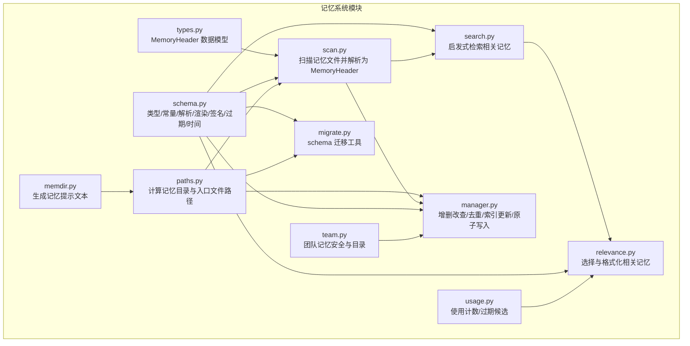
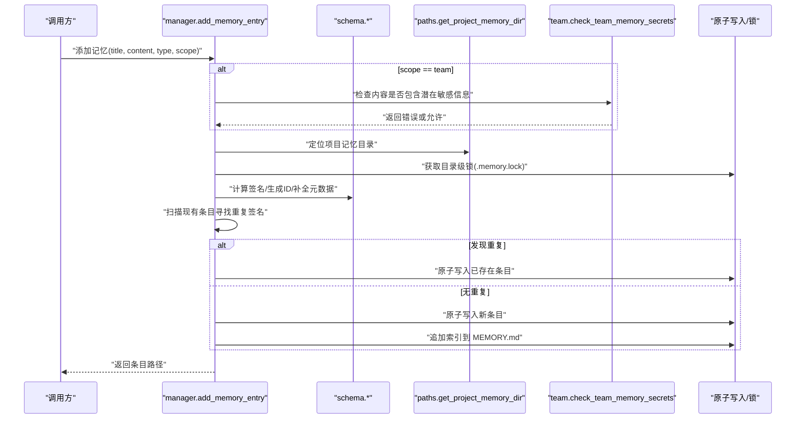
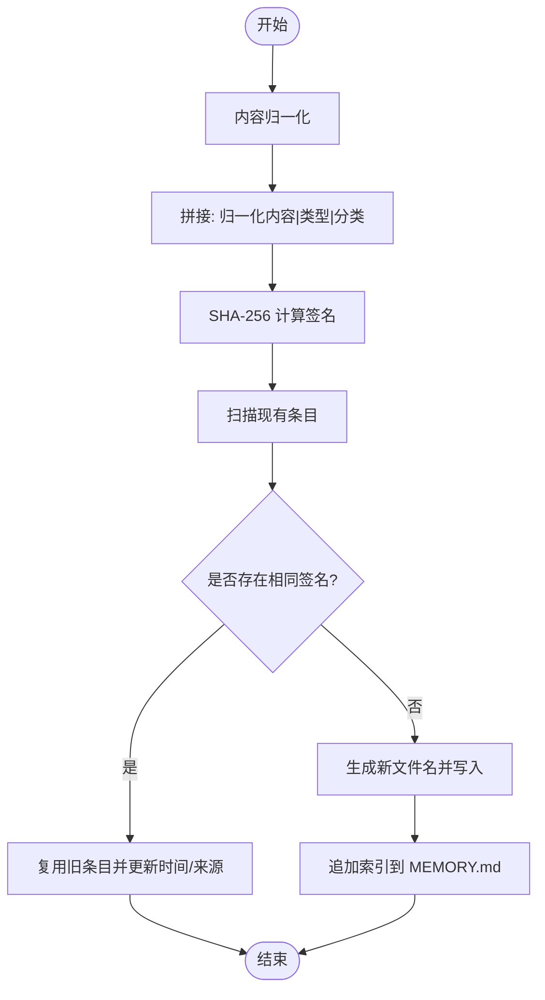
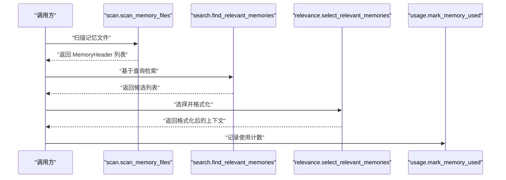
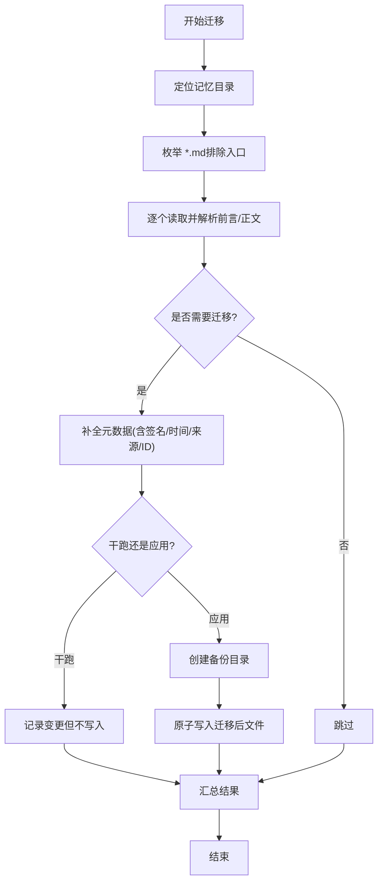
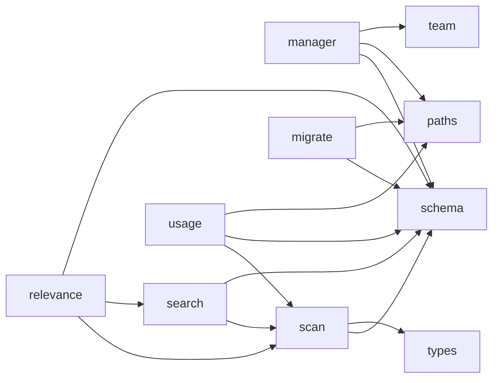
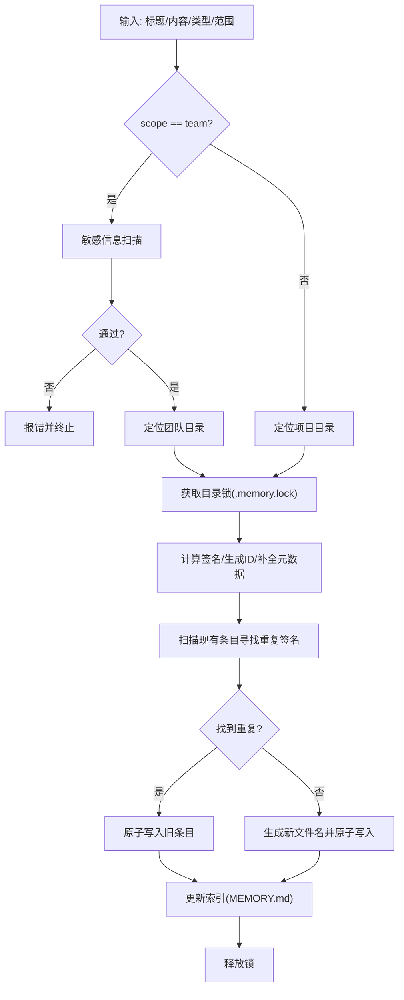

# 记忆系统架构

<cite>
**本文引用的文件**
- [src/openharness/memory/__init__.py](file://src/openharness/memory/__init__.py)
- [src/openharness/memory/types.py](file://src/openharness/memory/types.py)
- [src/openharness/memory/schema.py](file://src/openharness/memory/schema.py)
- [src/openharness/memory/manager.py](file://src/openharness/memory/manager.py)
- [src/openharness/memory/memdir.py](file://src/openharness/memory/memdir.py)
- [src/openharness/memory/paths.py](file://src/openharness/memory/paths.py)
- [src/openharness/memory/scan.py](file://src/openharness/memory/scan.py)
- [src/openharness/memory/search.py](file://src/openharness/memory/search.py)
- [src/openharness/memory/team.py](file://src/openharness/memory/team.py)
- [src/openharness/memory/migrate.py](file://src/openharness/memory/migrate.py)
- [src/openharness/memory/relevance.py](file://src/openharness/memory/relevance.py)
- [src/openharness/memory/usage.py](file://src/openharness/memory/usage.py)
- [scripts/migrate_memory.py](file://scripts/migrate_memory.py)
- [tests/test_memory/test_memdir.py](file://tests/test_memory/test_memdir.py)
- [tests/test_memory/test_claude_runtime_memory.py](file://tests/test_memory/test_claude_runtime_memory.py)
</cite>

## 目录
1. [简介](#简介)
2. [项目结构](#项目结构)
3. [核心组件](#核心组件)
4. [架构总览](#架构总览)
5. [详细组件分析](#详细组件分析)
6. [依赖关系分析](#依赖关系分析)
7. [性能考量](#性能考量)
8. [故障排查指南](#故障排查指南)
9. [结论](#结论)
10. [附录](#附录)

## 简介
本文件系统性阐述 OpenHarness 记忆系统的架构与实现细节，覆盖记忆文件的数据结构与元数据格式（含 MemoryType、MemoryScope、Schema 版本等）、组织结构与命名规范、存储位置、签名与去重机制、团队记忆与项目记忆差异、读写流程与原子操作保障、以及数据迁移与版本兼容策略。目标是帮助开发者与使用者在不深入源码的情况下，也能准确理解并正确使用记忆系统。

## 项目结构
记忆系统位于 src/openharness/memory 目录下，围绕“内存索引文件（MEMORY.md）+ 多个带 YAML 前言的 Markdown 记忆条目”这一核心模型构建。关键模块职责如下：
- schema：定义类型别名、常量、元数据解析与渲染、签名计算、过期判定、时间处理等通用能力
- types：定义 MemoryHeader 数据模型
- paths：计算项目记忆目录与入口文件路径
- scan：扫描并解析记忆文件，生成 MemoryHeader 列表
- search：基于启发式规则检索相关记忆
- relevance：选择并格式化用于提示注入的相关记忆
- manager：对外暴露的记忆增删改查入口，负责去重、索引更新、原子写入
- team：团队共享记忆的安全防护与目录管理
- usage：记忆使用计数与过期候选识别
- migrate：面向 schema-v1 的迁移工具
- memdir：生成记忆提示文本，包含入口文件内容截断与策略说明

图表来源
- [src/openharness/memory/types.py:10-34](file://src/openharness/memory/types.py#L10-L34)
- [src/openharness/memory/schema.py:17-444](file://src/openharness/memory/schema.py#L17-L444)
- [src/openharness/memory/paths.py:11-23](file://src/openharness/memory/paths.py#L11-L23)
- [src/openharness/memory/scan.py:20-117](file://src/openharness/memory/scan.py#L20-L117)
- [src/openharness/memory/search.py:15-72](file://src/openharness/memory/search.py#L15-L72)
- [src/openharness/memory/relevance.py:27-146](file://src/openharness/memory/relevance.py#L27-L146)
- [src/openharness/memory/manager.py:39-184](file://src/openharness/memory/manager.py#L39-L184)
- [src/openharness/memory/team.py:34-91](file://src/openharness/memory/team.py#L34-L91)
- [src/openharness/memory/usage.py:22-154](file://src/openharness/memory/usage.py#L22-L154)
- [src/openharness/memory/migrate.py:38-138](file://src/openharness/memory/migrate.py#L38-L138)
- [src/openharness/memory/memdir.py:15-53](file://src/openharness/memory/memdir.py#L15-L53)

章节来源
- [src/openharness/memory/__init__.py:1-26](file://src/openharness/memory/__init__.py#L1-L26)
- [src/openharness/memory/paths.py:11-23](file://src/openharness/memory/paths.py#L11-L23)

## 核心组件
- MemoryHeader：统一承载单个记忆文件的元数据与派生信息，包括路径、标题、描述、修改时间、类型、摘要预览、ID、schema 版本、分类、重要度、来源、签名、创建/更新时间、存活天数、禁用状态、替代关系、相对路径、标签、原始前言字典等。
- MemoryType 与 MemoryScope：前者限定记忆条目的用途类别，后者限定可见范围；二者均支持规范化映射，便于跨来源兼容。
- Schema 版本：当前默认版本为 1，迁移工具会为历史文件回填该版本号与必要字段。
- 入口文件（MEMORY.md）：作为项目记忆索引，采用“标题-文件名”的链接列表形式维护条目清单，并可被截断以避免过大上下文。
- 团队记忆与项目记忆：团队记忆位于项目本地的共享目录中，具备敏感信息检测与路径校验；项目记忆则按项目根目录哈希派生稳定子目录。

章节来源
- [src/openharness/memory/types.py:10-34](file://src/openharness/memory/types.py#L10-L34)
- [src/openharness/memory/schema.py:17-444](file://src/openharness/memory/schema.py#L17-L444)
- [src/openharness/memory/paths.py:11-23](file://src/openharness/memory/paths.py#L11-L23)
- [src/openharness/memory/team.py:34-91](file://src/openharness/memory/team.py#L34-L91)

## 架构总览
记忆系统围绕“入口索引 + 条目文件 + 元数据 + 搜索/选择 + 使用统计 + 迁移”形成闭环。写入时通过锁与原子写确保并发安全；读取时先扫描解析，再进行搜索与选择，最后格式化注入到提示中。

图表来源
- [src/openharness/memory/manager.py:39-121](file://src/openharness/memory/manager.py#L39-L121)
- [src/openharness/memory/schema.py:103-108](file://src/openharness/memory/schema.py#L103-L108)
- [src/openharness/memory/team.py:80-91](file://src/openharness/memory/team.py#L80-L91)
- [src/openharness/memory/paths.py:11-17](file://src/openharness/memory/paths.py#L11-L17)

## 详细组件分析

### 数据模型与元数据格式
- MemoryHeader 字段覆盖了从文件系统到业务语义的完整链路，便于后续搜索、排序、格式化与展示。
- 元数据字段遵循 YAML 前言标准，支持字符串、布尔、整数、数组等类型；渲染时保持字段顺序与值序列化一致性。
- schema 常量与工具函数提供：
  - 类型与范围的标准化映射
  - 内容归一化与确定性签名计算
  - 过期判定与新鲜度提示
  - 时间格式化与解析
  - 入口文件截断与警告注入

章节来源
- [src/openharness/memory/types.py:10-34](file://src/openharness/memory/types.py#L10-L34)
- [src/openharness/memory/schema.py:32-49](file://src/openharness/memory/schema.py#L32-L49)
- [src/openharness/memory/schema.py:103-108](file://src/openharness/memory/schema.py#L103-L108)
- [src/openharness/memory/schema.py:234-261](file://src/openharness/memory/schema.py#L234-L261)
- [src/openharness/memory/schema.py:283-292](file://src/openharness/memory/schema.py#L283-L292)

### 存储位置与命名规范
- 项目记忆目录：基于项目根路径做哈希派生，确保不同项目目录下的记忆空间隔离且稳定。
- 入口文件：MEMORY.md，位于项目记忆目录根部，作为索引。
- 条目文件：每个记忆条目为独立 .md 文件，文件名由标题 slug 化而来；若冲突则自动追加序号后缀。
- 团队记忆：位于项目记忆目录下的 team 子目录，入口同样为 MEMORY.md。

章节来源
- [src/openharness/memory/paths.py:11-23](file://src/openharness/memory/paths.py#L11-L23)
- [src/openharness/memory/manager.py:162-171](file://src/openharness/memory/manager.py#L162-L171)
- [src/openharness/memory/team.py:34-48](file://src/openharness/memory/team.py#L34-L48)

### 记忆签名与去重逻辑
- 签名计算：对内容进行小写、空白折叠、去标点归一化后，拼接“类型+分类”，再经 SHA-256 得到确定性签名。
- 去重策略：新增时扫描所有条目，比较签名；若命中则复用旧条目并仅更新时间戳与来源；否则生成新文件并追加索引。
- 签名回退：若条目已有签名字段，则优先使用；否则按需解析文件体与类型/分类重新计算。

图表来源
- [src/openharness/memory/schema.py:94-108](file://src/openharness/memory/schema.py#L94-L108)
- [src/openharness/memory/manager.py:64-75](file://src/openharness/memory/manager.py#L64-L75)
- [src/openharness/memory/manager.py:174-183](file://src/openharness/memory/manager.py#L174-L183)

章节来源
- [src/openharness/memory/schema.py:94-108](file://src/openharness/memory/schema.py#L94-L108)
- [src/openharness/memory/manager.py:64-75](file://src/openharness/memory/manager.py#L64-L75)

### 团队记忆与项目记忆
- 项目记忆：默认作用域，内容仅限项目成员可见；适合存放项目内部知识与约定。
- 团队记忆：共享作用域，需通过敏感信息扫描与路径校验，防止泄露密钥与私密信息；写入路径必须位于团队目录内且不得逃逸。
- 安全策略：内置多类敏感信息模式匹配；写入前进行扫描，发现风险即拒绝；同时提供路径合法性验证，阻断符号链接逃逸。

章节来源
- [src/openharness/memory/team.py:24-31](file://src/openharness/memory/team.py#L24-L31)
- [src/openharness/memory/team.py:80-91](file://src/openharness/memory/team.py#L80-L91)
- [src/openharness/memory/team.py:51-67](file://src/openharness/memory/team.py#L51-L67)

### 读写流程与原子操作
- 写入流程要点：
  - 目录级锁：使用独占锁避免并发写入冲突
  - 原子写入：通过原子写接口保证文件完整性
  - 索引同步：若新增条目，追加到 MEMORY.md
- 读取流程要点：
  - 扫描解析：遍历目录，跳过入口文件，解析前言与正文
  - 过滤与排序：支持禁用/过期过滤、按修改时间倒序
  - 检索与选择：基于启发式权重与使用计数、时效性进行排序
  - 格式化注入：将选中条目渲染为提示块

图表来源
- [src/openharness/memory/scan.py:20-47](file://src/openharness/memory/scan.py#L20-L47)
- [src/openharness/memory/search.py:15-50](file://src/openharness/memory/search.py#L15-L50)
- [src/openharness/memory/relevance.py:44-68](file://src/openharness/memory/relevance.py#L44-L68)
- [src/openharness/memory/usage.py:82-104](file://src/openharness/memory/usage.py#L82-L104)

章节来源
- [src/openharness/memory/manager.py:39-121](file://src/openharness/memory/manager.py#L39-L121)
- [src/openharness/memory/usage.py:82-104](file://src/openharness/memory/usage.py#L82-L104)

### 数据迁移与版本兼容
- 迁移目标：为历史无 schema 前言的记忆文件回填 schema_version、ID、时间戳、签名、来源等字段
- 迁移策略：
  - 干跑模式：仅报告将要变更的文件
  - 应用模式：创建备份目录，原子写入迁移后的文件
  - ID 唯一性：迁移过程中维护已见 ID 集合，确保生成唯一 ID
- 命令行入口：提供独立脚本入口，便于从仓库外直接运行

图表来源
- [src/openharness/memory/migrate.py:38-93](file://src/openharness/memory/migrate.py#L38-L93)
- [src/openharness/memory/schema.py:326-367](file://src/openharness/memory/schema.py#L326-L367)
- [scripts/migrate_memory.py:10-14](file://scripts/migrate_memory.py#L10-L14)

章节来源
- [src/openharness/memory/migrate.py:38-138](file://src/openharness/memory/migrate.py#L38-L138)
- [src/openharness/memory/schema.py:326-367](file://src/openharness/memory/schema.py#L326-L367)

### 提示注入与新鲜度
- 提示生成：将相关记忆渲染为 Markdown 片段，必要时附加“新鲜度”说明，提醒用户注意时效性
- 新鲜度：根据更新时间计算“几天前”，超过阈值给出提示
- 截断策略：入口文件内容按行数与字节数上限截断，并在末尾加入警告提示

章节来源
- [src/openharness/memory/relevance.py:88-100](file://src/openharness/memory/relevance.py#L88-L100)
- [src/openharness/memory/schema.py:181-201](file://src/openharness/memory/schema.py#L181-L201)
- [src/openharness/memory/memdir.py:15-53](file://src/openharness/memory/memdir.py#L15-L53)

## 依赖关系分析
- 模块耦合：
  - manager 依赖 schema（签名/时间/渲染）、paths（目录）、team（团队安全）
  - scan 依赖 schema（解析/过期）、types（返回值）
  - search 依赖 scan 与 schema（时间/解析）
  - relevance 依赖 scan/search/schema/usage
  - usage 依赖 scan/schema/paths
  - migrate 依赖 schema/paths
- 外部依赖：
  - 文件系统：路径解析、原子写入、锁文件
  - YAML 解析：前言解析与渲染
  - 哈希算法：签名计算

图表来源
- [src/openharness/memory/manager.py:8-27](file://src/openharness/memory/manager.py#L8-L27)
- [src/openharness/memory/scan.py:7-17](file://src/openharness/memory/scan.py#L7-L17)
- [src/openharness/memory/search.py:9-12](file://src/openharness/memory/search.py#L9-L12)
- [src/openharness/memory/relevance.py:10-13](file://src/openharness/memory/relevance.py#L10-L13)
- [src/openharness/memory/usage.py:10-15](file://src/openharness/memory/usage.py#L10-L15)
- [src/openharness/memory/migrate.py:11-18](file://src/openharness/memory/migrate.py#L11-L18)

章节来源
- [src/openharness/memory/__init__.py:3-10](file://src/openharness/memory/__init__.py#L3-L10)

## 性能考量
- 扫描与解析：按需限制最大文件数量，避免一次性加载过多文件导致内存压力
- 检索评分：元数据命中权重高于正文，减少无关内容干扰；同时结合使用计数与时效性微调
- 写入路径：目录级锁粒度适中，避免全局阻塞；原子写入降低磁盘损坏风险
- 入口文件截断：限制行数与字节数，避免提示上下文过大影响推理效率

## 故障排查指南
- 写入失败或并发冲突：确认是否被其他进程占用；检查锁文件是否存在；确保目录权限正确
- 重复条目未合并：确认签名计算是否一致（类型/分类大小写、标点处理），或手动清理重复文件
- 团队记忆写入被拒：检查内容是否匹配敏感信息规则；确认写入路径位于团队目录内且未逃逸
- 迁移未生效：确认是否使用了应用模式；检查备份目录是否创建成功；核对文件编码与前言格式
- 使用计数异常：检查 usage_index.json 是否被意外删除或损坏；确认锁文件不存在残留

章节来源
- [src/openharness/memory/team.py:80-91](file://src/openharness/memory/team.py#L80-L91)
- [src/openharness/memory/migrate.py:120-133](file://src/openharness/memory/migrate.py#L120-L133)
- [src/openharness/memory/usage.py:30-51](file://src/openharness/memory/usage.py#L30-L51)

## 结论
OpenHarness 记忆系统以“入口索引 + 条目文件 + 结构化元数据 + 安全与迁移保障”为核心，提供了可扩展、可演进、可审计的记忆存储方案。通过签名去重、原子写入、使用计数与过期策略，系统在保证一致性的同时兼顾了易用性与安全性。建议在团队协作中优先使用团队记忆的严格路径与敏感信息校验，在项目内部使用更灵活的项目记忆。

## 附录

### 关键流程图：记忆添加与索引更新

图表来源
- [src/openharness/memory/manager.py:39-121](file://src/openharness/memory/manager.py#L39-L121)
- [src/openharness/memory/team.py:50-56](file://src/openharness/memory/team.py#L50-L56)