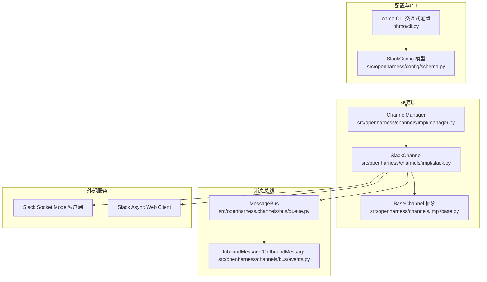
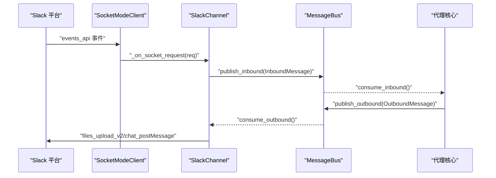
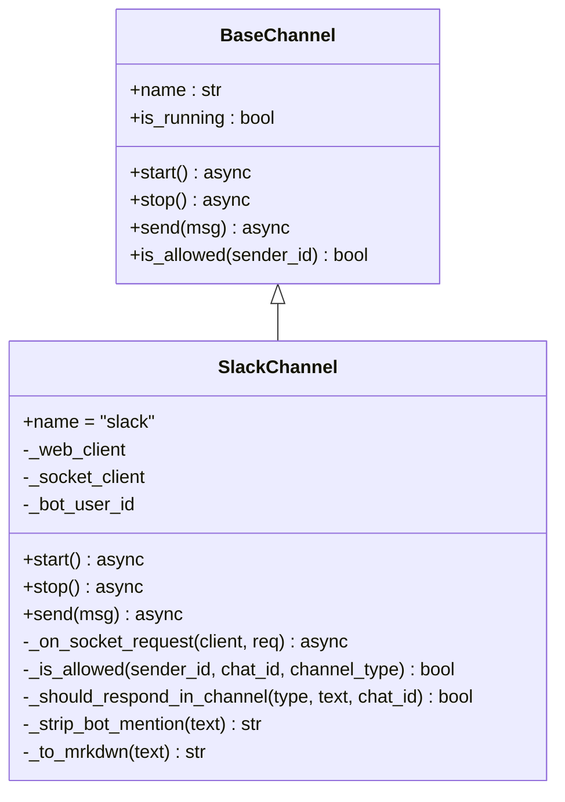
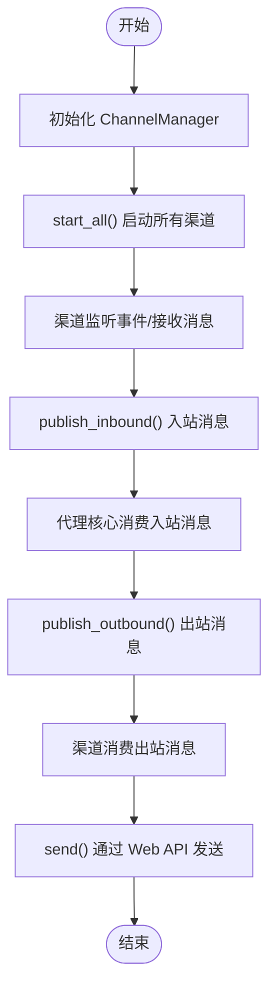
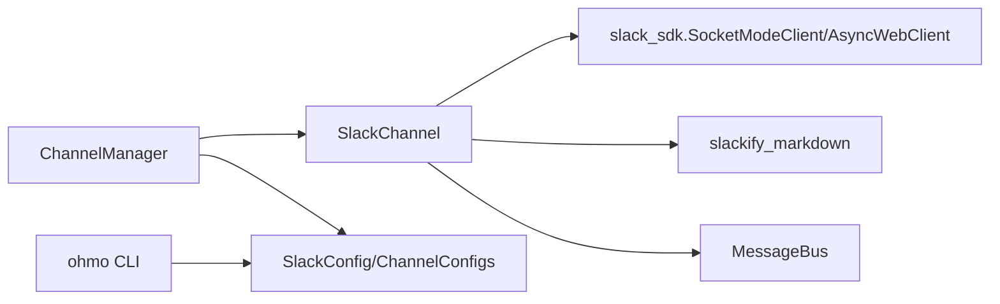

# Slack 渠道

<cite>
**本文引用的文件**
- [slack.py](file://src/openharness/channels/impl/slack.py)
- [base.py](file://src/openharness/channels/impl/base.py)
- [manager.py](file://src/openharness/channels/impl/manager.py)
- [schema.py](file://src/openharness/config/schema.py)
- [events.py](file://src/openharness/channels/bus/events.py)
- [queue.py](file://src/openharness/channels/bus/queue.py)
- [cli.py](file://ohmo/cli.py)
- [test_gateway.py](file://tests/test_ohmo/test_gateway.py)
</cite>

## 目录
1. [简介](#简介)
2. [项目结构](#项目结构)
3. [核心组件](#核心组件)
4. [架构总览](#架构总览)
5. [详细组件分析](#详细组件分析)
6. [依赖关系分析](#依赖关系分析)
7. [性能考量](#性能考量)
8. [故障排除指南](#故障排除指南)
9. [结论](#结论)
10. [附录](#附录)

## 简介
本文件面向 OpenHarness 的 Slack 渠道集成，提供从平台配置到 API 集成、线程与权限策略、Markdown 转换、文件上传、以及故障排除的完整说明。文档基于仓库中现有的 Slack 实现进行整理，帮助读者快速理解如何在 OpenHarness 中启用并安全地使用 Slack 渠道。

## 项目结构
OpenHarness 将“渠道”抽象为统一接口，Slack 作为其中一种实现，通过 Socket Mode 接收事件并通过 Web API 发送消息。消息通过消息总线在渠道与代理核心之间解耦传递。

图表来源
- [slack.py:1-285](file://src/openharness/channels/impl/slack.py#L1-L285)
- [base.py:1-142](file://src/openharness/channels/impl/base.py#L1-L142)
- [manager.py:1-258](file://src/openharness/channels/impl/manager.py#L1-L258)
- [schema.py:1-119](file://src/openharness/config/schema.py#L1-L119)
- [events.py:1-39](file://src/openharness/channels/bus/events.py#L1-L39)
- [queue.py:1-45](file://src/openharness/channels/bus/queue.py#L1-L45)
- [cli.py:220-253](file://ohmo/cli.py#L220-L253)

章节来源
- [slack.py:1-285](file://src/openharness/channels/impl/slack.py#L1-L285)
- [manager.py:1-258](file://src/openharness/channels/impl/manager.py#L1-L258)
- [schema.py:1-119](file://src/openharness/config/schema.py#L1-L119)
- [events.py:1-39](file://src/openharness/channels/bus/events.py#L1-L39)
- [queue.py:1-45](file://src/openharness/channels/bus/queue.py#L1-L45)
- [cli.py:220-253](file://ohmo/cli.py#L220-L253)

## 核心组件
- SlackChannel：基于 Socket Mode 的 Slack 渠道实现，负责连接、事件处理、消息发送与权限控制。
- BaseChannel：所有渠道的抽象基类，定义通用生命周期与消息处理接口。
- ChannelManager：协调各渠道的启停、出站分发与状态查询。
- MessageBus：异步消息总线，解耦渠道与代理核心。
- SlackConfig：Slack 渠道配置模型（含 Bot Token、App Token、签名密钥等）。
- ohmo CLI：交互式引导用户填写 Slack 配置项（Bot Token、App Token、回复策略等）。

章节来源
- [slack.py:21-285](file://src/openharness/channels/impl/slack.py#L21-L285)
- [base.py:34-142](file://src/openharness/channels/impl/base.py#L34-L142)
- [manager.py:17-258](file://src/openharness/channels/impl/manager.py#L17-L258)
- [schema.py:42-46](file://src/openharness/config/schema.py#L42-L46)
- [cli.py:220-253](file://ohmo/cli.py#L220-L253)

## 架构总览
下图展示 Slack 渠道在 OpenHarness 中的运行时交互：Socket Mode 接收事件，Web API 发送消息，消息经由消息总线进入代理核心，再由代理核心通过出站队列回写至渠道。

图表来源
- [slack.py:108-205](file://src/openharness/channels/impl/slack.py#L108-L205)
- [queue.py:20-34](file://src/openharness/channels/bus/queue.py#L20-L34)
- [events.py:8-39](file://src/openharness/channels/bus/events.py#L8-L39)

## 详细组件分析

### SlackChannel 组件
- 连接与启动
  - 使用 App Token 初始化 SocketModeClient，使用 Bot Token 初始化 AsyncWebClient。
  - 启动后注册事件监听器，并调用 auth_test 解析 bot_user_id 以支持提及识别。
- 事件处理
  - 仅处理 events_api 类型请求；先立即响应 SocketModeResponse，再解析事件。
  - 忽略子类型非空的消息（系统/机器人消息），避免重复处理。
  - 支持两种触发路径：app_mention 与带机器人提及的 message。
  - 可选添加反应（如 :eyes:）以提升可发现性。
  - 将 thread_ts、chat_type 等元数据透传给上游，用于会话路由。
- 权限与回复策略
  - 私聊（IM）与群组/频道分别采用不同策略：
    - 私聊：可配置允许白名单或开放策略。
    - 群组/频道：支持“仅提及”、“总是回复”、“白名单”三种策略。
  - reply_in_thread 控制是否在无 thread_ts 时自动开启线程回复。
- 发送消息
  - 文本内容通过 Markdown 到 mrkdwn 的转换函数处理表格、代码、URL 等。
  - 文件上传使用 files_upload_v2，支持按 thread_ts 回复。
- 错误处理
  - 对 Socket Mode 关闭失败、文件上传失败、事件处理异常进行日志记录与降级处理。

图表来源
- [base.py:34-142](file://src/openharness/channels/impl/base.py#L34-L142)
- [slack.py:21-285](file://src/openharness/channels/impl/slack.py#L21-L285)

章节来源
- [slack.py:33-65](file://src/openharness/channels/impl/slack.py#L33-L65)
- [slack.py:108-205](file://src/openharness/channels/impl/slack.py#L108-L205)
- [slack.py:206-229](file://src/openharness/channels/impl/slack.py#L206-L229)
- [slack.py:76-107](file://src/openharness/channels/impl/slack.py#L76-L107)
- [slack.py:242-285](file://src/openharness/channels/impl/slack.py#L242-L285)

### BaseChannel 抽象与消息总线
- BaseChannel 提供统一的生命周期与权限检查接口，具体渠道只需实现 start/stop/send。
- MessageBus 通过两个异步队列解耦入站与出站消息，支持进度与工具提示的条件发送。

图表来源
- [manager.py:171-208](file://src/openharness/channels/impl/manager.py#L171-L208)
- [queue.py:20-34](file://src/openharness/channels/bus/queue.py#L20-L34)
- [events.py:8-39](file://src/openharness/channels/bus/events.py#L8-L39)

章节来源
- [base.py:34-142](file://src/openharness/channels/impl/base.py#L34-L142)
- [manager.py:171-208](file://src/openharness/channels/impl/manager.py#L171-L208)
- [queue.py:8-45](file://src/openharness/channels/bus/queue.py#L8-L45)
- [events.py:8-39](file://src/openharness/channels/bus/events.py#L8-L39)

### 配置与 CLI 引导
- SlackConfig 字段包含 bot_token、app_token、signing_secret 等，ChannelManager 基于配置启用对应渠道。
- ohmo CLI 在交互模式下引导用户输入 Slack Bot Token、App Token、回复策略（提及/总是/白名单）、是否按线程回复等。

章节来源
- [schema.py:42-46](file://src/openharness/config/schema.py#L42-L46)
- [manager.py:118-127](file://src/openharness/channels/impl/manager.py#L118-L127)
- [cli.py:220-253](file://ohmo/cli.py#L220-L253)

### 线程与会话路由
- SlackChannel 保留 thread_ts 与 chat_type 元数据，用于区分私聊与群组会话，并在群组场景下按线程隔离会话键。
- 测试用例验证了同一线程内不同发送者使用不同的会话键，确保上下文隔离。

章节来源
- [slack.py:188-202](file://src/openharness/channels/impl/slack.py#L188-L202)
- [test_gateway.py:135-218](file://tests/test_ohmo/test_gateway.py#L135-L218)

### Markdown 到 mrkdwn 转换
- SlackChannel 内置 Markdown 到 Slack mrkdwn 的转换逻辑，支持表格转为“键值对列表”形式、代码块/行内代码保护、标题与粗体修复、裸链接处理等。

章节来源
- [slack.py:242-285](file://src/openharness/channels/impl/slack.py#L242-L285)

## 依赖关系分析
- SlackChannel 依赖：
  - slack_sdk 的 SocketModeClient 与 AsyncWebClient。
  - slackify_markdown 用于基础 Markdown 到 mrkdwn 的转换。
  - 自身的 MessageBus 与 Inbound/Outbound 消息模型。
- ChannelManager 依赖：
  - 各渠道实现模块（动态导入）。
  - 配置模型（ChannelConfigs/SlackConfig）。
- CLI 依赖：
  - ohmo/cli.py 的交互式配置流程，生成/更新 gateway.json 中的 channel_configs。

图表来源
- [slack.py:7-11](file://src/openharness/channels/impl/slack.py#L7-L11)
- [manager.py:118-127](file://src/openharness/channels/impl/manager.py#L118-L127)
- [schema.py:101-113](file://src/openharness/config/schema.py#L101-L113)
- [cli.py:220-253](file://ohmo/cli.py#L220-L253)

章节来源
- [slack.py:7-11](file://src/openharness/channels/impl/slack.py#L7-L11)
- [manager.py:118-127](file://src/openharness/channels/impl/manager.py#L118-L127)
- [schema.py:101-113](file://src/openharness/config/schema.py#L101-L113)
- [cli.py:220-253](file://ohmo/cli.py#L220-L253)

## 性能考量
- Socket Mode 事件处理为异步循环，事件到达即刻 ACK，避免阻塞。
- 出站消息通过消息总线异步分发，ChannelManager 并行启动各渠道。
- 文件上传采用 files_upload_v2，建议控制媒体大小与并发以避免超时。
- Markdown 转换为纯 Python 正则替换，复杂表格可能带来额外开销，建议在上游尽量简化 Markdown。

[本节为一般性指导，不直接分析特定文件]

## 故障排除指南
- 启动失败：检查 bot_token 与 app_token 是否正确配置，且 mode 为 "socket"。
- 无法接收消息：确认 Socket Mode 已启用，且应用已安装到工作区；检查事件订阅与权限范围。
- 无法发送消息：确认 Bot Token 具备相应权限（如 chat:write、files:write）；检查文件大小与格式限制。
- 权限问题：若 allow_from 为空，远程访问将被拒绝；请显式配置允许的用户或群组。
- 线程回复异常：检查 reply_in_thread 与 thread_ts 的组合；群组消息需满足 group_policy 触发条件。
- 日志定位：关注 SlackChannel 的错误与警告日志，尤其是 auth_test、reactions_add、files_upload_v2 失败信息。

章节来源
- [slack.py:35-40](file://src/openharness/channels/impl/slack.py#L35-L40)
- [slack.py:53-58](file://src/openharness/channels/impl/slack.py#L53-L58)
- [slack.py:172-180](file://src/openharness/channels/impl/slack.py#L172-L180)
- [slack.py:103-106](file://src/openharness/channels/impl/slack.py#L103-L106)
- [manager.py:155-161](file://src/openharness/channels/impl/manager.py#L155-L161)

## 结论
OpenHarness 的 Slack 渠道通过 Socket Mode 与 Web API 实现事件接收与消息发送，结合消息总线与严格的权限策略，提供了安全可控的多渠道接入能力。通过 ohmo CLI 的交互式配置，用户可以便捷地完成 Bot Token、App Token 与回复策略的设置。建议在生产环境中遵循最小权限原则，合理配置 group_policy 与 allow_from，并关注文件大小与并发限制以获得稳定体验。

[本节为总结性内容，不直接分析特定文件]

## 附录

### Slack 平台配置与权限范围（基于现有实现）
- OAuth 应用与 Bot Token
  - 通过 ohmo CLI 交互式引导输入 bot_token。
  - SlackChannel 使用该 token 初始化 AsyncWebClient，用于 chat_postMessage 与 files_upload_v2。
- App Token 与 Socket Mode
  - 通过 ohmo CLI 交互式引导输入 app_token。
  - SlackChannel 使用该 token 初始化 SocketModeClient，监听 events_api 事件。
- 权限范围建议
  - chat:write：发送消息。
  - files:write：上传文件。
  - reactions:write：添加反应（如 :eyes:）。
  - channels:read 或 groups:read：读取频道/群组信息（如需要）。
- 签名密钥
  - SlackConfig 包含 signing_secret 字段，便于后续扩展签名验证（当前实现未使用）。

章节来源
- [cli.py:226-233](file://ohmo/cli.py#L226-L233)
- [slack.py:44-48](file://src/openharness/channels/impl/slack.py#L44-L48)
- [slack.py:89-102](file://src/openharness/channels/impl/slack.py#L89-L102)
- [schema.py:42-46](file://src/openharness/config/schema.py#L42-L46)

### Slack API 集成要点
- 实时消息
  - 使用 SocketModeClient 接收 events_api 事件，ACK 后解析消息内容与元数据。
- 频道管理
  - 当前实现未直接调用频道管理 API；如需频道加入/离开等操作，可在上游业务中扩展。
- 用户认证
  - 通过 bot_token 的 auth_test 获取 bot_user_id，用于提及识别与去重。
- 文件上传
  - 使用 files_upload_v2，支持按 thread_ts 回复。
- 块元素与视图系统
  - 当前实现未使用 Slack Block Kit 或 View 系统；如需富交互界面，可在上游扩展。

章节来源
- [slack.py:53-58](file://src/openharness/channels/impl/slack.py#L53-L58)
- [slack.py:96-102](file://src/openharness/channels/impl/slack.py#L96-L102)

### 最佳实践
- 安全
  - 明确 allow_from 白名单，避免空列表导致远程访问被拒绝。
  - 合理选择 group_policy：生产环境推荐“仅提及”或“白名单”，开发/测试可用“总是回复”。
- 性能
  - 控制媒体大小与并发上传，避免超时。
  - 使用线程回复隔离上下文，减少无关干扰。
- 可维护性
  - 保持 bot_token 与 app_token 的最小权限原则。
  - 记录并监控 SlackChannel 的日志，及时发现异常。

章节来源
- [manager.py:155-161](file://src/openharness/channels/impl/manager.py#L155-L161)
- [slack.py:169-170](file://src/openharness/channels/impl/slack.py#L169-L170)