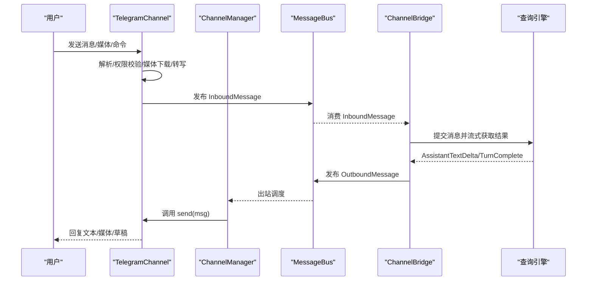
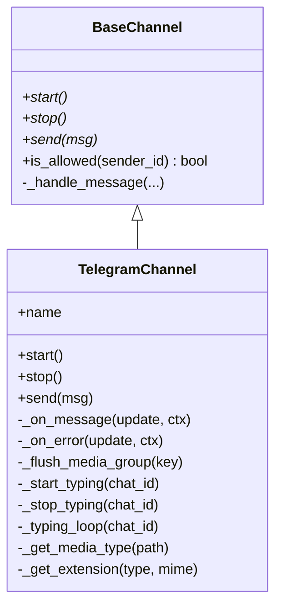
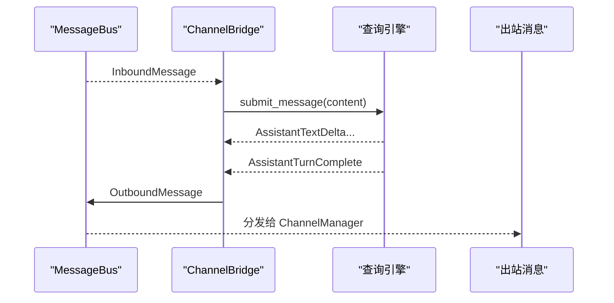
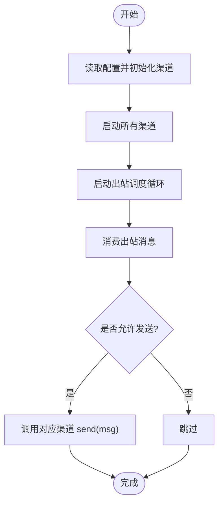
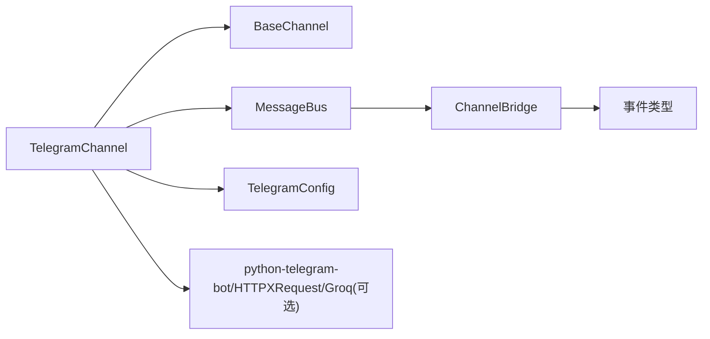

# Telegram 渠道

<cite>
**本文引用的文件**
- [src/openharness/channels/impl/telegram.py](file://src/openharness/channels/impl/telegram.py)
- [src/openharness/channels/impl/base.py](file://src/openharness/channels/impl/base.py)
- [src/openharness/channels/adapter.py](file://src/openharness/channels/adapter.py)
- [src/openharness/channels/bus/events.py](file://src/openharness/channels/bus/events.py)
- [src/openharness/channels/impl/manager.py](file://src/openharness/channels/impl/manager.py)
- [src/openharness/config/schema.py](file://src/openharness/config/schema.py)
- [tests/test_channels/test_telegram_security.py](file://tests/test_channels/test_telegram_security.py)
</cite>

## 目录
1. [简介](#简介)
2. [项目结构](#项目结构)
3. [核心组件](#核心组件)
4. [架构总览](#架构总览)
5. [详细组件分析](#详细组件分析)
6. [依赖关系分析](#依赖关系分析)
7. [性能考量](#性能考量)
8. [故障排除指南](#故障排除指南)
9. [结论](#结论)
10. [附录](#附录)

## 简介
本文件面向在 OpenHarness 中集成 Telegram 渠道的使用者与维护者，系统性说明 Telegram 渠道的配置方法（Bot Token 获取、代理设置、权限控制）、消息收发机制（文本、媒体、键盘回复）、频道组管理与私聊支持、群组权限控制、故障排除与性能优化建议。内容基于仓库中的实际实现进行提炼与可视化，帮助读者快速上手并稳定运行。

## 项目结构
Telegram 渠道位于通道适配层，采用“长轮询”模式连接 Telegram，并通过消息总线与引擎桥接模块协同工作。关键文件与职责如下：
- 渠道实现：TelegramChannel（长轮询、命令处理、消息分发、媒体下载与转写）
- 基类接口：BaseChannel（统一的 start/stop/send 接口与权限校验）
- 消息桥接：ChannelBridge（消费入站消息、调用引擎、发布出站消息）
- 总线事件：InboundMessage/OutboundMessage（消息载体）
- 管理器：ChannelManager（初始化与启动所有启用的渠道，调度出站消息）
- 配置模型：TelegramConfig（Token、代理、回复策略、机器人名称等）

```mermaid
graph TB
subgraph "通道层"
TC["TelegramChannel<br/>长轮询/命令/媒体处理"]
BC["BaseChannel<br/>接口与权限校验"]
end
subgraph "桥接层"
CB["ChannelBridge<br/>入站→引擎→出站"]
end
subgraph "总线层"
BUS["MessageBus<br/>入站/出站队列"]
EV["事件类型<br/>InboundMessage/OutboundMessage"]
end
subgraph "配置层"
CFG["TelegramConfig<br/>Token/代理/权限/名称"]
end
subgraph "管理器"
CM["ChannelManager<br/>启动/停止/调度"]
end
CFG --> TC
BC --> TC
BUS <- --> CB
EV --> BUS
CM --> TC
CM --> CB
```

图表来源
- [src/openharness/channels/impl/telegram.py:95-526](file://src/openharness/channels/impl/telegram.py#L95-L526)
- [src/openharness/channels/impl/base.py:34-142](file://src/openharness/channels/impl/base.py#L34-L142)
- [src/openharness/channels/adapter.py:29-132](file://src/openharness/channels/adapter.py#L29-L132)
- [src/openharness/channels/bus/events.py:8-39](file://src/openharness/channels/bus/events.py#L8-L39)
- [src/openharness/channels/impl/manager.py:17-258](file://src/openharness/channels/impl/manager.py#L17-L258)
- [src/openharness/config/schema.py:34-40](file://src/openharness/config/schema.py#L34-L40)

章节来源
- [src/openharness/channels/impl/telegram.py:1-526](file://src/openharness/channels/impl/telegram.py#L1-L526)
- [src/openharness/channels/impl/base.py:1-142](file://src/openharness/channels/impl/base.py#L1-L142)
- [src/openharness/channels/adapter.py:1-132](file://src/openharness/channels/adapter.py#L1-L132)
- [src/openharness/channels/bus/events.py:1-39](file://src/openharness/channels/bus/events.py#L1-L39)
- [src/openharness/channels/impl/manager.py:1-258](file://src/openharness/channels/impl/manager.py#L1-L258)
- [src/openharness/config/schema.py:1-119](file://src/openharness/config/schema.py#L1-L119)

## 核心组件
- TelegramChannel
  - 职责：建立长轮询连接、注册命令菜单、处理文本/图片/语音/音频/文档消息、媒体下载与语音转写、媒体组聚合、打字指示、错误处理、发送文本/媒体/草稿消息。
  - 关键点：支持代理、最大消息长度拆分、Markdown 到 Telegram HTML 转换、回复到原消息、媒体组缓冲与延迟合并。
- BaseChannel
  - 职责：定义统一接口；提供 allow_from 权限检查；封装入站消息发布到总线。
- ChannelBridge
  - 职责：从总线消费入站消息，调用引擎生成回复，发布出站消息。
- ChannelManager
  - 职责：根据配置启用渠道；启动/停止渠道；调度出站消息到对应渠道。
- 配置模型 TelegramConfig
  - 字段：token、chat_id、proxy、reply_to_message、bot_name、allow_from 等。

章节来源
- [src/openharness/channels/impl/telegram.py:95-526](file://src/openharness/channels/impl/telegram.py#L95-L526)
- [src/openharness/channels/impl/base.py:34-142](file://src/openharness/channels/impl/base.py#L34-L142)
- [src/openharness/channels/adapter.py:29-132](file://src/openharness/channels/adapter.py#L29-L132)
- [src/openharness/channels/impl/manager.py:17-258](file://src/openharness/channels/impl/manager.py#L17-L258)
- [src/openharness/config/schema.py:34-40](file://src/openharness/config/schema.py#L34-L40)

## 架构总览
下图展示 Telegram 渠道在整体系统中的位置与交互流程：



图表来源
- [src/openharness/channels/impl/telegram.py:129-312](file://src/openharness/channels/impl/telegram.py#L129-L312)
- [src/openharness/channels/impl/manager.py:209-239](file://src/openharness/channels/impl/manager.py#L209-L239)
- [src/openharness/channels/adapter.py:78-132](file://src/openharness/channels/adapter.py#L78-L132)
- [src/openharness/channels/bus/events.py:8-39](file://src/openharness/channels/bus/events.py#L8-L39)

## 详细组件分析

### TelegramChannel 组件
- 启动与停止
  - 使用长轮询模式，可选代理；注册命令菜单；启动后持续运行直到 stop。
  - 停止时清理打字指示、取消媒体组任务、关闭应用。
- 命令与消息处理
  - 内置命令：/start、/new、/help；/help 允许绕过 ACL。
  - 文本、图片、语音、音频、文档均支持；媒体组在短时间内聚合为一次对话回合。
- 权限与会话
  - 通过 BaseChannel 的 allow_from 实现白名单控制；支持私聊与群组识别。
- 媒体与转写
  - 下载媒体至本地目录；语音/音频使用 Groq 进行转写；失败时保留占位信息。
- 发送机制
  - 支持普通消息与草稿消息（进度反馈）；自动 HTML 解析失败回退纯文本；可选择回复原消息。
- 错误处理
  - 统一记录 last_error；屏蔽依赖库日志中 Token 泄露风险。



图表来源
- [src/openharness/channels/impl/base.py:34-142](file://src/openharness/channels/impl/base.py#L34-L142)
- [src/openharness/channels/impl/telegram.py:95-526](file://src/openharness/channels/impl/telegram.py#L95-L526)

章节来源
- [src/openharness/channels/impl/telegram.py:129-312](file://src/openharness/channels/impl/telegram.py#L129-L312)
- [src/openharness/channels/impl/telegram.py:352-470](file://src/openharness/channels/impl/telegram.py#L352-L470)
- [src/openharness/channels/impl/telegram.py:471-508](file://src/openharness/channels/impl/telegram.py#L471-L508)
- [src/openharness/channels/impl/telegram.py:514-526](file://src/openharness/channels/impl/telegram.py#L514-L526)
- [src/openharness/channels/impl/base.py:83-137](file://src/openharness/channels/impl/base.py#L83-L137)

### ChannelBridge 组件
- 功能：从总线消费入站消息，调用引擎生成回复，拼装 OutboundMessage 并发布。
- 特性：支持流式增量文本；异常时返回错误提示；空回复跳过发布。



图表来源
- [src/openharness/channels/adapter.py:78-132](file://src/openharness/channels/adapter.py#L78-L132)
- [src/openharness/channels/bus/events.py:27-39](file://src/openharness/channels/bus/events.py#L27-L39)

章节来源
- [src/openharness/channels/adapter.py:29-132](file://src/openharness/channels/adapter.py#L29-L132)
- [src/openharness/channels/bus/events.py:8-39](file://src/openharness/channels/bus/events.py#L8-L39)

### ChannelManager 组件
- 功能：按配置启用渠道；启动/停止所有渠道；出站消息分发到对应渠道；对未知渠道发出警告。
- 进度与工具提示：根据配置开关过滤进度与工具提示消息。



图表来源
- [src/openharness/channels/impl/manager.py:171-239](file://src/openharness/channels/impl/manager.py#L171-L239)

章节来源
- [src/openharness/channels/impl/manager.py:17-258](file://src/openharness/channels/impl/manager.py#L17-L258)

### 配置与权限
- TelegramConfig 字段
  - token：必填，Bot Token
  - proxy：可选，HTTP 代理地址
  - reply_to_message：是否以回复形式发送
  - bot_name：显示在 /start 和 /help 中的机器人名称
  - allow_from：白名单列表，支持通配符与用户名组合匹配
- BaseChannel.allow_from 规则
  - 空列表默认拒绝；存在 "*" 则全部放行；否则按用户 ID 或“ID|用户名”匹配。

章节来源
- [src/openharness/config/schema.py:34-40](file://src/openharness/config/schema.py#L34-L40)
- [src/openharness/channels/impl/base.py:83-94](file://src/openharness/channels/impl/base.py#L83-L94)

## 依赖关系分析
- 渠道实现依赖
  - BaseChannel：统一接口与权限校验
  - MessageBus：入站/出站事件总线
  - ChannelBridge：引擎桥接
  - 配置模型：TelegramConfig
- 外部依赖
  - python-telegram-bot：长轮询、命令、消息处理
  - HTTPXRequest：连接池与超时参数
  - Groq：语音/音频转写（可选）



图表来源
- [src/openharness/channels/impl/telegram.py:9-17](file://src/openharness/channels/impl/telegram.py#L9-L17)
- [src/openharness/channels/impl/base.py:9-11](file://src/openharness/channels/impl/base.py#L9-L11)
- [src/openharness/channels/adapter.py:19-25](file://src/openharness/channels/adapter.py#L19-L25)
- [src/openharness/channels/bus/events.py:3-6](file://src/openharness/channels/bus/events.py#L3-L6)
- [src/openharness/config/schema.py:34-40](file://src/openharness/config/schema.py#L34-L40)

章节来源
- [src/openharness/channels/impl/telegram.py:1-29](file://src/openharness/channels/impl/telegram.py#L1-L29)
- [src/openharness/channels/impl/base.py:1-14](file://src/openharness/channels/impl/base.py#L1-L14)
- [src/openharness/channels/adapter.py:1-27](file://src/openharness/channels/adapter.py#L1-L27)
- [src/openharness/channels/bus/events.py:1-6](file://src/openharness/channels/bus/events.py#L1-L6)
- [src/openharness/config/schema.py:1-16](file://src/openharness/config/schema.py#L1-L16)

## 性能考量
- 连接池与超时
  - 使用较大的连接池大小与合理的超时参数，避免长时间运行出现连接池耗尽或超时。
- 媒体组聚合
  - 对媒体组消息进行短延迟缓冲合并，减少多次回合与重复上下文。
- 打字指示
  - 在处理前启动打字指示，提升用户体验；完成后及时停止。
- 文本拆分
  - 超过最大长度的消息自动拆分发送，避免失败。
- 代理支持
  - 可配置代理以适配网络环境，降低连接失败率。

章节来源
- [src/openharness/channels/impl/telegram.py:140-184](file://src/openharness/channels/impl/telegram.py#L140-L184)
- [src/openharness/channels/impl/telegram.py:431-470](file://src/openharness/channels/impl/telegram.py#L431-L470)
- [src/openharness/channels/impl/telegram.py:486-508](file://src/openharness/channels/impl/telegram.py#L486-L508)
- [src/openharness/channels/impl/telegram.py:278-312](file://src/openharness/channels/impl/telegram.py#L278-L312)

## 故障排除指南
- 启动失败
  - 检查 TelegramConfig.token 是否正确；确认网络可达与代理配置（如需）。
  - 查看 ChannelManager 记录的 last_error，定位具体异常。
- 权限被拒
  - allow_from 为空会导致默认拒绝；请添加允许的用户 ID 或使用 "*" 开放。
  - 用户名匹配规则为“ID|用户名”，确保输入格式正确。
- 媒体发送失败
  - 检查本地媒体目录写入权限；确认文件路径有效；查看错误日志中的失败原因。
- 语音/音频未转写
  - 确认 Groq API Key 已配置；检查网络连通性；查看转写失败日志。
- 日志与调试
  - 依赖库日志中可能包含 URL 与 Token，已通过静默级别降低泄露风险；仍建议在生产环境限制日志级别。

章节来源
- [src/openharness/channels/impl/telegram.py:129-138](file://src/openharness/channels/impl/telegram.py#L129-L138)
- [src/openharness/channels/impl/telegram.py:509-513](file://src/openharness/channels/impl/telegram.py#L509-L513)
- [src/openharness/channels/impl/base.py:83-94](file://src/openharness/channels/impl/base.py#L83-L94)
- [src/openharness/channels/impl/manager.py:163-169](file://src/openharness/channels/impl/manager.py#L163-L169)
- [tests/test_channels/test_telegram_security.py:44-64](file://tests/test_channels/test_telegram_security.py#L44-L64)

## 结论
Telegram 渠道在 OpenHarness 中提供了稳定、可扩展的长轮询接入方式，具备完善的权限控制、媒体处理与转写能力，并通过消息总线与桥接模块无缝对接引擎。遵循本文的配置与排障建议，可在不同网络环境下可靠运行，并根据需要进一步优化性能与安全性。

## 附录

### 配置清单与示例字段
- TelegramConfig
  - token：Bot Token（必填）
  - proxy：代理地址（可选）
  - reply_to_message：是否回复原消息（默认开启）
  - bot_name：机器人名称（用于 /start 与 /help）
  - allow_from：白名单列表（支持 "*" 全放行）
- ProviderConfigs.groq.api_key
  - 用于语音/音频转写（可选，但建议配置以获得最佳体验）

章节来源
- [src/openharness/config/schema.py:22-40](file://src/openharness/config/schema.py#L22-L40)

### 安全与合规建议
- 将 Bot Token 与 API Key 存储在受控环境变量中，避免硬编码。
- 严格控制 allow_from 白名单，优先使用最小权限原则。
- 生产环境降低日志级别，避免敏感信息泄露。
- 定期审查媒体下载目录权限与磁盘空间。

章节来源
- [src/openharness/channels/impl/telegram.py:25-29](file://src/openharness/channels/impl/telegram.py#L25-L29)
- [src/openharness/channels/impl/base.py:83-94](file://src/openharness/channels/impl/base.py#L83-L94)