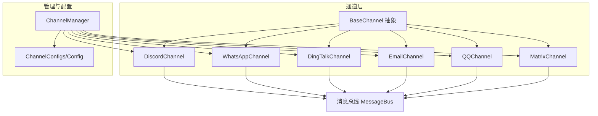
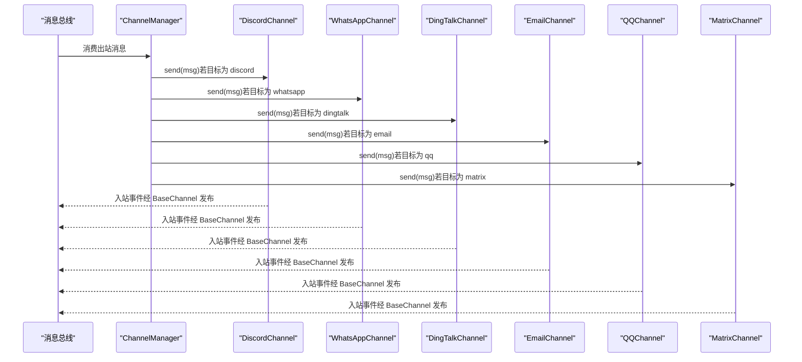
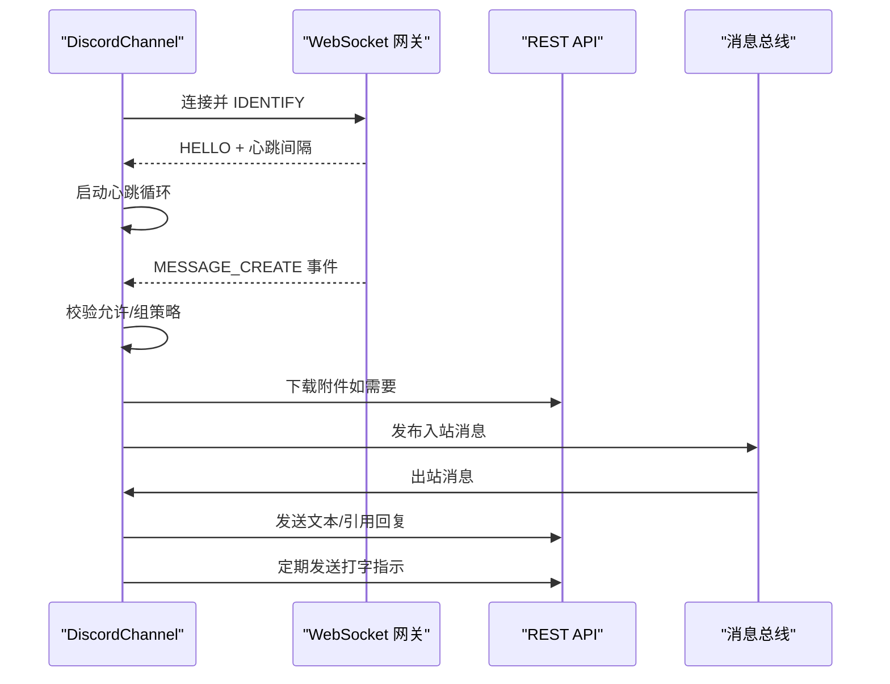
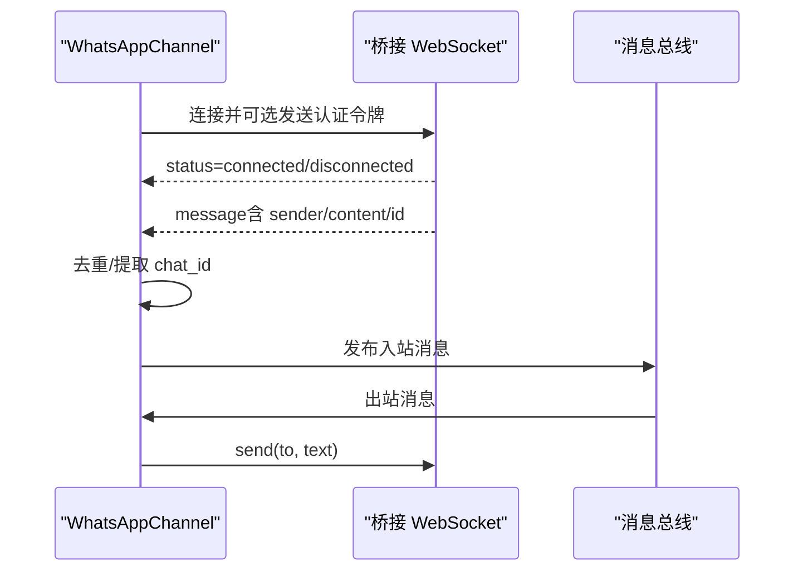
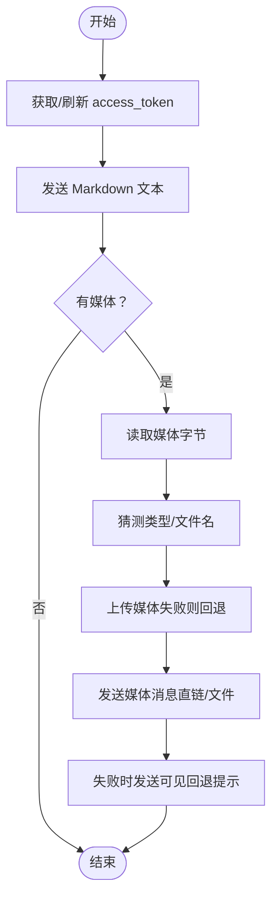
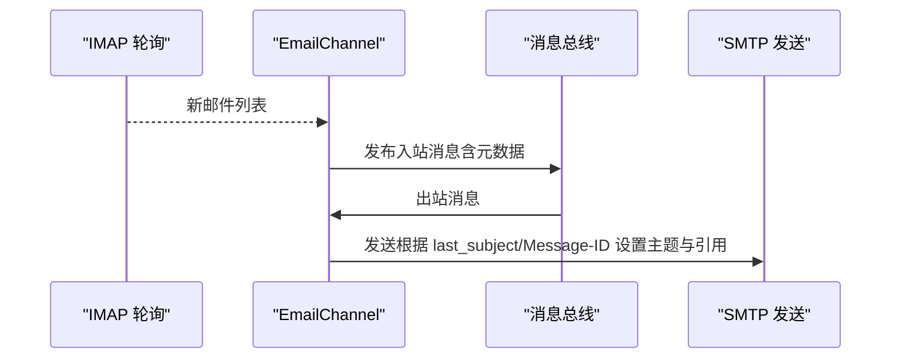
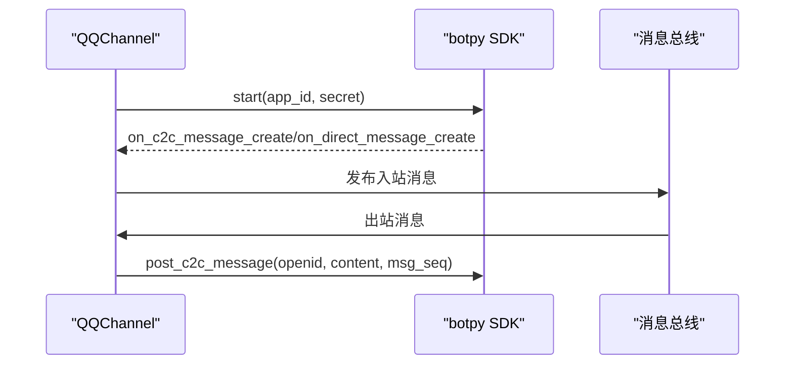
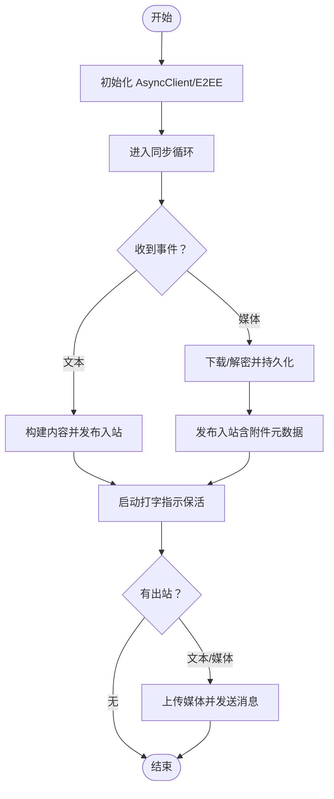
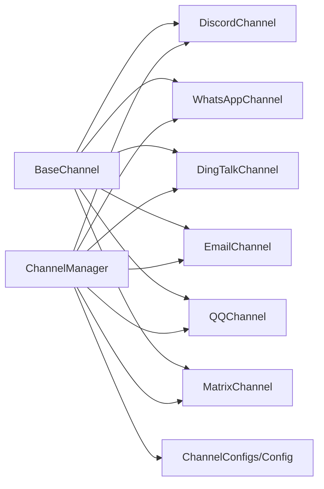

# 其他渠道

<cite>
**本文引用的文件**
- [src/openharness/channels/impl/base.py](file://src/openharness/channels/impl/base.py)
- [src/openharness/channels/impl/discord.py](file://src/openharness/channels/impl/discord.py)
- [src/openharness/channels/impl/whatsapp.py](file://src/openharness/channels/impl/whatsapp.py)
- [src/openharness/channels/impl/dingtalk.py](file://src/openharness/channels/impl/dingtalk.py)
- [src/openharness/channels/impl/email.py](file://src/openharness/channels/impl/email.py)
- [src/openharness/channels/impl/qq.py](file://src/openharness/channels/impl/qq.py)
- [src/openharness/channels/impl/matrix.py](file://src/openharness/channels/impl/matrix.py)
- [src/openharness/channels/impl/manager.py](file://src/openharness/channels/impl/manager.py)
- [src/openharness/config/schema.py](file://src/openharness/config/schema.py)
- [tests/test_channels/test_base.py](file://tests/test_channels/test_base.py)
</cite>

## 目录
1. [简介](#简介)
2. [项目结构](#项目结构)
3. [核心组件](#核心组件)
4. [架构总览](#架构总览)
5. [详细组件分析](#详细组件分析)
6. [依赖关系分析](#依赖关系分析)
7. [性能与限制](#性能与限制)
8. [故障排查指南](#故障排查指南)
9. [结论](#结论)
10. [附录](#附录)

## 简介
本文件面向 OpenHarness 的“其他即时通讯渠道”，系统性梳理 Discord、WhatsApp、钉钉（DingTalk）、邮件（Email）、QQ、Matrix 等渠道的配置、接入方式、消息处理机制、权限策略、性能特征与适用场景，并提供多渠道并行与切换的最佳实践。文档同时总结各渠道的共同特性与差异，帮助在不同业务目标下做出合理选型。

## 项目结构
OpenHarness 将各渠道抽象为统一的通道接口，通过 ChannelManager 统一初始化、启动、停止与消息分发。每种渠道实现遵循 BaseChannel 接口，负责：
- 启动与连接平台（长轮询、WebSocket、REST）
- 解析入站消息与媒体资源
- 执行权限校验与组策略判断
- 将入站消息发布到消息总线
- 从消息总线消费出站消息并发送至平台

图表来源
- [src/openharness/channels/impl/manager.py:17-152](file://src/openharness/channels/impl/manager.py#L17-L152)
- [src/openharness/channels/impl/base.py:34-142](file://src/openharness/channels/impl/base.py#L34-L142)
- [src/openharness/config/schema.py:101-119](file://src/openharness/config/schema.py#L101-L119)

章节来源
- [src/openharness/channels/impl/manager.py:17-152](file://src/openharness/channels/impl/manager.py#L17-L152)
- [src/openharness/channels/impl/base.py:34-142](file://src/openharness/channels/impl/base.py#L34-L142)
- [src/openharness/config/schema.py:101-119](file://src/openharness/config/schema.py#L101-L119)

## 核心组件
- BaseChannel：定义通道通用接口与权限控制、消息封装与发布逻辑；提供媒体目录解析工具。
- ChannelManager：集中管理各通道生命周期与出站消息分发；按配置启用对应通道。
- 各渠道实现：分别对接 Discord、WhatsApp、钉钉、邮件、QQ、Matrix 的协议或 SDK，完成入站监听与出站发送。

章节来源
- [src/openharness/channels/impl/base.py:34-142](file://src/openharness/channels/impl/base.py#L34-L142)
- [src/openharness/channels/impl/manager.py:17-152](file://src/openharness/channels/impl/manager.py#L17-L152)

## 架构总览
下图展示从消息总线到各通道的出站分发流程，以及各通道的入站处理与权限策略：

图表来源
- [src/openharness/channels/impl/manager.py:209-239](file://src/openharness/channels/impl/manager.py#L209-L239)
- [src/openharness/channels/impl/discord.py:78-126](file://src/openharness/channels/impl/discord.py#L78-L126)
- [src/openharness/channels/impl/whatsapp.py:81-96](file://src/openharness/channels/impl/whatsapp.py#L81-L96)
- [src/openharness/channels/impl/dingtalk.py:405-426](file://src/openharness/channels/impl/dingtalk.py#L405-L426)
- [src/openharness/channels/impl/email.py:107-154](file://src/openharness/channels/impl/email.py#L107-L154)
- [src/openharness/channels/impl/qq.py:101-118](file://src/openharness/channels/impl/qq.py#L101-L118)
- [src/openharness/channels/impl/matrix.py:352-382](file://src/openharness/channels/impl/matrix.py#L352-L382)

## 详细组件分析

### Discord 渠道
- 连接方式：WebSocket 网关（Gateway），支持心跳与识别；REST 发送消息。
- 权限与组策略：支持 open/mention 策略；通过机器人用户 ID 识别提及。
- 媒体处理：下载附件到本地媒体目录，支持大小限制与失败回退提示。
- 错误处理：速率限制自动重试；异常时自动重连。
- 典型限制：消息长度上限、附件大小上限、提及触发策略。

图表来源
- [src/openharness/channels/impl/discord.py:39-77](file://src/openharness/channels/impl/discord.py#L39-L77)
- [src/openharness/channels/impl/discord.py:127-168](file://src/openharness/channels/impl/discord.py#L127-L168)
- [src/openharness/channels/impl/discord.py:205-266](file://src/openharness/channels/impl/discord.py#L205-L266)
- [src/openharness/channels/impl/discord.py:78-126](file://src/openharness/channels/impl/discord.py#L78-L126)

章节来源
- [src/openharness/channels/impl/discord.py:24-312](file://src/openharness/channels/impl/discord.py#L24-L312)

### WhatsApp 渠道
- 连接方式：通过 Node.js 桥接 WebSocket，桥接使用 Baileys 协议；Python 侧负责认证与消息转发。
- 权限与组策略：基于 allow_from 白名单；桥接状态（连接/断开）通过状态消息同步。
- 媒体处理：语音消息当前不直接下载，返回转录不可用提示；消息去重（有序字典维护消息 ID）。
- 错误处理：连接异常自动重连；消息解析失败记录日志。

图表来源
- [src/openharness/channels/impl/whatsapp.py:34-71](file://src/openharness/channels/impl/whatsapp.py#L34-L71)
- [src/openharness/channels/impl/whatsapp.py:97-160](file://src/openharness/channels/impl/whatsapp.py#L97-L160)

章节来源
- [src/openharness/channels/impl/whatsapp.py:17-160](file://src/openharness/channels/impl/whatsapp.py#L17-L160)

### 钉钉（DingTalk）渠道
- 连接方式：Stream 模式（WebSocket）接收事件；HTTP API 发送消息（SDK 主要用于接收）。
- 认证与令牌：通过 client_id/client_secret 获取 access_token 并定时刷新。
- 媒体处理：支持图片/语音/视频/文件上传；优先直链发送，失败回退上传；失败时发送可见回退提示。
- 限制与策略：当前仅支持私聊；群聊消息接收但回复为私聊给发送者。
- 错误处理：SDK 断开自动重连；上传/发送失败记录错误并回退。

图表来源
- [src/openharness/channels/impl/dingtalk.py:176-202](file://src/openharness/channels/impl/dingtalk.py#L176-L202)
- [src/openharness/channels/impl/dingtalk.py:221-262](file://src/openharness/channels/impl/dingtalk.py#L221-L262)
- [src/openharness/channels/impl/dingtalk.py:263-297](file://src/openharness/channels/impl/dingtalk.py#L263-L297)
- [src/openharness/channels/impl/dingtalk.py:405-426](file://src/openharness/channels/impl/dingtalk.py#L405-L426)

章节来源
- [src/openharness/channels/impl/dingtalk.py:93-446](file://src/openharness/channels/impl/dingtalk.py#L93-L446)

### 邮件（Email）渠道
- 连接方式：IMAP 轮询未读；SMTP 回复。
- 权限与策略：需显式同意（consent_granted）；auto_reply_enabled 控制自动回复；按收件人维护主题与 Message-ID 以便引用回复。
- 媒体处理：不支持直接媒体下载；正文解析与 HTML 转换。
- 错误处理：轮询异常记录；SMTP 发送异常抛出。

图表来源
- [src/openharness/channels/impl/email.py:63-102](file://src/openharness/channels/impl/email.py#L63-L102)
- [src/openharness/channels/impl/email.py:107-154](file://src/openharness/channels/impl/email.py#L107-L154)

章节来源
- [src/openharness/channels/impl/email.py:27-411](file://src/openharness/channels/impl/email.py#L27-L411)

### QQ 渠道
- 连接方式：botpy SDK，WebSocket；支持公共消息与私聊。
- 媒体处理：当前实现聚焦文本；消息去重（固定长度双端队列）。
- 错误处理：异常自动重连；发送失败记录日志。

图表来源
- [src/openharness/channels/impl/qq.py:63-90](file://src/openharness/channels/impl/qq.py#L63-L90)
- [src/openharness/channels/impl/qq.py:119-142](file://src/openharness/channels/impl/qq.py#L119-L142)

章节来源
- [src/openharness/channels/impl/qq.py:51-142](file://src/openharness/channels/impl/qq.py#L51-L142)

### Matrix 渠道
- 连接方式：nio SDK 长轮询同步；支持 E2EE；媒体下载/解密/上传。
- 媒体处理：支持图片/音频/视频/文件；带宽受限时进行大小检查与失败标记；线程/提及元数据透传。
- 错误处理：同步/加入/发送错误分级记录；打字指示保活；设备信息缺失时警告。
- 限制：服务器上传限制查询与本地配置取最小值；加密房间需正确配置 E2EE。

图表来源
- [src/openharness/channels/impl/matrix.py:162-214](file://src/openharness/channels/impl/matrix.py#L162-L214)
- [src/openharness/channels/impl/matrix.py:448-456](file://src/openharness/channels/impl/matrix.py#L448-L456)
- [src/openharness/channels/impl/matrix.py:663-701](file://src/openharness/channels/impl/matrix.py#L663-L701)
- [src/openharness/channels/impl/matrix.py:352-382](file://src/openharness/channels/impl/matrix.py#L352-L382)

章节来源
- [src/openharness/channels/impl/matrix.py:146-701](file://src/openharness/channels/impl/matrix.py#L146-L701)

## 依赖关系分析
- 通道统一继承自 BaseChannel，共享权限校验与消息发布能力。
- ChannelManager 动态导入各通道实现，按配置启用；出站分发由消息总线驱动。
- 各通道对第三方 SDK 或服务的依赖独立封装，便于替换与扩展。

图表来源
- [src/openharness/channels/impl/manager.py:35-152](file://src/openharness/channels/impl/manager.py#L35-L152)
- [src/openharness/channels/impl/base.py:34-142](file://src/openharness/channels/impl/base.py#L34-L142)
- [src/openharness/config/schema.py:101-119](file://src/openharness/config/schema.py#L101-L119)

章节来源
- [src/openharness/channels/impl/manager.py:17-258](file://src/openharness/channels/impl/manager.py#L17-L258)
- [src/openharness/channels/impl/base.py:34-142](file://src/openharness/channels/impl/base.py#L34-L142)

## 性能与限制
- 连接模式与吞吐
  - Discord/Matrix：WebSocket/长轮询，事件驱动，低延迟。
  - WhatsApp：桥接 WebSocket，依赖桥接稳定性。
  - 钉钉：Stream 接收 + HTTP 发送，适合企业内网。
  - 邮件：IMAP 轮询，延迟较高，适合异步回复。
  - QQ：SDK WebSocket，事件驱动。
- 媒体与带宽
  - Matrix 支持媒体上传并受服务器与本地配置双重限制；Discord/QQ/钉钉等具备各自大小限制与类型支持。
- 速率限制与重试
  - Discord 对 REST 发送采用指数退避与重试；Matrix/钉钉上传失败回退提示。
- 可靠性
  - 多数通道实现包含自动重连与异常日志；ChannelManager 在启动失败时记录错误并继续运行其他通道。

章节来源
- [src/openharness/channels/impl/discord.py:105-126](file://src/openharness/channels/impl/discord.py#L105-L126)
- [src/openharness/channels/impl/matrix.py:275-299](file://src/openharness/channels/impl/matrix.py#L275-L299)
- [src/openharness/channels/impl/dingtalk.py:263-297](file://src/openharness/channels/impl/dingtalk.py#L263-L297)

## 故障排查指南
- 通道无法启动
  - 检查配置项是否完整（例如 token/app_id/secret、客户端凭据）。
  - 查看 ChannelManager 启动日志中的异常与 last_error 字段。
- 权限拒绝
  - BaseChannel 的 is_allowed 默认要求 allow_from 非空且明确白名单；设置 ["*"] 开放或添加具体 ID。
- 媒体问题
  - Matrix：检查服务器上传限制与本地配置；加密房间注意 E2EE 配置。
  - 钉钉：上传失败会回退为可见提示；检查 access_token 与网络。
  - Discord/QQ：检查大小限制与下载/上传路径权限。
- 邮件
  - 确认 consent_granted 已开启；SMTP/IMAP 凭据正确；auto_reply_enabled 与主题前缀设置。
- 通道状态
  - 使用 ChannelManager.get_status 获取各通道运行状态。

章节来源
- [src/openharness/channels/impl/base.py:83-94](file://src/openharness/channels/impl/base.py#L83-L94)
- [src/openharness/channels/impl/manager.py:155-162](file://src/openharness/channels/impl/manager.py#L155-L162)
- [src/openharness/channels/impl/manager.py:244-252](file://src/openharness/channels/impl/manager.py#L244-L252)

## 结论
OpenHarness 的其他渠道均遵循统一的通道抽象与消息总线模型，具备一致的权限控制与消息发布机制。不同渠道在连接方式、媒体处理与平台特性上存在差异，应结合业务场景（实时性、媒体需求、合规与部署环境）进行选型。推荐优先启用白名单 allow_from，配合多渠道并行与出站分发策略，实现灵活的跨平台消息编排。

## 附录

### 配置要点与差异速览
- 通用配置
  - enabled：是否启用该通道
  - allow_from：允许的发送方标识列表（默认空表示拒绝所有）
- 渠道特有
  - Discord：token、网关地址、意图（intents）、组策略（open/mention）
  - WhatsApp：bridge_url、bridge_token（可选）
  - 钉钉：client_id、client_secret、robot_code
  - 邮件：consent_granted、smtp/imap 凭据、auto_reply_enabled、subject_prefix
  - QQ：app_id、secret
  - Matrix：homeserver、access_token、user_id、device_id、E2EE 开关、上传限制

章节来源
- [src/openharness/config/schema.py:26-119](file://src/openharness/config/schema.py#L26-L119)

### 媒体目录解析与测试
- 媒体目录解析规则：优先使用 OHMO_WORKSPACE 下的 attachments 子目录，否则使用 OPENHARNESS_DATA_DIR 下的 media 子目录；最终按通道名创建子目录。
- 测试验证：通过环境变量覆盖默认根目录，确保解析结果符合预期。

章节来源
- [src/openharness/channels/impl/base.py:16-32](file://src/openharness/channels/impl/base.py#L16-L32)
- [tests/test_channels/test_base.py:6-28](file://tests/test_channels/test_base.py#L6-L28)