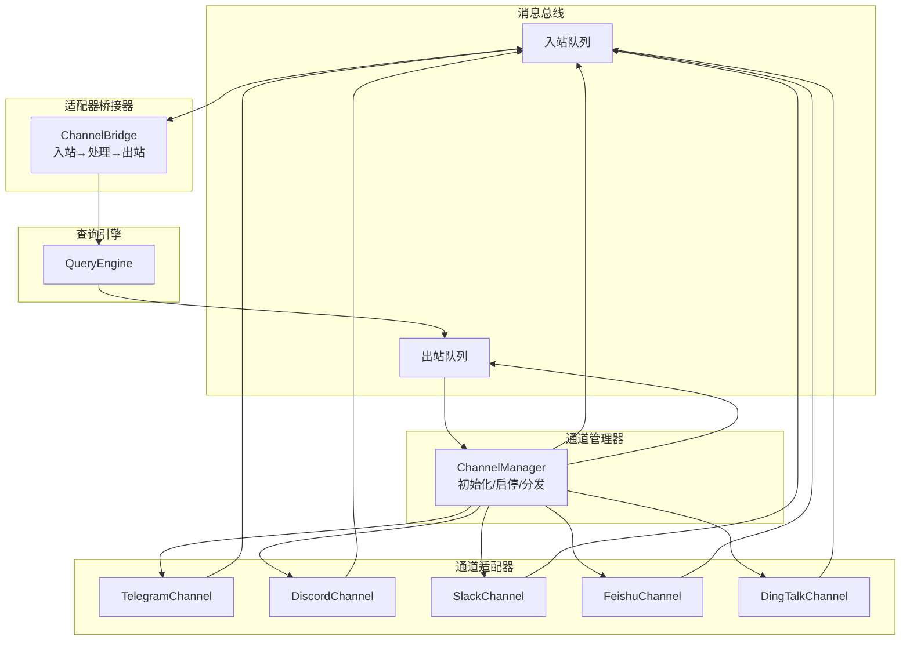
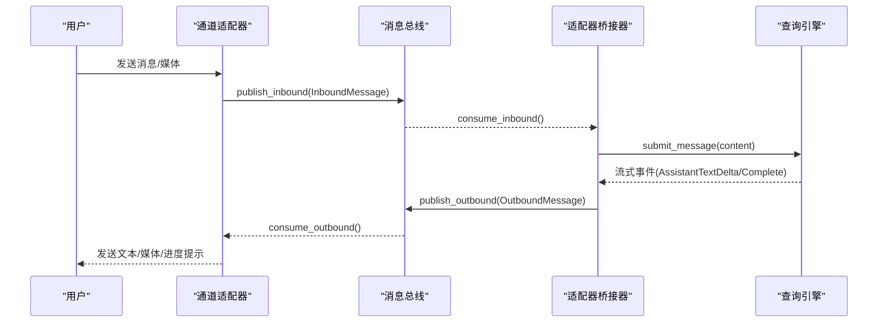
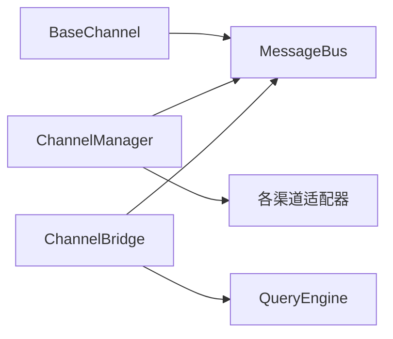
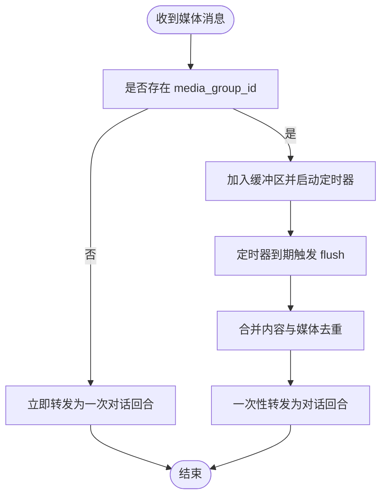
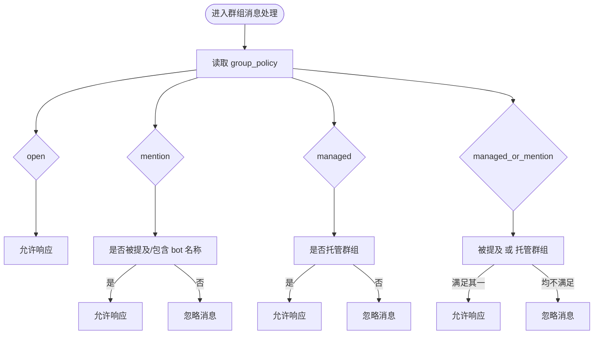

# 即时通讯渠道集成

<cite>
**本文引用的文件**
- [channels/__init__.py](file://src/openharness/channels/__init__.py)
- [channels/adapter.py](file://src/openharness/channels/adapter.py)
- [channels/bus/events.py](file://src/openharness/channels/bus/events.py)
- [channels/bus/queue.py](file://src/openharness/channels/bus/queue.py)
- [channels/impl/base.py](file://src/openharness/channels/impl/base.py)
- [channels/impl/manager.py](file://src/openharness/channels/impl/manager.py)
- [channels/impl/telegram.py](file://src/openharness/channels/impl/telegram.py)
- [channels/impl/discord.py](file://src/openharness/channels/impl/discord.py)
- [channels/impl/slack.py](file://src/openharness/channels/impl/slack.py)
- [channels/impl/feishu.py](file://src/openharness/channels/impl/feishu.py)
- [channels/impl/dingtalk.py](file://src/openharness/channels/impl/dingtalk.py)
- [config/schema.py](file://src/openharness/config/schema.py)
- [tests/test_channels/test_telegram_security.py](file://tests/test_channels/test_telegram_security.py)
- [tests/test_channels/test_feishu_security.py](file://tests/test_channels/test_feishu_security.py)
</cite>

## 目录
1. [简介](#简介)
2. [项目结构](#项目结构)
3. [核心组件](#核心组件)
4. [架构总览](#架构总览)
5. [详细组件分析](#详细组件分析)
6. [依赖关系分析](#依赖关系分析)
7. [性能考虑](#性能考虑)
8. [故障排除指南](#故障排除指南)
9. [结论](#结论)
10. [附录](#附录)

## 简介
本文件面向 OpenHarness 的即时通讯渠道集成，系统性阐述支持的渠道类型与特性、通道适配器架构与实现原理、消息路由与状态同步机制、附件处理策略、配置指南（含 API 密钥与机器人设置）、自定义渠道开发模板与最佳实践，以及常见问题排查与性能优化建议。目标是帮助开发者快速理解并扩展多平台即时通讯能力。

## 项目结构
OpenHarness 的即时通讯子系统采用“消息总线 + 渠道适配器”的解耦架构：
- 消息总线负责在通道与查询引擎之间传递入站/出站消息
- 渠道适配器封装具体平台的接入细节（长连接、轮询、REST、WebSocket 等）
- 通道管理器统一初始化、启动、停止各渠道，并负责出站消息分发
- 适配器桥接器将入站消息交给查询引擎，再把回复通过总线回传给对应渠道

图表来源
- [channels/bus/queue.py:8-45](file://src/openharness/channels/bus/queue.py#L8-L45)
- [channels/impl/manager.py:17-258](file://src/openharness/channels/impl/manager.py#L17-L258)
- [channels/adapter.py:29-132](file://src/openharness/channels/adapter.py#L29-L132)
- [channels/impl/telegram.py:95-526](file://src/openharness/channels/impl/telegram.py#L95-L526)
- [channels/impl/discord.py:24-312](file://src/openharness/channels/impl/discord.py#L24-L312)
- [channels/impl/slack.py:21-285](file://src/openharness/channels/impl/slack.py#L21-L285)
- [channels/impl/feishu.py:411-800](file://src/openharness/channels/impl/feishu.py#L411-L800)

章节来源
- [channels/__init__.py:1-23](file://src/openharness/channels/__init__.py#L1-L23)
- [channels/bus/queue.py:8-45](file://src/openharness/channels/bus/queue.py#L8-L45)
- [channels/impl/manager.py:17-258](file://src/openharness/channels/impl/manager.py#L17-L258)

## 核心组件
- 消息事件模型
  - 入站消息：包含渠道名、发送者标识、会话标识、内容、时间戳、媒体列表、元数据、会话键覆盖
  - 出站消息：包含目标渠道、会话标识、内容、可选回复引用、媒体列表、元数据
- 消息总线：提供异步队列接口，屏蔽通道与引擎之间的耦合
- 通道基类：定义统一的生命周期与发送接口；内置访问控制与入站转发逻辑
- 通道管理器：按配置启用渠道，统一启动/停止与出站分发
- 适配器桥接器：消费入站消息，调用查询引擎，聚合流式事件后发布出站消息

章节来源
- [channels/bus/events.py:8-39](file://src/openharness/channels/bus/events.py#L8-L39)
- [channels/bus/queue.py:8-45](file://src/openharness/channels/bus/queue.py#L8-L45)
- [channels/impl/base.py:34-142](file://src/openharness/channels/impl/base.py#L34-L142)
- [channels/impl/manager.py:17-258](file://src/openharness/channels/impl/manager.py#L17-L258)
- [channels/adapter.py:29-132](file://src/openharness/channels/adapter.py#L29-L132)

## 架构总览
下图展示从用户消息到回复的完整链路：通道接收 → 总线入站 → 桥接器处理 → 查询引擎 → 总线出站 → 通道发送。

图表来源
- [channels/adapter.py:78-132](file://src/openharness/channels/adapter.py#L78-L132)
- [channels/bus/queue.py:20-34](file://src/openharness/channels/bus/queue.py#L20-L34)
- [channels/bus/events.py:8-39](file://src/openharness/channels/bus/events.py#L8-L39)

## 详细组件分析

### 渠道适配器架构与实现原理
- 统一抽象
  - 所有渠道继承自 BaseChannel，必须实现 start/stop/send 三方法
  - 内置 is_allowed 访问控制，默认空白名单拒绝，支持通配符与多身份组合匹配
  - 提供 _handle_message 将标准化消息发布到总线
- 运行时与资源管理
  - 各渠道自行维护长连接或轮询任务，错误记录于 last_error
  - 出站分发由 ChannelManager 负责，按消息目标渠道选择对应适配器
- 安全与合规
  - 入站媒体下载路径受控，避免路径穿越
  - 部分渠道对提及/群组策略进行过滤，避免未授权响应

章节来源
- [channels/impl/base.py:34-142](file://src/openharness/channels/impl/base.py#L34-L142)
- [channels/impl/manager.py:163-239](file://src/openharness/channels/impl/manager.py#L163-L239)

### 支持的渠道与特色功能
- Telegram
  - 特色：长轮询、命令菜单、媒体组聚合、语音转写（可选）、打字指示、分片发送
  - 安全：令牌日志降噪、媒体下载目录隔离
- Discord
  - 特色：WebSocket 网关、心跳、提及检测、速率限制重试、打字指示
  - 安全：附件大小限制、无效会话自动重连
- Slack
  - 特色：Socket Mode、线程回复、表情反应、Markdown 到 mrkdwn 转换、提及去噪
  - 安全：事件去重（提及与消息事件共存时优先处理提及）
- Feishu/Lark
  - 特色：WebSocket 长连接、富文本/交互卡片渲染、提及解析、托管群组策略、表情反应
  - 安全：严格文件名与保存路径处理，防止路径穿越；群组策略可配置为“被提及/托管群”
- DingTalk
  - 特色：Stream Mode 接收、HTTP API 发送、媒体上传、私聊模式
  - 安全：令牌刷新与过期管理，媒体读取与上传失败可见反馈

章节来源
- [channels/impl/telegram.py:95-526](file://src/openharness/channels/impl/telegram.py#L95-L526)
- [channels/impl/discord.py:24-312](file://src/openharness/channels/impl/discord.py#L24-L312)
- [channels/impl/slack.py:21-285](file://src/openharness/channels/impl/slack.py#L21-L285)
- [channels/impl/feishu.py:411-800](file://src/openharness/channels/impl/feishu.py#L411-L800)
- [channels/impl/dingtalk.py:93-446](file://src/openharness/channels/impl/dingtalk.py#L93-L446)

### 消息路由、状态同步与附件处理
- 消息路由
  - 入站：通道适配器将消息封装为 InboundMessage 并发布到总线
  - 出站：ChannelManager 消费出站队列，按消息 channel 字段选择适配器并调用 send
- 状态同步
  - 通道内维护打字指示任务、心跳任务、媒体组缓冲与去重
  - 通道管理器记录每个通道运行状态与最后错误
- 附件处理
  - 下载至受控目录（优先 OHMO 工作区附件目录），避免路径穿越
  - 不同渠道对媒体类型与长度进行适配（如 Telegram 分片、Discord 20MB 限制）

章节来源
- [channels/impl/manager.py:209-239](file://src/openharness/channels/impl/manager.py#L209-L239)
- [channels/impl/base.py:16-31](file://src/openharness/channels/impl/base.py#L16-L31)
- [tests/test_channels/test_feishu_security.py:18-75](file://tests/test_channels/test_feishu_security.py#L18-L75)

### 配置指南（API 密钥、机器人设置、权限）
- 通用配置项
  - 允许列表 allow_from：默认空表示拒绝所有，设置为 ["*"] 开放
  - 通道开关 enabled：true/false 控制是否启用
- 平台特定配置
  - Telegram：token、proxy、reply_to_message、bot_name
  - Discord：token、gateway_url、intents、group_policy
  - Slack：bot_token、app_token、signing_secret、reply_in_thread、react_emoji、dm/group 策略
  - Feishu：app_id、app_secret、encrypt_key、verification_token、group_policy、bot_open_id、bot_names
  - DingTalk：client_id、client_secret、robot_code
  - 其他：Email、QQ、Matrix、WhatsApp、Mochat 等
- 生成与更新
  - CLI 可引导生成配置，部分平台提供交互式参数输入
  - 更新后需重启通道以生效

章节来源
- [config/schema.py:26-118](file://src/openharness/config/schema.py#L26-L118)
- [ohmo/cli.py:251-309](file://ohmo/cli.py#L251-L309)

### 自定义渠道开发指南
- 开发步骤
  - 继承 BaseChannel，实现 start/stop/send
  - 在 ChannelManager 中注册新渠道（参考现有实现）
  - 使用 resolve_channel_media_dir 管理媒体下载目录
  - 通过 _handle_message 将标准化消息发布到总线
- 最佳实践
  - 明确接入方式（轮询/长连接/WebSocket/REST），合理设置超时与重连
  - 实现访问控制与策略过滤（提及/群组/托管）
  - 处理媒体下载与上传，注意安全与大小限制
  - 记录 last_error，便于管理器与监控告警
  - 提供最小可用配置项与默认值，保证开箱即用

章节来源
- [channels/impl/base.py:34-142](file://src/openharness/channels/impl/base.py#L34-L142)
- [channels/impl/manager.py:35-153](file://src/openharness/channels/impl/manager.py#L35-L153)

## 依赖关系分析
- 组件耦合
  - 通道适配器仅依赖总线与配置，低耦合
  - 通道管理器集中编排，避免跨通道重复逻辑
  - 适配器桥接器只依赖总线与查询引擎，职责单一
- 外部依赖
  - Telegram：python-telegram-bot
  - Discord：websockets/httpx
  - Slack：slack_sdk.socket_mode
  - Feishu：lark-oapi（可选）
  - DingTalk：dingtalk-stream（可选）

图表来源
- [channels/impl/base.py:34-81](file://src/openharness/channels/impl/base.py#L34-L81)
- [channels/impl/manager.py:17-34](file://src/openharness/channels/impl/manager.py#L17-L34)
- [channels/adapter.py:29-41](file://src/openharness/channels/adapter.py#L29-L41)

章节来源
- [channels/impl/base.py:34-81](file://src/openharness/channels/impl/base.py#L34-L81)
- [channels/impl/manager.py:17-34](file://src/openharness/channels/impl/manager.py#L17-L34)
- [channels/adapter.py:29-41](file://src/openharness/channels/adapter.py#L29-L41)

## 性能考虑
- 队列背压与限流
  - 使用 asyncio.Queue 实现背压，避免内存膨胀
  - 出站分发根据目标通道并发发送，必要时增加节流
- 消息拆分与传输
  - 针对平台字符上限进行内容拆分（如 Telegram）
  - 附件上传采用分块/断点续传（如 Feishu/Slack）
- 连接与心跳
  - WebSocket/长连接应设置合理的超时与心跳间隔
  - 速率限制场景需实现指数退避与重试
- 媒体处理
  - 下载与上传分离线程/进程，避免阻塞主循环
  - 对大文件采用直链或临时存储策略

## 故障排除指南
- 常见问题定位
  - 通道无法启动：检查 token/app_id/app_secret 等密钥是否正确；查看通道 last_error
  - 无消息响应：确认 allow_from 是否为空导致拒绝；检查 group_policy 是否要求提及
  - 媒体发送失败：核对大小限制与类型映射；关注下载/上传错误日志
  - 速率限制：Discord 等平台出现 429 时按 retry-after 重试
- 安全相关
  - Feishu 附件路径穿越防护已内置，确保不信任远端文件名
  - Telegram 令牌日志降噪，避免敏感信息泄露
- 单元测试参考
  - Telegram 安全与错误处理测试
  - Feishu 媒体目录隔离与群组策略测试

章节来源
- [tests/test_channels/test_telegram_security.py:15-65](file://tests/test_channels/test_telegram_security.py#L15-L65)
- [tests/test_channels/test_feishu_security.py:18-75](file://tests/test_channels/test_feishu_security.py#L18-L75)
- [channels/impl/telegram.py:25-29](file://src/openharness/channels/impl/telegram.py#L25-L29)
- [channels/impl/discord.py:109-125](file://src/openharness/channels/impl/discord.py#L109-L125)

## 结论
OpenHarness 的即时通讯子系统通过消息总线与适配器桥接器实现了跨平台的一致接入体验。通道管理器统一编排，适配器聚焦平台差异，既保证了扩展性，也强化了安全性与可观测性。基于本文档，团队可以快速启用新渠道、优化性能并稳定运维。

## 附录

### 关键流程图：Telegram 媒体组聚合

图表来源
- [channels/impl/telegram.py:431-484](file://src/openharness/channels/impl/telegram.py#L431-L484)

### 关键流程图：Feishu 群组策略判定

图表来源
- [channels/impl/feishu.py:185-204](file://src/openharness/channels/impl/feishu.py#L185-L204)