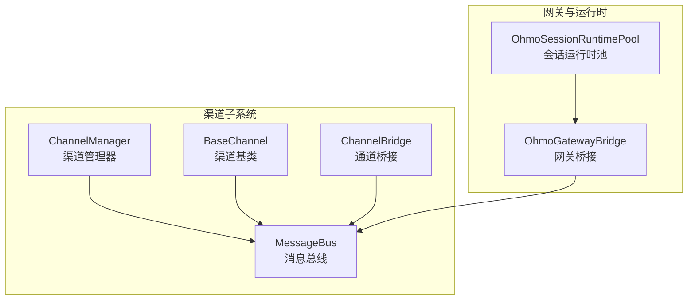
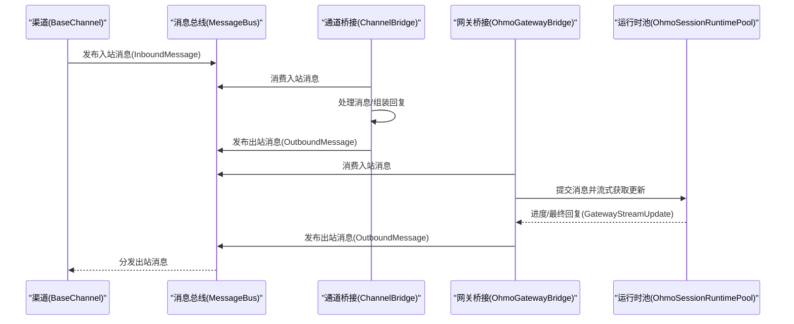
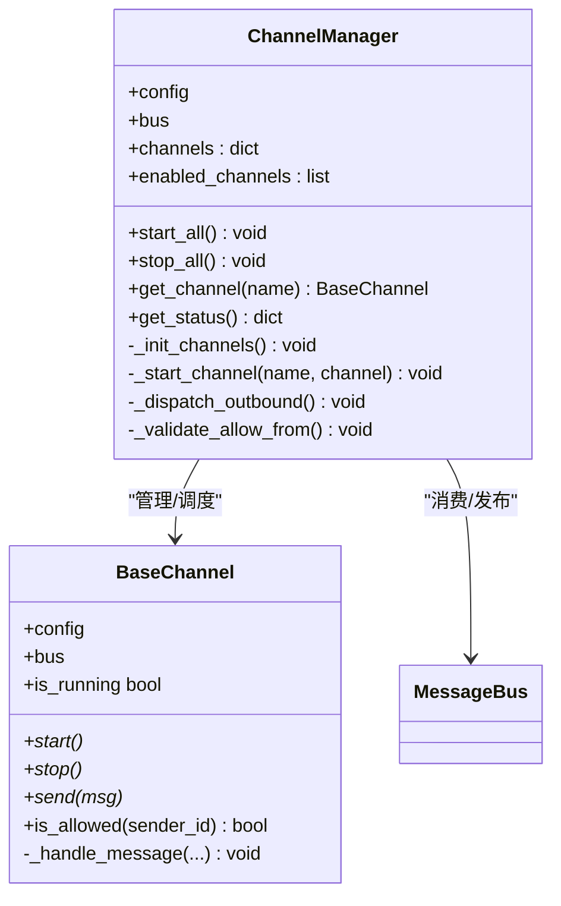
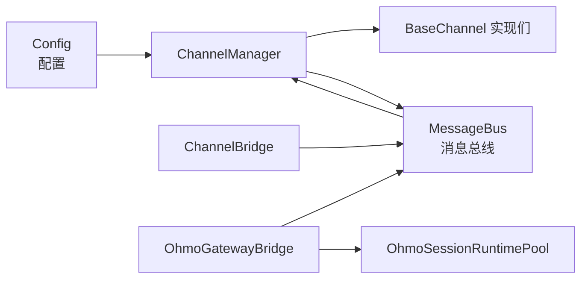

# 渠道管理器

<cite>
**本文引用的文件**
- [channels/__init__.py](file://src/openharness/channels/__init__.py)
- [channels/adapter.py](file://src/openharness/channels/adapter.py)
- [channels/impl/base.py](file://src/openharness/channels/impl/base.py)
- [channels/impl/manager.py](file://src/openharness/channels/impl/manager.py)
- [ohmo/gateway/bridge.py](file://ohmo/gateway/bridge.py)
- [ohmo/gateway/config.py](file://ohmo/gateway/config.py)
- [ohmo/gateway/runtime.py](file://ohmo/gateway/runtime.py)
</cite>

## 目录
1. [简介](#简介)
2. [项目结构](#项目结构)
3. [核心组件](#核心组件)
4. [架构总览](#架构总览)
5. [组件详解](#组件详解)
6. [依赖关系分析](#依赖关系分析)
7. [性能与可扩展性](#性能与可扩展性)
8. [故障排查指南](#故障排查指南)
9. [结论](#结论)
10. [附录：最佳实践与优化建议](#附录最佳实践与优化建议)

## 简介
本文件面向 OpenHarness 的“渠道管理器”（ChannelManager）进行系统化技术文档化，重点覆盖以下方面：
- ChannelManager 的核心职责与架构设计
- 渠道初始化、启动/停止管理、消息路由
- 渠道配置验证与错误处理策略
- 渠道状态监控与健康检查原理
- 生命周期管理最佳实践与性能优化建议

## 项目结构
OpenHarness 将“渠道”能力抽象为独立子系统，并通过消息总线（MessageBus）与引擎层解耦。渠道侧负责接入各类聊天平台（如 Telegram、Discord、Slack 等），并通过桥接组件将入站消息转发给查询引擎或会话运行时，再由出站分发器将回复投递回对应渠道。

图表来源
- [channels/impl/manager.py:17-258](file://src/openharness/channels/impl/manager.py#L17-L258)
- [channels/impl/base.py:34-142](file://src/openharness/channels/impl/base.py#L34-L142)
- [channels/adapter.py:29-132](file://src/openharness/channels/adapter.py#L29-L132)
- [ohmo/gateway/bridge.py:56-410](file://ohmo/gateway/bridge.py#L56-L410)
- [ohmo/gateway/runtime.py:92-1202](file://ohmo/gateway/runtime.py#L92-L1202)

章节来源
- [channels/__init__.py:1-23](file://src/openharness/channels/__init__.py#L1-L23)

## 核心组件
- ChannelManager：集中式渠道生命周期与消息分发控制中心
- BaseChannel：各平台渠道的统一抽象接口
- MessageBus：入站/出站消息队列与事件总线
- ChannelBridge：将入站消息桥接到查询引擎并发布出站消息
- OhmoGatewayBridge：将入站消息桥接到会话运行时池并流式产出更新
- OhmoSessionRuntimePool：按会话键维护运行时生命周期，生成进度/最终回复

章节来源
- [channels/impl/manager.py:17-258](file://src/openharness/channels/impl/manager.py#L17-L258)
- [channels/impl/base.py:34-142](file://src/openharness/channels/impl/base.py#L34-L142)
- [channels/adapter.py:29-132](file://src/openharness/channels/adapter.py#L29-L132)
- [ohmo/gateway/bridge.py:56-410](file://ohmo/gateway/bridge.py#L56-L410)
- [ohmo/gateway/runtime.py:92-1202](file://ohmo/gateway/runtime.py#L92-L1202)

## 架构总览
下图展示从“渠道输入”到“回复输出”的端到端流程，以及与运行时系统的交互：

图表来源
- [channels/adapter.py:78-132](file://src/openharness/channels/adapter.py#L78-L132)
- [ohmo/gateway/bridge.py:77-324](file://ohmo/gateway/bridge.py#L77-L324)
- [ohmo/gateway/runtime.py:219-491](file://ohmo/gateway/runtime.py#L219-L491)

## 组件详解

### ChannelManager：渠道生命周期与消息分发
- 职责
  - 基于配置启用/禁用各渠道（Telegram、WhatsApp、Discord、Feishu、Mochat、DingTalk、Email、Slack、QQ、Matrix）
  - 初始化渠道实例并注入消息总线
  - 启动/停止所有渠道与出站分发任务
  - 出站消息分发：根据目标渠道名选择具体渠道实例发送
- 关键点
  - 渠道初始化采用延迟导入，避免缺失依赖时阻塞其他渠道
  - 对每个渠道启动单独异步任务，使用 gather 并发等待
  - 出站分发器支持“进度/工具提示”过滤开关，按配置决定是否投递
  - 提供状态查询接口，返回每个渠道的启用与运行状态
- 错误处理
  - 启动失败记录异常并标记到渠道对象属性，便于后续诊断
  - 停止阶段对每个渠道分别捕获异常并记录
  - 出站分发器对未知渠道发出告警日志

图表来源
- [channels/impl/manager.py:17-258](file://src/openharness/channels/impl/manager.py#L17-L258)
- [channels/impl/base.py:34-142](file://src/openharness/channels/impl/base.py#L34-L142)

章节来源
- [channels/impl/manager.py:17-258](file://src/openharness/channels/impl/manager.py#L17-L258)

### BaseChannel：渠道抽象与权限校验
- 职责
  - 定义统一的 start/stop/send 抽象方法
  - 提供媒体下载目录解析工具函数
  - 内置访问白名单校验逻辑：空列表拒绝全部；通配符允许全部；支持多标识匹配
  - 统一封装入站消息转发至消息总线
- 关键点
  - is_allowed 支持多分隔符的 sender_id 匹配
  - _handle_message 将平台消息封装为 InboundMessage 并发布

章节来源
- [channels/impl/base.py:16-142](file://src/openharness/channels/impl/base.py#L16-L142)

### ChannelBridge：入站到引擎的桥接
- 职责
  - 消费入站消息，调用查询引擎提交消息，聚合回复文本
  - 将最终回复作为 OutboundMessage 发布到消息总线
  - 通过超时轮询避免阻塞，异常时记录日志并返回兜底消息
- 关键点
  - 使用异步队列消费/发布，具备背压保护
  - 对引擎异常进行捕获并生成用户可见的错误提示

章节来源
- [channels/adapter.py:29-132](file://src/openharness/channels/adapter.py#L29-L132)

### OhmoGatewayBridge 与 OhmoSessionRuntimePool：会话级处理与流式输出
- 职责
  - 消费入站消息，按会话键管理运行时生命周期
  - 流式产出“进度/工具提示/最终回复/错误”等更新
  - 支持中断、重启、远程命令等网关级控制
- 关键点
  - 会话任务以会话键为单位管理，支持取消与清理
  - 对 Feishu 群组场景提供策略化的消息接收控制
  - 将运行时事件转换为渠道友好的文本/媒体更新

章节来源
- [ohmo/gateway/bridge.py:56-410](file://ohmo/gateway/bridge.py#L56-L410)
- [ohmo/gateway/runtime.py:92-1202](file://ohmo/gateway/runtime.py#L92-L1202)

### 渠道配置验证与错误处理
- 配置验证
  - ChannelManager 在初始化后对每个渠道执行 allow_from 校验，若为空列表则发出警告，防止远程访问被意外拒绝
- 错误处理
  - ChannelManager 启动/停止阶段对单个渠道异常进行捕获并记录，不影响其他渠道
  - ChannelBridge 对引擎异常进行捕获并返回兜底消息，避免桥接崩溃
  - OhmoGatewayBridge 对运行时异常进行格式化并返回用户友好提示

章节来源
- [channels/impl/manager.py:155-208](file://src/openharness/channels/impl/manager.py#L155-L208)
- [channels/adapter.py:94-132](file://src/openharness/channels/adapter.py#L94-L132)
- [ohmo/gateway/bridge.py:29-54](file://ohmo/gateway/bridge.py#L29-L54)

### 渠道状态监控与健康检查
- ChannelManager 提供 get_status 接口，返回每个已启用渠道的运行状态（is_running）
- ChannelManager 在启动/停止过程中记录详细日志，便于外部可观测性
- ChannelBridge 与 OhmoGatewayBridge 均有日志输出，包含关键事件与错误信息

章节来源
- [channels/impl/manager.py:244-252](file://src/openharness/channels/impl/manager.py#L244-L252)
- [channels/adapter.py:78-132](file://src/openharness/channels/adapter.py#L78-L132)
- [ohmo/gateway/bridge.py:77-324](file://ohmo/gateway/bridge.py#L77-L324)

## 依赖关系分析
- 渠道侧依赖
  - ChannelManager 依赖 Config 与 MessageBus，按配置动态启用渠道
  - BaseChannel 依赖 MessageBus，用于发布入站/出站消息
  - ChannelBridge 依赖 QueryEngine 与 MessageBus，负责桥接处理
- 网关侧依赖
  - OhmoGatewayBridge 依赖 MessageBus 与 OhmoSessionRuntimePool
  - OhmoSessionRuntimePool 依赖会话存储、技能/插件目录、内存后端等

图表来源
- [channels/impl/manager.py:27-34](file://src/openharness/channels/impl/manager.py#L27-L34)
- [channels/adapter.py:36-41](file://src/openharness/channels/adapter.py#L36-L41)
- [ohmo/gateway/bridge.py:59-75](file://ohmo/gateway/bridge.py#L59-L75)
- [ohmo/gateway/config.py:29-42](file://ohmo/gateway/config.py#L29-L42)

章节来源
- [ohmo/gateway/config.py:29-42](file://ohmo/gateway/config.py#L29-L42)

## 性能与可扩展性
- 并发模型
  - ChannelManager 启动所有渠道时使用并发任务，提升整体吞吐
  - 出站分发器采用超时轮询，避免阻塞
- 背压与资源
  - ChannelBridge 与 OhmoGatewayBridge 均基于异步队列，具备天然的背压保护
- 可扩展性
  - 新增渠道只需实现 BaseChannel 接口并在 ChannelManager 中按配置启用
  - 运行时池按会话键复用/重建，减少冷启动成本

章节来源
- [channels/impl/manager.py:171-188](file://src/openharness/channels/impl/manager.py#L171-L188)
- [channels/adapter.py:78-93](file://src/openharness/channels/adapter.py#L78-L93)
- [ohmo/gateway/runtime.py:147-217](file://ohmo/gateway/runtime.py#L147-L217)

## 故障排查指南
- 渠道无法启动
  - 检查对应渠道模块是否可用（延迟导入会记录警告）
  - 查看 ChannelManager 启动日志，确认异常是否被捕获并记录
- 出站消息未送达
  - 检查 ChannelManager 的出站分发器是否运行
  - 核对配置中的 send_progress/send_tool_hints 是否导致过滤
  - 确认目标渠道名称是否存在于已启用渠道列表
- 权限问题
  - 若 allow_from 为空列表，将拒绝所有访问；设置为通配符或显式 ID 即可
- 引擎/运行时异常
  - ChannelBridge 会在引擎异常时返回兜底消息
  - OhmoGatewayBridge 会对常见认证/授权问题给出用户提示

章节来源
- [channels/impl/manager.py:155-208](file://src/openharness/channels/impl/manager.py#L155-L208)
- [channels/impl/base.py:83-94](file://src/openharness/channels/impl/base.py#L83-L94)
- [channels/adapter.py:94-132](file://src/openharness/channels/adapter.py#L94-L132)
- [ohmo/gateway/bridge.py:29-54](file://ohmo/gateway/bridge.py#L29-L54)

## 结论
ChannelManager 通过“配置驱动 + 基类抽象 + 消息总线”的架构，实现了对多渠道的统一管理与高效分发。配合 ChannelBridge 与 OhmoGatewayBridge/运行时池，系统在保证可扩展性的同时，提供了完善的错误处理、状态监控与流式输出能力。遵循本文最佳实践与优化建议，可在生产环境中获得稳定且高性能的渠道接入体验。

## 附录：最佳实践与优化建议
- 配置与安全
  - 明确设置 allow_from 列表，避免空列表导致的访问拒绝
  - 对外暴露渠道时，优先使用通配符或最小化白名单策略
- 生命周期管理
  - 启动顺序：先启动出站分发器，再并发启动各渠道
  - 停止顺序：先取消分发器，再逐个停止渠道，确保资源释放
- 性能优化
  - 合理设置 send_progress/send_tool_hints，避免不必要的出站流量
  - 控制渠道数量与并发任务规模，结合队列长度与消费者速度评估
- 可观测性
  - 结合 ChannelManager 的状态接口与日志，建立渠道健康巡检
  - 对异常路径增加指标埋点（如启动失败次数、出站投递失败数）