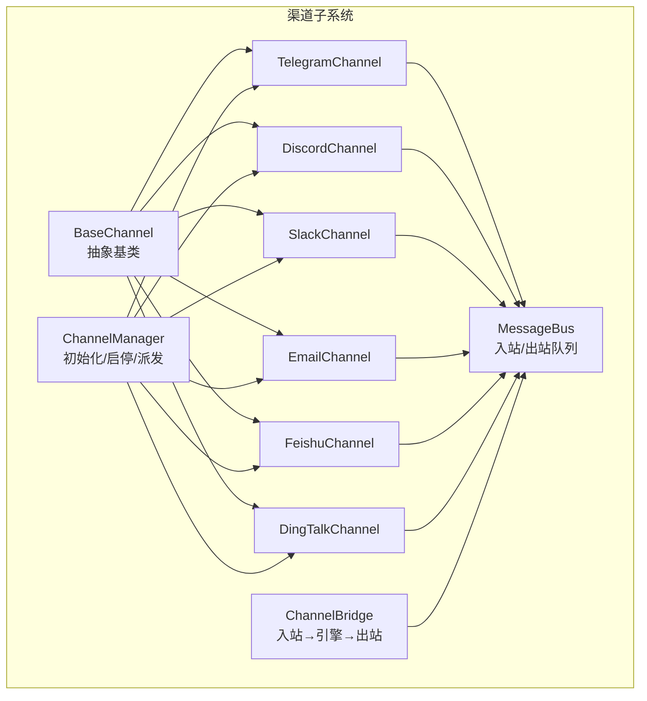
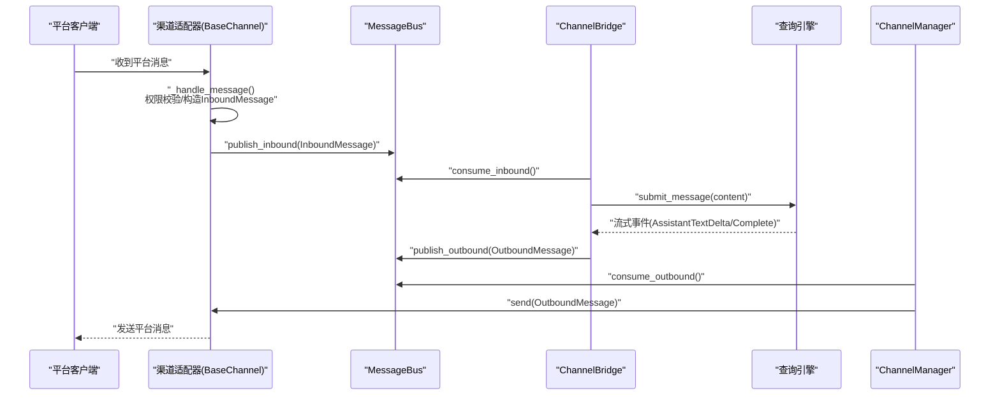
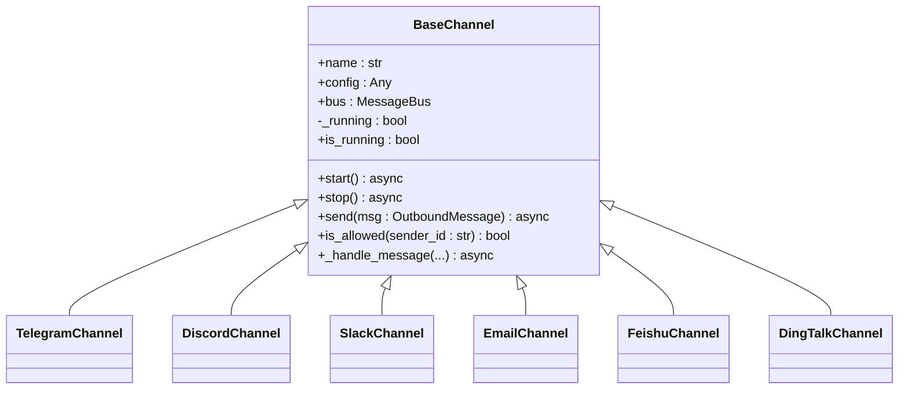
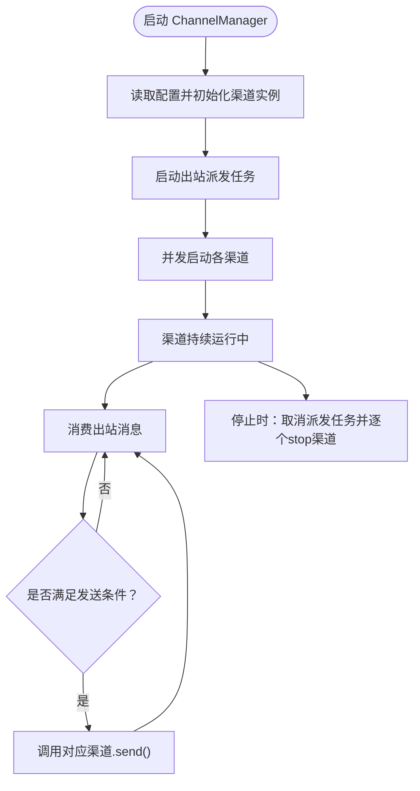
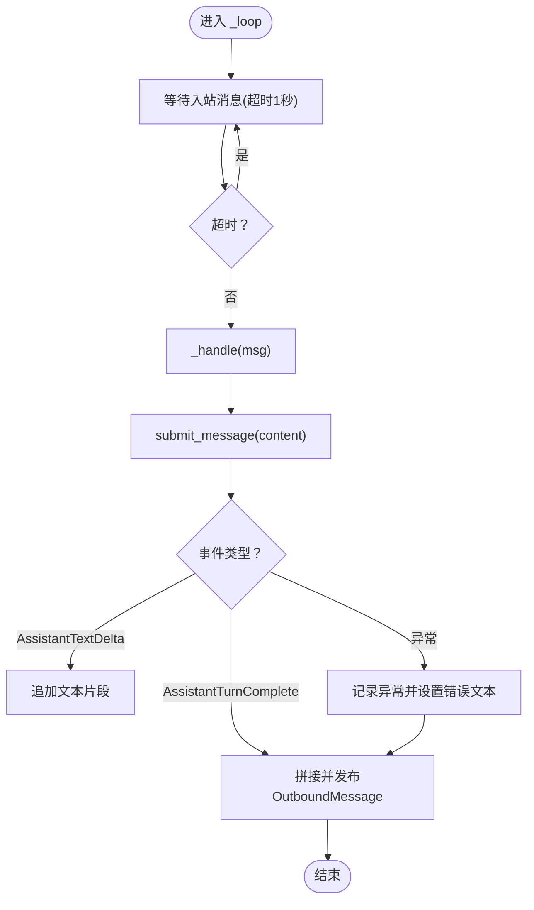
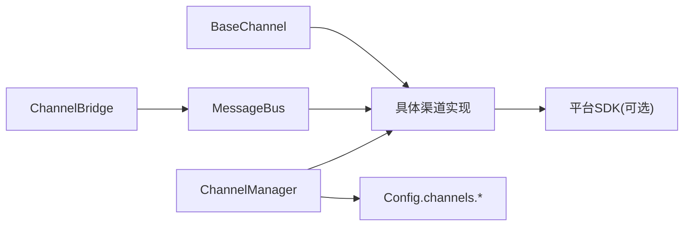

# 自定义渠道开发

<cite>
**本文引用的文件**
- [channels/__init__.py](file://src/openharness/channels/__init__.py)
- [channels/adapter.py](file://src/openharness/channels/adapter.py)
- [channels/bus/__init__.py](file://src/openharness/channels/bus/__init__.py)
- [channels/bus/events.py](file://src/openharness/channels/bus/events.py)
- [channels/bus/queue.py](file://src/openharness/channels/bus/queue.py)
- [channels/impl/base.py](file://src/openharness/channels/impl/base.py)
- [channels/impl/manager.py](file://src/openharness/channels/impl/manager.py)
- [channels/impl/telegram.py](file://src/openharness/channels/impl/telegram.py)
- [channels/impl/discord.py](file://src/openharness/channels/impl/discord.py)
- [channels/impl/slack.py](file://src/openharness/channels/impl/slack.py)
- [channels/impl/email.py](file://src/openharness/channels/impl/email.py)
- [channels/impl/feishu.py](file://src/openharness/channels/impl/feishu.py)
- [channels/impl/dingtalk.py](file://src/openharness/channels/impl/dingtalk.py)
- [config/schema.py](file://src/openharness/config/schema.py)
- [test_channels/test_base.py](file://tests/test_channels/test_base.py)
- [CONTRIBUTING.md](file://CONTRIBUTING.md)
</cite>

## 目录
1. [简介](#简介)
2. [项目结构](#项目结构)
3. [核心组件](#核心组件)
4. [架构总览](#架构总览)
5. [详细组件分析](#详细组件分析)
6. [依赖关系分析](#依赖关系分析)
7. [性能考量](#性能考量)
8. [故障排查指南](#故障排查指南)
9. [结论](#结论)
10. [附录](#附录)

## 简介
本指南面向希望在 OpenHarness 中开发“自定义渠道”的工程师与集成人员。文档围绕 BaseChannel 基类的设计原则与继承规范，系统讲解渠道适配器的开发流程（接口实现、消息处理、错误处理）、生命周期管理、状态同步、并发处理、测试与部署最佳实践，并提供可直接复用的开发模板与参考实现。

## 项目结构
OpenHarness 的渠道子系统采用“消息总线 + 渠道适配器 + 查询引擎桥接”的分层设计：
- 消息总线：Inbound/Outbound 队列解耦上游渠道与下游查询引擎。
- 渠道适配器：实现 BaseChannel 抽象，负责连接具体平台、解析消息、转发到总线；同时接收总线出站消息并发送至平台。
- 查询引擎桥接：ChannelBridge 将入站消息提交给查询引擎，聚合流式事件后发布出站消息。
- 渠道管理器：ChannelManager 负责按配置初始化、启动/停止各渠道，并调度出站消息派发。

图表来源
- [channels/impl/manager.py:17-258](file://src/openharness/channels/impl/manager.py#L17-L258)
- [channels/impl/base.py:34-142](file://src/openharness/channels/impl/base.py#L34-L142)
- [channels/impl/telegram.py:95-526](file://src/openharness/channels/impl/telegram.py#L95-L526)
- [channels/impl/discord.py:24-312](file://src/openharness/channels/impl/discord.py#L24-L312)
- [channels/impl/slack.py:21-285](file://src/openharness/channels/impl/slack.py#L21-L285)
- [channels/impl/email.py:27-411](file://src/openharness/channels/impl/email.py#L27-L411)
- [channels/impl/feishu.py:1-200](file://src/openharness/channels/impl/feishu.py#L1-L200)
- [channels/impl/dingtalk.py:93-446](file://src/openharness/channels/impl/dingtalk.py#L93-L446)
- [channels/adapter.py:29-132](file://src/openharness/channels/adapter.py#L29-L132)
- [channels/bus/queue.py:8-45](file://src/openharness/channels/bus/queue.py#L8-L45)

章节来源
- [channels/__init__.py:1-23](file://src/openharness/channels/__init__.py#L1-L23)
- [channels/bus/__init__.py:1-7](file://src/openharness/channels/bus/__init__.py#L1-L7)

## 核心组件
- BaseChannel：定义渠道适配器必须实现的接口（start/stop/send），以及统一的消息入口 _handle_message、访问控制 is_allowed、运行状态 is_running 等。
- MessageBus：异步队列封装，提供 publish/consume 入站/出站消息能力。
- InboundMessage/OutboundMessage：消息载体，包含渠道标识、会话键、内容、媒体、元数据等。
- ChannelBridge：持续消费入站消息，调用查询引擎，聚合流式事件后发布出站消息。
- ChannelManager：根据配置初始化各渠道实例，统一启动/停止与出站派发。

章节来源
- [channels/impl/base.py:34-142](file://src/openharness/channels/impl/base.py#L34-L142)
- [channels/bus/events.py:8-39](file://src/openharness/channels/bus/events.py#L8-L39)
- [channels/bus/queue.py:8-45](file://src/openharness/channels/bus/queue.py#L8-L45)
- [channels/adapter.py:29-132](file://src/openharness/channels/adapter.py#L29-L132)
- [channels/impl/manager.py:17-258](file://src/openharness/channels/impl/manager.py#L17-L258)

## 架构总览
下图展示了从渠道到查询引擎再到渠道发送的完整链路，以及 ChannelManager 的出站派发逻辑。

图表来源
- [channels/impl/base.py:96-137](file://src/openharness/channels/impl/base.py#L96-L137)
- [channels/bus/queue.py:20-34](file://src/openharness/channels/bus/queue.py#L20-L34)
- [channels/adapter.py:78-132](file://src/openharness/channels/adapter.py#L78-L132)
- [channels/impl/manager.py:209-239](file://src/openharness/channels/impl/manager.py#L209-L239)

## 详细组件分析

### BaseChannel 设计与继承规范
- 必须实现的抽象方法
  - start：建立与平台的长连接或轮询循环，监听消息并调用 _handle_message 转发到总线。
  - stop：优雅关闭连接、清理资源、取消后台任务。
  - send：将 OutboundMessage 发送到平台。
- 统一入口与安全
  - _handle_message：完成权限校验（is_allowed）与 InboundMessage 构造，再通过 bus.publish_inbound 推送。
  - is_allowed：支持空列表拒绝所有、通配符允许所有、或基于多源身份的白名单匹配。
- 运行状态与工具函数
  - is_running：用于 ChannelManager 获取状态。
  - resolve_channel_media_dir：统一渠道媒体下载目录，优先 OHMO 工作区附件目录，否则回退到数据目录下的 media 子目录。

图表来源
- [channels/impl/base.py:34-142](file://src/openharness/channels/impl/base.py#L34-L142)
- [channels/impl/telegram.py:95-526](file://src/openharness/channels/impl/telegram.py#L95-L526)
- [channels/impl/discord.py:24-312](file://src/openharness/channels/impl/discord.py#L24-L312)
- [channels/impl/slack.py:21-285](file://src/openharness/channels/impl/slack.py#L21-L285)
- [channels/impl/email.py:27-411](file://src/openharness/channels/impl/email.py#L27-L411)
- [channels/impl/feishu.py:1-200](file://src/openharness/channels/impl/feishu.py#L1-L200)
- [channels/impl/dingtalk.py:93-446](file://src/openharness/channels/impl/dingtalk.py#L93-L446)

章节来源
- [channels/impl/base.py:34-142](file://src/openharness/channels/impl/base.py#L34-L142)
- [test_channels/test_base.py:1-28](file://tests/test_channels/test_base.py#L1-L28)

### ChannelManager 生命周期与状态同步
- 初始化：依据配置启用各渠道，动态导入对应实现类并实例化，记录到 channels 字典。
- 启动：先启动出站派发任务，再并发启动各渠道；对启动异常进行捕获并记录 last_error。
- 停止：取消出站派发任务，逐个调用渠道 stop 并记录日志。
- 出站派发：从总线消费 OutboundMessage，按配置过滤进度/工具提示消息，按 channel 名称路由到对应渠道的 send 方法。
- 状态查询：返回每个已启用渠道的运行状态。

图表来源
- [channels/impl/manager.py:171-239](file://src/openharness/channels/impl/manager.py#L171-L239)

章节来源
- [channels/impl/manager.py:17-258](file://src/openharness/channels/impl/manager.py#L17-L258)

### ChannelBridge 消息处理与错误处理
- 主循环：定时等待入站消息，处理异常但不中断循环。
- 处理流程：调用查询引擎 submit_message，累积 AssistantTextDelta，Turn 完成后发布 OutboundMessage。
- 错误处理：引擎异常时记录日志并返回统一错误提示文本；空回复跳过发布。

图表来源
- [channels/adapter.py:78-132](file://src/openharness/channels/adapter.py#L78-L132)

章节来源
- [channels/adapter.py:29-132](file://src/openharness/channels/adapter.py#L29-L132)

### 渠道适配器开发模板与实现要点
以下为通用开发模板与实现清单，可直接参考现有实现（如 Telegram/Discord/Slack/Email/Feishu/DingTalk）：

- 基类继承与名称
  - 继承 BaseChannel，设置 name 属性为渠道唯一标识。
- 构造函数
  - 保存 config、bus；必要时注入第三方 SDK 客户端；初始化内部状态（如 typing 任务、媒体缓冲等）。
- start
  - 建立与平台的连接或轮询；注册事件回调；保持运行循环；注意异常捕获与日志。
- stop
  - 取消所有后台任务；关闭 SDK 客户端；释放资源。
- send
  - 将 OutboundMessage 转换为平台消息格式；处理媒体上传；处理进度/草稿/回复参数；失败时记录日志。
- 权限与会话
  - 使用 is_allowed 控制访问；利用 InboundMessage.session_key 或 session_key_override 实现会话隔离。
- 媒体处理
  - 下载/上传媒体文件；使用 resolve_channel_media_dir 获取本地存储路径；注意大小限制与类型映射。
- 并发与稳定性
  - 对外暴露 is_running；对长连接/心跳/重连进行健壮性处理；避免阻塞主循环。

章节来源
- [channels/impl/base.py:34-142](file://src/openharness/channels/impl/base.py#L34-L142)
- [channels/impl/telegram.py:95-526](file://src/openharness/channels/impl/telegram.py#L95-L526)
- [channels/impl/discord.py:24-312](file://src/openharness/channels/impl/discord.py#L24-L312)
- [channels/impl/slack.py:21-285](file://src/openharness/channels/impl/slack.py#L21-L285)
- [channels/impl/email.py:27-411](file://src/openharness/channels/impl/email.py#L27-L411)
- [channels/impl/feishu.py:1-200](file://src/openharness/channels/impl/feishu.py#L1-L200)
- [channels/impl/dingtalk.py:93-446](file://src/openharness/channels/impl/dingtalk.py#L93-L446)

### 典型渠道实现要点对比
- Telegram
  - 长轮询 + 命令菜单；媒体组聚合；语音转写；Markdown→HTML 转换；打字指示。
- Discord
  - WebSocket 网关 + 心跳；REST API 发送；速率限制重试；提及策略；打字指示。
- Slack
  - Socket Mode；消息/提及事件；mrkdwn 转换；线程回复；反应标记。
- Email
  - IMAP 轮询；SMTP 发送；主题与引用链；自动回复策略；UID 去重。
- Feishu
  - WebSocket SDK；提及检测；群策略（开放/提及/托管）；媒体下载。
- DingTalk
  - Stream Mode 接收；HTTP API 发送；Token 管理；后台任务去重。

章节来源
- [channels/impl/telegram.py:95-526](file://src/openharness/channels/impl/telegram.py#L95-L526)
- [channels/impl/discord.py:24-312](file://src/openharness/channels/impl/discord.py#L24-L312)
- [channels/impl/slack.py:21-285](file://src/openharness/channels/impl/slack.py#L21-L285)
- [channels/impl/email.py:27-411](file://src/openharness/channels/impl/email.py#L27-L411)
- [channels/impl/feishu.py:1-200](file://src/openharness/channels/impl/feishu.py#L1-L200)
- [channels/impl/dingtalk.py:93-446](file://src/openharness/channels/impl/dingtalk.py#L93-L446)

## 依赖关系分析
- 组件耦合
  - 渠道适配器仅依赖 BaseChannel 与 MessageBus，耦合度低，便于扩展。
  - ChannelManager 动态导入各渠道实现，降低编译期依赖。
  - ChannelBridge 仅依赖 MessageBus 与查询引擎接口，职责单一。
- 外部依赖
  - 各平台 SDK（如 telegram、websockets、httpx、slack-sdk、dingtalk-stream 等）按需安装。
- 配置契约
  - 所有渠道共享基础配置模型（BaseChannelConfig），并通过 Config.channels 统一管理。

图表来源
- [channels/impl/base.py:34-142](file://src/openharness/channels/impl/base.py#L34-L142)
- [channels/impl/manager.py:35-153](file://src/openharness/channels/impl/manager.py#L35-L153)
- [channels/adapter.py:36-40](file://src/openharness/channels/adapter.py#L36-L40)
- [config/schema.py:26-119](file://src/openharness/config/schema.py#L26-L119)

章节来源
- [channels/impl/manager.py:35-153](file://src/openharness/channels/impl/manager.py#L35-L153)
- [config/schema.py:116-119](file://src/openharness/config/schema.py#L116-L119)

## 性能考量
- 队列背压与限速
  - 利用 MessageBus 的队列容量与 ChannelBridge 的超时等待，避免内存膨胀。
- 并发与资源池
  - Telegram 使用较大的连接池参数；Discord/Slack/Email 使用异步 HTTP 客户端与速率限制重试。
- 文本与媒体处理
  - 分片发送（split_message）与媒体下载/上传分离，减少单次 IO 压力。
- 会话与去重
  - Email 使用 UID 去重；Feishu/DingTalk 使用会话键或消息 ID；避免重复处理。
- 日志与可观测性
  - 统一 WARNING/ERROR 级别日志，保留关键上下文（sender_id、chat_id、错误栈）。

[本节为通用指导，无需列出具体文件来源]

## 故障排查指南
- 渠道无法启动
  - 检查配置项（token/app_token/proxy 等）是否正确；查看 ChannelManager 启动日志中的异常堆栈与 last_error。
- 消息未到达或未回复
  - 确认 is_allowed 白名单配置；检查 ChannelManager 的出站派发过滤开关（send_progress/send_tool_hints）。
- 平台错误与限流
  - Discord/Slack/Telegram 等均有各自的错误处理与重试机制；关注日志中的 WARNING/ERROR。
- 媒体下载/上传失败
  - 检查 resolve_channel_media_dir 的目录权限与磁盘空间；确认平台文件大小限制。
- 单元测试参考
  - 媒体目录解析行为可通过测试用例验证。

章节来源
- [channels/impl/manager.py:163-169](file://src/openharness/channels/impl/manager.py#L163-L169)
- [channels/impl/discord.py:105-126](file://src/openharness/channels/impl/discord.py#L105-L126)
- [channels/impl/telegram.py:509-513](file://src/openharness/channels/impl/telegram.py#L509-L513)
- [channels/impl/slack.py:108-107](file://src/openharness/channels/impl/slack.py#L108-L107)
- [test_channels/test_base.py:1-28](file://tests/test_channels/test_base.py#L1-L28)

## 结论
通过 BaseChannel 抽象与消息总线架构，OpenHarness 提供了清晰、可扩展的渠道接入范式。遵循本文的开发模板与最佳实践，可在保证安全性与稳定性的前提下快速实现新的渠道适配器，并与查询引擎无缝衔接。

[本节为总结，无需列出具体文件来源]

## 附录

### 开发模板（步骤清单）
- 创建类继承 BaseChannel，设置 name。
- 在构造函数中保存 config/bus，初始化 SDK 客户端与内部状态。
- 实现 start：建立连接/轮询，注册回调，保持运行循环。
- 实现 stop：取消任务、关闭客户端、释放资源。
- 实现 send：转换消息格式，处理媒体与进度参数，记录异常。
- 在 ChannelManager 中注册该渠道（可参考现有实现）。
- 编写配置模型（参考 config/schema.py 中的 BaseChannelConfig 与具体平台配置）。
- 补充单元测试（参考 test_channels/test_base.py）。

章节来源
- [channels/impl/base.py:34-142](file://src/openharness/channels/impl/base.py#L34-L142)
- [channels/impl/manager.py:35-153](file://src/openharness/channels/impl/manager.py#L35-L153)
- [config/schema.py:26-119](file://src/openharness/config/schema.py#L26-L119)
- [test_channels/test_base.py:1-28](file://tests/test_channels/test_base.py#L1-L28)

### 测试与调试建议
- 单元测试：验证媒体目录解析、配置加载、权限判断等。
- 集成测试：在沙箱环境启动 ChannelManager，模拟消息往返。
- 日志级别：开发阶段使用 DEBUG，生产使用 INFO/WARNING。
- 回归测试：CI 中包含 ruff 与 pytest 检查，确保代码风格与功能稳定。

章节来源
- [CONTRIBUTING.md:29-44](file://CONTRIBUTING.md#L29-L44)